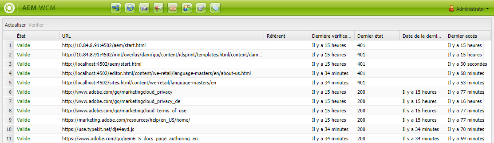

# Vérificateur de lien externe{#the-external-link-checker}

Un vérificateur de lien externe est fourni avec AEM. Le vérificateur de lien :

* analyse toutes les pages de contenu ;
* génère une liste de tous les liens valides et non valides ;
* marque les liens non valides comme rompus in situ dans les différentes pages de contenu.

## Validation des liens externes {#how-to-validate-external-links}

Pour utiliser le vérificateur de lien externe, procédez comme suit :

1. Avec la **navigation**, sélectionnez **Outils**, puis **Sites**.
1. Sélectionnez **Vérificateur de lien externe** et une liste de tous les liens externes est générée.
1. Validez un lien spécifique en le sélectionnant dans la liste, puis en cliquant sur **Vérifier** :

   

   Informations affichées :

   * **Statut** du lien
   * **URL**
   * **Référent**
   * Délai depuis que le lien a été **vérifié pour la dernière fois** (validé)
   * Le **dernier statut** renvoyé

   * Délai depuis que le lien a été **mis à disposition pour la dernière fois**
   * Délai depuis que le lien a été **consulté pour la dernière fois**

1. Dans les différentes pages de contenu, les liens non valides sont affichés comme étant rompus :

   