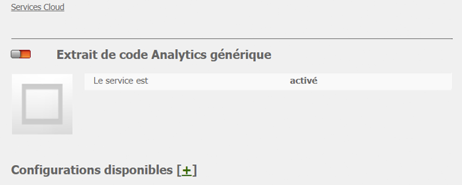
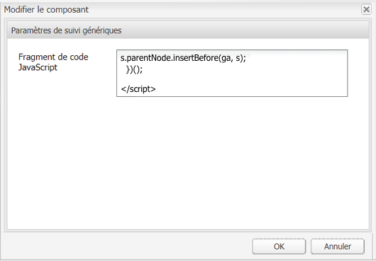
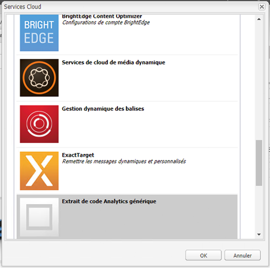
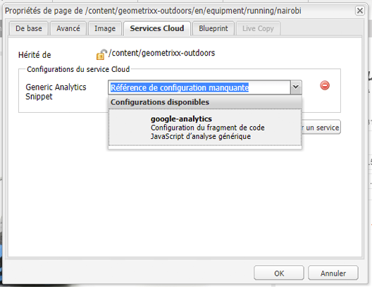

# Analytics avec des fournisseurs externes {#analytics-with-external-providers}

Analytics peut vous apporter des informations importantes et intéressantes sur l’utilisation de votre site web.

Diverses configurations prêtes à l&#39;emploi sont disponibles pour l&#39;intégration au service approprié, par exemple :

* [Adobe Analytics](/help/sites-administering/adobeanalytics.md)
* [Adobe Target](/help/sites-administering/target.md)

Vous pouvez également configurer votre propre instance des **Extrait de code Analytics générique** afin de définir de nouvelles configurations de service.

Les informations sont alors collectées au moyen de petits fragments de code, qui sont ajoutés à des pages web. Par exemple :

>[!CAUTION]
>
>Les scripts ne doivent pas se trouver entre des balises `script`.

```
var _gaq = _gaq || [];
_gaq.push(['_setAccount', 'UA-XXXXX-X']);
_gaq.push(['_trackPageview']);

(function() {
    var ga = document.createElement('script'); ga.type = 'text/javascript'; ga.async = true;
    ga.src = ('https:' == document.location.protocol ? 'https://ssl' : 'https://www') + '.google-analytics.com/ga.js';
    var s = document.getElementsByTagName('script')[0]; s.parentNode.insertBefore(ga, s);
})();
```

Ces fragments de code permettent de collecter des données et de générer des rapports. Les données réelles collectées dépendent du fournisseur et du fragment de code réel utilisé. Voici quelques exemples de statistiques :

* Nombre de visiteurs dans le temps
* Nombre de pages consultées
* Termes recherchés
* Pages d’entrée

>[!CAUTION]
>
>The Geometrixx-Outdoors demo site is configured so that the attributes provided in the Page Properties are appended to the html source code (just above the `</html>` endtag) in the corresponding `js` script.

>If your own `/apps` do not inherit from the default page component ( `/libs/foundation/components/page`) you (or your developers) have to make sure that the corresponding `js` scripts are included, for example by either including `cq/cloudserviceconfigs/components/servicescomponents`, or using a similar mechanism.
>
>Autrement, aucun des services (Générique, Analytics, Target, etc.) ne fonctionne.

## Création d’un service à l’aide d’un fragment de code générique {#creating-a-new-service-with-a-generic-snippet}

Pour la configuration de base :

1. Ouvrez la console **Outils**.
1. Dans le volet de gauche, développez **Configurations des services en cloud**.
1. Double-cliquez sur **Extrait de code Analytics générique** pour ouvrir la page :

   

1. Cliquez sur « + » pour ajouter une nouvelle configuration à l’aide de la boîte de dialogue. Au minimum, attribuez-lui un nom, par exemple, « google analytics » :

   

1. Cliquez sur **Créer**, la boîte de dialogue Fragment de code s’affiche immédiatement. Collez le fragment de code JavaScript approprié dans le champ :

   

1. Cliquez sur **OK** pour enregistrer.

## Utilisation de votre nouveau service dans des pages {#using-your-new-service-on-pages}

Après avoir créé la configuration de service, vous devez maintenant configurer les pages nécessaires pour l’utiliser :

1. Accédez à la page.
1. Ouvre **Propriétés de page** dans le Sidekick, puis l’onglet **Services cloud**.
1. Cliquez sur **Ajouter un service**, puis sélectionnez le service nécessaire, par exemple, **Extrait de code Analytics générique** :

   

1. Cliquez sur **OK** pour enregistrer.
1. Vous revenez sur l’onglet **Services cloud**. The **Generic Analytics Snippet** is now listed with the message `Configuration reference missing`. Utilisez la liste déroulante pour sélectionner votre instance de service spécifique, par exemple, « google-analytics » :

   

1. Cliquez sur **OK** pour enregistrer.

   Le fragment de code est maintenant visible si vous affichez la source de la page.

   Après un certain temps, vous pourrez voir les statistiques collectées.

   >[!NOTE]
   Si la configuration est associée à une page qui contient des pages enfants, ces pages héritent elles aussi du service.
