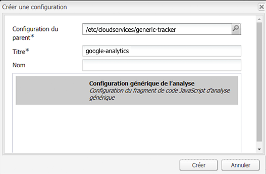

# Analytics avec des fournisseurs externes {#analytics-with-external-providers}

Analytics peut vous apporter des informations importantes et intéressantes sur l’utilisation de votre site web.

Différentes configurations sont disponibles par défaut pour l’intégration au service approprié, par exemple :

* [Adobe Analytics](/help/sites-administering/adobeanalytics.md)
* [Adobe Target](/help/sites-administering/target.md)

Vous pouvez également configurer votre propre instance de la variable **Fragments de code Analytics générique** pour définir de nouvelles configurations de service.

Les informations sont alors collectées au moyen de petits fragments de code, qui sont ajoutés à des pages web. Par exemple :

>[!CAUTION]
>
>Les scripts ne doivent pas se trouver entre des balises `script`.

```
var _gaq = _gaq || [];
_gaq.push(['_setAccount', 'UA-XXXXX-X']);
_gaq.push(['_trackPageview']);

(function() {
    var ga = document.createElement('script'); ga.type = 'text/javascript'; ga.async = true;
    ga.src = ('https:' == document.location.protocol ? 'https://ssl' : 'https://www') + '.google-analytics.com/ga.js';
    var s = document.getElementsByTagName('script')[0]; s.parentNode.insertBefore(ga, s);
})();
```

Ces fragments de code permettent de collecter des données et de générer des rapports. Les données réelles collectées dépendent du fournisseur et du fragment de code réel utilisé. Voici des exemples de statistiques :

* combien de visiteurs au fil du temps
* le nombre de pages visitées
* termes de recherche utilisés
* landing pages

>[!CAUTION]
>
>Le site de démonstration de Geometrixx-Outdoors est configuré de manière à ajouter les attributs indiqués dans Propriétés de la page au code source (juste avant la balise de fin `</html>`) dans le script `js` correspondant.
>
>Si votre propre dossier `/apps` n’hérite pas du composant Page par défaut (`/libs/foundation/components/page`), vous (ou les développeurs) devez vous assurer que les scripts `js` sont inclus, par exemple, en incluant `cq/cloudserviceconfigs/components/servicescomponents` ou en utilisant un mécanisme similaire.
>
>Autrement, aucun des services (Générique, Analytics, Target, etc.) ne fonctionne.

## Création d’un service à l’aide d’un fragment de code générique {#creating-a-new-service-with-a-generic-snippet}

Pour la configuration de base, suivez les étapes suivantes :

1. Ouvrez la console **Outils**.
1. Dans le volet de gauche, développez les **Configurations des Services cloud**.
1. Double-cliquez sur **Extrait de code Analytics générique** pour ouvrir la page :

   

1. Cliquez sur « + » pour ajouter une nouvelle configuration à l’aide de la boîte de dialogue. Au minimum, attribuez-lui un nom, par exemple, « google analytics » :

   

1. Cliquez sur **Créer**, la boîte de dialogue Fragment de code s’affiche immédiatement. Collez le fragment de code JavaScript approprié dans le champ :

   

1. Cliquez sur **OK** pour enregistrer.

## Utilisation de votre nouveau service dans des pages {#using-your-new-service-on-pages}

Après avoir créé la configuration de service, vous devez maintenant configurer les pages nécessaires pour l’utiliser :

1. Accédez à la page.
1. Ouvrez les **Propriétés de page** dans le sidekick, puis l’onglet **Services cloud**.
1. Cliquez sur **Ajouter un service**, puis sélectionnez le service nécessaire, par exemple, **Extrait de code Analytics générique** :

   

1. Cliquez sur **OK** pour enregistrer.
1. Vous revenez sur l’onglet **Services cloud**. Le **fragment de code Analytics générique** figure maintenant dans la liste avec le message `Configuration reference missing`. Utilisez la liste déroulante pour sélectionner votre instance de service spécifique, par exemple, « google-analytics » :

   

1. Cliquez sur **OK** pour enregistrer.

   Le fragment de code s’affiche désormais si vous affichez la source de la page.

   Une fois la période appropriée écoulée, vous pourrez visualiser les statistiques qui ont été collectées.

   >[!NOTE]
   >
   >Si la configuration est associée à une page qui contient des pages enfants, ces pages héritent elles aussi du service.
