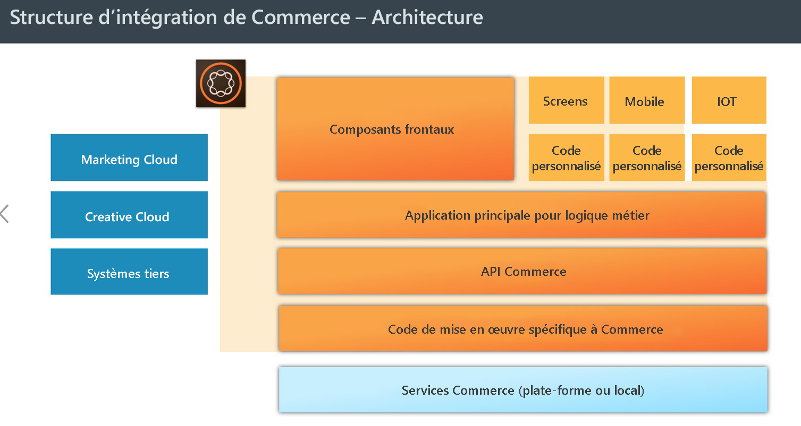
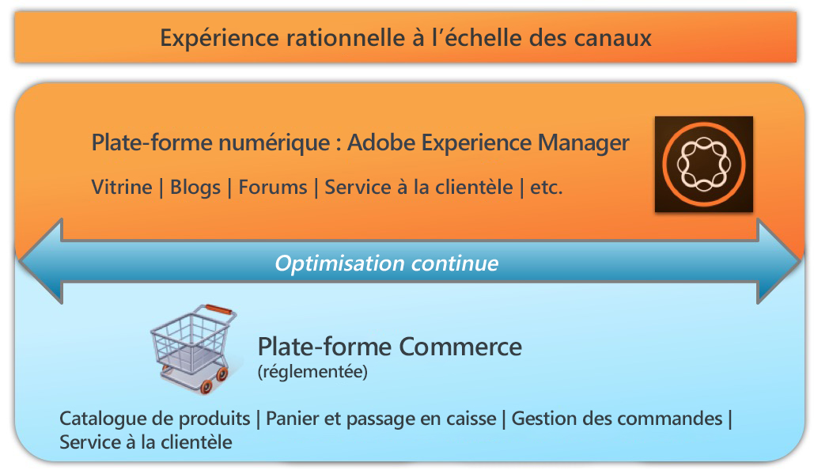

# AEM Commerce – Préparation pour le RGPD{#aem-commerce-gdpr-readiness}

>[!IMPORTANT]
>
>Le RGPD est utilisé comme exemple dans les sections ci-dessous, mais les détails couverts sont applicables à toutes les réglementations relatives à la protection des données et à la protection de la vie privée ; comme le RGPD, l&#39;ACCP, etc.

Le règlement général sur la protection des données (RGPD) de l’Union européenne sur les droits de confidentialité des données entre en vigueur en mai 2018. Pour plus d’informations, voir la [page RGPD du centre de traitement des données personnelles d’Adobe](https://www.adobe.com/fr/privacy/general-data-protection-regulation.html).

>[!NOTE]
>
>Voir [Préparation d’AEM pour le RGPD](/help/managing/data-protection-and-privacy.md) pour plus de détails.

Dans nos intégrations Commerce prêtes à l’emploi, AEM représente la couche d’expérience, utilisant des services et renvoyant des données vers la plate-forme commerciale du client qui s’exécute sans interface utilisateur.

For some commerce platforms, we store profile information ( `/home/users`) and commerce tokens (to login in the commerce platform) in AEM. Pour ces cas d’utilisation, consultez [Traitement des demandes RGPD pour la plate-forme AEM](/help/sites-administering/handling-gdpr-requests-for-aem-platform.md).

## Traitement des demandes RGPD pour AEM Commerce {#handling-gdpr-requests-for-aem-commerce}

En ce qui concerne l’intégration de Salesforce Commerce Cloud, AEM Commerce ne stocke aucune information relevant du RGPD. Vous devriez transférer la demande au [Salesforce Cloud](https://documentation.demandware.com/).

Pour les intégrations d’hybris et d’IBM WebSphere, il existe des données dans AEM. Vous devriez utiliser les [instructions relatives au RGPD pour la plate-forme AEM](/help/sites-administering/handling-gdpr-requests-for-aem-platform.md) et vous poser les questions suivantes :

1. **Où mes données sont-elles stockées/utilisées ?** Les informations de profil utilisateur mises en cache comme le nom, l’identifiant de l’utilisateur commercial, le jeton, le mot de passe, les coordonnées, etc. sont affichées à partir d’AEM.
1. **Avec qui partager les données couvertes par le RGPD ?** Aucune mise à jour des données relevant du RGPD dans AEM Commerce n’est enregistrée (à l’exception des données de profil appropriées, comme indiqué ci-dessus), elles sont en effet traitées par proxy sur la plate-forme commerciale.
1. **Comment supprimer mes données utilisateur** ? Supprimez le profil utilisateur dans AEM et appelez à la suppression d’utilisateur sur la plate-forme commerciale.

>[!NOTE]
>
>Consultez le [wiki hybris](https://wiki.hybris.com/) ou la [documentation de WebSphere Commerce](https://www-01.ibm.com/support/docview.wss?uid=swg27036450) si nécessaire.

