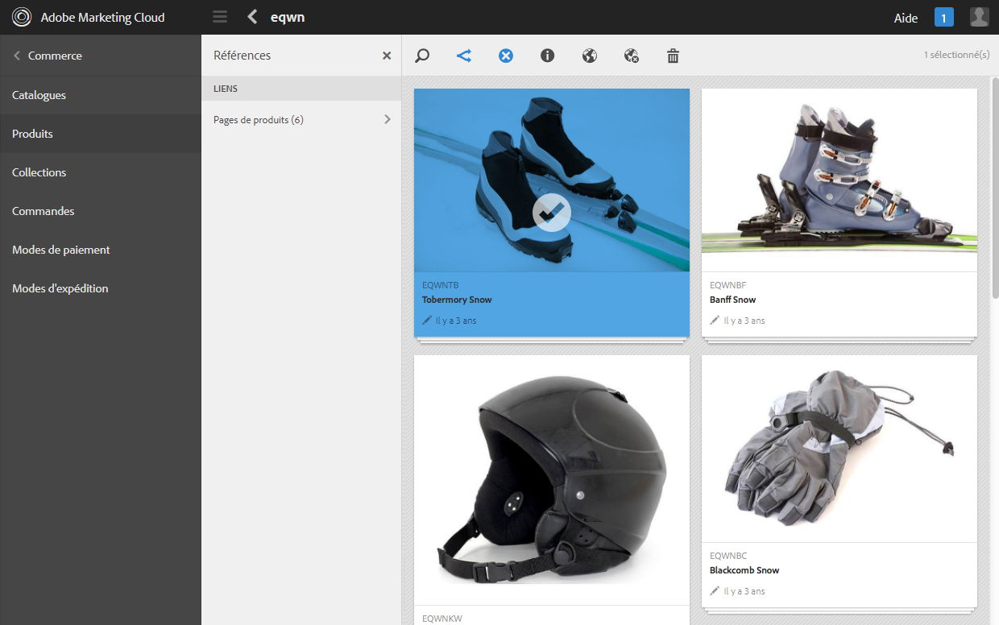
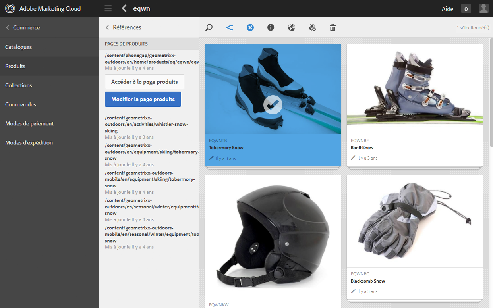
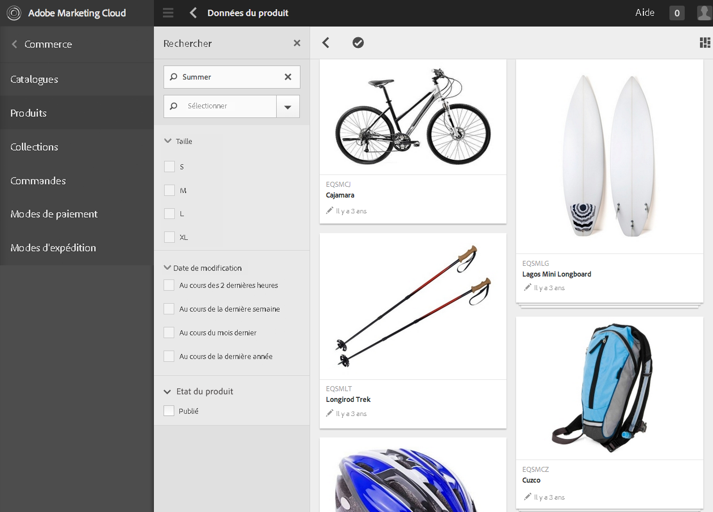
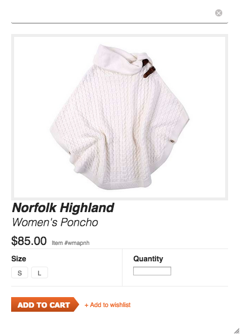
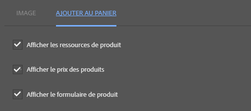
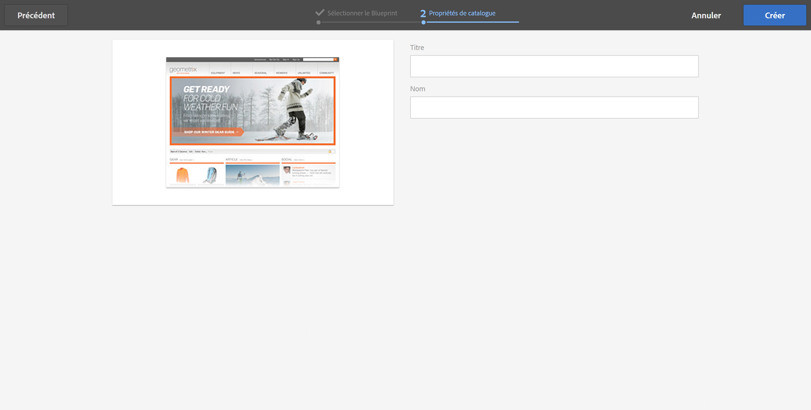
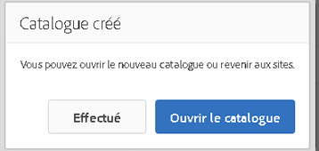
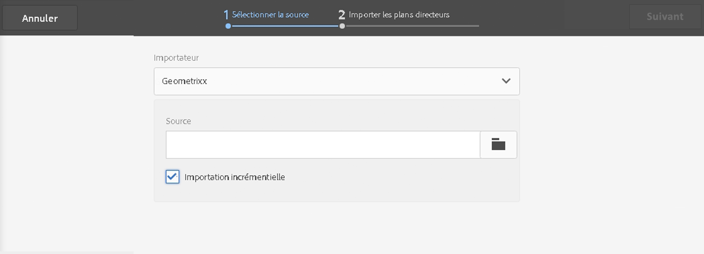

# Administration de la solution eCommerce générique {#administering-generic-ecommerce}

La solution AEM générique fournit des méthodes pour gérer les informations commerciales conservées dans le référentiel (plutôt que d’utiliser un moteur d’e-commerce externe). Cela inclut :

* [Produits](/help/sites-administering/concepts.md#products)
* [Variantes de produit](/help/sites-administering/concepts.md#product-variants)
* [Catalogue(s)](/help/sites-administering/concepts.md#catalogs)
* [Promotions](/help/sites-administering/concepts.md#promotions)
* [Bons](/help/sites-administering/concepts.md#vouchers)
* [Commandes](/help/sites-administering/concepts.md#shopping-cart-and-orders)
* [Pages proxy](/help/sites-administering/concepts.md#proxy-pages)

>[!NOTE]
>
>L’installation standard d’AEM inclut une mise en œuvre générique d’eCommerce (JCR) AEM.
>
>Pour le moment, elle est utilisée à des fins de démonstration ou comme base d’une mise en œuvre personnalisée selon vos besoins.

## Produits et variantes de produit  {#products-and-product-variations}

>[!NOTE]
>
>Les procédures suivantes s’appliquent à la fois aux produits et aux variantes de produit.

Avant de créer des produits, vous devez définir un [modèle](/help/sites-authoring/scaffolding.md) ou scaffolding. Celui-ci spécifie les champs que vous devez définir pour les produits et la façon de les modifier.

Un modèle est nécessaire pour chaque type de produit distinct. Le modèle approprié est associé aux produits par :

* path
* ou le produit peut référencer le modèle.

>[!NOTE]
>
>Le magasin Geometrixx-Outdoors dispose d’un type de produit unique (et par conséquent d’un modèle simple) :
>
>`/etc/scaffolding/geometrixx-outdoors`
>
>Le type de produit Geometrixx-Outdoors est actif sur :
>
>`/etc/commerce/products/geometrixx-outdoors`
>
>Vous pouvez créer une définition de produit n’importe où sous cet emplacement sans aucune configuration supplémentaire.

### Importation de produits  {#importing-products}

#### Importation de produits – IU optimisée pour les écrans tactiles {#importing-products-touch-optimized-ui}

1. Accédez à la console **Produits** via **Commerce**.
1. À l’aide de la console **Produits**, accédez à l’emplacement souhaité.
1. Utilisez l’icône **Importer les produits** pour ouvrir l’assistant.

   

1. Précisez les paramètres suivants :

   * **Importateur**

      L&#39;importateur pour le fournisseur de commerce [spécifique](/help/sites-administering/concepts.md#commerce-providers), par défaut `Geometrixx`.

   * **Source**

      Le fichier que vous voulez importer. Vous pouvez utiliser le navigateur pour sélectionner un fichier.

   * **Importation incrémentielle**

      Indiquez s’il s’agit d’une importation incrémentielle (par opposition à complète).
   >[!NOTE]
   >
   >L’importation incrémentielle (par l’importateur geometrixx-outdoor d’exemple) fonctionne au niveau des produits.
   >
   >Un importateur personnalisé peut être défini pour être utilisé selon vos besoins.

1. Cliquez sur **Suivant** pour importer les produits, un journal des actions réalisées s’affiche.

   >[!NOTE]
   >
   >Les produits sont importés dans l’emplacement actuel ou dans un emplacement relatif.

   >[!NOTE]
   >
   >L’utilisation répétée de **Suivant** et **Retour** permet d’importer les définitions de produits de manière répétée. Cependant, dans la mesure où ils ont les mêmes SKU, les informations figurant dans le référentiel sont simplement remplacées.

1. Sélectionnez **Terminé** pour fermer l’assistant.

#### Importation de produits – IU classique  {#importing-products-classic-ui}

1. À l’aide de la console **Outils**, ouvrez le dossier **Commerce**.
1. Double-cliquez pour ouvrir l’**Importateur de produit** :

   

1. Précisez les paramètres suivants :

   * **Nom de la boutique**

      Les produits seront importés dans :

      `/etc/commerce/products/<*store name*>/`

   * **Fournisseur de commerce**

      l&#39;importateur de votre [fournisseur commercial](/help/sites-administering/concepts.md#commerce-providers); par Geometrixx par défaut.

   * **Fichier source**

      Emplacement du fichier à importer dans le référentiel.

   * **Importation incrémentielle**

      Indiquez s’il s’agit d’une importation incrémentielle (par opposition à complète).

1. Cliquez sur **Importer les produits**.

### Création d’informations sur les produits  {#creating-product-information}

>[!NOTE]
>
>La gestion des produits standard est basique, car le jeu de produits Geometrixx-Outdoors a également été défini de manière basique. La complexité est basée sur le produit [échafaudage](/help/sites-authoring/scaffolding.md), de sorte qu&#39;avec votre propre échafaudage de produit, il est possible de réaliser des modifications plus sophistiquées.

#### Création d’informations sur les produits – IU optimisée pour les écrans tactiles {#creating-product-information-touch-optimized-ui}

1. À l’aide de la console **Produits** (via **Commerce**), accédez à l’emplacement souhaité.
1. Utilisez l’icône **Créer** pour sélectionner au choix (selon la structure et l’emplacement) :

   * **Créer un produit**
   * **Créer une variante de produit**

   

1. Un assistant s’ouvre. Utilisez les onglets **Basique** et **Produit** afin de saisir les [attributs de produit](/help/sites-administering/concepts.md#product-attributes) pour le nouveau produit ou la nouvelle variante de produit.

   >[!NOTE]
   >
   >Le **Titre** et le **SKU** constituent le minimum requis pour créer un produit ou une variante.

1. Sélectionnez **Créer** pour enregistrer les informations.

>[!NOTE]
>
>De nombreux produits sont proposés dans différentes couleurs et/ou différentes tailles. Les informations sur le produit de base et les variantes de produit associées peuvent être gérées à partir de la console **Produits**.
>
>Les produits et leurs variantes sont stockés sous la forme d’une arborescence, les informations sur les produits figurent en haut, et les variantes en dessous (cette structure est imposée par l’IU).

### Modification des informations sur les produits  {#editing-product-information}

>[!NOTE]
>
>Les images des produits dans geometrixx-outdoors sont traitées à partir de :
>
>`/etc/commerce/products/...`
>
>Cela signifie que, par défaut, elles sont bloquées par le [répartiteur](https://helpx.adobe.com/fr/experience-manager/dispatcher/using/dispatcher-configuration.html). Configurez-les donc selon vos besoins.

#### Modification des informations sur les produits – IU optimisée pour les écrans tactiles  {#editing-product-information-touch-optimized-ui}

1. À l’aide de la console **Produits** (via **Commerce**), accédez à vos informations sur les produits.
1. Utilisez :

   * les [actions rapides](/help/sites-authoring/basic-handling.md#quick-actions) ;
   * le [mode de sélection](/help/sites-authoring/basic-handling.md#navigating-and-selection-mode).

   Sélectionnez l’icône **Afficher les données du produit** :

   

1. Les [attributs de produit](/help/sites-administering/concepts.md#product-attributes) sont affichés. Utilisez **Modifier** et **Terminé** pour apporter des modifications.

### Affichage des références de produit {#showing-product-references}

#### Affichage des références de produit – IU optimisée pour les écrans tactiles {#showing-product-references-touch-optimized-ui}

1. À l’aide de la console **Produits** (via **Commerce**), accédez à vos informations sur les produits.
1. Ouvrez le rail secondaire pour les références à l’aide de l’icône :

   

1. Sélectionnez le produit requis ; le rail secondaire est mis à jour pour afficher les types de références disponibles :

   

1. Cliquez/appuyez sur le type de référence (par exemple, pages du produit) pour développer la liste.
1. Sélectionnez une référence spécifique pour afficher les options suivantes :

   * Accéder à la page produits
   * Modifier la page produits

   

### Rechercher des produits {#search-for-products}

1. Accédez à la console **Produits** via **Commerce**.
1. Ouvrez le rail secondaire pour rechercher à l’aide de l’icône :

   

1. Plusieurs facettes sont disponibles pour rechercher des produits. Vous pouvez utiliser une ou plusieurs facettes dans une recherche. Les produits trouvés s’affichent :

   

1. Cliquez/appuyez sur un produit pour l’ouvrir. Vous pouvez également le publier ou afficher ses données.

#### Extension d’une recherche  {#extending-search}

Vous pouvez modifier une facette existante ou en ajouter de nouvelles à l’aide de CRXDE Lite :

1. Accédez à:

   `http://localhost:4502/crx/de/index.jsp#/libs/commerce/gui/content/products/aside/items/search/items/searchpanel/facets`

1. Vous pouvez par exemple modifier les tailles qui apparaissent sur la page de recherche de produits. Cliquez sur le noeud `sizegroup`.
1. Cliquez sur le noeud `items`, puis sur le noeud `propertypredicate`.
1. Vous pouvez modifier le `propertyValues`. Par exemple, vous pouvez ajouter XS ou XXL, ou supprimer une taille.
1. Cliquez sur **Enregistrer tout** et accédez à la page de recherche de produits. Vos modifications doivent s’afficher.

### Plusieurs ressources  {#multiple-assets}

Vous pouvez ajouter plusieurs ressources dans le composant de produit, puis spécifier les ressources qui apparaissent sur la page du produit.

>[!NOTE]
>
>Tout ce qui affecte plusieurs ressources est effectué dans l’IU optimisée pour les écrans tactiles.

#### Ajout de plusieurs ressources  {#adding-multiple-assets}

1. Accédez à la console **Produits** via **Commerce**.
1. A l&#39;aide de la console **Produits**, accédez au produit requis.

   >[!NOTE]
   >
   >Vous devez être au niveau du produit, et non d’une variante.

1. Appuyez/cliquez sur l’icône **Afficher les données du produit** avec le mode de sélection ou les actions rapides.
1. Appuyez/cliquez sur l’icône Modifier.
1. Faites défiler la page jusqu’à atteindre **Ajouter**.

   

1. Appuyez/cliquez sur **Ajouter**. Un nouvel espace réservé de ressource s’affiche.
1. Appuyez/cliquez sur **Modifier **ouvre une boîte de dialogue qui vous permet de choisir un fichier.
1. Sélectionnez la ressource que vous souhaitez ajouter.

   >[!NOTE]
   >
   >Les ressources que vous pouvez sélectionner se situent dans [Ressources](https://helpx.adobe.com/experience-manager/aem-previous-versions.html#assets).

1. Appuyez/cliquez sur l’icône Terminé.

Deux ressources sont désormais stockées dans votre composant de produit. Vous pouvez configurer celle qui apparaît sur la page du produit. Cela fonctionne avec un système de catégorie. Vous devez d’abord ajouter une catégorie aux ressources individuelles :

1. Appuyez/cliquez sur **Données du produit de la Vue**.
1. Saisissez une **Catégorie de ressources** sous les ressources, par exemple `cat1` et `cat2`.

   >[!NOTE]
   >
   >Vous pouvez également utiliser des balises pour les catégories.

1. Appuyez/cliquez sur l’icône Terminé. Vous devez maintenant [déployer](#rolling-out-a-catalog) vos modifications.

Désormais, vos ressources dans le composant de produit ont une catégorie. Vous pouvez configurer la catégorie qui est affichée à trois niveaux différents :

* [Page des produits](#product-page)
* [Catalogue](#catalog)
* [Console Produits](#products-console)

>[!NOTE]
>
>Si vous ne définissez pas de catégories, la première ressource est affichée sur la page produit.

Le mécanisme pour sélectionner l’image à afficher se présente comme suit :

1. Vérifiez si une catégorie est définie pour la page produit.
1. Dans le cas contraire, vérifiez si une catégorie est définie pour le catalogue.
1. Si ce n’est pas le cas, vérifiez si une catégorie est définie pour la console Produits.

>[!NOTE]
>
>Pour les niveaux de catalogue et de console Produits, vous devez déployer vos modifications afin d’appliquer les modifications et de voir la différence sur la page produit.

#### Page des produits {#product-page}

1. Accédez à la page produit.
1. **Modifiez** le composant de produit.
1. Saisissez la **catégorie d’image** choisie (`cat1`, par exemple).
1. Appuyez/cliquez sur **Terminé.** La page s’actualise et la ressource appropriée doit s’afficher.

#### Catalogue  {#catalog}

1. Accédez à votre catalogue.
1. Appuyez/cliquez sur **Afficher les propriétés**.
1. Appuyez/cliquez sur **Modifier**.
1. Appuyez/cliquez sur l’onglet **Ressources**.
1. Saisissez la **catégorie de ressources de produit** requise.
1. Appuyez/cliquez sur **Terminé.**
1. [Déployez](#rolling-out-a-catalog) vos modifications.

#### Console Produits {#products-console}

1. A l&#39;aide de la console **Produits**, accédez au produit requis.
1. Appuyez/cliquez sur **Données du produit de la Vue**.
1. Appuyez/cliquez sur **Modifier**.
1. Saisissez une **catégorie de ressources par défaut**.
1. Appuyez/cliquez sur **Terminé.**
1. [Déployez](#rolling-out-a-catalog) vos modifications.

### Publication/annulation de la publication des informations sur les produits  {#publishing-unpublishing-product-information}

#### Publication/annulation de la publication des informations sur les produits – IU optimisée pour les écrans tactiles {#publishing-unpublishing-product-information-touch-optimized-ui}

>[!NOTE]
>
>Souvent, les informations sur les produits sont publiées par les pages qui y font référence. Par exemple, lors de la publication de la page X qui fait référence au produit Y, AEM vous demandera si vous souhaitez également publier le produit Y.
>
>Dans certains cas, AEM prend également en charge la publication directe à partir des données du produit.

1. À l’aide de la console **Produits** (via **Commerce**), accédez à vos informations sur les produits.
1. Utilisez :

   * les [actions rapides](/help/sites-authoring/basic-handling.md#quick-actions) ;
   * le [mode de sélection](/help/sites-authoring/basic-handling.md#navigating-and-selection-mode).

   Sélectionnez l’icône **Modifier** ou **Annuler la publication** selon vos besoins :

    

   Les informations sur les produits sont publiées, ou leur publication est annulée, le cas échéant.

### Flux de produit {#product-feed}

L’intégration de Search &amp; Promote vous permet d’effectuer les opérations suivantes :

* d’utiliser l’API eCommerce, indépendamment de la structure de référentiel et de la plateforme de commerce sous-jacentes ;
* de tirer parti de la fonction de connecteur d’index de Search&amp;Promote pour constituer un flux de produit au format XML ;
* de tirer parti de la fonction de contrôle à distance de Search&amp;Promote pour effectuer des requêtes à la demande ou planifiées du flux de produit ;
* de générer des flux pour différents comptes Search&amp;Promote, configurés comme configurations de services cloud.

Pour plus d’informations, consulter [Flux de produit](/help/sites-administering/product-feed.md).

### Gestionnaire d’événements pour les mises à jour de produits  {#event-handler-for-product-updates}

Il existe un gestionnaire d’événements qui consigne un événement lorsqu’un produit est ajouté, modifié ou supprimé, et lorsqu’une page produit est ajoutée, modifiée ou supprimée. Il y a les événements OSGi suivants :

* `com/adobe/cq/commerce/pim/PRODUCT_ADDED`
* `com/adobe/cq/commerce/pim/PRODUCT_MODIFIED`
* `com/adobe/cq/commerce/pim/PRODUCT_DELETED`
* `com/adobe/cq/commerce/pim/PRODUCT_PAGE_ADDED`
* `com/adobe/cq/commerce/pim/PRODUCT_PAGE_MODIFIED`
* `com/adobe/cq/commerce/pim/PRODUCT_PAGE_DELETED`

Pour les événements `PRODUCT_*`, le chemin pointe vers le produit de base dans `/etc/commerce/products`. Pour les événements `PRODUCT_PAGE_*`, le chemin d’accès pointe vers le noeud `cq:Page`.

Vous pouvez les consulter dans la console Web des événements OSGI ( `/system/console/events`), par exemple :

>[!NOTE]
>
>Lisez également [Gestion des Événements dans AEM](https://blogs.adobe.com/experiencedelivers/experience-management/event_handling_incq/). 

### Image avec les liens Ajouter au panier {#image-with-add-to-cart-links}

Le composant Image avec les liens Ajouter au panier permet d’ajouter rapidement un produit au panier en créant une zone réactive associée à un produit sur une image.

Cliquez sur la zone réactive pour ouvrir une boîte de dialogue qui vous permet de choisir la taille et la quantité du produit.

1. Accédez à la page à laquelle vous souhaitez ajouter le composant.
1. Effectuez un glisser-déposer du composant dans la page.
1. Effectuez un glisser-déposer d’une image dans le composant à partir du [navigateur des ressources](/help/sites-authoring/author-environment-tools.md#assets-browser).
1. Vous pouvez effectuer l’une des actions suivantes :

   * cliquez sur le composant, puis sur l’icône Modifier
   * effectuer un double-clic lent.

1. Cliquez sur l’icône de plein écran.

   

1. Cliquez sur l’icône Lancer une Map.

   

1. Cliquez sur l’une des icônes de forme.

   

1. Modifiez et déplacez la forme selon vos besoins.
1. Cliquez sur la forme.
1. Cliquez sur l’icône Parcourir pour ouvrir le [Sélecteur de ressources](../assets/search-assets.md#assetpicker).

   >[!NOTE]
   >
   >Vous pouvez également saisir directement le chemin de produit qui doit être au niveau des produits, et non au niveau des variantes.

   

1. Cliquez sur l’icône de confirmation deux fois, puis cliquez sur Quitter le mode Plein écran.
1. Cliquez quelque part sur la page en regard du composant. La page doit se rafraîchir, et le symbole suivant doit apparaître sur votre image :

   

1. Basculez en mode [Aperçu](/help/sites-authoring/editing-content.md#previewingpagestouchoptimizedui).
1. Cliquez sur la zone sensible +. Une boîte de dialogue s’ouvre, dans laquelle vous pouvez choisir la taille et la quantité du produit que vous avez saisi dans **Chemin**.

   

1. Saisissez une taille et une quantité.
1. Cliquez sur le bouton Ajouter au panier. La boîte de dialogue se ferme.
1. Accédez à votre panier. Le produit doit être ici.

#### Options de configuration  {#configuration-options}

Vous pouvez configurer l’apparence de la boîte de dialogue lorsque vous cliquez sur la zone réactive :

1. Cliquez sur le composant et sur l’icône Configurer.

   

1. Faites défiler l’écran vers le bas. Il y a un onglet **AJOUTER AU PANIER**.

   

1. Cliquez sur **AJOUTER AU PANIER**. Il y a 3 options de configuration que vous pouvez utiliser.

   

1. Cliquez sur l’icône Terminé.

## Catalogues  {#catalogs}

### Génération d’un catalogue {#generating-a-catalog}

#### Génération d’un catalogue – IU optimisée pour les écrans tactiles {#generating-a-catalog-touch-optimized-ui}

>[!NOTE]
>
>Le catalogue référence vos données de produits.

Pour générer un catalogue :

1. Ouvrez la console Sites (par exemple, [http://localhost:4502/sites.html/content](http://localhost:4502/sites.html/content)).
1. Accédez à l’emplacement où créer la page.
1. Pour ouvrir la liste des options, utilisez l’icône **Créer** :

   

1. Dans la liste de sélection **Créer un catalogue**, l’assistant Créer un catalogue s’ouvre.

   

1. Accédez au plan directeur de catalogue.
1. Appuyez/cliquez sur le bouton **Sélectionner**, puis sur le plan directeur de catalogue requis.
1. Appuyez/cliquez sur **Suivant**.

   

1. Saisissez un **Titre** et un **Nom**.
1. Appuyez/cliquez sur le bouton **Créer**. Le catalogue est créé, et une boîte de dialogue s’ouvre.

   

1. Appuyez/cliquez sur le bouton **Terminé** pour revenir à la console Sites où vous pouvez voir votre catalogue.

   Appuyez/cliquez sur **Ouvrir le catalogue** pour ouvrir votre catalogue (par exemple `http://localhost:4502/editor.html/content/test-catalog.html`).

#### Génération d’un catalogue – IU classique {#generating-a-catalog-classic-ui}

>[!NOTE]
>
>Le catalogue référence vos [données de produits](#products-and-product-variants).

1. Dans la console **Sites web**, accédez à votre **blueprint de catalogue**, puis au catalogue de base.

   Par exemple :

   `http://localhost:4502/siteadmin#/content/catalogs/geometrixx-outdoors/base-catalog`

1. Créez une page à l’aide du modèle **Blueprint de section**.

   Par exemple, `Swimwear`.

1. Ouvrez la nouvelle page `Swimwear`, puis cliquez sur **Modifier le plan directeur** pour ouvrir la boîte de dialogue **Propriétés**, dans laquelle vous pouvez configurer la sélection **Produits**.

   Par exemple, ouvrez le champ **Balises / Mots-clés** pour sélectionner Activité, puis Swimming dans la section Geometrixx-Outdoors.

1. Cliquez sur **OK** pour enregistrer les propriétés ; les exemples de produits sont affichés sous **Critères de sélection des produits** sur la page de plan directeur.
1. Cliquez sur **Déployer les modifications**, sélectionnez **Déployer la page et toutes les sous-pages**, puis cliquez sur **Suivant** et **Déployer**. Une fois le déploiement terminé, l&#39;indicateur **Status** s&#39;affiche en vert.
1. Vous pouvez maintenant cliquer sur **Fermer** et vérifier la nouvelle section de catalogue, par exemple, à cette adresse et sous celle-ci :

   `http://localhost:4502/cf#/content/geometrixx-outdoors/en/swimwear.html`

1. À nouveau à partir de la page des plans directeurs, cliquez sur **Modifier Blueprint** et, dans la boîte de dialogue **Propriétés**, ouvrez l’onglet **Page générée**. Dans le champ de liste Bannière, sélectionnez l’image que vous souhaitez afficher, par exemple, `summer.jpg`.
1. Cliquez sur **OK** pour enregistrer les propriétés ; les informations de bannière sont affichées sous **Critères de sélection des produits** sur la page de plan directeur.
1. Déployez ces nouvelles modifications.

### Déploiement d’un catalogue  {#rolling-out-a-catalog}

#### Déploiement d’un catalogue – IU optimisée pour les écrans tactiles {#rolling-out-a-catalog-touch-optimized-ui}

Pour déployer un catalogue :

1. Accédez à la console **Catalogues** par **Commerce**.
1. Accédez au catalogue à déployer.
1. Utilisez :

   * les [actions rapides](/help/sites-authoring/basic-handling.md#quick-actions) ;
   * le [mode de sélection](/help/sites-authoring/basic-handling.md#navigating-and-selection-mode).

   Sélectionnez l’icône **Déployer les modifications** :

   

1. Dans l’assistant, définissez le déploiement selon les besoins, puis appuyez/cliquez sur **Modifications du déploiement**.
1. Une boîte de dialogue s’ouvre. Appuyez/cliquez sur **Terminé** une fois le processus terminé.

#### Déploiement d’un catalogue – IU classique {#rolling-out-a-catalog-classic-ui}

Pour déployer un catalogue :

1. Accédez au catalogue que vous souhaitez déployer. Par exemple :

   `http://localhost:4502/cf#/content/catalogs/geometrixx-outdoors/base-catalog.html`

1. Cliquez sur **Déployer les modifications**.
1. Définissez le déploiement selon vos besoins.
1. Cliquez sur **Déployer**.

### Importateur de plans directeurs {#blueprint-importer}

#### Importateur de plans directeurs – IU optimisée pour les écrans tactiles {#blueprint-importer-touch-optimized-ui}

1. Accédez à la console **Catalogues** par **Commerce**.
1. Accédez à l’emplacement où vous souhaitez importer le plan directeur de catalogue.
1. Appuyez/cliquez sur l’icône **Importer les plans directeurs**.

   

1. Dans l’assistant, sélectionnez la source selon vos besoins, puis appuyez/cliquez sur **Suivant**.

   

1. Appuyez/cliquez sur **Terminé** lorsque l’importation est terminée.

#### Importateur de plans directeurs – IU classique  {#blueprint-importer-classic-ui}

1. À l&#39;aide de la console **Outils**, accédez à **Commerce**.

   Par exemple :

   `http://localhost:4502/miscadmin#/etc/commerce`

1. Ouvrez l’**Importateur Blueprint – Catalogue**.
1. Définissez l’importation selon vos besoins.
1. Cliquez sur **Importer les plans directeurs de catalogue**.

## Promotions  {#promotions}

### Création d’une promotion {#creating-a-promotion}

#### Création d’une promotion – IU classique {#creating-a-promotion-classic-ui}

>[!NOTE]
>
>L’exemple suivant est celui d’une promotion gérée directement dans une [campagne](/help/sites-classic-ui-authoring/classic-personalization-campaigns.md), elle est utilisée pour les bons.
>
>Une promotion peut également être intégrée à une [expérience](/help/sites-authoring/personalization.md) dans une campagne.
>
>Pour plus d’informations, voir [Promotions et bons](#promotions-and-vouchers).

1. Ouvrez la console **Sites web** de votre instance de création.
1. Dans le volet de gauche, sélectionnez la **campagne** requise.
1. Cliquez sur **Nouveau**, sélectionnez le modèle **Promotion**, puis spécifiez un **titre** (et **nom** si nécessaire) pour votre nouveau bon.
1. Cliquez sur **Créer**. La nouvelle page de promotion s’affiche dans le volet droit.

1. Modifiez les **propriétés** en effectuant l’une des opérations suivantes :

   * Ouvrez la page, puis cliquez sur le bouton Modifier pour ouvrir la boîte de dialogue Propriétés.
   * Sélectionnez la page dans la console Sites web, à l’aide du menu contextuel (qui s’ouvre généralement à l’aide du bouton droit de la souris) pour sélectionner **Propriétés** et pour ouvrir la boîte de dialogue Propriétés.

   Spécifiez le **type de promotion**, le **type de remise** et la **valeur de la remise**, ainsi que tout autre champ requis.

1. Cliquez sur **OK** pour enregistrer.

1. Vous pouvez maintenant activer votre promotion, de sorte que les clients puissent la voir sur l’instance de publication.

## Bons  {#vouchers}

### Création d’un bon {#creating-a-voucher}

#### Création d’un bon – IU classique {#creating-a-voucher-classic-ui}

1. Ouvrez la console **Sites web** de votre instance de création.
1. Dans le volet de gauche, sélectionnez la **campagne** requise.
1. Cliquez sur **Nouveau**, sélectionnez le modèle **Bon**, puis spécifiez un **titre** (et **nom** si nécessaire) pour votre nouveau bon.
1. Cliquez sur **Créer**. La nouvelle page de bon s’affiche dans le volet droit.

1. Ouvrez votre nouvelle page de bon avec un double-clic, puis cliquez sur **Modifier** pour configurer les informations suivant les besoins.
1. Cliquez sur **OK** pour enregistrer.

1. Vous pouvez désormais activer le bon, afin que les clients puissent l’utiliser dans leur panier sur l’instance de publication.

### Suppression des bons  {#removing-vouchers}

#### Suppression des bons – IU classique {#removing-vouchers-classic-ui}

Pour qu’un bon ne soit plus disponible pour vos clients, vous pouvez effectuer l’une des opérations suivantes :

* Désactivez le bon : il reste disponible dans l’environnement de création, de telle façon que vous pouvez le réactiver à une date ultérieure.
* Supprimez-le entièrement.

Les deux actions peuvent être effectuées à partir de la console **Sites web**.

### Modification des bons  {#modifying-vouchers}

#### Modification des bons – IU classique {#modifying-vouchers-classic-ui}

Pour modifier les propriétés d’un bon ou d’une promotion, vous pouvez double-cliquer dessus sur la console **Sites web** et cliquer sur **Modifier**. Après son enregistrement, vous devez l’activer afin que les modifications soient reflétées sur la ou les instances de publication.

### Ajout des bons à un panier  {#adding-vouchers-to-a-cart}

Pour permettre aux utilisateurs d’ajouter des bons à leurs paniers, vous pouvez utiliser le composant **Bons** intégré (catégorie Commerce). Vous devez l’ajouter sur la page où le panier est affiché (mais cela n’est pas obligatoire). Le composant Bons est simplement un formulaire dans lequel l’utilisateur peut saisir un code de bon. C’est le composant Panier qui affiche la liste des bons appliqués et leur remise.

Sur le site de démonstration (Geometrixx outdoors - anglais), vous pouvez afficher le formulaire de bon sur la page du panier, en dessous du panier.

## Commandes  {#orders}

>[!NOTE]
>
>Souvenez-vous que, par défaut, AEM ne dispose pas des actions requises pour les fonctionnalités standard associées aux commandes, telles que le retour de marchandises, la mise à jour de l’état des commandes, la réalisation et la génération de bons de livraison. Il s’agit principalement d’un aperçu technologique.
>
>La gestion générique des commandes dans AEM a été maintenue de base ; les champs disponibles dans l’assistant dépendent de l’échafaudage :
>`/etc/scaffolding/geometrixx-outdoors/order/jcr:content/cq:dialog`
>
>Si vous créez un modèle personnalisé, vous pouvez stocker davantage d’informations sur les commandes.

>[!NOTE]
>
>La console Commandes expose les informations sur les commandes des fournisseurs, qui ne sont jamais publiées.
>
>  Les informations sur les commandes des clients sont conservées dans les répertoires home et sont exposées par l’historique de commandes pour leur compte. Ces informations sont publiées avec le reste de leur répertoire home.

### Création d’informations sur une commande  {#creating-order-information}

#### Création d’informations sur une commande – IU optimisée pour les écrans tactiles {#creating-order-information-touch-optimized-ui}

1. À l’aide de la console **Commandes**, accédez à l’emplacement souhaité.
1. Utilisez l’icône **Créer** pour sélectionner **Créer la commande**.

   

1. Un assistant s’ouvre. Utilisez les onglets **Basique**, **Contenu**, **Paiement** et **Réalisation** pour saisir les [informations concernant la nouvelle commande](/help/sites-administering/concepts.md#order-information).

1. Sélectionnez **Créer** pour enregistrer les informations.

### Modification des informations sur une commande  {#editing-order-information}

#### Modifications des informations sur une commande – IU optimisée pour les écrans tactiles {#editing-order-information-touch-optimized-ui}

1. À l’aide de la console **Commandes**, accédez à la commande.
1. Utilisez :

   * les [actions rapides](/help/sites-authoring/basic-handling.md#quick-actions) ;
   * le [mode de sélection](/help/sites-authoring/basic-handling.md#navigating-and-selection-mode).

   Sélectionnez l’icône **Afficher les données de commande** :

   

1. Les [informations sur la commande](/help/sites-administering/concepts.md#order-information) s’affichent. Utilisez **Modifier** et **Terminé** pour apporter des modifications.

