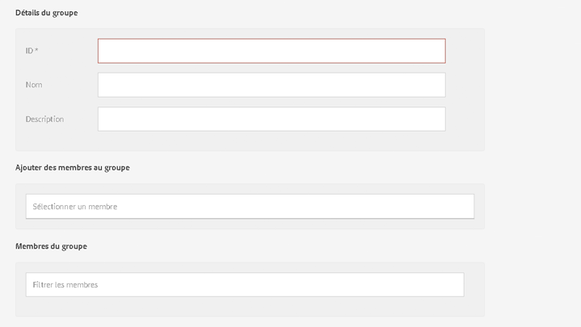

# Opérations Granite - Administration des utilisateurs et des groupes{#granite-operations-user-and-group-administration}

Au fur et à mesure que Granite intègre l’implémentation du référentiel CRX de la spécification API JCR, il applique sa propre administration des utilisateurs et des groupes.

Ces comptes constituent la base sous-jacente des comptes [AEM ](/help/sites-administering/security.md) et toute modification de compte effectuée avec l&#39;administration Granite sera prise en compte si/quand les comptes sont accessibles à partir de la [console Utilisateurs AEM](/help/sites-administering/security.md#accessing-user-administration-with-the-security-console) (par ex. `http://localhost:4502/useradmin`). La console AEM Users vous permet également de gérer les autorisations et autres éléments spécifiques à AEM.

Les consoles d’administration des utilisateurs et des groupes Granite sont disponibles via la console **[Outils](/help/sites-administering/tools-consoles.md)** de l’interface utilisateur optimisée pour les écrans tactiles :

Choisir entre **Utilisateurs** ou **Groupes** dans la console Outils ouvre la console adéquate. Dans chaque console, vous pouvez agir en utilisant la case à cocher, puis les actions de la barre d’outils ou en ouvrant les détails de compte par le biais du lien situé sous **Nom**.

* [Administration des utilisateurs](#user-administration)

   

   La console **Utilisateurs** répertorie :

   * le nom de l’utilisateur
   * l’identifiant de connexion de l’utilisateur (nom de compte)
   * tout titre attribué au compte

* [Administration des groupes](#group-administration)

   

   La console **Groupes** répertorie :

   * le nom du groupe
   * la description du groupe
   * le nombre d’utilisateurs/de groupes dans le groupe

## Administration des utilisateurs {#user-administration}

### Ajout d’un nouvel utilisateur {#adding-a-new-user}

1. Utilisez l’icône **Ajouter un utilisateur** :

   

1. Le formulaire **Créer un utilisateur** s’ouvre :

   

   Vous pouvez y saisir les détails de l’utilisateur pour le compte (la plupart sont des détails standard et explicites) :

   * **ID**

       Il s’agit de l’identifiant unique du compte utilisateur. Il est obligatoire et ne peut pas contenir d’espaces.

   * **Adresse électronique**
   * **Mot de passe**

      Un mot de passe est obligatoire.

   * **Confirmer le mot de passe**

      Ceci est obligatoire car il est nécessaire pour la confirmation du mot de passe.

   * **Prénom**
   * **Nom**
   * **Numéro de téléphone**
   * **Fonction**
   * **Rue**
   * **Mobile**
   * **Ville**
   * **Code postal**
   * **Pays**
   * **État**
   * **Titre**
   * **Sexe**
   * **À propos d’**
   * **Paramètres du compte**

      * ****
StatutVous pouvez marquer le compte comme 
**** actif ou  **inactif**.
   * **Photo**

      Vous pouvez ici télécharger une photo à utiliser comme avatar.

      Types de fichiers acceptés : `.jpg .png .tif .gif`

      Taille préférée : `240x240px`

   * **Ajouter un utilisateur aux groupes**

      Utilisez la liste déroulante de sélection pour sélectionner les groupes auxquels l’utilisateur doit appartenir. Une fois les groupes sélectionnés, utilisez le **X** à côté du nom pour la désélectionner avant l’enregistrement.

   * **Groupes**

      Liste du ou des groupes dont l’utilisateur est actuellement membre. Utilisez le **X** situé à côté du nom pour le désélectionner avant l’enregistrement.

1. Lorsque vous avez défini le compte d’utilisateur, utilisez :

   * **Annuler** pour abandonner l’enregistrement.
   * **Enregistrer** pour terminer l’enregistrement. La création du compte d’utilisateur est confirmée par un message.

### Modification d’un utilisateur existant {#editing-an-existing-user}

1. Accédez aux détails de l’utilisateur à partir du lien situé sous le nom d’utilisateur dans la console Utilisateurs.

1. Vous pouvez à présent modifier les détails comme indiqué dans la rubrique [Ajout d’un nouvel utilisateur](#adding-a-new-user).

1. Accédez aux détails de l’utilisateur à partir du lien situé sous le nom d’utilisateur dans la console Utilisateurs.

1. Vous pouvez à présent modifier les détails comme indiqué dans la rubrique [Ajout d’un nouvel utilisateur](#adding-a-new-user).

### Modification du mot de passe d’un utilisateur {#changing-the-password-for-an-existing-user}

1. Accédez aux détails de l’utilisateur à partir du lien situé sous le nom d’utilisateur dans la console Utilisateurs.

1. Vous pouvez à présent modifier les détails comme indiqué dans la rubrique [Ajout d’un nouvel utilisateur](#adding-a-new-user). Sous **Paramètres du compte** se trouve un lien permettant de **Modifier le mot de passe**.

   

1. La boîte de dialogue **Modifier le mot de passe** s’ouvre. Saisissez et confirmez le nouveau mot de passe, ainsi que votre mot de passe. Cliquez sur **OK** pour confirmer les modifications.

   

   Un message confirme que le mot de passe a été modifié.

### Affectation rapide de groupes {#quick-group-assignment}

1. Utilisez la case à cocher pour marquer un ou plusieurs utilisateurs.
1. Utilisez l’icône **Groupes** :

   

   Pour ouvrir le menu déroulant de sélection de groupe :

   

1. Dans la boîte de dialogue de sélection, vous pouvez sélectionner ou désélectionner les groupes auxquels le compte utilisateur doit appartenir.

1. Lorsque vous avez affecté les groupes ou avez annulé leur affectation selon les besoins, utilisez :

   * **Annuler** pour abandonner les modifications
   * **Enregistrer** pour confirmer les modifications

### Suppression de détails d’utilisateur existants {#deleting-existing-user-details}

1. Utilisez la case à cocher pour marquer un ou plusieurs utilisateurs.
1. Utilisez icône **Supprimer** pour supprimer les détails de l’utilisateur :

   

1. Vous êtes invité à confirmer la suppression, puis un message confirme que la suppression a eu lieu.

## Administration des groupes {#group-administration}

### Ajout d’un nouveau groupe {#adding-a-new-group}

1. Utilisez l’icône Ajouter un groupe :

   

1. Le formulaire **Créer un groupe** s’ouvre :

   

   Vous pouvez y saisir les détails du groupe :

   * **ID**

       Il s’agit d’un identifiant unique pour le groupe. Il est obligatoire et ne peut pas contenir d’espaces.

   * **Name** (Nom)

      Nom du groupe ; elle s’affichera dans la console Groupes.

   * **Description**

      Description du groupe.

   * **Ajouter des membres au groupe**

      Utilisez la liste déroulante de sélection pour sélectionner les utilisateurs à ajouter au groupe. Une fois les groupes sélectionnés, utilisez le **X** à côté du nom pour la désélectionner avant l’enregistrement.

   * **Membres du groupe**

      Liste d’utilisateurs du groupe. Utilisez le **X** situé à côté du nom pour le désélectionner avant l’enregistrement.

1. Lorsque vous avez défini le groupe, utilisez :

   * **Annuler** pour abandonner l’enregistrement.
   * **Enregistrer** pour terminer l’enregistrement. La création du groupe est confirmée par un message.

### Modification d’un groupe existant {#editing-an-existing-group}

1. Accédez aux détails du groupe à partir du lien situé sous le nom de groupe dans la console Groupes.

1. Vous pouvez à présent modifier les détails comme indiqué dans la rubrique [Ajout d’un nouveau groupe](#adding-a-new-group).

### Copie d’un groupe existant {#copying-an-existing-group}

1. Utilisez la case à cocher pour marquer un groupe.
1. Utilisez l’icône **Copier** pour copier les détails du groupe :

   

1. Le formulaire **Modifier les paramètres de groupe** s’ouvre.

   L’ID de groupe est identique à l’ID d’origine, mais précédé de `Copy of`. Vous devez le modifier, car l’identifiant ne peut pas contenir d’espaces. Tous les autres détails sont identiques aux détails d’origine.

   Vous pouvez à présent modifier les détails comme indiqué dans la rubrique [Ajout d’un nouveau groupe](#adding-a-new-group).

### Suppression d’un groupe existant {#deleting-an-existing-group}

1. Utilisez la case à cocher pour marquer un ou plusieurs groupes.
1. Utilisez l’icône **Supprimer** pour supprimer les détails du groupe :

   

1. Vous êtes invité à confirmer la suppression, puis un message confirme que la suppression a eu lieu.
