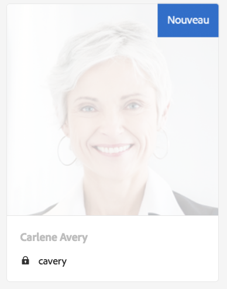

# Traitement des demandes RGPD pour AEM Foundation{#handling-gdpr-requests-for-the-aem-foundation}

>[!IMPORTANT]
>
>Le RGPD est utilisé comme exemple dans les sections ci-dessous, mais les détails couverts sont applicables à toutes les réglementations relatives à la protection des données et à la protection de la vie privée ; comme le RGPD, l&#39;ACCP, etc.

## AEM Foundation GDPR support {#aem-foundation-gdpr-support}

Au niveau AEM Foundation, les données personnelles stockées sont le Profil utilisateur. Par conséquent, les informations fournies dans cet article expliquent principalement comment accéder à ces profils utilisateur et les supprimer pour répondre respectivement aux demandes d’accès et de suppression dans le cadre du RGPD.

## Accès à un profil utilisateur {#accessing-a-user-profile}

### Étapes manuelles {#manual-steps}

1. Ouvrez la console d’administration utilisateur en accédant à **[!UICONTROL Paramètres - Sécurité - Utilisateurs]** ou en accédant directement à `https://<serveraddress>:<serverport>/libs/granite/security/content/useradmin.html`

   

1. Recherchez ensuite l’utilisateur en question en saisissant le nom dans la barre de recherche située en haut de la page :

   

1. Enfin, ouvrez le profil utilisateur en cliquant dessus, puis consultez les informations sous l’onglet **[!UICONTROL Détails]**.

   

### API HTTP  {#http-api}

Comme mentionné, Adobe fournit des API pour accéder aux données utilisateur, afin de faciliter l’automatisation. Il existe plusieurs types d’API que vous pouvez utiliser :

**API UserProperties**

```shell
curl -u user:password http://localhost:4502/libs/granite/security/search/profile.userproperties.json\?authId\=cavery
```

**API Sling**

*Découverte du répertoire de base (home) des utilisateurs :*

```xml
curl -g -u user:password 'http://localhost:4502/libs/granite/security/search/authorizables.json?query={"condition":[{"named":"cavery"}]}'
     {"authorizables":[{"type":"user","authorizableId_xss":"cavery","authorizableId":"cavery","name_xss":"Carlene Avery","name":"Carlene Avery","home":"/home/users/we-retail/DSCP-athB1NYLBXvdTuN"}],"total":1}
```

*Récupération des données utilisateur*

Utilisation du chemin d’accès au noeud à partir de la propriété home de la charge utile JSON renvoyée par la commande ci-dessus :

```shell
curl -u user:password  'http://localhost:4502/home/users/we-retail/DSCP-athB1NYLBXvdTuN/profile.-1.json'
```

```shell
curl -u user:password  'http://localhost:4502/home/users/we-retail/DSCP-athB1NYLBXvdTuN/profiles.-1.json'
```

## Désactivation d’un utilisateur et suppression des profils associés {#disabling-a-user-and-deleting-the-associated-profiles}

### Désactivation d’un utilisateur {#disable-user}

1. Ouvrez la console Administration utilisateur et recherchez l’utilisateur en question, comme décrit ci-dessus.
1. Survolez l’utilisateur avec le curseur, puis cliquez sur l’icône sélectionnée. Le profil devient gris pour indiquer qu’il est sélectionné.

1. Appuyez sur le bouton Désactiver dans le menu supérieur pour désactiver l’utilisateur :

   

1. Enfin, confirmez l’action :

   

   L’interface utilisateur indique ensuite que l’utilisateur a été désactivé en graissant et en ajoutant un verrou à la carte de profil :

   

### Suppression des informations d’un profil utilisateur {#delete-user-profile-information}

1. Log in to CRXDE Lite, then search for the `[!UICONTROL userId]`:

   

1. Open the user node which is located under `[!UICONTROL /home/users]` by default:

   

1. Supprimez les nœuds de profil et tous leurs enfants. Il existe deux formats de nœuds de profil, selon la version d’AEM :

   1. Le profil privé par défaut sous `[!UICONTROL /profile]`
   1. `[!UICONTROL /profiles]`, pour les nouveaux profils créés à l’aide de AEM 6.5.

   

### API HTTP  {#http-api-1}

Les procédures suivantes utilisent l’outil de ligne de commande `curl` pour illustrer comment désactiver l’utilisateur **[!UICONTROL cavery]** `userId` et supprimer ses profils disponibles à l’emplacement par défaut.

* *Découverte du répertoire de base (home) de l’utilisateur*

```shell
curl -g -u user:password 'http://localhost:4502/libs/granite/security/search/authorizables.json?query={"condition":[{"named":"cavery"}]}'
     {"authorizables":[{"type":"user","authorizableId_xss":"cavery","authorizableId":"cavery","name_xss":"Carlene Avery","name":"Carlene Avery","home":"/home/users/we-retail/DSCP-athB1NYLBXvdTuN"}],"total":1}
```

* *Désactivation de l’utilisateur*

Utilisation du chemin d’accès au noeud à partir de la propriété home de la charge utile JSON renvoyée par la commande ci-dessus :

```shell
curl -X POST -u user:password -FdisableUser="describe the reasons for disabling this user (GDPR in this case)" 'http://localhost:4502/home/users/we-retail/DSCP-athB1NYLBXvdTuN.rw.userprops.html'
```

* *Suppression du ou des profils utilisateur*

Utilisation du chemin d’accès au noeud à partir de la propriété home de la charge utile JSON renvoyée par la commande de détection de compte et des emplacements de noeud de profil prêts à l’emploi connus :

```shell
curl -X POST -u user:password -H "Accept: application/json,**/**;q=0.9" -d ':operation=delete' 'http://localhost:4502/home/users/we-retail/DSCP-athB1NYLBXvdTuN/profile'
```

```shell
curl -X POST -u user:password -H "Accept: application/json,**/**;q=0.9" -d ':operation=delete' 'http://localhost:4502/home/users/we-retail/DSCP-athB1NYLBXvdTuN/profile'
```

