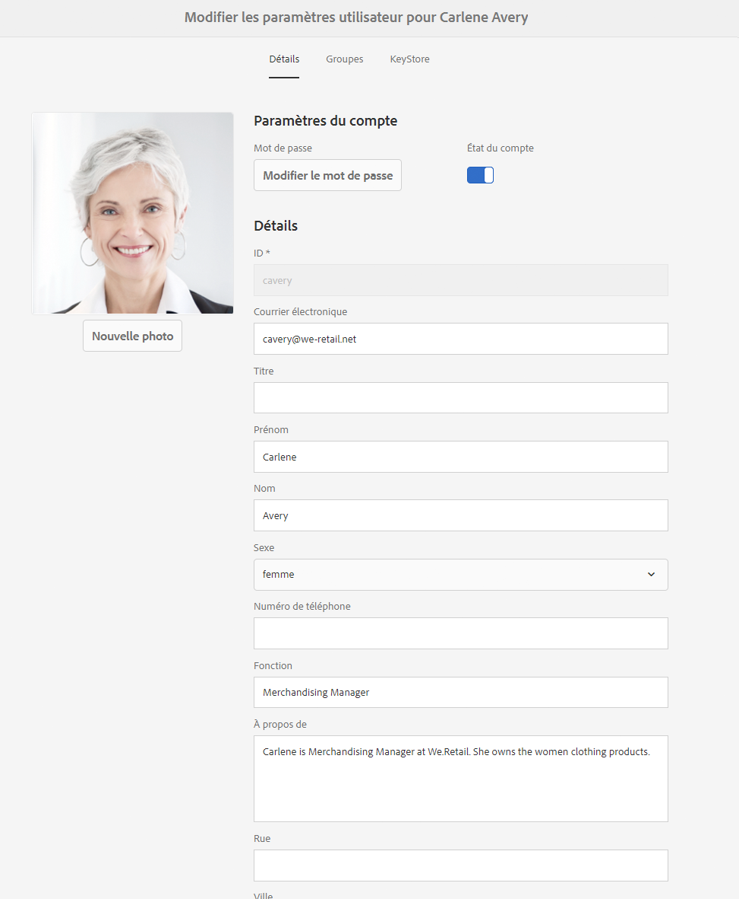

# Traiter des demandes en vertu du RGPD pour Adobe Experience Manager (AEM) Foundation{#handling-gdpr-requests-for-the-aem-foundation}

>[!IMPORTANT]
>
>Le RGPD est utilisé comme exemple dans les sections ci-dessous, mais les détails couverts sont applicables à toutes les réglementations de protection des données et de confidentialité, comme le RGPD, le CCPA, etc.

## Prise en charge du RGPD par AEM Foundation {#aem-foundation-gdpr-support}

En ce qui concerne AEM Foundation, les données personnelles stockées sont conservées dans le profil utilisateur. Par conséquent, les informations fournies dans cet article expliquent principalement comment accéder à ces profils utilisateurs et les supprimer pour répondre respectivement aux demandes d’accès et de suppression en vertu du RGPD.

## Accès à un profil utilisateur {#accessing-a-user-profile}

### Étapes manuelles {#manual-steps}

1. Ouvrez la console d’administration des utilisateurs en accédant à **[!UICONTROL Paramètres – Sécurité – Utilisateurs]** ou en accédant directement à `https://<serveraddress>:<serverport>/libs/granite/security/content/useradmin.html`.

   

1. Recherchez ensuite l’utilisateur en question en saisissant le nom dans la barre de recherche située en haut de la page :

   

1. Enfin, ouvrez le profil utilisateur en cliquant dessus, puis consultez les informations sous l’onglet **[!UICONTROL Détails]**.

   

### API HTTP {#http-api}

Comme mentionné, Adobe fournit des API pour accéder aux données utilisateur et faciliter l’automatisation. Il existe plusieurs types d’API que vous pouvez utiliser :

**API UserProperties**

```shell
curl -u user:password http://localhost:4502/libs/granite/security/search/profile.userproperties.json\?authId\=cavery
```

**API Sling**

*Découverte du répertoire de base (home) des utilisateurs :*

```xml
curl -g -u user:password 'http://localhost:4502/libs/granite/security/search/authorizables.json?query={"condition":[{"named":"cavery"}]}'
     {"authorizables":[{"type":"user","authorizableId_xss":"cavery","authorizableId":"cavery","name_xss":"Carlene Avery","name":"Carlene Avery","home":"/home/users/we-retail/DSCP-athB1NYLBXvdTuN"}],"total":1}
```

*Récupérer des données de personnes*

Utilisation du chemin de nœud de la propriété home de la charge utile JSON renvoyée par la commande ci-dessus :

```shell
curl -u user:password  'http://localhost:4502/home/users/we-retail/DSCP-athB1NYLBXvdTuN/profile.-1.json'
```

```shell
curl -u user:password  'http://localhost:4502/home/users/we-retail/DSCP-athB1NYLBXvdTuN/profiles.-1.json'
```

## Désactivation d’un utilisateur et suppression des profils associés {#disabling-a-user-and-deleting-the-associated-profiles}

### Désactivation d’un utilisateur {#disable-user}

1. Ouvrez la console d’administration utilisateur et recherchez la personne en question, comme décrit ci-dessus.
1. Pointez sur la personne et cliquez sur l’icône de sélection. Le profil devient gris pour indiquer la sélection.

1. Appuyez sur le bouton Désactiver dans le menu supérieur pour désactiver l’utilisateur :

   

1. Enfin, confirmez l’action :

   

   L’interface utilisateur indique alors que le compte de la personne a été désactivé en grisant la vignette de profil et en y ajoutant un cadenas :

   

### Suppression des informations d’un profil utilisateur {#delete-user-profile-information}

1. Connectez-vous à CRXDE Lite, puis recherchez l’`[!UICONTROL userId]` :

   

1. Ouvrez le nœud de l’utilisateur qui se trouve sous `[!UICONTROL /home/users]` par défaut :

   

1. Supprimez les nœuds de profil et tous leurs enfants. Les nœuds de profil sont associés à deux formats, selon la version d’AEM :

   1. Le profil privé par défaut sous `[!UICONTROL /profile]`
   1. `[!UICONTROL /profiles]`, pour les nouveaux profils créés à l’aide d’AEM 6.5

   

### API HTTP {#http-api-1}

Les procédures suivantes utilisent l’outil de ligne de commande `curl` pour illustrer comment désactiver la personne avec le **[!UICONTROL cavery]** `userId` et supprimer les profils de `cavery` disponibles à l’emplacement par défaut.

* *Découvrir l’accueil (home) des utilisateurs et utilisatrices*

```shell
curl -g -u user:password 'http://localhost:4502/libs/granite/security/search/authorizables.json?query={"condition":[{"named":"cavery"}]}'
     {"authorizables":[{"type":"user","authorizableId_xss":"cavery","authorizableId":"cavery","name_xss":"Carlene Avery","name":"Carlene Avery","home":"/home/users/we-retail/DSCP-athB1NYLBXvdTuN"}],"total":1}
```

* *Désactiver la personne*

Utilisation du chemin de nœud de la propriété home de la payload JSON renvoyée par la commande ci-dessus :

```shell
curl -X POST -u user:password -FdisableUser="describe the reasons for disabling this user (GDPR in this case)" 'http://localhost:4502/home/users/we-retail/DSCP-athB1NYLBXvdTuN.rw.userprops.html'
```

* *Supprimer des profils utilisateurs*

Utilisation du chemin de nœud de la propriété home de la charge utile JSON renvoyé par la commande de découverte de compte et les emplacements de nœuds de profil prêts à l’emploi connus :

```shell
curl -X POST -u user:password -H "Accept: application/json,**/**;q=0.9" -d ':operation=delete' 'http://localhost:4502/home/users/we-retail/DSCP-athB1NYLBXvdTuN/profile'
```

```shell
curl -X POST -u user:password -H "Accept: application/json,**/**;q=0.9" -d ':operation=delete' 'http://localhost:4502/home/users/we-retail/DSCP-athB1NYLBXvdTuN/profile'
```
