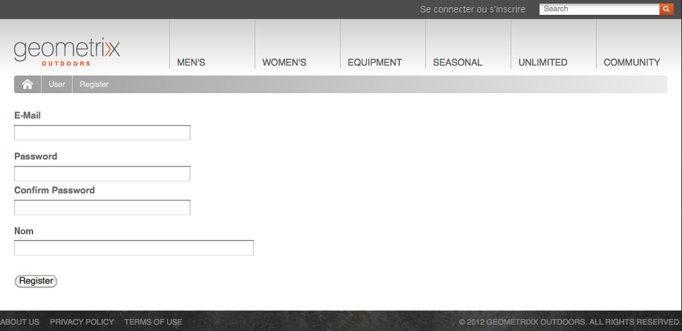
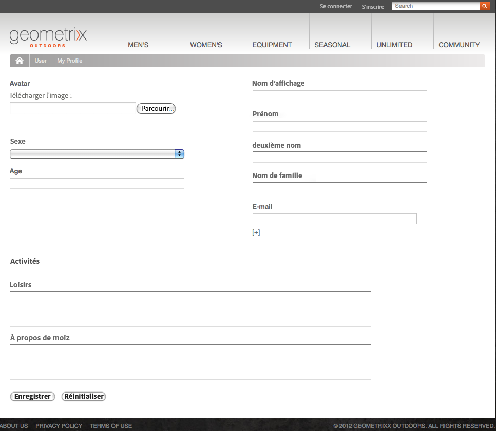
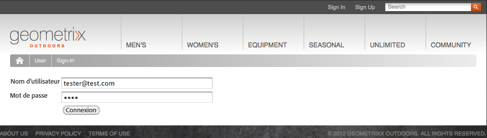
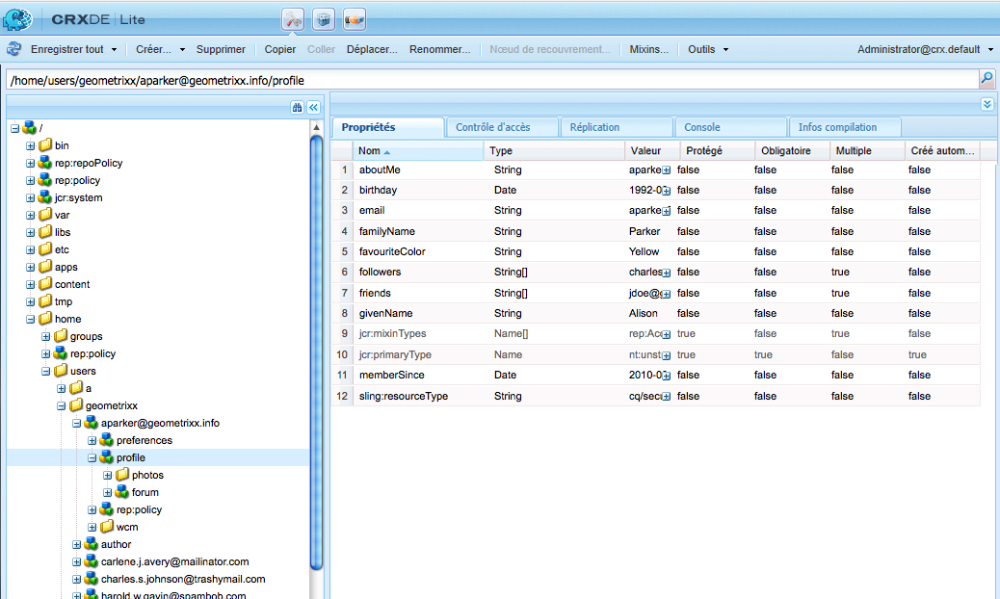
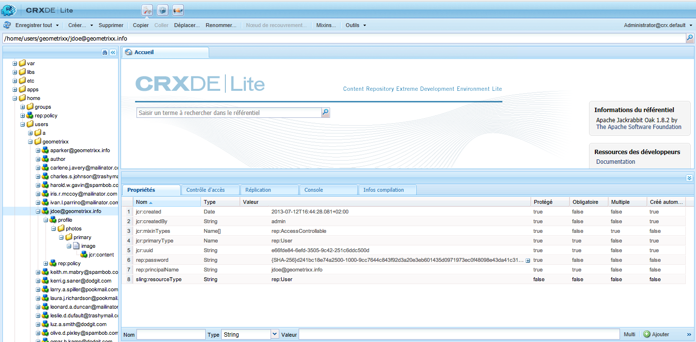
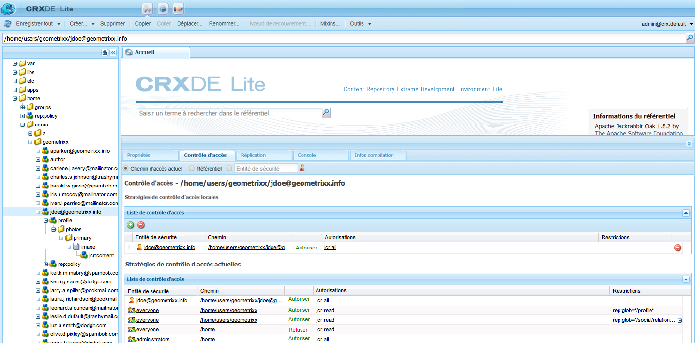
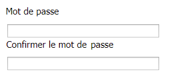
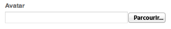
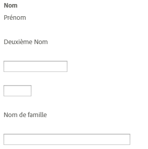

# Identity Management{#identity-management}

Les visiteurs individuels de votre site web ne peuvent être identifiés que lorsque vous leur donnez la possibilité de se connecter. Vous pouvez leur permettre de se connecter pour différentes raisons :

* [AEM Communities](/help/communities/overview.md) Les visiteurs du site doivent se connecter pour publier du contenu à l’intention de la communauté.
* [Groupes d’utilisateurs fermés](/help/sites-administering/cug.md)

   Vous devrez peut-être limiter l’accès à votre site Web (ou à certaines sections) à des visiteurs spécifiques.

* [](/help/sites-administering/personalization.md) PersonnalisationPermet aux visiteurs de configurer certains aspects de leur accès à votre site Web.

La fonctionnalité de connexion (et de déconnexion) est mise à disposition par un [compte avec un **profil**](#profiles-and-user-accounts) contenant des informations supplémentaires sur le visiteur (utilisateur) enregistré. Les processus réels pour l’enregistrement et l’autorisation peuvent différer :

* Auto-inscription à partir du site Web

   Un [site communautaire](/help/communities/sites-console.md) peut être configuré pour permettre aux visiteurs de s&#39;inscrire ou de se connecter avec leurs comptes Facebook ou Twitter.

* Demande d&#39;inscription sur le site Web

   Dans le cas d’un groupe d’utilisateurs fermé, vous pouvez autoriser les visiteurs à demander l’enregistrement, mais appliquer l’autorisation au moyen d’un processus.

* Enregistrer chaque compte à partir de l’environnement auteur

   Si vous avez un petit nombre de profils, qui auront de toute façon besoin d&#39;une autorisation, vous pouvez décider d&#39;enregistrer chacun directement.

Pour permettre aux visiteurs de s’enregistrer, une série de composants et de formulaires peut être utilisée pour recueillir les informations d’identification nécessaires, puis d’autres informations de profil (facultatives). Une fois qu’ils se sont enregistrés, ils doivent également pouvoir vérifier et mettre à jour les informations qu’ils ont envoyées.

La fonctionnalité supplémentaire peut être configurée ou développée :

* Configurez une réplication inverse nécessaire.
* Permettez à un utilisateur de supprimer son profil en développant un formulaire associé à un workflow.

>[!NOTE]
>
>Les informations spécifiées dans le profil peuvent également être utilisées pour proposer à l’utilisateur du contenu ciblé par le biais de [segments](/help/sites-administering/campaign-segmentation.md) et de [campagnes](/help/sites-classic-ui-authoring/classic-personalization-campaigns.md).

## Formulaires d’enregistrement {#registration-forms}

Un [formulaire](/help/sites-authoring/default-components.md#form-component) peut être utilisé pour collecter des informations d’enregistrement, puis générer le nouveau compte et le nouveau profil.

Par exemple, les utilisateurs peuvent demander un nouveau profil à l’aide de la page de Geometrixx.
`http://localhost:4502/content/geometrixx-outdoors/en/user/register.html`



Lors de l’envoi de la demande, la page de profil s’affiche lorsque l’utilisateur peut fournir des détails personnels.



Le nouveau compte est également visible dans la [console Utilisateurs](/help/sites-administering/security.md).

## Connexion {#login}

Le composant Connexion peut être utilisé pour collecter les informations de connexion, puis activer le processus de connexion.

Les champs standard **Nom d’utilisateur** et **Mot de passe**, avec un bouton **Connexion**, s’affichent à l’intention du visiteur afin de lui permettre d’activer le processus de connexion lors de la saisie des informations d’identification.

Par exemple, les utilisateurs peuvent se connecter ou créer un compte à l’aide de l’option **Se connecter** de la barre d’outils Geometrixx, qui utilise la page :

`http://localhost:4502/content/geometrixx-outdoors/en/user/sign-in.html`



## Déconnexion {#logging-out}

Tout comme il y a un mécanisme de connexion, un mécanisme de déconnexion est également nécessaire. Il est disponible sous la forme de l’option **Se connecter** dans Geometrixx.

## Affichage et mise à jour d’un profil {#viewing-and-updating-a-profile}

En fonction du formulaire d’enregistrement, le visiteur peut avoir enregistré des informations sur son profil. Il doit pouvoir les afficher et/ou les mettre à jour ultérieurement. Cela peut se faire sous une forme similaire ; par exemple, en Geometrixx :

```
http://localhost:4502/content/geometrixx-outdoors/en/user/profile.html
```

Pour voir les détails de votre profil, cliquez sur **Mon Profil** dans le coin supérieur droit de n&#39;importe quelle page ; par exemple avec le compte `admin` :
`http://localhost:4502/home/users/a/admin/profile.form.html/content/geometrixx-outdoors/en/user/profile.html.`

Vous pouvez afficher un autre profil à l’aide du [contexte du client](/help/sites-administering/client-context.md) (dans l’environnement de création et avec des autorisations suffisantes) :

1. Ouvrez une page ; par exemple, la page de Geometrixx :

   `http://localhost:4502/cf#/content/geometrixx/en.html`

1. Cliquez sur **Mon profil** dans le coin supérieur droit. Le profil de votre compte actuel s’affiche. Par exemple, l’administrateur.
1. Appuyez sur les touches **Ctrl+Alt+C** pour ouvrir le contexte du client.
1. Dans le coin supérieur gauche du contexte du client, cliquez sur le bouton **Charger un profil**.

   

1. Sélectionnez un autre profil dans la liste déroulante de la boîte de dialogue. Par exemple, **Alison Parker**.
1. Cliquez sur **OK**.
1. Cliquez de nouveau sur **Mon profil**. Le formulaire est mis à jour avec les détails d’Alison.

   

1. Vous pouvez maintenant utiliser **Modifier le profil** ou **Modifier le mot de passe** pour mettre à jour les informations.

## Ajout de champs à la définition d’un profil  {#adding-fields-to-the-profile-definition}

Vous pouvez ajouter des champs à la définition d’un profil. Par exemple, pour ajouter un champ Couleur préférée au profil Geometrixx :

1. Dans la console Sites web, sélectionnez Geometrixx Outdoors Site > Anglais > Utilisateur > Mon profil.
1. Double-cliquez sur la page **Mon profil** pour l’ouvrir afin de la modifier.
1. Sur l’onglet **Composants** de Sidekick, développez la section **Formulaire**.
1. Faites glisser un composant **Liste déroulante** du Sidekick vers le formulaire, juste en dessous du champ **À propos de moi**.
1. Double-cliquez sur le composant **Liste déroulante** pour afficher la boîte de dialogue pour la configuration et saisissez :

   * **Nom de l’élément** - `favoriteColor`
   * **Titre** - `Favorite Color`
   * **Éléments** : ajoutez plusieurs couleurs sous forme d’éléments

   Cliquez sur **OK** pour enregistrer.

1. Fermez la page et revenez à la console **Sites web** et activez la page Mon profil.

   La prochaine fois que vous affichez un profil, vous pouvez choisir une couleur préférée :

   

   Le champ est enregistré dans la section **profil** du compte utilisateur approprié :

   

## États du profil {#profile-states}

Il existe un certain nombre de cas d&#39;utilisation qui nécessitent de savoir si un utilisateur (ou plutôt son profil) est dans un état *spécifique* ou non.

Cela implique de définir, dans le profil utilisateur, une propriété appropriée qui :

* soit visible et accessible à l’utilisateur ;
* définisse deux états pour chaque propriété ;
* permette de basculer entre les deux états définis.

Cette opération s’effectue avec :

* [Fournisseurs d’état](#state-providers)

   Pour gérer les deux états d’une propriété spécifique et les transitions entre les deux.

* [Workflows](#workflows)

   Permet de gérer les actions associées aux états.

Différents états peuvent être définis. Dans Geometrixx, par exemple, il s’agit des états suivants :

* abonnement (ou désabonnement) aux notifications des newsletters ou aux fils de commentaires
* ajout et suppression d’une connexion à un ami

### Fournisseurs d’état {#state-providers}

Un fournisseur d’état gère l’état actuel de la propriété en question, ainsi que les transitions entre les deux états possibles.

Les fournisseurs d’état sont mis en œuvre sous forme de composants et peuvent donc être personnalisés pour votre projet. Dans Geometrixx, ces états sont les suivants :

* S’abonner/Se désabonner du sujet du forum
* Ajouter/Supprimer un ami

### Workflows {#workflows}

Les fournisseurs d’état gèrent une propriété de profil et ses états.

Un workflow est nécessaire à la mise en œuvre des actions associées aux états. Par exemple, lors de l’abonnement aux notifications, le workflow gère l’action réelle d’abonnement effective. Lors du désabonnement des notifications, le workflow gère la suppression de l’utilisateur de la liste d’abonnement.

## Profils et comptes utilisateur {#profiles-and-user-accounts}

Les profils sont stockés dans le référentiel de contenu dans le cadre du [compte utilisateur](/help/sites-administering/user-group-ac-admin.md).

Le profil se trouve sous `/home/users/geometrixx` :



Dans une configuration standard (création ou publication), chacun possède un accès en lecture à toutes les informations de profil de tous les utilisateurs. Chacun est un *groupe intégré contenant automatiquement tous les utilisateurs et groupes existants. La liste des membres ne peut pas être modifiée*.

Ces droits d’accès sont définis par la liste de contrôle d’accès générique suivante :

/home all allow jcr:read rep:glob = */profil*

Elle autorise :

* L’affichage des informations des forums, commentaires ou articles de blog (comme l’icône ou le nom complet) du profil approprié
* Les liens vers des pages de profil geometrixx

Si cet accès n’est pas approprié pour votre installation, vous pouvez modifier ces paramètres par défaut.

Pour ce faire, utilisez l&#39;onglet **[Contrôle d&#39;accès](/help/sites-administering/user-group-ac-admin.md#access-right-management)** :



## Composants Profil {#profile-components}

Une plage de composants Profil est également disponible pour définir les exigences de profil de votre site.

### Champ du mot de passe coché  {#checked-password-field}

Ce composant fournit deux champs pour :

* la saisie d’un mot de passe ;
* une nouvelle saisie du mot de passe pour vérifier qu’il a été saisi correctement.

Avec les paramètres par défaut, le composant ressemble à celui-ci :



### Photo de l’avatar du profil {#profile-avatar-photo}

Ce composant fournit à l’utilisateur une méthode pour sélectionner un fichier de photo d’avatar et le télécharger.



### Nom détaillé du profil {#profile-detailed-name}

Ce composant permet à l’utilisateur de saisir un nom détaillé.



### Sexe du profil {#profile-gender}

Ce composant permet à l’utilisateur d’indiquer son sexe.


