# Adobe IMS Authentication and [!DNL Admin Console] Support for AEM Managed Services {#adobe-ims-authentication-and-admin-console-support-for-aem-managed-services}

>[!NOTE]
>
>Notez que cette fonctionnalité n’est disponible que pour les clients Adobe Managed Services.

## Présentation {#introduction}

AEM 6.4.3.0 introduces [!DNL Admin Console] support for AEM instances and Adobe IMS(Identity Management System) based authentication for **AEM Managed Services** customers.

AEM onboarding to the [!DNL Admin Console] will allow AEM Managed Services customers to manage all Experience Cloud users in one console. Les utilisateurs et les groupes peuvent être affectés à des profils de produits associés à des instances AEM, ce qui leur permet de se connecter à une instance spécifique.

## Principales caractéristiques {#key-highlights}

* La prise en charge de l’authentification IMS d’AEM est réservée aux auteurs, administrateurs ou développeurs AEM et non aux utilisateurs finaux externes de sites clients comme les visiteurs de site
* The [!DNL Admin Console] will represent AEM Managed Services customers as IMS Organizations and their Instances as Product Contexts. Le système client et les administrateurs de produits pourront gérer l’accès aux instances
* AEM Managed Services will sync customer topologies with the [!DNL Admin Console]. There will be one instance of AEM Managed Services Product Context per Instance in the [!DNL Admin Console].
* Product Profiles in [!DNL Admin Console] will determine which instances a user can access
* L’authentification fédérée à l’aide des propres fournisseurs d’identité des clients conformes SAML 2 est prise en charge
* Seuls les ID d’entreprise ou fédérés (pour l’authentification unique du client) sont pris en charge, et non les Adobe ID personnels.
* [!DNL User Management] (dans l’Adobe [!DNL Admin Console]) continuera d’appartenir aux administrateurs du client.

## Architecture {#architecture}

L’authentification IMS fonctionne en utilisant le protocole OAuth entre AEM et le point de terminaison Adobe IMS. Une fois qu’un utilisateur a été ajouté à IMS et possède une identité Adobe, il peut se connecter aux instances AEM Managed Services à l’aide des informations d’identification IMS.

Le flux d’identifiant de connexion utilisateur est indiqué ci-dessous, l’utilisateur sera redirigé vers IMS et éventuellement vers le fournisseur d’identité client pour la validation SSO, puis redirigé vers AEM.

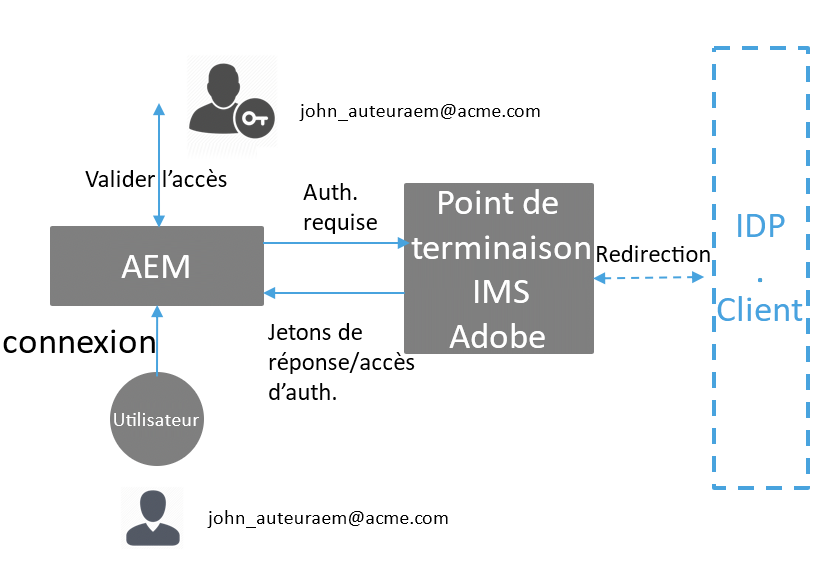

## Méthode de configuration {#how-to-set-up}

### Onboarding Organizations to [!DNL Admin Console] {#onboarding-organizations-to-admin-console}

The customer onboarding to [!DNL Admin Console] is a pre-requisite to using Adobe IMS for AEM authentication.

Pour commencer, une organisation doit être configurée pour les clients dans Adobe IMS. Les clients Adobe Enterprise sont représentés en tant qu’organisations IMS dans [Adobe [!DNL Admin Console]](https://helpx.adobe.com/fr/enterprise/using/admin-console.html).

AEM Managed Services customers should already have an organization provisioned, and as part of the IMS provisioning, the customer instances will be made available in the [!DNL Admin Console] for managing user entitlements and access.

L’authentification des utilisateurs par IMS sera un travail commun à AMS et les clients, chacun devant mener à bien ses workflows.

Une fois qu’un client est défini en tant qu’organisation IMS et qu’AMS a attribué ce client pour l’IMS, voici, en résumé, les workflows de la configuration nécessaires :

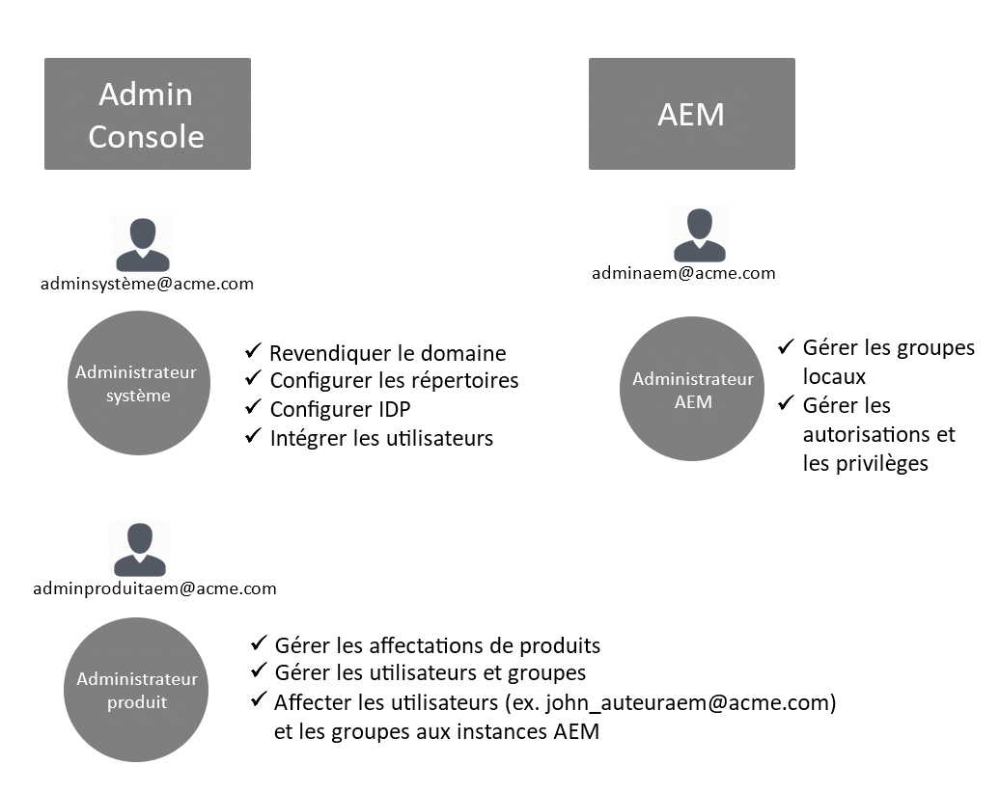

1. The designated System Admin receives an invite to log in to the [!DNL Admin Console]
1. L’administrateur système désigne le domaine pour confirmer la propriété du nom de domaine (dans cet exemple acme.com)
1. L’administrateur système configure les répertoires utilisateur
1. The System Admin configures the Identity Provider (IDP) in the [!DNL Admin Console] for SSO setup.
1. L’administrateur AEM gère les groupes locaux, les autorisations et les droits comme d’habitude. Voir Synchronisation des utilisateurs et des groupes

>[!NOTE]
>
>Pour plus d’informations sur les bases de la gestion des identités dans Adobe, y compris sur la configuration de fournisseur d’identité, voir l’article présenté [sur cette page.](https://helpx.adobe.com/fr/enterprise/using/set-up-identity.html)
>
>For more info about the Enterprise Administration and [!DNL Admin Console] see the article [this page](https://helpx.adobe.com/fr/enterprise/managing/user-guide.html).

### Intégration d’utilisateurs à [!DNL Admin Console] {#onboarding-users-to-the-admin-console}

Il existe trois méthodes d’intégration des utilisateurs en fonction de la taille du client et de ses préférences :

1. Créez manuellement des utilisateurs et des groupes dans [!DNL Admin Console]
1. Téléchargement d’un fichier CSV avec des utilisateurs
1. Synchronisation des utilisateurs et des groupes depuis le répertoire Active Directory d’entreprise du client.

#### Ajout manuel via [!DNL Admin Console] l’interface utilisateur {#manual-addition-through-admin-console-ui}

Users and Groups can be manually created in the [!DNL Admin Console] UI. Cette méthode peut être utilisée s’il y a un nombre réduit d’utilisateurs à gérer. Par exemple, moins de 50 utilisateurs d’AEM.

Les utilisateurs peuvent aussi être créés manuellement si le client utilise déjà cette méthode pour administrer d’autres produits Adobe comme Analytics, Target ou des applications Creative Cloud.

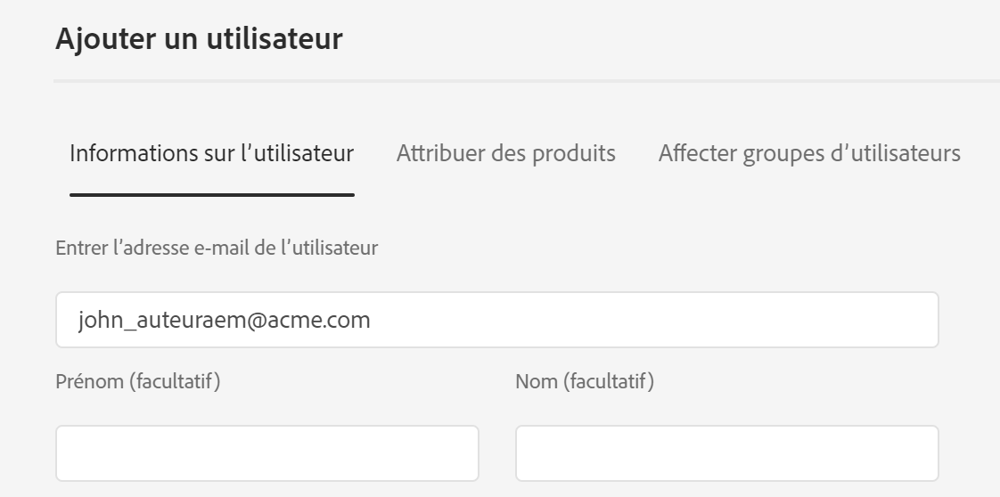

#### Téléchargement de fichier dans l’ [!DNL Admin Console] interface utilisateur {#file-upload-in-the-admin-console-ui}

Pour gérer facilement la création d’utilisateurs, un fichier CSV peut être téléchargé pour permettre l’ajout groupé des utilisateurs :

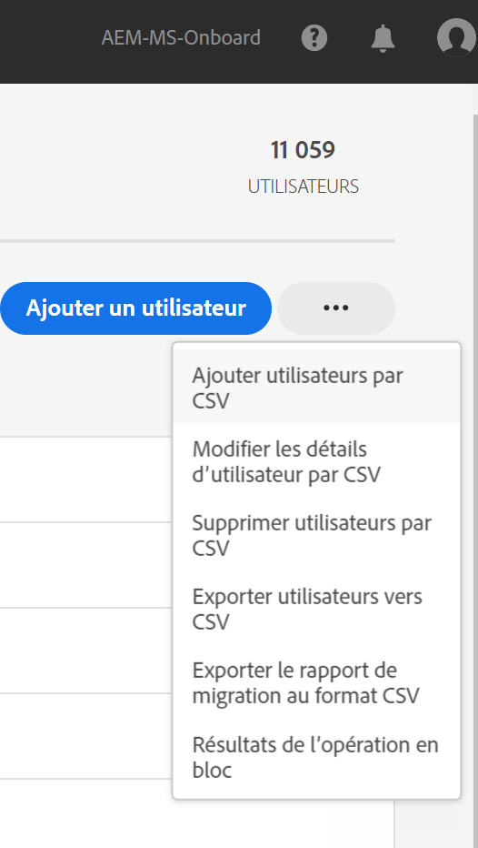

#### Outil de synchronisation des utilisateurs {#user-sync-tool}

L’outil de synchronisation des utilisateurs permet aux clients d’entreprise de créer ou de gérer des utilisateurs Adobe utilisant Active Directory ou d’autres services testés de répertoires OpenLDAP. Les utilisateurs cibles sont les administrateurs d’identité informatique (Enterprise Directory et administrateurs système) qui pourront installer et configurer l’outil. Cet outil en open source est personnalisable, de telle sorte que les clients peuvent le faire modifier par un développeur en fonction de leurs besoins spécifiques.

When User Sync runs, it fetches a list of users from the organization’s Active Directory (or any other compatible data source) and compares it with the list of users within the [!DNL Admin Console]. It then calls the Adobe [!DNL User Management] API so that the [!DNL Admin Console] is synchronized with the organization’s directory. The change flow is entirely one-way; any edits made in the [!DNL Admin Console] do not get pushed out to the directory.

The tool allows the system admin to map user groups in the customer’s directory with product configuration and user groups in the [!DNL Admin Console], the new UST version also allows dynamic creation of user groups in the [!DNL Admin Console].

Pour configurer la synchronisation des utilisateurs, l’organisation doit créer un ensemble d’informations d’identification de la même manière qu’avec l’[[!DNL User Management] API ](https://www.adobe.io/apis/cloudplatform/usermanagement/docs/setup.html).

La synchronisation des utilisateurs est distribuée via le référentiel Adobe Github à cet emplacement :

[https://github.com/adobe-apiplatform/user-sync.py/releases/latest](https://github.com/adobe-apiplatform/user-sync.py/releases/latest)

Note that a pre-release version 2.4RC1 is available with dynamic group creation support and can be found here: [https://github.com/adobe-apiplatform/user-sync.py/releases/tag/v2.4rc1](https://github.com/adobe-apiplatform/user-sync.py/releases/tag/v2.4rc1)

The major features for this release are the ability to dynamically map new LDAP groups for user membership in the [!DNL Admin Console], as well as dynamic user group creation.

Vous trouverez plus d’informations sur les nouvelles fonctionnalités du groupe ici :

[https://github.com/adobe-apiplatform/user-sync.py/blob/v2/docs/en/user-manual/advanced_configuration](https://github.com/adobe-apiplatform/user-sync.py/blob/v2/docs/en/user-manual/advanced_configuration.md#additional-group-options)

>[!NOTE]
>
>Pour plus d’informations sur l’outil de synchronisation des utilisateurs, consultez la [page de documentation](https://adobe-apiplatform.github.io/user-sync.py/en/).
>
>
>L’outil de synchronisation des utilisateurs doit s’enregistrer en tant qu’UMAPI client d’Adobe I/O en suivant la procédure décrite [ici](https://adobe-apiplatform.github.io/umapi-documentation/en/UM_Authentication.html).
>
>La documentation relative à la console Adobe I/O est disponible [ici](https://www.adobe.io/apis/cloudplatform/console.html).
>
>
>The [!DNL User Management] API that is used by the User Sync Tool is covered at this [location](https://www.adobe.io/apis/cloudplatform/umapi-new.html).

>[!NOTE]
>
>La configuration IMS d’AEM sera gérée par l’équipe Adobe Managed Services. Cependant, l’administrateur du client peut la modifier en fonction de ses besoins (par exemple, pour gérer l’appartenance automatique des groupes ou le mappage de groupes). Le client IMS sera également enregistré par votre équipe Managed Services.

## Utilisation {#how-to-use}

### Managing Products and User Access in [!DNL Admin Console] {#managing-products-and-user-access-in-admin-console}

When the customer Product Administrator logs in to [!DNL Admin Console], they will see multiple instances of the AEM Managed Services Product Context as shown below:

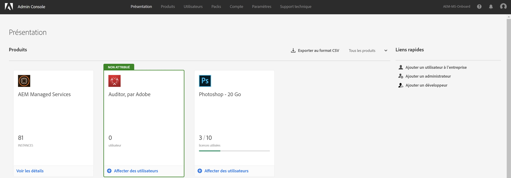

Dans cet exemple, l’organisation *AEM-MS-Onboard* comporte 32 instances couvrant différents environnements et topologies tels que Intermédiaire, Production, etc.

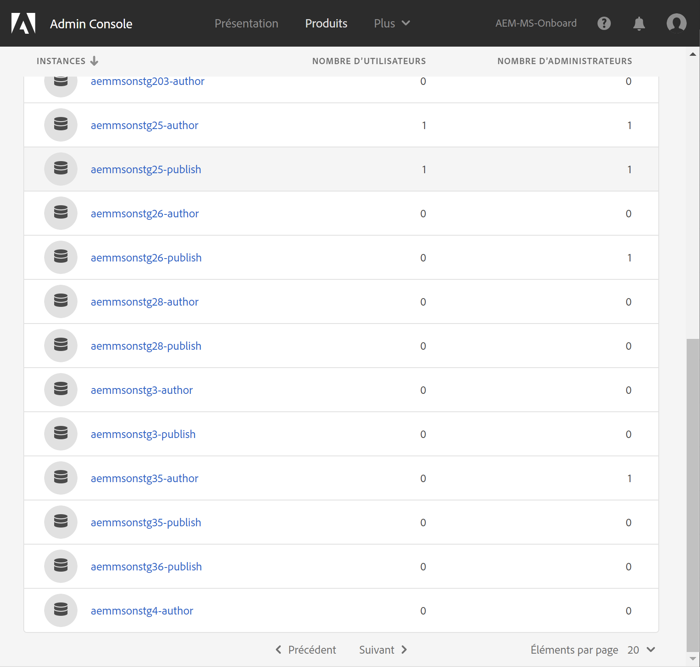

Les détails de l’instance peuvent être vérifiés pour identifier celle-ci :

Un profil de produit est associé à chaque instance de contexte du produit. Ce profil de produit est utilisé pour attribuer l’accès aux utilisateurs et aux groupes.

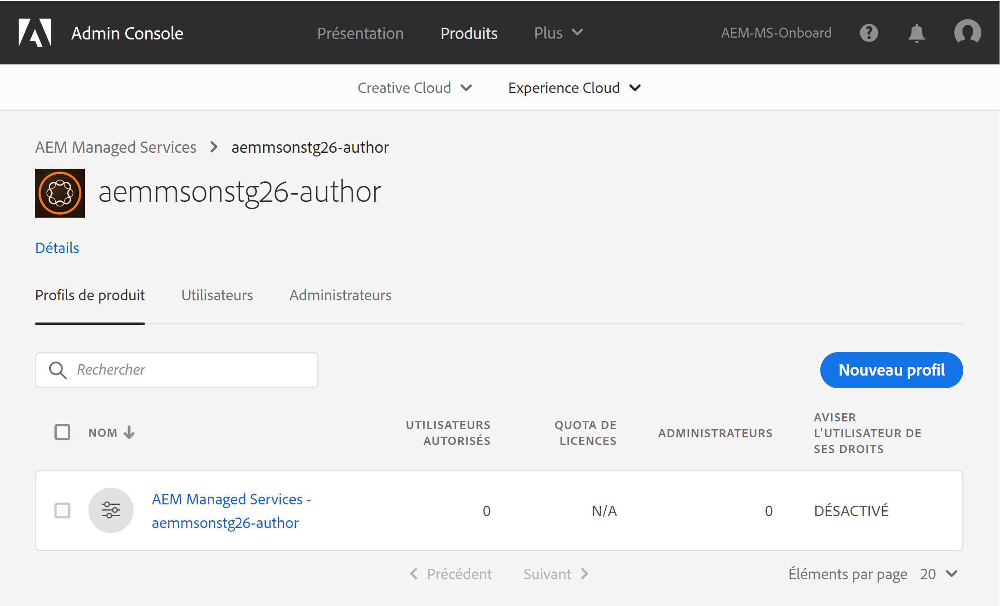

Tous les utilisateurs et groupes ajoutés au profil de produit pourront se connecter à cette instance, comme illustré dans l’exemple ci-dessous :

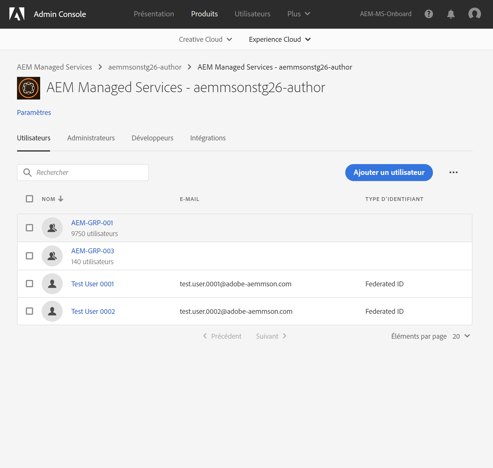

### Connexion à AEM {#logging-into-aem}

#### Connexion de l’administrateur local {#local-admin-login}

AEM peut continuer à prendre en charge les connexions locales pour les utilisateurs administrateurs, puisque l’écran de connexion dispose d’une option de connexion locale :

#### Connexion via IMS {#ims-based-login}

Pour les autres utilisateurs, la connexion via IMS peut être utilisée une fois qu’IMS est configuré sur l’instance. L’utilisateur doit d’abord cliquer sur le bouton **Se connecter avec Adobe** comme illustré ci-dessous :

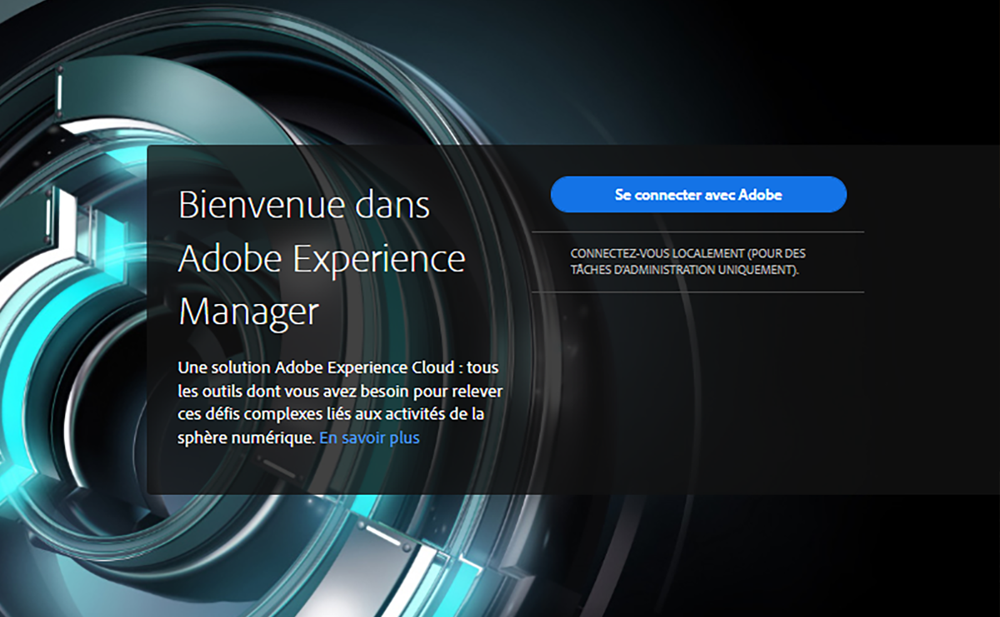

Il est alors redirigé vers l’écran de connexion IMS et saisit ses informations d’identification :

If a federated IDP is configured during initial [!DNL Admin Console] setup, then the user will be redirected to the customer IDP for SSO.

Le fournisseur d’identité est Okta dans l’exemple ci-dessous :

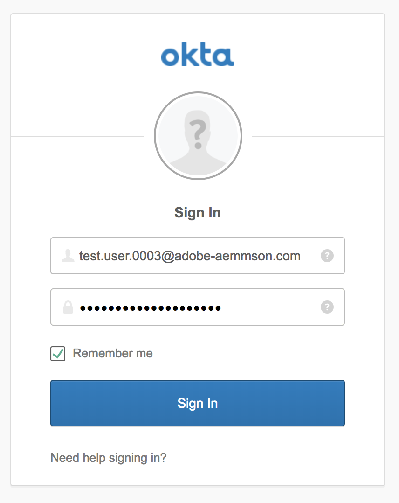

Une fois l’authentification terminée, l’utilisateur est redirigé vers AEM et connecté :

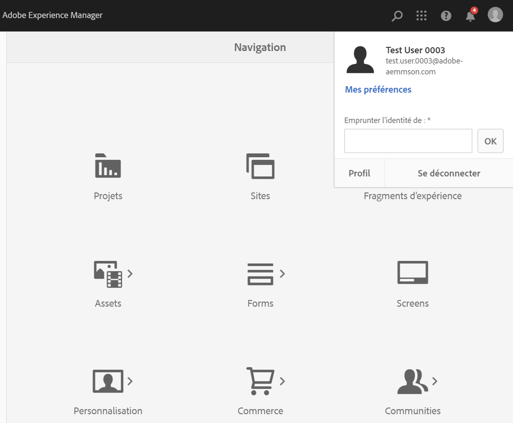

### Migration d’utilisateurs existants {#migrating-existing-users}

Pour les instances AEM existantes qui utilisent une autre méthode d’authentification et qui sont désormais migrées vers IMS, une étape de migration est nécessaire.

Les utilisateurs existants dans le référentiel AEM (provenant localement, via LDAP ou SAML) peuvent être migrés pour pointer vers IMS en tant que IDP à l’aide de l’utilitaire de migration d’utilisateur.

Cet utilitaire sera exécuté par votre équipe AMS dans le cadre de la mise en service de l’IMS.

### Gestion des autorisations et des listes de contrôle d’accès dans AEM {#managing-permissions-and-acls-in-aem}

Le contrôle d&#39;accès et les autorisations continueront d’être gérés en AEM, ce qui peut se faire en séparant les groupes d’utilisateurs des IMS (par exemple AEM-GRP-008 dans l’exemple ci-dessous) et des groupes locaux où les autorisations et le contrôle d&#39;accès sont définis. Les groupes d’utilisateurs synchronisés à partir de l’IMS peuvent être attribués aux groupes locaux et hériter des autorisations.

Dans l’exemple ci-dessous, nous ajoutons des groupes synchronisés au groupe local *Dam_Users* comme exemple.

Here, a user has also been assigned to a few groups in the [!DNL Admin Console]. ( Please note that the users and groups can be synced from LDAP using the user sync tool or created locally, please see the section **Onboarding Users to the[!DNL Admin Console]** above).

&amp;ast;Notez que les groupes d’utilisateurs ne sont synchronisés que lorsque les utilisateurs se connectent à l’instance, pour les clients qui ont un grand nombre d’utilisateurs et de groupes, un utilitaire de synchronisation de groupes peut être exécuté par AMS pour prérécupérer les groupes pour la gestion des contrôles d&#39;accès et des autorisations décrite ci-dessus.

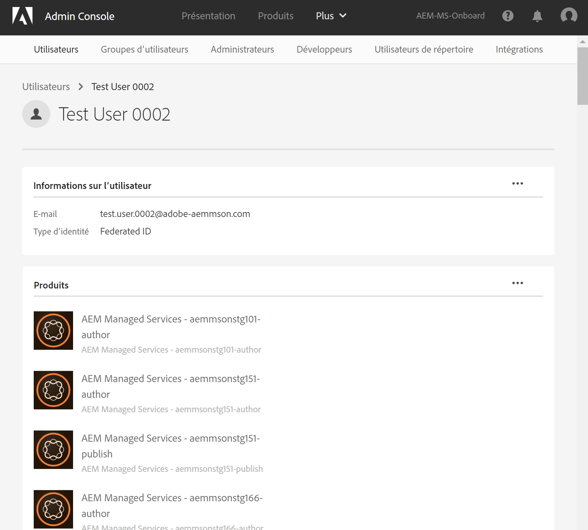

L’utilisateur fait partie des groupes suivants dans IMS :

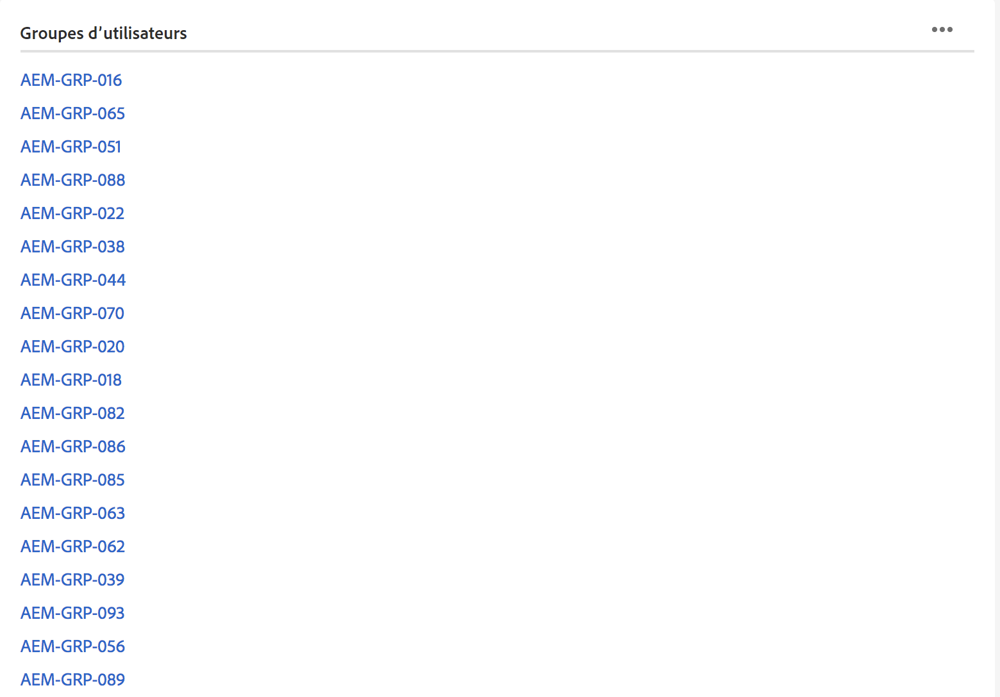

Lorsque l’utilisateur se connecte, ses adhésions de groupes sont synchronisées, comme illustré ci-dessous :

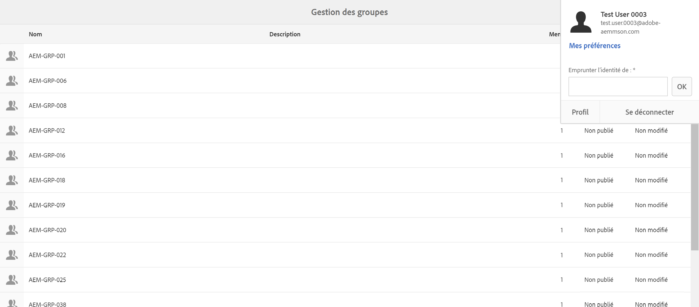

Dans AEM, les groupes d’utilisateurs synchronisés à partir de l’IMS peuvent être ajoutés en tant que membres aux groupes locaux existants, par exemple aux utilisateurs DAM.

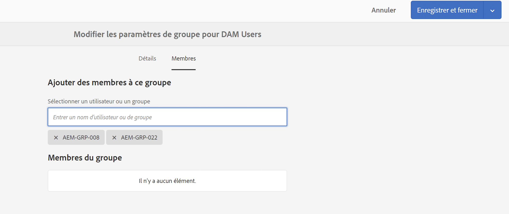

Comme illustré ci-dessous, le groupe *AEM-GRP_008* hérite des autorisations et droits des utilisateurs DAM. C’est un moyen efficace de gérer des autorisations pour les groupes synchronisés. Il est généralement utilisé dans les méthodes d’authentification par LDAP.

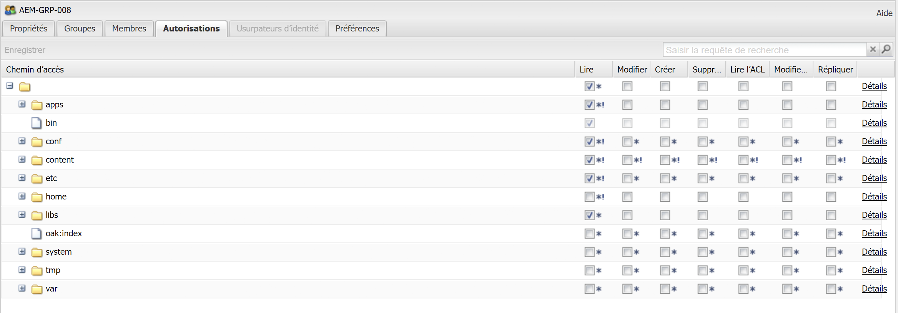
