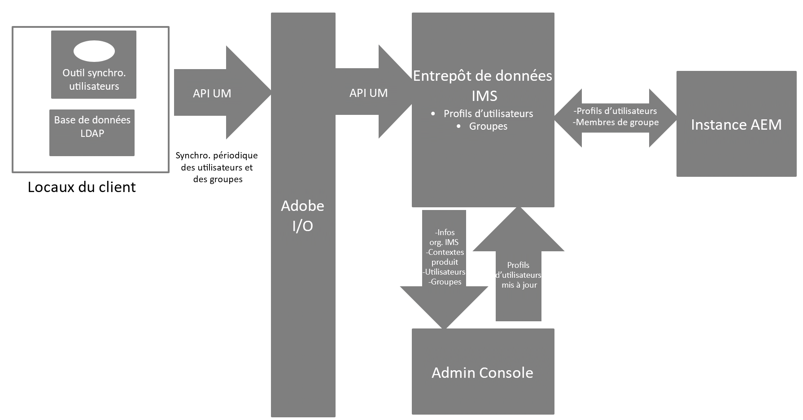
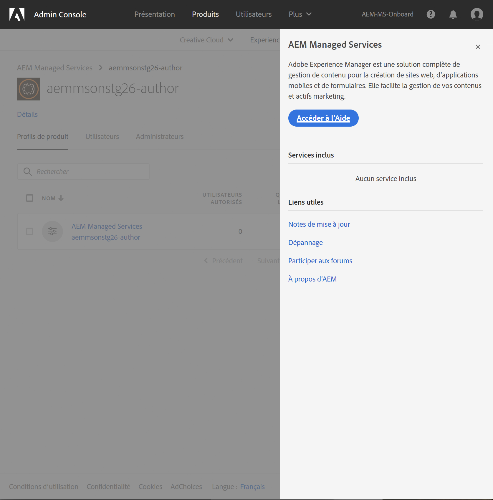
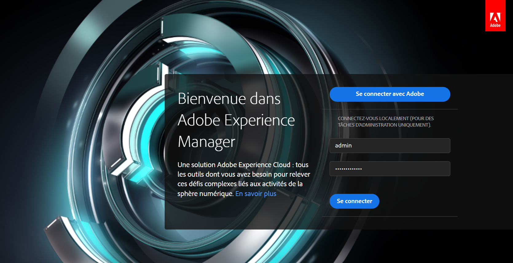

# Authentification Adobe IMS et prise en charge par l’assistance d’[!DNL Admin Console] d’AEM Managed Services {#adobe-ims-authentication-and-admin-console-support-for-aem-managed-services}

>[!NOTE]
>
>Cette fonctionnalité n’est disponible que pour les clientes et clients Adobe Managed Services.

## Présentation {#introduction}

AEM 6.4.3.0 introduit la prise en charge par l’[!DNL Admin Console] de l’authentification aux instances AEM et basées sur Adobe IMS (système de gestion d’identité) pour les clients **AEM Managed Services**.

L’intégration d’AEM à l’[!DNL Admin Console] permettra aux clients AEM Managed Services de gérer tous les utilisateurs d’Experience Cloud dans une seule console. Les utilisateurs et utilisatrices peuvent être affectés aux profils de produit associés aux instances AEM, ce qui leur permet de se connecter à une instance spécifique.

## Principales caractéristiques {#key-highlights}

* La prise en charge de l’authentification IMS d’AEM est réservée aux personnes chargées de la création, de l’administration ou du développement dans AEM, et non aux personnes utilisatrices finales externes du site client comme les visiteurs et les visiteuses du site.
* L’[!DNL Admin Console] représentera les clients AEM Managed Services comme des organisations IMS, et leurs instances comme des contextes de produit. Le système client et les responsables de l’administration des produits pourront gérer l’accès aux instances
* AEM Managed Services synchronisera les topologies client à l’aide de l’[!DNL Admin Console]. Chaque instance disposera d’une instance de contexte de produit AEM Managed Services dans l’[!DNL Admin Console].
* Les profils de produit dans l’[!DNL Admin Console] détermineront à quelles instances un utilisateur peut accéder.
* L’authentification fédérée à l’aide des fournisseurs d’identités compatibles SAML 2 des clientes et des clients est prise en charge.
* Seuls les Enterprise ID ou Federated ID (pour l’authentification unique des clientes et des clients) sont pris en charge ; les Adobe ID personnels ne le sont pas.
* [!DNL User Management] (dans l’[!DNL Admin Console] Adobe) sera toujours contrôlée par les responsables de l’administration du client.

## Architecture {#architecture}

L’authentification IMS fonctionne en utilisant le protocole OAuth entre AEM et le point d’entrée Adobe IMS. Une fois qu’un utilisateur a été ajouté à IMS et possède une identité Adobe, il peut se connecter aux instances AEM Managed Services à l’aide des informations d’identification IMS.

Le flux de connexion des utilisateurs et utilisatrices est indiqué ci-dessous, la personne utilisatrice sera redirigée vers IMS et éventuellement vers le fournisseur d’identité client pour la validation SSO, puis sera redirigée vers AEM.

## Méthode de configuration {#how-to-set-up}

### Intégration des organisations à l’[!DNL Admin Console] {#onboarding-organizations-to-admin-console}

L’intégration à l’[!DNL Admin Console] est un prérequis pour utiliser Adobe IMS pour l’authentification à AEM.

Pour commencer, une organisation doit être configurée dans Adobe IMS. Les clients Adobe Grands comptes sont représentés en tant qu’organisations IMS dans [l’ [!DNL Admin Console] Adobe](https://helpx.adobe.com/fr/enterprise/using/admin-console.html).

Une organisation doit déjà être configurée pour les clients AEM Managed Services et, dans le cadre de la mise en service IMS, les instances seront mise à disposition dans l’[!DNL Admin Console] pour gérer les droits et accès d’utilisation.

L’activation de authentification par IMS sera menée conjointement par AMS et par les organisations, chacun devant mener à bien ses propres workflows.

Une fois qu’un client est défini en tant qu’organisation IMS et qu’AMS a provisionné ce client dans l’IMS, voici, en résumé, les workflows de configuration nécessaires :

1. Le responsable désigné d’administration système reçoit une invitation à se connecter à l’[!DNL Admin Console].
1. L’administrateur ou l’administratrice système revendique le domaine pour confirmer la propriété du domaine (dans cet exemple, acme.com).
1. L’administrateur ou l’administratrice système configure les répertoires d’utilisateurs et d’utilisatrices.
1. Le responsable d’administration système configure le fournisseur d’identité (IDP) dans l’[!DNL Admin Console] pour la configuration SSO.
1. Le ou la responsable d’administration AEM gère comme d’habitude les groupes locaux, les autorisations et les droits. Consultez la section Synchronisation des utilisateurs et des groupes

>[!NOTE]
>
>Pour plus d’informations sur les bases de la gestion des identités dans Adobe, y compris sur la configuration du fournisseur d’identité, consultez l’article présenté [sur cette page.](https://helpx.adobe.com/fr/enterprise/using/set-up-identity.html)
>
>Pour plus d’informations sur l’administration des Grands comptes et sur l’[!DNL Admin Console], consultez l’article présenté [sur cette page](https://helpx.adobe.com/fr/enterprise/managing/user-guide.html).

### Intégration d’utilisateurs à l’[!DNL Admin Console] {#onboarding-users-to-the-admin-console}

Il existe trois méthodes d’intégration en fonction de la taille de l’organisation et de ses préférences :

1. Création manuelle d’utilisateurs et de groupes dans [!DNL Admin Console]
1. Charger un fichier CSV avec des utilisateurs et des utilisatrices
1. Synchroniser les utilisateurs et utilisatrices et les groupes à partir de l’annuaire principal d’entreprise du client ou de la cliente.

#### Ajout manuel à l’aide de l’interface utilisateur de l’[!DNL Admin Console] {#manual-addition-through-admin-console-ui}

Les utilisateurs et les groupes peuvent être créés manuellement dans l’interface utilisateur de l’[!DNL Admin Console]. Cette méthode peut être utilisée s’il existe un nombre réduit d’utilisateurs et d’utilisatrices à gérer. Par exemple, moins de 50 utilisateurs et utilisatrices AEM.

Les utilisateurs et utilisatrices peuvent également être créés manuellement si le client ou la cliente utilise déjà cette méthode pour administrer d’autres produits Adobe tels qu’Analytics, Target ou des applications Adobe Creative Cloud.

#### Chargement du fichier dans l’interface utilisateur [!DNL Admin Console] {#file-upload-in-the-admin-console-ui}

Pour gérer facilement la création d’utilisateurs, un fichier CSV peut être chargé pour permettre l’ajout en bloc des utilisateurs :

#### Outil de synchronisation des utilisateurs {#user-sync-tool}

L’outil de synchronisation des utilisateurs et utilisatrices (UST) permet aux clientes et clients d’entreprise de créer ou de gérer des utilisateurs et utilisatrices Adobe utilisant Active Directory ou d’autres services testés de répertoires OpenLDAP. Les utilisateurs cibles sont les administrateurs et administratrices d’identité informatique (Enterprise Directory et administrateurs et administratrices système) qui pourront installer et configurer l’outil. Cet outil open-source est personnalisable, de telle sorte que les clientes et clients puissent le faire modifier par une équipe de développement en fonction de leurs propres exigences.

Lorsque la synchronisation des utilisateurs et des utilisatrices s’exécute, elle récupère une liste d’utilisateurs et d’utilisatrices à partir du répertoire Active Directory de l’organisation (ou de toute autre source de données compatible) et la compare à la liste des utilisateurs et utilisatrices de l’[!DNL Admin Console]. Elle appelle ensuite l’API [!DNL User Management] d’Adobe pour synchroniser l’[!DNL Admin Console] avec le répertoire de l’organisation. Le flux de modification est complètement unidirectionnel. Les modifications apportées dans l’[!DNL Admin Console] ne sont pas transférées vers le répertoire.

Cet outil permet à l’administration système de mapper les groupes d’utilisateurs et d’utilisatrices dans le répertoire du client ou de la cliente avec la configuration de produits et les groupes d’utilisateurs et d’utilisatrices dans l’[!DNL Admin Console]. La nouvelle version de l’outil de synchronisation des utilisateurs et des utilisatrices permet également la création dynamique de groupes d’utilisateurs et d’utilisatrices dans l’[!DNL Admin Console].

Pour configurer la synchronisation des utilisateurs, l’organisation doit créer un ensemble d’informations d’identification de la même manière qu’avec l’[[!DNL User Management] API](https://www.adobe.io/apis/cloudplatform/usermanagement/docs/setup.html).

La synchronisation des utilisateurs est distribuée via le référentiel Adobe Github à cet emplacement :

[https://github.com/adobe-apiplatform/user-sync.py/releases/latest](https://github.com/adobe-apiplatform/user-sync.py/releases/latest)

Notez qu’une version préliminaire 2.4RC1 avec prise en charge de création de groupe dynamique est disponible à l’adresse suivante : [https://github.com/adobe-apiplatform/user-sync.py/releases/tag/v2.4rc1](https://github.com/adobe-apiplatform/user-sync.py/releases/tag/v2.4rc1).

Cette version a pour principales fonctionnalités la possibilité de mapper de manière dynamique les nouveaux groupes LDAP pour l’abonnement des utilisateurs et utilisatrices à [!DNL Admin Console], ainsi que la création dynamique de groupes d’utilisateurs et d’utilisatrices.

Vous trouverez plus d’informations sur les nouvelles fonctionnalités du groupe ici :

[https://adobe-apiplatform.github.io/user-sync.py/en/user-manual/advanced_configuration.html#additional-group-options](https://adobe-apiplatform.github.io/user-sync.py/en/user-manual/advanced_configuration.html#additional-group-options)

>[!NOTE]
>
>Pour plus d’informations sur l’outil de synchronisation des utilisateurs et utilisatrices, consultez la [page de documentation](https://adobe-apiplatform.github.io/user-sync.py/fr/).
>
>
>L’outil de synchronisation des utilisateurs doit s’enregistrer en tant qu’UMAPI client d’Adobe I/O en suivant la procédure décrite [ici](https://adobe-apiplatform.github.io/umapi-documentation/en/UM_Authentication.html).
>
>La documentation relative à la console Adobe I/O est disponible [ici](https://developer.adobe.com/developer-console/docs/guides/).
>
>
>Le fonctionnement de l’API [!DNL User Management] utilisée par l’outil de synchronisation des utilisateurs est abordé en détail [ici](https://adobe-apiplatform.github.io/umapi-documentation/en/).

>[!NOTE]
>
>La configuration IMS d’AEM sera gérée par l’équipe Adobe Managed Services. Cependant, l’équipe d’administration du client ou de la cliente peut la modifier en fonction de ses besoins (par exemple, pour gérer l’appartenance automatique des groupes ou le mappage de groupes). Le client IMS sera également enregistré par votre équipe Managed Services.

## Utilisation {#how-to-use}

### Gestion des produits et des accès utilisateur dans [!DNL Admin Console] {#managing-products-and-user-access-in-admin-console}

Lorsque le responsable d’administration du produit se connecte à l’[!DNL Admin Console], il voit plusieurs instances de contexte du produit AEM Managed Services, comme illustré ci-dessous :

Dans cet exemple, l’organisation *AEM-MS-Onboard* comporte 32 instances couvrant différents environnements et topologies tels que l’évaluation, la production, etc.

Les détails de l’instance peuvent être vérifiés pour identifier celle-ci :

Un profil de produit est associé à chaque instance de contexte du produit. Ce profil de produit est utilisé pour attribuer l’accès aux utilisateurs et aux utilisatrices.

Tous les utilisateurs et utilisatrices ajoutés au profil de ce produit pourront se connecter à cette instance, comme illustré dans l’exemple ci-dessous :

### Se connecter à AEM {#logging-into-aem}

#### Connexion locale de l’administration {#local-admin-login}

AEM peut continuer à prendre en charge les connexions locales pour les personnes utilisatrices chargées de l’administration, puisque l’écran de connexion dispose d’une option de connexion locale :

#### Connexion via IMS {#ims-based-login}

Pour les autres cas, la connexion via IMS peut être utilisée une fois qu’IMS est configuré sur l’instance. L’utilisateur ou l’utilisatrice clique d’abord sur **Connexion à Adobe** comme sur l’image ci-dessous :

Il est alors redirigé vers l’écran de connexion IMS et saisit ses informations d’identification :

Si un fournisseur d’identité fédéré est configuré lors de la configuration initiale d’[!DNL Admin Console], l’utilisateur est redirigé vers le fournisseur d’identité client pour SSO. 

Le fournisseur d’identité est Okta dans l’exemple ci-dessous :

Une fois l’authentification terminée, l’utilisateur est redirigé vers AEM et connecté :

### Migrer des utilisateurs et des utilisatrices existants {#migrating-existing-users}

Pour les instances d’AEM existantes qui utilisent une autre méthode d’authentification et qui sont maintenant migrées vers IMS, une étape de migration doit être effectuée.

Les utilisateurs existants dans le référentiel AEM (origine locale via LDAP ou SAML) peuvent être migrés pour pointer vers l’IMS en tant que fournisseur d’identité à l’aide de l’utilitaire de migration d’utilisateur.

Cet utilitaire sera exécuté par votre équipe AMS dans le cadre de la mise en service IMS.

### Gérer les autorisations et les listes de contrôle d’accès (ACL) dans AEM {#managing-permissions-and-acls-in-aem}

Le contrôle et les autorisations d’accès continueront à être gérés dans AEM. Pour cela, il convient de séparer les groupes de personnes utilisatrices issus d’IMS (par exemple AEM-GRP-008 dans l’exemple ci-dessous) des groupes locaux où sont définis les autorisations et le contrôle d’accès. Les groupes d’utilisateurs synchronisés à partir de l’IMS peuvent être attribués aux groupes locaux et hériter des autorisations.

Dans l’exemple ci-dessous, nous ajoutons des groupes synchronisés au groupe local *Dam_Users*.

Dans ce cas, un utilisateur a également été attribué à plusieurs groupes dans l’[!DNL Admin Console]. (Les utilisateurs et utilisatrices et les groupes peuvent être synchronisés via LDAP à l’aide de l’outil de synchronisation des utilisateurs et des utilisatrices ou créés localement. Reportez-vous à **Intégration des utilisateurs et utilisatrices à l’[!DNL Admin Console]** vu précédemment.

>[!NOTE]
>
>Les groupes d’utilisateurs ne sont synchronisés que lorsque les utilisateurs se connectent à l’instance.

L’utilisateur fait partie des groupes suivants dans IMS :

Lorsque l’utilisateur se connecte, ses adhésions de groupes sont synchronisées, comme illustré ci-dessous :

Dans AEM, les groupes d’utilisateurs et d’utilisatrices synchronisés à partir d’IMS peuvent être ajoutés en tant que membres aux groupes locaux existants, par exemple aux utilisateurs et utilisatrices DAM.

Comme illustré ci-dessous, le groupe *AEM-GRP_008* hérite des autorisations et droits des utilisateurs DAM. Il s’agit d’un moyen efficace de gérer les autorisations pour les groupes synchronisés, et il est également couramment utilisé dans les méthodes d’authentification utilisant LDAP.

