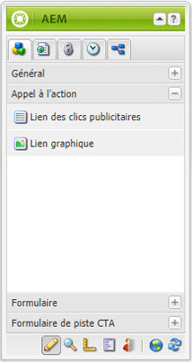
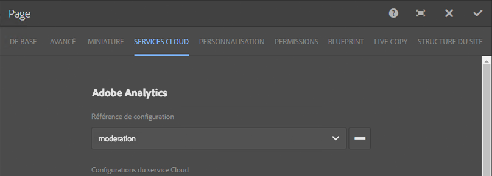

# Intégration des pages d’entrée à Adobe Analytics{#integrating-landing-pages-with-adobe-analytics}

AEM has integrated the landing pages solution with [Adobe Analytics](https://www.omniture.com/en/products/analytics/sitecatalyst) by using the following call-to-action (CTA) components:

1. Composant Lien des clics publicitaires
1. Composant Lien graphique

Ces composants exposent certains attributs qui peuvent être mappés via des variables Adobe Analytics (Trafic, variables de conversion) et des événements de réussite pour envoyer des informations à Adobe Analytics.

## Conditions préalables {#prerequisites}

Adobe recommends that you go through the [existing AEM-Adobe Analytics integration](/help/sites-administering/adobeanalytics.md) to understand how this integration works.

## Composants disponibles pour le mappage {#components-available-for-mapping}

In AEM, the **Call to Action** components - **ClickThroughLink** and **GraphicalLink** - displayed here in the sidekick, can be mapped to Adobe Analytics variables.

### Mappage de composants de page d’entrée sur Adobe Analytics {#mapping-landing-page-components-to-adobe-analytics}

Pour mapper des composants de page d’entrée sur Adobe Analytics :

1. Après avoir créé la configuration Adobe Analytics et créé une nouvelle structure, sélectionnez la suite de rapports appropriée dans le menu déroulant. Ceci fait, les variables Adobe Analytics sont récupérées et affichées dans l’outil de recherche de contenu.
1. Faites glisser des composants CTA (Appel à l’action) depuis le sidekick vers la zone de mappage située au centre de la page, s’il y a lieu.

<table>
 <tbody>
  <tr>
   <td><strong>Nom du composant</strong></td>
   <td><strong>Attributs présentés</strong></td>
   <td><strong>Signification de l’attribut</strong></td>
  </tr>
  <tr>
   <td><strong>Lien des clics publicitaires CTA</strong></td>
   <td><i>eventdata.clickthroughLinkLabel</i>   </td>
   <td>Libellé du lien ou texte du lien </td>
  </tr>
  <tr>
   <td>  </td>
   <td><i>eventdata.clickthroughLinkTarget</i>   </td>
   <td>La destination à laquelle vous accédez lorsque vous cliquez sur le lien </td>
  </tr>
  <tr>
   <td>  </td>
   <td><i>eventdata.événements.clickthroughLinkClick</i>   </td>
   <td>Evénement de clic. </td>
  </tr>
  <tr>
   <td><strong>Lien graphique CTA</strong></td>
   <td><i>eventdata.clicktroughImageLabel</i>   </td>
   <td>Titre de l'image CTA </td>
  </tr>
  <tr>
   <td>  </td>
   <td><i>eventdata.clicktroughImageTarget</i>   </td>
   <td>Destination à laquelle vous accédez lorsque vous cliquez sur l’image contenant un lien.</td>
  </tr>
  <tr>
   <td>  </td>
   <td><i>eventdata.clicktroughImageAsset</i>   </td>
   <td>Chemin d’accès au fichier d’image dans le référentiel </td>
  </tr>
  <tr>
   <td>  </td>
   <td><i>eventdata.événements.clicktroughImageClick</i>   </td>
   <td>Evénement de clic.</td>
  </tr>
 </tbody>
</table>

1. Mappez ces attributs exposés avec toute variable Adobe Analytics issue du Content Finder. La structure est maintenant prête à être utilisée.
1. You can now create a new landing page or open an existing landing page with existing CTA components and click **Cloud Services** tab in **Page Properties** from the sidekick (in the touch-optimized UI, select **Open Properties** and click **Cloud Services**) and configure the framework to use with landing page. Sélectionnez la structure dans la liste déroulante.

   

1. Après avoir configuré la structure avec la page d’accueil, vous pouvez utiliser les composants instrumentés. Tout clic effectué sur l’appel à l’action est alors enregistré dans Adobe Analytics.

