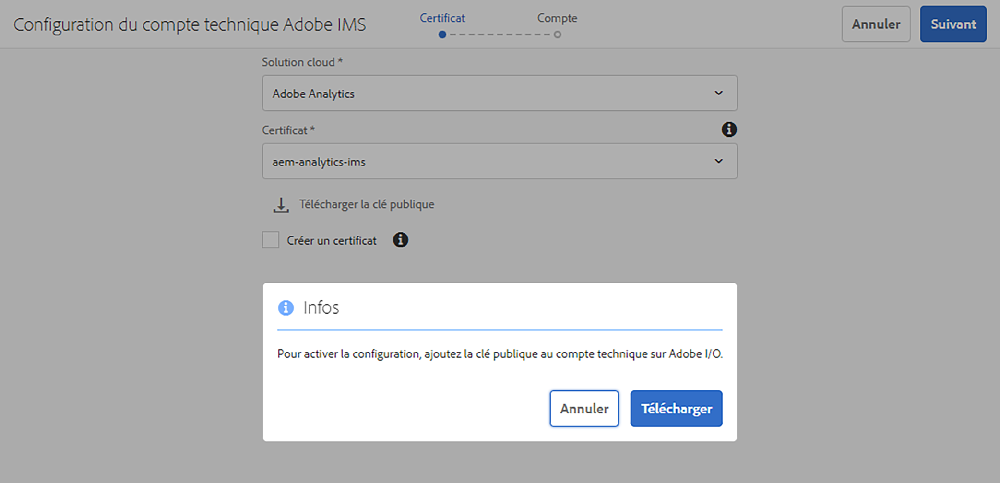
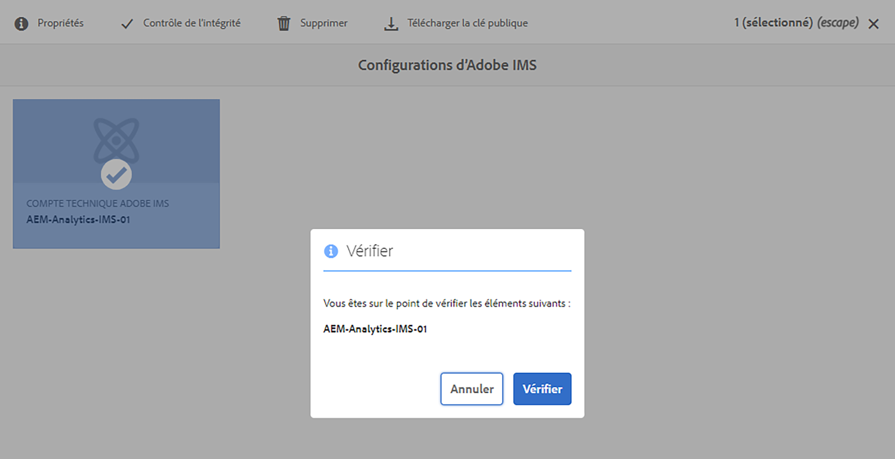

# Intégration à Adobe Analytics à l’aide d’Adobe I/O {#integration-with-adobe-analytics-using-adobe-i-o}

L’intégration d’AEM avec Adobe Analytics via l’API Analytics Standard nécessite la configuration d’Adobe IMS (système Identity Management) et d’Adobe I/O.

>[!NOTE]
>
>La prise en charge de l’API Adobe Analytics Standard 2.0 est nouvelle dans AEM 6.5.12.0. Cette version de l’API prend en charge l’authentification IMS.
>
>L’utilisation de l’API Adobe Analytics Classic 1.4 dans AEM est toujours prise en charge à des fins de rétrocompatibilité. Le [L’API Analytics Classic utilise l’authentification des informations d’identification d’utilisateur](/help/sites-administering/adobeanalytics-connect.md).
>
>La sélection de l’API repose sur la méthode d’authentification utilisée pour l’intégration AEM/Analytics.
>
>Des informations supplémentaires sont également disponibles sous [Migration vers les API 2.0](https://developer.adobe.com/analytics-apis/docs/2.0/guides/migration/).

## Prérequis {#prerequisites}

Avant de commencer cette procédure :

* [Prise en charge des Adobes](https://helpx.adobe.com/fr/contact/enterprise-support.ec.html) doit configurer votre compte pour :

   * Adobe Console
   * Adobe I/O
   * Adobe Analytics et
   * Adobe IMS (système Identity Management)

* L’administrateur système de votre entreprise doit utiliser le Admin Console pour ajouter les développeurs requis de votre entreprise aux profils de produit appropriés.

   * Les développeurs spécifiques disposent ainsi des autorisations nécessaires pour activer les intégrations dans Adobe I/O.
   * Pour plus d’informations, voir [Gestion des développeurs](https://helpx.adobe.com/enterprise/admin-guide.html/enterprise/using/manage-developers.ug.html).

## Configuration d’une configuration IMS - Génération d’une clé publique {#configuring-an-ims-configuration-generating-a-public-key}

La première étape de la configuration consiste à créer une configuration IMS dans AEM et à générer la clé publique.

1. Dans AEM, ouvrez le **Outils** .
1. Dans le **Sécurité** section select **Configurations d’Adobe IMS**.
1. Sélectionner **Créer** pour ouvrir le **Configuration du compte technique Adobe IMS**.
1. Utilisation de la liste déroulante sous **Configuration du cloud**, sélectionnez **Adobe Analytics**.
1. Activer **Création d’un certificat** et saisissez un nouvel alias.
1. Confirmer avec **Création d’un certificat**.

   

1. Sélectionner **Télécharger** (ou **Télécharger la clé publique**) pour télécharger le fichier sur votre lecteur local, afin qu’il soit prêt à être utilisé lors de la [configuration de l’Adobe I/O pour l’intégration d’Adobe Analytics avec AEM](#configuring-adobe-i-o-for-adobe-analytics-integration-with-aem).

   >[!CAUTION]
   >
   >Gardez cette configuration ouverte. Elle sera nécessaire à nouveau lorsque [Réalisation de la configuration IMS dans AEM](#completing-the-ims-configuration-in-aem).

   

## Configuration de l’Adobe I/O pour l’intégration d’Adobe Analytics avec AEM {#configuring-adobe-i-o-for-adobe-analytics-integration-with-aem}

Vous devez créer le projet Adobe I/O (intégration) avec Adobe Analytics que AEM utilisera, puis attribuer les privilèges requis.

### Création du projet {#creating-the-project}

Ouvrez la console Adobe I/O pour créer un projet I/O avec Adobe Target qui AEM utiliser :

<!--
>[!NOTE]
>
>See also the [Adobe I/O tutorials](https://www.adobe.io/apis/experienceplatform/home/tutorials/alltutorials.html).
-->

1. Ouvrez la console Adobe I/O pour Projets :

   [https://console.adobe.io/projects](https://console.adobe.io/projects)

1. Tous les projets que vous avez s’affichent. Sélectionner **Créer un projet** - l’emplacement et l’utilisation dépendent de :

   * Si vous n’avez pas encore de projet, **Créer un projet** sera au centre, en bas.
      
   * Si vous disposez déjà de projets, ceux-ci sont répertoriés et **Créer un projet** sera en haut à droite.
      

1. Sélectionner **Ajouter au projet** suivie de **API**:

   

1. Sélectionner **Adobe Analytics**, puis **Suivant**:

   >[!NOTE]
   >
   >Si vous êtes abonné à Adobe Analytics, mais que vous ne le voyez pas répertorié, cochez la case [Conditions préalables](#prerequisites).

   

1. Sélectionner **Compte de service (JWT)** comme type d’authentification, puis continuez avec **Suivant**:

   

1. **Chargement de votre clé publique**, puis, une fois l’opération terminée, passez à **Suivant**:

   

1. Vérifiez les informations d’identification et continuez avec **Suivant**:

   

1. Sélectionnez les profils de produit requis et continuez avec **Enregistrer l’API configurée**:

   >[!NOTE]
   >
   >Les profils de produits affichés avec dépendent si vous disposez des éléments suivants :
   >
   >* Adobe Target Standard - uniquement **Espace de travail par défaut** est disponible
   >* Adobe Target Premium : tous les espaces de travail disponibles sont répertoriés, comme illustré ci-dessous.

   

1. La configuration sera confirmée.

<!--
1. The creation will be confirmed, you can now **Continue to integration details**; these are needed for [Completing the IMS Configuration in AEM](#completing-the-ims-configuration-in-aem).

   
-->

### Attribution de privilèges à l’intégration {#assigning-privileges-to-the-integration}

Vous devez maintenant attribuer les privilèges requis à l’intégration :

1. Ouvrir l’Adobe **Admin Console**:

   * [https://adminconsole.adobe.com](https://adminconsole.adobe.com/)

1. Accédez à **Produits** (barre d’outils supérieure), puis sélectionnez **Adobe Analytics - &lt;*your-tenant-id*>** (dans le panneau de gauche).
1. Sélectionner **Profils de produit**, puis l’espace de travail requis dans la liste présentée. Par exemple, Espace de travail par défaut.
1. Sélectionner **Informations d’identification de l’API**, puis la configuration d’intégration requise.
1. Sélectionner **Éditeur** comme la propriété **Rôle de produit**; au lieu de **Observateur**.

## Détails stockés pour le projet d’intégration Adobe I/O {#details-stored-for-the-adobe-io-integration-project}

Dans la console Projets d’Adobe I/O , vous pouvez voir la liste de tous vos projets d’intégration :

* [https://console.adobe.io/projects](https://console.adobe.io/projects)

Sélectionnez une entrée de projet spécifique pour afficher plus de détails sur la configuration. Celles-ci comprennent les éléments suivants :

* Présentation du projet
* Statistiques
* Informations d’identification
   * Compte de service (JWT)
      * Informations d’identification
      * Génération de JWT
* API
   * Par exemple, Adobe Analytics

Certains d’entre eux vous devrez terminer l’intégration Adobe I/O pour Adobe Analytics dans AEM.

## Réalisation de la configuration IMS dans AEM {#completing-the-ims-configuration-in-aem}

Pour revenir à AEM, vous pouvez terminer la configuration IMS en ajoutant les valeurs requises de l’intégration Adobe I/O pour Target :

1. Revenez au [Configuration IMS ouverte dans AEM](#configuring-an-ims-configuration-generating-a-public-key).
1. Sélectionnez **Suivant**.

1. Ici, vous pouvez utiliser la variable [détails de la configuration du projet dans Adobe I/O](#details-stored-for-the-adobe-io-integration-project):

   * **Titre**: Votre texte.
   * **Serveur d’autorisation**: Copiez/collez ceci à partir du `aud` de la ligne **Payload** ci-dessous, par exemple `https://ims-na1.adobelogin.com` dans l’exemple ci-dessous
   * **Clé API**: Copiez-le depuis le **Informations d’identification** de la section [Présentation du projet](#details-stored-for-the-adobe-io-integration-project)
   * **Secret du client**: Générez-le dans le [Onglet Secret client de la section Compte de service (JWT)](#details-stored-for-the-adobe-io-integration-project)et copier
   * **Payload**: Copiez-le depuis le [Générez l’onglet JWT de la section Compte de service (JWT)](#details-stored-for-the-adobe-io-integration-project)

   

1. Confirmez avec **Créer**.

1. Votre configuration Adobe Target s’affichera dans la console AEM.

   

## Confirmation de la configuration IMS {#confirming-the-ims-configuration}

Pour confirmer que la configuration fonctionne comme prévu :

1. Ouvrez :

   * `https://localhost<port>/libs/cq/adobeims-configuration/content/configurations.html`

   Par exemple :

   * `https://localhost:4502/libs/cq/adobeims-configuration/content/configurations.html`

1. Sélectionnez votre configuration.
1. Sélectionner **Contrôle de l’intégrité** de la barre d’outils, suivie de **Vérifier**.

   

1. En cas de réussite, un message de confirmation s’affiche.

   <!--
   
   -->

## Configuration du service Adobe Analytics Cloud {#configuring-the-adobe-analytics-cloud-service}

La configuration peut désormais être référencée pour qu’un Cloud Service utilise l’API Analytics Standard :

1. Ouvrez le **Outils** . Ensuite, dans la variable **Cloud Services** , sélectionnez **Cloud Services hérités**.
1. Faites défiler jusqu’à **Adobe Analytics** et sélectionnez **Configurer maintenant**.

   Le **Créer une configuration** s’ouvre.

1. Saisissez un **Titre** et, si vous le souhaitez, un **Nom** (si rien n’est indiqué, cela sera généré à partir du titre).

   Vous pouvez également sélectionner le modèle requis (si plusieurs modèles sont disponibles).

1. Confirmez avec **Créer**.

   Le **Modifier le composant** s’ouvre.

1. Saisissez les détails dans le champ **Paramètres Analytics** tab :

   * **Authentification**: IMS

   * **Configuration IMS**: sélectionnez le nom de la configuration IMS.

1. Cliquez sur **Connexion à Analytics** pour initialiser la connexion avec Adobe Target.

   Si la connexion est établie, le message **Connexion réussie** s’affiche.

1. Sélectionner **OK** sur le message.

1. Renseignez les autres paramètres suivant les besoins, puis **OK** dans la boîte de dialogue pour confirmer la configuration.

1. Vous pouvez maintenant procéder à la [Ajout d’une structure Analytics](/help/sites-administering/adobeanalytics-connect.md) pour configurer les paramètres qui seront envoyés à Adobe Analytics.
