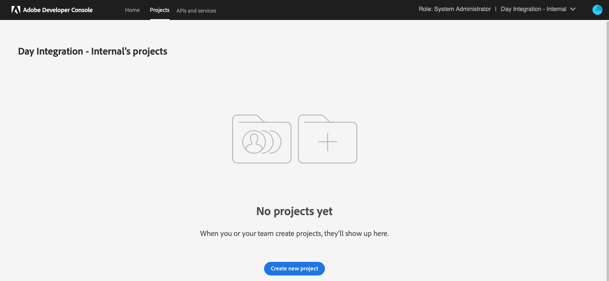

# Intégration à Adobe Analytics à l’aide d’IMS {#integration-with-adobe-analytics-using-ims}

L’intégration d’AEM à Adobe Analytics via l’API Analytics Standard nécessite la configuration d’Adobe IMS (Identity Management System) à l’aide de la Developer Console d’Adobe.

>[!NOTE]
>
>La prise en charge de l’API Adobe Analytics Standard 2.0 est une nouveauté d’AEM 6.5.12.0. Cette version de l’API prend en charge l’authentification IMS.
>
>L’utilisation de l’API Adobe Analytics Classic 1.4 dans AEM est toujours prise en charge à des fins de rétrocompatibilité. L’[API Analytics Classic utilise l’authentification à l’aide des informations d’identification d’utilisateur](/help/sites-administering/adobeanalytics-connect.md).
>
>La sélection de l’API repose sur la méthode d’authentification utilisée pour l’intégration AEM/Analytics.
>
>Des informations supplémentaires sont également disponibles sous [Migration vers les API 2.0](https://developer.adobe.com/analytics-apis/docs/2.0/guides/migration/).

## Prérequis {#prerequisites}

Avant de commencer cette procédure :

* L’[assistance d’Adobe](https://experienceleague.adobe.com/?support-solution=General&amp;lang=fr&amp;support-tab=home#support) doit configurer votre compte pour :

   * Adobe Console
   * Developer Console d’Adobe
   * Adobe Analytics et
   * Adobe IMS (système d’Identity Management)

* L’administrateur système de votre entreprise doit utiliser l’Admin Console pour donner aux développeurs de votre entreprise l’accès aux profils de produit appropriés.

   * Chaque membre de l’équipe de développement dispose ainsi des autorisations nécessaires pour activer les intégrations dans Adobe Developer Console.
   * Voir [Gérer l’équipe de développement](https://helpx.adobe.com/fr/enterprise/using/manage-developers.html).

## Configuration d’une configuration IMS - Génération d’une clé publique {#configuring-an-ims-configuration-generating-a-public-key}

La première étape de la configuration consiste à créer une configuration IMS dans AEM et à générer la clé publique.

1. Dans AEM, ouvrez le menu **Outils**.
1. Dans la section **Sécurité**, sélectionnez **Configurations Adobe IMS**.
1. Sélectionnez **Créer** pour ouvrir la **Configuration du compte technique Adobe IMS**.
1. À l’aide de la liste déroulante sous **Configuration du cloud**, sélectionnez **Adobe Analytics**.
1. Activez **Création d’un certificat** et saisissez un nouvel alias.
1. Confirmez en sélectionnant **Créer un certificat**.

   

1. Sélectionnez **Télécharger** (ou **Télécharger la clé publique**) pour télécharger le fichier sur votre lecteur local, afin qu’il soit prêt à être utilisé lors de la [configuration d’IMS pour l’intégration d’Adobe Analytics à AEM](#configuring-ims-for-adobe-analytics-integration-with-aem).

   >[!CAUTION]
   >
   >Gardez cette configuration ouverte. Elle sera nécessaire à nouveau lors de la [Réalisation de la configuration IMS dans AEM](#completing-the-ims-configuration-in-aem).

   

## Configuration IMS pour l’intégration d’Adobe Analytics à AEM {#configuring-ims-for-adobe-analytics-integration-with-aem}

À l’aide de l’Adobe Developer Console, créez un projet (intégration) avec Adobe Analytics (pour qu’AEM l’utilise), puis attribuez les privilèges requis.

### Création du projet {#creating-the-project}

Pour créer un projet avec Adobe Analytics qu’AEM peut utiliser, ouvrez Adobe Developer Console :

>[!CAUTION]
>
>Actuellement, Adobe prend en charge uniquement le type d&#39;identification du **Compte de service (JWT)** d’Adobe Developer Console.
>
>N’utilisez pas le type d’identification **OAuth serveur à serveur**, qui sera pris en charge à l’avenir.

1. Ouvrez la Developer Console d’Adobe pour les projets :

   [https://developer.adobe.com/console/projects](https://developer.adobe.com/console/projects)

1. Tous vos projets s’affichent. Sélectionnez **Créer un projet** - l’emplacement et l’utilisation de celui-ci dépendent des éléments suivants :

   * Si vous n’avez pas encore de projet, l’option **Créer un projet** s’affiche en bas, au centre.
     
   * Si vous disposez déjà de projets, ceux-ci sont répertoriés et l’option **Créer un projet** s’affiche en haut à droite.
     

1. Sélectionnez **Ajouter au projet** suivi de **API** :

   

1. Sélectionnez **Adobe Analytics**, puis **Suivant** :

   >[!NOTE]
   >
   >Si vous êtes abonné à Adobe Analytics mais que vous ne le voyez pas répertorié, cochez la case [Conditions préalables](#prerequisites).

   

1. Sélectionnez **Compte de service (JWT)** comme type d’authentification, puis continuez avec **Suivant** :

   

1. **Chargez votre clé publique**, puis, une fois l’opération terminée, choisissez **Suivant** :

   

1. Vérifiez les informations d’identification et continuez avec **Suivant** :

   

1. Sélectionnez les profils de produit requis et continuez avec **Enregistrer l’API configurée** :

   

1. La configuration est confirmée.

### Attribution de privilèges à l’intégration {#assigning-privileges-to-the-integration}

Attribuez maintenant les privilèges requis à l’intégration :

1. Ouvrez l’**Admin Console** d’Adobe :

   * [https://adminconsole.adobe.com](https://adminconsole.adobe.com/)

1. Accédez à **Produits** (barre d’outils supérieure), puis sélectionnez **Adobe Analytics - &lt;*votre-id-client*>** (dans le panneau de gauche).
1. Sélectionnez **Profils de produit**, puis l’espace de travail requis dans la liste présentée. Par exemple, Espace de travail par défaut.
1. Sélectionnez **Informations d’identification de l’API**, puis la configuration d’intégration requise.
1. Sélectionnez **Éditeur** comme **Rôle de produit**, au lieu d’**Observateur**.

## Détails stockés pour le projet d’intégration de la Developer Console d’Adobe {#details-stored-for-the-ims-integration-project}

Dans la console de Projets Adobe Developer, vous pouvez voir la liste de tous vos projets d’intégration :

* [https://developer.adobe.com/console/projects](https://developer.adobe.com/console/projects)

Pour afficher plus de détails sur la configuration, sélectionnez une entrée de projet spécifique. Ces informations comprennent les éléments suivants :

* Présentation du projet
* Insights
* Informations d’identification
   * Compte de service (JWT)
      * Détails sur l’identification
      * Génération du JWT
* Les API
   * Par exemple, Adobe Analytics

Pour certains d’entre eux vous devrez terminer l’intégration d’Adobe Analytics à AEM.

## Réalisation de la configuration IMS dans AEM {#completing-the-ims-configuration-in-aem}

Une fois revenu dans AEM, vous pouvez terminer la configuration IMS en ajoutant les valeurs requises à partir du projet d’intégration pour Analytics :

1. Revenez à la [Configuration IMS ouverte dans AEM](#configuring-an-ims-configuration-generating-a-public-key).
1. Sélectionnez **Suivant**.

1. Ici, vous pouvez utiliser les [Détails stockés pour le projet d’intégration de la Developer Console d’Adobe](#details-stored-for-the-ims-integration-project) :

   * **Titre** : votre texte.
   * **Serveur d’autorisation** : copiez/collez cette information à partir de la ligne `aud` de la section **Payload** ci-dessous, par exemple `https://ims-na1.adobelogin.com` dans l’exemple ci-dessous
   * **Clé API** : copiez-la à partir de la section **Informations d’identification** de la [Présentation du projet](#details-stored-for-the-ims-integration-project).
   * **Secret client** : générez-le dans l’[onglet Secret client de la section Compte de service (JWT)](#details-stored-for-the-ims-integration-project) et copiez-le.
   * **Payload** : copiez-le depuis l’[onglet Génération du JWT de la section Compte de service (JWT)](#details-stored-for-the-ims-integration-project).

   

1. Confirmez en sélectionnant **Créer**.

1. Votre configuration Adobe Analytics s’affiche dans la console AEM.

   

## Confirmation de la configuration IMS {#confirming-the-ims-configuration}

Pour vous assurer que la configuration fonctionne comme prévu :

1. Ouvrez :

   * `https://localhost<port>/libs/cq/adobeims-configuration/content/configurations.html`

   Par exemple :

   * `https://localhost:4502/libs/cq/adobeims-configuration/content/configurations.html`

1. Sélectionnez votre configuration.
1. Sélectionnez **Contrôle de l’intégrité** dans la barre d’outils, suivi de **Vérifier**.

   

1. En cas de réussite, un message de confirmation s’affiche.

## Configuration du service cloud Adobe Analytics {#configuring-the-adobe-analytics-cloud-service}

La configuration peut désormais être référencée pour qu’un service cloud utilise l’API Analytics Standard :

1. Ouvrez le menu **Outils**. Ensuite, dans la section **Services cloud**, sélectionnez **Services cloud hérités**.
1. Faites défiler jusqu’à **Adobe Analytics** et sélectionnez **Configurer maintenant**.

   La boîte de dialogue **Créer la configuration** s’ouvre.

1. Saisissez un **Titre** et, si vous le souhaitez, un **Nom** (si vous ne remplissez pas de champ, il sera généré à partir du titre).

   Vous pouvez également sélectionner le modèle requis (si plusieurs modèles sont disponibles).

1. Confirmez en sélectionnant **Créer**.

   La boîte de dialogue **Modifier le composant** s’ouvre.

1. Saisissez les détails dans l’onglet **Paramètres Analytics** :

   * **Authentification** : IMS

   * **Configuration IMS** : sélectionnez le nom de la configuration IMS.

1. Pour lancer la connexion à Adobe Analytics, cliquez sur **Se connecter à Analytics**.

   Si la connexion est réussie, le message **Connexion réussie** s’affiche.

1. Sélectionnez **OK** dans le message.

1. Renseignez les autres paramètres en fonction de vos besoins, puis cliquez sur **OK** dans la boîte de dialogue pour confirmer la configuration.

1. Vous pouvez maintenant procéder à l’[Ajout d’un framework Analytics](/help/sites-administering/adobeanalytics-connect.md) pour configurer les paramètres envoyés à Adobe Analytics.
