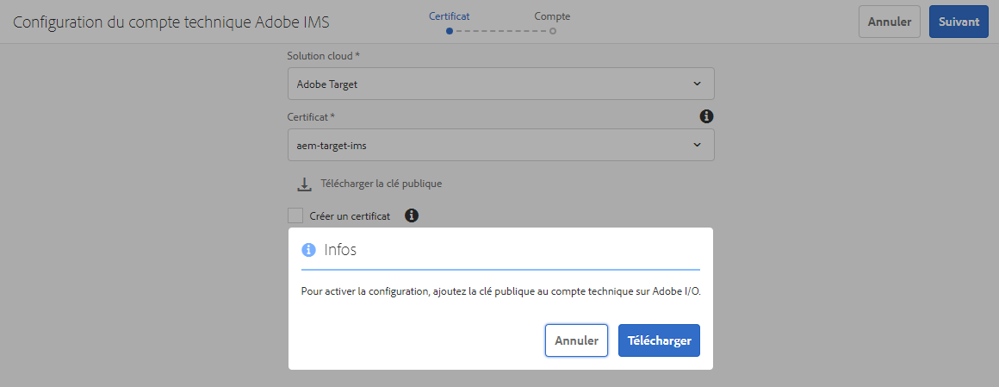
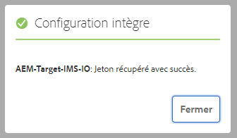

# Intégration à Adobe Target à l’aide d’Adobe I/O{#integration-with-adobe-target-using-adobe-i-o}

L’intégration de l’AEM avec Adobe Target via l’API Target Standard requiert la configuration de l’Adobe IMS (Identity Management System) et de l’Adobe I/O.

>[!NOTE]
>
>La prise en charge de l’API Adobe Target Standard est une nouveauté dans AEM 6.5. L’API Target Standard utilise l’authentification IMS.
>
>L’utilisation de l’API Adobe Target Classic dans AEM est toujours prise en charge pour la compatibilité ascendante. L&#39;API [Cible Classic utilise les informations d&#39;identification de l&#39;utilisateur ](/help/sites-administering/target-configuring.md#manually-integrating-with-adobe-target).
>
>La sélection de l’API est pilotée par la méthode d’authentification utilisée pour l’intégration AEM/Cible.
>Voir aussi la section [ID de client et code client](#tenant-client).

## Conditions préalables {#prerequisites}

Avant de commencer cette procédure :

* [L&#39;](https://helpx.adobe.com/fr/contact/enterprise-support.ec.html) assistance Adobe doit configurer votre compte pour :

   * Adobe Console
   * Adobe I/O
   * Adobe Target et
   * Adobe IMS (système Identity Management)

* L’administrateur système de votre entreprise doit utiliser le Admin Console pour ajouter les développeurs requis de votre entreprise aux profils de produits appropriés.

   * Cela permet aux développeurs spécifiques d’activer les intégrations dans l’Adobe I/O.
   * Pour plus de détails, voir [Gérer les développeurs](https://helpx.adobe.com/enterprise/admin-guide.html/enterprise/using/manage-developers.ug.html).

## Configuration d&#39;une configuration IMS - Génération d&#39;une clé publique {#configuring-an-ims-configuration-generating-a-public-key}

La première étape de la configuration consiste à créer une configuration IMS dans AEM et à générer la clé publique.

1. Dans AEM, ouvrez le menu **Outils**.
1. Dans la section **Sécurité**, sélectionnez **Configurations IMS d&#39;Adobe**.
1. Sélectionnez **Créer** pour ouvrir l&#39;Adobe **Configuration du compte technique IMS**.
1. Dans la liste déroulante sous **Configuration du cloud**, sélectionnez **Adobe Target**.
1. Activez **Créez un nouveau certificat** et saisissez un nouvel alias.
1. Confirmez avec **Créer un certificat**.

   

1. Sélectionnez **Télécharger** (ou **Télécharger la clé publique**) pour télécharger le fichier sur votre lecteur local, de sorte qu&#39;il soit prêt à être utilisé lors de la configuration de l&#39;Adobe I/O pour l&#39;intégration Adobe Target avec AEM](#configuring-adobe-i-o-for-adobe-target-integration-with-aem).[

   >[!CAUTION]
   >
   >Gardez cette configuration ouverte, elle sera nécessaire à nouveau lorsque [la configuration IMS sera terminée dans AEM](#completing-the-ims-configuration-in-aem).

   

## Configuration de l’Adobe I/O pour l’intégration Adobe Target avec l’AEM {#configuring-adobe-i-o-for-adobe-target-integration-with-aem}

Vous devez créer le projet d&#39;Adobe I/O (intégration) avec Adobe Target que AEM utilisera, puis attribuer les privilèges requis.

### Création du projet {#creating-the-project}

Ouvrez la console Adobe I/O pour créer un projet d&#39;E/S avec Adobe Target que AEM utilisera :

>[!NOTE]
>
>Voir aussi les [didacticiels d&#39;Adobe I/O](https://www.adobe.io/apis/experienceplatform/home/tutorials/alltutorials.html).

1. Ouvrez la console Adobe I/O pour Projets :

   [https://console.adobe.io/projects](https://console.adobe.io/projects)

1. Tous les projets que vous avez seront affichés. Sélectionnez **Créer un nouveau projet** - l&#39;emplacement et l&#39;utilisation dépendent :

   * Si vous n&#39;avez pas encore de projet, **Créer un nouveau projet** sera au centre, en bas.
      
   * Si vous avez déjà des projets existants, ils seront répertoriés et **Créer un nouveau projet** sera en haut à droite.
      

1. Sélectionnez **Ajouter au projet** suivi de **API** :

   

1. Sélectionnez **Adobe Target**, puis **Suivant** :

   >[!NOTE]
   >
   >Si vous êtes abonné à Adobe Target, mais que vous ne le voyez pas dans la liste, vous devez vérifier les [Conditions préalables](#prerequisites).

   

1. **Téléchargez votre clé** publique et, une fois l’opération terminée, poursuivez avec  **Suivant** :

   

1. Vérifiez les informations d’identification et continuez avec **Next** :

   

1. Sélectionnez les profils de produit requis et poursuivez avec **Enregistrer l&#39;API configurée** :

   >[!NOTE]
   >
   >Les profils de produit affichés dépendent si vous avez :
   >
   >* Adobe Target Standard - Seul **l’espace de travail par défaut** est disponible
   >* Adobe Target Premium - tous les espaces de travail disponibles sont répertoriés, comme illustré ci-dessous.

   

1. La création sera confirmée.

<!--
1. The creation will be confirmed, you can now **Continue to integration details**; these are needed for [Completing the IMS Configuration in AEM](#completing-the-ims-configuration-in-aem).

   
-->

### Attribution de privilèges à l&#39;intégration {#assigning-privileges-to-the-integration}

Vous devez maintenant attribuer les privilèges requis à l’intégration :

1. Ouvrez l’Adobe **Admin Console** :

   * [https://adminconsole.adobe.com](https://adminconsole.adobe.com/)

1. Accédez à **Produits** (barre d’outils supérieure), puis sélectionnez **Adobe Target - &quot;a3/>votre-locataire-id ***(dans le panneau de gauche).*
1. Sélectionnez **Profils de produits**, puis l&#39;espace de travail requis dans la liste présentée. Par exemple, Espace de travail par défaut.
1. Sélectionnez **Intégrations**, puis la configuration d&#39;intégration requise.
1. Sélectionnez **Editor** comme **Product Role**; au lieu de **Observer**.

## Détails stockés pour le projet d&#39;intégration d&#39;Adobe I/O {#details-stored-for-the-adobe-io-integration-project}

Dans la console Projets d’Adobe I/O, vous pouvez voir une liste de tous vos projets d’intégration :

* [https://console.adobe.io/projects](https://console.adobe.io/projects)

Sélectionnez **Vue** (à droite d&#39;une entrée de projet spécifique) pour afficher d&#39;autres détails sur la configuration. Celles-ci comprennent :

* Présentation du projet
* Statistiques
* Informations d’identification
   * Compte de service (JWT)
      * Informations d’identification
      * Générer JWT
* APIS
   * Par exemple, Adobe Target

Certains d&#39;entre eux devront compléter l&#39;intégration de l&#39;Adobe I/O pour la Cible en AEM.

## Fin de la configuration IMS en AEM {#completing-the-ims-configuration-in-aem}

Pour revenir à AEM, vous pouvez terminer la configuration IMS en ajoutant les valeurs requises de l&#39;intégration d&#39;Adobe I/O pour la Cible :

1. Revenez à la configuration [IMS ouverte dans AEM](#configuring-an-ims-configuration-generating-a-public-key).
1. Sélectionnez **Suivant**.

1. Vous pouvez ici utiliser les [détails de l&#39;Adobe I/O](#details-stored-for-the-adobe-io-integration-project) :

   * **Titre** : Votre texte.
   * **Serveur** d&#39;autorisation : Copiez/collez ceci à partir de la  `"aud"` ligne de la  **** section Payloadsection ci-dessous, par exemple  `"https://ims-na1.adobelogin.com"` dans l’exemple ci-dessous.
   * **Clé** API : Copiez ceci de la section   Présentation de l’intégration d’Adobe I/O pour la Cible
   * **Secret** client : Générez ce contenu dans la section   Présentation de l’intégration d’Adobe I/O pour la Cible, puis copiez
   * **Charge utile** : Copiez ceci de la section  [Generate ](#details-stored-for-the-adobe-io-integration-project) JWTsection de l’intégration d’Adobe I/O pour la Cible.

   

1. Confirmez avec **Créer**.

1. Votre configuration Adobe Target s&#39;affichera dans la console AEM.

   

## Confirmation de la configuration IMS {#confirming-the-ims-configuration}

Pour confirmer que la configuration fonctionne comme prévu :

1. Ouvrez :

   * `https://localhost<port>/libs/cq/adobeims-configuration/content/configurations.html`

   Par exemple :

   * `https://localhost:4502/libs/cq/adobeims-configuration/content/configurations.html`

1. Sélectionnez votre configuration.
1. Sélectionnez **Vérifier l&#39;intégrité** dans la barre d&#39;outils, puis **Vérifier**.

   

1. En cas de réussite, le message suivant s’affiche :

   

## Configuration du Cloud Service Adobe Target {#configuring-the-adobe-target-cloud-service}

La configuration peut désormais être référencée pour qu’un Cloud Service utilise l’API Target Standard :

1. Ouvrez le menu **Outils**. Puis, dans la section **Cloud Services**, sélectionnez **Cloud Services hérités**.
1. Faites défiler l&#39;écran jusqu&#39;à **Adobe Target** et sélectionnez **Configurer maintenant**.

   La boîte de dialogue **Créer une configuration** s&#39;ouvre.

1. Saisissez un **Titre** et, si vous le souhaitez, un **Nom** (si rien n&#39;est indiqué, ce champ sera généré à partir du titre).

   Vous pouvez également sélectionner le modèle requis (si plusieurs modèles sont disponibles).

1. Confirmez avec **Créer**.

   La boîte de dialogue **Modifier le composant** s&#39;ouvre.

1. Saisissez les détails dans l’onglet **Paramètres de l’Adobe Target** :

   * **Authentification** : IMS
   * **ID** du client : l&#39;Adobe IMS Tenant ID. Voir aussi la section [ID de client et code client](#tenant-client).

      >[!NOTE]
      >
      >Pour IMS, cette valeur doit être prise de la Cible elle-même. Vous pouvez vous connecter à la Cible et extraire l’ID de client de l’URL.
      >
      >Par exemple, si l’URL est :
      >
      >`https://experience.adobe.com/#/@yourtenantid/target/activities`
      >
      >Vous utiliserez ensuite `yourtenantid`.
   * **Code** client : Voir l’ID de  [client et la ](#tenant-client) description du client.
   * **Configuration** IMS : sélectionner le nom de la configuration IMS
   * **Type** d&#39;API : REPOSE
   * **Configuration d’A4T Analytics Cloud** : sélectionnez la configuration de cloud Analytics utilisée pour les objectifs et les mesures des activités de Target. Vous avez besoin de cette option si vous utilisez Adobe Analytics en tant que source de création de rapports lors du ciblage de contenu. Si vous ne voyez pas la configuration de votre cloud, consultez la note dans [Configuration de A4T Analytics Cloud Configuration](/help/sites-administering/target-configuring.md#configuring-a-t-analytics-cloud-configuration).
   * **Utiliser un ciblage** précis : Cette case à cocher est activée par défaut. Si cette option est sélectionnée, la configuration du service cloud attend le chargement du contexte avant de charger le contenu. Voir la remarque qui suit.
   * **Synchroniser les segments à partir d’Adobe Target** : Sélectionnez cette option pour télécharger les segments définis dans la Cible afin de les utiliser dans AEM. Vous devez sélectionner cette option lorsque la propriété Type d’API est REST, car les segments incorporés ne sont pas pris en charge, et vous devez toujours utiliser les segments de Target. (Notez que le terme « segment » d’AEM équivaut à « audience » dans Target.)
   * **Bibliothèque** client : Indiquez si vous souhaitez utiliser la bibliothèque cliente AT.js ou mbox.js (obsolète).
   * **Utilisez le système de gestion des balises pour fournir la bibliothèque** cliente : Utilisez la gestion dynamique des balises (obsolète), le lancement d’Adobe ou tout autre système de gestion des balises.
   * **Personnaliser AT.js** : Laissez ce champ vide si vous avez coché la case Gestion des balises ou pour utiliser AT.js par défaut. Vous pouvez également télécharger votre fichier AT.js personnalisé.  S’affiche uniquement si vous avez sélectionné AT.js.

   >[!NOTE]
   >
   >[La configuration d’un Cloud Service pour utiliser l’](/help/sites-administering/target-configuring.md#manually-integrating-with-adobe-target) API Cible Classic a été abandonnée (utilise l’onglet Paramètres Adobe Recommendations).
1. Cliquez sur **Se connecter à la Cible** pour initialiser la connexion avec Adobe Target.

   Si la connexion réussit, le message **Connexion réussie** s’affiche.

1. Sélectionnez **OK** dans le message, puis **OK** dans la boîte de dialogue pour confirmer la configuration.
1. Vous pouvez maintenant passer à [Ajouter un cadre de Cible](/help/sites-administering/target-configuring.md#adding-a-target-framework) pour configurer ContextHub ou les paramètres de ClientContext qui seront envoyés à la Cible. Notez que cela peut ne pas être nécessaire pour exporter des fragments d’expérience AEM vers la Cible.

### ID de client et code client {#tenant-client}

Avec [Adobe Experience Manager 6.5.8.0](/help/release-notes/sp-release-notes.md), le champ Code client a été ajouté à la fenêtre de configuration de la Cible.

Lors de la configuration des champs ID client et Code client, veuillez tenir compte des points suivants :

1. Pour la plupart des clients, l’ID de client et le code client sont identiques. Cela signifie que les deux champs contiennent les mêmes informations et sont identiques. Veillez à saisir l’identifiant du client dans les deux champs.
2. A des fins héritées, vous pouvez également entrer différentes valeurs dans les champs ID de client et Code client.

Dans les deux cas, il faut savoir que :

* Par défaut, le code client (s’il est ajouté en premier) sera également automatiquement copié dans le champ ID du client.
* Vous avez la possibilité de modifier le jeu d’ID de client par défaut.
* Par conséquent, les appels à la Cible du serveur principal sont basés sur l&#39;identifiant du client et les appels à la Cible côté client sont basés sur le code client.

Comme indiqué précédemment, le premier cas est le plus courant pour AEM 6.5. Dans les deux cas, assurez-vous que les champs **** contiennent les informations appropriées en fonction de vos besoins.

>[!NOTE]
>
> Si vous souhaitez modifier une configuration de Cible existante :
>
> 1. Saisissez de nouveau l’identifiant du client.
> 2. Se reconnecter à la Cible.
> 3. Enregistrez la configuration.

