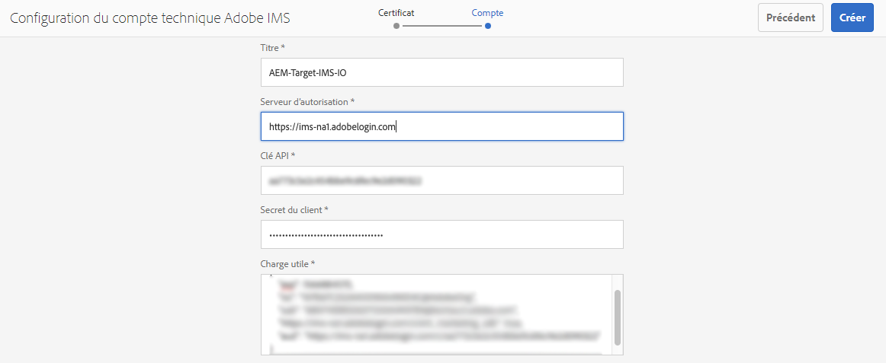
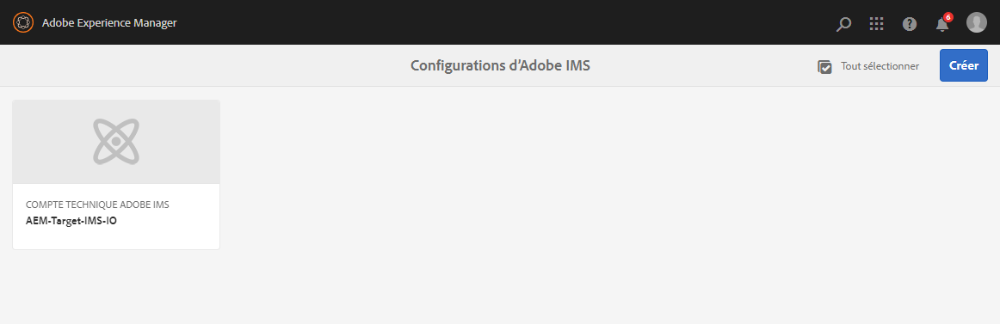
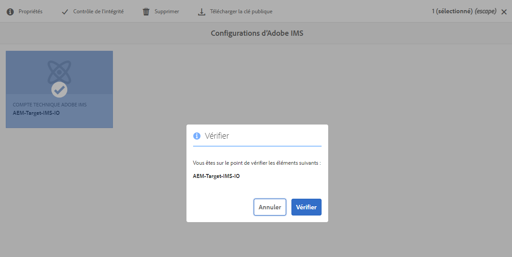

# Intégration à Adobe Target à l’aide d’IMS{#integration-with-adobe-target-using-ims}

L’intégration d’AEM à Adobe Target via l’API Target Standard nécessite la configuration d’Adobe IMS (Identity Management System) à l’aide de la Developer Console d’Adobe.

>[!NOTE]
>
>La prise en charge de l’API Adobe Target Standard est une nouveauté d’AEM 6.5. L’API Target Standard utilise l’authentification IMS.
>
>L’utilisation de l’API Adobe Target Classic dans AEM est toujours prise en charge à des fins de rétrocompatibilité. L’[API Target Classic utilise l’authentification à l’aide des informations d’identification d’utilisateur](/help/sites-administering/target-configuring.md#manually-integrating-with-adobe-target).
>
>La sélection de l’API repose sur la méthode d’authentification utilisée pour l’intégration AEM/Target.
>Consultez également la section [ID de client et code client](#tenant-client).

## Prérequis {#prerequisites}

Avant de commencer cette procédure :

* L’[assistance d’Adobe](https://experienceleague.adobe.com/?support-solution=General&amp;lang=fr&amp;support-tab=home#support) doit configurer votre compte pour :

   * Adobe Console
   * Developer Console d’Adobe
   * Adobe Target et
   * Adobe IMS (système d’Identity Management)

* L’administrateur système de votre entreprise doit utiliser l’Admin Console pour donner aux développeurs de votre entreprise l’accès aux profils de produit appropriés.

   * Chaque membre de l’équipe de développement dispose ainsi des autorisations nécessaires pour activer les intégrations dans Adobe Developer Console.
   * Voir [Gérer l’équipe de développement](https://helpx.adobe.com/fr/enterprise/using/manage-developers.html).

## Configuration d’une configuration IMS - Génération d’une clé publique {#configuring-an-ims-configuration-generating-a-public-key}

La première étape de la configuration consiste à créer une configuration IMS dans AEM et à générer la clé publique.

1. Dans AEM, ouvrez le menu **Outils**.
1. Dans la section **Sécurité**, sélectionnez **Configurations Adobe IMS**.
1. Sélectionnez **Créer** pour ouvrir la **Configuration du compte technique Adobe IMS**.
1. À l’aide de la liste déroulante sous **Configuration du cloud**, sélectionnez **Adobe Target**.
1. Activez **Création d’un certificat** et saisissez un nouvel alias.
1. Confirmez en sélectionnant **Créer un certificat**.

   

1. Sélectionnez **Télécharger** (ou **Télécharger la clé publique**) pour télécharger le fichier sur votre lecteur local, afin qu’il soit prêt à être utilisé lors de la [configuration d’IMS pour l’intégration d’Adobe Target avec AEM](#configuring-ims-for-adobe-target-integration-with-aem).

   >[!CAUTION]
   >
   >Gardez cette configuration ouverte. Elle sera nécessaire à nouveau lors de la [Réalisation de la configuration IMS dans AEM](#completing-the-ims-configuration-in-aem).

   

## Configuration d’IMS pour l’intégration d’Adobe Target avec AEM {#configuring-ims-for-adobe-target-integration-with-aem}

À l’aide d’Adobe Developer Console, vous devez créer un projet (intégration) avec Adobe Target qu’AEM peut utiliser, puis attribuer les privilèges requis.

### Création du projet {#creating-the-project}

Pour créer un projet avec Adobe Target qu’AEM peut utiliser, ouvrez Adobe Developer Console :

>[!CAUTION]
>
>Actuellement, Adobe prend en charge uniquement le type d&#39;identification du **Compte de service (JWT)** d’Adobe Developer Console.
>
>N’utilisez pas le type d’identification **OAuth serveur à serveur**, qui sera pris en charge à l’avenir.

1. Ouvrez la Developer Console d’Adobe pour les projets :

   [https://developer.adobe.com/console/projects](https://developer.adobe.com/console/projects)

1. Tous vos projets s’affichent. Sélectionnez **Créer un projet**. L’emplacement et l’utilisation de celui-ci dépendent des éléments suivants :

   * Si vous n’avez pas encore de projet, l’option **Créer un projet** s’affiche en bas, au centre.
     
   * Si vous disposez déjà de projets, ceux-ci sont répertoriés et l’option **Créer un projet** s’affiche en haut à droite.
     

1. Sélectionnez **Ajouter au projet** suivi de **API** :

   

1. Sélectionnez **Adobe Target**, puis **Suivant** :

   >[!NOTE]
   >
   >Si vous êtes abonné à Adobe Target, mais que vous ne le voyez pas répertorié, cochez la case [Conditions préalables](#prerequisites).

   

1. **Chargez votre clé publique**, puis, une fois l’opération terminée, choisissez **Suivant** :

   

1. Vérifiez les informations d’identification, puis sélectionnez **Suivant** :

   

1. Sélectionnez les profils de produit requis et continuez avec **Enregistrer l’API configurée** :

   >[!NOTE]
   >
   >Les profils de produits affichés dépendent si vous disposez des éléments suivants :
   >
   >* Adobe Target Standard - Seul l’**espace de travail par défaut** est disponible.
   >* Adobe Target Premium - Tous les espaces de travail disponibles sont répertoriés, comme illustré ci-dessous.

   

1. La création est confirmée.

<!--
1. The creation is confirmed, you can now **Continue to integration details**; these are needed for [Completing the IMS Configuration in AEM](#completing-the-ims-configuration-in-aem).

   
-->

### Attribution de privilèges à l’intégration {#assigning-privileges-to-the-integration}

Attribuez maintenant les privilèges requis à l’intégration :

1. Ouvrez l’**Admin Console** d’Adobe :

   * [https://adminconsole.adobe.com](https://adminconsole.adobe.com/)

1. Accédez à **Produits** (barre d’outils supérieure), puis sélectionnez **Adobe Target - &lt;*your-tenant-id*>** (dans le panneau de gauche).
1. Sélectionnez **Profils de produit**, puis l’espace de travail requis dans la liste présentée. Par exemple, Espace de travail par défaut.
1. Sélectionnez **Informations d’identification de l’API**, puis la configuration d’intégration requise.
1. Sélectionnez **Éditeur** comme **Rôle de produit**, au lieu d’**Observateur**.

## Détails stockés pour le projet d’intégration de la Developer Console d’Adobe {#details-stored-for-the-ims-integration-project}

Dans la Developer Console d’Adobe - Projets, vous pouvez voir la liste de tous vos projets d’intégration :

* [https://developer.adobe.com/console/projects](https://developer.adobe.com/console/projects)

Pour afficher des détails supplémentaires sur la configuration, sélectionnez **Afficher** (en regard d’une entrée de projet spécifique). Ces informations comprennent les éléments suivants :

* Présentation du projet
* Insights
* Informations d’identification
   * Compte de service (JWT)
      * Détails sur l’identification
      * Génération du JWT
* Les API
   * Par exemple, Adobe Target

Pour certains d’entre eux, vous devez terminer l’intégration d’Adobe Target à AEM basée sur l’IMS.

## Réalisation de la configuration IMS dans AEM {#completing-the-ims-configuration-in-aem}

Pour revenir à AEM, vous pouvez terminer la configuration IMS en ajoutant les valeurs requises à partir de l’intégration Adobe Developer Console pour Target :

1. Revenez à la [Configuration IMS ouverte dans AEM](#configuring-an-ims-configuration-generating-a-public-key).
1. Sélectionnez **Suivant**.

1. Ici, vous pouvez utiliser les [Détails de la configuration du projet dans la Developer Console d’Adobe](#details-stored-for-the-ims-integration-project) :

   * **Titre** : votre texte.
   * **Serveur d’autorisation** : copiez/collez cette information à partir de la ligne `aud` de la section **Payload** ci-dessous, par exemple `https://ims-na1.adobelogin.com` dans l’exemple ci-dessous
   * **Clé API** : copiez-la depuis la section [Présentation](#details-stored-for-the-ims-integration-project).
   * **Secret client** : générez-le dans la section [Présentation](#details-stored-for-the-ims-integration-project) et copiez-le.
   * **Payload** : copiez-le à partir de la section [Génération du JWT](#details-stored-for-the-ims-integration-project).

   

1. Confirmez en sélectionnant **Créer**.

1. Votre configuration Adobe Target s’affiche dans la console AEM.

   

## Confirmation de la configuration IMS {#confirming-the-ims-configuration}

Pour vous assurer que la configuration fonctionne comme prévu :

1. Ouvrez :

   * `https://localhost<port>/libs/cq/adobeims-configuration/content/configurations.html`

   Par exemple :

   * `https://localhost:4502/libs/cq/adobeims-configuration/content/configurations.html`

1. Sélectionnez votre configuration.
1. Sélectionnez **Contrôle de l’intégrité** dans la barre d’outils, suivi de **Vérifier**.

   

1. En cas de réussite, le message suivant s’affiche :

   

## Configuration du service cloud Adobe Target {#configuring-the-adobe-target-cloud-service}

La configuration peut désormais être référencée pour qu’un Cloud Service utilise l’API Target Standard :

1. Ouvrez le menu **Outils**. Ensuite, dans la section **Services cloud**, sélectionnez **Services cloud hérités**.
1. Faites défiler jusqu’à **Adobe Target** et sélectionnez **Configurer maintenant**.

   La boîte de dialogue **Créer la configuration** s’ouvre.

1. Saisissez un **Titre** et, si vous le souhaitez, un **Nom** (si vous ne renseignez pas le champ, il sera généré à partir du titre).

   Vous pouvez également sélectionner le modèle requis (si plusieurs modèles sont disponibles).

1. Confirmez en sélectionnant **Créer**.

   La boîte de dialogue **Modifier le composant** s’ouvre.

1. Saisissez les détails dans l’onglet **Paramètres Adobe Target** :

   * **Authentification** : IMS

   * **ID de client** : identifiant du client Adobe IMS. Consultez également la section [ID de client et code client](#tenant-client).

     >[!NOTE]
     >
     >Pour IMS, cette valeur doit être extraite de Target. Vous pouvez vous connecter à Target et extraire l’ID de client de l’URL.
     >
     >Par exemple, si l’URL est :
     >
     >`https://experience.adobe.com/#/@yourtenantid/target/activities`
     >
     >Vous pouvez alors utiliser `yourtenantid`.

   * **Code client** : consultez la section [ID de client et code client](#tenant-client).

   * **Configuration IMS** : sélectionnez le nom de la configuration IMS.

   * **Type d’API :** REST.

   * **Configuration Analytics Cloud A4T** : sélectionnez la configuration d’Analytics Cloud utilisée pour les objectifs et les mesures des activités de Target. Vous avez besoin de cette option si vous utilisez Adobe Analytics en tant que source de création de rapports lors du ciblage de contenu. Si vous ne voyez pas votre configuration cloud, consultez la remarque à ce sujet dans [Définition de la configuration A4T Analytics Cloud](/help/sites-administering/target-configuring.md#configuring-a-t-analytics-cloud-configuration).

   * **Utiliser un ciblage précis** : par défaut, cette case est cochée. Si cette option est sélectionnée, la configuration du service cloud attend le chargement du contexte avant de charger le contenu. Lisez la remarque qui suivant.

   * **Synchroniser les segments à partir d’Adobe Target** : sélectionnez cette option pour télécharger les segments définis dans Target afin de les utiliser dans AEM. Sélectionnez cette option lorsque la propriété Type d’API est REST, car les segments incorporés ne sont pas pris en charge, et vous devez toujours utiliser les segments de Target. (Le terme AEM « segment » est l’équivalent d’« audience » dans Target.)

   * **Bibliothèque cliente** : indiquez si vous souhaitez utiliser la bibliothèque cliente AT.js ou mbox.js (obsolète).

   * **Utilisation du système de gestion des balises pour diffuser la bibliothèque cliente** : utilisez la gestion dynamique des balises (obsolète), Adobe Launch ou tout autre système de gestion des balises.

   * **AT.js personnalisé** : laissez ce champ vierge si vous avez coché la case Gestion dynamique des balises ou pour utiliser le fichier AT.js par défaut. Vous pouvez également télécharger votre fichier AT.js personnalisé. S’affiche uniquement si vous avez sélectionné AT.js.

   >[!NOTE]
   >
   >La [Configuration d’un service cloud pour utiliser l’API Target Classic](/help/sites-administering/target-configuring.md#manually-integrating-with-adobe-target) est obsolète (utilise désormais l’onglet Paramètres d’Adobe Recommendations).

1. Cliquez sur **Se connecter à Target** pour lancer la connexion à Adobe Target.

   Si la connexion est réussie, le message **Connexion réussie** s’affiche.

1. Sélectionnez **OK** dans le message, puis **OK** dans la boîte de dialogue pour confirmer la configuration.

1. Vous pouvez maintenant procéder à l’[ajout d’un framework Target](/help/sites-administering/target-configuring.md#adding-a-target-framework) pour configurer les paramètres ContextHub ou ClientContext qui seront envoyés à Target. Notez que cela n’est peut-être pas nécessaire pour exporter des fragments d’expérience AEM vers Target.

### ID de client et code client {#tenant-client}

À partir d’[Adobe Experience Manager 6.5.8.0](/help/release-notes/release-notes.md), le champ Code client a été ajouté à la fenêtre de configuration de Target.

Lors de la configuration des champs d’ID client et de code client, prenez en compte les points suivants :

1. Pour la plupart des clients, l’ID de client et le code client sont identiques. Cela signifie que les deux champs contiennent les mêmes informations et sont identiques. Veillez à saisir l’identifiant du client dans les deux champs.
2. Pour des raisons d’héritage, vous pouvez également entrer différentes valeurs dans les champs d’ID client et de Code client.

Dans les deux cas, tenez compte des points suivants :

* Par défaut, le code client (s’il est ajouté en premier) est également automatiquement copié dans le champ d’ID client ;
* Vous pouvez éventuellement modifier le jeu d’ID client par défaut.
* Les appels back-end vers Target sont basés sur l’ID client et les appels vers Target côté client sont basés sur le code client.

Comme indiqué précédemment, le premier cas est le plus courant pour AEM 6.5. Dans les deux cas, assurez-vous que **les deux** champs contiennent les informations correctes en fonction de vos besoins.

>[!NOTE]
>
>Si vous souhaitez modifier une configuration Target existante :
>
>1. saisissez de nouveau l’ID client ;
>2. reconnectez-vous à Target ;
>3. enregistrez la configuration.
