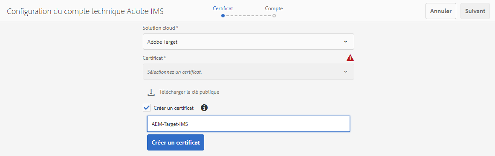

# Intégration avec Adobe Target à l’aide d’IMS{#integration-with-adobe-target-using-ims}

L’intégration d’AEM à Adobe Target via l’API Target Standard nécessite la configuration d’Adobe IMS (système Identity Management) à l’aide de la console Adobe Developer.

>[!NOTE]
>
>La prise en charge de l’API Adobe Target Standard est nouvelle dans AEM 6.5. L’API Target Standard utilise l’authentification IMS.
>
>L’utilisation de l’API Adobe Target Classic dans AEM est toujours prise en charge à des fins de rétrocompatibilité. Le [L’API Target Classic utilise l’authentification des informations d’identification d’utilisateur](/help/sites-administering/target-configuring.md#manually-integrating-with-adobe-target).
>
>La sélection de l’API repose sur la méthode d’authentification utilisée pour l’intégration AEM/Target.
>Voir aussi [ID de client et code client](#tenant-client) .

## Conditions préalables {#prerequisites}

Avant de commencer cette procédure :

* L’[assistance Adobe](https://helpx.adobe.com/fr/contact/enterprise-support.ec.html) doit configurer votre compte avec les éléments suivants :

   * Adobe Console
   * Developer Console Adobe
   * Adobe Target et
   * Adobe IMS (système d’Identity Management)

* L’administrateur système de votre entreprise doit utiliser le Admin Console pour ajouter les développeurs requis de votre entreprise aux profils de produit appropriés.

   * Les développeurs spécifiques disposent ainsi des autorisations nécessaires pour activer les intégrations dans la console Adobe Developer.
   * Pour plus d’informations, consultez le document [Gestion des développeurs](https://helpx.adobe.com/fr/enterprise/admin-guide.html/enterprise/using/manage-developers.ug.html).

## Configuration d’une configuration IMS - Génération d’une clé publique {#configuring-an-ims-configuration-generating-a-public-key}

La première étape de la configuration consiste à créer une configuration IMS dans AEM et à générer la clé publique.

1. Dans AEM, ouvrez le menu **Outils**.
1. Dans la section **Sécurité**, sélectionnez **Configurations Adobe IMS**.
1. Sélectionnez **Créer** pour ouvrir la **Configuration du compte technique Adobe IMS**.
1. Utilisation de la liste déroulante sous **Configuration du cloud**, sélectionnez **Adobe Target**.
1. Activez **Créer un certificat** et saisissez un nouvel alias.
1. Confirmez avec **Créer un certificat**.

   

1. Sélectionnez **Télécharger** (ou **Télécharger la clé publique**) pour télécharger le fichier sur votre lecteur local, afin qu’il soit prêt à être utilisé lors de la [configuration d’IMS pour l’intégration d’Adobe Target avec AEM](#configuring-ims-for-adobe-target-integration-with-aem).

   >[!CAUTION]
   >
   >Gardez cette configuration ouverte. Elle sera de nouveau nécessaire pour la [Réalisation de la configuration IMS dans AEM](#completing-the-ims-configuration-in-aem).

   

## Configuration d’IMS pour l’intégration d’Adobe Target avec AEM {#configuring-ims-for-adobe-target-integration-with-aem}

À l’aide de la console Adobe Developer, vous devez créer un projet (intégration) avec Adobe Target que AEM utilisera, puis attribuer les privilèges requis.

### Création du projet {#creating-the-project}

Ouvrez la Developer Console Adobe pour créer un projet avec Adobe Target qu’AEM pourra utiliser :

1. Ouvrez la Developer Console Adobe pour les projets :

   [https://developer.adobe.com/console/projects](https://developer.adobe.com/console/projects)

1. Tous les projets que vous avez s’affichent. Sélectionnez **Créer un projet** - L’emplacement et l’utilisation dépendent des éléments suivants :

   * Si vous n’avez pas encore de projet, **Créer un projet** sera au centre, en bas.
      
   * Si vous avez déjà des projets existants, ils seront répertoriés dans cette liste et **Créer un projet** apparaîtra en haut à droite.
      

1. Sélectionnez **Ajouter au projet**, puis **API** :

   

1. Sélectionnez **Adobe Target**, puis **Suivant** :

   >[!NOTE]
   >
   >Si vous êtes abonné à Adobe Target, mais que vous ne le voyez pas répertorié, cochez la case [Conditions préalables](#prerequisites).

   

1. **Chargement de votre clé publique**, puis, une fois l’opération terminée, passez à **Suivant** :

   

1. Vérifiez les informations d’identification et continuez avec **Suivant** :

   

1. Sélectionnez les profils de produit requis et continuez en sélectionnant **Enregistrer l’API configurée** :

   >[!NOTE]
   >
   >Les profils de produits affichés dépendent de si vous disposez des éléments suivants :
   >
   >* Adobe Target Standard - Seul l’**espace de travail par défaut** est disponible.
   >* Adobe Target Premium - Tous les espaces de travail disponibles sont répertoriés, comme illustré ci-dessous.

   

1. La création sera confirmée.

<!--
1. The creation will be confirmed, you can now **Continue to integration details**; these are needed for [Completing the IMS Configuration in AEM](#completing-the-ims-configuration-in-aem).

   
-->

### Attribution de privilèges à l’intégration {#assigning-privileges-to-the-integration}

Vous devez maintenant attribuer les privilèges requis à l’intégration :

1. Ouvrez l’**Admin Console** Adobe :

   * [https://adminconsole.adobe.com](https://adminconsole.adobe.com/)

1. Accédez à **Produits** (barre d’outils supérieure), puis sélectionnez **Adobe Target - &lt;*votre-id-client*>** (dans le panneau de gauche).
1. Sélectionnez **Profils de produit**, puis l’espace de travail que vous souhaitez dans la liste présentée. Par exemple, l’espace de travail par défaut.
1. Sélectionnez **API Credentials** (Informations d’identification de l’API), puis la configuration d’intégration requise.
1. Sélectionnez **Editor** (Éditeur) en tant que propriété de **Product Role** (Rôle de produit) au lieu d’**Observer** (Observateur).

## Informations stockées pour le projet d’intégration de la Developer Console Adobe {#details-stored-for-the-ims-integration-project}

Dans la Developer Console Adobe - Projets, vous pouvez voir la liste de tous vos projets d’intégration :

* [https://developer.adobe.com/console/projects](https://developer.adobe.com/console/projects)

Sélectionnez **Afficher** (à droite d’une entrée de projet spécifique) pour afficher des détails supplémentaires sur la configuration. Celles-ci comprennent les éléments suivants :

* Présentation du projet
* Statistiques
* Informations d’identification
   * Compte de service (JWT)
      * Informations d’identification
      * Génération de JWT
* API
   * Par exemple, Adobe Target

Pour certains d’entre eux, vous devrez terminer l’intégration d’Adobe Target à AEM basée sur l’IMS.

## Réalisation de la configuration IMS dans AEM {#completing-the-ims-configuration-in-aem}

Pour revenir à AEM, vous pouvez terminer la configuration IMS en ajoutant les valeurs requises à partir de l’intégration de la console Adobe Developer pour Target :

1. Retournez dans l’instance de [Configuration IMS ouverte dans AEM](#configuring-an-ims-configuration-generating-a-public-key).
1. Sélectionnez **Suivant**.

1. Vous pouvez alors utiliser les [informations de configuration du projet dans la Developer Console Adobe](#details-stored-for-the-ims-integration-project) :

   * **Titre** : votre texte.
   * **Serveur d’autorisation** : copiez/collez ceci à partir de la ligne `aud` de la section **Payload** ci-dessous, par exemple `https://ims-na1.adobelogin.com` dans l’exemple ci-dessous.
   * **Clé API**: Copiez-le depuis le [Présentation](#details-stored-for-the-ims-integration-project) section
   * **Secret du client**: Générez-le dans le [Présentation](#details-stored-for-the-ims-integration-project) et copier
   * **Payload** : copiez-le à partir de la section [Génération de JWT](#details-stored-for-the-ims-integration-project).

   

1. Confirmez avec **Créer**.

1. Votre configuration Adobe Target s’affichera dans la console AEM.

   

## Confirmation de la configuration IMS {#confirming-the-ims-configuration}

Pour confirmer que la configuration fonctionne comme prévu :

1. Ouvrez :

   * `https://localhost<port>/libs/cq/adobeims-configuration/content/configurations.html`

   Par exemple :

   * `https://localhost:4502/libs/cq/adobeims-configuration/content/configurations.html`

1. Sélectionnez votre configuration.
1. Sélectionnez **Contrôle de l’intégrité** dans la barre d’outils, puis **Vérifier**.

   

1. En cas de réussite, le message suivant s’affiche :

   

## Configuration du Cloud Service Adobe Target {#configuring-the-adobe-target-cloud-service}

La configuration peut désormais être référencée pour qu’un Cloud Service utilise l’API Target Standard :

1. Ouvrez le **Outils** . Ensuite, dans la variable **Cloud Services** , sélectionnez **Cloud Services hérités**.
1. Faites défiler jusqu’à **Adobe Target** et sélectionnez **Configurer maintenant**.

   Le **Créer une configuration** s’ouvre.

1. Saisissez un **Titre** et, si vous le souhaitez, un **Nom** (si rien n’est indiqué, cela sera généré à partir du titre).

   Vous pouvez également sélectionner le modèle requis (si plusieurs modèles sont disponibles).

1. Confirmez avec **Créer**.

   Le **Modifier le composant** s’ouvre.

1. Saisissez les détails dans le champ **Paramètres Adobe Target** tab :

   * **Authentification**: IMS

   * **Identifiant du client**: Identifiant du tenant Adobe IMS. Voir aussi [ID de client et code client](#tenant-client) .

      >[!NOTE]
      >
      >Pour IMS, cette valeur doit être extraite de Target. Vous pouvez vous connecter à Target et extraire l’ID de tenant de l’URL.
      >
      >Par exemple, si l’URL est :
      >
      >`https://experience.adobe.com/#/@yourtenantid/target/activities`
      >
      >Vous pouvez alors utiliser `yourtenantid`.

   * **Code client**: Voir [ID de client et code client](#tenant-client) .

   * **Configuration IMS**: sélectionnez le nom de la configuration IMS.

   * **Type d’API**: REST

   * **Configuration d’A4T Analytics Cloud** : sélectionnez la configuration de cloud Analytics utilisée pour les objectifs et les mesures des activités de Target. Vous avez besoin de cette option si vous utilisez Adobe Analytics en tant que source de création de rapports lors du ciblage de contenu. Si vous ne voyez pas votre configuration cloud, reportez-vous à la remarque de la section [Configuration de la configuration d’Analytics Cloud A4T](/help/sites-administering/target-configuring.md#configuring-a-t-analytics-cloud-configuration).

   * **Utiliser un ciblage précis**: Cette case est cochée par défaut. Si cette option est sélectionnée, la configuration du service cloud attend le chargement du contexte avant de charger le contenu. Voir la remarque qui suit.

   * **Synchronisation des segments à partir d’Adobe Target**: Sélectionnez cette option pour télécharger les segments définis dans Target afin de les utiliser dans AEM. Vous devez sélectionner cette option lorsque la propriété Type d’API est REST, car les segments incorporés ne sont pas pris en charge, et vous devez toujours utiliser les segments de Target. (Notez que le terme « segment » d’AEM équivaut à « audience » dans Target.)

   * **Bibliothèque cliente**: Indiquez si vous souhaitez utiliser la bibliothèque cliente AT.js ou mbox.js (obsolète).

   * **Utilisation de Tag Management System pour diffuser la bibliothèque cliente**: Utilisez DTM (obsolète), Adobe Launch ou tout autre système de gestion des balises.

   * **Fichier AT.js personnalisé**: Laissez ce champ vide si vous avez coché la case Tag Management ou pour utiliser le fichier AT.js par défaut. Vous pouvez également télécharger votre fichier AT.js personnalisé.  S’affiche uniquement si vous avez sélectionné AT.js.
   >[!NOTE]
   >
   >[Configuration d’un Cloud Service pour utiliser l’API Target Classic](/help/sites-administering/target-configuring.md#manually-integrating-with-adobe-target) est obsolète (utilise l’onglet Paramètres d’Adobe Recommendations ).

1. Cliquez sur **Connexion à Target** pour initialiser la connexion avec Adobe Target.

   Si la connexion est réussie, le message **Connexion réussie** s’affiche.

1. Sélectionner **OK** sur le message, suivi de **OK** dans la boîte de dialogue pour confirmer la configuration.

1. Vous pouvez maintenant procéder à la [Ajout d’une structure Target](/help/sites-administering/target-configuring.md#adding-a-target-framework) pour configurer les paramètres ContextHub ou de ClientContext qui seront envoyés à Target. Notez que cela n’est peut-être pas nécessaire pour exporter AEM fragments d’expérience vers Target.

### ID de client et code client {#tenant-client}

Avec [Adobe Experience Manager 6.5.8.0](/help/release-notes/release-notes.md), le champ Code client a été ajouté à la fenêtre de configuration de Target.

Lors de la configuration des champs Identifiant du client et Code client, veuillez tenir compte des points suivants :

1. Pour la plupart des clients, l’ID de client et le code client sont identiques. Cela signifie que les deux champs contiennent les mêmes informations et sont identiques. Veillez à saisir l’identifiant du client dans les deux champs.
2. Pour des raisons d’héritage, vous pouvez également entrer différentes valeurs dans les champs d’ID client et de Code client.

Dans les deux cas, il faut savoir que :

* par défaut, le code client (s’il est ajouté en premier) sera également automatiquement copié dans le champ d’ID client ;
* vous avez la possibilité de modifier le jeu d’ID client par défaut.
* Par conséquent, les appels du serveur principal vers Target sont basés sur l’ID client et les appels vers Target côté client sont basés sur le Code client.

Comme indiqué précédemment, le premier cas est le plus courant pour AEM 6.5. Dans les deux cas, assurez-vous que **both** contiennent les informations correctes en fonction de vos besoins.

>[!NOTE]
>
> Si vous souhaitez modifier une configuration Target existante :
>
> 1. saisissez de nouveau l’ID client ;
> 2. reconnectez-vous à Target ;
> 3. enregistrez la configuration.

