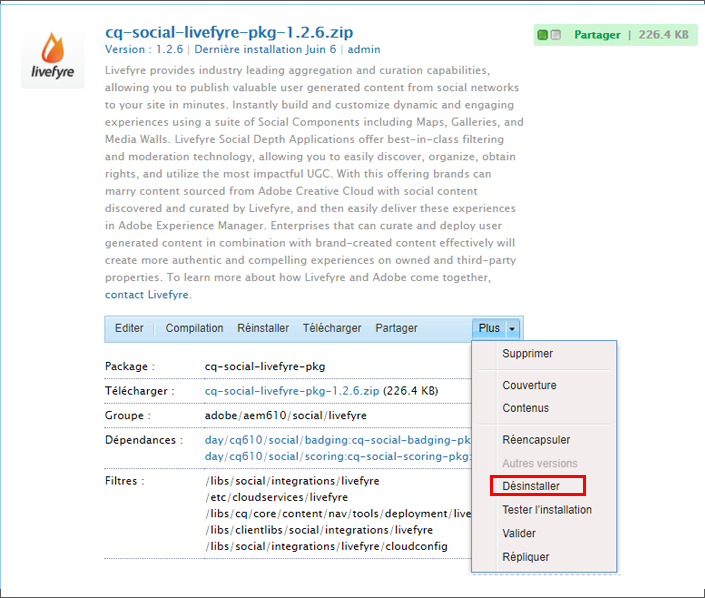

# Intégration à Livefyre{#integrating-with-livefyre}

Découvrez comment intégrer les meilleures fonctionnalités de traitement du secteur de Livefyre à votre instance AEM 6.5, pour pouvoir ainsi publier en quelques minutes sur votre site le contenu créé par les utilisateurs sur les réseaux sociaux.

## Prise en main {#getting-started}

### Installez le module de Livefyre pour AEM {#install-livefyre-package-for-aem}

AEM 6.5 est livré avec le module 1.2.6 de Livefyre pré-installé. Ce module inclut uniquement l’intégration Livefyre limitée à AEM Sites et doit être désinstallé avant l’installation d’un module mis à jour. Avec le dernier module, vous pouvez expérimenter l’intégration totale de Livefyre à AEM, y compris Sites, Assets et Commerce.

>[!NOTE]
>
>Certaines fonctionnalités du module AEM-LF dépendent du Social Component Framework (SCF). Si vous utilisez le module de fonctionnalités Livefyre dans le cadre d’un site non communautaire, vous devez déclarer *cq.social.scf* comme dépendance dans les bibliothèques clientes du site web. Si vous utilisez le module de fonctionnalités Livefyre dans le cadre d’un site web communautaire, cette dépendance doit déjà être déclarée.

1. Sur la page d’accueil AEM, cliquez sur l’icône **Outils** dans le rail de gauche.
1. Accédez à **Déploiement > Modules**.
1. Dans le Gestionnaire de modules, faites défiler l’écran jusqu’à ce que le module de fonctionnalités Livefyre préinstallé s’affiche, puis cliquez sur le titre du module **cq-social-livefyre-pkg-1.2.6.zip** pour développer les options.
1. Cliquez sur **Plus > Désinstaller**.

   

1. Téléchargez le package Livefyre à partir de [Distribution logicielle](https://experience.adobe.com/#/downloads/content/software-distribution/en/aem.html).

1. Installez le package téléchargé à partir du gestionnaire de modules. Pour plus d’informations sur l’utilisation de la distribution logicielle et des modules dans AEM, voir [Comment utiliser les modules](/help/sites-administering/package-manager.md) .

   

   Le module Livefyre-AEM est maintenant installé. Pour pouvoir commencer à utiliser les fonctionnalités d’intégration, vous devez configurer AEM pour utiliser Livefyre.

   Pour plus d’informations et de notes de mise à jour sur les Feature Packs, voir [Feature Packs](https://helpx.adobe.com/fr/experience-manager/6-3/release-notes/feature-packs-release-notes.html).

### Configurez AEM pour utiliser Livefyre : Création d’un dossier de configuration {#configure-aem-to-use-livefyre-create-a-configuration-folder}

1. Sur la page d’accueil d’AEM, cliquez sur l’icône **Outils** dans le rail de gauche, puis accédez à **Général > Explorateur de configuration**.
   * Pour plus d’informations, consultez la documentation relative au [Navigateur de configuration](/help/sites-administering/configurations.md).
1. Cliquez sur **Créer** pour ouvrir la boîte de dialogue Créer une configuration.
1. Nommez votre configuration et cochez la case **Configurations du cloud** .

   Cela créera un dossier sous **Outils > Déploiement > Configuration Livefyre** portant le nom saisi.

   

### Configuration d’AEM pour utiliser Livefyre : création d’une configuration Livefyre {#configure-aem-to-use-livefyre-create-a-livefyre-configuration}

Configurez AEM pour utiliser les informations d’identification de licence Livefyre de votre organisation et ainsi autoriser la communication entre Livefyre et AEM.

1. Sur la page d’accueil d’AEM, cliquez sur l’icône **Outils** dans le rail de gauche, puis accédez à **Déploiement > Configuration Livefyre**.
1. Sélectionnez le dossier de configuration dans lequel vous souhaitez créer une nouvelle configuration Livefyre, puis cliquez sur **Créer**.

   

   >[!NOTE]
   >
   >Pour que les configurations Livefyre puissent être ajoutées aux dossiers, les configurations cloud doivent être activées dans leurs propriétés. Les dossiers de configuration sont créés et gérés dans le [navigateur de configuration.](/help/sites-administering/configurations.md)
   >
   >Vous ne pouvez pas créer de nom pour une configuration, celle-ci étant référencée par le chemin d’accès au dossier dans laquelle elle se trouve. Vous ne pouvez disposer que d’une configuration par dossier.

1. Sélectionnez la carte de configuration Livefyre nouvellement créée, puis cliquez sur **Propriétés**.

   

1. Saisissez les informations d’identification Livefyre de votre entreprise, puis cliquez sur **OK**.

   

   Pour accéder à ces informations, ouvrez Livefyre Studio et accédez à **Paramètres > Paramètres d’intégration > Informations d’identification**.

   Votre instance AEM est maintenant configurée pour utiliser Livefyre et vous pouvez utiliser les fonctionnalités d’intégration.

### Personnalisation de l’intégration SSO {#customize-single-sign-on-integration}

Le module Livefyre pour AEM comprend une intégration clé en main entre les profils AEM Communities et le service SSO de Livefyre.

Lorsque les utilisateurs se connectent à votre site AEM, ils sont également connectés aux composants sociaux de Livefyre. Lorsqu’un utilisateur déconnecté tente d’utiliser une fonctionnalité de composant Livefyre nécessitant une authentification (par exemple, télécharger une photo), le composant Livefyre lance l’authentification de l’utilisateur.

L’intégration d’authentification par défaut peut ne pas être parfaite pour chaque site. Pour respecter au mieux le flux d’authentification dans les modèles de votre site, vous pouvez remplacer le délégué d’authentification de Livefyre par défaut selon vos besoins. Suivez ces étapes :

1. À l’aide de CRXDE Lite, copiez */libs/social/integrations/livefyre/components/authorizablecomponent/authclientlib* dans */apps/social/integrations/livefyre/components/authorizablecomponent/authclientlib*.
1. Modifiez et enregistrez */apps/social/integrations/livefyre/components/authorizablecomponent/authclientlib/auth.js* pour mettre en oeuvre un délégué d’authentification Livefyre qui répond à vos besoins.

   Pour plus d’informations sur la personnalisation d’un délégué d’authentification, voir [Intégration d’identité](https://answers.livefyre.com/developers/identity-integration/).

   Pour plus d’informations sur AEM clientlibs, voir [Utilisation de bibliothèques côté client](https://helpx.adobe.com/fr/experience-manager/6-3/sites/developing/using/clientlibs.html).

## Utilisation de Livefyre avec AEM Sites {#use-livefyre-with-aem-sites}

### Ajout de composants Livefyre à une page {#add-livefyre-components-to-a-page}

Avant d’ajouter des composants à une page Livefyre dans Sites, vous devez activer Livefyre pour la page, soit en héritant la configuration cloud Livefyre d’une page parent, soit en ajoutant la configuration directement à la page. Consultez votre implémentation pour savoir comment inclure les services cloud sur votre site.

Une fois Livefyre activé pour la page, les conteneurs doivent être configurés pour activer les composants Livefyre. Voir [Configuration des composants en mode de conception](https://helpx.adobe.com/fr/experience-manager/6-3/sites/authoring/using/default-components-designmode.html) pour obtenir des instructions sur la manière d’activer différents composants.

>[!NOTE]
>
>Les applications nécessitant une authentification pour la publication ne fonctionnent pas tant que l’authentification n’est pas configurée dans Personnaliser l’intégration de connexion unique.

1. Dans le panneau latéral **Composants** en mode de conception, sélectionnez **Livefyre** dans le menu pour limiter la liste aux composants Livefyre disponibles.

   

1. Sélectionnez un composant Livefyre et faites-le glisser vers la position voulue sur la page.
1. Choisissez entre créer une nouvelle application Livefyre ou incorporer une application existante.

   Si vous incorporez une application existante, AEM vous demande de choisir l’application. Si vous créez une nouvelle application, l’application doit être renseignée avant l’apparition de contenu. L’application sera créée sur le site et le réseau Livefyre sélectionnés lors de l’activation de la configuration cloud Livefyre pour la page.

   Pour plus d’informations sur l’insertion de composants, voir [Modification du contenu de la page](https://helpx.adobe.com/experience-manager/6-3/sites/authoring/using/editing-content.html).

### Modification d’un composant Livefyre pour une page AEM. {#edit-a-livefyre-component-for-an-aem-page}

Vous pouvez uniquement configurer et modifier un composant Livefyre dans Livefyre Studio. Dans AEM :

1. Cliquez sur le composant Livefyre à configurer.
1. Cliquez sur l’icône **Configurer** (clé à molette) pour ouvrir la boîte de dialogue de configuration.
1. Cliquez sur **Pour modifier ce composant, accédez à Livefyre Studio**.
1. Modifiez l’application Livefyre Studio.

## Utilisation de Livefyre avec AEM Assets  {#use-livefyre-with-aem-assets}

### Demande de droits et importation de contenu généré par l’utilisateur dans AEM Assets {#request-rights-and-import-ugc-into-aem-assets}

Vous pouvez importer du contenu créé par les utilisateurs Twitter et Instagram de Livefyre Studio vers AEM Assets à l’aide de l’importateur de contenu UGC. Après avoir sélectionné le contenu à importer, vous devez demander des droits sur le contenu pour pouvoir procéder à l’importation.

>[!NOTE]
>
>Avant d’utiliser Assets pour importer du contenu généré par l’utilisateur, vous devez configurer des comptes de réseaux sociaux et de demande de droits dans Livefyre Studio. Voir [Paramètre : Demandes de droits ](https://docs.adobe.com/content/help/en/livefyre/using/rights-requests/c-how-requesting-rights-works.html) pour plus d’informations.

Pour importer du contenu généré par l’utilisateur dans AEM Assets :

1. Sur la page d’accueil d’AEM, accédez à **Ressources > Fichiers**.
1. Cliquez sur **Créer**, puis sur **Importer le contenu généré par l’utilisateur.**

   

1. Recherchez le contenu :

   * De Livefyre, en cliquant sur l’onglet Bibliothèque UGC. Utilisez les filtres et la recherche pour rechercher du contenu dans la bibliothèque de contenu créé par l’utilisateur.
   * De Twitter et Instagram, en cliquant sur l’onglet Twitter ou Instagram. Utilisez la recherche ou les filtres pour rechercher du contenu.

1. Sélectionnez les ressources à importer. Les ressources que vous sélectionnez sont automatiquement comptabilisées et enregistrées sous l’onglet **Sélectionné** .
1. **Facultatif** : Cliquez sur l’onglet  **** Sélectionné et passez en revue le contenu créé par l’utilisateur sélectionné à importer.
1. Cliquez sur **Suivant**.

   

1. Pour les demandes de droits, choisissez l’une des options suivantes pour chaque ressource :

   Pour Instagram :

   * **Demandez manuellement** les droits pour obtenir un message qui peut être copié et collé et envoyé manuellement aux propriétaires de contenu via Instagram.
   * **Attribuer manuellement les** droits sur le contenu pour remplacer les droits des ressources individuelles.

   >[!NOTE]
   >
   >En raison des mises à jour affectant l’agrégation du contenu des comptes utilisateurs non professionnels, nous ne pouvons plus publier de commentaires en votre nom ni vérifier automatiquement les réponses de l’auteur. [Cliquez ici pour en savoir plus](https://developers.facebook.com/blog/post/2018/04/04/facebook-api-platform-product-changes/).

   

   Pour Twitter :

   * **Envoyer un message à l’auteur** pour envoyer un message au propriétaire du contenu demandant des droits sur la ressource.
   * **Attribuer manuellement les** droits sur le contenu pour remplacer les droits des ressources individuelles.

1. Cliquez sur **Importer**.

   Si vous avez envoyé une demande de droits pour Twitter, le propriétaire du contenu peut voir le message de demande de droits sur son compte :

   

   >[!NOTE]
   >
   >Twitter impose des restrictions sur les demandes identiques provenant du même compte. Lorsque vous importez plusieurs ressources, modifiez les messages individuellement pour qu’ils ne soient pas marqués.

1. Cliquez sur **Terminé** dans le coin supérieur droit pour terminer le processus de demande de droits.

     Vous pouvez afficher le statut d’une demande de droits en attente pour une ressource dans Livefyre Studio. Si le contenu est en attente d’une demande de droits, la ressource ne s’affiche dans AEM Assets qu’une fois les droits accordés. La ressource s’affiche automatiquement dans AEM Assets lorsque la demande de droits est satisfaite.

   Pour Instagram, vous devez suivre la réponse du propriétaire du contenu et accorder manuellement des droits si des droits sont attribués au contenu.

## Utilisation de Livefyre avec AEM Commerce {#use-livefyre-with-aem-commerce}

### Importation de catalogues de produits dans Livefyre avec AEM Commerce {#import-product-catalogs-into-livefyre-with-aem-commerce}

Les utilisateurs d’AEM Commerce peuvent facilement intégrer leur catalogue de produits existant à Livefyre pour favoriser l’engagement des utilisateurs dans les applications de visualisation de Livefyre.

Après avoir importé le catalogue de produits, les produits apparaissent en temps réel dans votre instance Livefyre. Si vous modifiez ou supprimez des éléments dans votre catalogue de produits AEM Commerce, les modifications sont automatiquement appliquées dans Livefrye.

1. Assurez-vous que le dernier package Livefyre pour AEM est installé sur votre instance AEM.
1. Sur la page d’accueil d’AEM, accédez à **AEM Commerce**.
1. Créez une nouvelle collection ou utilisez une collection existante.
1. Pointez sur la collection, puis cliquez sur **Propriétés de la collection** (icône en forme de crayon).
1. Cochez **Synchroniser avec Livefyre**.
1. Renseignez **Préfixe de page Livefyre** pour lier cette collection à une page spécifique d’AEM.

   Le préfixe de page définit le chemin d’accès racine dans votre environnement, là où commence la recherche des pages de produit. Livefyre sélectionne la première page contenant un produit correspondant qui lui est associé. Pour obtenir différentes pages pour différents produits, plusieurs collections sont nécessaires.

## Matrice de prise en charge d’AEM pour les applications Livefyre  {#aem-support-matrix-for-livefyre-apps}

| Applications Livefyre | AEM 6.1 | AEM 6.2 | AEM 6.3 | AEM 6.4 |
|---|---|---|---|---|
| Carrousel | X | X | X | X |
| Chat | X | X | X | X |
| Commentaires | X | X | X | X |
| Filmstrip |  | X | X | X |
| LiveBlog | X | X | X | X |
| Map | X | X | X | X |
| Mur multimédia | X | X | X | X |
| Mosaïque | X | X | X | X |
| Sondage |  | X | X | X |
| Révisions |  | X | X | X |
| Carte unique | X | X | X | X |
| Storify 2 |  | X | X | X |
| Tendance |  | X | X | X |
| Bouton Télécharger |  | X | X | X |
