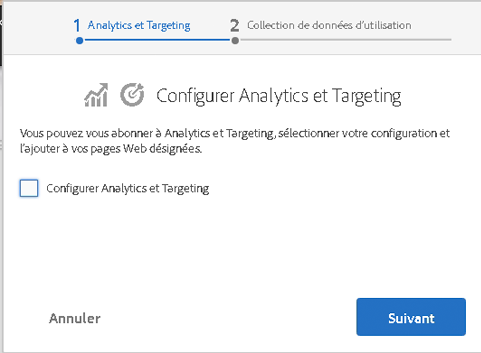

# Intégration à Adobe Marketing Cloud{#integrating-with-the-adobe-marketing-cloud}

[Adobe Marketing Cloud](https://www.adobe.com/solutions/digital-marketing.html) inclut des produits puissants d’analyse web et d’optimisation des sites web qui proposent des données et des statistiques exploitables en temps réel pour mener à bien vos initiatives en ligne. Il constitue une plateforme ouverte et intégrée pour l’optimisation des entreprises en ligne. Le cloud comprend des applications intégrées pour collecter et donner libre cours à la puissance des données client en vue d’optimiser les efforts d’acquisition, de conversion et de rétention des clients, ainsi que la création et la diffusion du contenu.

Avec Adobe Experience Manager (AEM), vous pouvez intégrer aisément les produits Adobe Marketing Cloud suivants :

* Adobe Analytics fournit aux marketeurs des données d’analyse web en temps réel et exploitables au sujet des stratégies en ligne et des initiatives marketing.
* Adobe Target donne aux marketeurs la possibilité d’adapter continuellement leur contenu en ligne à leurs clients de manière à accroître le taux de conversion.
* Adobe Scene7 automatise la gestion des médias, simplifie la publication web et améliore les expériences web, le tout dans un environnement hébergé.
* Adobe Dynamic Tag Management offre aux marketeurs des outils intuitifs grâce auxquels ils peuvent gérer facilement et rapidement un nombre illimité de balises Adobe et de tierces parties.
* Adobe Search&amp;Promote permet aux marketeurs de contrôler et d’optimiser les résultats de la recherche sur leurs sites.
* Adobe Campaign vous permet de gérer le contenu de livraison de courrier électronique directement dans Adobe Experience Manager.

In addition, you can [integrate AEM with Creative Cloud](/help/assets/aem-cc-folder-sharing-best-practices.md) and with [third-party services](/help/sites-administering/third-party-services.md).

## Intégration à Adobe Analytics {#integrating-with-adobe-analytics}

[Adobe Analytics](https://www.omniture.com/en/products/analytics/sitecatalyst) est la solution de pointe qui fournit aux spécialistes du marketing numérique un emplacement unique pour mesurer, analyser et optimiser les données intégrées de toutes les initiatives en ligne sur plusieurs canaux marketing. Il fournit aux marketeurs des données d’analyse web en temps réel et exploitables au sujet des stratégies numériques et des initiatives marketing. Avec Adobe Analytics, les marketeurs peuvent rapidement identifier les chemins d’accès les plus rentables sur un site web, segmenter le trafic afin de repérer les visiteurs web ayant le plus de valeur, déterminer où se rendent les visiteurs quand ils quittent leur site et identifier les mesures clés de réussite pour les campagnes de marketing en ligne. Adobe Analytics fait partie de la suite d’applications d’optimisation des activités en ligne Adobe Marketing Cloud.

Vous pouvez utiliser Adobe Analytics pour analyser les données de vos sites.

L’intégration à Adobe Analytics vous permet d’effectuer les opérations suivantes :

* Activez le suivi des utilisateurs Analytics.
* Mettre en correspondance les modes d’exécution (par exemple, création et publication) avec différentes suites de rapports
* Envoyer les variables de contexte client en tant que variables de conversion ou propriétés de trafic
* Utiliser les mises en correspondance de variables prédéfinis
* Configurer simultanément des sections complètes de site
* Suivre les événements personnalisés

Pour plus d’informations sur l’intégration d’AEM à Adobe Analytics, voir [Intégration Adobe Analytics](/help/sites-administering/adobeanalytics.md).

Vous pouvez également utiliser l’[assistant de souscription](/help/sites-administering/opt-in.md) pour exécuter facilement l’intégration.

## Intégration à Adobe Target {#integrating-with-adobe-target}

[Adobe Target est utilisé par les spécialistes marketing pour concevoir et exécuter des tests en ligne, créer des segments ciblés à la volée (en fonction du comportement) et automatiser le ciblage du contenu et les expériences en ligne.](https://www.omniture.com/en/products/conversion/test-and-target)

Les besoins des cyberconsommateurs sont aujourd’hui en constante évolution et ils attendent des très nombreux sites et sources de contenus qu’ils leur offrent des contenus pertinents, voire personnalisés. Pour séduire ce public, il est essentiel que les marketeurs identifient rapidement les offres et les contenus pertinents et attrayants pour leurs publics. Forts de ce savoir, les marketeurs ont besoin de pouvoir faire évoluer en permanence leurs sites et de cibler le contenu adapté aux différents publics.

[Intégration à Adobe Target](/help/sites-administering/target.md) explique comment intégrer votre site à Target.

Vous pouvez également utiliser l’[assistant de souscription](/help/sites-administering/opt-in.md) pour exécuter facilement l’intégration.

## Souscription à Analytics et Target {#opting-in-to-analytics-and-target}

AEM propose une procédure de souscription simple pour s’intégrer avec Adobe Analytics et Target. Lorsque vous vous connectez en tant qu’administrateur et accédez à la console Projets, un assistant de souscription apparaît.

Souscrivez à l’intégration avec Analytics et/ou Target afin de permettre l’utilisation de leurs fonctionnalités de suivi et d’analyse des pages, ainsi que des fonctionnalités de personnalisation. Lorsque vous souscrivez, vous devez fournir vos informations de compte utilisateur et spécifier les pages suivies.

Pour plus d’informations, voir [Souscription à Adobe Analytics et Target.](/help/sites-administering/opt-in.md)

## Intégration à Scene7 {#integrating-with-scene}

[Adobe Scene7](https://www.adobe.com/products/scene7.html) est une solution hébergée permettant la publication, la gestion, l’enrichissement et la livraison de ressources marketing dynamiques et le merchandising visuel enrichi sur une multiplicité de canaux : web, terminaux mobiles, courrier électronique, réseaux sociaux, écrans connectés à Internet et impression.

Dans AEM, vous pouvez publier des ressources numériques directement d’AEM vers Scene7, ainsi que de Scene7 vers AEM.

En outre, vous pouvez consulter les ressources AEM publiées dans Scene7 dans différentes visionneuses :

* Zoom de base
* Zoom sur la fenêtre déroulante DHTML
* Zoom sur la fenêtre déroulante Flash
* Vidéo
* Modèle  Template (Modèle)
* Modèle d’image

For more information on how AEM integrates with Scene7, see the [Integrating with Scene7 documentation](/help/sites-administering/scene7.md).

## Intégration à Adobe Dynamic Tag Management {#integrating-with-adobe-dynamic-tag-management}

[Adobe Dynamic Tag Management offre aux marketeurs des outils intuitifs grâce auxquels ils peuvent gérer facilement et rapidement un nombre illimité de balises Adobe et de tierces parties. ](https://www.adobe.com/solutions/digital-marketing/dynamic-tag-management.html) Vous pouvez optimiser pratiquement n’importe quel élément en ligne, avec une plus grande maîtrise et plus de souplesse, tout en dépendant moins des ressources informatiques.

[Intégrez la gestion dynamique des balises Adobe](/help/sites-administering/dtm.md) à AEM afin de pouvoir utiliser vos propriétés web de gestion dynamique des balises pour effectuer le suivi des sites AEM.

## Intégration à Adobe Audience Manager {#integrating-with-adobe-audience-manager}

L’intégration à Adobe Audience Manager a été supprimée dans AEM 6.3.

## Intégration à Search&amp;Promote {#integrating-with-search-promote}

Avec [Adobe Search&amp;Promote](https://www.omniture.com/en/products/conversion/search-and-promote), les marketeurs peuvent optimiser la manière dont les utilisateurs parcourent, recherchent, comparent et sélectionnent des produits et du contenu sur les sites web et mobiles. Les entreprises peuvent facilement faire la promotion des éléments importants en fonction des objectifs de l’entreprise et de l’intention des visiteurs, tout en automatisant les activités de marchandisation et de promotion par l’intermédiaire de déclencheurs et de mesures reposant sur les indicateurs de performances clés.

Adobe Search&amp;Promote est une application hébergée, évolutive et fiable de recherche de sites, extensible jusqu’à plusieurs millions de pages ou de produits, pour les entreprises en ligne au trafic de visite important allant de la vente au détail aux sites d’informations. Cet outil offre une maîtrise inégalée aux marketeurs et une pertinence corroborée par des mesures.

Pour plus d’informations sur l’intégration d’AEM et de Search&amp;Promote, voir [Intégration à Adobe Search&amp;Promote](/help/sites-administering/search-and-promote.md).

## Intégration à Adobe Campaign {#integrating-with-adobe-campaign}

[Adobe Campaign](https://www.adobe.com/solutions/campaign-management.html) vous permet de gérer le contenu de livraison de courrier électronique directement dans Adobe Experience Manager.

For information on how AEM integrates with Adobe Campaign, see [Integrating with Adobe Campaign](/help/sites-administering/campaignstandard.md).

## Intégration à Livefyre {#integrating-with-livefyre}

Pour en savoir plus sur AEM et Livefyre :

* [Prise en main de Livefyre](https://answers.livefyre.com/developers/getting-started)

* [Livefyre et AEM](https://answers.livefyre.com/product/livefyre-for-adobe-experience-manager-aem/livefyre-for-adobe-experience-manager/)

