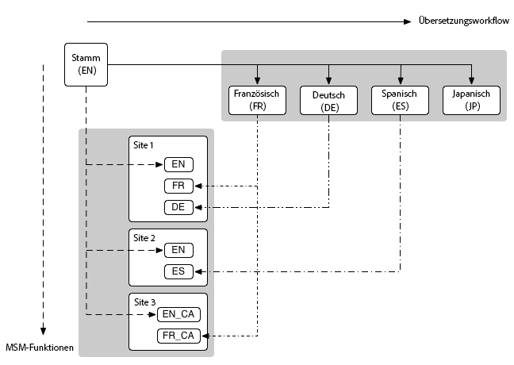

# Administration de sites web{#website-administration}

Les outils d’administration suivants sont disponibles pour gérer les sites et les pages web :

* Multi Site Manager (MSM) vous permet d’utiliser le même contenu de site en plusieurs emplacements, tout en permettant des variations :

   * [Réutilisation de contenu : Multi Site Manager et Live Copy](/help/sites-administering/msm.md)

* La traduction vous permet d’automatiser la traduction du contenu des pages, des ressources et du contenu créé par l’utilisateur pour créer et tenir à jour des sites web multilingues :

   * [Traduction de contenu pour les sites multilingues](/help/sites-administering/translation.md)

* Ces deux fonctions peuvent être combinées pour gérer les sites web qui sont à la fois [internationaux et multilingues](#multinational-and-multilingual-sites).

## Sites internationaux et multilingues {#multinational-and-multilingual-sites}

Vous pouvez créer efficacement du contenu pour les sites internationaux et multilingues par l’utilisation conjointe de Multi Site Manager et du workflow de traduction. Créez un gabarit de site dans une langue, pour un pays spécifique, puis utilisez ce contenu comme base des autres sites, à l’aide de la traduction si nécessaire :

* [Traduisez](/help/sites-administering/translation.md) le site de gabarit dans différentes langues.

* Utilisez [Multi Site Manager](/help/sites-administering/msm.md) pour effectuer les tâches suivantes :

   * Réutilisez le contenu du site de gabarit et les traductions afin de créer des sites pour d’autres pays et cultures.
   * Limitez l’utilisation de Multi Site Manager à du contenu dans une seule langue ; par exemple, Anglais maître -> branches de langue anglaise dans les sites pays, Français maître -> branches de langue française dans les sites pays.
   * Si nécessaire, désolidarisez les éléments des Live Copies pour ajouter les détails de localisation.

Le diagramme suivant illustre la manière dont les principaux concepts sont en corrélation (mais n’affiche pas tous les niveaux/éléments impliqués) :

>[!NOTE]
>
>Dans ces scénarios et dans d’autres scénarios comparables, MSM ne gère pas les différentes versions de langues en tant que telles.
>
>* [MSM](/help/sites-administering/msm.md) gère le déploiement du contenu traduit d’un plan directeur (par exemple, un gabarit mondial) des Live Copies (par exemple, les sites locaux), dans les limites d’une langue.
>* Les fonctionnalités d’intégration de [traduction](/help/sites-administering/translation.md) d’AEM, combinées aux services de gestion de traduction tiers, gèrent les langues et le contenu de traduction dans ces différentes langues.
>
>Pour les cas d’utilisation plus avancés, MSM peut également être utilisé dans les gabarits de langue.

>[!NOTE]
>
>Dans tous les cas, il est recommandé de lire les meilleures pratiques suivantes :
>
>* [Meilleures pratiques MSM](/help/sites-administering/msm-best-practices.md), en particulier :
>
>   * [Créer un site](/help/sites-administering/msm-best-practices.md#create-site)
>   * [MSM et sites web multilingues](/help/sites-administering/msm-best-practices.md#msm-and-multilingual-websites)
>
>* [Meilleures pratiques de traduction](/help/sites-administering/tc-bp.md)

