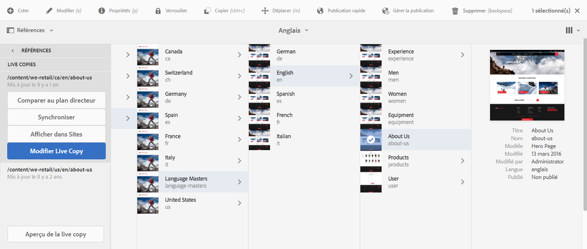
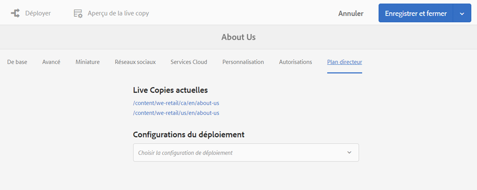
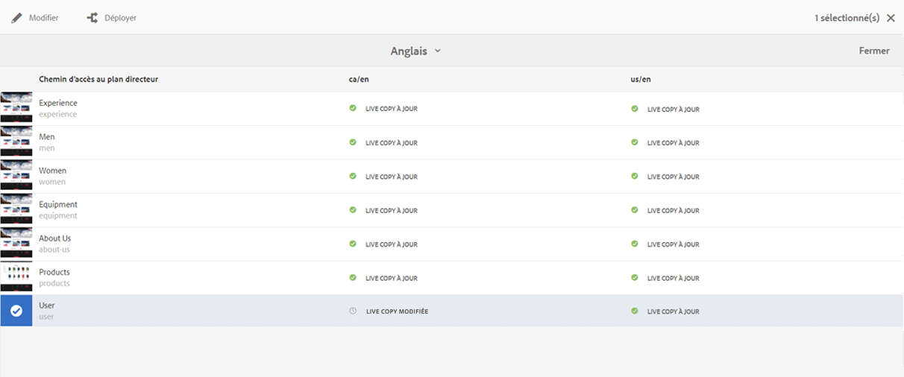
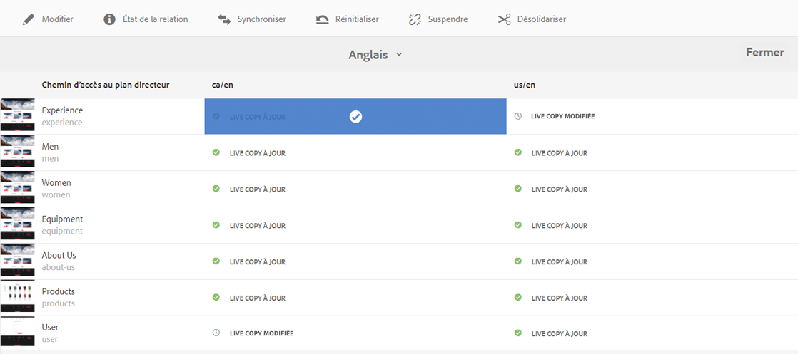
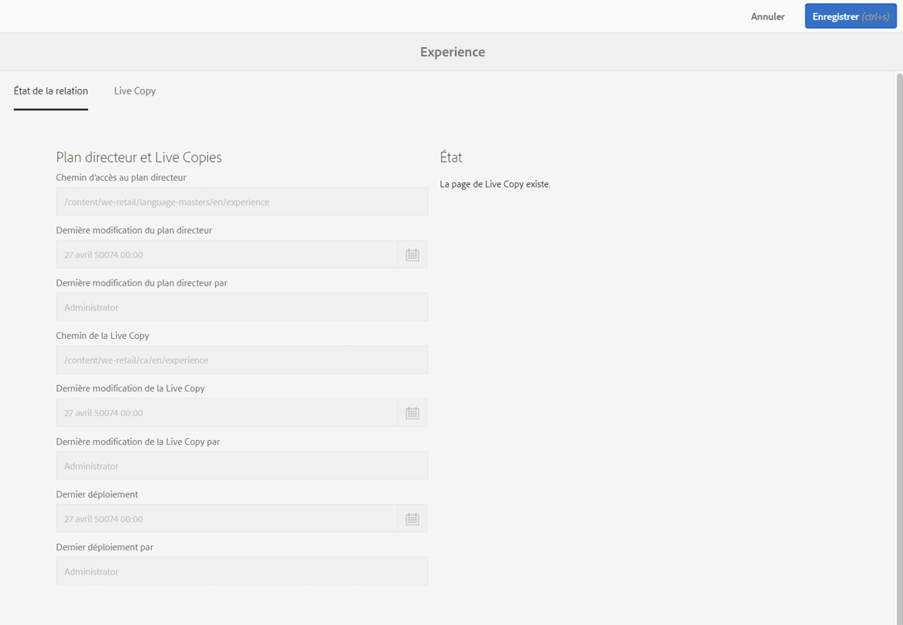
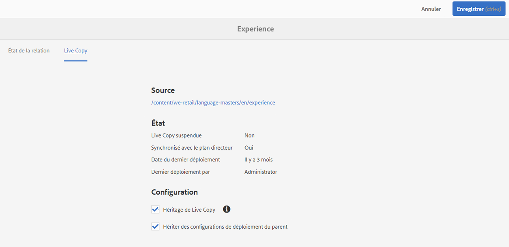

# Console Aperçu de la Live Copy{#live-copy-overview-console}

L’**aperçu de la Live Copy** vous permet :

* D’afficher/de gérer l’héritage sur un site :

   * Afficher l’arborescence de plan directeur de la structure Live Copy correspondante, ainsi que le statut d’héritage
   * Modifier le statut d’héritage ; par exemple, suspendre, reprendre
   * Afficher les propriétés de plan directeur et de Live Copy

* Exécuter des actions de déploiement

## Ouverture de l’aperçu de la Live Copy {#opening-the-live-copy-overview}

Vous pouvez ouvrir l’aperçu de la Live Copy via :

* [Panneau latéral de références d’une page de plan directeur (console Sites)](#opening-live-copy-overview-references-for-a-blueprint-page)
* [Propriétés d’une page de plan directeur](#opening-live-copy-overview-properties-of-a-blueprint-page)

### Ouverture de l’aperçu de la Live Copy - Références pour une page de plan directeur  {#opening-live-copy-overview-references-for-a-blueprint-page}

Vous pouvez ouvrir **Live Copy Overview** à partir du panneau latéral **References** de la console **Sites** :

1. Dans la console **Sites**, [accédez à la page de plan directeur et sélectionnez-la](/help/sites-authoring/basic-handling.md#viewing-and-selecting-resources).
1. Ouvrez le panneau **[Références](/help/sites-authoring/basic-handling.md#references)** et sélectionnez **Live Copies**.

   

   >[!NOTE]
   >
   >Vous pouvez également ouvrir le panneau Références en premier, puis sélectionner le plan directeur.

1. Sélectionnez **Aperçu de la Live Copy** pour afficher et utiliser l’aperçu de toutes les Live Copies associées au plan directeur sélectionné.
1. Utilisez **Fermer** pour fermer l’aperçu et retourner à la console **Sites**.

### Ouverture de l’aperçu de la Live Copy - Propriétés d’une page de plan directeur  {#opening-live-copy-overview-properties-of-a-blueprint-page}

L’**aperçu de la Live Copy** peut être ouvert lorsque lors de l’affichage des propriétés d’une page de plan directeur :

1. Ouvrir **Propriétés** pour la page de plan directeur appropriée.
1. Ouvrez l’onglet **Plan directeur** ; l’option **Aperçu de la Live Copy** apparaît dans la barre d’outils supérieure :

   

1. Sélectionnez **Aperçu de la Live Copy** pour afficher et utiliser l’aperçu de toutes les Live Copies associées au plan directeur actuel.

   >[!NOTE]
   >
   >Pour plus de détails, voir également l’article [Livecopy status message - Up-to-date/Green/In Sync](https://helpx.adobe.com/experience-manager/kb/livecopy-status-message---up-to-date-green-in-sync.html) (Message d’état de la Live Copy - À jour/Vert/Synchronisé) de la base de connaissances.

1. Utilisez **Fermer** pour fermer l’aperçu et retourner à la console **Sites**.

## Utilisation de l’aperçu de la Live Copy  {#using-the-live-copy-overview}

L’**aperçu de la Live Copy** peut également être utilisé pour effectuer des actions sur la Live Copy :

1. Ouvrez l’**aperçu de la Live Copy**.
1. Sélectionnez la page de plan directeur ou de Live Copy requise. La barre d’outils est mise à jour pour afficher les actions disponibles. Les [actions](/help/sites-administering/msm.md#terms-used) disponibles varient selon que vous sélectionnez une page de [plan directeur](#actions-for-a-blueprint-page) ou de [Live Copy](#actions-for-a-live-copy-page) :

### Actions d’une page de plan directeur  {#actions-for-a-blueprint-page}

Lorsque vous sélectionnez une page de plan directeur, les actions suivantes sont disponibles :

* Modifier

   * Ouvrez le plan directeur pour le modifier.

* [Déployer](/help/sites-administering/msm.md#rollout-and-synchronize)

   * Effectuez un déploiement pour pousser les modifications de la source vers la Live Copy.

### Actions d’une page de Live Copy  {#actions-for-a-live-copy-page}

Lorsque vous sélectionnez une page de Live Copy, les actions suivantes sont disponibles :

* Modifier

   * Ouvrez la page de la Live Copy pour la modifier.

* [État de la relation](#relationship-status)

   * Affichez des informations sur le statut et l’héritage.

* [Synchroniser](/help/sites-administering/msm.md#rollout-and-synchronize)

   * Synchronisez une Live Copy pour extraire des modifications de la source vers la Live Copy.

* [Réinitialiser](/help/sites-administering/msm-livecopy.md#resetting-a-live-copy-page)

   * Réinitialisez une page de Live Copy pour supprimer toutes les annulations d’héritage et restaurer la page sur le même état que la page source.

* [Suspendre](/help/sites-administering/msm.md#suspending-and-cancelling-inheritance-and-synchronization)

   * Désactivez temporairement les relations en direct entre une Live Copy et sa page de plan directeur.

* [Reprendre](/help/sites-administering/msm-livecopy.md#resuming-inheritance-for-a-page)

   * La reprise vous permet de rétablir une relation suspendue.

* [Désolidariser](/help/sites-administering/msm.md#detaching-a-live-copy)

   * Supprimez temporairement la relation en direct entre une Live Copy et sa page de plan directeur.

## État de la relation  {#relationship-status}

La console **État de la relation** comporte deux onglets fournissant une plage de fonctionnalités :

* [Informations sur l’état de la relation](#relationship-status-information)
* [Informations sur la Live Copy](#live-copy-information)

### Informations sur l’état de la relation  {#relationship-status-information}

Cet onglet fournit des informations détaillées sur le statut de la relation entre le plan directeur et la Live Copy :

### Informations sur la Live Copy {#live-copy-information}

Cet onglet vous permet d’afficher et de modifier la configuration de la Live Copy :

