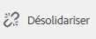

# Création et synchronisation de Live Copies{#creating-and-synchronizing-live-copies}

Vous pouvez créer une Live Copy depuis une configuration de page ou de plan directeur, puis gérer l’héritage et la synchronisation.

## Gestion des configurations de plans directeurs {#managing-blueprint-configurations}

Une configuration de plan directeur identifie un site web existant que vous souhaitez utiliser comme source pour une ou plusieurs pages Live Copy.

>[!NOTE]
>
>Les configurations de plan directeur permettent d’appliquer des modifications de contenu à des Live Copies. Voir [Live Copies – Source, plans directeurs et configurations de plan directeur](/help/sites-administering/msm.md#source-blueprints-and-blueprint-configurations).

Lorsque vous créez une configuration de plan directeur, vous sélectionnez un modèle qui définit la structure interne du plan directeur. Le modèle de plan directeur par défaut suppose que le site web source présente les caractéristiques suivantes :

* Le site web comporte une page racine.
* Les pages enfants immédiates de la racine sont des branches de langue du site web. Lors de la création d’une Live Copy, les langues sont présentées comme du contenu facultatif à inclure dans la copie.
* La racine de chaque branche de langue possède une ou plusieurs pages enfants. Lors de la création d’une Live Copy, les pages enfants sont présentées sous la forme de chapitres que vous pouvez inclure dans la Live Copy.

>[!NOTE]
>
>Une structure différente nécessite un autre modèle de plan directeur.

Après avoir créé la configuration de plan directeur, configurez les propriétés suivantes :

* **Nom** : le nom de la configuration de plan directeur.
* **Chemin source** : le chemin d’accès de la page racine du site que vous utilisez comme source (plan directeur).
* **Description**. (Facultatif) Description de la configuration de plan directeur. La description apparaît dans la liste des configurations de plan directeur parmi lesquelles choisir lors de la création d’un site.

Lorsque votre configuration de plan directeur est utilisée, vous pouvez l’associer à une configuration de déploiement qui détermine comment les Live Copies de la source/du plan directeur sont synchronisées. Consultez la section [Spécification des configurations de déploiement à utiliser](/help/sites-administering/msm-sync.md#specifying-the-rollout-configurations-to-use).

### Création d’une configuration de plan directeur {#creating-a-blueprint-configuration}

Pour créer une configuration de plan directeur :

1. [Accédez](/help/sites-authoring/basic-handling.md#global-navigation) au menu **Outils**, puis sélectionnez le menu **Sites**.
1. Sélectionnez **Plans directeurs** pour ouvrir la console **Configurations de plans directeurs** :

   

1. Sélectionnez **Créer**.
1. Sélectionnez le modèle de plan directeur, puis **Suivant** pour continuer.
1. Sélectionnez la page source à utiliser comme plan directeur, puis cliquez sur **Suivant** pour continuer.
1. Définissez ce qui suit :

   * **Titre** : titre du plan directeur obligatoire
   * **Description** : description facultative pour fournir plus de détails.

1. L’option **Créer** permet de créer la configuration de plan directeur en fonction de votre spécification.

### Modification ou suppression d’une configuration de plan directeur  {#editing-or-deleting-a-blueprint-configuration}

Vous pouvez modifier ou supprimer une configuration de plan directeur existante :

1. [Accédez](/help/sites-authoring/basic-handling.md#global-navigation) au menu **Outils**, puis sélectionnez le menu **Sites**.
1. Sélectionnez **Plans directeurs** pour ouvrir la console **Configurations de plans directeurs** :

   

1. Sélectionnez la configuration de plan directeur requise ; les actions appropriées seront disponibles dans la barre d’outils :

   * **Propriétés** : permet d’afficher et de modifier les propriétés de la configuration.
   * **Supprimer**

## Création d’une Live Copy {#creating-a-live-copy}

### Création d’une Live Copy d’une page {#creating-a-live-copy-of-a-page}

Vous pouvez créer une Live Copy de n’importe quelle page ou branche. Lorsque vous créez la Live Copy, vous pouvez spécifier les configurations de déploiement à utiliser pour synchroniser le contenu :

* Les configurations de déploiement sélectionnées s’appliquent à la page Live Copy et à ses pages enfants.
* Si vous ne spécifiez aucune configuration de déploiement, MSM détermine les configurations de déploiement à utiliser. Voir [Spécification de la configuration de déploiement à utiliser](/help/sites-administering/msm-sync.md#specifying-the-rollout-configurations-to-use).

Vous pouvez créer une Live Copy d’une page :

* Des pages qui sont référencées à l’aide d’une [configuration de plan directeur](#creating-a-blueprint-configuration)
* Des pages n’ayant aucune connexion avec une configuration
* AEM prend également en charge la création d’une Live Copy dans les pages d’une autre Live Copy.

La seule différence est que la disponibilité de la commande **Déployer** sur les pages source (de plan directeur) dépend du référencement ou non de la source par une configuration de plan directeur :

* Si vous créez une Live Copy à partir d’une page source qui **is** référencée dans une configuration de plan directeur, la commande Déployer sera disponible sur la ou les pages source/de plan directeur.
* Si vous créez une Live Copy à partir d’une page source qui **n’est pas** référencée dans une configuration de plan directeur, la commande Déployer ne sera pas disponible sur la ou les pages source/de plan directeur.

Pour créer une Live Copy :

1. Dans la console **Sites**, sélectionnez **Créer**, puis **Live Copy**.

   

1. Sélectionnez la page source et appuyez ou cliquez sur **Suivant**. Par exemple :

   

1. Spécifiez le chemin de destination de la Live Copy (ouvrez le dossier ou la page parent de la Live Copy), puis appuyez ou cliquez sur **Suivant**.

   

   >[!NOTE]
   >
   >Le chemin de destination ne peut pas se trouver dans le chemin source.

1. Enter :

   * un **titre** pour la page ;
   * un **nom**, utilisé dans l’URL.

   

1. Utilisez la case **Exclure les sous-pages** :

   * Sélectionné : créer une Live Copy de la page sélectionnée uniquement (Live Copy superficielle)
   * Non cochée : crée une Live Copy qui comprend tous les descendants de la page sélectionnée (Live Copy profonde).

1. (Facultatif) Pour spécifier une ou plusieurs configurations de déploiement à utiliser pour la Live Copy, utilisez la variable **Configurations du déploiement** liste déroulante pour les sélectionner ; les configurations sélectionnées s’affichent sous le sélecteur de liste déroulante.
1. Cliquez ou appuyez sur **Créer**. Un message de confirmation s’affiche où vous pouvez sélectionner **Ouvrir** ou **Terminé**.

### Création d’une Live Copy d’un site à partir d’une configuration de plan directeur {#creating-a-live-copy-of-a-site-from-a-blueprint-configuration}

Créez une Live Copy à l’aide d’une configuration de plan directeur pour créer un site en fonction du contenu de plan directeur (source). Lorsque vous créez une Live Copy à partir d’une configuration de plan directeur, vous sélectionnez une ou plusieurs branches de langue de la source de plan directeur à copier, puis vous sélectionnez les chapitres à copier à partir des branches de langue. Consultez la section [Création d’une configuration de plan directeur](/help/sites-administering/msm-livecopy.md#creating-a-blueprint-configuration).

Si vous omettez certaines branches de langue ou certains chapitres de la Live Copy, vous pouvez les ajouter ultérieurement. Consultez la section [Création d’une Live Copy dans une Live Copy (configuration de plan directeur)](#creating-a-live-copy-inside-a-live-copy-blueprint-configuration).

>[!CAUTION]
>
>Lorsque la source du plan directeur contient des liens et des références qui ciblent un paragraphe dans une autre branche, les cibles ne sont pas mises à jour dans les pages Live Copy, mais restent pointées vers la destination d’origine.

Lorsque vous créez le site, saisissez des valeurs pour les propriétés suivantes :

* **Langues initiales** : les branches de langue de la source de plan directeur à inclure dans la Live Copy.
* **Chapitres initiaux**: les pages enfants des branches de langue de plan directeur à inclure dans la Live Copy.
* **Chemin de destination**: emplacement de la page racine du site Live Copy.
* **Titre**: titre de la page racine du site de Live Copy.
* **Nom** : (facultatif) nom du nœud JCR qui stocke la page racine de la Live Copy. La valeur par défaut est basée sur le titre.
* **Propriétaire du site**: (facultatif)
* **Live Copy** : sélectionnez cette option pour établir une relation en direct avec le site source. Si vous ne sélectionnez pas cette option, une copie du plan directeur est créée, mais n’est pas synchronisée ultérieurement avec la source.
* **Configurations du déploiement** : (Facultatif) sélectionnez une ou plusieurs configurations de déploiement à utiliser pour synchroniser la Live Copy. Par défaut, les configurations de déploiement sont héritées du plan directeur. Pour plus d’informations, consultez [Spécification de la configuration de déploiement à utiliser](/help/sites-administering/msm-sync.md#specifying-the-rollout-configurations-to-use).

Pour créer une Live Copy d’un site à partir d’une configuration de plan directeur :

1. Dans la console **Sites**, sélectionnez **Créer**, puis **Site** dans le sélecteur déroulant.
1. Sélectionnez la configuration de plan directeur à utiliser comme source de la Live Copy et poursuivez avec **Suivant**:

   

1. Utilisez la variable **Langues initiales** sélecteur permettant de spécifier les langues du site de plan directeur à utiliser pour la Live Copy.

   Toutes les langues disponibles sont sélectionnées par défaut. Pour supprimer une langue, cliquez ou appuyez sur le bouton **X** qui s’affiche en regard de la langue.

   Par exemple :

   

1. Utilisez la liste déroulante **Chapitres initiaux** pour sélectionner les sections du plan directeur à inclure dans la Live Copy. Là encore, tous les chapitres disponibles sont inclus par défaut, mais peuvent être supprimés.
1. Saisissez les valeurs des propriétés restantes, puis sélectionnez **Créer**. Dans la boîte de dialogue de confirmation, sélectionnez **Terminé** pour revenir à la console **Sites**, ou **Ouvrir le site** pour ouvrir la page racine du site.

### Création d’une Live Copy dans une Live Copy (configuration de plan directeur) {#creating-a-live-copy-inside-a-live-copy-blueprint-configuration}

Lorsque vous créez une Live Copy dans la Live Copy existante (créée à l’aide d’une configuration de plan directeur), vous pouvez insérer une copie de langue ou des chapitres qui n’ont pas été inclus lors de la création initiale de la Live Copy.

## Surveillance de votre Live Copy {#monitoring-your-live-copy}

### Affichage du statut d’une Live Copy {#seeing-the-status-of-a-live-copy}

Les propriétés d’une page Live Copy affichent les informations suivantes sur la Live Copy :

* **Source**: page source de la page Live Copy.
* **État** : l’état de synchronisation de la Live Copy. L’état indique si la Live Copy est à jour par rapport à la source, et quand la dernière synchronisation a eu lieu et qui a effectué la synchronisation.
* **Configuration** :

   * Indique si la page est toujours soumise à l’héritage de la Live Copy.
   * Si la configuration est héritée de la page parent.
   * Toutes les configurations de déploiement utilisées par la Live Copy.

Pour afficher les propriétés :

1. Dans la console **Sites**, sélectionnez la page Live Copy et ouvrez les propriétés.
1. Sélectionnez l’onglet **Live Copy**.

   Par exemple :

   

   >[!NOTE]
   >
   >Pour plus de détails, consultez également l’article [Livecopy status message - Up-to-date/Green/In Sync](https://helpx.adobe.com/fr/experience-manager/kb/livecopy-status-message---up-to-date-green-in-sync.html) (Message de statut de la Live Copy - À jour/Vert/Synchronisé) de la base de connaissances.

### Affichage des Live Copies d’une page de plan directeur {#seeing-the-live-copies-of-a-blueprint-page}

Les pages de plan directeur (référencées dans la configuration de plan directeur) fournissent une liste des pages Live Copy qui utilisent la page (plan directeur) actuelle comme source. Utilisez cette liste pour conserver la trace des Live Copies. La liste s’affiche dans l’onglet **Plan directeur** des [propriétés de page](/help/sites-authoring/editing-page-properties.md).

## Synchronisation de votre Live Copy {#synchronizing-your-live-copy}

### Déploiement d’un plan directeur {#rolling-out-a-blueprint}

Déployez une page de plan directeur pour pousser les modifications de contenu vers les Live Copies. L’action **Déployer** exécute les configurations de déploiement qui utilisent le déclencheur [En cas de déploiement](/help/sites-administering/msm-sync.md#rollout-triggers).

>[!NOTE]
>
>Des conflits peuvent apparaître si de nouvelles pages portant le même nom de page sont créées dans la branche de plan directeur et dans une branche de Live Copy dépendante.
>
>Ces [conflits doivent être traités et résolus lors du déploiement](/help/sites-administering/msm-rollout-conflicts.md).
>

#### Déploiement d’un plan directeur à partir des propriétés de page {#rolling-out-a-blueprint-from-page-properties}

1. Dans la console **Sites**, sélectionnez la page dans le plan directeur et ouvrez les propriétés.
1. Ouvrez l’onglet **Plan directeur**.
1. Sélectionnez **Déploiement**.

   

1. Spécifiez les pages et les sous-pages puis confirmez en cochant :

   

1. Indiquez si la tâche de déploiement doit être exécutée immédiatement (**Maintenant**) ou à un autre moment (**Ultérieurement**).

   

Les déploiements sont traités en tant que tâches asynchrones et peuvent être vérifiés dans le [**tableau de bord Statut des tâches asynchrones**](asynchronous-jobs.md#monitor-the-status-of-asynchronous-operations) en accédant à **Navigation globale** -> **Outils** -> **Opérations** -> **Tâches**.

>[!NOTE]
>
>Le traitement du déploiement asynchrone nécessite AEM version 6.5.3.0 ou ultérieure. Dans les versions précédentes, les pages étaient traitées immédiatement et de manière synchrone.

#### Déploiement d’un plan directeur à partir du rail de référence {#roll-out-a-blueprint-from-the-reference-rail}

1. Dans la console **Sites**, sélectionnez la page dans la Live Copy et ouvrez le panneau **[Références](/help/sites-authoring/basic-handling.md#references)** (via la barre d’outils).
1. Sélectionnez l’option **Plans directeurs** dans la liste pour afficher les plans directeurs associés à cette page.
1. Sélectionnez le plan directeur requis dans la liste.
1. Cliquez ou appuyez sur **Déploiement**.
1. Vous êtes invité à confirmer les détails du déploiement :

   * **Étendue du déploiement** :

     indique si l’étendue correspond à la page sélectionnée seule ou doit inclure les sous-pages.

   * **Planification** :

     indique si la tâche de déploiement doit être exécutée immédiatement (**Maintenant**) ou à un autre moment (**Ultérieurement**).

     

1. Après avoir défini ces détails, sélectionnez **Déployer** pour exécuter l’opération.

Les déploiements sont traités en tant que tâches asynchrones et peuvent être vérifiés dans le [**tableau de bord Statut des tâches asynchrones**](asynchronous-jobs.md#monitor-the-status-of-asynchronous-operations) en accédant à **Navigation globale** -> **Outils** -> **Opérations** -> **Tâches**.

>[!NOTE]
>
>Le traitement du déploiement asynchrone nécessite AEM version 6.5.3.0 ou ultérieure. Dans les versions précédentes, les pages étaient traitées immédiatement et de manière synchrone, sauf si l’option **Déploiement en arrière-plan** était cochée.

#### Déploiement d’un plan directeur de l’aperçu de la Live Copy {#roll-out-a-blueprint-from-the-live-copy-overview}

L’action [Déployer est également disponible dans l’aperçu de la Live Copy](/help/sites-administering/msm-livecopy-overview.md#using-the-live-copy-overview) lorsqu’une page Plan directeur est sélectionnée.

1. Ouvrez la [vue d’ensemble de la Live Copy](/help/sites-administering/msm-livecopy-overview.md#using-the-live-copy-overview) et sélectionnez une page de plan directeur.
1. Sélectionnez **Déploiement** dans la barre d’outils.
1. Spécifiez les pages et les sous-pages puis confirmez en cochant :

   

1. Indiquez si la tâche de déploiement doit être exécutée immédiatement (**Maintenant**) ou à un autre moment (**Ultérieurement**).

   

Les déploiements sont traités en tant que tâches asynchrones et peuvent être vérifiés dans le [**tableau de bord Statut des tâches asynchrones**](asynchronous-jobs.md#monitor-the-status-of-asynchronous-operations) en accédant à **Navigation globale** -> **Outils** -> **Opérations** -> **Tâches**.

>[!NOTE]
>
>Le traitement du déploiement asynchrone nécessite AEM version 6.5.3.0 ou ultérieure. Dans les versions précédentes, les pages étaient traitées immédiatement et de manière synchrone.

### Synchronisation d’une Live Copy {#synchronizing-a-live-copy}

Synchronisez une page Live Copy pour extraire les modifications de contenu de la source vers la Live Copy.

#### Synchronisation d’une Live Copy à partir des propriétés de page {#synchronize-a-live-copy-from-page-properties}

Synchronisez une Live Copy pour extraire des modifications de la source vers la Live Copy.

>[!NOTE]
>
>La synchronisation effectue les configurations de déploiement qui utilisent le déclencheur [En cas de déploiement](/help/sites-administering/msm-sync.md#rollout-triggers).

1. Dans la console **Sites**, sélectionnez la page Live Copy et ouvrez les propriétés.
1. Ouvrez l’onglet **Live Copy**.
1. Cliquez ou appuyez sur **Syncroniser**.

   

   Une confirmation est demandée ; utilisez **Synchroniser** pour continuer.

#### Synchroniser une Live Copy à partir de l’aperçu de la Live Copy {#synchronize-a-live-copy-from-the-live-copy-overview}

L’[action Syncroniser est également disponible dans la vue d’ensemble de la Live Copy](/help/sites-administering/msm-livecopy-overview.md#using-the-live-copy-overview), lorsqu’une page Live Copy est sélectionnée.

1. Ouvrez l’[aperçu de la Live Copy](/help/sites-administering/msm-livecopy-overview.md#using-the-live-copy-overview) et sélectionnez une page Live Copy.
1. Sélectionnez **Synchroniser** dans la barre d’outils.
1. Confirmez l’action **Déployer** dans la boîte de dialogue après avoir indiqué si vous souhaitez inclure :

   * **une page et des sous-pages** ;
   * **une page seulement**.

   

## Modification du contenu de Live Copy {#changing-live-copy-content}

Pour modifier le contenu d’une Live Copy, vous pouvez :

* ajouter des paragraphes à la page ;
* Mettez à jour le contenu existant en rompant l’héritage de la Live Copy pour n’importe quel composant ou page.

>[!NOTE]
>
>Si vous créez manuellement une page dans la Live Copy, elle est locale à la Live Copy, ce qui signifie qu’elle ne comporte pas de page source correspondante à laquelle la joindre.
>
>La meilleure pratique pour créer une page locale faisant partie de la relation consiste à créer cette page dans la source et à procéder à un déploiement (profond). Cela crée la page localement en tant que Live Copies.

>[!NOTE]
>
>Des conflits peuvent apparaître si de nouvelles pages portant le même nom de page sont créées dans la branche de plan directeur et dans une branche de Live Copy dépendante.
>
>Ces [conflits doivent être traités et résolus lors du déploiement](/help/sites-administering/msm-rollout-conflicts.md).
>

### Ajout de composants à une page Live Copy {#adding-components-to-a-live-copy-page}

Vous pouvez ajouter des composants à une page Live Copy à tout moment. Le statut d’héritage de la Live Copy et de son système de paragraphes ne conditionne pas votre capacité à ajouter des composants.

Lorsque la page Live Copy est synchronisée avec la page source, les composants ajoutés demeurent inchangés. Consultez également la section [Modification de l’ordre des composants sur une page Live Copy](#changing-the-order-of-components-on-a-live-copy-page).

>[!NOTE]
>
>Les modifications apportées localement à un composant marqué en tant que conteneur ne sont pas remplacées par le contenu du plan directeur lors d’un déploiement. Consultez [Bonnes pratiques liées à MSM](/help/sites-administering/msm-best-practices.md#components-and-container-synchronization) pour plus d’informations.

### Suspension de l’héritage pour une page {#suspending-inheritance-for-a-page}

Lorsque vous créez une Live Copy, sa configuration est enregistrée sur la page racine des pages copiées. Toutes les pages enfants de la page racine héritent des configurations de Live Copy. Les composants des pages Live Copy héritent également de la configuration de Live Copy.

Vous pouvez suspendre l’héritage de Live Copy d’une page Live Copy afin de pouvoir modifier les propriétés et les composants de la page. Lorsque vous suspendez l’héritage, les propriétés et les composants de la page ne sont plus synchronisés avec la source.

>[!NOTE]
>
>Vous pouvez également [désolidariser une Live Copy](#detaching-a-live-copy) de son plan directeur pour supprimer toutes les connexions. L’action Désolidariser est définitive et irréversible.

>[!NOTE]
>
>Si le composant est marqué comme conteneur, les actions d’annulation et de suspension ne s’appliquent pas à ses composants enfants. Consultez également la section [Bonnes pratiques liées à MSM](/help/sites-administering/msm-best-practices.md#components-and-container-synchronization) pour plus d’informations.

#### Suspension de l’héritage à partir des propriétés de page {#suspending-inheritance-from-page-properties}

Pour suspendre l’héritage sur une page, procédez comme suit :

1. Ouvrez les propriétés de la page Live Copy à l’aide de l’option **Afficher les propriétés** de la commande **Sites** console ou à l’aide de **Informations sur la page** dans la barre d’outils de la page.
1. Cliquez ou appuyez sur l’onglet **Live Copy**.
1. Sélectionnez **Suspendre** dans la barre d’outils. Vous pouvez ensuite sélectionner l’une des options suivantes :

   * **Suspendre** : page actuelle uniquement
   * **Suspendre avec enfants** : page en cours avec toutes les pages enfants

1. Sélectionnez **Suspendre** dans la boîte de dialogue de confirmation.

#### Suspension de l’héritage à partir de l’aperçu de la Live Copy {#suspending-inheritance-from-the-live-copy-overview}

L’[action Suspendre est également disponible dans la vue d’ensemble de la Live Copy](/help/sites-administering/msm-livecopy-overview.md#using-the-live-copy-overview), lorsqu’une page Live Copy est sélectionnée.

1. Ouvrez l’[aperçu de la Live Copy](/help/sites-administering/msm-livecopy-overview.md#using-the-live-copy-overview) et sélectionnez une page Live Copy.
1. Sélectionnez **Suspendre** dans la barre d’outils.
1. Sélectionnez l’option appropriée parmi :

   * **Suspendre**
   * **Suspendre avec enfants**

   

1. Confirmez l’action **Suspendre** dans la boîte de dialogue **Suspendre la Live Copy** :

   

### Reprise de l’héritage pour une page {#resuming-inheritance-for-a-page}

La suspension de l’héritage de Live Copy pour une page est une action temporaire. Une fois l’héritage suspendu, l’action **Reprendre** devient disponible, ce qui vous permet de rétablir la relation en direct.

Lorsque vous réactivez l’héritage, la page n’est pas automatiquement synchronisée avec la source. Vous pouvez demander une synchronisation si nécessaire :

* Dans la boîte de dialogue **Réactiver**/**Rétablir**, par exemple :

  

* Ultérieurement, en sélectionnant manuellement l’action de synchronisation.

>[!CAUTION]
>
>Lorsque vous réactivez l’héritage, la page n’est pas automatiquement synchronisée avec la source. Vous pouvez demander manuellement une synchronisation si cela est nécessaire, au moment de la reprise ou ultérieurement.

#### Reprise de l’héritage à partir des propriétés de page {#resuming-inheritance-from-page-properties}

Une fois l’héritage [suspendu](#suspending-inheritance-from-page-properties), l’action **Reprendre** devient disponible dans la barre d’outils des propriétés de page :

Lorsque cette option est sélectionnée, la boîte de dialogue s’affiche. Vous pouvez sélectionner une synchronisation, si nécessaire, puis confirmer l’action.

#### Reprise d’une page Live Copy à partir de l’aperçu de la Live Copy {#resume-a-live-copy-page-from-the-live-copy-overview}

L’[action Reprendre est également disponible dans l’aperçu de la Live Copy](/help/sites-administering/msm-livecopy-overview.md#using-the-live-copy-overview), lorsqu’une page Live Copy est sélectionnée.

1. Ouvrez le [Présentation de la Live Copy](/help/sites-administering/msm-livecopy-overview.md#using-the-live-copy-overview) et sélectionnez une page Live Copy qui a été suspendue ; elle s’affiche sous la forme **HÉRITAGE ANNULÉ**.
1. Sélectionnez **Reprendre** dans la barre d’outils.
1. Indiquez si vous souhaitez synchroniser la page après le rétablissement de l’héritage, puis confirmez l’action **Reprendre** dans la boîte de dialogue **Reprendre la Live Copy**.

### Changement de la profondeur d’héritage (superficielle/profonde) {#changing-inheritance-depth-shallow-deep}

Sur une Live Copy existante, vous pouvez changer la profondeur d’une page, à savoir indiquer si les pages enfants sont incluses.

* Passer à une Live Copy superficielle :

   * prend immédiatement effet et est irréversible.

      * Les pages enfants sont explicitement désolidarisées de la Live Copy. Les autres modifications des pages enfants ne peuvent pas être préservées si elles sont annulées.

      * Supprime tous les descendants `LiveRelationships` même s’il s’agit de `LiveCopies` imbriquées.

* Le passage à une Live Copy profonde :

   * laisse les pages enfants inchangées.
   * Pour visualiser l’effet de la transition, vous pouvez procéder à un déploiement ; toutes les modifications de contenu sont appliquées en fonction de la configuration de déploiement.

* Basculer vers une Live Copy superficielle, puis revenir à l’état profond :

   * traite tous les enfants de la Live Copy (anciennement) peu profonde comme s’ils avaient été créés manuellement et les déplace donc en utilisant `[oldname]_msm_moved name`.

Pour spécifier ou changer la profondeur :

1. Ouvrez les propriétés de la page Live Copy à l’aide de l’option **Afficher les propriétés** de la commande **Sites** console ou à l’aide de **Informations sur la page** dans la barre d’outils de la page.
1. Cliquez ou appuyez sur l’onglet **Live Copy**.
1. Dans la section **Configuration**, définissez ou effacez l’option **Héritage de Live Copy** selon l’inclusion ou non des pages enfants :

   * coché : une Live Copy profonde (les pages enfants sont incluses)
   * clear : une Live Copy superficielle (les pages enfants sont exclues)

   >[!CAUTION]
   >
   >Le passage à une Live Copy superficielle prendra effet immédiatement et est irréversible.
   >
   >Voir [Live Copies – Composition](/help/sites-administering/msm.md#live-copies-composition) pour plus d’informations.

1. Cliquez ou appuyez sur **Enregistrer** pour conserver vos mises à jour.

### Annulation de l’héritage pour un composant {#cancelling-inheritance-for-a-component}

Annulez l’héritage Live Copy d’un composant afin que ce composant ne soit plus synchronisé avec le composant source. Vous pouvez activer l’héritage ultérieurement, si nécessaire.

>[!NOTE]
>
>Si le composant est marqué comme conteneur, les actions d’annulation et de suspension ne s’appliquent pas à ses composants enfants. Consultez également la section [Bonnes pratiques liées à MSM](/help/sites-administering/msm-best-practices.md#components-and-container-synchronization) pour plus d’informations.

>[!NOTE]
>
>Lorsque vous réactivez l’héritage, le composant n’est pas automatiquement synchronisé avec la source. Vous pouvez demander manuellement une synchronisation si nécessaire.

Annulez l’héritage pour modifier le contenu du composant ou supprimer le composant :

1. Cliquez ou appuyez sur le composant pour lequel vous souhaitez annuler l’héritage.

   

1. Sur la barre d’outils du composant, appuyez ou cliquez sur l’icône **Annuler l’héritage**.

   

1. Dans la boîte de dialogue Annuler l’héritage, confirmez l’action par **Oui**.

   La barre d’outils du composant est mise à jour afin d’inclure toutes les commandes d’édition (appropriées).

### Réactivation de l’héritage pour un composant {#re-enabling-inheritance-for-a-component}

Pour activer l’héritage pour un composant, appuyez ou cliquez sur **Réactiver l’héritage** dans la barre d’outils du composant.

### Modification de l’ordre des composants sur une page Live Copy {#changing-the-order-of-components-on-a-live-copy-page}

Si une Live Copy contient des composants faisant partie d’un système de paragraphes, l’héritage de ce système de paragraphes observe les règles suivantes :

* L’ordre des composants dans un système de paragraphes hérité peut être modifié, même si l’héritage est établi.
* Sur le déploiement, l’ordre des composants est restauré à partir du plan directeur. Si de nouveaux composants ont été ajoutés à la Live Copy avant le déploiement, ils sont réorganisés avec les composants au-dessus desquels ils ont été ajoutés.
* Si l’héritage du système de paragraphes est annulé, l’ordre des composants n’est pas restauré lors du déploiement et reste inchangé dans la Live Copy.

>[!NOTE]
>
>Lors de la restauration d’un héritage annulé sur un système de paragraphes, l’ordre des composants **n’est pas automatiquement restauré** à partir du plan directeur. Vous pouvez demander manuellement une synchronisation si nécessaire.

Utilisez la procédure suivante pour annuler l’héritage du système de paragraphes.

1. Ouvrez la page Live Copy.
1. Faites glisser un composant existant vers un nouvel emplacement sur la page.
1. Dans la boîte de dialogue **Annuler l’héritage**, confirmez l’action par **Oui**.

### Remplacement des propriétés d’une page Live Copy {#overriding-properties-of-a-live-copy-page}

Les propriétés d’une page Live Copy sont héritées (et non modifiables) à partir de la page source par défaut.

Vous pouvez annuler l’héritage pour une propriété lorsque vous devez modifier la valeur de la propriété pour la Live Copy. Une icône de lien indique que l’héritage est activé pour la propriété.

Lorsque vous annulez l’héritage, vous pouvez modifier la valeur de la propriété. Une icône de lien rompu indique que l’héritage est annulé.

Vous pourrez par la suite réactiver l’héritage pour une propriété, si nécessaire.

>[!NOTE]
>
>Lorsque vous réactivez l’héritage, la propriété de la page Live Copy n’est pas automatiquement synchronisée avec la propriété source. Vous pouvez demander manuellement une synchronisation si nécessaire.

1. Ouvrez les propriétés de la page Live Copy à l’aide de l’option **Afficher les propriétés** de la console **Sites** ou de l’icône **Informations sur la page** de la barre d’outils de la page.
1. Pour annuler l’héritage d’une propriété, appuyez ou cliquez sur l’icône de lien qui s’affiche à droite de la propriété.

   

1. Dans la boîte de dialogue de confirmation **Annuler l’héritage**, cliquez ou appuyez sur **Oui**.

### Rétablissement des propriétés d’une page de la Live Copy {#revert-properties-of-a-live-copy-page}

Pour activer l’héritage d’une propriété, appuyez ou cliquez sur l’icône **Inverser l’héritage** qui apparaît en regard de la propriété.

### Réinitialisation d’une page Live Copy {#resetting-a-live-copy-page}

Réinitialisez une page Live Copy sur :

* supprimer toutes les annulations d’héritage ;
* restaurer la page au même statut que la page source.

La réinitialisation affecte les modifications que vous avez apportées aux propriétés de page, au système de paragraphes et aux composants.

#### Réinitialisation d’une page Live Copy à partir des propriétés de la page {#reset-a-live-copy-page-from-the-page-properties}

1. Dans le **Sites** , sélectionnez la page Live Copy, puis **Afficher les propriétés**.
1. Ouvrez l’onglet **Live Copy**.
1. Sélectionnez **Réinitialiser** dans la barre d’outils.

   

1. Dans la boîte de dialogue **Réinitialiser la Live Copy**, confirmez en cliquant sur **Réinitialiser**.

#### Réinitialisation d’une page Live Copy à partir de l’aperçu de la Live Copy {#reset-a-live-copy-page-from-the-live-copy-overview}

L’action [Réinitialiser est également disponible dans l’aperçu de la Live Copy](/help/sites-administering/msm-livecopy-overview.md#using-the-live-copy-overview), lorsqu’une page Live Copy est sélectionnée.

1. Ouvrez l’[aperçu de la Live Copy](/help/sites-administering/msm-livecopy-overview.md#using-the-live-copy-overview) et sélectionnez une page Live Copy.
1. Sélectionnez **Réinitialiser** dans la barre d’outils.
1. Confirmez l’action **Réinitialiser** dans la boîte de dialogue **Réinitialiser la Live Copy** :

   

## Comparaison d’une page Live Copy à une page de plan directeur {#comparing-a-live-copy-page-with-a-blueprint-page}

Pour suivre les modifications que vous avez apportées, vous pouvez afficher la page de plan directeur dans la section **Références** et la comparer à sa page Live Copy :

1. Dans le **Sites** console, [accéder à une page de plan directeur ou de Live Copy et la sélectionner ;](/help/sites-authoring/basic-handling.md#viewing-and-selecting-resources).
1. Ouvrez le **[Références](/help/sites-authoring/basic-handling.md#references)** et sélectionnez :

   * **Plan directeur** (si une page Live Copy est sélectionnée)
   * **Live Copies** (lorsqu’une page de plan directeur est sélectionnée)

1. Sélectionnez votre Live Copy spécifique, puis :

   * **Comparaison avec Blueprint** (lorsqu’une page Live Copy est sélectionnée)
   * **Comparer à la Live Copy** (lorsqu’une page de plan directeur est sélectionnée)

   Par exemple :

   

1. Les deux pages (Live Copy et plan directeur) seront ouvertes côte à côte.

   Pour des informations complètes sur l’utilisation de cette fonction, consultez la section [Comparaison entre les pages](/help/sites-authoring/page-diff.md).

## Désolidarisation d’une Live Copy {#detaching-a-live-copy}

Désolidariser une Live Copy supprime définitivement les relations en direct entre la Live Copy et sa page source/de plan directeur. Toutes les propriétés MSM sont supprimées de la Live Copy et les pages Live Copy deviennent une copie autonome.

>[!CAUTION]
>
>Vous ne pouvez pas rétablir la relation dynamique après avoir désolidarisé la Live Copy.
>
>Pour supprimer la relation dynamique avec la possibilité de la rétablir ultérieurement, vous pouvez [annuler l’héritage de la Live Copy ;](#suspending-inheritance-for-a-page) pour la page.

Il existe des implications liées à l’endroit dans l’arborescence où vous utilisez l’option **Désolidariser** :

* **Désolidariser sur la page racine d’une Live Copy**

  Lorsque cette opération est effectuée sur la page racine d’une Live Copy, elle supprime la relation dynamique entre toutes les pages du plan directeur et sa Live Copy.

  Autres modifications apportées aux pages du plan directeur (en l’état) **will not** impacte la Live Copy (en l’état).

* **Désolidariser sur une sous-page d’une Live Copy**

  Lorsque cette opération est effectuée sur une sous-page (ou branche) au sein d’une Live Copy :

   * la relation dynamique est supprimée pour cette sous-page (ou branche).
   * et les (sous-)pages de la branche Live Copy sont traitées comme si elles avaient été créées manuellement.

  *Cependant*, les sous-pages sont toujours soumises aux relations en direct de la branche parente, de sorte qu’un déploiement supplémentaire de la ou des pages de plan directeur effectue les deux opérations suivantes :

   1. de renommer les pages désolidarisées :

      * En effet, MSM les considère comme des pages créées manuellement qui provoquent un conflit, car elles portent le même nom que les pages Live Copy qu’il tente de créer.

   1. Créez une page (Live Copy) avec le nom d’origine, contenant les modifications du déploiement.

  >[!NOTE]
  >
  >Consultez la section [Conflits de déploiement MSM](/help/sites-administering/msm-rollout-conflicts.md) pour obtenir des détails sur ces situations.

### Désolidarisation d’une page Live Copy à partir des propriétés de la page {#detach-a-live-copy-page-from-the-page-properties}

Pour désolidariser une Live Copy :

1. Dans le **Sites** , sélectionnez la page Live Copy et cliquez ou appuyez sur **Afficher les propriétés**.
1. Ouvrez l’onglet **Live Copy**.
1. Dans la barre d’outils, sélectionnez **Désolidariser**.

   

1. Une boîte de dialogue de confirmation s’affiche. Sélectionnez **Désolidariser** pour terminer l’action.

### Dissocier une page Live Copy de l’aperçu de la Live Copy {#detach-a-live-copy-page-from-the-live-copy-overview}

L’[action Désolidariser est également disponible dans la vue d’ensemble de la Live Copy](/help/sites-administering/msm-livecopy-overview.md#using-the-live-copy-overview), lorsqu’une page Live Copy est sélectionnée.

1. Ouvrez l’[aperçu de la Live Copy](/help/sites-administering/msm-livecopy-overview.md#using-the-live-copy-overview) et sélectionnez une page Live Copy.
1. Sélectionnez **Désolidariser** dans la barre d’outils.
1. Confirmez l’action **Désolidariser** dans la boîte de dialogue **Désolidariser une Live Copy** :

   
