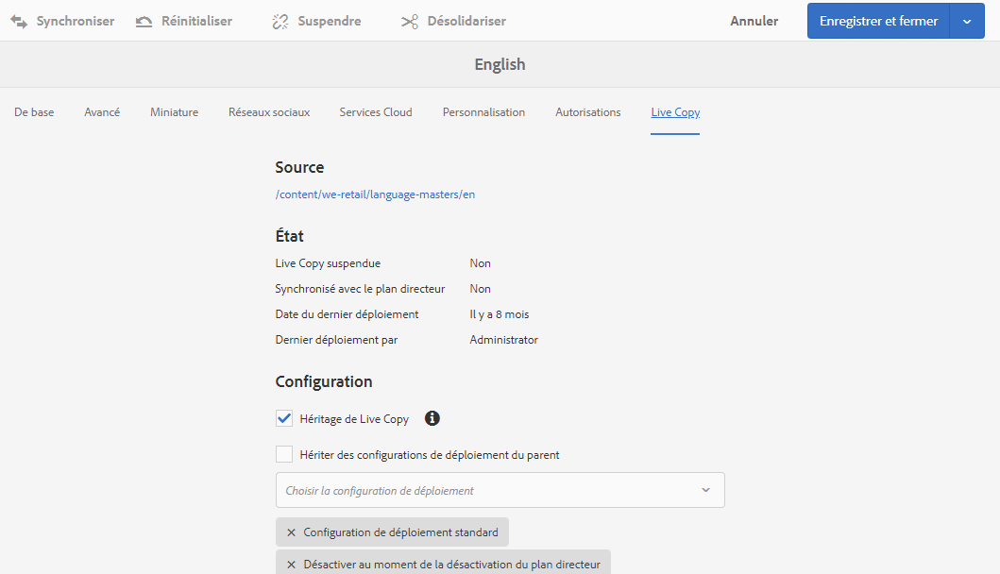

# Configuration de la synchronisation des Live Copies {#configuring-live-copy-synchronization}

Effectuez les tâches suivantes pour contrôler le mode et le moment de synchronisation des Live Copies avec leur contenu source.

* Déterminez si les configurations de déploiement existantes répondent à vos besoins ou si vous devez en créer une ou plusieurs.
* Spécifiez les configurations de déploiement à utiliser pour vos Live Copies.

## Configurations du déploiement installées et personnalisées {#installed-and-custom-rollout-configurations}

Cette section fournit des informations sur les configurations de déploiement installées et les actions de synchronisation qu’elles utilisent, ainsi que sur la manière de créer des configurations personnalisées si nécessaire.

>[!CAUTION]
>
>La mise à jour ou la modification d’une configuration de déploiement prête à l’emploi (installée) n’est **pas** recommandée. Si une action en direct et personnalisée est requise, elle doit être ajoutée dans une configuration de déploiement personnalisée.

### Déclencheurs de déploiement {#rollout-triggers}

Chaque configuration du déploiement utilise un déclencheur qui entraîne la survenue du déploiement. Les configurations de déploiement peuvent utiliser l’un des déclencheurs suivants :

* **En cas de déploiement** : la commande **Déploiement** est utilisée dans la page Plan directeur ou la commande **Synchroniser** est utilisée dans la page Live Copy.

* **En cas de modification** : la page source est modifiée.

* **En cas d’activation** : la page source est activée.

* **En cas de désactivation** : la page source est désactivée.

>[!NOTE]
>
>L’utilisation du déclencheur En cas de modification peut nuire aux performances. Pour plus d’informations, consultez la section [Bonnes pratiques MSM](/help/sites-administering/msm-best-practices.md#onmodify).

### Configurations de déploiement installées {#installed-rollout-configurations}

Le tableau ci-dessous répertorie les configurations de déploiement installées avec AEM. Le tableau contient les actions de déclenchement et de synchronisation de chaque configuration du déploiement. Si les actions de configuration de déploiement installées ne répondent pas à vos besoins, vous pouvez [créer une configuration de déploiement ;](#creating-a-rollout-configuration).

<table>
 <tbody>
  <tr>
   <th>Nom</th>
   <th>Description</th>
   <th>Déclencheur</th>
   <th>Actions de synchronisation    Consultez également la section <a href="#installed-synchronization-actions">Actions de synchronisation installées</a>.</th>
  </tr>
  <tr>
   <td>Configuration de déploiement standard</td>
   <td>Configuration du déploiement standard qui permet de démarrer le processus de déploiement à partir d’un déclencheur de déploiement et d’actions d’exécutions : créer, mettre à jour, supprimer le contenu et trier les nœuds enfants.</td>
   <td>En cas de déploiement</td>
   <td>contentUpdate  contentCopy  contentDelete  referenceUpdate  productUpdate  orderChildren</td>
  </tr>
  <tr>
   <td>Activer au moment de l’activation du plan directeur</td>
   <td>Publie la Live Copy lorsque la source est publiée.</td>
   <td>En cas d’activation</td>
   <td>targetActivate</td>
  </tr>
  <tr>
   <td>Désactiver au moment de la désactivation du plan directeur</td>
   <td>Désactive la Live Copy lorsque la source est désactivée.</td>
   <td>En cas de désactivation</td>
   <td>targetDeactivate  </td>
  </tr>
  <tr>
   <td>Pousser au moment de la modification</td>
   <td>
Envoie le contenu à la Live Copy lorsque la source est modifiée.
 
Utilisez cette configuration de déploiement avec parcimonie, car elle utilise le déclencheur En cas de modification .
 </td>
   <td>En cas de modification</td>
   <td>contentUpdate  contentCopy  contentDelete  referenceUpdate  orderChildren  </td>
  </tr>
  <tr>
   <td>Envoyer au moment de la modification (superficielle)</td>
   <td>
Envoie le contenu à la Live Copy lorsque la page de plan directeur est modifiée, sans mettre à jour les références (par exemple, pour les copies superficielles).
 
Utilisez cette configuration de déploiement avec parcimonie, car elle utilise le déclencheur En cas de modification .
 </td>
   <td>En cas de modification</td>
   <td>contentUpdate  contentCopy  contentDelete  orderChildren</td>
  </tr>
  <tr>
   <td>Convertir le lancement</td>
   <td>Configuration de déploiement standard pour la promotion des pages de lancement.</td>
   <td>En cas de déploiement</td>
   <td>contentUpdate  contentCopy  contentDelete  referenceUpdate  orderChildren  markLiveRelationship</td>
  </tr>
  <tr>
   <td>Configuration du déploiement du contenu de la page du catalogue</td>
   <td>Applique des modèles de pages depuis le plan directeur d’un catalogue.</td>
   <td>En cas de déploiement</td>
   <td>contentUpdate  contentCopy  contentDelete  referenceUpdate  productCreateUpdate  orderChildren</td>
  </tr>
  <tr>
   <td>Configuration du déploiement des mises à jour des pages du catalogue</td>
   <td>Applique des propriétés cibles à partir du plan directeur d’un catalogue. Doit s’exécuter après la configuration de déploiement du contenu de la page de catalogue.</td>
   <td>En cas de déploiement</td>
   <td>catalogRolloutHooks</td>
  </tr>
  <tr>
   <td>Configuration du déploiement des publications DPS</td>
   <td>Configuration du déploiement de publication DPS qui permet de lancer le processus de déploiement sur le déclencheur de déploiement tout en excluant les propriétés de liaison FolioProducer sur le déploiement initial</td>
   <td>En cas de déploiement</td>
   <td>contentUpdate  contentCopy  contentDelete  referenceUpdate  orderChildren  dpsMetadataFilter</td>
  </tr>
  <tr>
   <td>Configuration de déploiement du catalogue héritée (5.6.0)</td>
   <td>Obsolète. Utilisez le générateur de catalogue au lieu de MSM pour les déploiements de catalogue.</td>
   <td>En cas de déploiement</td>
   <td>editProperties</td>
  </tr>
 </tbody>
</table>

### Actions de synchronisation installées {#installed-synchronization-actions}

Le tableau ci-dessous répertorie les actions de synchronisation installées avec AEM. Si les actions installées ne répondent pas à vos exigences, vous pouvez [créer une action de synchronisation](/help/sites-developing/extending-msm.md#creating-a-new-synchronization-action).

<table>
 <tbody>
  <tr>
   <th>Nom de l’action</th>
   <th>Description</th>
   <th>Propriétés  </th>
  </tr>
  <tr>
   <td>contentCopy</td>
   <td>Si les nœuds de la source n’existent pas sur la Live Copy, ils y sont copiés. <a href="#excluding-properties-and-node-types-from-synchronization">Configurez le service d’action de copie de contenu MSM CQ</a> pour spécifier les types de nœuds, les éléments de paragraphe et les propriétés de page à exclure.   </td>
   <td> </td>
  </tr>
  <tr>
   <td>contentDelete</td>
   <td>
Supprime les nœuds de la Live Copy qui n’existent pas sur la source. <a href="#excluding-properties-and-node-types-from-synchronization">Configurez le service action de suppression de contenu MSM CQ</a> pour spécifier les types de nœuds, les éléments de paragraphe et les propriétés de page à exclure. 
 </td>
   <td> </td>
  </tr>
  <tr>
   <td>contentUpdate</td>
   <td>Met à jour le contenu de la Live Copy avec les modifications provenant de la source. <a href="#excluding-properties-and-node-types-from-synchronization">Configurez le service d’action de mise à jour de contenu MSM CQ</a> pour spécifier les types de nœuds, les éléments de paragraphe et les propriétés de page à exclure.   </td>
   <td> </td>
  </tr>
  <tr>
   <td>editProperties</td>
   <td>
Modifie les propriétés de la Live Copy. La propriété editMap détermine les propriétés qui sont modifiées et leur valeur. La valeur de la propriété editMap doit utiliser le format suivant :
 
<code>[property_name_1]#[current_value]#</code>[new_value],  <code>[property_name_2]#[current_value]#</code>[new_value],  ... ,  <code>[property_name_n]#[current_value]#</code>[new_value]
 
Les éléments <code>current_value</code> et <code>new_value</code> sont des expressions régulières.   
 
Prenons l’exemple de la valeur suivante pour la propriété editMap :
 
<code>sling:resourceType#/</code>(contentpage|homepage)#/  mobilecontentpage,  cq:template#/contentpage#/mobilecontentpage
 
Cette valeur modifie les propriétés des nœuds de la Live Copy comme suit :

    <ul>
     <li>Les propriétés <code>sling:resourceType</code> qui sont définies sur <code>contentpage</code> ou sur <code>homepage</code> sont configurées sur <code>mobilecontentpage.</code></li>
     <li>Les propriétés <code>cq:template</code> qui sont définies sur <code>contentpage</code> sont configurées sur <code>mobilecontentpage.</code></li>
    </ul> </td>
   <td>
 
 
editMap : (chaîne) identifie la propriété, la valeur actuelle et la nouvelle valeur. Voir la description pour plus d’informations.  
 </td>
  </tr>
  <tr>
   <td>notify</td>
   <td>Envoie un événement de page qui a été déployé. Pour recevoir une notification, la personne utilisatrice doit d’abord s’abonner aux événements de déploiement.</td>
   <td> </td>
  </tr>
  <tr>
   <td>orderChildren</td>
   <td>Sur la Live Copy, il classe les enfants (noeuds) en fonction de l’ordre du plan directeur.  </td>
   <td> </td>
  </tr>
  <tr>
   <td>referencesUpdate</td>
   <td>
Dans la Live Copy, cette action de synchronisation met à jour les références, comme les liens.  Il recherche les chemins d’accès dans les pages Live Copy qui pointent vers une ressource dans le plan directeur. Ensuite, elle met à jour le chemin d’accès pour qu’il pointe vers la ressource associée dans la Live Copy (au lieu du plan directeur). Les références qui comportent des cibles en dehors du plan directeur ne sont pas modifiées.
 
<a href="#excluding-properties-and-node-types-from-synchronization">Configurez le service d’action de mise à jour des références MSM CQ</a> pour spécifier les types de nœuds, les éléments de paragraphe et les propriétés de page à exclure. 
 </td>
   <td> </td>
  </tr>
  <tr>
   <td>targetVersion</td>
   <td>
Crée une version de la Live Copy.
 
Cette action doit être la seule action de synchronisation incluse dans une configuration du déploiement.
 </td>
   <td> </td>
  </tr>
  <tr>
   <td>targetActivate</td>
   <td>
Active la Live Copy.
 
Cette action doit être la seule action de synchronisation incluse dans une configuration du déploiement.
 </td>
   <td> </td>
  </tr>
  <tr>
   <td>targetDeactivate</td>
   <td>
Désactive la Live Copy.
 
Cette action doit être la seule action de synchronisation incluse dans une configuration du déploiement.
 </td>
   <td> </td>
  </tr>
  <tr>
   <td>workflow</td>
   <td>
Démarre le workflow défini par la propriété cible (pour les pages uniquement) et utilise la Live Copy comme charge utile.
 
Le chemin d’accès à la cible est le chemin d’accès du nœud du modèle.
 </td>
   <td>target : (chaîne). Chemin d’accès au modèle de workflow.  </td>
  </tr>
  <tr>
   <td>mandatory</td>
   <td>
Définit l’autorisation de plusieurs listes de contrôle d’accès sur la page Live Copy sur lecture seule pour un groupe d’utilisateurs spécifique. Les listes ACL suivantes sont configurées :

    <ul>
     <li>ActionSet.ACTION_NAME_REMOVE</li>
     <li>ActionSet.ACTION_NAME_SET_PROPERTY</li>
     <li>ActionSet.ACTION_NAME_ACL_MODIFY</li>
    </ul> 
Utilisez cette action uniquement pour des pages.
 </td>
   <td>cible : (chaîne) identifiant du groupe pour lequel vous définissez des autorisations.   </td>
  </tr>
  <tr>
   <td>mandatoryContent</td>
   <td>
Définit l’autorisation de plusieurs listes de contrôle d’accès sur la page Live Copy sur lecture seule pour un groupe d’utilisateurs spécifique. Les listes ACL suivantes sont configurées :

    <ul>
     <li>ActionSet.ACTION_NAME_SET_PROPERTY</li>
     <li>ActionSet.ACTION_NAME_ACL_MODIFY</li>
    </ul> 
Utilisez cette action uniquement pour des pages.
 </td>
   <td>cible : (chaîne) identifiant du groupe pour lequel vous définissez des autorisations. </td>
  </tr>
  <tr>
   <td>mandatoryStructure</td>
   <td>Définit l’autorisation de la liste de contrôle d’accès ActionSet.ACTION_NAME_REMOVE sur la page Live Copy sur lecture seule pour un groupe d’utilisateurs spécifique. Utilisez cette action uniquement pour des pages.</td>
   <td>cible : (chaîne) identifiant du groupe pour lequel vous définissez des autorisations. </td>
  </tr>
  <tr>
   <td>VersionCopyAction</td>
   <td>Si la page source (de plan directeur) a été publiée au moins une fois, une page Live Copy est créée à l’aide de la version publiée. Remarque : Cette action est disponible pour créer une page Live Copy sur une page source publiée, et non pour mettre à jour une page Live Copy existante. </td>
   <td> </td>
  </tr>
  <tr>
   <td>PageMoveAction</td>
   <td>
La pageMoveAction s’applique lorsqu’une page a été déplacée dans le plan directeur.
 
L’action copie plutôt que de déplacer la page Live Copy (associée) de l’emplacement précédant le déplacement vers l’emplacement suivant.
 
L’action PageMoveAction ne modifie pas la page Live Copy à l’emplacement précédant le déplacement. Par conséquent, pour les configurations de déploiement consécutives, il a l’état d’une relation en direct sans plan directeur.
 
<a href="#excluding-properties-and-node-types-from-synchronization">Configurez le service d’action de déplacement de page MSM CQ</a> pour spécifier les types de nœuds, les éléments de paragraphe et les propriétés de page à exclure. 
 
Cette action doit être la seule action de synchronisation incluse dans une configuration du déploiement.
 </td>
   <td>
prop_referenceUpdate : (booléen) définissez cette variable sur true pour mettre à jour les références. La valeur par défaut est true.
 
 
 </td>
  </tr>
  <tr>
   <td>productCreateUpdate</td>
   <td>Crée ou met à jour des ressources de produit dans un catalogue. Cette action est destinée à être utilisée dans l’une des situations suivantes :
    <ul>
     <li>Génération ou déploiement d’un catalogue (ou d’une section de catalogue)</li>
     <li>Un utilisateur restaure l’héritage de synchronisation pour un composant de produit.</li>
    </ul> </td>
   <td> </td>
  </tr>
  <tr>
   <td>markLiveRelationship</td>
   <td>Indique qu’il existe une relation dynamique pour le contenu créé par le lancement.</td>
   <td> </td>
  </tr>
  <tr>
   <td>catalogRolloutHooks</td>
   <td>Exécute des hooks de déploiement spécifiques à la génération du catalogue. Appelle les méthodes executePageRolloutHooks et executeProductRolloutHooks de CatalogGenerator.  Voir com.adobe.cq.commerce.pim.api.CatalogGenerator dans les Javadocs d’AEM.</td>
   <td> </td>
  </tr>
  <tr>
   <td>productUpdate</td>
   <td>Met à jour les pages de produits dans une Live Copy d’un catalogue de produits</td>
   <td> </td>
  </tr>
 </tbody>
</table>

### Création d’une configuration de déploiement {#creating-a-rollout-configuration}

Vous pouvez [créer une configuration de déploiement ;](/help/sites-developing/extending-msm.md#creating-a-new-rollout-configuration) lorsque les configurations de déploiement installées ne répondent pas aux exigences de votre application :

* [Créez la configuration de déploiement](/help/sites-developing/extending-msm.md#create-the-rollout-configuration).
* [Ajoutez des actions de synchronisation à la configuration de déploiement](/help/sites-developing/extending-msm.md#add-synchronization-actions-to-the-rollout-configuration).

La nouvelle configuration de déploiement est alors disponible pour vous lors de la définition des configurations de déploiement sur une page de plan directeur ou de Live Copy.

### Exclusion des propriétés et des types de nœuds de la synchronisation {#excluding-properties-and-node-types-from-synchronization}

Vous pouvez configurer différents services OSGi qui prennent en charge les actions de synchronisation correspondantes afin qu’ils n’affectent pas des types de nœuds et des propriétés spécifiques. Par exemple, nombre de propriétés et de sous-nœuds associés au fonctionnement interne d’AEM ne doivent pas être inclus dans une Live Copy. Seul le contenu pertinent pour l’utilisateur de la page doit être copié.

Lorsque vous utilisez AEM, plusieurs méthodes permettent de gérer les paramètres de configuration pour ces services. Consultez la section [Configuration d’OSGi](/help/sites-deploying/configuring-osgi.md) pour plus de détails et connaître les pratiques recommandées.

Le tableau ci-dessous répertorie les actions de synchronisation pour lesquelles vous pouvez spécifier les nœuds à exclure. Le tableau fournit les noms des services à configurer à l’aide de la console web et le PID pour la configuration à l’aide d’un nœud de référentiel.

| Action de synchronisation | Nom de service dans la console web | PID de service |
|---|---|---|
| contentCopy | Action de copie de contenu MSM CQ | com.day.cq.wcm.msm.impl.actions.ContentCopyActionFactory |
| contentDelete | Action de suppression de contenu MSM CQ | com.day.cq.wcm.msm.impl.actions.ContentDeleteActionFactory |
| contentUpdate | Action de mise à jour de contenu MSM CQ | com.day.cq.wcm.msm.impl.actions.ContentUpdateActionFactory |
| PageMoveAction | Action de déplacement de page MSM CQ | com.day.cq.wcm.msm.impl.actions.PageMoveActionFactory |
| referencesUpdate | Action de mise à jour de références MSM CQ | com.day.cq.wcm.msm.impl.actions.ReferencesUpdateActionFactory |

Le tableau ci-dessous décrit les propriétés que vous pouvez configurer :

<table>
 <tbody>
  <tr>
   <th>Propriété de la console web / Propriété OSGi</th>
   <th>Description</th>
  </tr>
  <tr>
   <td>
Types de nœuds exclus
 
cq.wcm.msm.action.excludednodetypes
 </td>
   <td>Expression régulière correspondant aux types de nœuds à exclure de l’action de synchronisation.</td>
  </tr>
  <tr>
   <td>
Éléments de paragraphe exclus
 
cq.wcm.msm.action.excludedparagraphitems
 </td>
   <td>Expression régulière correspondant aux éléments de paragraphe à exclure de l’action de synchronisation.</td>
  </tr>
  <tr>
   <td>
Propriétés de page exclues
 
cq.wcm.msm.action.excludedprops
 </td>
   <td>Expression régulière correspondant aux propriétés de page à exclure de l’action de synchronisation.</td>
  </tr>
  <tr>
   <td>
Types de nœuds mixin ignorés
 
cq.wcm.msm.action.ignoredMixin
 </td>
   <td>Disponible uniquement pour l’action de mise à jour de contenu MSM CQ. Expression régulière correspondant au nom des types de nœuds Mixin à exclure de l’action de synchronisation.</td>
  </tr>
 </tbody>
</table>

>[!NOTE]
>
>Dans l’interface utilisateur classique, l’icône de verrou qui s’affiche dans la boîte de dialogue Propriétés de page pour les pages Live Copy ne reflète pas la configuration de la propriété Propriétés de page exclues. L’icône de verrouillage s’affiche même pour les propriétés qui sont exclues de l’action de synchronisation.

>[!NOTE]
>
>Dans l’interface utilisateur optimisée pour les écrans tactiles, consultez également la section [Configuration des verrous MSM sur les propriétés de la page (IU optimisée pour les écrans tactiles)](/help/sites-developing/extending-msm.md#configuring-msm-locks-on-pagep-roperties-touch-optimized-ui).

#### CQ MSM Content Update Action – Exclusions {#cq-msm-content-update-action-exclusions}

Plusieurs propriétés et types de nœud sont exclus par défaut. Ils sont définis dans la configuration OSGi de **Action de mise à jour du contenu CQ MSM**, sous **Propriétés de page exclues**.

Par défaut, les propriétés correspondant aux expressions régulières suivantes sont exclues (c’est-à-dire, non mises à jour) au moment du déploiement :

Vous pouvez modifier les expressions en définissant la liste d’exclusions, au besoin.

Par exemple, si vous souhaitez que le **titre** de la page soit inclus dans les modifications prises en compte pour le déploiement, supprimez `jcr:title` des exclusions. Par exemple, dans l’expression régulière :

`jcr:(?!(title)$).*`

### Configuration de la synchronisation pour la mise à jour des références {#configuring-synchronization-for-updating-references}

Vous pouvez configurer différents services OSGi qui prennent en charge les actions de synchronisation correspondantes associées à la mise à jour des références.

Lorsque vous utilisez AEM, plusieurs méthodes permettent de gérer les paramètres de configuration pour ces services. Consultez la section [Configuration d’OSGi](/help/sites-deploying/configuring-osgi.md) pour plus de détails et connaître les pratiques recommandées.

Le tableau ci-dessous répertorie les actions de synchronisation pour lesquelles vous pouvez spécifier la mise à jour des références. Le tableau fournit les noms des services à configurer à l’aide de la console web et le PID pour la configuration à l’aide d’un nœud de référentiel.

<table>
 <tbody>
  <tr>
   <th>Propriété de la console web / Propriété OSGi</th>
   <th>Description</th>
  </tr>
  <tr>
   <td>
Mettre à jour de référence sur des Live Copies imbriquées
 
cq.wcm.msm.impl.action.referencesupdate.prop_updateNested
 </td>
   <td>Disponible uniquement pour l’action de mise à jour des références de MSM CQ. Sélectionnez cette option (console web) ou définissez cette propriété booléenne sur true (configuration du référentiel) pour remplacer les références ciblant des ressources qui se trouvent dans la branche de la Live Copy la plus élevée.</td>
  </tr>
  <tr>
   <td>
Mettre à jour les pages de référence
 
cq.wcm.msm.impl.actions.pagemove.prop_referenceUpdate
 </td>
   <td>Disponible uniquement pour l’action de déplacement de page de MSM CQ. Sélectionnez cette option (console web) ou définissez cette propriété booléenne sur <code>true</code> (configuration du référentiel) pour mettre à jour les références afin d’utiliser la page originale au lieu de référencer la page Live Copy.</td>
  </tr>
 </tbody>
</table>

## Spécification des configurations de déploiement à utiliser {#specifying-the-rollout-configurations-to-use}

MSM permet de spécifier des groupes de configurations de déploiement généralement utilisées et, si nécessaire, de les remplacer pour des Live Copies spécifiques. MSM fournit différents emplacements pour la spécification des configurations de déploiement à utiliser. L’emplacement détermine si la configuration s’applique à une Live Copy spécifique.

La liste suivante d’emplacements où vous pouvez spécifier les configurations de déploiement à utiliser décrit comment MSM détermine les configurations de déploiement à utiliser pour une Live Copy :

* **[Propriétés des pages Live Copy](/help/sites-administering/msm-sync.md#setting-the-rollout-configurations-for-a-live-copy-page) :** lorsqu’une page Live Copy est configurée pour utiliser une ou plusieurs configurations de déploiement, MSM utilise ces configurations de déploiement.
* **[Propriétés des pages de plan directeur](/help/sites-administering/msm-sync.md#setting-the-rollout-configuration-for-a-blueprint-page) :** lorsqu’une Live Copy est basée sur un plan directeur et que la page Live Copy n’est pas configurée avec une configuration de déploiement, la configuration du déploiement associée à la page source du plan directeur est utilisée.
* **Propriétés des pages parentes Live Copy** : lorsque ni la page Live Copy ni la page source du plan directeur ne sont configurées avec une configuration de déploiement, c’est la configuration du déploiement qui s’applique à la page parente de la page Live Copy qui est utilisée.
* **[Valeurs système par défaut](/help/sites-administering/msm-sync.md#setting-the-system-default-rollout-configuration) :** lorsque la configuration du déploiement de la page parente de la Live Copy ne peut pas être déterminée, c’est la configuration du déploiement des valeurs système par défaut qui est utilisée.

Par exemple, un plan directeur utilise le site de référence We.Retail comme contenu source. Un site est créé à partir du plan directeur. Chaque élément de la liste suivante décrit un scénario différent concernant l’utilisation des configurations de déploiement :

* Aucune des pages de plan directeur ou des pages Live Copy n’est configurée pour utiliser une configuration du déploiement. MSM utilise la configuration de déploiement par défaut du système pour toutes les pages Live Copy.
* La page principale du site de référence We.Retail est configurée avec plusieurs configurations de déploiement. MSM utilise ces configurations de déploiement pour toutes les pages Live Copy.
* La page principale du site de référence We.Retail est configurée avec plusieurs configurations de déploiement et la page principale du site Live Copy est configurée avec un autre ensemble de configurations de déploiement. MSM utilise les configurations de déploiement configurées sur la page racine du site Live Copy.

### Définition des configurations de déploiement pour une page Live Copy {#setting-the-rollout-configurations-for-a-live-copy-page}

Configurez une page Live Copy avec des configurations du déploiement à utiliser lorsque la page source est déployée. Les pages enfants héritent de la configuration par défaut. Lorsque vous configurez la configuration de déploiement à utiliser, vous remplacez la configuration héritée par la page Live Copy de son parent.

Vous pouvez également configurer les configurations du déploiement d’une page Live Copy lorsque vous créez la [Live Copy](/help/sites-administering/msm-livecopy.md#creating-a-live-copy-of-a-page).

1. Utilisez la console **Sites** pour sélectionner la page Live Copy.
1. Sélectionnez **Propriétés** dans la barre d’outils.
1. Ouvrez l’onglet **Live Copy**.

   La section **Configuration** répertorie les configurations de déploiement dont la page hérite.

   

1. Si nécessaire, ajustez la variable **Héritage de Live Copy** Indicateur. Si cette option est activée, la configuration de Live Copy est effective sur tous les enfants.

1. Effacez la variable **Hériter de la configuration de déploiement du parent**, puis sélectionnez une ou plusieurs configurations de déploiement dans la liste.

   Les configurations de déploiement sélectionnées s’affichent sous la liste déroulante.

   

1. Cliquez sur **Enregistrer**.

### Définition de la configuration du déploiement pour une page de plan directeur {#setting-the-rollout-configuration-for-a-blueprint-page}

Configurez une page de plan directeur avec les configurations de déploiement à utiliser lorsque la page de plan directeur est déployée.

Les pages enfants de la page de plan directeur héritent de la configuration. Lorsque vous configurez la configuration du déploiement à utiliser, vous risquez de remplacer la configuration qui a été héritée par la page de son parent.

1. Utilisez la console **Sites** pour sélectionner la page racine du plan directeur.
1. Sélectionnez **Propriétés** dans la barre d’outils.
1. Ouvrez l’onglet **Plan directeur**.
1. Sélectionnez une ou plusieurs **configurations de déploiement** à l’aide du sélecteur de liste déroulante.
1. Conservez vos mises à jour à l’aide de l’option **Enregistrer**.

### Définition de la configuration du déploiement système par défaut {#setting-the-system-default-rollout-configuration}

Spécifiez une configuration du déploiement à utiliser comme valeur système par défaut. Pour spécifier la valeur par défaut, configurez le service OSGi :

* **Day CQ WCM Live Relationship Manager**
le PID du service est `com.day.cq.wcm.msm.impl.LiveRelationshipManagerImpl`

Configurez le service à l’aide de la [console web](/help/sites-deploying/configuring-osgi.md#osgi-configuration-with-the-web-console) ou d’un [nœud de référentiel](/help/sites-deploying/configuring-osgi.md#osgi-configuration-in-the-repository).

* Dans la console web, le nom de la propriété à configurer est Configuration de déploiement par défaut.
* Si vous utilisez un nœud de référentiel, le nom de la propriété à configurer est `liverelationshipmgr.relationsconfig.default`.

Définissez la valeur de cette propriété sur le chemin d’accès à la configuration de déploiement à utiliser comme valeur système par défaut. La valeur par défaut est `/libs/msm/wcm/rolloutconfigs/default`, qui est la **configuration de déploiement standard**.
