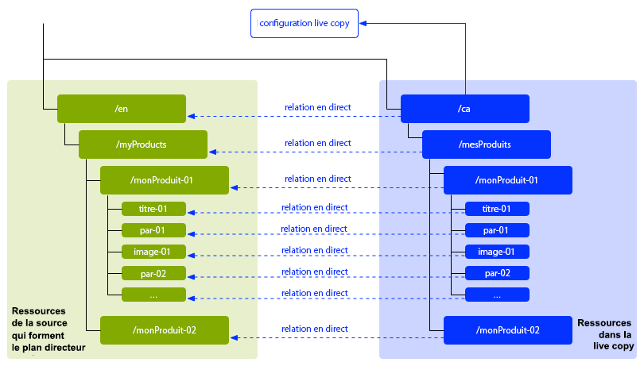
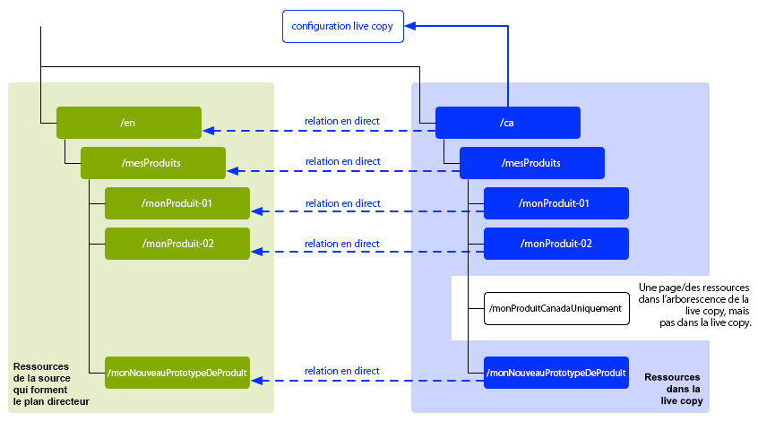
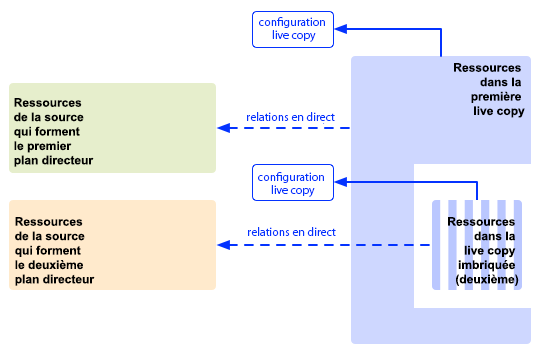

# Réutilisation de contenu : Multi Site Manager et Live Copy{#reusing-content-multi-site-manager-and-live-copy}

Multi Site Manager (MSM) vous permet d’utiliser le même contenu à plusieurs endroits différents. Pour ce faire, MSM utilise sa fonctionnalité Live Copy :

* Avec MSM, vous pouvez :

   * Créer du contenu une fois puis
   * Copier ce contenu vers d’autres endroits des mêmes sites ou d’autres sites où le réutiliser [(Live Copies)](#live-copies).

* MSM conserve alors les relations (en direct) entre votre contenu source et ses Live Copies afin que :

   * Lorsque vous apportez des modifications au contenu source, la source et les Live Copies soient synchronisées (pour appliquer ces modifications aux Live Copies également).
   * Vous pouvez apporter des ajustements au contenu des Live Copies en déconnectant les relations en direct pour des sous-pages et/ou composants spécifiques. Ce faisant, les modifications apportées à la source ne sont plus appliquées à la Live Copy.

La présente section et les pages suivantes abordent les questions connexes :

* [Création et synchronisation de Live Copies](/help/sites-administering/msm-livecopy.md)
* [Console Aperçu de la Live Copy](/help/sites-administering/msm-livecopy-overview.md)
* [Configuration de la synchronisation des Live Copies](/help/sites-administering/msm-sync.md)
* [Conflits de déploiement dans MSM](/help/sites-administering/msm-rollout-conflicts.md)
* [Meilleures pratiques MSM](/help/sites-administering/msm-best-practices.md)

## Scénarios possibles {#possible-scenarios}

Il existe de nombreux cas d’utilisation de MSM et des Live Copies, par exemple :

* **Multinationales - Entreprise mondiale à locale**

   Un cas d’utilisation type pris en charge par MSM consiste à réutiliser du contenu dans plusieurs sites internationaux utilisant la même langue. Ceci permet de réutiliser le contenu de base, tout en autorisant des variantes nationales.

   Par exemple, la section en anglais de l’exemple de site de référence We.Retail est créée pour les clients situés aux États-Unis. La majeure partie du contenu de ce site peut également être utilisée pour d’autres sites We.Retail répondant aux besoins de clients anglophones de différents pays et différentes cultures. Le contenu de base reste identique sur tous les sites, mais des adaptations régionales sont possibles.

   La structure suivante peut être utilisée pour des sites destinés aux États-Unis, au Royaume-Uni, au Canada et à l’Australie :

   ```xml
   /content
       |- we.retail
           |- language-masters
               |- en
       |- we.retail
           |- us
               |- en
       |- we.retail
           |- gb
               |- en
       |- we.retail
           |- ca
               |- en
       |- we.retail
           |- au
               |- en
   ```

   >[!NOTE]
   >
   >MSM ne traduit pas le contenu. Il crée la structure requise et déploie le contenu.
   >
   >
   >Voir [Traduction de contenu pour les sites multilingues](/help/sites-administering/translation.md) si vous souhaitez développer un tel exemple.

* **National - Siège social et filiales régionales**

   Une autre possibilité est qu’une entreprise disposant d’un réseau de concessionnaires souhaite créer des sites web distincts pour chaque concession, chacun de ces sites étant une variante du site principal fourni par le siège social. Il peut s’agir d’une entreprise unique ayant plusieurs sites régionaux ou d’un système de franchise nationale constitué d’un franchisé central et de plusieurs franchisés locaux.

   Le siège social peut fournir les informations de base et les entités régionales peuvent y ajouter des informations locales, comme les coordonnées, les heures d’ouverture et les événements.

   ```xml
   /content
       |- head-office-Berlin
       |- branch-Hamburg
       |- branch-Stuttgart
       |- branch-Munich
       |- branch-Frankfurt
   ```

* **Plusieurs versions**

   Vous pouvez aussi utiliser MSM pour créer des versions d’une sous-branche spécifique : par exemple, un sous-site d’assistance contenant les détails des différentes versions d’un produit spécifique, sur lequel les informations de base demeurent constantes et seules les fonctionnalités mises à jour doivent être changées.

   ```xml
   /content
       |- support
           |- product X
               |- v5.0
               |- v4.0
               |- v3.0
               |- v2.0
               |- v1.0
   ```

   >[!NOTE]
   >
   >Dans un tel scénario, la question de la copie simple ou de l’utilisation des Live Copies se pose toujours.
   >
   >Il existe un équilibre entre :
   >
   >  * D’un côté, le volume de contenu de base qu’il faudra mettre à jour sur plusieurs versions.
   >
   >De l’autre :
   >
   >  * Le nombre de copies individuelles qu’il faudra ajuster.


## MSM à partir de l’interface utilisateur  {#msm-from-the-ui}

MSM est directement accessible dans l’interface utilisateur à l’aide de différentes options de la console appropriée. La section suivante répertorie les principaux emplacements :

* **Créer un site** (**Sites**)

   * MSM vous aide à gérer plusieurs sites web qui partagent du contenu commun. Par exemple, les sites web sont souvent créés pour un public international, de sorte que la majeure partie du contenu est commune à tous les pays, avec un sous-ensemble du contenu spécifique à chaque pays. MSM vous permet de [créer des Live Copies qui mettent automatiquement à jour un ou plusieurs sites en fonction de votre site source](/help/sites-administering/msm-livecopy.md#creating-a-live-copy-of-a-site-from-a-blueprint-configuration). Cela vous permet également d’appliquer une structure de base commune, d’utiliser le contenu commun dans tous les sites, de conserver la même apparence et de concentrer les efforts sur la gestion du contenu qui diffère réellement d’un site à l’autre.
   * Requiert une configuration de plan directeur prédéfinie pour spécifier la source.
   * Crée une Live Copy de la source (prédéfinie).
   * Fournit à l’utilisateur le bouton **Déployer**.

* **Créer une Live Copy** (**Sites**)

   * MSM vous permet de [créer une Live Copy ad hoc (unique) d’une page ou d’une sous-branche spécifique d’un site web](/help/sites-administering/msm-livecopy.md#creating-a-live-copy-of-a-page). Par exemple, vous pouvez dupliquer une sous-branche pour fournir des informations sur la nouvelle version d’un produit.
   * Crée une Live Copy ad hoc (aucune configuration de plan directeur requise).
   * Peut être utilisé pour créer (immédiatement) une Live Copy d’une page/branche.
   * Nécessite **Synchroniser** (ne fournit pas le bouton **Déploiement**).

* **Afficher les propriétés** (**Sites**)

   * Le cas échéant, cette option vous aide [à surveiller votre copie dynamique](/help/sites-administering/msm-livecopy.md#monitoring-your-live-copy) en fournissant des informations sur le **Live Cop** y ou **Blueprint** correspondant.

* **Références** (**Sites**)

   * Le rail [References](/help/sites-authoring/basic-handling.md#references) fournit des informations sur **Live Copies** ainsi que l&#39;accès aux actions appropriées.

* **Aperçu de la Live Copy** (**Sites**)

   * Cette console vous permet [d’afficher et de gérer votre plan directeur et ses Live Copies](/help/sites-administering/msm-livecopy-overview.md).

* **Plans directeurs** (**Outils** - **Sites**)

   * Cette console vous permet de [créer et de gérer vos configurations de plan directeur](/help/sites-administering/msm-livecopy.md#creating-a-blueprint-configuration).

>[!NOTE]
>
>Les aspects des fonctionnalités MSM sont utilisés dans plusieurs autres fonctionnalités AEM (par exemple, Lancements, Catalogue). Dans ces cas, la Live Copy est gérée par cette fonction.

### Termes utilisés  {#terms-used}

En guise d’introduction, le tableau suivant offre un aperçu des principaux termes utilisés avec MSM. Ceux-ci seront traités plus en détail dans les sections et les pages suivantes :

<table>
 <tbody>
  <tr>
   <td><strong>Terme</strong></td>
   <td><strong>Définition</strong></td>
   <td><strong>Détails supplémentaires</strong></td>
  </tr>
  <tr>
   <td><strong>Source</strong></td>
   <td>Pages d’origine.</td>
   <td>Synonyme de pages Blueprints et/ou Blueprint.</td>
  </tr>
  <tr>
   <td><strong>Live Copy </strong></td>
   <td>Copie (de la source), gérée par des actions de synchronisation définies par les configurations de déploiement. </td>
   <td> </td>
  </tr>
  <tr>
   <td><strong>Configuration de Live Copy</strong></td>
   <td>Définition des détails de configuration d’une copie dynamique.</td>
   <td> </td>
  </tr>
  <tr>
   <td><strong>Relations en direct</strong><br /> </td>
   <td>Définition efficace de l'héritage pour une ressource donnée ; les connexions entre la source et les copies dynamiques.<br /> </td>
   <td>Assure que les modifications apportées à la source peuvent être synchronisées avec la Live Copy.</td>
  </tr>
  <tr>
   <td><strong>Blueprint</strong></td>
   <td>Synonyme avec Source.</td>
   <td>Peut être défini par une configuration de plan.</td>
  </tr>
  <tr>
   <td><strong>Configuration du plan directeur</strong></td>
   <td>Configuration prédéfinie spécifiant un chemin d’accès source.</td>
   <td>Lorsqu’une page de plan directeur est référencée dans une configuration de plan directeur, la commande Déployer devient disponible.</td>
  </tr>
  <tr>
   <td><strong>Synchronisation</strong></td>
   <td>Terme générique de synchronisation du contenu entre la source et les copies dynamiques (par <strong>Déploiement</strong> et <strong>Synchronisation</strong>).</td>
   <td> </td>
  </tr>
  <tr>
   <td><strong>Déployer</strong><br /> </td>
   <td>Synchronise la source avec la bibliothèque livecopy.<br /> Peut être déclenché par un auteur (sur une page de plan directeur) ou par un événement système (tel que défini par la configuration de déploiement).</td>
   <td> </td>
  </tr>
  <tr>
   <td><strong>Configuration du déploiement</strong></td>
   <td>Règles qui déterminent quelles propriétés seront synchronisées, comment et quand.</td>
   <td> </td>
  </tr>
  <tr>
   <td><strong>Synchroniser</strong></td>
   <td>Demande manuelle de synchronisation, effectuée à partir des pages livecopy.</td>
   <td> </td>
  </tr>
  <tr>
   <td><strong>Héritage</strong></td>
   <td>Une page/composant de copie dynamique hérite du contenu de sa page/composant source lors de la synchronisation.</td>
   <td> </td>
  </tr>
  <tr>
   <td><strong>Suspendre</strong></td>
   <td>Supprime temporairement la relation active entre une copie dynamique et sa page de plan.</td>
   <td> </td>
  </tr>
  <tr>
   <td><strong>Désolidariser</strong></td>
   <td>Supprimez temporairement la relation en direct entre une Live Copy et sa page de plan directeur.</td>
   <td> </td>
  </tr>
  <tr>
   <td><strong>Réinitialiser</strong></td>
   <td><p>Réinitialisez une page Live Copy pour :</p>
    <ul>
     <li>Supprimer toutes les annulations d’héritage et<br /> </li>
     <li>Restaurer la page dans le même état que la page source.</li>
    </ul> <p>La réinitialisation affecte toutes les modifications que vous avez apportées aux propriétés de page, au système de paragraphes et aux composants.</p> </td>
   <td> </td>
  </tr>
  <tr>
   <td><strong>Léger</strong></td>
   <td>Copie en direct d’une seule page.</td>
   <td> </td>
  </tr>
  <tr>
   <td><strong>Profondeur</strong></td>
   <td>Copie en direct d’une page, ainsi que de ses pages enfants.</td>
   <td> </td>
  </tr>
 </tbody>
</table>

>[!NOTE]
>
>Voir [Présentation de l’API Java](/help/sites-developing/extending-msm.md#overview-of-the-java-api) pour les noms d’objet.

## Live Copies {#live-copies}

Une Live Copy MSM est une copie du contenu spécifique d’un site pour laquelle des relations en direct avec la source d’origine sont conservées :

* La Live Copy hérite du contenu de sa source.
* La synchronisation effectue le transfert réel du contenu lorsque des modifications sont apportées à la source.
* Une Live Copy peut être considérée comme :

   * Superficielle : une seule page
   * Profonde : la page, ainsi que ses pages enfants

* Les règles de synchronisation, ou configurations de déploiement, déterminent quelles propriétés sont synchronisées et à quel moment se produit la synchronisation.

Dans l’exemple précédent, `/content/we-retail/language-masters/en` est le site maître global en anglais. Pour réutiliser le contenu de ce site, des Live Copies MSM sont créées :

* Le contenu ci-dessous `/content/we-retail/language-masters/en` est la source.

* Le contenu ci-dessous `/content/we-retail/language-masters/en` est copié sous les noeuds `/content/we-retail/us/en/`, `/content/we-retail/gb/en`, `/content/we-retail/ca/en` et `/content/we-retail/au/en`. Il s’agit des Live Copies.

* Les auteurs apportent des modifications aux pages suivantes `/content/we-retail/language-masters/en`.
* Une fois la synchronisation déclenchée, MSM synchronise ces modifications vers les Live Copies.

### Live Copies - Composition  {#live-copies-composition}

>[!NOTE]
>
>Les graphiques et les descriptions de cette section représentent des instantanés de Live Copies potentielles. Ils ne sont pas exhaustifs, mais offrent un aperçu mettant en évidence les caractéristiques spécifiques.

Lorsque vous créez initialement une Live Copy, les pages sources sélectionnées sont reflétées sur une base 1:1 dans la Live Copy. Par la suite, de nouvelles ressources (pages et/ou paragraphes) peuvent également être créées directement dans la Live Copy. Il est donc utile d’être conscient de ces variations et de savoir comment elles affectent la synchronisation. Les compositions possibles sont les suivantes :

* [Live Copy avec des pages non-Live Copy](#live-copy-with-non-live-copy-pages)
* [Live Copies imbriquées](#nested-live-copies)

La forme de base de la Live Copy comprend :

* Les pages Live Copy qui reflètent les pages sources sélectionnées sur une base 1:1.
* Une définition de configuration.
* Des relations en direct définies pour chaque ressource :

   * Liez la ressource de Live Copy à son plan directeur/sa source.
   * Sont utilisés lors de la réalisation de l’héritage et du déploiement.

* Les modifications peuvent être [synchronisées](/help/sites-administering/msm-livecopy.md#synchronizing-your-live-copy) en fonction des besoins.



#### Live Copy avec des pages non-Live Copy {#live-copy-with-non-live-copy-pages}

Lorsque vous créez une Live Copy dans AEM, vous pouvez voir et naviguer dans la branche Live Copy, et utiliser les fonctionnalités AEM normales sur la branche Live Copy. Cela signifie que vous (ou un processus) pouvez créer de nouvelles ressources (pages et/ou paragraphes) dans la branche de la copie dynamique (par ex. `myCanadaOnlyProduct`).

* Ces ressources n’ont aucune relation en direct avec les pages source/de plan directeur et ne sont pas synchronisées.
* Certains scénarios peuvent se produire, et MSM les traite comme des cas spéciaux. Par exemple, lorsque vous (ou un processus) créez une page ayant la même position et le même nom dans les branches source/de plan directeur et Live Copy. Pour de telles situations, voir [Conflits de déploiement MSM](/help/sites-administering/msm-rollout-conflicts.md) pour plus d&#39;informations.



#### Live Copies imbriquées {#nested-live-copies}

Lorsque vous (ou un processus) créez une [nouvelle page dans une copie dynamique ](#live-copy-with-non-live-copy-pages) existante, cette nouvelle page peut également être configurée en tant que copie dynamique d&#39;un autre modèle. Il s’agit d’une copie dynamique imbriquée, où le comportement de la deuxième copie dynamique (interne) est affecté par la première copie dynamique (externe) de la manière suivante :

* Un déploiement profond déclenché pour la Live Copy supérieure peut continuer dans la Live Copy imbriquée (par exemple, si le déclencheur correspond).
* Tous les liens entre les sources sont réécrits dans les Live Copies.

   Par exemple, les liens allant du second au premier plan directeur sont réécrits en tant que liens allant de la seconde Live Copy/Live Copy imbriquée à la première Live Copy.



>[!NOTE]
>
>Si vous déplacez/renommez une page de la branche Live Copy, cette opération est traitée (en interne) comme une Live Copy imbriquée pour permettre à AEM d’effectuer le suivi des relations.

#### Live Copies empilées  {#stacked-live-copies}

Une Live Copy est appelée Live Copy empilée lorsqu’elle est créée en tant qu’enfant d’une Live Copy superficielle. Elle se comporte de la même façon qu’une [Live Copy imbriquée](#nested-live-copies).

### Source, plans directeurs et configurations de plan directeur  {#source-blueprints-and-blueprint-configurations}

N’importe quelle page ou branche de pages peut être utilisée comme source d’une Live Copy.

Toutefois, MSM vous permet également de définir une configuration de plan directeur qui spécifie un chemin d’accès source. L&#39;utilisation d&#39;une configuration de schéma directeur présente les avantages suivants :

* Permettre à l&#39;auteur d&#39;utiliser l&#39;option **Déploiement** sur un plan directeur pour (explicitement) pousser les modifications à des copies dynamiques qui héritent de ce plan.
* Autoriser l’auteur à utiliser **Créer un site**; cela permet à l’utilisateur de sélectionner facilement les langues et de configurer la structure de la copie dynamique.
* définit une configuration de déploiement par défaut pour les Live Copies partageant une relation avec le plan directeur.

La source d’une Live Copy peut comprendre des pages normales ou des pages englobées par une configuration de plan directeur. Ces deux scénarios sont valides.

La source forme le plan directeur de la Live Copy. Le plan directeur est défini lorsque vous effectuez l’une des opérations suivantes :

* [Créer une configuration de plan directeur](/help/sites-administering/msm-livecopy.md#creating-a-blueprint-configuration)

   La configuration définit (à l’avance) les pages à utiliser pour créer la copie dynamique.

* [Création d’une copie dynamique d’une page](/help/sites-administering/msm-livecopy.md#creating-a-live-copy-of-a-page)

   Les pages utilisées pour créer la copie dynamique (les pages sources) sont les pages de plan.

   La page source peut être référencée par une configuration de plan directeur, ou non.

### Déploiement et synchronisation {#rollout-and-synchronize}

Le déploiement est l’action MSM centrale qui synchronise les Live Copies avec leur source. Vous pouvez exécuter des déploiements manuellement ou ils peuvent se produire automatiquement :

* Une [configuration de déploiement](#rollout-configurations) peut être définie de sorte que des [événements](/help/sites-administering/msm-sync.md#rollout-triggers) spécifiques puissent provoquer l’exécution automatique d’un déploiement.
* Lorsque vous créez une page de plan directeur, vous pouvez utiliser la commande [Déployer](/help/sites-administering/msm-livecopy.md#rolling-out-a-blueprint) pour pousser les modifications vers la Live Copy.

   La commande **Déployer** est disponible sur une page de plan directeur référencée par une configuration de plan directeur.

   

* Lorsque vous créez une page Live Copy, vous pouvez utiliser la commande [Synchroniser](/help/sites-administering/msm-livecopy.md#synchronizing-a-live-copy) pour pousser les modifications de la source vers la Live Copy.

   La commande **Synchroniser** est toujours disponible sur la page Live Copy (que la page source/de plan directeur soit englobée ou non par une configuration de plan directeur).

   

### Configurations du déploiement {#rollout-configurations}

Une configuration de déploiement définit quand et comment une Live Copy est synchronisée avec le contenu source. Une configuration de déploiement consiste en un déclencheur et d’une ou plusieurs actions de synchronisation :

* **Déclencheur**

   Un déclencheur est un événement qui provoque la synchronisation d’une action en direct, comme l’activation d’une page source. MSM définit les déclencheurs que vous pouvez utiliser.

* **Actions de synchronisation**

   Ces actions sont exécutées sur la Live Copy pour la synchroniser avec la source. Par exemple, la copie de contenu, l’organisation de nœuds enfants et l’activation de la page Live Copy sont des actions de synchronisation. MSM propose un certain nombre d’actions de synchronisation.

   >[!NOTE]
   >
   >Vous pouvez créer des actions personnalisées pour votre instance à l’aide de l’API Java.

Les configurations de déploiement peuvent être réutilisées, de sorte que plusieurs Live Copies puissent utiliser la même configuration de déploiement. L’installation standard comprend plusieurs [configurations de déploiement](/help/sites-administering/msm-sync.md#installed-rollout-configurations).

### Conflits de déploiement  {#rollout-conflicts}

Les déploiements peuvent devenir complexes, en particulier lorsque les auteurs publient du contenu à la fois dans la source et la Live Copy. Il est donc utile de savoir comment AEM gère les [conflits susceptibles de se produire pendant le déploiement](/help/sites-administering/msm-rollout-conflicts.md).

### Suspension et annulation de l’héritage et de la synchronisation  {#suspending-and-cancelling-inheritance-and-synchronization}

Chaque page et chaque composant dans une Live Copy sont associés à leur page source et leur composant source via des relations en direct. Les relations en direct configurent la synchronisation du contenu Live Copy à partir de la source.

Vous pouvez **Suspendre** l’héritage Live Copy d’une page Live Copy de manière à pouvoir modifier les propriétés de la page et ses composants. Lorsque vous suspendez l’héritage, les propriétés et les composants de la page ne sont plus synchronisés avec la source.

Lors de la modification d’une page individuelle, les auteurs peuvent **Annuler l’héritage** d’un composant. Lorsque l’héritage est annulé, les relations en direct sont suspendues et la synchronisation ne se produit pas pour ce composant. L’annulation de l’héritage et de la synchronisation est utile lorsque des sous-sections du contenu doivent être personnalisées.

### Désolidarisation d’une Live Copy {#detaching-a-live-copy}

Vous pouvez également [désolidariser une Live Copy](/help/sites-administering/msm-livecopy.md#detaching-a-live-copy) de son plan directeur pour supprimer toutes les connexions.

>[!CAUTION]
>
>L’action Désolidariser est définitive et irréversible.

L’action Désolidariser supprime définitivement les relations en direct entre une Live Copy et sa page de plan directeur. Toutes les propriétés MSM sont supprimées de la Live Copy et les pages Live Copy deviennent une copie autonome.

>[!NOTE]
>
>Voir [Désolidarisation d’une Live Copy](/help/sites-administering/msm-livecopy.md#detaching-a-live-copy) pour plus d’informations, y compris pour connaître l’impact associé sur les sous-pages et les pages parentes.

## Étapes standard d’utilisation de MSM  {#standard-steps-for-using-msm}

Les étapes suivantes décrivent la procédure standard d’utilisation de MSM pour réutiliser le contenu et synchroniser les modifications apportées aux Live Copies.

1. Développez le contenu du site source.
1. Déterminez la configuration de déploiement à utiliser.

   1. MSM [installe plusieurs configurations de déploiement](/help/sites-administering/msm-sync.md#installed-rollout-configurations) qui peuvent répondre à un certain nombre de cas d&#39;utilisation.
   1. Vous pouvez également [créer une configuration de déploiement](/help/sites-administering/msm-sync.md#creating-a-rollout-configuration) si nécessaire.

1. Déterminez à quel endroit vous devez [spécifier les configurations de déploiement à utiliser](/help/sites-administering/msm-sync.md#specifying-the-rollout-configurations-to-use) et procédez aux configurations en fonction de vos besoins.
1. Si nécessaire, [créez une configuration de plan directeur](/help/sites-administering/msm-livecopy.md#creating-a-blueprint-configuration) qui identifie le contenu source de la copie dynamique.
1. [Créez une copie](/help/sites-administering/msm-livecopy.md#creating-a-live-copy) dynamique.
1. Apportez des modifications au contenu source selon vos besoins. Vous devez suivre le processus normal d’examen et d’approbation du contenu établi par votre entreprise.
1. [Exécutez ](/help/sites-administering/msm-livecopy.md#rolling-out-a-blueprint) le plan ou  [synchronisez la ](/help/sites-administering/msm-livecopy.md#synchronizing-a-live-copy) copie dynamique avec les modifications.

## Personnalisation de MSM {#customizing-msm}

MSM fournit des outils afin que votre implémentation puisse s’adapter aux complexités exceptionnelles pouvant résulter du partage de contenu :

* **Configurations de déploiement personnalisées**
   [Créez une ](/help/sites-administering/msm-sync.md#creating-a-rollout-configuration) configuration de déploiement lorsque les configurations de déploiement installées ne répondent pas à vos besoins. Vous pouvez utiliser n’importe quel déclencheur de déploiement et action de synchronisation disponibles.

* **Actions de synchronisation personnalisée**
   [Créez une ](/help/sites-developing/extending-msm.md#creating-a-new-synchronization-action) action de synchronisation personnalisée lorsque les actions installées ne répondent pas aux exigences spécifiques de votre application. MSM fournit une API Java permettant de créer des actions de synchronisation personnalisées.

## Bonnes pratiques {#best-practices}

La page [Meilleures pratiques MSM](/help/sites-administering/msm-best-practices.md) contient des informations importantes sur votre implémentation.
