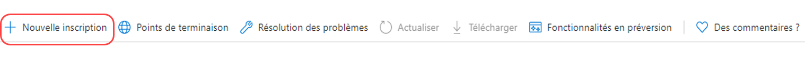

# Configurer les notifications par e-mail{#configuring-email-notification}

AEM envoie des notifications par e-mail aux utilisateurs et utilisatrices qui :

* Ont souscrit à des événements de page, par exemple une modification ou une réplication. La section [Boîte de réception de notifications](/help/sites-classic-ui-authoring/author-env-inbox.md#subscribing-to-notifications) décrit comment s’abonner à ces événements.

* Ont souscrit aux événements de forum.
* Doivent effectuer une opération dans un workflow. La section [Étape de participant](/help/sites-developing/workflows-step-ref.md#participant-step) décrit comment déclencher une notification par e-mail dans un workflow.

Conditions préalables :

* Les utilisateurs et utilisatrices doivent avoir défini une adresse e-mail valide dans leur profil.
* Le **Service de messagerie Day CQ** doit être correctement configuré.

Lorsque l’utilisateur est averti, il reçoit un courrier électronique dans la langue définie dans son profil. Chaque langue possède son propre modèle, qui peut être personnalisé. De nouveaux modèles d’e-mail peuvent être ajoutés pour de nouvelles langues.

>[!NOTE]
>
>Lorsque vous utilisez AEM, plusieurs méthodes permettent de gérer les paramètres de configuration pour ces services. Consultez la section [Configuration d’OSGi](/help/sites-deploying/configuring-osgi.md) pour plus de détails et pour connaître les pratiques recommandées.

## Configurer le service de messagerie {#configuring-the-mail-service}

Pour qu’AEM puisse envoyer des courriers électroniques, le **service de messagerie Day CQ** doit être correctement configuré. Vous pouvez afficher la configuration dans la console Web. Lorsque vous utilisez AEM, plusieurs méthodes permettent de gérer les paramètres de configuration pour ces services. Consultez la section [Configuration d’OSGi](/help/sites-deploying/configuring-osgi.md) pour plus de détails et pour connaître les pratiques recommandées.

Les contraintes suivantes s’appliquent :

* Le **port de serveur SMTP** doit être le port 25 ou un port supérieur.

* Le **nom d’hôte de serveur SMTP** ne doit pas être vide.
* L’**adresse « De »** ne doit pas être vide.

Pour résoudre plus facilement un problème avec le **service de messagerie Day CQ**, vous pouvez examiner les journaux du service :

`com.day.cq.mailer.DefaultMailService`

La configuration ressemble à ce qui suit dans la console web :


## Configuration du canal de notification par e-mail {#configuring-the-email-notification-channel}

Lorsque vous vous abonnez à des notifications d’événement de page ou de forum, l’adresse électronique De est définie sur `no-reply@acme.com` par défaut. Vous pouvez modifier cette valeur en configurant le service **Notification par e-mail** dans la console web.

Pour configurer l’adresse électronique De, ajoutez un nœud `sling:OsgiConfig` au référentiel. Procédez comme suit pour ajouter le nœud directement avec CRXDE Lite :

1. Dans CRXDE Lite, ajoutez un dossier nommé `config` sous votre dossier d’application.
1. Dans le dossier de configuration, ajoutez un nœud nommé :

   `com.day.cq.wcm.notification.email.impl.EmailChannel` de type `sling:OsgiConfig`

1. Ajoutez une propriété `String` au nœud nommé `email.from`. Pour la valeur, indiquez l’adresse e-mail à utiliser.

1. Cliquez sur **Enregistrer tout**.

Procédez comme suit pour définir le nœud dans les dossiers source de votre package de contenu :

1. Dans votre `jcr_root/apps/*app_name*/config folder`, créez un fichier nommé `com.day.cq.wcm.notification.email.impl.EmailChannel.xml`.

1. Ajoutez le fichier XML suivant pour représenter le nœud :

   `<?xml version="1.0" encoding="UTF-8"?> <jcr:root xmlns:sling="https://sling.apache.org/jcr/sling/1.0" xmlns:jcr="https://www.jcp.org/jcr/1.0" jcr:primaryType="sling:OsgiConfig" email.from="name@server.com"/>`
1. Remplacez la valeur de l’attribut `email.from` (`name@server.com`) par votre adresse électronique.

1. Enregistrez le fichier.

## Configurer le service de notification par e-mail de workflow {#configuring-the-workflow-email-notification-service}

Lorsque vous recevez des notifications électroniques de workflow, l’adresse électronique De et le préfixe URL hôte sont définis sur les valeurs par défaut. Vous pouvez modifier ces valeurs en configurant le **service de notification électronique de workflow Day CQ** dans la console Web. Si vous le faites, il est recommandé de conserver la modification dans le référentiel.

La configuration par défaut se présente comme suit dans la console web :


### Modèles d’e-mail pour les notifications de page {#email-templates-for-page-notification}

Vous trouverez les modèles d’e-mail pour les notifications de page à l’emplacement suivant :

`/libs/settings/notification-templates/com.day.cq.wcm.core.page`

Le modèle en anglais par défaut (`en.txt`) est défini comme suit :

```xml
subject=[CQ Page Event Notification]: Page Event

header=-------------------------------------------------------------------------------------\n \
Time: ${time}\n \
User: ${userFullName} (${userId})\n \
-------------------------------------------------------------------------------------\n\n

message=The following pages were affected by the event: \n \
 \n \
${modifications} \n \
 \n\n
footer=\n \
-------------------------------------------------------------------------------------\n \
This is an automatically generated message. Please do not reply.
```

#### Personnalisation des modèles d’e-mail pour la notification de page {#customizing-email-templates-for-page-notification}

Pour personnaliser le modèle d’e-mail en anglais en vue de la notification de page :

1. Dans CRXDE, ouvrez le fichier :

   `/libs/settings/notification-templates/com.day.cq.wcm.core.page/en.txt`

1. Modifiez le fichier selon vos besoins.
1. Enregistrez les modifications.

Le modèle doit avoir le format suivant :

```
 subject=<text_1>
 header=<text_2>
 message=<text_3>
 footer=<text_4>
```

&lt;text_x> pouvant combiner du texte statique et des variables de chaînes dynamiques. Les variables suivantes peuvent être utilisées dans le modèle d’e-mail pour les notifications de page :

* `${time}`, la date et l’heure de l’événement.

* `${userFullName}`, le nom complet de l’utilisateur ayant déclenché l’événement.

* `${userId}`, l’ID de l’utilisateur ayant déclenché l’événement.
* `${modifications}`, le type de l’événement de page et le chemin de page au format suivant :

  &lt;page event type> => &lt;page path>

  Par exemple :

  PageModified => /content/geometrixx/en/products

### Modèles d’e-mail pour les notifications de workflow {#email-templates-for-workflow-notification}

Vous trouverez le modèle d’e-mail pour les notifications de workflow (en anglais) à l’emplacement suivant :

`/libs/settings/workflow/notification/email/default/en.txt`

Il est défini comme suit :

```xml
subject=Workflow notification: ${event.EventType}

header=-------------------------------------------------------------------------------------\n \
Time: ${event.TimeStamp}\n \
Step: ${item.node.title}\n \
User: ${participant.name} (${participant.id})\n \
Workflow: ${model.title}\n \
-------------------------------------------------------------------------------------\n\n

message=Content: ${host.prefix}${payload.path.open}\n

footer=\n \
-------------------------------------------------------------------------------------\n \
View the overview in your ${host.prefix}/aem/inbox\n \
-------------------------------------------------------------------------------------\n \
This is an automatically generated message. Please do not reply.
```

#### Personnaliser les modèles d’e-mail pour les notifications de workflow {#customizing-email-templates-for-workflow-notification}

Pour personnaliser le modèle d’e-mail en anglais en vue de la notification d’événement de workflow :

1. Dans CRXDE, ouvrez le fichier :

   `/libs/settings/workflow/notification/email/default/en.txt`

1. Modifiez le fichier selon vos besoins.
1. Enregistrez les modifications.

Le modèle doit avoir le format suivant :

```
subject=<text_1>
 header=<text_2>
 message=<text_3>
 footer=<text_4>
```

>[!NOTE]
>
>`<text_x>` pouvant combiner du texte statique et des variables de chaînes dynamiques. Chaque ligne d’un élément `<text_x>` doit se terminer par une barre oblique inverse (`\`), à l’exception de la dernière instance, lorsque l’absence de la barre oblique inverse indique la fin de la variable de chaîne `<text_x>`.
>
>Vous trouverez plus d’informations sur le format des modèles dans les [javadocs de la méthode Properties.load()](https://docs.oracle.com/javase/8/docs/api/java/util/Properties.html#load-java.io.InputStream-).

La méthode `${payload.path.open}` révèle le chemin d’accès au payload de l’élément de travail. Par exemple, pour une page dans Sites, `payload.path.open` serait similaire à `/bin/wcmcommand?cmd=open&path=…`.Sans le nom de serveur, raison pour laquelle le modèle fait précéder ceci de `${host.prefix}`.

Les variables suivantes peuvent être utilisées dans le modèle d’e-mail :

* `${event.EventType}`, type de l’événement
* `${event.TimeStamp}`, date et heure de l’événement
* `${event.User}`, utilisateur ayant déclenché l’événement
* `${initiator.home}`, chemin d’accès au nœud de l’initiateur

* `${initiator.name}`, nom de l’initiateur

* `${initiator.email}`, adresse électronique de l’initiateur
* `${item.id}`, ID de l’élément de travail
* `${item.node.id}`, ID du nœud dans le modèle de workflow associé à cet élément de travail
* `${item.node.title}`, titre de l’élément de travail
* `${participant.email}`, adresse électronique du participant
* `${participant.name}`, nom du participant
* `${participant.familyName}`, nom de famille du participant
* `${participant.id}`, ID du participant
* `${participant.language}`, langue du participant
* `${instance.id}`, ID du workflow
* `${instance.state}`, statut du workflow
* `${model.title}`, titre du modèle de workflow
* `${model.id}`, ID du modèle de workflow

* `${model.version}`, version du modèle de workflow
* `${payload.data}`, payload

* `${payload.type}`, type de payload
* `${payload.path}`, chemin d’accès au payload
* `${host.prefix}`, préfixe d’hôte, par exemple : `http://localhost:4502`

### Ajouter un modèle d’e-mail pour une nouvelle langue {#adding-an-email-template-for-a-new-language}

Pour ajouter un modèle pour une nouvelle langue :

1. Dans CRXDE, ajoutez un fichier `<language-code>.txt` ci-dessous :

   * `/libs/settings/notification-templates/com.day.cq.wcm.core.page` : pour les notifications de page
   * `/libs/settings/workflow/notification/email/default` : pour les notifications de workflow

1. Adaptez le fichier à la langue.
1. Enregistrez les modifications.

>[!NOTE]
>
>Le `<language-code>` utilisé comme nom de fichier du modèle d’e-mail doit être un code de langue à deux lettres en minuscules reconnu par AEM. Pour les codes de langue, AEM s’appuie sur la norme ISO-639-1.

## Configurer les notifications par e-mail d’AEM Assets {#assetsconfig}

Lorsque des collections dans AEM Assets sont partagées ou non partagées, les utilisateurs et utilisatrices peuvent recevoir des notifications par e-mail d’AEM. Pour configurer les notifications par e-mail, procédez comme suit.

1. Configurez le service de messagerie, comme décrit ci-dessus dans [Configuration du service de messagerie](/help/sites-administering/notification.md#configuring-the-mail-service).
1. Connectez-vous à AEM en tant qu’administrateur. Cliquez sur **Outils** > **Opérations** > **Console web** pour ouvrir la configuration de la console web.
1. Modifiez le **Servlet de collection des ressources DAM Day CQ**. Sélectionnez **Envoyer un e-mail**. Cliquez sur **Enregistrer**.

## Configuration d’OAuth {#setting-up-oauth}

AEM offre la prise en charge d’OAuth2 pour son service de messagerie intégré, afin de permettre aux organisations de se conformer aux exigences en matière de messagerie sécurisée.

Vous pouvez configurer OAuth pour plusieurs fournisseurs de messagerie, comme indiqué ci-dessous.

>[!NOTE]
>
>Cette procédure est un exemple pour une instance de publication. Si vous souhaitez activer les notifications par e-mail sur une instance d’auteur, vous devez suivre les mêmes étapes sur l’instance d’auteur.

### Gmail {#gmail}

1. Créez votre projet à l’adresse `https://console.developers.google.com/projectcreate`.
1. Sélectionnez votre projet, puis accédez à **API et services** - **Tableau de bord - Informations d’identification**.
1. Configurez l’écran de consentement OAuth en fonction de vos besoins.
1. Dans l’écran de mise à jour qui suit, ajoutez les deux portées suivantes :
   * `https://mail.google.com/`
   * `https://www.googleapis.com//auth/gmail.send`
1. Une fois que vous avez ajouté les portées, revenez à **Informations d’identification** dans le menu de gauche, puis accédez à **Création d’informations d’identification** - **ID client OAuth** - **Application de bureau**.
1. Une nouvelle fenêtre s’ouvre, contenant l’identifiant du client et le secret du client.
1. Enregistrez ces informations d’identification.

**Configurations côté AEM**

>[!NOTE]
>
>Les clients d’Adobe Managed Services peuvent collaborer avec leur équipe d’ingénierie de service client pour apporter ces modifications aux environnements d’exploitation.

Tout d’abord, configurez le service de messagerie :

1. Ouvrez la console web AEM en accédant à `http://serveraddress:serverport/system/console/configMgr`.
1. Recherchez **Service de messagerie Day CQ**, puis cliquez dessus.
1. Ajoutez les paramètres suivants :
   * Nom d’hôte du serveur SMTP : `smtp.gmail.com`
   * Port du serveur SMTP : `25` ou `587`, selon vos exigences
   * Cochez les cases correspondant à **SMPT utilise StarTLS** et **SMTP exige StarTLS**.
   * Vérifiez le **Flux OAuth** et cliquez sur **Enregistrer**.

Ensuite, configurez votre fournisseur SMTP OAuth en suivant la procédure ci-dessous :

1. Ouvrez la console web AEM en accédant à `http://serveraddress:serverport/system/console/configMgr`.
1. Recherchez **Fournisseur SMTP OAuth2 CQ Mailer**, puis cliquez dessus.
1. Renseignez les informations requises comme suit :
   * URL d’autorisation : `https://accounts.google.com/o/oauth2/auth`
   * URL du jeton : `https://accounts.google.com/o/oauth2/token`
   * Portées : `https://www.googleapis.com/auth/gmail.send` et `https://mail.google.com/`. Vous pouvez ajouter plusieurs plages en appuyant sur le bouton **+** sur le côté droit de chaque portée configurée.
   * ID client et secret client : configurez ces champs avec les valeurs que vous avez récupérées comme décrit dans le paragraphe ci-dessus.
   * URL du jeton d’actualisation : `https://accounts.google.com/o/oauth2/token`
   * Actualiser l’expiration du jeton : jamais
1. Cliquez sur **Enregistrer**.

<!-- clarify refresh token expiry, currently not present in the UI -->

Une fois configurés, les paramètres doivent se présenter comme suit :


Maintenant, activez les composants OAuth. Vous pouvez le faire en procédant comme suit :

1. Accédez à la console Composants en consultant cette URL : `http://serveraddress:serverport/system/console/components`
1. Recherchez les composants suivants :
   * `com.day.cq.mailer.oauth.servlets.handler.OAuthCodeGenerateServlet`
   * `com.day.cq.mailer.oauth.servlets.handler.OAuthCodeAccessTokenGenerator`
1. Appuyez sur l’icône Lecture à gauche des composants.

   

Enfin, confirmez la configuration en procédant comme suit :

1. Accédez à l’adresse de l’instance de publication et connectez-vous en tant qu’administrateur.
1. Ouvrez un nouvel onglet dans le navigateur et accédez à `http://serveraddress:serverport/services/mailer/oauth2/authorize`. Vous serez redirigé vers la page de votre fournisseur SMTP, dans ce cas Gmail.
1. Connexion et consentement pour accorder les autorisations requises
1. Une fois le consentement accordé, le jeton est stocké dans le référentiel. Vous pouvez y accéder sous `accessToken` en accédant directement à cette URL sur votre instance de publication : `http://serveraddress:serverport/crx/de/index.jsp#/conf/global/settings/mailer/oauth`
1. Répétez les étapes ci-dessus pour chaque instance de publication.

<!-- clarify if the ip/server address in the last procedure is that of the publish instance -->

### Microsoft Outlook {#microsoft-outlook}

1. Accédez à [https://portal.azure.com/](https://portal.azure.com/) et connectez-vous.
1. Recherchez **Azure Active Directory** dans la barre de recherche et cliquez sur le résultat. Vous pouvez également accéder directement à [https://portal.azure.com/#blade/Microsoft_AAD_IAM/ActiveDirectoryMenuBlade/Overview](https://portal.azure.com/#blade/Microsoft_AAD_IAM/ActiveDirectoryMenuBlade/Overview).
1. Cliquez sur **Enregistrement de l’application** - **Nouvel enregistrement**

   

1. Renseignez les informations selon vos besoins, puis cliquez sur **Enregistrer**.
1. Accédez à l’application nouvellement créée, puis sélectionnez **Autorisations API**
1. Accédez à **Ajouter une autorisation** - **Autorisation graphique** - **Autorisations déléguées**
1. Sélectionnez les autorisations ci-dessous pour votre application, puis cliquez sur **Ajouter une autorisation** :
   * `SMTP.Send`
   * `Mail.Read`
   * `Mail.Send`
   * `openid`
   * `offline_access`
1. Accédez à **Authentification** - **Ajouter une plateforme** - **Web**, et dans **Url de Redirection**, ajoutez l’URL suivante pour rediriger le code OAuth, puis appuyez sur **Configurer** :
   * `http://localhost:4503/services/mailer/oauth2/token`
1. Répétez les étapes ci-dessus pour chaque instance de publication.
1. Configurez les paramètres en fonction de vos besoins.
1. Ensuite, accédez à **Certificats et secrets**, cliquez sur **Nouveau secret client** et suivez les étapes à l’écran pour créer un secret. Veillez à prendre note de ce secret pour une utilisation ultérieure.
1. Appuyez sur **Aperçu** dans le volet de gauche et copiez les valeurs pour **ID d’application (client)** et **ID de répertoire (locataire)** pour une utilisation ultérieure.

Pour résumer, vous aurez besoin des informations suivantes pour configurer OAuth2 pour le service de messagerie côté AEM :

* L’URL d’authentification, qui sera créée avec l’identifiant du client. Elle se présente comme suit : `https://login.microsoftonline.com/<tenantID>/oauth2/v2.0/authorize`
* L’URL du jeton, qui sera construite avec l’ID du locataire. Elle se présente comme suit : `https://login.microsoftonline.com/<tenantID>/oauth2/v2.0/token`
* L’URL d’actualisation, qui sera créée avec l’ID du locataire. Elle se présente comme suit : `https://login.microsoftonline.com/<tenantID>/oauth2/v2.0/token`
* L’ID client
* Le secret client

**Configurations côté AEM**

Ensuite, intégrez vos paramètres OAuth2 à AEM :

1. Accédez à la console web de votre instance locale en accédant à `http://serveraddress:serverport/system/console/configMgr`.
1. Recherchez le **service de messagerie Day CQ**, puis cliquez dessus.
1. Ajoutez les paramètres suivants :
   * Nom d’hôte du serveur SMTP : `smtp.office365.com`
   * Utilisateur SMTP : votre nom d’utilisateur au format e-mail
   * Adresse « De » : adresse électronique à utiliser dans le champ « De » des messages envoyés par la messagerie
   * Port du serveur SMTP : `25` ou `587` selon vos exigences
   * Cochez les cases correspondant à **SMPT utilise StarTLS** et **SMTP exige StarTLS**.
   * Vérifiez le **Flux OAuth** et cliquez sur **Enregistrer**.
1. Recherchez le **fournisseur OAuth2 SMTP CQ Mailer**, puis cliquez dessus.
1. Renseignez les informations requises comme suit :
   * Renseignez l’URL d’autorisation, l’URL du jeton et l’URL du jeton d’actualisation en les construisant comme décrit dans la section [la fin de cette procédure](#microsoft-outlook).
   * ID client et secret client : configurez ces champs avec les valeurs que vous avez récupérées comme décrit ci-dessus.
   * Ajoutez les portées suivantes à la configuration :
      * openid
      * offline_access
      * `https://outlook.office365.com/Mail.Send`
      * `https://outlook.office365.com/Mail.Read`
      * `https://outlook.office365.com/SMTP.Send`
   * Url de redirection AuthCode : `http://localhost:4503/services/mailer/oauth2/token`
   * URL du jeton d’actualisation : doit avoir la même valeur que l’URL du jeton ci-dessus.
1. Cliquez sur **Enregistrer**.

Une fois configurés, les paramètres doivent se présenter comme suit :


Maintenant, activez les composants OAuth. Vous pouvez le faire en procédant comme suit :

1. Accédez à la console Composants en consultant cette URL : `http://serveraddress:serverport/system/console/components`
1. Recherchez les composants suivants :
   * `com.day.cq.mailer.oauth.servlets.handler.OAuthCodeGenerateServlet`
   * `com.day.cq.mailer.oauth.servlets.handler.OAuthCodeAccessTokenGenerator`
1. Appuyez sur l’icône Lecture à gauche des composants.


Enfin, confirmez la configuration en procédant comme suit :

1. Accédez à l’adresse de l’instance de publication et connectez-vous en tant qu’administrateur.
1. Ouvrez un nouvel onglet dans le navigateur et accédez à `http://serveraddress:serverport/services/mailer/oauth2/authorize`. Une redirection vers la page de votre fournisseur SMTP, en l’occurrence Outlook, sera effectuée.
1. Connexion et consentement pour accorder les autorisations requises
1. Une fois le consentement accordé, le jeton est stocké dans le référentiel. Vous pouvez y accéder sous `accessToken` en accédant directement à cette URL sur votre instance de publication : `http://serveraddress:serverport/crx/de/index.jsp#/conf/global/settings/mailer/oauth`
