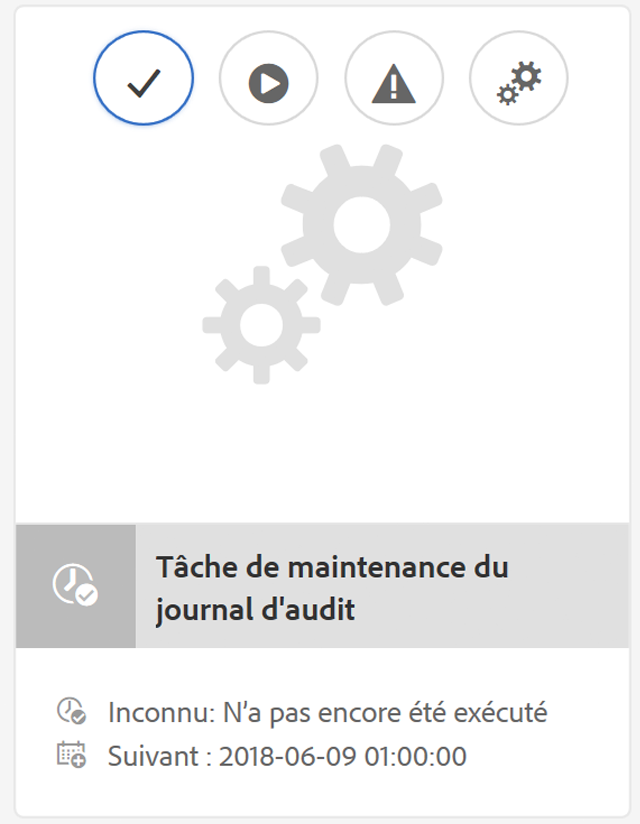

# Maintenance du journal d’audit dans AEM 6{#audit-log-maintenance-in-aem}

Les événements AEM pouvant être inclus dans la journalisation d’audit génèrent une grande quantité de données archivées. Ces données peuvent rapidement s’agrandir au fil du temps en raison des réplications, des téléchargements de ressources et autres activités du système.

La maintenance du journal d’audit comprend plusieurs fonctionnalités qui permettent d’automatiser la maintenance du journal d’audit dans le cadre de stratégies spécifiques.

Elle est mise en œuvre comme une tâche de maintenance hebdomadaire configurable et est accessible par le biais de la console de surveillance du tableau de bord des opérations.

Pour en savoir plus, consultez la [documentation du tableau de bord des opérations](/help/sites-administering/operations-dashboard.md).

Il existe trois types de purge du journal d’audit :

1. [Purge du journal d’audit de page](/help/sites-administering/operations-audit-log.md#configure-page-audit-log-purging)
1. [Purge du journal d’audit de la gestion des actifs numériques](/help/sites-administering/operations-audit-log.md#configure-dam-audit-log-purging)
1. [Purge du journal d’audit de réplication](/help/sites-administering/operations-audit-log.md#configure-replication-audit-log-purging)

Vous pouvez configurer chacune de ces options en créant des règles dans la console web AEM. Une fois configurées, vous pouvez les utiliser en accédant à **Outils - Opérations - Maintenance - Période de maintenance hebdomadaire** et en exécutant la **Tâche de maintenance du journal d’audit**.

## Configuration de la purge du journal d’audit de page {#configure-page-audit-log-purging}

Suivez ces étapes pour configurer la purge du journal d’audit :

1. Accédez à l&#39;administrateur de la console Web en pointant votre navigateur vers `http://localhost:4502/system/console/configMgr/`

1. Recherchez un élément nommé **Règle de purge du journal d&#39;audit des pages** et cliquez dessus.

   

1. Ensuite, configurez le planificateur de purge en fonction de vos besoins. Les options disponibles sont les suivantes :

   * **Nom de la règle :** nom de la règle de stratégie d’audit.
   * **Chemin d’accès au contenu :** chemin d’accès au contenu auquel la règle s’appliquera.
   * **Âge minimum :** nombre de jours pendant lesquels les journaux d’audit doivent être conservés.
   * **Type de journal d’audit :** type de journal d’audit à purger.

   >[!NOTE]
   >
   >Le chemin d’accès au contenu s’applique uniquement aux enfants du noeud `/var/audit/com.day.cq.wcm.core.page` dans le référentiel.

1. Enregistrez la règle.
1. La règle que vous venez de créer doit être exposée dans le tableau de bord des opérations afin d’être exécutée. Pour ce faire, accédez à **Outils - Opérations - Maintenance** dans l’écran de bienvenue d’AEM.

1. Appuyez sur la carte **Période de maintenance hebdomadaire**.

1. Vous trouverez la tâche de maintenance déjà présente sous la carte **AuditLog Maintenance Tâche**.

   

1. Vous pouvez inspecter la date de la prochaine exécution, configurer la prochaine exécution ou l’exécuter manuellement en appuyant sur le bouton de lecture.

Dans AEM 6.3, si la fenêtre de maintenance planifiée se ferme avant que la tâche de purge du journal d&#39;audit ne puisse se terminer, la tâche s&#39;arrête automatiquement. Elle reprend lorsque commence la période de maintenance suivante.

**Avec AEM 6.5**, vous pouvez arrêter manuellement une Tâche de purge du journal d&#39;audit en cours d&#39;exécution en cliquant sur l&#39; **** icône Stopicon. La tâche reprendra sans risque à la prochaine exécution.

>[!NOTE]
>
>L’arrêt de la tâche de maintenance consiste à suspendre son exécution sans perdre la trace de la tâche déjà en cours.

## Configuration de la purge du journal d’audit de la gestion des actifs numériques {#configure-dam-audit-log-purging}

1. Accédez à System Console à l’adresse *https://&lt;serveraddress>:&lt;serverport>/system/console/configMgr*
1. Recherchez la règle **Purge du journal d’audit de la gestion des actifs numériques** et cliquez sur le résultat.
1. Dans la fenêtre suivante, configurez la règle. Les options disponibles sont les suivantes :

   * **Nom de la règle :** nom de la règle de stratégie d’audit.
   * **Chemin d’accès au contenu :** chemin d’accès au contenu auquel la règle s’appliquera.
   * **Âge minimum :** nombre de jours pendant lesquels les journaux d’audit doivent être conservés.
   * **Types d’événements de journal d’audit de la gestion des actifs numériques :** types d’événements à purger.

1. Cliquez sur **Enregistrer** pour enregistrer votre configuration.

## Configuration de la purge du journal d’audit de réplication  {#configure-replication-audit-log-purging}

1. Accédez à System Console à l’adresse *https://&lt;serveraddress>:&lt;serverport>/system/console/configMgr*
1. Recherchez le **planificateur de purge du journal d’audit de réplication** et cliquez sur le résultat.
1. Dans la fenêtre suivante, configurez la règle. Les options disponibles sont les suivantes :

   * **Nom de la règle :** nom de la règle de stratégie d’audit.
   * **Chemin d’accès au contenu :** chemin d’accès au contenu auquel la règle s’appliquera.
   * **Âge minimum :** nombre de jours pendant lesquels les journaux d’audit doivent être conservés.
   * **Types d’événements de journal d’audit de réplication :** types d’événements à purger.

1. Cliquez sur **Enregistrer** pour enregistrer votre configuration.

