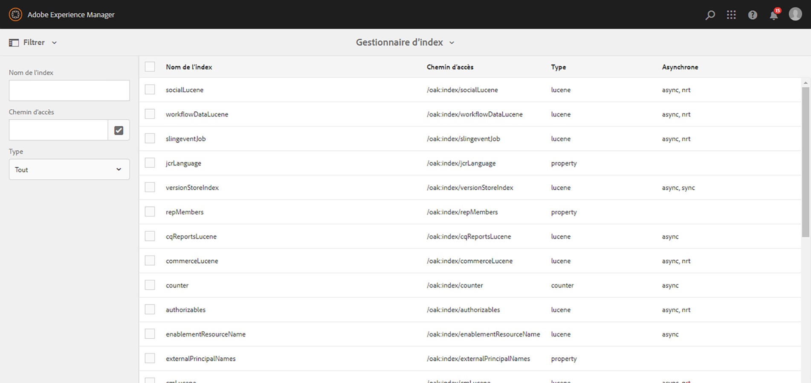

# Tableau de bord des opérations {#operations-dashboard}

## Présentation {#introduction}

Dans AEM 6, le tableau de bord des opérations permet aux opérateurs système de surveiller d’un simple coup d’œil l’intégrité du système AEM. Il contient également des informations de diagnostic générées automatiquement concernant des aspects pertinents d’AEM et permet de configurer et d’exécuter une automatisation de maintenance autonome afin de réduire de façon significative les coûts de fonctionnement du projet et les dossiers de support. Le tableau de bord des opérations peut être étendu en y intégrant des contrôles de l’intégrité et des tâches de maintenance personnalisés. De plus, les données du tableau de bord des opérations sont accessibles à partir d’outils de surveillance externes via JMX.

**Le tableau de bord des opérations :**

* est un état système en un clic visant à aider les services d’opérations à gagner en efficacité ;
* fournit une vue d’ensemble des contrôles de l’intégrité du système à un emplacement centralisé unique ;
* réduit le temps consacré à la recherche, à l’analyse et à la résolution des problèmes :
* automatise la maintenance autonome, qui permet de réduire considérablement les coûts d’exploitation du projet.

Il est accessible en sélectionnant **Outils** – **Opérations** dans l’écran d’accueil d’AEM.

>[!NOTE]
>
>Pour accéder au tableau de bord des opérations, l’utilisateur ou l’utilisatrice connectée doit faire partie du groupe « Opérateurs/opératrices ». Pour plus d’informations, consultez la documentation relative à l’[Administration des utilisateurs/utilisatrices, des groupes et des droits d’accès](/help/sites-administering/user-group-ac-admin.md).

## Rapports d’intégrité {#health-reports}

Le système de rapports d’intégrité fournit des informations sur l’intégrité d’une instance AEM par le biais de contrôles d’intégrité Sling. Pour effectuer cette opération, vous devez utiliser les requêtes OSGI, JMX, HTTP (au moyen de JSON) ou procéder via l’interface utilisateur tactile. Il propose des mesures et un seuil de certains compteurs configurables. Il peut également fournir des informations sur la façon de résoudre le problème.

Il comporte différentes fonctionnalités, décrites ci-dessous.

## Contrôles d’intégrité {#health-checks}

Les **rapports d’intégrité** sont un système de cartes indiquant une intégrité satisfaisante ou non en ce qui concerne une zone spécifique du produit. Ces cartes sont des visualisations des contrôles d’intégrité Sling, qui agrègent les données de JMX et d’autres sources, et présentent de nouveau les informations traitées sous forme de MBeans. Ces MBeans peuvent également être inspectés dans la [Console web JMX](/help/sites-administering/jmx-console.md), dans le domaine **org.apache.sling.healthcheck**.

Les rapports d’intégrité sont accessibles en sélectionnant le menu **Outils** – **Opérations** – **Rapports d’intégrité** dans l’écran d’accueil d’AEM ou directement par le biais de l’adresse URL suivante :

`https://<serveraddress>:port/libs/granite/operations/content/healthreports/healthreportlist.html`


Le système de cartes comporte trois statuts possibles : **OK**, **AVERTISSEMENT** et **CRITIQUE**. Les statuts sont le résultat des règles et des seuils, qui peuvent être configurés en passant le curseur de la souris sur la carte, puis en cliquant sur l’icône d’engrenage de la barre d’actions :


### Types de contrôles d’intégrité {#health-check-types}

Dans AEM 6, il existe deux types de contrôles d’intégrité :

1. Contrôles d’intégrité individuels
1. Contrôles d’intégrité composites

Un **contrôle de l’intégrité individuel** est un contrôle de l’intégrité unique, qui correspond à une carte d’état. Des contrôles de l’intégrité individuels peuvent être configurés avec des règles ou des seuils et peuvent fournir un ou plusieurs conseils et liens pour résoudre des problèmes d’intégrité identifiés. Prenons le contrôle « Erreurs de journal » comme exemple : s’il existe des entrées ERREUR dans les journaux des instances, elles seront répertoriées dans la page Détails du contrôle d’intégrité. En haut de la page, un lien vers l’analyseur Message du journal s’affiche dans la section Outils de diagnostic, qui vous permet d’analyser plus en détail ces erreurs et de reconfigurer les enregistreurs.

Un **contrôle d’intégrité composite** désigne une vérification qui agrège les informations de plusieurs contrôles individuels.

Les contrôles de l’intégrité composites sont configurés à l’aide de **balises de filtrage**. En substance, tous les contrôles individuels possédant la même balise de filtrage sont regroupés en un contrôle d’intégrité composite. Le statut d’un contrôle d’intégrité composite est « OK » seulement si le statut de tous les contrôles individuels l’est aussi.

### Procédure de création de contrôles d’intégrité {#how-to-create-health-checks}

Dans le tableau de bord des opérations, vous pouvez visualiser le résultat des contrôles d’intégrité individuels et composites.

### Création d’un contrôle d’intégrité individuel {#creating-an-individual-health-check}

La création d’un contrôle d’intégrité individuel se compose de deux étapes : implémentation d’un contrôle d’intégrité Sling et ajout d’une entrée pour le contrôle d’intégrité dans les nœuds de configuration du tableau de bord.

1. Pour créer un contrôle d’intégrité Sling, créez un composant OSGI qui implémente l’interface de contrôle d’intégrité Sling. Ajoutez ce composant dans un lot. Les propriétés du composant identifient entièrement le contrôle d’intégrité. Une fois le composant installé, un MBean JMX est automatiquement créé pour le contrôle d’intégrité. Voir la [documentation du contrôle d’intégrité Sling](https://sling.apache.org/documentation/bundles/sling-health-check-tool.html) pour plus d’informations.

    Exemple de composant de contrôle de l’intégrité Sling, écrit avec des annotations de composant de service OSGi :

   ```java
   @Component(service = HealthCheck.class,
   property = {
       HealthCheck.NAME + "=Example Check",
       HealthCheck.TAGS + "=example",
       HealthCheck.TAGS + "=test",
       HealthCheck.MBEAN_NAME + "=exampleHealthCheckMBean"
   })
    public class ExampleHealthCheck implements HealthCheck {
       @Override
       public Result execute() {
           // health check code
       }
    }
   ```

   >[!NOTE]
   >
   >La propriété `MBEAN_NAME` définit le nom du MBean généré pour ce contrôle d’intégrité.

1. Après avoir créé un contrôle d’intégrité, un nouveau nœud de configuration doit être créé afin de le mettre à disposition dans l’interface du tableau de bord des opérations. Pour cette étape, il est nécessaire de connaître le nom du MBean JMX du contrôle d’intégrité (la propriété `MBEAN_NAME`). Pour créer une configuration pour le contrôle d’intégrité, ouvrez CRXDE et ajoutez un nœud (de type **nt:unstructured**) sous le chemin d’accès suivant : `/apps/settings/granite/operations/hc`.

   Les propriétés ci-dessous doivent être définies sur le nouveau nœud :

   * **Nom :** `sling:resourceType`

      * **Type :** `String`
      * **Valeur :** `granite/operations/components/mbean`

   * **Nom :** `resource`

      * **Type :** `String`
      * **Valeur :** `/system/sling/monitoring/mbeans/org/apache/sling/healthcheck/HealthCheck/exampleHealthCheck`

   >[!NOTE]
   >
   >Le chemin d’accès à la ressource ci-dessus est créé comme suit : si le nom du MBean du contrôle de l’intégrité est « test », ajoutez « test » à la fin du chemin d’accès `/system/sling/monitoring/mbeans/org/apache/sling/healthcheck/HealthCheck`.
   >
   >Le chemin d’accès final est le suivant :
   >
   >`/system/sling/monitoring/mbeans/org/apache/sling/healthcheck/HealthCheck/test`

   >[!NOTE]
   >
   >Assurez-vous que les propriétés ci-dessous du chemin d’accès `/apps/settings/granite/operations/hc` sont définies sur true :
   >
   >
   >`sling:configCollectionInherit`
   >
   >`sling:configPropertyInherit`
   >
   >
   >Ce processus indique au gestionnaire de configuration de fusionner les nouvelles configurations avec les configurations existantes de `/libs`.

### Création d’un contrôle d’intégrité composite {#creating-a-composite-health-check}

Un contrôle d’intégrité composite vise à agréger différents contrôles d’intégrité individuels partageant un ensemble de fonctionnalités communes. Par exemple, un contrôle d’intégrité composite de sécurité regroupe tous les contrôles d’intégrité individuels liés à la sécurité. Pour créer un contrôle composite, la première étape consiste à ajouter une nouvelle configuration OSGi. Pour qu’il s’affiche dans le tableau de bord des opérations, un nouveau nœud de configuration doit être ajouté de la même manière qu’un contrôle simple.

1. Accédez au gestionnaire de configuration web dans la console OSGi. Accédez à l’adresse `https://serveraddress:port/system/console/configMgr`
1. Recherchez l’entrée **Apache Sling Composite Health Check**. Une fois que vous l’avez trouvé, deux configurations sont déjà disponibles : une pour les contrôles du système et une autre pour les contrôles de sécurité.
1. Créez une configuration en appuyant sur le bouton « + » dans la partie droite de la configuration. Une nouvelle fenêtre s’affiche, comme illustré ci-dessous :

   

1. Créez une configuration et enregistrez-la. Un MBean est créé avec la nouvelle configuration.

   L’objectif de chaque propriété de configuration est le suivant :

   * **Nom (hc.name) :** nom du contrôle de l’intégrité composite. Un nom significatif est recommandé.
   * **Balises (hc.tags) :** balises de ce contrôle de l’intégrité. Si ce contrôle d’intégrité composite est destiné à faire partie d’un autre contrôle d’intégrité composite (dans une hiérarchie de contrôles d’intégrité, par exemple), ajoutez les balises auxquelles ce contrôle composite est associé.
   * **Nom du MBean (hc.mbean.name) :** nom du MBean fourni au MBean JMX de ce contrôle d’intégrité composite.
   * **Balises de filtrage (filter.tags) :** propriété spécifique aux contrôles d’intégrité composites. Ces balises sont agrégées par le composite. Le contrôle d’intégrité composite agrège, sous son groupe, tous les contrôles d’intégrité possédant une balise correspondant aux balises de filtrage de ce composite. Par exemple, un contrôle d’intégrité composite possédant les balises de filtrage **test** et **contrôle** agrège tous les contrôles d’intégrité individuels et composites possédant la balise **test** ou **contrôle** dans leur propriété de balise (`hc.tags`).

   >[!NOTE]
   >
   >Un nouveau MBean JMX est créé pour chaque nouvelle configuration du contrôle de l’intégrité composite Apache Sling.**

1. Enfin, l’entrée du contrôle d’intégrité composite qui vient d’être créé doit être ajoutée aux nœuds de configuration du tableau de bord des opérations. La procédure est identique à celle des contrôles d’intégrité individuels : un nœud de type **nt:unstructured** doit être créé sous `/apps/settings/granite/operations/hc`. La propriété de ressource du nœud est définie par la valeur de **hc.mean.name** dans la configuration OSGI.

   Par exemple, si vous avez créé une configuration et défini la valeur de **hc.mbean.name** sur **diskusage**, les nœuds de configuration ressemblent à ce qui suit :

   * **Nom :** `Composite Health Check`

      * **Type :** `nt:unstructured`

   Avec les propriétés suivantes :

   * **Nom :** `sling:resourceType`

      * **Type :** `String`
      * **Valeur :** `granite/operations/components/mbean`

   * **Nom :** `resource`

      * **Type :** `String`
      * **Valeur :** `/system/sling/monitoring/mbeans/org/apache/sling/healthcheck/HealthCheck/diskusage`

   >[!NOTE]
   >
   >Si vous créez des contrôles d’intégrité individuels, qui relèvent logiquement d’un contrôle composite déjà présent dans le tableau de bord par défaut, ils sont automatiquement enregistrés et regroupés sous le contrôle composite correspondant. Il n’est donc pas nécessaire de créer un nœud de configuration pour ces contrôles.
   >
   >Par exemple, si vous créez un contrôle d’intégrité de sécurité individuel, attribuez-lui l’étiquette « **sécurité** » pour l’enregistrer automatiquement dans l’emplacement correspondant. Il apparaît automatiquement sous le contrôle composite Contrôles de sécurité dans le tableau de bord des opérations.

### Contrôles de l’intégrité fournis avec AEM {#health-checks-provided-with-aem}

<table>
 <tbody>
  <tr>
   <td><strong>Nom du contrôle de l’intégrité</strong></td>
   <td><strong>Description</strong></td>
  </tr>
  <tr>
   <td>Performances des requêtes</td>
   <td><p>Ce contrôle d’intégrité a été simplifié <strong>dans AEM 6.4</strong> et contrôle maintenant le MBean <code>Oak QueryStats</code> restructuré dernièrement, plus particulièrement l’attribut <code>SlowQueries </code>. Si les statistiques contiennent des requêtes lentes, le contrôle de l’intégrité renvoie un avertissement. Dans le cas contraire, il renvoie le statut OK.<br /> </p> <p>Le MBean de ce contrôle de l’intégrité est <a href="http://localhost:4502/system/console/jmx/org.apache.sling.healthcheck%3Aname%3DqueriesStatus%2Ctype%3DHealthCheck">org.apache.sling.healthcheck:name=queriesStatus,type=HealthCheck</a>.</p> </td>
  </tr>
  <tr>
   <td>Longueur de la file d’attente d’observation</td>
   <td><p>La longueur de la file d’attente d’observation effectue une itération sur tous les programmes d’écoute d’événement et les observateurs en arrière-plan, compare la valeur <code>queueSize </code> à leur valeur <code>maxQueueSize</code> et :</p>
    <ul>
     <li>renvoie le statut « Critique » si la valeur <code>queueSize</code> dépasse la valeur <code>maxQueueSize</code> (c’est-à-dire lorsque des événements seraient supprimés) ;</li>
     <li>renvoie le statut « Avertissement » si la valeur <code>queueSize</code> dépasse la valeur <code>maxQueueSize * WARN_THRESHOLD</code> (la valeur par défaut est 0,75). </li>
    </ul> <p>La longueur maximale de chaque file d’attente provient de configurations distinctes (Oak et AEM) et n’est pas configurable à partir de ce contrôle de l’intégrité. Le MBean pour ce contrôle de l’intégrité est <a href="http://localhost:4502/system/console/jmx/org.apache.sling.healthcheck%3Aname%3DObservationQueueLengthHealthCheck%2Ctype%3DHealthCheck">org.apache.sling.healthcheck:name=ObservationQueueLengthHealthCheck,type=HealthCheck</a>.</p> </td>
  </tr>
  <tr>
   <td>Limites de requête transversales</td>
   <td><p>Le contrôle Limites de requête transversales contrôle le MBean <code>QueryEngineSettings</code>, plus particulièrement les attributs <code>LimitInMemory</code> et <code>LimitReads</code> et renvoie le statut suivant :</p>
    <ul>
     <li>« Avertissement » si l’une des limites est égale ou supérieure à  <code>Integer.MAX_VALUE</code></li>
     <li>« Avertissement » si l’une des limites est inférieure à 10 000 (paramètre recommandé d’Oak)</li>
     <li>« Critique » si la valeur <code>QueryEngineSettings</code> ou l’une des limites ne peut pas être extraite.</li>
    </ul> <p>Le MBean pour ce contrôle de l’intégrité est <a href="http://localhost:4502/system/console/jmx/org.apache.sling.healthcheck%3Aname%3DqueryTraversalLimitsBundle%2Ctype%3DHealthCheck">org.apache.sling.healthcheck:name=queryTraversalLimitsBundle,type=HealthCheck</a>.</p> </td>
  </tr>
  <tr>
   <td>Horloges synchronisées</td>
   <td><p>Ce contrôle est pertinent uniquement pour les <a href="https://github.com/apache/sling-old-svn-mirror/blob/4df9ab2d6592422889c71fa13afd453a10a5a626/bundles/extensions/discovery/oak/src/main/java/org/apache/sling/discovery/oak/SynchronizedClocksHealthCheck.java">clusters d’entrepôt de nœuds de documents</a>. Il renvoie le statut suivant :</p>
    <ul>
     <li>renvoie le statut Avertissement lorsque les horloges de l’instance ne sont pas synchronisées et dépassent un seuil bas prédéfini.</li>
     <li>renvoie le statut Critique lorsque les horloges de l’instance ne sont pas synchronisées et dépassent un seuil élevé prédéfini.</li>
    </ul> <p>Le MBean de ce contrôle de l’intégrité est <a href="http://localhost:4502/system/console/jmx/org.apache.sling.healthcheck%3Aname%3DslingDiscoveryOakSynchronizedClocks%2Ctype%3DHealthCheck">org.apache.sling.healthcheck:name=slingDiscoveryOakSynchronizedClocks,type=HealthCheck</a>.</p> </td>
  </tr>
  <tr>
   <td>Index asynchrones</td>
   <td><p>La vérification des index asynchrones :</p>
    <ul>
     <li>renvoie le statut « Critique » si au moins une piste d’indexation échoue.</li>
     <li>vérifie la valeur <code>lastIndexedTime</code> pour toutes les pistes d’indexation et :
      <ul>
       <li>renvoie le statut « Critique » si cela remonte à plus de 2 heures ; </li>
       <li>renvoie le statut « Avertissement » si le délai est compris entre 2 heures et 45 minutes ; </li>
       <li>renvoie le statut « OK » si cela remonte à moins de 45 minutes ; </li>
      </ul> </li>
     <li>si aucune de ces conditions n’est remplie, renvoie « OK ».</li>
    </ul> <p>Les seuils des états Critique et Avertissement sont configurables. Le MBean pour ce contrôle de l’intégrité est <a href="http://localhost:4502/system/console/jmx/org.apache.sling.healthcheck%3Aname%3DasyncIndexHealthCheck%2Ctype%3DHealthCheck">org.apache.sling.healthcheck:name=asyncIndexHealthCheck,type=HealthCheck</a>.</p> <p><strong>Remarque :</strong> Ce contrôle de l’intégrité est disponible avec AEM 6.4 et a été rétroporté dans AEM 6.3.0.1.</p> </td>
  </tr>
  <tr>
   <td>Index Lucene volumineux</td>
   <td><p>Ce contrôle utilise les données exposées par le MBean <code>Lucene Index Statistics</code> afin d’identifier des index volumineux et renvoie :</p>
    <ul>
     <li>un état Avertissement s’il existe un index comportant plus d’un milliard de documents ;</li>
     <li>un état Critique s’il existe un index comportant plus de 1,5 milliard de documents.</li>
    </ul> <p>Les seuils sont configurables et le MBean du contrôle de l’intégrité est <a href="http://localhost:4502/system/console/jmx/org.apache.sling.healthcheck%3Aname%3DlargeIndexHealthCheck%2Ctype%3DHealthCheck">org.apache.sling.healthcheck:name=largeIndexHealthCheck,type=HealthCheck</a>.</p> <p><strong>Remarque :</strong> ce contrôle est disponible avec AEM 6.4 et a été rétroporté dans AEM 6.3.2.0.</p> </td>
  </tr>
  <tr>
   <td>Maintenance du système</td>
   <td><p>La maintenance du système est un contrôle composite, qui renvoie l’état « OK » si toutes les tâches de maintenance sont exécutées selon la configuration. Gardez à l’esprit que :</p>
    <ul>
     <li>chaque tâche de maintenance est accompagnée d’un contrôle de l’intégrité associé ;</li>
     <li>si une tâche n’est pas ajoutée à une fenêtre de maintenance, son contrôle d’intégrité renvoie « Critique » ;</li>
     <li>vous devez configurer les tâches de maintenance du journal d’audit et de purge des workflows ou les supprimer des fenêtres de maintenance. Si elles ne sont pas configurées, ces tâches échouent lors de la première tentative d’exécution. Le contrôle de maintenance du système renvoie donc l’état « Critique ».</li>
     <li><strong>Avec AEM 6.4</strong>, il existe également un contrôle pour la tâche <a href="/help/sites-administering/operations-dashboard.md#automated-maintenance-tasks">Maintenance des fichiers binaires Lucene</a>.</li>
     <li>Dans AEM 6.2 et version inférieure, le contrôle de la maintenance système renvoie un état « Avertissement » après le démarrage, car les tâches ne sont jamais exécutées. À partir de la version 6.3, il renvoie « OK » si la première fenêtre de maintenance n’a pas encore été atteinte.</li>
    </ul> <p>Le MBean de ce contrôle de l’intégrité est <a href="http://localhost:4502/system/console/jmx/org.apache.sling.healthcheck%3Aname%3Dsystemchecks%2Ctype%3DHealthCheck">org.apache.sling.healthcheck:name=systemchecks,type=HealthCheck</a>.</p> </td>
  </tr>
  <tr>
   <td>File d’attente de réplication</td>
   <td><p>Ce contrôle effectue une itération sur les agents de réplication et examine leurs files d’attente. Pour l’élément en haut de la file d’attente, le contrôle examine le nombre de fois où l’agent a tenté une réplication. Si l’agent a tenté une réplication plus de fois que défini par la valeur du paramètre <code>numberOfRetriesAllowed</code>, il renvoie un avertissement. Le paramètre <code>numberOfRetriesAllowed</code> est configurable. </p> <p>Le MBean de ce contrôle de l’intégrité est <a href="http://localhost:4502/system/console/jmx/org.apache.sling.healthcheck%3Aname%3DreplicationQueue%2Ctype%3DHealthCheck" target="_blank">org.apache.sling.healthcheck:name=replicationQueue,type=HealthCheck</a>.</p> </td>
  </tr>
  <tr>
   <td>Tâches Sling</td>
   <td>
    <div>
      Le contrôle Tâches Sling vérifie le nombre de tâches dans la file d’attente du gestionnaire de tâches, le compare au seuil <code>maxNumQueueJobs</code> et :
    </div>
    <ul>
     <li>renvoie le statut « Critique » si la file d’attente comporte plus de tâches que ne le définit la valeur <code>maxNumQueueJobs</code> ;</li>
     <li>renvoie le statut « Critique » s’il existe des tâches actives de longue durée de plus d’une heure ;</li>
     <li>renvoie le statut « Critique » s’il existe des tâches en file d’attente et que la dernière tâche terminée a plus d’une heure.</li>
    </ul> <p>Seul le nombre maximal de tâches en file d’attente est configurable et sa valeur par défaut est 1 000.</p> <p>Le MBean de ce contrôle de l’intégrité est <a href="http://localhost:4502/system/console/jmx/org.apache.sling.healthcheck%3Aname%3DslingJobs%2Ctype%3DHealthCheck" target="_blank">org.apache.sling.healthcheck:name=slingJobs,type=HealthCheck</a>.</p> </td>
  </tr>
  <tr>
   <td>Performances des requêtes</td>
   <td><p>Ce contrôle cherche l’<a href="http://localhost:4502/system/console/slingmetrics" target="_blank">indicateur Sling</a> <code>granite.request.metrics.timer</code> et :</p>
    <ul>
     <li>renvoie le statut « Critique » si la valeur du 75e percentile est supérieure au seuil critique (la valeur par défaut est de 500 millisecondes) ;</li>
     <li>renvoie le statut « Avertissement » si la valeur du 75e percentile est supérieure au seuil d’avertissement (la valeur par défaut est de 200 millisecondes).</li>
    </ul> <p>Le MBean de ce contrôle de l’intégrité est<em> </em><a href="http://localhost:4502/system/console/jmx/org.apache.sling.healthcheck%3Aname%3DrequestsStatus%2Ctype%3DHealthCheck" target="_blank">org.apache.sling.healthcheck:name=requestsStatus,type=HealthCheck</a>.</p> </td>
  </tr>
  <tr>
   <td>Erreurs de journal</td>
   <td><p>Ce contrôle renvoie l’état « Avertissement » en cas d’erreur dans le journal.</p> <p>Le MBean de ce contrôle de l’intégrité est <a href="http://localhost:4502/system/console/jmx/org.apache.sling.healthcheck%3Aname%3DlogErrorHealthCheck%2Ctype%3DHealthCheck" target="_blank">org.apache.sling.healthcheck:name=logErrorHealthCheck,type=HealthCheck</a>.</p> </td>
  </tr>
  <tr>
   <td>Espace disque</td>
   <td><p>Le contrôle Espace disque observe le MBean <code>FileStoreStats</code>, extrait la taille de l’entrepôt de nœuds et la quantité d’espace disque utilisable sur la partition Entrepôt de nœuds, puis :</p>
    <ul>
     <li>renvoie le statut « Avertissement » si le rapport espace disque utilisable/taille du référentiel est inférieur au seuil d’avertissement (la valeur par défaut est 10) ;</li>
     <li>renvoie le statut « Critique » si le rapport espace disque utilisable/taille du référentiel est inférieur au seuil critique (la valeur par défaut est 2).</li>
    </ul> <p>Les deux seuils sont configurables. Le contrôle fonctionne uniquement sur les instances comportant un entrepôt de segments.</p> <p>Le MBean de ce contrôle de l’intégrité est <a href="http://localhost:4502/system/console/jmx/org.apache.sling.healthcheck%3Aname%3DDiskSpaceHealthCheck%2Ctype%3DHealthCheck" target="_blank">org.apache.sling.healthcheck:name=DiskSpaceHealthCheck,type=HealthCheck</a>.</p> </td>
  </tr>
  <tr>
   <td>Contrôle d’intégrité de l’outil de planification</td>
   <td><p>Ce contrôle renvoie un avertissement si l’instance possède des tâches Quartz en cours d’exécution depuis plus de 60 secondes. Le seuil de durée acceptable peut être configuré.</p> <p>Le MBean de ce contrôle de l’intégrité est <a href="http://localhost:4502/system/console/jmx/org.apache.sling.healthcheck%3Aname%3DslingCommonsSchedulerHealthCheck%2Ctype%3DHealthCheck" target="_blank">org.apache.sling.healthcheck:name=slingCommonsSchedulerHealthCheck,type=HealthCheck</a><em>.</em></p> </td>
  </tr>
  <tr>
   <td>Contrôles de sécurité</td>
   <td><p>Le contrôle de sécurité est un contrôle composite, qui agrège les résultats de différents contrôles liés à la sécurité. Chacun de ces contrôles d’intégrité prennent en compte différentes préoccupations de la liste de contrôle de sécurité, disponibles dans la page de documentation <a href="/help/sites-administering/security-checklist.md">Liste de contrôle de sécurité.</a> Ils sont utiles comme test de vérification de la sécurité lorsque l’instance est démarrée. </p> <p>Le MBean de ce contrôle de l’intégrité est <a href="http://localhost:4502/system/console/jmx/org.apache.sling.healthcheck%3Aname%3Dsecuritychecks%2Ctype%3DHealthCheck" target="_blank">org.apache.sling.healthcheck:name=securitychecks,type=HealthCheck</a>.</p> </td>
  </tr>
  <tr>
   <td>Lots actifs</td>
   <td><p>Lots actifs vérifie l’état de tous les lots et :</p>
    <ul>
     <li>renvoie l’état Avertissement si l’un des lots n’est pas actif ou (en commençant par l’activation différée)</li>
     <li>il ignore l’état des lots dans la liste d’exclusion.</li>
    </ul> <p>Le paramètre de liste d’exclusion est configurable.</p> <p>Le MBean de ce contrôle de l’intégrité est <a href="http://localhost:4502/system/console/jmx/org.apache.sling.healthcheck%3Aname%3DinactiveBundles%2Ctype%3DHealthCheck" target="_blank">org.apache.sling.healthcheck:name=inactiveBundles,type=HealthCheck</a>.</p> </td>
  </tr>
  <tr>
   <td>Contrôle de la mémoire cache du code</td>
   <td><p>Un contrôle d’intégrité qui vérifie plusieurs conditions JVM pouvant déclencher un bug CodeCache présent dans Java™ 7 :</p>
    <ul>
     <li>renvoie le statut « Avertissement » si l’instance est en cours d’exécution sur Java™ 7, avec la purge du cache de code activée ;</li>
     <li>renvoie le statut « Avertissement » si l’instance est en cours d’exécution sur Java™ 7 et que la taille du cache du code réservé est inférieure à un seuil minimum (la valeur par défaut est 90 Mo).</li>
    </ul> <p>Le seuil <code>minimum.code.cache.size</code> est configurable. Pour plus d’informations sur le bug, consultez <a href="https://bugs.java.com/bugdatabase/">, puis recherchez l’ID de bug 8012547</a>.</p> <p>Le MBean de ce contrôle d’intégrité est <a href="http://localhost:4502/system/console/jmx/org.apache.sling.healthcheck%3Aname%3DcodeCacheHealthCheck%2Ctype%3DHealthCheck" target="_blank">org.apache.sling.healthcheck:name=codeCacheHealthCheck,type=HealthCheck</a>.</p> </td>
  </tr>
  <tr>
   <td>Erreurs de chemin de recherche des ressources</td>
   <td><p>Vérifie s’il existe des ressources dans le chemin d’accès <code>/apps/foundation/components/primary</code> et :</p>
    <ul>
     <li>renvoie le statut « Avertissement » s’il y a des nœuds enfants en dessous. <code>/apps/foundation/components/primary</code></li>
    </ul> <p>Le MBean de ce contrôle d’intégrité est <a href="http://localhost:4502/system/console/jmx/org.apache.sling.healthcheck%3Aname%3DresourceSearchPathErrorHealthCheck%2Ctype%3DHealthCheck" target="_blank">org.apache.sling.healthcheck:name=resourceSearchPathErrorHealthCheck,type=HealthCheck</a>.</p> </td>
  </tr>
 </tbody>
</table>

### Configuration du contrôle de l’intégrité {#health-check-configuration}

Par défaut, pour une instance AEM prête à l’emploi, les contrôles d’intégrité s’exécutent toutes les 60 secondes.

Vous pouvez configurer la **Période** avec la **Configuration du contrôle de l’intégrité des requêtes** de la [Configuration OSGi](/help/sites-deploying/configuring-osgi.md) (com.adobe.granite.queries.impl.hc.QueryHealthCheckMetrics).

## Surveillance avec Nagios {#monitoring-with-nagios}

Le tableau de bord des contrôles de l’intégrité peut être intégré à Nagios par le biais des MBeans JMX Granite. L’exemple ci-dessous indique comment ajouter un contrôle qui affiche la mémoire utilisée sur le serveur qui exécute AEM.

1. Configurez et installez Nagios sur le serveur de surveillance.
1. Installez ensuite Nagios Remote Plugin Executor (NRPE).

   >[!NOTE]
   >
   >Pour plus d’informations sur l’installation de Nagios et NRPE sur votre système, consultez la [documentation Nagios](https://library.nagios.com/library/products/nagios-core/manuals//).

1. Ajoutez une définition de l’hôte pour le serveur AEM. Vous pouvez accomplir cette tâche via l’interface web de Nagios XI à l’aide de Configuration Manager :

   1. Ouvrez un navigateur et pointez vers le serveur Nagios.
   1. Appuyez sur le bouton **Configure** dans le menu supérieur.
   1. Dans le volet de gauche, appuyez sur **Gestionnaire de configuration principale** sous **Configuration avancée**.
   1. Cliquez sur le lien **Hôtes** sous la section **Surveillance**.
   1. Ajoutez la définition de l’hôte :

   

   Voici un exemple de fichier de configuration de l’hôte si vous utilisez Nagios Core :

   ```xml
   define host {
      address 192.168.0.5
      max_check_attempts 3
      check_period 24x7
      check-command check-host-alive
      contacts admin
      notification_interval 60
      notification_period 24x7
   }
   ```

1. Installez Nagios et NRPE sur le serveur AEM.
1. Installez le module [check_http_json](https://github.com/phrawzty/check_http_json) sur les deux serveurs.
1. Définissez une commande de contrôle JSON générique sur les deux serveurs :

   ```xml
   define command{
   
       command_name    check_http_json-int
   
       command_line    /usr/lib/nagios/plugins/check_http_json --user "$ARG1$" --pass "$ARG2$" -u 'https://$HOSTNAME$:$ARG3$/$ARG4$' -e '$ARG5$' -w '$ARG6$' -c '$ARG7$'
   
   }
   ```

1. Ajoutez un service pour la mémoire utilisée sur le serveur AEM :

   ```xml
   define service {
   
       use generic-service
   
       host_name my.remote.host
   
       service_description AEM Author Used Memory
   
       check_command  check_http_json-int!<cq-user>!<cq-password>!<cq-port>!system/sling/monitoring/mbeans/java/lang/Memory.infinity.json!{noname}.mbean:attributes.HeapMemoryUsage.mbean:attributes.used.mbean:value!<warn-threshold-in-bytes>!<critical-threshold-in-bytes>
   
       }
   ```

1. Reportez-vous au tableau de bord Nagios du service que vous venez de créer :

   

## Outils de diagnostic {#diagnosis-tools}

Le tableau de bord des opérations permet également d’accéder aux outils de diagnostic qui peuvent vous aider à trouver et à résoudre les causes profondes des avertissements provenant du tableau de bord du contrôle d’intégrité et à fournir des informations de débogage importantes aux opérateurs et opératrices système.

Parmi ses principales fonctionnalités figurent :

* Un analyseur de messages de journal
* La possibilité d’accéder aux vidages de tas et de threads
* Requêtes et analyseurs de performances des requêtes

Pour accéder à l’écran Outils de diagnostic, sélectionnez **Outils > Opérations > Diagnostic** dans l’écran d’accueil d’AEM. Vous pouvez également accéder à l’écran en accédant directement à l’URL suivante : `https://serveraddress:port/libs/granite/operations/content/diagnosis.html`.


### Messages du journal {#log-messages}

Par défaut, l’interface utilisateur des messages du journal affiche tous les messages d’ERREUR. Si vous souhaitez afficher davantage de messages de journal, configurez un journal avec le niveau de journal approprié.

Les messages de journal utilisent un appender de journal en mémoire et ne sont donc pas liés aux fichiers journaux. En outre, la modification des niveaux de journal dans cette interface utilisateur ne modifie pas les informations consignées dans les fichiers journaux traditionnels. L’ajout et la suppression d’enregistreurs dans cette interface utilisateur affectent uniquement l’enregistreur dans la mémoire. En outre, la modification des configurations de l’enregistreur se répercutera dans les futures évolutions de l’enregistreur de mémoire. Les entrées déjà enregistrées et qui ne sont plus pertinentes ne sont pas supprimées, mais des entrées similaires ne seront plus enregistrées à l’avenir.

Vous pouvez configurer les éléments journalisés en fournissant des configurations d’enregistreur en cliquant sur l’icône d’engrenage dans la partie supérieure gauche de l’interface utilisateur. Vous pouvez y ajouter, y supprimer ou y mettre à jour des configurations d’enregistreur. Une configuration d’enregistreur se compose d’un **niveau de journal** (AVERTISSEMENT/INFO/DÉBOGAGE) et d’un **nom de filtre**. Le **nom du filtre** est chargé de filtrer la source des messages du journal consignés. Si un enregistreur doit enregistrer tous les messages du journal pour un niveau spécifié, le nom du filtre doit être « **root** ». La définition du niveau d’un enregistreur déclenche la capture de tous les messages dont le niveau est égal ou supérieur à celui spécifié.

Exemples :

* Si vous envisagez d’enregistrer tous les messages **ERREUR**, aucune configuration n’est nécessaire. Tous les messages ERREUR sont capturés par défaut.
* Si vous envisagez de capturer tous les messages **ERREUR**, **AVERTISSEMENT** et **INFOS** : le nom de la journalisation doit être défini sur : **root**, et le niveau de journalisation défini sur : **INFOS**.

* Si vous envisagez de capturer tous les messages provenant d’un certain package (par exemple com.adobe.granite), le nom de l’enregistreur doit être défini sur : « com.adobe.granite ». Et le niveau de l’enregistreur est défini sur : **DEBUG** (ce qui capture tous les messages **ERREUR**, **AVERTISSEMENT**, **INFOS** et **DEBUG**), comme illustré dans l’image ci-dessous.


>[!NOTE]
>
>Vous ne pouvez pas définir un nom d’enregistreur de manière à capturer uniquement les messages ERREUR par le biais d’un filtre spécifié. Par défaut, tous les messages ERREUR sont capturés.

>[!NOTE]
>
>L’interface utilisateur des messages du journal ne reflète pas le journal d’erreurs réel. À moins que vous n’ayez configuré d’autres types de messages du journal dans l’interface utilisateur, seuls les messages ERREUR s’affichent. Pour savoir comment afficher des messages de journal spécifiques, reportez-vous aux instructions ci-dessus.

>[!NOTE]
>
>Les paramètres de la page de diagnostic n’ont aucune incidence sur ce qui est enregistré dans les fichiers journaux et inversement. Ainsi, même si le journal d’erreurs peut capturer des messages INFO, il est possible qu’ils ne s’affichent pas dans l’interface utilisateur des messages du journal. Par ailleurs, par le biais de l’interface utilisateur, il est possible de capturer des messages DÉBOGAGE provenant de certains packages sans que cela affecte le journal des erreurs. Pour plus d’informations sur la configuration des fichiers journaux, consultez la section [Journalisation](/help/sites-deploying/configure-logging.md).

>[!NOTE]
>
>**Dans AEM 6.4**, les tâches de maintenance sont journalisées prêtes à l’emploi dans un format d’information enrichi au niveau INFO. Ce processus permet une meilleure visibilité de l’état des tâches de maintenance.
>
>Si vous utilisez des outils tiers (tels que Splunk) pour surveiller l’activité de maintenance et réagir en fonction des besoins, vous pouvez utiliser les instructions de journal suivantes :

```
Log level: INFO
DATE+TIME [MaintanceLogger] Name=<MT_NAME>, Status=<MT_STATUS>, Time=<MT_TIME>, Error=<MT_ERROR>, Details=<MT_DETAILS>
```

### Performances des requêtes {#request-performance}

La page Performances des demandes permet d’analyser les demandes de page les plus lentes traitées. Seules les requêtes de contenu sont enregistrées sur cette page. Plus précisément, les requêtes suivantes sont capturées :

1. Demandes d’accès aux ressources sous `/content`
1. Demandes d’accès aux ressources sous `/etc/design`
1. Demandes comportant l’extension `".html"`


La page affiche :

* Heure à laquelle la requête a été effectuée.
* L’URL et la méthode de la requête.
* La durée en millisecondes.

Par défaut, les 20 requêtes de page les plus lentes sont capturées, mais la limite peut être modifiée dans Configuration Manager.

### Performance des requêtes {#query-performance}

La page Performance des requêtes permet d’analyser les requêtes les plus lentes exécutées par le système. Ces informations sont fournies par le référentiel dans un MBean JMX. Ces informations sont fournies par le MBean JMX `com.adobe.granite.QueryStat` dans Jackrabbit et par `org.apache.jackrabbit.oak.QueryStats.` dans le référentiel Oak.

La page affiche :

* L’heure à laquelle la requête a été effectuée.
* La langue de la requête.
* Le nombre d’envois de la requête.
* L’énoncé de la requête.
* La durée en millisecondes.


### Expliquer la requête {#explain-query}

Oak tente de déterminer la meilleure façon d’exécuter une requête donnée d’après les index Oak définis dans le référentiel sous le nœud **oak:index**. En fonction de la requête, Oak peut sélectionner différents index. La première étape de l’optimisation de la requête consiste à comprendre comment Oak exécute une requête.

L’outil Expliquer la requête explique la façon dont Oak exécute une requête. Il est accessible en sélectionnant **Outils - Opérations - Diagnostic** sur l’écran d’accueil d’AEM. Cliquez ensuite sur **Performances des requêtes** et passez à l’onglet **Expliquer la requête** .

**Fonctionnalités**

* Prend en charge les langages de requête Xpath, JCR-SQL et JCR-SQL2.
* Indique le temps d’exécution réel de la requête spécifiée.
* Détecte les requêtes lentes et vous avertit au sujet des requêtes pouvant être potentiellement lentes.
* Indique l’index Oak utilisé pour exécuter la requête.
* Affiche l’explication réelle du moteur de requête Oak.
* Fournit une liste de requêtes lentes et courantes à télécharger d’un simple clic.

Une fois que vous êtes dans l’interface utilisateur Expliquer la requête, saisissez la requête, puis appuyez sur le bouton **Expliquer** :


La première entrée de la section Explication de la requête est l’explication réelle. L’explication indique le type d’index utilisé pour exécuter la requête.

La seconde entrée est le plan d’exécution.

En sélectionnant la case à cocher **Inclure la durée d’exécution** avant d’exécuter la requête, vous afficherez également la durée d’exécution de la requête. L’option **Inclure le nombre de nœuds** inclura le nombre de nœuds dans le rapport. Le rapport permet d’obtenir plus d’informations qui peuvent être utilisées afin d’optimiser les index pour votre application ou déploiement.


### Gestionnaire d’index {#the-index-manager}

Le gestionnaire d’index a pour objectif de faciliter la gestion des index, comme la maintenance des index ou l’affichage de leur statut.

Pour y accéder, sélectionnez **Outil - Opérations - Diagnostic** dans l’écran d’accueil, puis cliquez sur le bouton **Gestionnaire d’index**.

Il est également accessible directement à cette adresse : `https://serveraddress:port/libs/granite/operations/content/diagnosistools/indexManager.html`.



L’interface utilisateur peut servir à filtrer les index du tableau en saisissant les critères de filtre dans la zone de recherche située dans le coin supérieur gauche de l’écran.

### Télécharger le fichier compressé d’état {#download-status-zip}

Cette option permet de déclencher le téléchargement d’un fichier compressé contenant des informations utiles sur l’état et la configuration du système. L’archive contient des configurations d’instance, une liste de lots, OSGi, des mesures Sling et des statistiques. Le fichier qui en résulte peut être volumineux. Pour ne pas surcharger votre système de fichiers de statut volumineux, utilisez la fenêtre **Télécharger le fichier de statut au format ZIP**. Pour y accéder, sélectionnez **AEM > Outils > Opérations > Diagnostic > Télécharger le fichier de statut au format ZIP.**

Dans cette fenêtre, vous pouvez sélectionner les éléments à exporter (fichiers journaux et images mémoire de threads) ainsi que le nombre de jours à prendre en compte dans le téléchargement par rapport à la date actuelle.


### Télécharger l’image mémoire des threads {#download-thread-dump}

Cette option déclenche le téléchargement d’un fichier compressé contenant des informations sur les threads présents sur le système. Des informations sur chaque thread sont fournies, telles que son état, le chargeur de classe et la trace d’appels.

### Télécharger l’image mémoire des segments de mémoire {#download-heap-dump}

Vous pouvez télécharger un instantané du tas pour l’analyser ultérieurement. Cette action déclenche le téléchargement d’un fichier volumineux (plusieurs centaines de mégaoctets).

## Tâches de maintenance automatisées {#automated-maintenance-tasks}

Depuis la page Tâches de maintenance automatisées, affichez et suivez les tâches de maintenance recommandées planifiées pour une exécution périodique. Les tâches sont intégrées au système de contrôle de l’intégrité. Les tâches peuvent également être exécutées manuellement à partir de l’interface.

Pour accéder à la page Maintenance du tableau de bord des opérations, dans l’écran d’accueil d’AEM, accédez à **Outils, Opérations, Tableau de bord, Maintenance**, ou suivez directement ce lien :

`https://serveraddress:port/libs/granite/operations/content/maintenance.html`

Les tâches ci-dessous sont disponibles dans le tableau de bord des opérations :

1. Tâche **Nettoyage de la révision** dans le menu **Période de maintenance quotidienne**
1. Tâche **Nettoyage des binaires Lucene** dans le menu **Période de maintenance quotidienne**
1. Tâche **Purge du workflow** dans le menu **Période de maintenance hebdomadaire**
1. Tâche **Nettoyage de la mémoire d’entrepôt de données** dans le menu **Période de maintenance hebdomadaire**
1. Tâche **Maintenance des journaux d’audit** dans le menu **Période de maintenance hebdomadaire**
1. Tâche **Maintenance de la purge des versions** dans le menu **Période de maintenance hebdomadaire**

L’heure par défaut de la maintenance quotidienne est de 2 h à 5 h chaque matin. Les tâches configurées pour s’exécuter dans la fenêtre de maintenance hebdomadaire s’exécutent entre 1 h et 2 h le samedi.

Vous pouvez également configurer les heures en appuyant sur l’icône d’engrenage sur l’une des deux cartes de maintenance :


>[!NOTE]
>
>Depuis AEM 6.1, les fenêtres de maintenance existantes peuvent également être configurées pour s’exécuter tous les mois.

### Nettoyage des révisions {#revision-clean-up}

Pour plus d’informations sur l’exécution du nettoyage des révisions, [consultez cet article dédié](/help/sites-deploying/revision-cleanup.md).

### Nettoyage des binaires Lucene {#lucene-binaries-cleanup}

Utilisez la tâche Nettoyage des binaires Lucene pour purger les fichiers binaires Lucene et réduire la taille nécessaire pour l’exécution de l’entrepôt de données. L’attrition des binaires Lucene est récupérée tous les jours au lieu de dépendre précédemment d’une exécution réussie de la [récupération de l’espace mémoire du magasin de données](/help/sites-administering/data-store-garbage-collection.md).

Bien que la tâche de maintenance ait été développée pour réduire les déchets de révision liés à Lucene, il existe des gains d’efficacité généraux lors de l’exécution de la tâche :

* L’exécution hebdomadaire de la tâche de récupération de l’espace mémoire du magasin de donnée peut se terminer plus rapidement.
* Elle peut également améliorer légèrement les performances générales d’AEM.

Pour accéder à la tâche Nettoyage des binaires Lucene, sélectionnez **AEM > Outils > Opérations > Maintenance > Période de maintenance quotidienne > Nettoyage des binaires Lucene**.

### Récupération de l’espace mémoire du magasin de données {#data-store-garbage-collection}

Pour plus d’informations sur la récupération de l’espace mémoire du magasin de donnée, reportez-vous à la [page de documentation](/help/sites-administering/data-store-garbage-collection.md) dédiée.

### Purge des workflows {#workflow-purge}

Il est possible également de purger les workflows à partir du tableau de bord de maintenance. Pour exécuter la tâche Purge des workflows, procédez comme suit :

1. Cliquez sur la page **Fenêtre de maintenance hebdomadaire**.
1. Dans la page suivante, cliquez sur **Exécuter** dans la vignette **Purge des workflows**.

>[!NOTE]
>
>Pour plus d’informations sur la maintenance des workflows, consultez [cette page](/help/sites-administering/workflows-administering.md#regular-purging-of-workflow-instances).

### Maintenance des journaux d’audit {#audit-log-maintenance}

Pour en savoir plus sur la maintenance des journaux d’audit, consultez cette [page de la documentation](/help/sites-administering/operations-audit-log.md).

### Purge de version {#version-purge}

Vous pouvez planifier la tâche de maintenance Purge de version pour supprimer automatiquement les anciennes versions. Cette action réduit la nécessité d’utiliser manuellement la variable [Outils de purge de version](/help/sites-deploying/version-purging.md). Pour planifier et configurer la tâche Purge des versions, sélectionnez **Outils > Opérations > Maintenance > Fenêtre de maintenance hebdomadaire** et procédez comme suit :

1. Cliquez sur **Ajouter**.
1. Sélectionnez **Purge de version** dans le menu déroulant.

   

1. Pour configurer la tâche Purge des versions, cliquez sur l’icône **engrenage** sur la vignette de maintenance Purge des versions qui vient d’être créée.

   

**Avec AEM 6.4**, vous pouvez arrêter la tâche de maintenance Purge des versions comme suit :

* Automatiquement : si la période de maintenance planifiée se termine avant que la tâche ne puisse se terminer, celle-ci s’arrête automatiquement. Elle reprend lorsque la fenêtre de maintenance suivante s’ouvre.
* Manuellement : pour arrêter manuellement la tâche, sur la carte de maintenance Purge de version, cliquez sur l’icône **Arrêter**. Lors de la prochaine exécution, la tâche reprendra en toute sécurité.

>[!NOTE]
>
>L’arrêt de la tâche de maintenance consiste à suspendre son exécution mais en continuant à effectuer le suivi de la tâche déjà en cours.

>[!CAUTION]
>
>Pour optimiser la taille du référentiel, vous devez exécuter la tâche de purge des versions fréquemment. La tâche doit être planifiée en dehors des heures de bureau lorsqu’il y a un trafic limité.

## Tâches de maintenance personnalisées {#custom-maintenance-tasks}

Les tâches de maintenance personnalisées peuvent être mises en œuvre sous forme de services OSGi. Lorsque l’infrastructure des tâches de maintenance repose sur le traitement des tâches Apache Sling, une tâche de maintenance doit implémenter l’interface Java™ ` [org.apache.sling.event.jobs.consumer.JobExecutor](https://sling.apache.org/apidocs/sling7/org/apache/sling/event/jobs/consumer/JobExecutor.html)`. De plus, pour être détectée comme tâche de maintenance, elle doit déclarer différentes propriétés d’enregistrement de service, comme indiqué ci-dessous :

<table>
 <tbody>
  <tr>
   <td><strong>Nom de la propriété du service</strong><br /> </td>
   <td><strong>Description</strong></td>
   <td><strong>Exemple</strong><br /> </td>
   <td><strong>Type</strong></td>
  </tr>
  <tr>
   <td>granite.maintenance.isStoppable</td>
   <td>Attribut booléen définissant si la tâche peut être arrêtée par l’utilisateur. Si une tâche indique qu’elle peut être arrêtée, elle doit vérifier pendant son exécution si elle a été arrêtée, puis agir en conséquence. La valeur par défaut est false.</td>
   <td>true</td>
   <td>Facultative</td>
  </tr>
  <tr>
   <td>granite.maintenance.mandatory</td>
   <td>Attribut booléen définissant si une tâche est obligatoire et doit être exécutée périodiquement. Si une tâche est obligatoire, mais qu’elle ne se trouve pas actuellement dans une fenêtre de planification active, un contrôle d’intégrité signale qu’il s’agit d’une erreur. La valeur par défaut est false.</td>
   <td>true</td>
   <td>Facultative</td>
  </tr>
  <tr>
   <td>granite.maintenance.name</td>
   <td>Nom unique de la tâche : le nom est utilisé pour référencer la tâche et n’est qu’un nom simple.</td>
   <td>MyMaintenanceTask</td>
   <td>Requise</td>
  </tr>
  <tr>
   <td>granite.maintenance.title</td>
   <td>Titre affiché pour cette tâche</td>
   <td>Ma tâche de maintenance spéciale</td>
   <td>Requise</td>
  </tr>
  <tr>
   <td>job.topics</td>
   <td>Il s’agit d’une rubrique unique de la tâche de maintenance.<br /> Le traitement des tâches Apache Sling démarre une tâche avec précisément cette rubrique afin d’exécuter la tâche de maintenance ; lorsque la tâche est enregistrée pour cette rubrique, elle est exécutée.<br /> La rubrique doit commencer par <i>com/adobe/granite/maintenance/job/</i>.</td>
   <td>com/adobe/granite/maintenance/job/MyMaintenanceTask</td>
   <td>Requise</td>
  </tr>
 </tbody>
</table>

En dehors des propriétés de service ci-dessus, la méthode `process()` de l’interface `JobConsumer` doit être mise en œuvre en ajoutant le code à exécuter pour la tâche de maintenance. L’élément `JobExecutionContext` fourni peut être utilisé pour générer les informations de statut. Vérifiez si la tâche est interrompue par l’utilisateur et produit un résultat (réussite ou échec).

Dans les cas où une tâche de maintenance ne doit pas être exécutée sur toutes les installations (si vous l’exécutez uniquement sur l’instance de publication, par exemple), vous pouvez faire en sorte que le service doive être configuré de manière à être actif en ajoutant `@Component(policy=ConfigurationPolicy.REQUIRE)`. Vous pouvez alors marquer la configuration correspondante comme étant dépendante du mode d’exécution dans le référentiel. Pour plus d’informations, consultez la section [Configuration d’OSGi](/help/sites-deploying/configuring-osgi.md#creating-the-configuration-in-the-repository).

Vous trouverez ci-dessous un exemple de tâche de maintenance personnalisée qui supprime des fichiers d’un répertoire temporaire configurable qui ont été modifiés au cours des dernières 24 heures :

src/main/java/com/adobe/granite/samples/maintenance/impl/DeleteTempFilesTask.java

<table>
 <tbody>
  <tr>
   <td><p> </p> <p><code>/*</code></p> <p><code> * #%L</code></p> <p><code> * sample-maintenance-task</code></p> <p><code> * %%</code></p> <p><code> * Copyright (C) 2014 Adobe</code></p> <p><code> * %%</code></p> <p><code> * Licensed under the Apache License, Version 2.0 (the "License");</code></p> <p><code> * you may not use this file except in compliance with the License.</code></p> <p><code> * You may obtain a copy of the License at</code></p> <p><code> * </code></p> <p><code> * <a href="https://www.apache.org/licenses/LICENSE-2.0">https://www.apache.org/licenses/LICENSE-2.0</a></code></p> <p><code> * </code></p> <p><code> * Unless required by applicable law or agreed to in writing, software</code></p> <p><code> * distributed under the License is distributed on an "AS IS" BASIS,</code></p> <p><code> * WITHOUT WARRANTIES OR CONDITIONS OF ANY KIND, either express or implied.</code></p> <p><code> * See the License for the specific language governing permissions and</code></p> <p><code> * limitations under the License.</code></p> <p><code> * #L%</code></p> <p><code> */</code></p> <p><code> </code></p> <p><code>package com.adobe.granite.samples.maintenance.impl;</code></p> <p><code> </code></p> <p><code>import java.io.File;</code></p> <p><code>import java.util.Calendar;</code></p> <p><code>import java.util.Collection;</code></p> <p><code>import java.util.Map;</code></p> <p><code> </code></p> <p><code>import org.apache.commons.io.FileUtils;</code></p> <p><code>import org.apache.commons.io.filefilter.IOFileFilter;</code></p> <p><code>import org.apache.commons.io.filefilter.TrueFileFilter;</code></p> <p><code>import org.apache.felix.scr.annotations.Activate;</code></p> <p><code>import org.apache.felix.scr.annotations.Component;</code></p> <p><code>import org.apache.felix.scr.annotations.Properties;</code></p> <p><code>import org.apache.felix.scr.annotations.Property;</code></p> <p><code>import org.apache.felix.scr.annotations.Service;</code></p> <p><code>import org.apache.sling.commons.osgi.PropertiesUtil;</code></p> <p><code>import org.apache.sling.event.jobs.Job;</code></p> <p><code>import org.apache.sling.event.jobs.consumer.JobConsumer;</code></p> <p><code>import org.apache.sling.event.jobs.consumer.JobExecutionContext;</code></p> <p><code>import org.apache.sling.event.jobs.consumer.JobExecutionResult;</code></p> <p><code>import org.apache.sling.event.jobs.consumer.JobExecutor;</code></p> <p><code>import org.slf4j.Logger;</code></p> <p><code>import org.slf4j.LoggerFactory;</code></p> <p><code> </code></p> <p><code>import com.adobe.granite.maintenance.MaintenanceConstants;</code></p> <p><code> </code></p> <p><code>@Component(metatype = true,</code></p> <p><code> label = "Delete Temp Files Maintenance Task",</code></p> <p><code> description = "Maintatence Task which deletes files from a configurable temporary directory which have been modified in the last 24 hours.")</code></p> <p><code>@Service</code></p> <p><code>@Properties({</code></p> <p><code> @Property(name = MaintenanceConstants.PROPERTY_TASK_NAME, value = "DeleteTempFilesTask", propertyPrivate = true),</code></p> <p><code> @Property(name = MaintenanceConstants.PROPERTY_TASK_TITLE, value = "Delete Temp Files", propertyPrivate = true),</code></p> <p><code> @Property(name = JobConsumer.PROPERTY_TOPICS, value = MaintenanceConstants.TASK_TOPIC_PREFIX</code></p> <p><code> + "DeleteTempFilesTask", propertyPrivate = true) })</code></p> <p><code>public class DeleteTempFilesTask implements JobExecutor {</code></p> <p><code> </code></p> <p><code> private static final Logger log = LoggerFactory.getLogger(DeleteTempFilesTask.class);</code></p> <p><code> </code></p> <p><code> @Property(label = "Temporary Directory", description="Temporary Directory. Defaults to the java.io.tmpdir system property.")</code></p> <p><code> private static final String PROP_TEMP_DIR = "temp.dir";</code></p> <p><code> </code></p> <p><code> private File tempDir;</code></p> <p><code> </code></p> <p><code> @Activate</code></p> <p><code> private void activate(Map&lt;string, object=""&gt; properties) {</code></p> <p><code> this.tempDir = new File(PropertiesUtil.toString(properties.get(PROP_TEMP_DIR),</code></p> <p><code> System.getProperty("java.io.tmpdir")));</code></p> <p><code> }</code></p> <p><code> </code></p> <p><code> @Override</code></p> <p><code> public JobExecutionResult process(Job job, JobExecutionContext context) {</code></p> <p><code> log.info("Deleting old temp files from {}.", tempDir.getAbsolutePath());</code></p> <p><code> Collection&lt;file&gt; files = FileUtils.listFiles(tempDir, new LastModifiedBeforeYesterdayFilter(),</code></p> <p><code> TrueFileFilter.INSTANCE);</code></p> <p><code> int counter = 0;</code></p> <p><code> for (File file : files) {</code></p> <p><code> log.debug("Deleting file {}.", file.getAbsolutePath());</code></p> <p><code> counter++;</code></p> <p><code> file.delete();</code></p> <p><code> // TODO - capture the output of delete() and do something useful with it</code></p> <p><code> }</code></p> <p><code> return context.result().message(String.format("Deleted %s files.", counter)).succeeded();</code></p> <p><code> }</code></p> <p><code> </code></p> <p><code> /**</code></p> <p><code> * IOFileFilter which filters out files which have been modified in the last 24 hours.</code></p> <p><code> *</code></p> <p><code> */</code></p> <p><code> private static class LastModifiedBeforeYesterdayFilter implements IOFileFilter {</code></p> <p><code> </code></p> <p><code> private final long minTime;</code></p> <p><code> </code></p> <p><code> private LastModifiedBeforeYesterdayFilter() {</code></p> <p><code> Calendar cal = Calendar.getInstance();</code></p> <p><code> cal.add(Calendar.DATE, -1);</code></p> <p><code> this.minTime = cal.getTimeInMillis();</code></p> <p><code> }</code></p> <p><code> </code></p> <p><code> @Override</code></p> <p><code> public boolean accept(File dir, String name) {</code></p> <p><code> // this method is never actually called.</code></p> <p><code> return false;</code></p> <p><code> }</code></p> <p><code> </code></p> <p><code> @Override</code></p> <p><code> public boolean accept(File file) {</code></p> <p><code> return file.lastModified() <= this.minTime;</code></p> <p><code> }</code></p> <p><code> }</code></p> <p><code> </code></p> <p><code>}</code></p> <p><code>&lt;file&gt;&lt;/string,&gt;</code></p> <p> </p> </td>
  </tr>
 </tbody>
</table>

[experiencemanager-java-maintenancetask-sample](https://github.com/Adobe-Marketing-Cloud/experiencemanager-java-maintenancetask-sample)- [src/main/java/com/adobe/granite/samples/maintenance/impl/DeleteTempFilesTask.java](https://github.com/Adobe-Marketing-Cloud/experiencemanager-java-maintenancetask-sample/blob/master/src/main/java/com/adobe/granite/samples/maintenance/impl/DeleteTempFilesTask.java)

Une fois le service déployé, il est exposé dans l’interface utilisateur du tableau de bord des opérations. Vous pouvez l’ajouter à l’un des plannings de maintenance disponibles :


Cette action ajoute une ressource correspondante à l’adresse /apps/granite/operations/config/maintenance/`schedule`/`taskname`. Si la tâche dépend du mode d’exécution, la propriété granite.operations.conditions.runmode doit être définie sur ce nœud avec les valeurs des modes d’exécution qui doivent être actifs pour cette tâche de maintenance.

## Présentation du système {#system-overview}

Le **tableau de bord de présentation** du système présente en détail la configuration, le matériel et l’intégrité de l’instance AEM. Le statut d’intégrité du système est transparent et toutes les informations sont regroupées dans un tableau de bord unique.

>[!NOTE]
>
>Vous pouvez également [visionner cette vidéo](https://video.tv.adobe.com/v/21340) pour découvrir une présentation du tableau de bord de présentation du système.

### Accès {#how-to-access}

Pour accéder au tableau de bord de présentation du système, sélectionnez **Outils > Opérations > Présentation du système**.


### Explication du tableau de bord de présentation du système {#system-overview-dashboard-explained}

Le tableau ci-dessous décrit toutes les informations affichées dans le tableau de bord de présentation du système. Lorsqu’il n’y a aucune information pertinente à afficher (par exemple, la sauvegarde n’est pas en cours, aucun contrôle d’intégrité n’est critique), la section correspondante affiche le message « Aucune entrée ».

Vous pouvez également télécharger un fichier `JSON` pour résumer les informations du tableau de bord en cliquant sur le bouton **Télécharger** dans le coin supérieur droit du tableau de bord. Le point d’entrée `JSON` est `/libs/granite/operations/content/systemoverview/export.json` et peut être utilisé dans un script `curl` pour la surveillance externe.

<table>
 <tbody>
  <tr>
   <td><strong>Section</strong></td>
   <td><strong>Informations affichées</strong></td>
   <td><strong>Statut « Critique »</strong></td>
   <td><strong>Est lié à</strong></td>
  </tr>
  <tr>
   <td>Contrôles d’intégrité</td>
   <td>
    <ul>
     <li>une liste des contrôles dont l’état est Critique</li>
     <li>une liste des vérifications qui ont l’état Avertissement</li>
    </ul> </td>
   <td>Indiqué visuellement :<br />
    <ul>
     <li>étiquette rouge pour les contrôles critiques</li>
     <li>étiquette orange pour les contrôles Avertissement</li>
    </ul> </td>
   <td>
    <ul>
     <li>Page Rapports d’intégrité</li>
    </ul> </td>
  </tr>
  <tr>
   <td>Tâches de maintenance</td>
   <td>
    <ul>
     <li>Une liste des tâches ayant échoué</li>
     <li>Une liste des tâches en cours d’exécution</li>
     <li>Une liste des tâches ayant réussi lors de la dernière exécution</li>
     <li>Une liste des tâches qui n’ont jamais été exécutées</li>
     <li>Une liste des tâches non planifiées</li>
    </ul> </td>
   <td><p>Indiqué visuellement :</p>
    <ul>
     <li>Une balise rouge pour les tâches ayant échoué</li>
     <li>Une balise orange pour les tâches en cours d’exécution (parce qu’elles peuvent avoir un impact sur les performances)</li>
     <li>Des balises grises pour tous les autres statuts</li>
    </ul> </td>
   <td>
    <ul>
     <li>Page Tâches de maintenance</li>
    </ul> </td>
  </tr>
  <tr>
   <td>Système</td>
   <td>
    <ul>
     <li>Système d’exploitation et version du système d’exploitation (par exemple, macOS X)</li>
     <li>Charge moyenne du système, extraite de <a href="https://docs.oracle.com/javase/8/docs/api/java/lang/management/OperatingSystemMXBean.html#getSystemLoadAverage—">OperatingSystemMXBeanusable</a></li>
     <li>Espace disque (sur la partition où se trouve le répertoire racine)</li>
     <li>Nombre maximal de segments de mémoire, renvoyé par <a href="https://docs.oracle.com/javase/8/docs/api/java/lang/management/MemoryMXBean.html#getHeapMemoryUsage—">MemoryMXBean</a></li>
    </ul> </td>
   <td>S/O</td>
   <td>S/O</td>
  </tr>
  <tr>
   <td>Instance</td>
   <td>
    <ul>
     <li>La version d’AEM</li>
     <li>La liste des modes d’exécution</li>
     <li>La date de démarrage de l’instance</li>
    </ul> </td>
   <td>S/O</td>
   <td>S/O</td>
  </tr>
  <tr>
   <td>Référentiel</td>
   <td>
    <ul>
     <li>La version Oak</li>
     <li>Le type de magasin de nœuds (Segment Tar ou Document)
      <ul>
       <li>Si le type est document, le type de magasin de documents s’affiche (RDB ou Mongo).</li>
      </ul> </li>
     <li>S’il existe un magasin de données personnalisé :
      <ul>
       <li>pour un magasin de données basé sur les fichiers, le chemin d’accès s’affiche ;</li>
       <li>pour un magain de données S3, le nom du compartiment S3 s’affiche ;</li>
       <li>pour un magasin de données S3 partagé, le nom du compartiment S3 s’affiche ;</li>
       <li>pour un magasin de données Azure, le conteneur s’affiche ;</li>
      </ul> </li>
     <li>s’il n’existe pas de magasin de données externe personnalisé, un message indiquant cette information s’affiche.</li>
    </ul> </td>
   <td>S/O</td>
   <td>S/O</td>
  </tr>
  <tr>
   <td>Agents de distribution</td>
   <td>
    <ul>
     <li>Une liste d’agents avec des files d’attente bloquées</li>
     <li>Une liste des agents mal configurés (« Erreur de configuration »)</li>
     <li>Une liste d’agents dont le traitement de la file d’attente est en pause</li>
     <li>Une liste des agents inactifs</li>
     <li>Une liste des agents en cours d’exécution (qui traitent actuellement des entrées)</li>
    </ul> </td>
   <td><p>Indiqué visuellement :</p>
    <ul>
     <li>une balise rouge pour les agents bloqués ou les erreurs de configuration ;</li>
     <li>une balise orange pour les agents en pause ;</li>
     <li>une balise grise pour les agents en pause, inactifs ou en cours d’exécution.<br /> </li>
    </ul> </td>
   <td>Page Distribution<br /> </td>
  </tr>
  <tr>
   <td>Agents de réplication</td>
   <td>
    <ul>
     <li>Une liste d’agents avec des files d’attente bloquées</li>
     <li>Une liste des agents inactifs</li>
     <li>Une liste des agents en cours d’exécution (qui traitent actuellement des entrées)</li>
    </ul> </td>
   <td><p>Indications visuelles :<br /> </p>
    <ul>
     <li>une balise rouge pour les agents bloqués ;</li>
     <li>une balise grise pour les agents en pause ;</li>
    </ul> </td>
   <td>Page Réplication</td>
  </tr>
  <tr>
   <td>Workflows</td>
   <td>
    <ul>
     <li>Tâches de workflow :
      <ul>
       <li>Nombre de tâches de workflow ayant échoué (le cas échéant)</li>
       <li>Nombre de tâches de workflow annulées (le cas échéant)</li>
      </ul> </li>
    </ul>
    <ul>
     <li>Nombre de workflows : nombre de workflows avec un statut donné (le cas échéant) :
      <ul>
       <li>en cours d’exécution</li>
       <li>échec</li>
       <li>suspendu</li>
       <li>abandonné</li>
      </ul> </li>
    </ul> <p>Pour chacun des états présentés ci-dessus, une requête est exécutée, avec une limite de 400 millisecondes. À 400 millisecondes, le nombre d’entrées obtenues jusqu’à ce point s’affiche.</p> </td>
   <td><p>Non interprété :</p>
    <ul>
     <li>l’utilisateur ou l’utilisatrice doit déterminer s’il existe des workflows et des tâches dont l’état est inattendu.</li>
    </ul> </td>
   <td>Page Échecs de workflow</td>
  </tr>
  <tr>
   <td>Tâches Sling</td>
   <td><p>Nombre de tâches Sling : nombre de tâches dans un état donné (le cas échéant) :</p>
    <ul>
     <li>échec</li>
     <li>en file d’attente</li>
     <li>annulé</li>
     <li>en cours</li>
    </ul> </td>
   <td><p>Non interprété :</p>
    <ul>
     <li>l’utilisateur ou l’utilisatrice doit déterminer s’il existe des tâches dont les états sont inattendus ou dont le nombre est élevé.</li>
    </ul> </td>
   <td>S/O</td>
  </tr>
  <tr>
   <td>Nombre de nœuds estimés</td>
   <td><p>Nombre estimé de :</p>
    <ul>
     <li>pages</li>
     <li>ressources</li>
     <li>balises</li>
     <li>éléments autorisables</li>
     <li>nombre total de nœuds<br /> </li>
    </ul> <p>Le nombre total de nœuds est dérivé de nodeCounterMBean ; les autres statistiques proviennent d’IndexInfoService.</p> </td>
   <td>S/O</td>
   <td>S/O</td>
  </tr>
  <tr>
   <td>Sauvegarde</td>
   <td>Affiche « Sauvegarde en ligne en cours », le cas échéant.</td>
   <td>S/O</td>
   <td>S/O</td>
  </tr>
  <tr>
   <td>Indexation</td>
   <td><p>Affiche :</p>
    <ul>
     <li>« Indexation en cours »</li>
     <li>« Requête en cours »</li>
    </ul> <p>Si un thread d’indexation ou de requête est présent dans le thread dump.</p> </td>
   <td>S/O</td>
   <td>S/O</td>
  </tr>
 </tbody>
</table>
