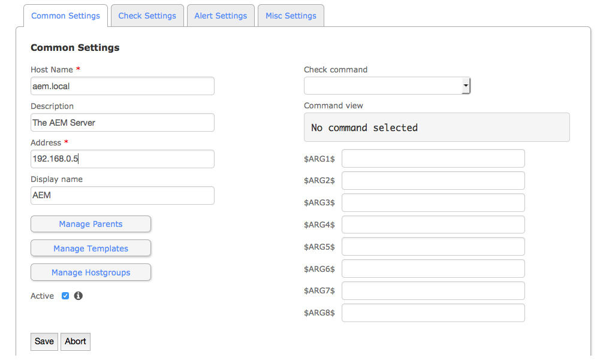

# Tableau de bord des opérations {#operations-dashboard}

## Présentation {#introduction}

Dans AEM 6, le tableau de bord des opérations permet aux opérateurs système de surveiller d’un simple coup d’œil l’intégrité du système AEM. Il fournit également des informations de diagnostic générées automatiquement sur les aspects pertinents de l&#39;AEM et permet de configurer et d&#39;exécuter une automatisation de maintenance autonome afin de réduire considérablement les opérations de projet et les cas de support. Le tableau de bord des opérations peut être étendu en y intégrant des contrôles de l’intégrité et des tâches de maintenance personnalisés. En outre, les données du tableau de bord des opérations sont accessibles à l’aide des outils de surveillance externes par le biais de JMX.

**Le tableau de bord des opérations :**

* est un état du système accessible en un clic, qui aide les services Opérations à optimiser leur efficacité ;
* fournit une vue d’ensemble des contrôles de l’intégrité du système à un emplacement centralisé unique ;
* réduit le délai pour trouver, analyser et corriger des problèmes ;
* permet une automatisation de la maintenance autonome, qui contribue à réduire considérablement les coûts de fonctionnement de votre projet.

Vous pouvez y accéder en accédant à **Outils** - **Opérations** à partir de l&#39;écran d&#39;accueil AEM.

>[!NOTE]
>
>Pour accéder au tableau de bord des opérations, l’utilisateur connecté doit faire partie du groupe d’utilisateurs « Opérateurs ». Pour plus d’informations, consultez la documentation relative à l’[Administration des utilisateurs, des groupes et des droits d’accès](/help/sites-administering/user-group-ac-admin.md).

## Rapports d’intégrité {#health-reports}

Le système de rapports d’intégrité fournit des informations sur l’intégrité d’une instance AEM par le biais de contrôles d’intégrité Sling. Cela peut être effectué à l’aide de demandes OSGi, JMX, HTTP (via JSON) ou par le biais de l’interface utilisateur tactile. Il propose des mesures et un seuil pour certains compteurs configurables et, dans certains cas, contient des informations sur la résolution du problème.

Il comporte différentes fonctionnalités, décrites ci-dessous.

## Contrôles de l’intégrité {#health-checks}

Les **rapports d’intégrité** sont un système de cartes indiquant une intégrité satisfaisante ou non en ce qui concerne une zone spécifique du produit. Ces cartes sont des visualisations des contrôles d’intégrité Sling, qui agrègent les données de JMX et d’autres sources, et présentent de nouveau les informations traitées sous forme de MBeans. Ces MBeans peuvent également être vérifiés dans la [console web JMX](/help/sites-administering/jmx-console.md), sous le domaine **org.apache.sling.healthcheck**.

Vous pouvez accéder à l&#39;interface Rapports d&#39;intégrité à l&#39;aide du menu **Outils** - **Opérations** - **Rapports d&#39;intégrité** de l&#39;écran d&#39;accueil de l&#39;AEM, ou directement à l&#39;adresse URL suivante :

`https://<serveraddress>:port/libs/granite/operations/content/healthreports/healthreportlist.html`


Le système de cartes comporte trois états possibles : **OK**, **AVERTISSEMENT** et **CRITIQUE**. Les états sont le résultat des règles et des seuils, qui peuvent être configurés en passant le curseur de la souris sur la carte, puis en cliquant sur l’icône d’engrenage de la barre d’actions :


### Types de contrôle de l’intégrité {#health-check-types}

Dans AEM 6, il existe deux types de contrôle de l’intégrité :

1. Contrôles de l’intégrité individuels
1. Contrôles de l’intégrité composites

Un **contrôle de l’intégrité individuel** est un contrôle de l’intégrité unique, qui correspond à une carte d’état. Des contrôles de l’intégrité individuels peuvent être configurés avec des règles ou des seuils et peuvent fournir un ou plusieurs conseils et liens pour résoudre des problèmes d’intégrité identifiés. Prenons le contrôle « Erreurs de journal » comme exemple : s’il existe des entrées ERREUR dans les journaux des instances, elles seront répertoriées dans la page Détails du contrôle de l’intégrité. Dans la partie supérieure de la page, un lien vers l’analyseur « Message du journal » dans la section Outils de diagnostic permet d’analyser ces erreurs plus en détail et de reconfigurer les enregistreurs.

Un **contrôle de l’intégrité composite** est un contrôle qui regroupe des informations de différents contrôles individuels.

Les contrôles de l’intégrité composites sont configurés à l’aide de **balises de filtrage**. En substance, tous les contrôles individuels possédant la même balise de filtrage sont regroupés sous le contrôle de l’intégrité composite. L’état d’un contrôle de l’intégrité composite est « OK » seulement si l’état de tous les contrôles individuels est également « OK ».

### Procédure de création de contrôles de l’intégrité {#how-to-create-health-checks}

Dans le tableau de bord des opérations, vous pouvez visualiser le résultat des contrôles de l’intégrité individuels et composites.

### Création d’un contrôle de l’intégrité individuel {#creating-an-individual-health-check}

La création d’un contrôle de l’intégrité individuel comprend deux étapes : mise en œuvre d’un contrôle de l’intégrité Sling et ajout d’une entrée pour le contrôle de l’intégrité dans les nœuds de la configuration du tableau de bord.

1. Pour créer un contrôle de l’intégrité Sling, vous devez créer un composant OSGi mettant en œuvre l’interface Sling HealthCheck. Vous ajoutez ce composant dans un lot. Les propriétés du composant identifient entièrement le contrôle de l’intégrité. Une fois le composant installé, un MBean JMX est automatiquement créé pour le contrôle de l’intégrité. Pour plus d’informations, voir la [documentation sur les contrôles de l’intégrité Sling](https://sling.apache.org/documentation/bundles/sling-health-check-tool.html).

    Exemple de composant de contrôle de l’intégrité Sling, écrit avec des annotations de composant de service OSGi :

   ```java
   @Component(service = HealthCheck.class,
   property = {
       HealthCheck.NAME + "=Example Check",
       HealthCheck.TAGS + "=example",
       HealthCheck.TAGS + "=test",
       HealthCheck.MBEAN_NAME + "=exampleHealthCheckMBean"
   })
    public class ExampleHealthCheck implements HealthCheck {
       @Override
       public Result execute() {
           // health check code
       }
    }
   ```

   >[!NOTE]
   >
   >La propriété `MBEAN_NAME` définit le nom du MBean généré pour ce contrôle de l’intégrité.

1. Après avoir créé un contrôle de l’intégrité, un nouveau nœud de configuration doit être créé afin de le mettre à disposition dans l’interface du tableau de bord des opérations. Pour cette étape, il est nécessaire de connaître le nom du MBean JMX du contrôle de l’intégrité (la propriété `MBEAN_NAME`). Pour créer une configuration pour le contrôle d’intégrité, ouvrez CRXDE et ajoutez un nouveau noeud (de type **nt:unstructured**) sous le chemin d’accès suivant : `/apps/settings/granite/operations/hc`

   Les propriétés ci-dessous doivent être définies sur le nouveau nœud :

   * **Nom :**`sling:resourceType`

      * **Type:** `String`
      * **Valeur:** `granite/operations/components/mbean`
   * **Nom :**`resource`

      * **Type :** `String`
      * **Valeur:** `/system/sling/monitoring/mbeans/org/apache/sling/healthcheck/HealthCheck/exampleHealthCheck`

   >[!NOTE]
   >
   >Le chemin de ressource ci-dessus est créé comme suit : si le nom mbean de votre vérification d&#39;intégrité est &quot;test&quot;, ajoutez &quot;test&quot; à la fin du chemin `/system/sling/monitoring/mbeans/org/apache/sling/healthcheck/HealthCheck`
   >
   >Le chemin d’accès final est donc :
   >
   >`/system/sling/monitoring/mbeans/org/apache/sling/healthcheck/HealthCheck/test`

   >[!NOTE]
   >
   >Assurez-vous que les propriétés suivantes du chemin `/apps/settings/granite/operations/hc` sont définies sur true :
   >
   >
   >`sling:configCollectionInherit`
   >
   >`sling:configPropertyInherit`
   >
   >
   >Cela indique au gestionnaire de configuration de fusionner les nouvelles configurations avec les configurations existantes de `/libs`.

### Création d’un contrôle de l’intégrité composite {#creating-a-composite-health-check}

Un contrôle de l’intégrité composite vise à agréger différents contrôles de l’intégrité partageant un ensemble de fonctionnalités communes. Par exemple, un contrôle de l’intégrité composite de sécurité regroupe tous les contrôles de l’intégrité individuels liés à la sécurité. Pour créer un contrôle composite, la première étape consiste à ajouter une nouvelle configuration OSGi. Pour qu’il s’affiche dans le tableau de bord des opérations, un nouveau nœud de configuration doit être ajouté comme pour un contrôle unique.

1. Accédez au gestionnaire de configuration web dans la console OSGi. Pour ce faire, accédez à `https://serveraddress:port/system/console/configMgr`
1. Recherchez l’entrée **Apache Sling Composite Health Check**. Une fois que vous l’avez trouvée, deux configurations sont déjà disponibles : une pour les contrôles système et une autre pour les contrôles de sécurité.
1. Créez une configuration en cliquant sur le bouton « + » dans la partie droite de la configuration. Une nouvelle fenêtre s’affiche, comme illustré ci-dessous :

   

1. Créez une configuration et enregistrez-la. Un MBean est créé avec la nouvelle configuration.

   L’objectif de chaque propriété de configuration est le suivant :

   * **Nom (hc.name) :** nom du contrôle de l’intégrité composite. Il est recommandé d’utiliser un nom éloquent.
   * **Balises (hc.tags) :** balises de ce contrôle de l’intégrité. Si ce contrôle de l’intégrité composite est conçu pour faire partie d’un autre contrôle de l’intégrité composite (comme dans une hiérarchie de contrôles de l’intégrité), ajoutez les balises auxquelles ce contrôle composite est lié.
   * **Nom du MBean (hc.mbean.name) :** nom du MBean qui sera attribué au MBean JMX de ce contrôle de l’intégrité composite.
   * **Balises de filtrage (filter.tags) :** il s’agit d’une propriété spécifique aux contrôles de l’intégrité composites. Ce sont les balises que le contrôle composite doit agréger. Le contrôle de l’intégrité composite agrège, sous son groupe, tous les contrôles de l’intégrité possédant une balise correspondant aux balises de filtrage de ce contrôle composite. Par exemple, un contrôle de l’intégrité composite possédant les balises de filtrage **test** et **check** agrège tous les contrôles de l’intégrité individuels et composites possédant la balise **test** ou **check** dans leur propriété de balise ( `hc.tags`).

   >[!NOTE]
   >
   >Un nouveau MBean JMX est créé pour chaque nouvelle configuration du contrôle de l’intégrité composite Apache Sling.**

1. Enfin, l’entrée du contrôle de l’intégrité composite qui vient d’être créé doit être ajoutée aux nœuds de configuration du tableau de bord des opérations. La procédure à suivre est la même que pour les contrôles de santé individuels : un noeud de type **nt:unstructured** doit être créé sous `/apps/settings/granite/operations/hc`. La propriété de ressource du nœud est définie par la valeur de **hc.mean.name** dans la configuration OSGi.

   Par exemple, si vous avez créé une configuration et défini la valeur **hc.mbean.name** sur **diskusage**, les nœuds de configuration se présentent comme suit :

   * **Nom :**`Composite Health Check`

      * **Type :** `nt:unstructured`

   Avec les propriétés suivantes :

   * **Nom :**`sling:resourceType`

      * **Type :** `String`
      * **Valeur:** `granite/operations/components/mbean`
   * **Nom :**`resource`

      * **Type :** `String`
      * **Valeur:** `/system/sling/monitoring/mbeans/org/apache/sling/healthcheck/HealthCheck/diskusage`

   >[!NOTE]
   >
   >Si vous créez des contrôles de l’intégrité individuels, qui font partie logiquement d’un contrôle composite déjà présent dans le tableau de bord par défaut, ils sont enregistrés et regroupés automatiquement sous le contrôle composite correspondant. Pour cette raison, il n’est pas nécessaire de créer un nœud de configuration pour ces contrôles.
   >
   >Par exemple, si vous créez un contrôle de l’intégrité individuel de sécurité, il suffit d’affecter la balise « **security** », et il est installé et s’affiche automatiquement sous le contrôle composite de sécurité dans le tableau de bord des opérations.

### Contrôles de l’intégrité fournis avec AEM {#health-checks-provided-with-aem}

<table>
 <tbody>
  <tr>
   <td><strong>Nom du contrôle de l’intégrité</strong></td>
   <td><strong>Description</strong></td>
  </tr>
  <tr>
   <td>Performances des requêtes</td>
   <td><p>Cette vérification d'intégrité a été simplifiée <strong>dans AEM 6.4</strong>, et vérifie désormais le <code>Oak QueryStats</code> MBean récemment refactorisé, plus précisément l'attribut <code>SlowQueries </code>. Si les statistiques contiennent des requêtes lentes, le contrôle de l’intégrité renvoie un avertissement. Autrement, il renvoie l’état « OK ».<br /> </p> <p>Le MBean pour cette vérification d'intégrité est <a href="http://localhost:4502/system/console/jmx/org.apache.sling.healthcheck%3Aname%3DqueriesStatus%2Ctype%3DHealthCheck">org.apache.sling.health check:name=queryStatus,type=HealthCheck</a>.</p> </td>
  </tr>
  <tr>
   <td>Longueur de la file d’attente d’observation</td>
   <td><p>La longueur de file d'attente d'observation effectue des itérations sur tous les auditeurs de Événement et les observateurs en arrière-plan, compare leur <code>queueSize </code>à leur <code>maxQueueSize</code> et :</p>
    <ul>
     <li>renvoie l’état critique si la valeur <code>queueSize</code> dépasse la valeur <code>maxQueueSize</code> (c’est-à-dire lorsque des événements sont supprimés).</li>
     <li>renvoie Avertir si la valeur <code>queueSize</code> est supérieure à <code>maxQueueSize * WARN_THRESHOLD</code> (la valeur par défaut est 0,75) </li>
    </ul> <p>La longueur maximale de chaque file d’attente provient de configurations distinctes (Oak et AEM) et n’est pas configurable à partir de ce contrôle de l’intégrité. Le MBean pour cette vérification d'intégrité est <a href="http://localhost:4502/system/console/jmx/org.apache.sling.healthcheck%3Aname%3DObservationQueueLengthHealthCheck%2Ctype%3DHealthCheck">org.apache.sling.health check:name=ObservationQueueLengthHealthCheck,type=HealthCheck</a>.</p> </td>
  </tr>
  <tr>
   <td>Limites de requête transversales</td>
   <td><p>Requête Traversal Limits vérifie les <code>QueryEngineSettings</code> MBean, plus particulièrement les attributs <code>LimitInMemory</code> et <code>LimitReads</code>, et renvoie l’état suivant :</p>
    <ul>
     <li>renvoie l’état Avertir si l’une des limites est égale ou supérieure à la valeur <code>Integer.MAX_VALUE</code></li>
     <li>« Avertissement » si l’une des limites est inférieure à 10 000 (paramètre recommandé d’Oak) ;</li>
     <li>renvoie l'état Critique si <code>QueryEngineSettings</code> ou l'une des limites ne peut pas être récupérée</li>
    </ul> <p>Le Mbean pour cette vérification d'intégrité est <a href="http://localhost:4502/system/console/jmx/org.apache.sling.healthcheck%3Aname%3DqueryTraversalLimitsBundle%2Ctype%3DHealthCheck">org.apache.sling.health-check:name=queryTraversalLimitsBundle,type=HealthCheck</a>.</p> </td>
  </tr>
  <tr>
   <td>Horloges synchronisées</td>
   <td><p>Cette vérification ne s'applique qu'aux <a href="https://github.com/apache/sling-old-svn-mirror/blob/4df9ab2d6592422889c71fa13afd453a10a5a626/bundles/extensions/discovery/oak/src/main/java/org/apache/sling/discovery/oak/SynchronizedClocksHealthCheck.java">grappes de nodestore de document</a>. Il renvoie l’état suivant :</p>
    <ul>
     <li>« Avertissement » lorsque les horloges des instances sont désynchronisées et dépassent un seuil inférieur prédéfini ;</li>
     <li>« Critique » lorsque les horloges des instances sont désynchronisées et dépassent un seuil supérieur prédéfini ;</li>
    </ul> <p>Le Mbean pour cette vérification d'intégrité est <a href="http://localhost:4502/system/console/jmx/org.apache.sling.healthcheck%3Aname%3DslingDiscoveryOakSynchronizedClocks%2Ctype%3DHealthCheck">org.apache.sling.health check:name=slingDiscoveryOakSynchronizedClocks,type=HealthCheck</a>.</p> </td>
  </tr>
  <tr>
   <td>Index asynchrones</td>
   <td><p>Le contrôle « Index asynchrones » :</p>
    <ul>
     <li>renvoie « Critique » si au moins une piste d’indexation échoue ;</li>
     <li>vérifie <code>lastIndexedTime</code> pour toutes les voies d'indexation et :
      <ul>
       <li>renvoie l'état critique s'il y a plus de 2 heures </li>
       <li>renvoie l'état d'avertissement s'il y a entre 2 heures et 45 minutes </li>
       <li>renvoie l'état OK s'il y a moins de 45 minutes </li>
      </ul> </li>
     <li>renvoie « OK » si aucune de ces conditions n’est remplie.</li>
    </ul> <p>Les seuils des états Critique et Avertissement sont configurables. Le Mbean pour cette vérification d'intégrité est <a href="http://localhost:4502/system/console/jmx/org.apache.sling.healthcheck%3Aname%3DasyncIndexHealthCheck%2Ctype%3DHealthCheck">org.apache.sling.health-check:name=asyncIndexHealthCheck,type=HealthCheck</a>.</p> <p><strong>Remarque :  </strong>Cette vérification de l'état de santé est disponible avec AEM 6.4 et a été reportée à AEM 6.3.0.1.</p> </td>
  </tr>
  <tr>
   <td>Index Lucene volumineux</td>
   <td><p>Cette vérification utilise les données exposées par le <code>Lucene Index Statistics</code> MBean pour identifier les grands index et les retours :</p>
    <ul>
     <li>« Avertissement » s’il y a un index comportant plus de 1 milliard de documents ;</li>
     <li>« Critique » s’il y a un index comportant plus de 1,5 milliard de documents.</li>
    </ul> <p>Les seuils sont configurables et le MBean pour la vérification d'intégrité est <a href="http://localhost:4502/system/console/jmx/org.apache.sling.healthcheck%3Aname%3DlargeIndexHealthCheck%2Ctype%3DHealthCheck">org.apache.sling.healthCheck:name=largeIndexHealthCheck,type=HealthCheck.</a></p> <p><strong>Remarque</strong> : Ce contrôle est disponible avec AEM 6.4 et a été rétroporté dans AEM 6.3.2.0.</p> </td>
  </tr>
  <tr>
   <td>Maintenance du système</td>
   <td><p>La maintenance du système est un contrôle composite, qui renvoie l’état « OK » si toutes les tâches de maintenance sont exécutées selon la configuration. Gardez à l’esprit que :</p>
    <ul>
     <li>chaque tâche de maintenance est accompagnée d'un contrôle d'intégrité associé</li>
     <li>si une tâche n’est pas ajoutée à une période de maintenance, son contrôle de l’intégrité renvoie l’état « Critique » ;</li>
     <li>vous devez configurer les tâches de maintenance du journal d’audit et de purge des workflows ou les supprimer des fenêtres de maintenance. Si ces tâches ne sont pas configurées, elles échouent lors de la première tentative d’exécution et le contrôle « Maintenance système » renvoie l’état « Critique ».</li>
     <li><strong>Avec AEM 6.4</strong>, il existe également un contrôle pour la tâche <a href="/help/sites-administering/operations-dashboard.md#automated-maintenance-tasks">Maintenance des fichiers binaires Lucene</a>.</li>
     <li>Dans AEM 6.2 et version inférieure, le contrôle de la maintenance système renvoie un état « Avertissement » après le démarrage, car les tâches ne sont jamais exécutées. À compter de la version 6.3, il renvoie l’état « OK » si la première période de maintenance n’a pas encore été atteinte.</li>
    </ul> <p>Le MBean pour cette vérification d'intégrité est <a href="http://localhost:4502/system/console/jmx/org.apache.sling.healthcheck%3Aname%3Dsystemchecks%2Ctype%3DHealthCheck">org.apache.sling.health check:name=systemchecks,type=HealthCheck</a>.</p> </td>
  </tr>
  <tr>
   <td>File d’attente de réplication</td>
   <td><p>Ce contrôle effectue une itération sur les agents de réplication et examine leurs files d’attente. Pour l’élément en haut de la file d’attente, le contrôle examine le nombre de fois où l’agent a tenté une réplication. Si l’agent a tenté une réplication plus de fois que défini par la valeur du paramètre <code>numberOfRetriesAllowed</code>, il renvoie un avertissement. Le paramètre <code>numberOfRetriesAllowed</code> peut être configuré. </p> <p>Le MBean pour cette vérification d'intégrité est <a href="http://localhost:4502/system/console/jmx/org.apache.sling.healthcheck%3Aname%3DreplicationQueue%2Ctype%3DHealthCheck" target="_blank">org.apache.sling.health check:name=ReplicationQueue,type=HealthCheck</a>.</p> </td>
  </tr>
  <tr>
   <td>Tâches Sling</td>
   <td>
    <div>
      Sling Jobs vérifie le nombre de tâches mises en file d’attente dans JobManager, le compare au
     <code>maxNumQueueJobs</code> seuil et :
    </div>
    <ul>
     <li>renvoie Critique si plus de <code>maxNumQueueJobs</code> sont dans la file d'attente</li>
     <li>renvoie « Critique » si des tâches actives sont en cours d’exécution depuis plus de 1 h ;</li>
     <li>renvoie « Critique » s’il y a des tâches en file d’attente et que la dernière tâche terminée remonte à plus de 1 h.</li>
    </ul> <p>Seul le nombre maximal du paramètre de tâches en file d’attente est configurable (1 000 par défaut).</p> <p>Le MBean pour cette vérification d'intégrité est <a href="http://localhost:4502/system/console/jmx/org.apache.sling.healthcheck%3Aname%3DslingJobs%2Ctype%3DHealthCheck" target="_blank">org.apache.sling.health check:name=slingJobs,type=HealthCheck</a>.</p> </td>
  </tr>
  <tr>
   <td>Performances des demandes</td>
   <td><p>Cette vérification porte sur la mesure <code>granite.request.metrics.timer</code> <a href="http://localhost:4502/system/console/slingmetrics" target="_blank">Sling </a>et :</p>
    <ul>
     <li>renvoie « Critique » si la valeur du 75e percentile dépasse le seuil critique (la valeur par défaut est de 500 millisecondes) ;</li>
     <li>renvoie « Avertissement » si la valeur du 75e percentile dépasse le seuil d’avertissement (la valeur par défaut est de 200 millisecondes).</li>
    </ul> <p>Le MBean pour cette vérification d'intégrité est <em> </em><a href="http://localhost:4502/system/console/jmx/org.apache.sling.healthcheck%3Aname%3DrequestsStatus%2Ctype%3DHealthCheck" target="_blank">org.apache.sling.health check:name=requestsStatus,type=HealthCheck</a>.</p> </td>
  </tr>
  <tr>
   <td>Erreurs de journal</td>
   <td><p>Ce contrôle renvoie l’état « Avertissement » si le journal comporte des erreurs.</p> <p>Le MBean pour cette vérification d'intégrité est <a href="http://localhost:4502/system/console/jmx/org.apache.sling.healthcheck%3Aname%3DlogErrorHealthCheck%2Ctype%3DHealthCheck" target="_blank">org.apache.sling.health-check:name=logErrorHealthCheck,type=HealthCheck</a>.</p> </td>
  </tr>
  <tr>
   <td>Espace disque</td>
   <td><p>La vérification Espace disque examine le <code>FileStoreStats</code> MBean, récupère la taille du Node Store et la quantité d’espace disque utilisable sur la partition Node Store, et :</p>
    <ul>
     <li>renvoie « Avertissement » si le rapport espace disque utilisable/taille du référentiel est inférieur au seuil d’avertissement (10 par défaut) ;</li>
     <li>renvoie « Critique » si le rapport espace disque utilisable/taille du référentiel est inférieur au seuil critique (2 par défaut).</li>
    </ul> <p>Les deux seuils sont configurables. Le contrôle fonctionne uniquement sur les instances comportant un entrepôt de segments.</p> <p>Le MBean pour cette vérification d'intégrité est <a href="http://localhost:4502/system/console/jmx/org.apache.sling.healthcheck%3Aname%3DDiskSpaceHealthCheck%2Ctype%3DHealthCheck" target="_blank">org.apache.sling.health-check:name=DiskSpaceHealthCheck,type=HealthCheck</a>.</p> </td>
  </tr>
  <tr>
   <td>Vérification de l’intégrité de l’outil de planification</td>
   <td><p>Ce contrôle renvoie un avertissement si l’instance possède des tâches Quartz en cours d’exécution depuis plus de 60 secondes. Le seuil de durée acceptable est configurable.</p> <p>Le MBean pour cette vérification d'intégrité est <a href="http://localhost:4502/system/console/jmx/org.apache.sling.healthcheck%3Aname%3DslingCommonsSchedulerHealthCheck%2Ctype%3DHealthCheck" target="_blank">org.apache.sling.health-check:name=slingCommonsSchedulerHealthCheck,type=HealthCheck</a><em>.</em></p> </td>
  </tr>
  <tr>
   <td>Contrôles de sécurité</td>
   <td><p>Le contrôle de sécurité est un contrôle composite, qui agrège les résultats de différents contrôles liés à la sécurité. Ces vérifications d'intégrité portent sur des préoccupations différentes de la liste de contrôle de sécurité disponible à la <a href="/help/sites-administering/security-checklist.md">page de documentation de la liste de contrôle de sécurité.</a> La vérification est utile comme test de fumée de sécurité au démarrage de l'instance. </p> <p>Le MBean pour cette vérification d'intégrité est <a href="http://localhost:4502/system/console/jmx/org.apache.sling.healthcheck%3Aname%3Dsecuritychecks%2Ctype%3DHealthCheck" target="_blank">org.apache.sling.health-check:name=securityCheck,type=HealthCheck</a></p> </td>
  </tr>
  <tr>
   <td>Lots actifs</td>
   <td><p>Les lots actifs contrôlent l’état de tous les lots et :</p>
    <ul>
     <li>renvoient l’état « Avertissement » si l’un des lots n’est pas actif ou (à commencer par une activation différée) ;</li>
     <li>ignorent l’état des lots dans la liste Ignorer.</li>
    </ul> <p>Le paramètre de la liste Ignorer est configurable.</p> <p>Le MBean pour cette vérification d'intégrité est <a href="http://localhost:4502/system/console/jmx/org.apache.sling.healthcheck%3Aname%3DinactiveBundles%2Ctype%3DHealthCheck" target="_blank">org.apache.sling.health check:name=inactiveBundles,type=HealthCheck</a>.</p> </td>
  </tr>
  <tr>
   <td>Contrôle du cache du code</td>
   <td><p>Il s’agit d’un contrôle de l’intégrité, qui vérifie plusieurs conditions JVM pouvant déclencher l’apparition d’un bogue de CodeCache dans Java 7 :</p>
    <ul>
     <li>il renvoie l’état « Avertissement » si l’instance est exécutée sur Java 7, avec la purge du cache du code activée ;</li>
     <li>il renvoie l’état « Avertissement » si l’instance est exécutée sur Java 7 et que la taille du cache du code est inférieure à un seuil minimal (la valeur par défaut est 90 Mo).</li>
    </ul> <p>Le seuil <code>minimum.code.cache.size</code> peut être configuré. Pour plus d'informations sur le bogue, <a href="https://bugs.java.com/bugdatabase/view_bug.do?bug_id=8012547">vérifiez </a><a href="https://bugs.java.com/bugdatabase/view_bug.do?bug_id=8012547"></a><a href="https://bugs.java.com/bugdatabase/view_bug.do?bug_id=8012547"></a><a href="https://bugs.java.com/bugdatabase/view_bug.do?bug_id=8012547"> cette page</a>.</p> <p>Le MBean de ce contrôle de l’intégrité est <a href="http://localhost:4502/system/console/jmx/org.apache.sling.healthcheck%3Aname%3DcodeCacheHealthCheck%2Ctype%3DHealthCheck" target="_blank">org.apache.sling.healthcheck:name=codeCacheHealthCheck,type=HealthCheck</a>.</p> </td>
  </tr>
  <tr>
   <td>Erreurs de chemin de recherche des ressources</td>
   <td><p>Vérifie s'il existe des ressources dans le chemin <code>/apps/foundation/components/primary</code> et :</p>
    <ul>
     <li>renvoie Avertir s'il y a des noeuds enfants sous <code>/apps/foundation/components/primary</code></li>
    </ul> <p>Le MBean de ce contrôle de l’intégrité est <a href="http://localhost:4502/system/console/jmx/org.apache.sling.healthcheck%3Aname%3DresourceSearchPathErrorHealthCheck%2Ctype%3DHealthCheck" target="_blank">org.apache.sling.healthcheck:name=resourceSearchPathErrorHealthCheck,type=HealthCheck</a>.</p> </td>
  </tr>
 </tbody>
</table>

## Surveillance à l’aide de Nagios {#monitoring-with-nagios}

Le tableau de bord des contrôles de l’intégrité peut être intégré à Nagios par le biais des MBeans JMX Granite. L’exemple ci-dessous indique comment ajouter un contrôle qui affiche la mémoire utilisée sur le serveur qui exécute AEM.

1. Configurez et installez Nagios sur le serveur de surveillance.
1. Installez ensuite Nagios Remote Plugin Executor (NRPE).

   >[!NOTE]
   >
   >Pour plus d’informations sur l’installation de Nagios et de NRPE sur votre système, consultez la [documentation de Nagios](https://library.nagios.com/library/products/nagioscore/manuals/).

1. Ajoutez une définition de l’hôte pour le serveur AEM. Cette opération peut être effectuée par le biais de l’interface web de Nagios XI, en utilisant le gestionnaire de configuration :

   1. Ouvrez un navigateur et pointez vers le serveur Nagios.
   1. Appuyez sur le bouton **Configure** dans le menu supérieur.
   1. Dans le volet de gauche, appuyez sur **Core Config Manager** sous **Advanced Configuration**.
   1. Appuyez sur le lien **Hôtes** sous la section **Surveillance**.
   1. Ajoutez la définition de l’hôte :

   

   Voici un exemple de fichier de configuration de l’hôte si vous utilisez Nagios Core :

   ```xml
   define host {
      address 192.168.0.5
      max_check_attempts 3
      check_period 24x7
      check-command check-host-alive
      contacts admin
      notification_interval 60
      notification_period 24x7
   }
   ```

1. Installez Nagios et NRPE sur le serveur AEM.
1. Installez le module externe [check_http_json](https://github.com/phrawzty/check_http_json) sur les deux serveurs.
1. Définissez une commande de contrôle JSON générique sur les deux serveurs :

   ```xml
   define command{
   
       command_name    check_http_json-int
   
       command_line    /usr/lib/nagios/plugins/check_http_json --user "$ARG1$" --pass "$ARG2$" -u 'https://$HOSTNAME$:$ARG3$/$ARG4$' -e '$ARG5$' -w '$ARG6$' -c '$ARG7$'
   
   }
   ```

1. Ajoutez un service pour la mémoire utilisée sur le serveur AEM :

   ```xml
   define service {
   
       use generic-service
   
       host_name my.remote.host
   
       service_description AEM Author Used Memory
   
       check_command  check_http_json-int!<cq-user>!<cq-password>!<cq-port>!system/sling/monitoring/mbeans/java/lang/Memory.infinity.json!{noname}.mbean:attributes.HeapMemoryUsage.mbean:attributes.used.mbean:value!<warn-threshold-in-bytes>!<critical-threshold-in-bytes>
   
       }
   ```

1. Reportez-vous au tableau de bord Nagios du service que vous venez de créer :

   

## Outils de diagnostic {#diagnosis-tools}

Le tableau de bord des opérations permet également d’accéder aux outils de diagnostic, qui peuvent vous aider à identifier et à résoudre les causes principales des avertissements figurant dans le tableau de bord des contrôles de l’intégrité et fournissent en outre des informations de débogage importantes pour les opérateurs système.

Ses fonctionnalités les plus importantes sont les suivantes :

* Analyseur de messages du journal
* Possibilité d’accéder aux images mémoire des segments de mémoire et des threads
* Demandes et analyseurs de performances des requêtes

Pour accéder à l’écran Outils de diagnostic, sélectionnez **Outils > Opérations > Diagnostic** dans l’écran d’accueil d’AEM. Vous pouvez également accéder à l’écran en accédant directement à l’URL suivante : `https://serveraddress:port/libs/granite/operations/content/diagnosis.html`


### Messages du journal {#log-messages}

Par défaut, l’interface utilisateur des messages du journal affiche tous les messages ERREUR. Si vous souhaitez afficher davantage de messages du journal, vous devez configurer un enregistreur avec le niveau de journalisation approprié.

Les messages du journal utilisent un appender de journal en mémoire et ne sont donc pas liés aux fichiers journaux. Une autre conséquence est que la modification des niveaux de journalisation dans cette interface utilisateur ne modifiera pas les informations qui sont enregistrées dans les fichiers journaux traditionnels. L’ajout et la suppression d’enregistreurs dans cette interface utilisateur affectent uniquement l’enregistreur dans la mémoire. Notez par ailleurs que la modification des configurations de l’enregistreur se répercutera ultérieurement dans l’enregistreur en mémoire : les entrées déjà journalisées et qui ne sont plus pertinentes ne sont pas supprimées, mais des entrées similaires ne seront pas journalisées à l’avenir.

Vous pouvez configurer les éléments journalisés en fournissant des configurations d’enregistreur en cliquant sur l’icône d’engrenage dans la partie supérieure gauche de l’interface utilisateur. Vous pouvez y ajouter, supprimer ou mettre à jour des configurations d’enregistreur. Une configuration d’enregistreur se compose d’un **niveau de journal** (AVERTISSEMENT/INFO/DÉBOGAGE) et d’un **nom de filtre**. Le **nom du filtre** est chargé de filtrer la source des messages du journal consignés. Si un enregistreur doit enregistrer tous les messages du journal pour un niveau spécifié, le nom du filtre doit être « **root** ». La définition du niveau d’un enregistreur déclenche l’enregistrement de tous les messages dont le niveau est supérieur ou égal au niveau spécifié.

Exemples :

* Si vous envisagez d’enregistrer tous les messages **ERREUR**, aucune configuration n’est nécessaire. Tous les messages ERREUR sont capturés par défaut.
* Si vous envisagez d’enregistrer tous les messages **ERREUR**, **AVERTISSEMENT** et **INFO**, le nom de l’enregistreur doit être défini sur « **root** » et le niveau de l’enregistreur sur **INFO**.

* Si vous envisagez d’enregistrer tous les messages issus d’un module particulier (par exemple, com.adobe.granite), le nom de l’enregistreur doit être défini sur « com.adobe.granite » et le niveau de l’enregistreur sur **DÉBOGAGE** (ce qui capturera tous les messages **ERREUR**, **AVERTISSEMENT**, **INFO** et **DÉBOGAGE**), comme illustré dans l’image ci-dessous.


>[!NOTE]
>
>Vous ne pouvez pas définir un nom d’enregistreur de manière à consigner uniquement les messages ERREUR par le biais d’un filtre spécifié. Par défaut, tous les messages ERREUR sont capturés.

>[!NOTE]
>
>L’interface utilisateur des messages du journal ne reflète pas le journal d’erreurs réel. À moins que vous n’ayez configuré d’autres types de messages du journal dans l’interface utilisateur, seuls les messages d’erreur s’affichent. Pour savoir comment afficher des messages spécifiques du journal, consultez les instructions ci-dessus.

>[!NOTE]
>
>Les paramètres de la page de diagnostic n’ont aucune incidence sur les éléments consignés dans les fichiers journaux et inversement. Ainsi, même si le journal d’erreurs peut capturer des messages INFO, il est possible qu’ils ne s’affichent pas dans l’interface utilisateur des messages du journal. Par ailleurs, par le biais de l’interface utilisateur, il est possible de capturer des messages DÉBOGAGE provenant de certains modules sans que cela affecte le journal des erreurs. Pour plus d’informations sur la configuration des fichiers journaux, voir [Journalisation](/help/sites-deploying/configure-logging.md).

>[!NOTE]
>
>**Avec AEM 6.4**, les tâches de maintenance sont déconnectées de la boîte dans un format plus riche en informations au niveau INFO. L’état des tâches de maintenance est ainsi plus lisible.
>
>Si vous utilisez des outils tiers (comme Splunk) pour surveiller l’activité des tâches de maintenance et y réagir, vous pouvez utiliser les instructions de journal suivantes :

```
Log level: INFO
DATE+TIME [MaintanceLogger] Name=<MT_NAME>, Status=<MT_STATUS>, Time=<MT_TIME>, Error=<MT_ERROR>, Details=<MT_DETAILS>
```

### Performances des demandes  {#request-performance}

La page Performances des demandes permet d’analyser les demandes de page les plus lentes traitées. Seules les demandes de contenu sont enregistrées dans cette page. Plus spécifiquement, les demandes enregistrées sont les suivantes :

1. Demande l&#39;accès aux ressources sous `/content`
1. Demande l&#39;accès aux ressources sous `/etc/design`
1. Demandes ayant l&#39;extension `".html"`


La page affiche les informations suivantes :

* Heure de la demande
* Adresse URL et méthode de la demande
* Durée en millisecondes

Par défaut, les 20 demandes de page les plus lentes sont enregistrées, mais la limite peut être modifiée dans le gestionnaire de configuration.

### Performances des requêtes {#query-performance}

La page Performance des requêtes permet d’analyser les requêtes les plus lentes exécutées par le système. Ces informations sont fournies par le référentiel dans un MBean JMX. Ces informations sont fournies par le MBean JMX `com.adobe.granite.QueryStat` dans Jackrabbit et par `org.apache.jackrabbit.oak.QueryStats.` dans le référentiel Oak.

La page affiche les informations suivantes :

* Heure de la requête
* Langage de la requête
* Nombre de fois où la requête a été exécutée
* Instruction de la requête
* Durée en millisecondes


### Expliquer la requête {#explain-query}

Oak tente de déterminer la meilleure façon d’exécuter une requête donnée d’après les index Oak définis dans le référentiel sous le nœud **oak:index**. En fonction de la requête, Oak peut sélectionner différents index. La première étape d’optimisation de la requête consiste à comprendre la façon dont Oak exécute une requête.

L’outil Expliquer la requête explique la façon dont Oak exécute une requête. Pour y accéder, sélectionnez **Outils > Opérations > Diagnostic** dans l’écran d’accueil d’AEM, puis cliquez sur **Performances des requêtes** et accédez à l’onglet **Expliquer la requête**.

**Fonctions**

* Prend en charge les langages de requête Xpath, JCR-SQL et JCR-SQL2.
* Indique le temps d’exécution réel de la requête spécifiée.
* Détecte les requêtes lentes et avertit au sujet des requêtes pouvant être potentiellement lentes.
* Indique l’index Oak utilisé pour exécuter la requête.
* Affiche l’explication du moteur Oak Query.
* Fournit la liste des éléments à charger des requêtes lentes et populaires.

Dans l’interface utilisateur de l’outil Expliquer la requête, entrez la requête et appuyez sur le bouton **Expliquer** :


La première entrée de la section Explication de la requête est l’explication réelle. L’explication indique le type d’index utilisé pour exécuter la requête.

La seconde entrée est le plan d’exécution.

Si vous activez la case à cocher **Inclure le délai d’exécution** avant d’exécuter la requête, le délai d’exécution de la requête s’affiche également, ce qui permet d’utiliser davantage d’informations afin d’optimiser les index pour l’application ou le déploiement.


### Gestionnaire d’index {#the-index-manager}

Le gestionnaire d’index vise à faciliter la gestion des index, notamment leur tenue à jour ou l’affichage de leur statut.

Pour y accéder, accédez à **Outils - Opérations - Diagnostic **à partir de l’écran de bienvenue, puis cliquez sur le bouton **Gestionnaire d’index**.

Vous pouvez également y accéder directement à l’adresse suivante : `https://serveraddress:port/libs/granite/operations/content/diagnosistools/indexManager.html`


L’interface utilisateur peut être utilisée pour filtrer les index dans le tableau en entrant les critères de filtre dans la zone de recherche située dans le coin supérieur gauche de l’écran.

### Télécharger le ZIP d’état {#download-status-zip}

Cette option permet de télécharger un fichier ZIP contenant des informations utiles sur l’état et la configuration du système. L’archive contient des configurations d’instance, une liste de lots, des mesures OSGI, Sling et des statistiques, ce qui peut générer un fichier volumineux. Vous pouvez réduire l’impact des fichiers d’état volumineux en utilisant la fenêtre **Télécharger le ZIP d’état**. La fenêtre est accessible à partir de :**AEM > Outils > Opérations > Diagnostic > Télécharger le ZIP d&#39;état.**

Dans cette fenêtre, vous pouvez sélectionner les éléments à exporter (fichiers journaux et/ou image mémoire des threads) ainsi que le nombre de jours à prendre en compte dans le téléchargement par rapport à la date actuelle.


### Télécharger l’image mémoire des threads {#download-thread-dump}

Cette option déclenche le téléchargement d’un fichier ZIP contenant des informations sur les threads présents sur le système. Des informations sur chaque thread sont fournies (état, chargeur de classes et trace de pile, notamment).

### Télécharger l’image mémoire des segments de mémoire  {#download-heap-dump}

Vous avez également la possibilité de télécharger un instantané du segment de mémoire afin de l’analyser ultérieurement. Remarque : le fichier téléchargé est volumineux, de l’ordre de centaines de mégaoctets.

## Tâches de maintenance automatisées  {#automated-maintenance-tasks}

Depuis la page Tâches de maintenance automatisées, affichez et suivez les tâches de maintenance recommandées planifiées pour une exécution périodique. Les tâches sont intégrées au système de contrôle de l’intégrité. Elles peuvent également être exécutées manuellement à partir de l’interface.

Pour accéder à la page Maintenance du tableau de bord des opérations, sélectionnez **Outils > Opérations > Tableau de bord > Maintenance** dans l’écran d’accueil d’AEM ou cliquez directement sur ce lien :

`https://serveraddress:port/libs/granite/operations/content/maintenance.html`

Les tâches ci-dessous sont disponibles dans le tableau de bord des opérations :

1. Tâche **Nettoyage de la révision** dans le menu **Période de maintenance quotidienne**
1. La tâche **Nettoyage des binaires Lucene**, située sous le menu **Quotidien Maintenance Window**.
1. Tâche **Purge du workflow** dans le menu **Période de maintenance hebdomadaire**
1. La tâche **Collecte de déchets du magasin de données**, située sous le menu **Fenêtre de maintenance hebdomadaire**.
1. La tâche **Maintenance du journal d&#39;audit**, située sous le menu **Fenêtre de maintenance hebdomadaire**.
1. La tâche **Version Purge Maintenance**, située sous le menu **Heekly Maintenance Window**.

La synchronisation par défaut pour la période de maintenance quotidienne a lieu de 2 h à 5 h du matin. Les tâches configurées pour s’exécuter pendant la période de maintenance hebdomadaire sont exécutées entre 1 h et 2 h du matin le samedi.

Vous pouvez également configurer des synchronisations en appuyant sur l’icône d’engrenage sur l’une des deux cartes de maintenance :


>[!NOTE]
>
>Depuis AEM 6.1, il est également possible de configurer les périodes de maintenance existantes pour qu’elles s’exécutent tous les mois.

### Nettoyage de la révision  {#revision-clean-up}

Pour plus d’informations sur l’exécution du nettoyage de la révision, [consultez cet article](/help/sites-deploying/revision-cleanup.md).

### Nettoyage des binaires Lucene {#lucene-binaries-cleanup}

Utilisez la tâche Nettoyage des binaires Lucene pour purger les fichiers binaires Lucene et réduire la taille nécessaire pour l’exécution de l’entrepôt de données. Cela est dû au fait que l&#39;unité binaire de lucene sera récupérée quotidiennement au lieu de la dépendance précédente sur une exécution réussie de [collecte de données de stockage de déchets](/help/sites-administering/data-store-garbage-collection.md).

La tâche de maintenance a été conçue en vue de réduire les objets inutilisés dans les révisions liés à Lucene, mais elle présente en outre des avantages d’ordre général en termes d’efficacité :

* L’exécution hebdomadaire de la tâche de nettoyage d’un entrepôt de données se terminera plus rapidement.
* Il peut également légèrement améliorer les performances AEM globales

Vous pouvez accéder à la tâche de nettoyage des fichiers binaires Lucene à partir de : **AEM > Outils > Opérations > Maintenance > Fenêtre de maintenance quotidienne > Nettoyage des binaires Lucene**.

### Nettoyage de la mémoire d’entrepôt de données {#data-store-garbage-collection}

Pour plus d’informations sur ce sujet, consultez cette [page de la documentation](/help/sites-administering/data-store-garbage-collection.md).

### Purge du workflow {#workflow-purge}

Il est possible également de purger les workflows à partir du tableau de bord de maintenance. Pour exécuter la tâche de purge du workflow, procédez comme suit :

1. Cliquez sur la page **Période de maintenance hebdomadaire**.
1. Dans la page suivante, cliquez sur le bouton **Lire** dans la carte **Purge du workflow**.

>[!NOTE]
>
>Pour plus d’informations sur la maintenance du workflow, consultez [cette page](/help/sites-administering/workflows-administering.md#regular-purging-of-workflow-instances).

### Maintenance des journaux d’audit {#audit-log-maintenance}

Pour en savoir plus sur la maintenance des journaux d’audit, consultez cette [page de la documentation](/help/sites-administering/operations-audit-log.md).

### Purge de version {#version-purge}

Vous pouvez planifier la tâche de maintenance Purge de version pour supprimer automatiquement les anciennes versions. Par conséquent, cela permet de minimiser la nécessité d’utiliser manuellement les [outils de purge de version](/help/sites-deploying/version-purging.md). Vous pouvez planifier et configurer la tâche de purge de version en accédant à **Outils > Opérations > Maintenance > Fenêtre de maintenance hebdomadaire** et en procédant comme suit :

1. Cliquez sur le bouton **Ajouter**.
1. Sélectionnez **Version Purge** dans le menu déroulant.

   

1. Pour configurer la tâche de purge de version, cliquez sur l&#39;icône **engrenages** de la nouvelle carte de maintenance de purge de version.

   

**Dans AEM 6.4**, vous pouvez arrêter la tâche de maintenance Purge de version comme suit :

* Automatiquement : si la période de maintenance planifiée se termine avant que la tâche ne puisse se terminer, celle-ci s’arrête automatiquement. Elle reprend lorsque commence la période de maintenance suivante.
* Manuellement - Pour arrêter manuellement la tâche, sur la carte de maintenance Purger la version, cliquez sur l&#39;icône **Arrêter**. La tâche reprend en toute sécurité lors de la prochaine exécution.

>[!NOTE]
>
>L’arrêt de la tâche de maintenance consiste à suspendre son exécution sans perdre la trace de la tâche déjà en cours.

>[!CAUTION]
>
>Pour optimiser la taille du référentiel, vous devez exécuter la tâche Purge de version fréquemment. La tâche doit être planifiée en dehors des heures de bureau lorsque le trafic est limité.

## Tâches de maintenance personnalisées {#custom-maintenance-tasks}

Les tâches de maintenance personnalisées peuvent être mises en œuvre sous forme de services OSGi. Lorsque l’infrastructure des tâches de maintenance repose sur le traitement des tâches Apache Sling, une tâche de maintenance doit mettre en œuvre l’interface Java ` [org.apache.sling.event.jobs.consumer.JobExecutor](https://sling.apache.org/apidocs/sling7/org/apache/sling/event/jobs/consumer/JobExecutor.html)`. De plus, pour être détectée comme tâche de maintenance, elle doit déclarer différentes propriétés d’enregistrement de service, comme indiqué ci-dessous :

<table>
 <tbody>
  <tr>
   <td><strong>Nom de la propriété du service</strong><br /> </td>
   <td><strong>Description</strong></td>
   <td><strong>Exemple</strong><br /> </td>
   <td><strong>Type</strong></td>
  </tr>
  <tr>
   <td>granite.maintenance.isStoppable</td>
   <td>Attribut booléen définissant si l'utilisateur peut arrêter la tâche. Si une tâche indique qu’elle peut être arrêtée, elle doit vérifier pendant son exécution si elle a été arrêtée, puis agir en conséquence. La valeur par défaut est false.</td>
   <td>true</td>
   <td>Facultatif</td>
  </tr>
  <tr>
   <td>granite.maintenance.mandatory</td>
   <td>Attribut booléen définissant si une tâche est obligatoire et doit être exécutée régulièrement. Si une tâche est obligatoire, mais qu’elle ne se trouve pas actuellement dans une fenêtre de planification active, un contrôle de l’intégrité signale qu’il s’agit d’une erreur. La valeur par défaut est false.</td>
   <td>true</td>
   <td>Facultatif</td>
  </tr>
  <tr>
   <td>granite.maintenance.name</td>
   <td>Nom unique de la tâche : il est utilisé pour faire référence à la tâche. Il s'agit généralement d'un nom simple.</td>
   <td>MyMaintenanceTask</td>
   <td>Requis</td>
  </tr>
  <tr>
   <td>granite.maintenance.title</td>
   <td>Titre affiché pour cette tâche</td>
   <td>Ma Tâche de maintenance spéciale</td>
   <td>Requis</td>
  </tr>
  <tr>
   <td>job.topics</td>
   <td>Il s'agit d'un sujet unique de la tâche de maintenance.<br /> Le traitement des tâches Apache Sling démarre une tâche avec cette rubrique exactement afin d’exécuter la tâche de maintenance ; lorsque la tâche est enregistrée pour cette rubrique, elle est exécutée.<br /> La rubrique doit être début avec  <i>com/adobe/granite/maintenance/job/</i></td>
   <td>com/adobe/granite/maintenance/job/MyMaintenanceTask</td>
   <td>Requis</td>
  </tr>
 </tbody>
</table>

Outre les propriétés de service ci-dessus, la méthode `process()` de l&#39;interface `JobConsumer` doit être implémentée en ajoutant le code qui doit être exécuté pour la tâche de maintenance. L’élément `JobExecutionContext` fourni peut être utilisé pour générer les informations d’état. Vérifiez si la tâche est interrompue par l’utilisateur et produit un résultat (réussite ou échec).

Dans les cas où une tâche de maintenance ne doit pas être exécutée sur toutes les installations (par exemple, exécutée uniquement sur l’instance de publication), vous pouvez faire en sorte que le service nécessite une configuration afin d’être principal en ajoutant `@Component(policy=ConfigurationPolicy.REQUIRE)`. Vous pouvez alors marquer la configuration correspondante comme étant dépendante du mode d’exécution dans le référentiel. Pour plus d’informations, voir [Configuration d’OSGi](/help/sites-deploying/configuring-osgi.md#creating-the-configuration-in-the-repository).

Vous trouverez ci-dessous un exemple de tâche de maintenance personnalisée, qui supprime des fichiers dans un répertoire temporaire configurable, modifié dans les dernières 24 heures :

src/main/java/com/adobe/granite/samples/maintenance/impl/DeleteTempFilesTask.java

<table>
 <tbody>
  <tr>
   <td><p> </p> <p><code>/*</code></p> <p><code> * #%L</code></p> <p><code> * sample-maintenance-task</code></p> <p><code> * %%</code></p> <p><code> * Copyright (C) 2014 Adobe</code></p> <p><code> * %%</code></p> <p><code> * Licensed under the Apache License, Version 2.0 (the "License");</code></p> <p><code> * you may not use this file except in compliance with the License.</code></p> <p><code> * You may obtain a copy of the License at</code></p> <p><code> * </code></p> <p><code> * <a href="https://www.apache.org/licenses/LICENSE-2.0">https://www.apache.org/licenses/LICENSE-2.0</a></code></p> <p><code> * </code></p> <p><code> * Unless required by applicable law or agreed to in writing, software</code></p> <p><code> * distributed under the License is distributed on an "AS IS" BASIS,</code></p> <p><code> * WITHOUT WARRANTIES OR CONDITIONS OF ANY KIND, either express or implied.</code></p> <p><code> * See the License for the specific language governing permissions and</code></p> <p><code> * limitations under the License.</code></p> <p><code> * #L%</code></p> <p><code> */</code></p> <p><code> </code></p> <p><code>package com.adobe.granite.samples.maintenance.impl;</code></p> <p><code> </code></p> <p><code>import java.io.File;</code></p> <p><code>import java.util.Calendar;</code></p> <p><code>import java.util.Collection;</code></p> <p><code>import java.util.Map;</code></p> <p><code> </code></p> <p><code>import org.apache.commons.io.FileUtils;</code></p> <p><code>import org.apache.commons.io.filefilter.IOFileFilter;</code></p> <p><code>import org.apache.commons.io.filefilter.TrueFileFilter;</code></p> <p><code>import org.apache.felix.scr.annotations.Activate;</code></p> <p><code>import org.apache.felix.scr.annotations.Component;</code></p> <p><code>import org.apache.felix.scr.annotations.Properties;</code></p> <p><code>import org.apache.felix.scr.annotations.Property;</code></p> <p><code>import org.apache.felix.scr.annotations.Service;</code></p> <p><code>import org.apache.sling.commons.osgi.PropertiesUtil;</code></p> <p><code>import org.apache.sling.event.jobs.Job;</code></p> <p><code>import org.apache.sling.event.jobs.consumer.JobConsumer;</code></p> <p><code>import org.apache.sling.event.jobs.consumer.JobExecutionContext;</code></p> <p><code>import org.apache.sling.event.jobs.consumer.JobExecutionResult;</code></p> <p><code>import org.apache.sling.event.jobs.consumer.JobExecutor;</code></p> <p><code>import org.slf4j.Logger;</code></p> <p><code>import org.slf4j.LoggerFactory;</code></p> <p><code> </code></p> <p><code>import com.adobe.granite.maintenance.MaintenanceConstants;</code></p> <p><code> </code></p> <p><code>@Component(metatype = true,</code></p> <p><code> label = "Delete Temp Files Maintenance Task",</code></p> <p><code> description = "Maintatence Task which deletes files from a configurable temporary directory which have been modified in the last 24 hours.")</code></p> <p><code>@Service</code></p> <p><code>@Properties({</code></p> <p><code> @Property(name = MaintenanceConstants.PROPERTY_TASK_NAME, value = "DeleteTempFilesTask", propertyPrivate = true),</code></p> <p><code> @Property(name = MaintenanceConstants.PROPERTY_TASK_TITLE, value = "Delete Temp Files", propertyPrivate = true),</code></p> <p><code> @Property(name = JobConsumer.PROPERTY_TOPICS, value = MaintenanceConstants.TASK_TOPIC_PREFIX</code></p> <p><code> + "DeleteTempFilesTask", propertyPrivate = true) })</code></p> <p><code>public class DeleteTempFilesTask implements JobExecutor {</code></p> <p><code> </code></p> <p><code> private static final Logger log = LoggerFactory.getLogger(DeleteTempFilesTask.class);</code></p> <p><code> </code></p> <p><code> @Property(label = "Temporary Directory", description="Temporary Directory. Defaults to the java.io.tmpdir system property.")</code></p> <p><code> private static final String PROP_TEMP_DIR = "temp.dir";</code></p> <p><code> </code></p> <p><code> private File tempDir;</code></p> <p><code> </code></p> <p><code> @Activate</code></p> <p><code> private void activate(Map&lt;string, object=""&gt; properties) {</code></p> <p><code> this.tempDir = new File(PropertiesUtil.toString(properties.get(PROP_TEMP_DIR),</code></p> <p><code> System.getProperty("java.io.tmpdir")));</code></p> <p><code> }</code></p> <p><code> </code></p> <p><code> @Override</code></p> <p><code> public JobExecutionResult process(Job job, JobExecutionContext context) {</code></p> <p><code> log.info("Deleting old temp files from {}.", tempDir.getAbsolutePath());</code></p> <p><code> Collection&lt;file&gt; files = FileUtils.listFiles(tempDir, new LastModifiedBeforeYesterdayFilter(),</code></p> <p><code> TrueFileFilter.INSTANCE);</code></p> <p><code> int counter = 0;</code></p> <p><code> for (File file : files) {</code></p> <p><code> log.debug("Deleting file {}.", file.getAbsolutePath());</code></p> <p><code> counter++;</code></p> <p><code> file.delete();</code></p> <p><code> // TODO - capture the output of delete() and do something useful with it</code></p> <p><code> }</code></p> <p><code> return context.result().message(String.format("Deleted %s files.", counter)).succeeded();</code></p> <p><code> }</code></p> <p><code> </code></p> <p><code> /**</code></p> <p><code> * IOFileFilter which filters out files which have been modified in the last 24 hours.</code></p> <p><code> *</code></p> <p><code> */</code></p> <p><code> private static class LastModifiedBeforeYesterdayFilter implements IOFileFilter {</code></p> <p><code> </code></p> <p><code> private final long minTime;</code></p> <p><code> </code></p> <p><code> private LastModifiedBeforeYesterdayFilter() {</code></p> <p><code> Calendar cal = Calendar.getInstance();</code></p> <p><code> cal.add(Calendar.DATE, -1);</code></p> <p><code> this.minTime = cal.getTimeInMillis();</code></p> <p><code> }</code></p> <p><code> </code></p> <p><code> @Override</code></p> <p><code> public boolean accept(File dir, String name) {</code></p> <p><code> // this method is never actually called.</code></p> <p><code> return false;</code></p> <p><code> }</code></p> <p><code> </code></p> <p><code> @Override</code></p> <p><code> public boolean accept(File file) {</code></p> <p><code> return file.lastModified() <= this.minTime;</code></p> <p><code> }</code></p> <p><code> }</code></p> <p><code> </code></p> <p><code>}</code></p> <p><code>&lt;file&gt;&lt;/string,&gt;</code></p> <p> </p> </td>
  </tr>
 </tbody>
</table>

[experience-emanager-java-maintenancetask-sample](https://github.com/Adobe-Marketing-Cloud/experiencemanager-java-maintenancetask-sample)-  [src/main/java/com/adobe/granite/samples/maintenance/impl/DeleteTempFilesTask.java](https://github.com/Adobe-Marketing-Cloud/experiencemanager-java-maintenancetask-sample/blob/master/src/main/java/com/adobe/granite/samples/maintenance/impl/DeleteTempFilesTask.java)

Une fois le service déployé, il est exposé à l’interface utilisateur du Tableau de bord des opérations. Vous pouvez l&#39;ajouter à l&#39;un des programmes de maintenance disponibles :


Vous ajouterez ainsi une ressource correspondante dans /apps/granite/operations/config/maintenance/`schedule`/`taskname`. Si la tâche dépend du mode d’exécution, la propriété granite.operations.conditions.runmode doit être définie sur ce nœud avec les valeurs des modes d’exécution qui doivent être actives pour cette tâche de maintenance.

## Présentation du système {#system-overview}

Le **Tableau de bord d&#39;aperçu du système** présente un aperçu général de la configuration, du matériel et de l&#39;état de l&#39;instance AEM. En d’autres termes, l’état d’intégrité du système est transparent et toutes les informations sont agrégées dans un tableau de bord unique.

>[!NOTE]
>
>Vous pouvez également [regarder cette vidéo](https://video.tv.adobe.com/v/21340) pour découvrir le Tableau de bord d&#39;aperçu du système.

### Accès {#how-to-access}

Pour accéder au Tableau de bord d&#39;aperçu du système, accédez à **Outils > Opérations > Aperçu du système**.


### Explication du tableau de bord de présentation du système {#system-overview-dashboard-explained}

Le tableau ci-dessous décrit toutes les informations affichées dans le tableau de bord de présentation du système. Gardez à l’esprit que lorsqu’il n’y a pas de données à afficher (par exemple, aucune sauvegarde n’est en cours ou aucun contrôle de l’intégrité n’a l’état « Critique »), la section correspondante affiche le message « Aucune entrée ».

Vous pouvez également télécharger un fichier `JSON` résumant les informations du tableau de bord en cliquant sur le bouton **Télécharger** dans le coin supérieur droit du tableau de bord. Le point de terminaison `JSON` est `/libs/granite/operations/content/systemoverview/export.json` et peut être utilisé dans un script `curl` pour la surveillance externe.

<table>
 <tbody>
  <tr>
   <td><strong>Section</strong></td>
   <td><strong>Informations affichées</strong></td>
   <td><strong>État « Critique »</strong></td>
   <td><strong>Est lié à</strong></td>
  </tr>
  <tr>
   <td>Contrôles de l’intégrité</td>
   <td>
    <ul>
     <li>Liste des contrôles renvoyant l’état « Critique »</li>
     <li>Liste des contrôles renvoyant l’état « Avertissement »</li>
    </ul> </td>
   <td>Indication visuelle :<br />
    <ul>
     <li>Indicateur rouge pour les contrôles Critique</li>
     <li>Indicateur orange pour les contrôles Avertissement</li>
    </ul> </td>
   <td>
    <ul>
     <li>Page Rapports d’intégrité</li>
    </ul> </td>
  </tr>
  <tr>
   <td>Tâches de maintenance</td>
   <td>
    <ul>
     <li>Liste des tâches ayant échoué</li>
     <li>Liste des tâches en cours d’exécution</li>
     <li>Liste des tâches qui ont réussi lors de la dernière exécution</li>
     <li>Liste des tâches qui n’ont jamais été exécutées</li>
     <li>Liste des tâches qui ne sont pas planifiées</li>
    </ul> </td>
   <td><p>Indication visuelle :</p>
    <ul>
     <li>Indicateur rouge pour les tâches ayant échoué</li>
     <li>Indicateur orange pour les tâches en cours d’exécution (car elles peuvent affecter les performances)</li>
     <li>Indicateurs gris pour tous les autres états</li>
    </ul> </td>
   <td>
    <ul>
     <li>Page Tâches de maintenance</li>
    </ul> </td>
  </tr>
  <tr>
   <td>Système</td>
   <td>
    <ul>
     <li>Système d’exploitation et version du système d’exploitation (Mac OS X, par exemple)</li>
     <li>moyenne de charge du système, telle qu'elle a été récupérée à partir de <a href="https://docs.oracle.com/javase/8/docs/api/java/lang/management/OperatingSystemMXBean.html#getSystemLoadAverage--">OperatingSystemMXBeanutilisable</a></li>
     <li>Espace disque (sur la partition sur laquelle se trouve le répertoire)</li>
     <li>tas maximum, tel que renvoyé par <a href="https://docs.oracle.com/javase/8/docs/api/java/lang/management/MemoryMXBean.html#getHeapMemoryUsage--">MemoryMXBean</a></li>
    </ul> </td>
   <td>N/D</td>
   <td>N/D</td>
  </tr>
  <tr>
   <td>Instance</td>
   <td>
    <ul>
     <li>Version d’AEM</li>
     <li>Liste des modes d’exécution</li>
     <li>Date à laquelle l’instance a été démarrée</li>
    </ul> </td>
   <td>N/D</td>
   <td>N/D</td>
  </tr>
  <tr>
   <td>Référentiel</td>
   <td>
    <ul>
     <li>Version d’Oak</li>
     <li>Type d’entrepôt de nœuds (fichier TAR de segments ou document)
      <ul>
       <li>Si le type est document, le type d’entrepôt de documents s’affiche (RDB ou Mongo).</li>
      </ul> </li>
     <li>S’il existe un entrepôt de données personnalisé :
      <ul>
       <li>Pour un entrepôt de données de fichiers, le chemin d’accès s’affiche.</li>
       <li>Pour un entrepôt de données S3, le nom du compartiment S3 s’affiche.</li>
       <li>Pour un entrepôt de données S3 partagé, le nom du compartiment S3 s’affiche.</li>
       <li>Pour un entrepôt de données Azure, le conteneur s’affiche.</li>
      </ul> </li>
     <li>S’il n’y a pas d’entrepôt de données externe personnalisé, un message le mentionnant s’affiche.</li>
    </ul> </td>
   <td>N/D</td>
   <td>N/D</td>
  </tr>
  <tr>
   <td>Agents de distribution</td>
   <td>
    <ul>
     <li>Liste des agents comportant des files d’attente bloquées</li>
     <li>Liste des agents configurés incorrectement (« Erreur de configuration »)</li>
     <li>Liste des agents dont le traitement de la file d’attente est suspendu</li>
     <li>Liste des agents inactifs</li>
     <li>Liste des agents en cours d’exécution (qui sont actuellement des entrées de traitement)</li>
    </ul> </td>
   <td><p>Indication visuelle :</p>
    <ul>
     <li>Indicateur rouge pour les agents bloqués ou les erreurs de configuration</li>
     <li>Indicateur orange pour les agents suspendus</li>
     <li>Indicateur gris pour les agents suspendus, inactifs ou en cours d’exécution<br /> </li>
    </ul> </td>
   <td>Page de distribution<br /> </td>
  </tr>
  <tr>
   <td>Agents de réplication</td>
   <td>
    <ul>
     <li>Liste des agents comportant des files d’attente bloquées</li>
     <li>Liste des agents inactifs</li>
     <li>Liste des agents en cours d’exécution (qui sont actuellement des entrées de traitement)</li>
    </ul> </td>
   <td><p>Indication visuelle :<br /> </p>
    <ul>
     <li>Indicateur rouge pour les agents bloqués</li>
     <li>Indicateur gris pour les agents suspendus</li>
    </ul> </td>
   <td>Page de réplication</td>
  </tr>
  <tr>
   <td>Workflows</td>
   <td>
    <ul>
     <li>Tâches de workflow :
      <ul>
       <li>Nombre de tâches de workflow ayant échoué (le cas échéant)</li>
       <li>nombre de tâches de processus annulées (le cas échéant)</li>
      </ul> </li>
    </ul>
    <ul>
     <li>Comptabilisation des flux de travail - nombre de workflows dans un état donné (le cas échéant) :
      <ul>
       <li>en cours d’exécution</li>
       <li>a échoué</li>
       <li>suspendu</li>
       <li>abandon</li>
      </ul> </li>
    </ul> <p>Pour chacun des états présentés ci-dessus, une requête est exécutée, avec une limite de 400 millisecondes. À 400 millisecondes, le nombre d’entrées obtenues jusqu’à ce point s’affiche.</p> </td>
   <td><p>Non interprété :</p>
    <ul>
     <li>L’utilisateur doit vérifier s’il existe des workflows et des tâches avec des états inattendus.</li>
    </ul> </td>
   <td>Page Échecs de workflow</td>
  </tr>
  <tr>
   <td>Tâches Sling</td>
   <td><p>Nombre de tâches Sling : nombre de tâches ayant un état déterminé (le cas échéant) :</p>
    <ul>
     <li>a échoué</li>
     <li>en file d’attente</li>
     <li>annulé</li>
     <li>actif</li>
    </ul> </td>
   <td><p>Non interprété :</p>
    <ul>
     <li>L’utilisateur doit vérifier s’il existe des tâches avec des états inattendus ou un nombre élevé.</li>
    </ul> </td>
   <td>N/D</td>
  </tr>
  <tr>
   <td>Nombre de nœuds estimés</td>
   <td><p>Nombre estimé :</p>
    <ul>
     <li>pages</li>
     <li>ressources</li>
     <li>balises</li>
     <li>éléments autorisables</li>
     <li>nombre total de nœuds<br /> </li>
    </ul> <p>Le nombre total de noeuds est obtenu à partir de nodeCounterMBean, tandis que le reste des statistiques est obtenu à partir d'IndexInfoService.</p> </td>
   <td>N/D</td>
   <td>N/D</td>
  </tr>
  <tr>
   <td>Sauvegarde</td>
   <td>Affiche « Sauvegarde en ligne en cours », le cas échéant.</td>
   <td>N/D</td>
   <td>N/D</td>
  </tr>
  <tr>
   <td>Indexation</td>
   <td><p>Affichages:</p>
    <ul>
     <li>Indexation en cours</li>
     <li>Requête en cours</li>
    </ul> <p>Si un thread d’indexation ou de requête est présent dans l’image mémoire des threads.</p> </td>
   <td>N/D</td>
   <td>N/D</td>
  </tr>
 </tbody>
</table>

