# Utilisation des modules{#how-to-work-with-packages}

Les modules permettent d’importer et d’exporter le contenu du référentiel. Par exemple, vous pouvez utiliser des modules pour installer une nouvelle fonctionnalité, transférer du contenu entre des instances et sauvegarder le contenu d’un référentiel.

Les modules sont accessibles et/ou conservés à partir des pages suivantes :

* [Gestionnaire de modules](#package-manager), que vous utilisez pour gérer les modules dans l’instance locale d’AEM.

* [Partage de modules](#package-share), un serveur centralisé contenant des modules disponibles publiquement et des modules privés réservés à votre entreprise. Les modules publics peuvent contenir des correctifs, des nouvelles fonctionnalités, des documents, etc.

Vous pouvez transférer des modules entre le gestionnaire de modules, le partage de modules et le système de fichiers.

## Que sont les modules ? {#what-are-packages}

Un module est un fichier ZIP contenant le contenu d’un référentiel sous forme de sérialisation de système de fichiers (appelé sérialisation « coffre-fort »). Il offre une représentation facile à utiliser et à modifier des fichiers et des dossiers.

Les modules comportent du contenu, du contenu du page et du contenu lié au projet, sélectionnés à l’aide de filtres.

Un module contient également les méta-informations du coffre-fort, dont les définitions des filtres et les informations de configuration de l’importation. D’autres propriétés de contenu (qui ne sont pas utilisées pour l’extraction du package) peuvent être incluses dans le package, par exemple une description, une image visuelle ou une icône ; ces propriétés sont destinées au consommateur du package de contenu et à titre d’information uniquement.

>[!NOTE]
>
>Les modules représentent la version actuelle du contenu au moment où le module est créé. Ils n’incluent pas les versions précédentes du contenu qu’AEM conserve dans le référentiel.

Vous pouvez effectuer les actions ci-dessous sur des modules ou avec des modules :

* Créer des modules, en définissant leurs paramètres et les filtres, au besoin
* Prévisualiser le contenu des modules (avant la création)
* Créer des modules
* Afficher les informations des modules
* Afficher le contenu des modules (après la création)
* Modifier la définition des modules existants
* Recréer des modules existants
* Réencapsuler des modules
* Télécharger des modules d’AEM vers le système de fichiers
* Téléchargez des packages de votre système de fichiers vers votre instance locale AEM
* Valider le contenu du module avant l’installation
* Exécution d’une installation à exécution sèche
* Installer des modules (AEM n’installe pas automatiquement les modules après le chargement)
* Supprimer des modules
* Télécharger des modules, comme des correctifs, à partir de la bibliothèque du partage de modules
* Charger des modules dans la section entreprise-interne de la bibliothèque du Partage de modules

## Informations sur les modules {#package-information}

Une définition de module comprend différents types d’informations :

* [Paramètres du module](#package-settings)
* [Filtres de module](#package-filters)
* [Captures d’écran de module](#package-screenshots)
* [Icônes de module](#package-icons)

### Paramètres du module {#package-settings}

Vous pouvez modifier différents paramètres du module pour définir certains aspects comme la description des modules, les bogues associés, les dépendances et les informations sur le fournisseur.

La boîte de dialogue **Paramètres du module** est accessible à l’aide du bouton **Modifier** lors de la [création](#creating-a-new-package) ou de la [modification](#viewing-and-editing-package-information) d’un module. Elle contient trois onglets pour la configuration. Après avoir apporté des modifications, cliquez sur **OK** pour les enregistrer.

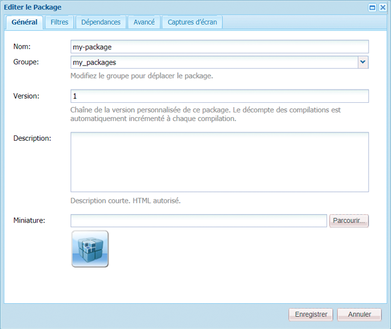

| **Champ** | **Description** |
|---|---|
| Nom | Nom du package. |
| Groupe | Nom du groupe auquel ajouter le package, pour l’organisation des packages. Saisissez le nom d’un nouveau groupe ou sélectionnez un groupe existant. |
| Version | Texte à utiliser pour la version personnalisée. |
| Description | Brève description du pack. Des balises HTML peuvent être utilisées pour la mise en forme. |
| Miniature | Icône qui apparaît avec la liste des packages. Cliquez sur Parcourir pour sélectionner un fichier local. |


<table>
 <tbody>
  <tr>
   <th><strong>Champ</strong></th>
   <th><strong>Description</strong></th>
   <th><strong>Format/Exemple</strong></th>
  </tr>
  <tr>
   <td>Nom</td>
   <td>Nom du fournisseur.</td>
   <td><em>AEM Geometrixx<br /> </em></td>
  </tr>
  <tr>
   <td>URL</td>
   <td>URL du fournisseur.</td>
   <td><em>https://www.aem-geometrixx.com</em></td>
  </tr>
  <tr>
   <td>Lien</td>
   <td>Lien spécifique au module vers une page de fournisseur.</td>
   <td><em>https://www.aem-geometrixx.com/mypackage.html</em></td>
  </tr>
  <tr>
   <td>Requiert<br /> </td>
   <td>
    <ul>
     <li>Admin : sélectionnez cette option lorsque le module ne peut être installé que par un compte disposant des droits d’administrateur.</li>
     <li>Redémarrer : sélectionnez cette option lorsque le serveur doit être redémarré après l’installation du module.</li>
    </ul> </td>
   <td> </td>
  </tr>
  <tr>
   <td>Traitement AC</td>
   <td><p>Indiquez comment les informations de contrôle d’accès définies dans le module sont traitées lors de son importation :</p>
    <ul>
     <li><strong>Ignorer</strong></li>
     <li><strong>Remplacer</strong></li>
     <li><strong>Fusionner</strong></li>
     <li><strong>Effacer</strong></li>
     <li><strong>FusionnerConserver</strong></li>
    </ul> <p>La valeur par défaut est <strong>Ignorer</strong>.</p> </td>
   <td>
    <ul>
     <li><strong>Ignorer</strong> - conserver les listes ACL dans le référentiel</li>
     <li><strong>Remplacer</strong> - remplacer les listes ACL dans le référentiel</li>
     <li><strong>Fusionner</strong> - fusionner les deux ensembles de listes ACL</li>
     <li><strong>Effacer</strong> - effacer les listes ACL</li>
     <li><strong>FusionnerConserver</strong> - fusionner le contrôle d’accès dans le contenu avec celui fourni avec le module en ajoutant les entrées de contrôle d’accès des entités non présentes dans le contenu</li>
    </ul> </td>
  </tr>
 </tbody>
</table>

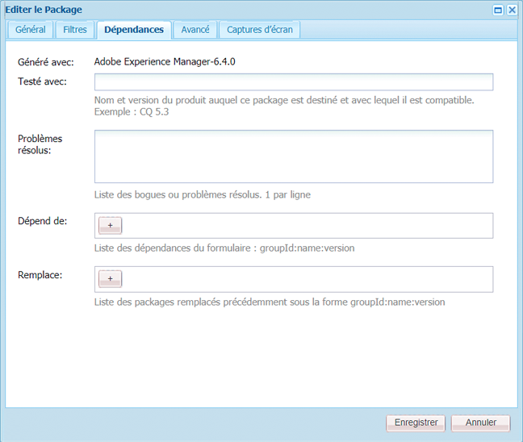

| **Champ** | **Description** | **Format/Exemple** |
|---|---|---|
| Testé avec | Nom du produit et version de ce pack ciblés ou compatibles avec. | *AEM 6* |
| Problèmes/bogues résolus | Champ de texte vous permettant de répertorier les détails des bogues corrigés avec ce paquet. Répertoriez chaque bogue sur une ligne distincte. | bug-nr summary |
| Dépend de | Répertorie les informations de dépendance qui doivent être respectées lorsque d&#39;autres packages sont nécessaires pour permettre l&#39;exécution du package actuel comme prévu. Ce champ est important lorsque vous utilisez des correctifs. | groupId:name:version |
| Remplace | Liste des packages obsolètes que ce package remplace. Avant de procéder à l’installation, assurez-vous que ce module contient tout le contenu nécessaire des modules obsolètes afin qu’aucun contenu ne soit remplacé. | groupId:name:version |

### Filtres de module {#package-filters}

Les filtres identifient les nœuds du référentiel à inclure dans le module. A **Filter Definition** specifies the following information:

* **Chemin d’accès racine** du contenu à inclure.
* **Règles** qui incluent ou excluent des noeuds spécifiques sous le chemin racine.

Les filtres peuvent ne comporter aucune règle ou en comporter plusieurs. Lorsqu’aucune règle n’est définie, le module contient tout le contenu sous le chemin d’accès racine.

Vous pouvez définir une ou plusieurs définitions de filtre pour un module. Utilisez plusieurs filtres pour inclure le contenu provenant de plusieurs chemins racine.

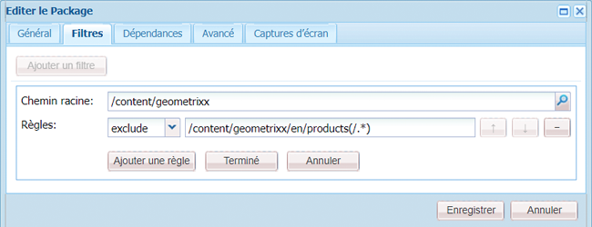

Le tableau ci-dessous décrit ces règles et fournit des exemples :

<table>
 <tbody>
  <tr>
   <th> Type de règle</th>
   <th>Description </th>
   <th>Exemple </th>
  </tr>
  <tr>
   <td> inclusion</td>
   <td>Vous pouvez définir un chemin ou utiliser une expression régulière pour spécifier tous les nœuds à inclure.<br /> <br /> L’inclusion d’un répertoire :
    <ul>
     <li>inclura ce répertoire <i>et</i> tous les fichiers et dossiers de ce répertoire (c’est-à-dire la sous-arborescence complète)</li>
     <li><strong>n’inclura pas</strong> d’autres fichiers ou dossiers sous le chemin d’accès racine spécifié</li>
    </ul> </td>
   <td>/libs/sling/install(/.*)? </td>
  </tr>
  <tr>
   <td> exclusion</td>
   <td>Vous pouvez spécifier un chemin d’accès ou utiliser une expression régulière afin de spécifier tous les nœuds à exclure.<br /> <br /> L’exclusion d’un répertoire exclut le répertoire en question et l’ensemble des fichiers <i>et</i> des dossiers de ce répertoire (c’est-à-dire la sous-arborescence entière).<br /> </td>
   <td>/libs/wcm/foundation/components(/.*)?</td>
  </tr>
 </tbody>
</table>

>[!NOTE]
>
>Un module peut contenir plusieurs définitions de filtre de manière à pouvoir combiner des nœuds de différents emplacements en un seul module.

Les filtres de module sont le plus souvent définis lorsque vous [créez le module](#creating-a-new-package), mais ils peuvent également être modifiés par la suite (après quoi le module doit être recréé).

### Captures d’écran de module {#package-screenshots}

Vous pouvez associer des captures d’écran au module afin de fournir une représentation visuelle du contenu, par exemple, en fournissant des captures d’écran de la nouvelle fonctionnalité.

### Icônes de module {#package-icons}

Vous pouvez également associer une icône au module afin de fournir une représentation visuelle de référence rapide du contenu du module. Elle est ensuite affichée dans la liste de modules et peut vous aider à identifier facilement le module ou la classe du module.

Dans la mesure où un module peut contenir une icône, les modules officiels suivent les conventions ci-dessous :

>[!NOTE]
>
>Pour éviter toute confusion, utilisez une icône descriptive pour le module et n’utilisez pas l’une des icônes officielles.

Module de correctif officiel :


Module d’installation ou d’extension d’AEM officiel :

Feature Packs officiels :


## Gestionnaire de modules {#package-manager}

Le Gestionnaire de modules gère les modules dans l’installation locale d’AEM. Après avoir [affecté les autorisations nécessaires](#permissions-needed-for-using-the-package-manager), vous pouvez utiliser le Gestionnaire de modules pour différentes actions, dont la configuration, la création, le téléchargement et l’installation des modules. Les principaux éléments à configurer sont les suivants :

* [Paramètres du module](#package-settings)
* [Filtres de module](#package-filters)

### Autorisations nécessaires à l’utilisation du Gestionnaire de modules {#permissions-needed-for-using-the-package-manager}

Pour accorder aux utilisateurs le droit de créer, de modifier, de charger et d’installer des modules, vous devez leur affecter les autorisations appropriées aux emplacements suivants :

* **/etc/packages (tous les droits à l’exception des droits de suppression)**
* nœud contenant le contenu du module

Pour plus d’informations sur la modification des autorisations, voir [Définition des autorisations](/help/sites-administering/security.md#setting-page-permissions).

### Création d’un module {#creating-a-new-package}

Pour créer une définition de module :

1. On the AEM Welcome screen, click **Packages** (or from the **Tools** console double-click on **Packages**).

1. Ensuite, sélectionnez **Gestionnaire de modules**.
1. Cliquez sur **Créer un package**.

   >[!NOTE]
   >
   >Si l’instance comporte de nombreux modules, il peut y avoir une arborescence en place afin de pouvoir accéder au dossier cible nécessaire avant de créer le module.

1. Dans la boîte de dialogue :

   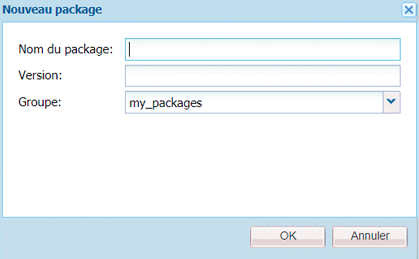

   Renseignez les champs :

   * **Nom du groupe**

      Nom du groupe cible (ou dossier). Les groupes vous aident à organiser vos modules.

       Si le dossier n’existe pas encore, il est créé pour le groupe. Si vous ne renseignez pas le nom du groupe, le module est créé dans la liste de modules principale (Accueil > Modules).

   * **Nom du module**

      Nom de votre nouveau pack. Sélectionnez un nom explicite pour vous aider (entre autres) à identifier facilement le contenu du module.

   * **Version**

       Champ de texte permettant d’indiquer une version. Il sera ajouté au nom du module pour former le nom du fichier ZIP.
   Cliquez sur **OK** pour créer le module.

1. AEM répertorie le nouveau package dans le dossier de groupe approprié.

   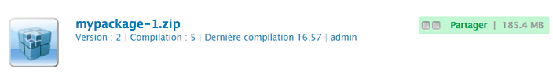

   Cliquez sur l’icône ou le nom du module à ouvrir.

   

   >[!NOTE]
   >
   >Vous pouvez revenir sur cette page ultérieurement, si nécessaire.

1. Cliquez sur **Modifier** pour modifier les paramètres du module [.](#package-settings)

   Ici, vous pouvez ajouter des informations et/ou définir certains paramètres, par exemple, une description, l’[icône](#package-icons), les bogues associés et ajouter des informations sur le fournisseur.

   Une fois que vous avez fini de modifier les paramètres, cliquez sur **OK**.

1. Ajoutez des **[captures d’écran](#package-screenshots)**au module, au besoin. Une seule instance est disponible lorsque le module est créé. Ajoutez-en davantage, si nécessaire, à l’aide de **Captures d’écran de module**à partir du Sidekick.

   Ajoutez l’image réelle en double-cliquant sur le composant Image dans la zone **Captures d’écran**, en ajoutant une image et en cliquant sur **OK**.

1. Définissez les **[filtres de module](#package-filters)**en faisant glisser des instances de la **définition de filtre**à partir du Sidekick, puis en double-cliquant pour l’ouvrir pour le modifier :

   

   Précisez les paramètres suivants :

   * **Chemin d’accès racine** Contenu à grouper. Il peut s’agir de la racine d’une sous-arborescence.
   * **Règles** Les règles sont facultatives. Pour des définitions de module simples, il n’est pas nécessaire de spécifier de règles d’inclusion ou d’exclusion.

       Si nécessaire, vous pouvez définir des règles d’[**inclusion **ou d’** exclusion **](#package-filters)afin de définir précisément le contenu d’un module.

       Ajoutez des règles à l’aide du symbole **+**. Vous pouvez également supprimer des règles à l’aide du symbole **-**. Les règles sont appliquées selon leur ordre, donc positionnez-les dans l’ordre de votre choix à l’aide des touches **haut** et **bas**.
   Ensuite, cliquez sur **OK** pour enregistrer le filtre.

   >[!NOTE]
   >
   >Vous pouvez utiliser autant de définitions de filtre que nécessaire, mais vous devez veiller à ce qu’elles n’entrent pas en conflit. Utilisez **Aperçu** pour confirmer le contenu du module.

1. Pour confirmer le contenu du module, vous pouvez utiliser **Aperçu**. Une exécution d’essai du processus de création est effectuée, et tout ce qui sera ajouté au module lors de sa création effective est répertorié.
1. Vous pouvez maintenant [créer](#building-a-package) votre module.

   >[!NOTE]
   >
   >Vous n’êtes pas tenu de créer le module à ce stade. Vous pouvez le faire ultérieurement.

### Création d’un module {#building-a-package}

Un module est souvent créé au moment où vous [créez la définition du module](#creating-a-new-package), mais vous pouvez y revenir ultérieurement pour créer ou recréer le module. Cela peut s’avérer utile si le contenu du référentiel a changé.

>[!NOTE]
>
>Avant de créer le module, il peut s’avérer utile de prévisualiser son contenu. To do this click **Preview**.

1. Ouvrez la définition de module à partir du **Gestionnaire de modules** (cliquez sur l’icône de module ou le nom du module).

1. Cliquez sur **Créer**. Une boîte de dialogue vous demande de confirmer que vous souhaitez créer le module.

   >[!NOTE]
   >
   >Cela a une importance particulière lorsque vous recréez un module, car le contenu du module est remplacé.

1. Cliquez sur **OK**. AEM crée le module, en répertoriant tout le contenu ajouté au module. Une fois l’opération terminée, AEM affiche un message de confirmation indiquant que le module a été créé et (lorsque vous fermez la boîte de dialogue) met à jour les informations de la liste de modules.

### Réencapsulation d’un module {#rewrapping-a-package}

Une fois qu’un module a été créé, il peut être réencapsulé, si nécessaire.

La réencapsulation modifie les informations du module, *sans* modifier le contenu du module. Les informations du module sont la vignette, la description, etc., en d’autres termes tous les paramètres que vous pouvez modifier dans la boîte de dialogue **Paramètres du module** (pour l’ouvrir, cliquez sur **Modifier**).

  La préparation d’un module pour le partage de modules représente un cas d’utilisation important de la réencapsulation. Par exemple, vous pouvez avoir un module existant et décider de le partager avec d’autres personnes. À cet effet, vous souhaitez ajouter une vignette et une description. Au lieu de recréer le module entier avec toutes ses fonctionnalités (ce qui peut prendre un certain temps et vous expose au risque que le module ne soit plus identique à l’original), vous pouvez le réencapsuler et ajouter simplement la vignette et la description.

1. Ouvrez la définition de module à partir du **Gestionnaire de modules** (cliquez sur l’icône de module ou le nom du module).

1. Cliquez sur **Modifier** et mettez à jour **[Paramètres du module](#package-settings)**, au besoin. Cliquez sur **OK**pour enregistrer.

1. Cliquez sur **Réencapsuler**. Une boîte de dialogue de confirmation s’affiche.

### Affichage et modification des informations de module {#viewing-and-editing-package-information}

Pour afficher ou modifier des informations sur une définition de module :

1. Dans le Gestionnaire de modules, accédez au module à afficher.
1. Cliquez sur l’icône de module du module à afficher. Cette action affiche la page du module qui répertorie les informations sur la définition du module:

   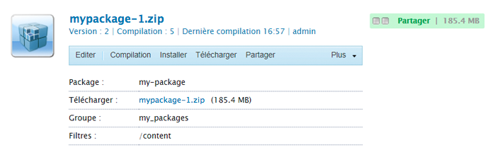

   >[!NOTE]
   >
   >À partir de cette page, vous pouvez également modifier et effectuer certaines opérations sur le module.
   >
   >Les boutons disponibles varient selon que le module a été créé ou non.

1. Si le module a déjà été créé, cliquez sur **Contenu**. Une fenêtre qui répertorie tout le contenu du module s’affiche :

### Affichage du contenu du module et test de l’installation {#viewing-package-contents-and-testing-installation}

Une fois un module créé, vous pouvez afficher son contenu :

1. Dans le Gestionnaire de modules, accédez au module à afficher.
1. Cliquez sur l’icône de module du module à afficher. Cette action affiche la page du module qui répertorie les informations sur la définition du module.

1. Pour afficher le contenu, cliquez sur **Contenu**. Une fenêtre qui répertorie tout le contenu du module s’affiche :

   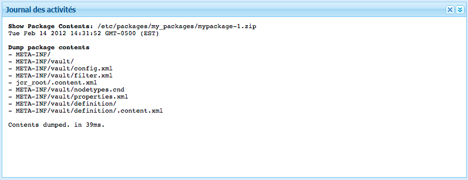

1. Pour effectuer une exécution d’essai de l’installation, cliquez sur **Tester l’installation**. Une fois que vous avez confirmé l’action, une fenêtre qui répertorie les résultats comme si la configuration avait été effectuée s’affiche :

   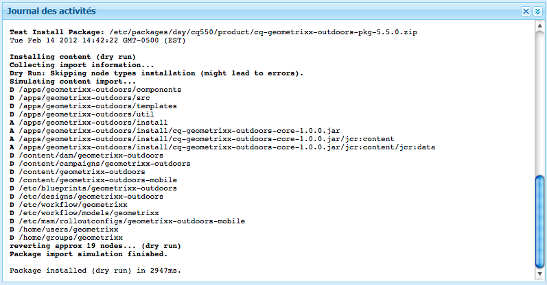

### Téléchargement des modules sur votre système de fichiers {#downloading-packages-to-your-file-system}

Cette section décrit comment télécharger un module d’AEM vers votre système de fichiers à l’aide du **Gestionnaire de modules**.

>[!NOTE]
>
>Pour plus d’informations sur le téléchargement des correctifs, des Feature Packs et des modules à partir de la zone publique et de la zone interne de votre entreprise du partage de modules, voir [Partage de modules](#package-share).
>
>À partir du partage de modules, vous pouvez :
>
>* Télécharger des modules du [partage de modules directement vers votre instance AEM locale](#downloading-and-installing-packages-from-package-share).
   >   Lors du téléchargement, le module est importé dans votre référentiel, après quoi vous pouvez l’installer immédiatement dans votre instance locale à l’aide du **Gestionnaire de modules**. Ces modules comportent des correctifs et d’autres modules partagés.
   >
   >
* Télécharger des modules du [partage de modules vers votre système de fichiers](#downloading-packages-to-your-file-system-from-package-share).
>


1. On the AEM Welcome screen, click **Packages**, then select **Package Manager**.
1. Accédez au module à télécharger.

   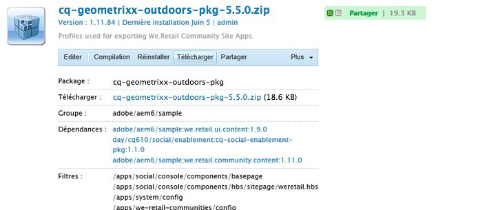

1. Cliquez sur le lien formé par le nom du fichier ZIP (souligné) pour le module à télécharger, par exemple, `export-for-offline.zip`.

   AEM télécharge le package sur votre ordinateur (à l’aide d’une boîte de dialogue de téléchargement standard du navigateur).

### Chargement des modules à partir du système de fichiers {#uploading-packages-from-your-file-system}

Un transfert de package vous permet de télécharger un package depuis votre système de fichiers vers AEM Package Manager.

>[!NOTE]
>
>See [Uploading packages to the company-internal Package Share](#uploading-packages-to-the-company-internal-package-share) to upload a package to your company&#39;s private area of Package Share.

Pour charger un module :

1. Accédez au **Gestionnaire de modules**. Accédez ensuite au dossier du groupe dans lequel vous souhaitez charger le module.

   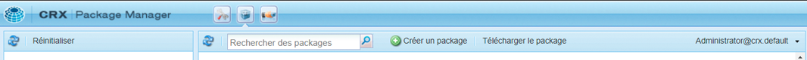

1. Cliquez sur **Charger un module**.

   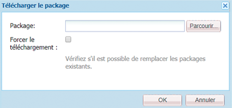

   * **File**

      **Vous pouvez soit taper directement le nom du fichier, soit utiliser la** fenêtre de navigation... pour sélectionner le package requis dans votre système de fichiers local (après sélection, cliquez sur **OK**).

   * **Forcer le téléchargement**

      Si un package portant ce nom existe déjà, vous pouvez cliquer sur ce lien pour forcer le téléchargement (et remplacer le package existant).
   Cliquez sur **OK** afin que le nouveau module soit chargé et répertorié dans la liste Gestionnaire de modules.

   >[!NOTE]
   >
   >Pour mettre le contenu à disposition dans AEM, veillez à [installer le module](#installing-packages).

### Validation de modules {#validating-packages}

Avant d’installer un module, vous pouvez vérifier son contenu. Because packages can modify overlaid files under `/apps` and/or add, modify, and remove ACLs, it is often useful to validate these changes before installing.

#### Options de validation {#validation-options}

Le mécanisme de validation permet de vérifier les caractéristiques suivantes du module :

* Importations de modules OSGi
* Recouvrements
* Listes ACL

Ces options sont détaillées ci-dessous.

* **Valider les importations de modules OSGi**

   **Éléments vérifiés**

   Cette option de validation inspecte le module afin de vérifier tous les fichiers JAR (lots OSGi), extrait leur fichier `manifest.xml` (qui contient les dépendances de version sur lesquelles repose le lot OSGi) et vérifie que l’instance AEM exporte les dépendances avec les versions correctes.

   **Comment sont-ils signalés ?**

   Any versioned dependencies that cannot be satisfied by the AEM instance are listed in the **Activity Log** of the Package Manager.

   **États d’erreur**

   Si les dépendances ne sont pas satisfaites, les lots OSGi du module avec ces dépendances ne démarrent pas. Cela entraîne un déploiement d’application interrompu, puisque tout ce qui repose sur le lot OSGi non démarré ne fonctionnera pas correctement.

   **Résolution d’erreurs**

   Pour résoudre des erreurs dues à des lots OSGi non satisfaits, il faut ajuster la version dépendante du lot avec des importations non satisfaites.

* **Valider les recouvrements**

   **Éléments vérifiés**

   Cette validation détermine si le module en cours d’installation contient un fichier déjà recouvert dans l’instance AEM de destination.

   For example, given an existing overlay at `/apps/sling/servlet/errorhandler/404.jsp`, a package that contains `/libs/sling/servlet/errorhandler/404.jsp`, such that it will change the existing file at `/libs/sling/servlet/errorhandler/404.jsp`.

   **Comment sont-ils signalés ?**

   Ces recouvrements sont décrits dans le **Journal d’activités** du Gestionnaire de modules.

   **États d’erreur**

   Un état d’erreur signifie que le module tente de déployer un fichier déjà recouvert. Les modifications du module seront donc remplacées (et donc masquées) par le recouvrement et ne prendront pas effet.

   **Résolution d’erreurs**

   To resolve this issue, the maintainer of the of the overlay file in `/apps` must review the changes to the overlaid file in `/libs` and incorporate the changes as needed into the overlay ( `/apps`), and redeploy the overlaid file.

   >[!NOTE]
   >
   >Notez que le mécanisme de validation ne permet pas de concilier le contenu superposé correctement incorporé dans le fichier d’incrustation. Par conséquent, cette validation continuera à signaler des conflits même après que les modifications nécessaires auront été apportées.

* **Valider les listes ACL**

   **Éléments vérifiés**

   Cette validation vérifie quelles autorisations sont ajoutées, comment elles seront gérées (fusion/remplacement) et si les autorisations actuelles seront affectées.

   **Comment sont-ils signalés ?**

   Les autorisations sont décrites dans le **Journal d’activités** du Gestionnaire de modules.

   **États d’erreur**

   Aucune erreur explicite ne peut être fournie. La validation indique simplement si de nouvelles autorisations des listes ACL seront ajoutées ou affectées par l’installation du module.

   **Résolution d’erreurs**

   Grâce aux informations fournies par la validation, les nœuds affectés peuvent être révisés dans CRXDE et les listes ACL peuvent être ajustées dans le module si besoin.

   >[!CAUTION]
   >
   >Il est recommandé que les modules n’affectent pas les listes ACL fournies par AEM, car cela pourrait entraîner un comportement inattendu du produit.

#### Validation {#performing-validation}

La validation des modules peut être effectuée de deux manières différentes :

* via l’interface utilisateur du Gestionnaire de modules ;
* via une requête HTTP POST, telle que cURL.

>[!NOTE]
>
>La validation doit toujours avoir lieu après le chargement du module, mais avant son installation.

**Validation de modules via le Gestionnaire de modules**

1. Open the Package Manager at `https://<server>:<port>/crx/packmgr`
1. Select the package in the list and then select **More** dropdown from the heading and then **Validate** from the drop-down menu.

   >[!NOTE]
   >
   >Cette opération doit être effectuée après le chargement du module de contenu, mais avant son installation.

1. Dans la boîte de dialogue modale qui s’affiche alors, utilisez les cases à cocher pour sélectionner le ou les types de validation et commencez la validation en cliquant sur **Valider**. Vous pouvez également cliquer sur **Annuler**.

1. La ou les validations sélectionnées sont ensuite réalisées. Les résultats sont affichés dans le Journal d’activités du Gestionnaire de modules.

**Validation de modules via une requête HTTP POST**

La requête POST se présente comme suit.

```
https://<host>:<port>/crx/packmgr/service.jsp?cmd=validate&type=osgiPackageImports,overlays,acls
```

>[!NOTE]
>
>Le paramètre `type` peut être n’importe quelle liste non triée séparée par des virgules qui comprend :
>
>* `osgiPackageImports`
>* `overlays`
>* `acls`
>
>
The value of `type` defaults to `osgiPackageImports` if not passed.

Voici un exemple illustrant comment exécuter la validation d’un module à l’aide de cURL.

1. Si vous utilisez cURL, exécutez une instruction semblable à celle-ci :

   ```shell
   curl -v -X POST --user admin:admin -F file=@/Users/SomeGuy/Desktop/core.wcm.components.all-1.1.0.zip 'http://localhost:4502/crx/packmgr/service.jsp?cmd=validate&type=osgiPackageImports,overlays,acls'
   ```

1. La validation demandée est exécutée et la réponse est renvoyée sous forme d’objet JSON.

>[!NOTE]
>
>La réponse à une requête de validation HTTP POST sera un objet JSON avec les résultats de la validation.

### Installation des modules {#installing-packages}

Après avoir chargé un module, vous devez installer le contenu. Pour que le contenu du module soit installé et opérationnel, il doit être :

* loaded into AEM (either [uploaded from your filesystem](#uploading-packages-from-your-file-system) or [downloaded from package share](#downloading-and-installing-packages-from-package-share))

* installé.

>[!CAUTION]
>
>L’installation d’un module peut remplacer ou supprimer le contenu existant. Ne chargez un module que si vous êtes sûr qu’il ne supprime ou ne remplace pas du contenu dont vous avez besoin.
>
>Pour afficher le contenu ou l’impact d’un module, vous pouvez :
>
>* Effectuez un test d’installation du package sans modifier le contenu :
   >  Ouvrez le package (cliquez sur l’icône ou le nom du package) et cliquez sur **Tester l’installation**.
   >
   >
* Consultez la liste des contenus des packages :
   >  Ouvrez le package et cliquez sur **Contenu**.
>


>[!NOTE]
>
>Juste avant l’installation du module, un module d’instantané est créé pour contenir le contenu qui va être remplacé.
>
>Cet instantané est réinstallé lorsque vous désinstallez le module.

>[!CAUTION]
>
>Si vous installez des ressources numériques, vous devez effectuer les opérations suivantes :
>
>* Tout d’abord, désactivez WorkflowLauncher.
   >  Use the Components menu option of the OSGi console to deactivate `com.day.cq.workflow.launcher.impl.WorkflowLauncherImpl`.
   >
   >
* Ensuite, une fois l’installation terminée, réactivez WorkflowLauncher.
>
>
La désactivation de WorkflowLauncher permet de s’assurer que la structure d’importation d’actifs ne manipule pas (involontairement) les actifs lors de l’installation.

1. Dans le Gestionnaire de modules, accédez au module à installer.

   Un bouton **Installer** s’affiche à côté des modules qui n’ont pas encore été installés.

   >[!NOTE]
   >
   >Vous pouvez également ouvrir le module en cliquant sur l’icône associée pour accéder au bouton **Installer**.

1. Pour commencer l’installation, cliquez sur **Installer**. Une boîte de dialogue vous invite à confirmer et répertorie toutes les modifications apportées. Lorsque vous avez terminé, cliquez sur **Fermer** dans la boîte de dialogue.

   Le mot **Installé** s’affiche en regard du module une fois qu’il a été installé.

### Chargement et installation basés sur le système de fichiers {#file-system-based-upload-and-installation}

Il existe une autre façon de charger et d’installer des modules sur votre instance. Dans votre système de fichiers, un dossier `crx-quicksart` avec votre fichier JAR et le fichier `license.properties`. You need to create a folder named `install` under `crx-quickstart`. Vous aurez alors quelque chose comme ça : `<aem_home>/crx-quickstart/install`

Dans ce dossier d’installation, vous pouvez ajouter directement des modules. Ils sont chargés et installés automatiquement sur votre instance. Une fois l’opération terminée, vous pouvez afficher les modules dans le Gestionnaire de modules.

Si votre instance est en cours d’exécution, l’ajout d’un module au dossier `install` lance directement le chargement et l’installation sur l’instance. Si votre instance n’est pas en cours d’exécution, les modules que vous placez dans le dossier `install` sont installés au démarrage dans l’ordre alphabétique.

>[!NOTE]
>
>Vous pouvez également effectuer cette opération avant de démarrer l’instance pour la première fois. À cet effet, vous devez créer manuellement le dossier `crx-quickstart`, créer le dossier `install` en dessous et y placer les modules. Lorsque vous lancez votre instance pour la première fois, les modules sont installés dans l’ordre alphabétique.

### Désinstallation des modules {#uninstalling-packages}

AEM vous permet de désinstaller des packages. Cette action renvoie le contenu concerné du référentiel vers l’instantané enregistré juste avant l’installation des modules.

>[!NOTE]
>
>Lors de l’installation, un module d’instantané contenant le contenu qui va être remplacé est créé.
>
>Ce module est réinstallé lorsque vous désinstallez le module.

1. Dans le Gestionnaire de modules, accédez au module à désinstaller.
1. Cliquez sur l’icône de module du module à désinstaller.
1. Pour supprimer le contenu de ce module du référentiel, cliquez sur **Désinstaller**. Une boîte de dialogue vous invite à confirmer et répertorie toutes les modifications apportées. Lorsque vous avez terminé, cliquez sur **Fermer** dans la boîte de dialogue.

### Suppression des modules {#deleting-packages}

Pour supprimer un module dans les listes du Gestionnaire de modules :

>[!NOTE]
>
>Les fichiers/nœuds installés du module ne sont **pas** supprimés.

1. In the **Tools** console, expand the **Packages** folder to show your package in the right-hand pane.

1. Cliquez sur le module à supprimer afin de le sélectionner, puis :

   * Click **Delete** in the toolbar menu.
   * Cliquez avec le bouton droit de la souris et sélectionnez **Supprimer**.
   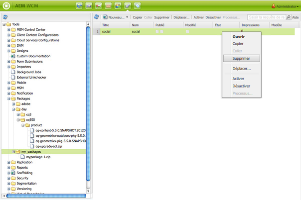

1. AEM vous demande de confirmer la suppression du package. Cliquez sur **OK** pour confirmer la suppression.

>[!CAUTION]
>
>Si ce module a déjà été installé, le contenu *installé* n’est **pas** supprimé.

### Réplication des modules {#replicating-packages}

Répliquez le contenu d’un module afin de l’installer dans l’instance de publication :

1. Dans le **Gestionnaire de modules**, accédez au module à répliquer.

1. Cliquez sur l’icône de module ou le nom du module à répliquer pour le développer.
1. Dans le menu déroulant **Plus** de la barre d’outils, sélectionnez **Répliquer**.

## Partage de modules {#package-share}

Le partage de modules est un serveur centralisé disponible publiquement pour partager des modules de contenu.

Avec le partage de modules, vous pouvez télécharger ces modules, qui peuvent inclure des correctifs officiels, des ensembles de fonctionnalités, des mises à jour ou des exemples de contenu générés par d’autres utilisateurs.

Vous pouvez également charger et partager des modules au sein de votre entreprise.

### Accès au partage de modules {#access-to-package-share}

Il n’y a pas d’accès anonyme au partage de modules. En d’autres termes, seuls les utilisateurs enregistrés ont l’autorisation d’afficher, de télécharger et de charger des modules.

L’accès au partage de modules est disponible pour nos partenaires et nos clients. Les détails d’enregistrement doivent être envoyés pour que des droits d’accès soient affectés.

Pour accéder au partage de modules :

* Utilisez la [Page de connexion](#signing-in-to-package-share).
* La première fois que vous utilisez la page de connexion :

   * Vous devez vous [enregistrer pour obtenir un Adobe ID](#registering-for-package-share) et/ou [valider votre Adobe ID existant](#validating-your-adobe-id)
   * afin de pouvoir créer votre [compte de partage de modules](#package-share-account).

>[!NOTE]
>
>Any Package Share user that has not been assigned to a customer, must join a community to see those resources by clicking **Join** next to the package share login.

#### Connexion au partage de modules {#signing-in-to-package-share}

1. On the AEM Welcome screen, click **Tools**.
1. Ensuite, sélectionnez **Partage de modules**. Vous devrez :

   * vous connecter à l’aide de votre Adobe ID ;
   * [ou créer un Adobe ID](#registering-for-package-share).
   >[!NOTE]
   >
   >La première fois que vous vous connectez avec votre Adobe ID, vous devez faire [valider votre adresse électronique](#validating-your-adobe-id).

   >[!NOTE]
   >
   >Si vous avez oublié votre mot de passe, utilisez le lien [Pages de l’aide](https://enterprise-dev.adobe.com/content/edev/en/registration/account.html) (disponible également dans la boîte de dialogue Se connecter).

#### Validation de votre Adobe ID {#validating-your-adobe-id}

La première fois que vous vous connectez au partage de modules avec votre Adobe ID, votre adresse électronique est validée.

1. Vous recevez un courrier électronique contenant un lien.
1. Vous devez cliquer sur ce lien.
1. Une page web s’affiche.

   L’affichage de cette page web est considéré comme validation.

1. La connexion se poursuit.

1. Vous recevez un courrier électronique contenant un lien.
1. Vous devez cliquer sur ce lien.
1. Une page web s’affiche. L’affichage de cette page web est considéré comme validation.
1. La connexion se poursuit.

#### Enregistrement pour le partage de modules {#registering-for-package-share}

Si vous devez accéder au partage de modules, vous devez vous enregistrer afin d’obtenir un Adobe ID :

* La [page de connexion du partage de modules](#signing-in-to-package-share) contient un lien pour enregistrer un Adobe ID.
* Vous pouvez vous enregistrer pour obtenir un Adobe ID à partir de certains logiciels de bureau Adobe.
* Vous pouvez également vous enregistrer en ligne dans la [page de connexion d’Adobe](https://www.adobe.com/cfusion/membership/index.cfm?nf=1&nl=1).

Il est possible de créer un Adobe ID en indiquant :

* votre adresse électronique
* le mot de passe de votre choix
* des informations supplémentaires, comme votre nom et votre pays de résidence

#### Compte de partage de modules {#package-share-account}

La validité de votre application est vérifiée avant que :

* votre compte utilisateur soit créé avec les autorisations exigées/admises ;
* votre compte soit ajouté au groupe de votre entreprise.

>[!NOTE]
>
>Un utilisateur de l’une de nos entreprises partenaire peut également être membre des groupes de ses clients.

#### Considérations relatives au réseau {#network-considerations}

**IPv6**

Vous pouvez rencontrer des problèmes lors de la tentative d’accès au partage de modules dans un environnement IPv6 exclusif.

Cela est dû au fait que le partage de modules est un service hébergé sur un serveur, ce qui signifie que votre connexion est établie par le biais de différents réseaux sur Internet. Il n’est pas garanti que tous les réseaux prennent en charge le protocole IPv6. S’ils ne le prennent pas en charge, la connexion peut échouer.

Pour éviter ce problème, vous pouvez accéder au partage de modules à partir d’un réseau IPv4, télécharger le module, puis le charger dans l’environnement IPv6.

**Serveur proxy HTTP**

Le partage de modules est actuellement indisponible si votre entreprise exécute un serveur proxy HTTP nécessitant une authentification.

Le partage de modules n’est disponible que lorsque votre serveur AEM a accès à Internet sans avoir à s’authentifier. Pour configurer le serveur proxy pour tous les services qui utilisent le client HTTP (dont le partage de modules), utilisez la [configuration OSGi du lot Day Commons HTTP Client 3.1](/help/sites-deploying/osgi-configuration-settings.md).

### À l’intérieur du partage de modules {#inside-package-share}

Dans le partage de modules, les modules sont organisés en sous-arborescences de l’arborescence :

* Modules Adobe fournis par Adobe.
* Modules partagés fournis par d’autres entreprises et conversions publiques par Adobe.
* Modules d’entreprise, qui sont privés.

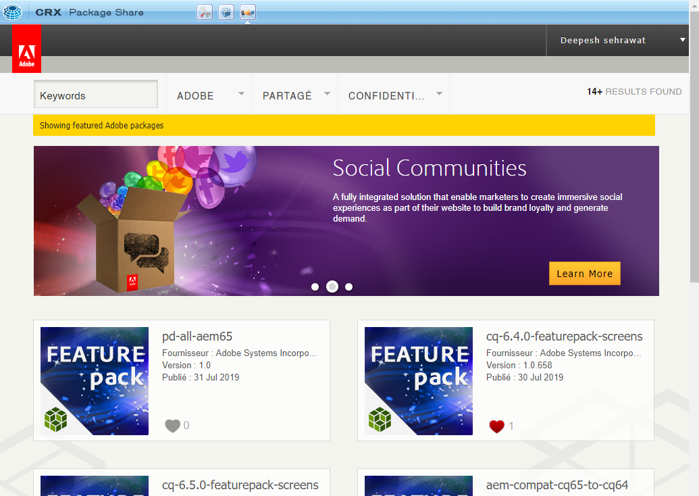

### Recherche et filtrage des modules {#searching-and-filtering-packages}

Le partage de modules comporte une barre de recherche, que vous pouvez utiliser pour chercher des mots-clés ou/et des balises spécifiques. Les mots-clés et les balises prennent en charge les valeurs multiples.

* Pour rechercher plusieurs mots-clés, vous devez les séparer par un espace.
* Pour rechercher plusieurs balises, vous devez toutes les sélectionner dans les arborescences de modules.

Vous pouvez également remplacer l’opérateur conditionnel OU par ET à droite de la barre de récapitulatif des filtres.

### Téléchargement et installation de modules à partir du partage de modules {#downloading-and-installing-packages-from-package-share}

Pour télécharger des modules à partir du partage de modules et les installer sur votre instance locale, il est plus facile d’accéder au partage de modules de votre instance AEM. Le module est alors téléchargé et enregistré immédiatement dans votre Gestionnaire de modules, à partir duquel vous pouvez l’installer.

1. Dans l’écran d’accueil d’AEM, cliquez sur **Outils**, puis sélectionnez **Partage de modules** pour ouvrir la page Partage de modules.
1. À l’aide des informations de votre compte, connectez-vous au partage de modules. La page d’entrée, qui contient le dossier Adobe, le dossier partagé et un dossier propre à votre entreprise, s’affiche.

   >[!NOTE]
   >
   >Avant de commencer à télécharger des modules du partage de modules, assurez-vous que vous disposez des droits d’[accès exigés](#access-to-package-share).

1. Accédez au module à télécharger et cliquez sur **Télécharger**.

1. Revenez en arrière ou accédez au **Gestionnaire de modules** sur votre instance AEM. Ensuite, accédez au module que vous venez de télécharger.

   >[!NOTE]
   >
   >Pour trouver le module que vous avez téléchargé, suivez le chemin d’accès utilisé dans le partage de modules. Par exemple, si vous avez téléchargé un module à partir du chemin d’accès ci-dessous dans le partage de modules :
   >
   >**Modules** > **Public** > **Correctifs**
   Ensuite, dans le Gestionnaire de modules sur votre instance locale, le module s’affiche également sous :
   **Modules** > **Public** > **Correctifs**

1. Cliquez sur **Installer** pour installer le module sur votre installation AEM locale.

   >[!NOTE]
   Si le module a déjà été installé sur votre instance, l’indicateur **Installé** s’affiche en regard du module à la place du bouton **Installer**.

   >[!CAUTION]
   L’installation d’un module peut remplacer le contenu existant dans le référentiel. Par conséquent, il est recommandé de commencer par effectuer un **test de l’installation**. Cela vous permet de vérifier si le contenu du module contient des conflits avec le contenu existant.

### Téléchargement des modules du partage de modules vers votre système de fichiers {#downloading-packages-to-your-file-system-from-package-share}

Le [téléchargement et l’installation](#downloading-and-installing-packages-from-package-share) sont très pratiques, mais, si nécessaire, vous pouvez également télécharger le module et l’enregistrer dans votre système de fichiers local :

1. Dans le partage de modules, cliquez sur l’icône de module ou le nom du module.
1. Cliquez sur l’onglet **Actifs**.
1. Cliquez sur **Télécharger sur le disque**.

### Chargement d’un module {#uploading-a-package}

Avec le partage de modules, vous pouvez charger des modules dans la zone interne de votre entreprise dans le partage de modules. Cela permet de les mettre à disposition pour les partager au sein de votre entreprise.

Ces modules ne sont *pas* disponibles pour la communauté AEM générale, mais sont disponibles pour tous les utilisateurs enregistrés dans votre entreprise.

Pour charger des modules dans le partage de modules interne de votre entreprise :

>[!CAUTION]
Pour charger un module dans le partage de modules, vous devez d’abord créer un dossier de groupe qui porte le même nom que votre entreprise sur le Gestionnaire de modules local. Par exemple, geometrixx. Tous les modules à charger pour le partage doivent être placés dans ce dossier de groupe.
Les modules de la liste principale du gestionnaire de modules ou dans d’autres dossiers ne peuvent pas être partagés.

1. Ouvrez le **gestionnaire de modules** et accédez au module à charger.

1. Cliquez sur l’icône de module pour ouvrir le module.
1. Cliquez sur **Partager** pour afficher la boîte de dialogue pour charger le module dans le partage de modules.
1. Si vous n’êtes pas encore connecté au partage de modules, vous devez saisir vos informations d’identification de connexion.

   Lorsque vous êtes connecté, AEM affiche les détails du module à télécharger :

   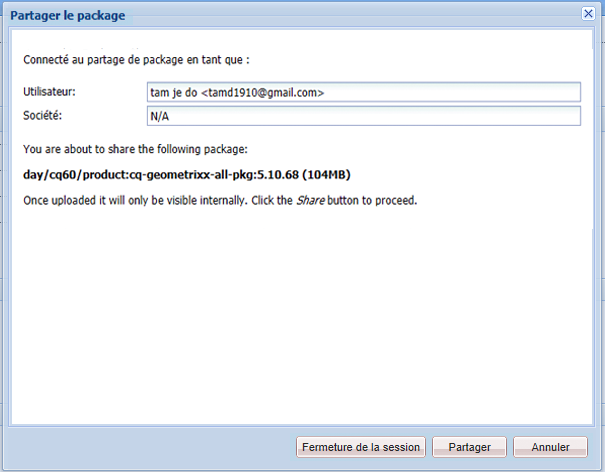

1. Pour charger le module dans le partage de modules interne de votre entreprise, cliquez sur **Partager**.

   AEM affiche le statut et indique lorsque le chargement du module est terminé, après quoi vous pouvez cliquer sur **x** (coin supérieur droit) pour fermer la fenêtre **Partager un module**.

1. Une fois le chargement terminé, vous pouvez accéder au dossier interne de votre entreprise pour afficher le module que vous venez de partager.

>[!NOTE]
Pour modifier un module disponible dans le partage de modules, vous devez le télécharger, le recréer, puis le recharger dans le partage de modules.

### Suppression d’un module {#deleting-a-package}

Vous ne pouvez supprimer que les modules que vous avez téléchargés en procédant comme suit :

1. Dans l’arborescence de votre entreprise, examinez le groupe de modules contenant le module.
1. Cliquez sur le module.
1. Cliquez sur le bouton Supprimer.

   

1. Click **Delete** to confirm you want to delete the package.

### Définition des modules comme modules semi-privés {#making-packages-semi-private}

Vous pouvez partager des modules en dehors de votre entreprise, mais pas publiquement. Ces modules sont considérés comme des modules semi-privés. Pour partager ces modules semi-privés, vous avez besoin de l’aide du support Adobe. À cet effet, ouvrez un ticket auprès du support Adobe en demandant qu’un module soit disponible en dehors de votre entreprise. Ils vous demanderont une liste des ID Adobe que vous souhaitez autoriser à accéder à vos packs.

## Distribution de logiciels (bêta) {#software-distribution-beta}

[Software Distribution](https://downloads.experiencecloud.adobe.com) est la nouvelle interface utilisateur conçue pour simplifier la recherche et le téléchargement de packs AEM. Il est actuellement en version bêta et n’est accessible qu’aux clients d’Adobe Managed Services et d’AEM en tant que clients du service Cloud, ainsi qu’aux employés d’Adobe.

>[!NOTE]
* [Package Share](#package-share) restera en activité jusqu’à ce que tous les clients aient accès à Software Distribution.
* Tous les packages sont disponibles à partir du partage de packages et de la distribution de logiciels.


>[!CAUTION]
Le gestionnaire de packages AEM n’est pas utilisable avec la distribution de logiciels pour le moment, vous téléchargez vos packages sur votre disque local.

