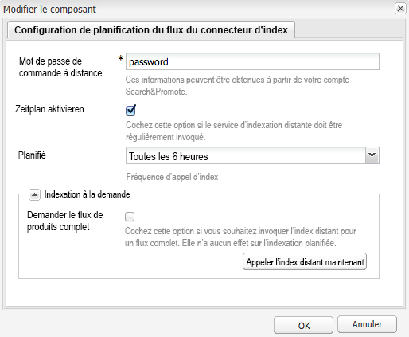

# Flux de produit {#product-feed}

AEM integrates with [Search&amp;Promote](https://www.adobe.com/solutions/testing-targeting/searchandpromote.html) and allows you to:

* d’utiliser l’API eCommerce, indépendamment de la structure de référentiel et de la plateforme de commerce sous-jacentes ;
* de tirer parti de la fonction de connecteur d’index de Search&amp;Promote pour constituer un flux de produit au format XML ;
* de tirer parti de la fonction de contrôle à distance de Search&amp;Promote pour effectuer des requêtes à la demande ou planifiées du flux de produit ;
* de générer des flux pour différents comptes Search&amp;Promote, configurés comme configurations de services cloud.

You need to have a valid account and to [configure the connection to Search&amp;Promote](/help/sites-administering/search-and-promote.md#configuring-the-connection-to-search-promote). You also have to verify that you are using the correct [data center](/help/sites-administering/search-and-promote.md#configuring-the-data-center) and make sure that the **Remote server URI **is configured.

## Configuration du flux de produit {#set-up-the-product-feed}

Vous devez d’abord saisir une racine de site web et un attribut d’identifiant. Pour ce faire :

1. Accédez à la configuration de Search&amp;Promote.
1. Cliquez sur **[!UICONTROL Modifier]**.
1. Cliquez sur l’onglet **[!UICONTROL Configuration des flux du connecteur d’index]**.
1. Enter the **[!UICONTROL Web site root]** and **[!UICONTROL Identifier attribute]**.

   >[!NOTE]
   >
   >The **[!UICONTROL Web site root]** is the root of your eCommerce website, for example `/content/geometrixx-outdoors/en`.
   >
   >The **[!UICONTROL Identifier attribute]** is a JCR property that uniquely identifies the product: `identifier`.

1. Cliquez sur **[!UICONTROL OK]**.

Vous devez également modifier deux configurations dans la console web pour générer des flux de produit.

### Configuration de la mise en œuvre du moteur de recherche de produits Search&amp;Promote Day CQ pour Geometrixx {#configuring-the-day-cq-search-promote-products-crawler-implementation-for-geometrixx}

1. Accédez à [http://localhost:4502/system/console/configMgr](http://localhost:4502/system/console/configMgr).
1. Cliquez sur **[!UICONTROL Configuration de la mise en œuvre du moteur de recherche de produits Search&amp;Promote Day CQ pour Geometrixx]**.
1. Spécifiez le numéro de compte Search&amp;Promote auquel ce moteur de recherche est lié. Il sera utilisé pour rechercher une configuration de services cloud utilisée par ce moteur de recherche.
1. Cliquez sur **[!UICONTROL Enregistrer]**.

### Configuration du générateur de flux de produits Search&amp;Promote Day CQ pour Geometrixx {#configuring-the-day-cq-search-promote-products-feed-generator-for-geometrixx}

1. Accédez à [http://localhost:4502/system/console/configMgr](http://localhost:4502/system/console/configMgr).
1. Cliquez sur **[!UICONTROL Configuration de la mise en œuvre du générateur de flux de produits Search&amp;Promote Day CQ pour Geometrixx]**.
1. Spécifiez le numéro de compte Search&amp;Promote auquel ce générateur est lié. Il sera utilisé pour rechercher une configuration de services cloud utilisée par ce générateur.
1. Cliquez sur **[!UICONTROL Enregistrer]**.

## Planification du flux de produit {#schedule-the-product-feed}

Pour activer la génération de flux planifiée, vous devez configurer le planificateur.
Un planificateur est configuré comme configuration enfant de votre configuration de services cloud de Search&amp;Promote.

1. Accédez à la configuration de Search&amp;Promote.
1. Cliquez sur **[!UICONTROL +]** en regard de **[!UICONTROL Configuration du planificateur]**.
1. Enter a **[!UICONTROL Title]** that is recognizable to page authors, and a unique **[!UICONTROL Name]**.
1. Cliquez sur **[!UICONTROL Créer]**. Une boîte de dialogue s’ouvre.

   

1. Enter the **[!UICONTROL Remote Control Password]**. Il s’agit du mot de passe que vous avez configuré dans votre compte Search&amp;Promote.

   >[!NOTE]
   >
   >Il ne s’agit pas du mot de passe de votre compte Search&amp;Promote. You can find and change this password by logging into your Search&amp;Promote account and going to **[!UICONTROL Index]** and then to **[!UICONTROL Remote control]**.

1. Cochez la case **[!UICONTROL Activer la planification]**.
1. Sélectionnez une **[!UICONTROL planification]**. Il s’agit de la planification de génération de flux.
1. Cochez ou non **[!UICONTROL Indexation à la demande]**. Cette fonction sert à appeler manuellement l’index Search&amp;Promote. If **[!UICONTROL Request full products feed]** is checked, Search&amp;Promote will request a full products feed. Dans le cas contraire, un flux de produits incrémentiel est demandé.

   >[!NOTE]
   >
   >La fonction d’indexation à la demande utilise la fonction de contrôle à distance de Search&amp;Promote. Lorsqu’une d’indexation distante est appelée, l’indexation ne commence pas immédiatement, mais une requête d’indexation est publiée vers Search&amp;Promote à l’aide de la fonction de contrôle à distance.

1. Cliquez sur **[!UICONTROL OK]**.

Now that you configured everything, you can see an XML page containing all the products under the configured web site root: [http://localhost:4502/etc/commerce/searchpromote/feed/full](http://localhost:4502/etc/commerce/searchpromote/feed/full).
