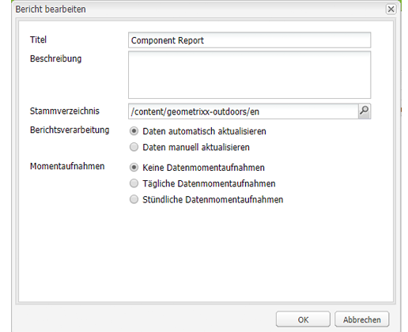

# Création de rapports {#reporting}

Pour vous aider à analyser et surveiller l’état de votre instance, Adobe Experience Manager (AEM) propose une sélection de rapports par défaut, qui peut être configuré en fonction de vos besoins :

* [Rapport de composants](#component-report)
* [Utilisation du disque](#disk-usage)
* [Contrôle de l’intégrité](#health-check)
* [Rapport d’activité de la page](#page-activity-report)
* [Rapport de contenu généré par l’utilisateur et l&#39;utilisatrice.](#user-generated-content-report)
* [Rapport de l’utilisateur](#user-report)
* [Rapport d’instance de workflow](#workflow-instance-report)
* [Rapport de workflow](#workflow-report)

>[!NOTE]
>
>Ces rapports ne sont disponibles que dans l’interface utilisateur classique. Pour la surveillance du système et la création de rapports dans l’interface utilisateur moderne, consultez la section [Tableau de bord des opérations.](/help/sites-administering/operations-dashboard.md)

Tous ces rapports sont accessibles à partir de la console **Outils**. Sélectionnez **Rapports** dans le volet de gauche, puis double-cliquez sur le rapport dans le volet de droite pour l’ouvrir afin de l’afficher ou de le configurer ou les deux.

De nouvelles instances d’un rapport peuvent également être créées à partir de la console **Outils**. Sélectionnez **Rapports** dans le panneau de gauche, puis **Nouveau** dans la barre d’outils. Définissez un **Titre** et un **Nom**, sélectionnez le type de rapport dont vous avez besoin, puis cliquez sur **Créez**. Votre nouvelle instance de rapport apparaît dans la liste. Double-cliquez pour l’ouvrir, puis faites glisser un composant du sidekick pour créer la première colonne et commencer la définition du rapport.

>[!NOTE]
>
>En plus des rapports d’AEM standards prêts à l’emploi, vous pouvez [développer vos propres (nouveaux) rapports](/help/sites-developing/dev-reports.md).

## Principes de base de la personnalisation des rapports {#the-basics-of-report-customization}

Divers formats de rapport sont disponibles. Les rapports suivants utilisent tous des colonnes qui peuvent être personnalisées comme indiqué dans les sections suivantes :

* [Rapport de composants](#component-report)
* [Rapport d’activité de la page](#page-activity-report)
* [Rapport de contenu généré par l’utilisateur et l&#39;utilisatrice.](#user-generated-content-report)
* [Rapport de l’utilisateur](#user-report)
* [Rapport d’instance de workflow](#workflow-instance-report)

>[!NOTE]
>
>Les rapports suivants comportent chacun leur propre format et leur propre personnalisation :
>
>
>* Le rapport [Contrôle de l’intégrité](#health-check) utilise des champs de sélection pour spécifier les données sur lesquelles vous souhaitez générer des rapports.
>* [Utilisation du disque](#disk-usage) utilise des liens pour parcourir la structure du référentiel.
>* [Workflow](/help/sites-administering/reporting.md#workflow-report) donne un aperçu des workflows exécutés sur votre instance.
>
>Les procédures suivantes concernant la configuration de colonne ne sont donc pas appropriées. Consultez la description de chaque rapport pour plus de détails.

### Sélection et positionnement des colonnes de données. {#selecting-and-positioning-the-data-columns}

Vous pouvez ajouter, repositionner ou supprimer des colonnes de n’importe quel rapport, standard ou personnalisé.

L&#39;onglet **Composants** du sidekick (disponible sur la page du rapport) répertorie toutes les catégories de données qui peuvent être sélectionnées en tant que colonnes.

Pour modifier la sélection des données :

* Pour ajouter une nouvelle colonne, faites glisser le composant requis à partir du sidekick et déposez-le dans la position souhaitée.

   * Une coche verte indique quand la position est valide et une double flèche indique exactement où elle est placée.
   * Un symbole rouge indique quand la position n’est pas valide.

* Pour déplacer une colonne, cliquez sur l’en-tête, maintenez le bouton de la souris enfoncé et faites-la glisser vers la nouvelle position.
* Pour supprimer une colonne, cliquez sur le titre de la colonne, maintenez le bouton de la souris enfoncé et faites-la glisser dans la zone d’en-tête du rapport (un signe moins rouge indique que la position n’est pas valide). Relâchez le bouton de la souris. La boîte de dialogue Supprimer les composants vous invite alors à confirmer la suppression de la colonne.

### Menu déroulant Colonne {#column-drop-down-menu}

Chaque colonne du rapport comprend un menu déroulant. Ce menu apparaît lorsque le curseur de la souris se trouve au-dessus de la cellule du titre de colonne.

Une flèche s’affiche à l’extrémité droite de la cellule du titre (à ne pas confondre avec la flèche située immédiatement à droite du texte de titre et qui indique le [mécanisme de tri actuel](#sorting-the-data)).

Les options disponibles dans le menu dépendent de la configuration de la colonne (telle que définie lors du développement de projet). Toutes les options non valides sont grisées.

### Tri des données {#sorting-the-data}

Les données peuvent être triées selon une colonne spécifique. Pour cela :

* Cliquez sur l’en-tête de colonne voulu. Le tri bascule entre un ordre croissant et un ordre décroissant, indiqué par une flèche en regard du texte de titre.
* Utilisez le [menu déroulant de la colonne](#column-drop-down-menu) pour sélectionner spécifiquement le **Tri croissant** ou le **Tri décroissant**. Là encore, une flèche s’affiche en regard du texte du titre.

### Groupes et graphique des données actuelles {#groups-and-the-current-data-chart}

Sur les colonnes appropriées, vous pouvez sélectionner **Groupe par cette colonne** dans le [menu déroulant de la colonne](#column-drop-down-menu). Cela a pour effet de regrouper les données selon chaque valeur distincte dans cette colonne. Vous pouvez sélectionner plusieurs colonnes à regrouper. L’option est grisée lorsque les données de la colonne ne sont pas appropriées. En d’autres termes, chaque entrée est distincte et unique, de sorte qu’aucun groupe ne peut être formé. Par exemple, la colonne ID utilisateur du rapport utilisateur.

Lorsqu’au moins une colonne a été regroupée, un diagramme circulaire des **données actuelles** est généré en fonction de ce regroupement. Si plusieurs colonnes sont regroupées, cela est également indiqué sur le diagramme.

Placez le pointeur de la souris au-dessus du diagramme circulaire pour afficher la valeur agrégée du segment approprié. Cette méthode utilise l’agrégat actuellement défini dans la colonne ; par exemple, nombre, minimum, moyenne, entre autres.

### Filtres et agrégats {#filters-and-aggregates}

Sur les colonnes appropriées, vous pouvez également configurer les **Paramètres de filtre** et/ou les **Agrégats** à partir du [menu déroulant de la colonne](#column-drop-down-menu).

#### Filtres {#filters}

Les paramètres de filtre vous permettent de spécifier les critères des entrées à afficher. Les opérateurs disponibles sont les suivants :

* `contains`
* `equals`

Pour définir un filtre :

1. Sélectionnez l’opérateur de votre choix dans la liste déroulante.
1. Saisissez le texte à filtrer.
1. Cliquez sur **Appliquer**.

Pour désactiver le filtre :

1. Supprimez le texte du filtre.
1. Cliquez sur **Appliquer**.

#### Agrégats {#aggregates}

Vous pouvez également sélectionner une méthode d’agrégation (elle peut varier en fonction de la colonne sélectionnée) :

### Propriétés de colonne {#column-properties}

Cette option est uniquement disponible lorsque la [Colonne générique](#generic-column) a été utilisée dans le [Rapport de l’utilisateur](#user-report).

### Données historiques {#historic-data}

Un graphique des changements survenant dans vos données au fil du temps est visible dans les **Données historiques**. Il est dérivé des instantanés réalisés à intervalles réguliers.

Les données sont :

* Collectées par la première colonne triée (le cas échéant), sinon par la première colonne (non regroupées).
* Regroupées par la colonne appropriée.

Le rapport peut être généré :

1. Définissez **Regroupement** sur la colonne obligatoire.
1. **Modifiez** la configuration afin de pouvoir définir des instantanés toutes les heures ou quotidiens.
1. **Terminez** la définition pour lancer la collecte des instantanés.

   Le bouton curseur rouge/vert situé en haut à gauche indique à quel moment les instantanés sont collectés.

Le graphique qui en résulte est affiché en bas à droite :

Lorsque la collecte de données démarre, vous pouvez sélectionner les éléments suivants :

* **Période**

  Vous pouvez sélectionner les dates de début et de fin pour les données de rapport à afficher.

* **Intervalle**

  Vous pouvez sélectionner Mois, Semaine, Jour et Heure pour l’échelle et l’agrégation du rapport.

   Par exemple, si des instantanés quotidiens sont disponibles pour le mois de février 2011 :

   * Si l’intervalle est défini sur `Day`, chaque instantané s’affiche comme une valeur unique dans le graphique.
   * Si l’intervalle est défini sur `Month`, tous les instantanés de février sont regroupés en une seule valeur (affichée sous la forme d’un « point » unique dans le graphique).

Faites vos choix selon vos besoins, puis cliquez sur **Aller** pour les appliquer au rapport. Pour mettre à jour l’affichage après la création d’autres instantanés, cliquez de nouveau sur **OK**.

Lorsque des instantanés sont en cours de collecte, vous pouvez :

* Utiliser de nouveau **Terminer...** pour réinitialiser la collection.

  L’option **Terminer** « gèle » la structure du rapport (c’est-à-dire les colonnes affectées au rapport et qui sont regroupées, triées, filtrées, etc.) et lance la réalisation des instantanés.

* Ouvrir la boîte de dialogue **Modifier** pour sélectionner **Aucun instantané de données** et mettre fin à la collection aussi longtemps que nécessaire.

  **Modifier** active ou désactive uniquement la création des instantanés. Si la création d’instantanés est réactivée, elle utilise le statut du rapport lorsque celui-ci a été la terminé la dernière fois pour créer d’autres instantanés.

>[!NOTE]
>
>Les instantanés sont stockés dans `/var/reports/...`, le reste du chemin d’accès reflétant le chemin d’accès du rapport et de l’ID créés lorsque le rapport a été terminé.
>
>
>Les anciens instantanés peuvent être purgés manuellement, si vous êtes absolument certain(e) de ne plus en avoir besoin.

>[!NOTE]
>
>Les rapports préconfigurés ne sont pas exigeants en termes de performances, mais il est toujours recommandé d’utiliser des instantanés quotidiens sur un environnement de production. Si possible, exécutez ces instantanés quotidiens à un moment de la journée où il n’y a pas beaucoup d’activité sur votre site web. Cela peut être défini à l’aide de la fonction `Daily snapshots (repconf.hourofday)` paramètre pour **Configuration des rapports Day CQ**. Voir [Configuration OSGI](/help/sites-deploying/configuring-osgi.md) pour plus d’informations sur la configuration.

#### Limites d’affichage {#display-limits}

Le rapport des données historiques peut également légèrement changer d’aspect en raison des limites qui peuvent être définies, en fonction du nombre de résultats pour la période sélectionnée.

Chaque ligne horizontale est une série (et correspond à une entrée dans la légende du graphique), et chaque colonne verticale de points représente les instantanés agrégés.

Pour que le graphique reste propre sur des périodes plus longues, vous pouvez définir certaines limites. Pour les rapports standard, ces éléments sont les suivants :

* série horizontale - La valeur maximale par défaut comme la valeur système sont `9`.

* instantanés agrégés verticaux - La valeur par défaut est `35` (par série horizontale).

Ainsi, lorsque les limites (appropriées) sont dépassées :

* les points ne s’affichent pas
* la légende du graphique de données historiques peut afficher un nombre d’entrées différent de celui du graphique de données actuelles

Les rapports personnalisés peuvent également afficher la valeur **Total** pour toutes les séries. Ceci est illustré sous la forme d’une série (ligne horizontale et entrée dans la légende).

>[!NOTE]
>
>Pour les rapports personnalisés, les limites peuvent être définies différemment.

### Modifier (rapport) {#edit-report}

Le bouton **Modifier** ouvre la boîte de dialogue **Modifier le rapport**.

Il s’agit d’un emplacement où la période de collecte des instantanés pour les [Données historiques](#historic-data) est définie, mais d’autres paramètres peuvent également être définis :

* **Titre**

  Vous pouvez définir votre propre titre.

* **Description**

  Vous pouvez définir votre propre description.

* **Chemin racine** (*actif uniquement pour certains rapports*)

  Utilisez cette option pour limiter le rapport à une sous-section du référentiel.

* **Traitement du rapport**

   * **données automatiquement actualisées**

     Les données du rapport sont actualisées à chaque fois que vous mettez à jour la définition du rapport.

   * **données actualisées manuellement**

     Cette option peut être utilisée pour éviter les retards causés par des opérations d’actualisation automatique en cas de volume de données élevé.

      Cette option indique que les données du rapport doivent être actualisées manuellement lorsqu’un aspect de la configuration du rapport a changé. Cela signifie également que lorsque vous changez un aspect de la configuration, le tableau du rapport est effacé.

     Lorsque cette option est sélectionnée, le bouton **[Charger les données](#load-data)** s’affiche (en regard de **Modifier** sur le rapport). Le bouton **Charger les données** charge les données et actualise les données du rapport affichées.

* **Instantanés**
Vous pouvez définir la fréquence pour créer des instantanés : quotidienne, horaire ou pas du tout.

### Charger les données {#load-data}

Le bouton **Charger les données** est uniquement visible lorsque l’option **données actualisées manuellement** a été sélectionnée dans **[Modifier](#edit-report)**.

Cliquer sur **Charger les données** recharge les données et met à jour le rapport affiché.

Choisir d’actualiser manuellement les données signifie que :

1. Lorsque vous modifiez la configuration du rapport, le tableau des données du rapport est effacé.

   Par exemple, si vous modifiez le mécanisme de tri d’une colonne, les données ne sont pas affichées.

1. Si vous souhaitez que les données du rapport s’affichent à nouveau, vous devez cliquer sur **Charger les données** pour recharger les données.

### Terminer (le rapport) {#finish-report}

Lorsque vous **terminez** le rapport :

* La définition du rapport *à partir de ce moment* est utilisée pour créer les instantanés. Ensuite, vous pouvez continuer à travailler sur une définition de rapport, car elle est distincte des instantanés.
* Les instantanés existants sont supprimés.
* De nouveaux instantanés sont collectés pour les [données historiques](#historic-data).

Avec cette boîte de dialogue, vous pouvez définir ou mettre à jour votre propre titre et votre propre description du rapport.

## Types de rapports {#report-types}

### Rapport de composants {#component-report}

Le rapport de composants fournit des informations sur la façon dont votre site web utilise les composants.

Les [colonnes d’informations](#selecting-and-positioning-the-data-columns) sur les éléments suivants :

* Création
* Chemin de composant
* Type de composant
* Date de dernière modification
* Page

Cela signifie que vous pouvez voir les éléments suivants :

* Quels composants sont utilisés et où ils le sont.

  Utile, par exemple, lors des tests.

* La manière dont les instances d’un composant sont distribuées.

  Cela peut être intéressant si certaines pages (des « pages lourdes ») rencontrent des problèmes de performances.

* Vous pouvez identifier les parties du site avec des modifications fréquentes/moins fréquentes.
* Vous pouvez voir comment le contenu des pages se développe au fil du temps.

Tous les composants sont inclus, ceux standard au produit comme ceux spécifiques aux projets. Avec la boîte de dialogue **Modifier**, l’utilisateur peut également définir un **Chemin racine** qui définit le point de départ du rapport. Tous les composants sous cette racine sont pris en compte pour le rapport.

 

### Utilisation du disque {#disk-usage}

Le rapport d’utilisation du disque affiche des informations sur les données stockées dans votre référentiel.

Le rapport commence à la racine (/) du référentiel. En cliquant sur une branche, vous pouvez explorer le référentiel (le chemin d’accès actuel est reflété dans le titre du rapport).

### Contrôle de l’intégrité {#health-check}

Ce rapport analyse le journal des requêtes en cours :

`<cq-installation-dir>/crx-quickstart/logs/request.log`

pour vous aider à identifier les demandes les plus coûteuses au cours d’une période donnée.

Pour générer le rapport, vous pouvez spécifier les éléments suivants :

* **Période (heures)**

  Nombre d’heures (passées) pour l’analyse.

  Valeur par défaut : `24`

* **Résultats maximum**

  Nombre maximal de lignes de sortie.

  Valeur par défaut : `50`

* **Requêtes Demandes**

  Nombre maximal de demandes à analyser.

  Valeur par défaut : `-1` (tout)

* **Adresse électronique**

  Envoyez les résultats à une adresse électronique.

  Facultatif ; valeur par défaut : non renseigné

* **Exécuter quotidiennement à (hh:mm) :**

  Spécifier l’heure à laquelle le rapport doit être exécuté automatiquement tous les jours.

  Facultatif ; valeur par défaut : non renseigné

### Rapport d’activité de la page {#page-activity-report}

Le rapport d’activité de la page répertorie les pages et les actions effectuées sur celles-ci.

Les [colonnes d’informations](#selecting-and-positioning-the-data-columns) sur les éléments suivants :

* Page
* Temps
* Type
* Utilisateur

Vous pouvez contrôler les éléments suivants :

* Les dernières modifications.
* Les auteurs travaillant sur des pages spécifiques.
* Les pages qui n’ont pas été modifiées récemment pouvant nécessiter une action.
* Les pages les plus/moins fréquemment modifiées.
* Les utilisateurs et utilisatrices les plus/moins actifs.

Le rapport d’activité de la page récupère toutes ses informations dans le journal d’audit. Par défaut, le chemin d’accès racine est configuré sur le journal d’audit dans `/var/audit/com.day.cq.wcm.core.page`.

### Rapport de contenu généré par l’utilisateur et l&#39;utilisatrice. {#user-generated-content-report}

Ce rapport fournit des informations sur le contenu généré par l’utilisateur ou l&#39;utilisatrice, qu’il s’agisse de commentaires, d’évaluations ou de forums.

[Colonnes d’informations](#selecting-and-positioning-the-data-columns) sur :

* Date
* Adresse IP
* Page
* Référent
* Type
* Identifiant de l&#39;utilisateur

Permet de :

* Voir les pages qui reçoivent le plus de commentaires.
* Obtenez un aperçu de l’ensemble des commentaires que des visiteurs du site laissent, avec éventuellement les problèmes associés.
* Évaluez si le nouveau contenu suscite des commentaires en surveillant les commentaires laissés sur une page.

### Rapport de l’utilisateur {#user-report}

Ce rapport fournit des informations sur tous les utilisateurs qui ont enregistré un compte ou un profil. Ceci peut comprendre les auteurs de votre organisation et les visiteurs externes.

[Colonnes d’informations](#selecting-and-positioning-the-data-columns) (si disponible) à propos de :

* Âge
* Pays
* Domaine
* E-Mail
* Nom de famille
* Genre
* [Générique](#generic-column)
* Prénom
* Infos
* Centre d’intérêt
* Langue
* Code de hachage NTLM
* ID utilisateur

Permet de :

* Voir la répartition démographique de vos utilisateurs et utilisatrices.
* Créer un rapport sur les champs personnalisés que vous avez ajoutés aux profils.

#### Colonne générique {#generic-column}

La colonne **Générique** est disponible dans le rapport sur l’utilisateur ou l’utilisatrice afin que vous puissiez accéder à des informations personnalisées, généralement à partir des [profils utilisateur](/help/sites-administering/identity-management.md#profiles-and-user-accounts), par exemple [Couleur préférée comme décrit dans la section Ajouter des champs à la définition de profil](/help/sites-administering/identity-management.md#adding-fields-to-the-profile-definition).

La boîte de dialogue Colonne générique s’ouvre lorsque vous effectuez l’une des opérations suivantes :

* Faire glisser le composant Générique du sidekick vers le rapport.
* Sélectionner Propriétés de colonne pour une colonne Générique existante.

Dans l’onglet **Définitions**, vous pouvez définir :

* **Titre**

  Votre propre titre pour la colonne générique.

* **Propriété**

  Le nom de propriété tel que stocké dans le référentiel, généralement dans le profil de l’utilisateur.

* **Chemin**

  Cette propriété est généralement extraite du `profile`.

* **Type**

  Sélectionnez le type de champ entre `String`, `Number`, `Integer`, `Date`.

* **Agrégat par défaut**

  Ce champ définit l’agrégat utilisé par défaut si la colonne est dissociée dans un rapport ayant au moins une colonne groupée. Sélectionnez l’agrégat requis entre `Count`, `Minimum`, `Average`, `Maximum`, `Sum`.

  Par exemple, *Nombre* pour un champ `String` signifie que le nombre de valeurs `String`distinctes est affiché pour la colonne en statut agrégé.

Dans l’onglet **Étendu**, vous pouvez également définir les agrégats et les filtres disponibles :

### Rapport d’instance de workflow {#workflow-instance-report}

Vous obtenez ainsi une vue d’ensemble concise, fournissant des informations sur les instances individuelles des workflows, en cours d’exécution et terminés.

Les [colonnes d’informations](#selecting-and-positioning-the-data-columns) sur les éléments suivants :

* Terminé
* Durée
* Initiateur
* Modèle
* Payload
* Démarré
* Statut

Cela signifie que vous pouvez :

* Surveiller la durée moyenne des workflows ; en cas d’utilisation régulière, cela peut mettre en évidence des problèmes avec le workflow.

### Rapport de workflow {#workflow-report}

Ce rapport fournit des statistiques clés sur les workflows s’exécutant sur votre instance.

## Utilisation de rapports dans un environnement de publication {#using-reports-in-a-publish-environment}

Une fois que vous avez configuré les rapports selon vos besoins, vous pouvez les activer pour transférer la configuration vers l’environnement de publication.

>[!CAUTION]
>
>Si vous avez besoin des **Données historiques** pour l’environnement de publication, vous devez **Terminer** le rapport dans l’environnement de création avant d’activer la page.

Le rapport approprié est alors accessible sous

`/etc/reports`

Par exemple, le rapport de contenu créé par l’utilisateur ou l’utilisatrice figure sous :

`http://localhost:4503/etc/reports/ugcreport.html`

Il rend à présent compte des données collectées depuis l’environnement de publication.

Puisqu’aucune configuration de rapport n’est autorisée dans l’environnement de publication, les boutons **Modifier** et **Terminer** ne sont pas disponibles. Toutefois, vous pouvez sélectionner la **Période** et l’**Intervalle** des rapports de **Données historiques** si des instantanés sont collectés.

>[!CAUTION]
>
>L’accès à ces rapports pouvant poser un problème de sécurité, Adobe vous recommande de configurer le Dispatcher afin que `/etc/reports` ne soit pas accessible aux personnes extérieures. Consultez la [Liste de contrôle de sécurité](security-checklist.md) pour plus de détails.

## Autorisations nécessaires pour l’exécution des rapports {#permissions-needed-for-running-reports}

Les autorisations nécessaires dépendent de l’action :

* Les données de rapport sont collectées à l’aide des privilèges de la personne en cours.
* Les données historiques sont collectées à l’aide des privilèges de la personne qui a terminé le rapport.

Dans une installation AEM standard, les autorisations suivantes sont prédéfinies pour les rapports :

* **Rapport de l’utilisateur**

  `user administrators` - Lecture et écriture

* **Rapport d’activité de la page**

  `contributors` - lecture et écriture

* **Rapport de composants**

  `contributors` - Lecture et écriture

* **Rapport Contenu généré par l’utilisateur ou l’utilisatrice**

  `contributors` - Lecture et écriture

* **Rapport d’instance de workflow**

  `workflow-users` - Lecture et écriture

Tous les membres du groupe `administrators` disposent des droits nécessaires pour créer des rapports.
