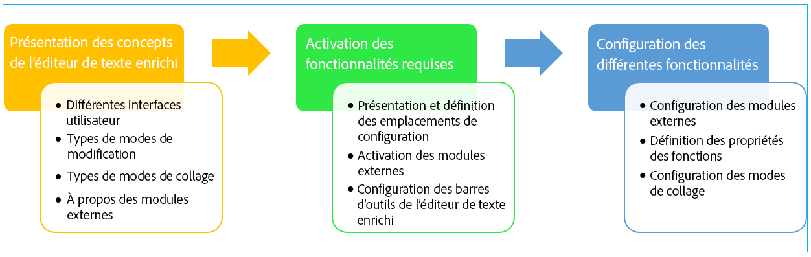
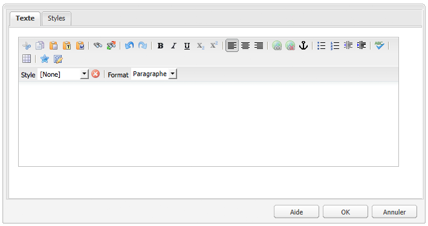
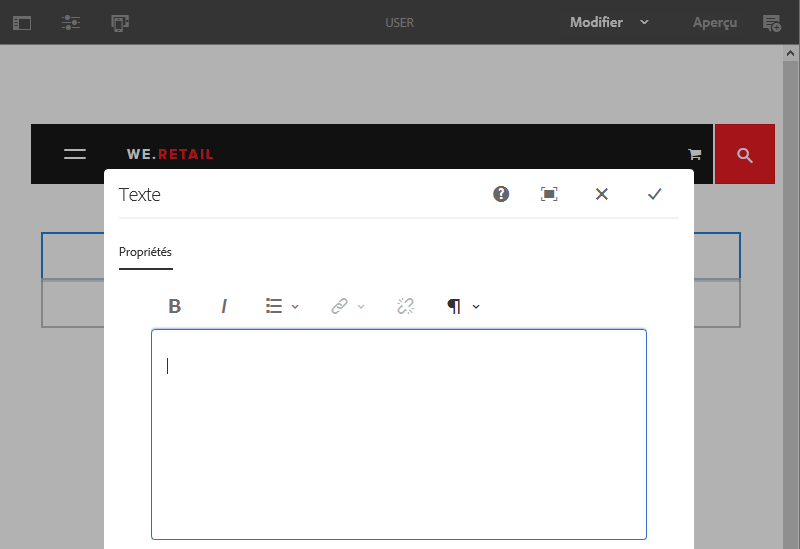

# Configuration de l’éditeur de texte enrichi {#configure-the-rich-text-editor}

L’éditeur de texte enrichi met à la disposition des auteurs de nombreuses fonctionnalités pour modifier leur contenu textuel. Les icônes, les boîtes de dialogue de sélection, la barre d’outils et les menus sont fournis pour une expérience WYSIWYG de la modification de texte.

Pour savoir comment utiliser les fonctions d’éditeur de texte enrichi pour la création, voir [Utilisation de l’éditeur de texte enrichi pour la création](/help/sites-authoring/rich-text-editor.md). L’éditeur de texte enrichi peut être configuré pour activer, désactiver et étendre les fonctions disponibles dans les composants de création. Le flux de travail suivant illustre l’ordre recommandé d’exécution du de configuration RTE dans Experience Manager.



*Figure : Séquence d’étapes pour apprendre à configurer RTE*

## Présentation des IU tactile et classique {#understand-touch-enabled-ui-and-classic-ui}

L’interface utilisateur tactile est l’interface utilisateur standard d’Experience Manager. Adobe a introduit l’interface utilisateur tactile avec une conception [](/help/sites-authoring/responsive-layout.md) réactive pour la création de  de . L’interface utilisateur tactile est conçue pour les périphériques tactiles et de bureau. L’interface diffère considérablement de l’interface utilisateur classique d’origine.


*Figure : Barre d’outils de l’éditeur de texte enrichi dans l’interface utilisateur tactile*



*Figure : Barre d’outils de l’éditeur de texte enrichi dans l’interface utilisateur classique*

>[!MORELIKETHIS]
>
>* [Recommandations relatives aux IU](/help/sites-deploying/ui-recommendations.md)
>* About deprecating the Classic UI, see [Experience Manager 6.5 release notes](/help/release-notes/deprecated-removed-features.md)
>* For difference between the UIs, see [Touch UI and Classic UI](https://aemcq5pedia.wordpress.com/2018/01/05/touch-enabled-ui-aem6-3/)
>* To understand the Touch-enabled UI in detail, see [Concepts of Experience Manager Touch UI](/help/sites-developing/touch-ui-concepts.md)


## Différents modes de modification {#editingmodes}

Les auteurs peuvent créer et modifier du contenu textuel dans Experience Manager à l’aide des différents modes de composants. Les options de la barre d’outils pour la création et la mise en forme du contenu, et l’expérience utilisateur des composants compatibles avec l’éditeur de texte enrichi dans différents modes de modification, varient en fonction des configurations d’éditeur de texte enrichi.

| Mode de modification | Zone de modification | Fonctions dont l’activation est recommandée | IU tactile | IU classique |
|--- |--- |--- |--- |--- |
| En ligne | Modification en ligne pour des modifications rapides et mineures ; mettez en forme sans ouvrir une zone de dialogue | Fonctions minimales d’éditeur de texte enrichi | O | O |
| Éditeur de texte enrichi en plein écran | Couvre la page entière | Toutes les fonctions requises d’éditeur de texte enrichi | O | N |
| Boîte de dialogue | Boîte de dialogue située en haut du contenu de page sans couvrir la page entière | Toutes les fonctions requises d’éditeur de texte enrichi dans l’IU classique ; activez les fonctions judicieusement dans l’IU tactile | O | O |
| Boîte de dialogue plein écran | Identique au mode plein écran ; contient des champs de la boîte de dialogue à côté de l’éditeur de texte enrichi | Toutes les fonctions requises d’éditeur de texte enrichi | O | N |

>[!NOTE]
>
>La fonction d’édition source n’est pas disponible en mode d’édition en ligne dans l’interface utilisateur tactile. Vous ne pouvez pas faire glisser les images en mode plein écran. Toutes les autres fonctions sont utilisables dans tous les modes.

### Modification en ligne {#inline-editing}

Une fois ouvert (avec une double pression ou un double clic lent), le contenu peut être modifié dans la page. Une barre d’outils compacte avec des options très basiques est présentée.


*Figure : Modification en ligne avec barre d’outils de base dans l’interface utilisateur tactile*

Dans l’IU classique, un double clic lent sur le composant permet la modification en ligne, et le contenu est encadré en orange. Si l’outil de recherche de contenu est ouvert, une barre d’outils avec les options de mise en forme disponibles de l’éditeur de texte enrichi est affichée en haut de la fenêtre. Si l’outil de recherche n’est pas ouvert, les options de mise en forme n’apparaissent pas, et vous pouvez uniquement effectuer des modifications de base sur le texte.

### Modification en plein écran {#full-screen-editing}

Les composants d’Experience Manager peuvent être ouverts dans un plein écran  qui masque le contenu de la page et occupe l’écran disponible. Considérez la modification en plein écran comme une version détaillée de la modification en ligne, car elle offre le plus grand nombre d’options de modification. It can be opened by clicking , from the compact toolbar when using the inline editing mode.

En mode de boîte de dialogue plein écran, outre une barre d’outils détaillée d’éditeur de texte enrichi, les options et les composants disponibles dans une boîte de dialogue sont également disponibles. Il s’applique seulement aux boîtes de dialogue qui contiennent l’éditeur de texte enrichi à côté d’autres composants.


*Figure : Barre d’outils RTE détaillée lors de la modification en mode plein écran dans l’interface utilisateur tactile*

### Modification dans une boîte de dialogue {#dialog-editing}

Lorsque vous double-cliquez sur un composant, une boîte de dialogue apparaît pour modifier le contenu. La boîte de dialogue s’ouvre dans la partie supérieure de la page existante. Dans quelques scénarios spécifiques, la boîte de dialogue s’affiche comme fenêtre contextuelle. Par exemple, lorsqu’un composant Texte fait partie d’une colonne dans une mise en page de plusieurs colonnes et que la zone disponible pour la boîte de dialogue est inférieure.



*Figure : Mode de modification de la boîte de dialogue dans l’interface utilisateur tactile*


*Figure : Boîte de dialogue de l’interface utilisateur classique contenant une barre d’outils détaillée à modifier*

## À propos des modules externes d’éditeur de texte enrichi et des fonctions associées {#aboutplugins}

Cette fonctionnalité est mise à disposition par le biais d’une série de modules externes, comportant chacun :

* Une `features` propriété :

   * utilisée afin d’activer ou désactiver une fonctionnalité de base pour ce module externe ;
   * configurable selon une procédure normalisée

* Le cas échéant, propriétés et options supplémentaires nécessitant une configuration spécialisée.

Les fonctions de base d’éditeur de texte enrichi sont activées, ou désactivées, par la valeur de la propriété `features` sur un nœud spécifique au module externe approprié.

Le tableau ci-dessous répertorie les modules externes actuels et indique les informations suivantes :

* Les ID des modules externes avec un lien vers la documentation des API. L’ID est utilisé comme nom de nœud lors de l’[activation d’un module externe](/help/sites-administering/configure-rich-text-editor-plug-ins.md#activateplugin).
* Les valeurs admises pour la propriété `features`.
* Une description de la fonctionnalité fournie par le module externe.

| ID du module externe | features | Description |
|--- |--- |--- |
| edit | cut copy paste-default paste-plaintext paste-wordhtml | [Couper, copier et les trois modes de collage](/help/sites-administering/configure-rich-text-editor-plug-ins.md#textstyles). |
| [findreplace](https://helpx.adobe.com/experience-manager/6-5/sites/developing/using/reference-materials/widgets-api/index.html?class=CQ.form.rte.plugins.FindReplacePlugin) | find replace | Rechercher et remplacer. |
| [format](https://helpx.adobe.com/experience-manager/6-5/sites/developing/using/reference-materials/widgets-api/index.html?class=CQ.form.rte.plugins.FormatPlugin) | bold italic underline | [Mise en forme textuelle de base](/help/sites-administering/configure-rich-text-editor-plug-ins.md#textstyles). |
| [image](https://helpx.adobe.com/experience-manager/6-5/sites/developing/using/reference-materials/widgets-api/index.html?class=CQ.form.rte.plugins.ImagePlugin) | image | Prise en charge des images de base (faites glisser le curseur depuis le contenu ou l’outil de recherche de contenu). Selon le navigateur, la prise en charge présente différents comportements pour les auteurs |
| [keys](https://helpx.adobe.com/experience-manager/6-5/sites/developing/using/reference-materials/widgets-api/index.html?class=CQ.form.rte.plugins.KeyPlugin) |  | Pour définir cette valeur, voir [taille de tabulation](/help/sites-administering/configure-rich-text-editor-plug-ins.md#tabsize). |
| [justify](https://helpx.adobe.com/experience-manager/6-5/sites/developing/using/reference-materials/widgets-api/index.html?class=CQ.form.rte.plugins.JustifyPlugin) | justifyleft justifycenter justifyright | Alignement de paragraphe. |
| [links](https://helpx.adobe.com/experience-manager/6-5/sites/developing/using/reference-materials/widgets-api/index.html?class=CQ.form.rte.plugins.LinkPlugin) | modifylink unlink anchor | [Liens hypertextes et ancres](/help/sites-administering/configure-rich-text-editor-plug-ins.md#linkstyles). |
| [lists](https://helpx.adobe.com/experience-manager/6-5/sites/developing/using/reference-materials/widgets-api/index.html?class=CQ.form.rte.plugins.ListPlugin) | ordered unordered indent outdent | This plug-in controls both [indentation and lists](/help/sites-administering/configure-rich-text-editor-plug-ins.md#indentmargin); including nested lists. |
| [misctools](https://helpx.adobe.com/experience-manager/6-5/sites/developing/using/reference-materials/widgets-api/index.html?class=CQ.form.rte.plugins.MiscToolsPlugin) | specialchars sourceedit | Miscellaneous tools allow authors to enter [special characters](/help/sites-administering/configure-rich-text-editor-plug-ins.md#spchar) or edit the HTML source. Also, you can add a whole [range of special characters](/help/sites-administering/configure-rich-text-editor-plug-ins.md#definerangechar) if you want to define your own list. |
| Paraformat | paraformat | The default paragraph formats are Paragraph, Heading 1, Heading 2, and Heading 3 (`<p>`, `<h1>`, `<h2>`, and `<h3>`). Vous pouvez [ajouter davantage de formats de paragraphe](/help/sites-administering/configure-rich-text-editor-plug-ins.md#paraformats) ou prolonger la liste. |
| spellcheck | checktext | [Vérificateur orthographique sensible à la langue](/help/sites-administering/configure-rich-text-editor-plug-ins.md#adddict). |
| styles | styles | Prise en charge du style à l’aide d’une classe CSS. [Ajouter nouveaux styles](/help/sites-administering/configure-rich-text-editor-plug-ins.md#textstyles) de texte si vous souhaitez ajouter (ou étendre) votre propre plage de styles à utiliser avec du texte. |
| subsuperscript | subscript superscript | Extensions aux formats de base, ajout de sous-scripts et de super-scripts. |
| table | table removetable insertrow removerow insertcolumn removecolumn cellprops mergecells splitcell selectrow selectcolumns | See [configure table styles](/help/sites-administering/configure-rich-text-editor-plug-ins.md#tablestyles), if you want to add your own styles for either entire tables or individual cells. |
| undo | undo redo | History size of [undo and redo](/help/sites-administering/configure-rich-text-editor-plug-ins.md#undohistory) operations. |

>[!NOTE]
>
>Le module externe Plein écran n’est pas pris en charge en mode de boîte de dialogue. Use of the `dialogFullScreen` setting to configure the toolbar for full screen mode.

## Présentation des chemins et des emplacements de configuration {#understand-the-configuration-paths-and-locations}

[Mode de modification d’éditeur de texte enrichi (et de l’IU)](#editingmodes) que vous fournissez pour que les auteurs déterminent l’emplacement des informations de configuration lorsque vous [activez les modules externes d’éditeur de texte enrichi](/help/sites-administering/configure-rich-text-editor-plug-ins.md#activateplugin) :

| Mode de modification | Emplacement de l’IU tactile | Emplacement de l’IU classique |
|---|---|---|
| En ligne | `cq:editConfig/cq:inplaceEditing` | `cq:editConfig/cq:inplaceEditing` |
| Plein écran | `cq:editConfig/cq:inplaceEditing` | Non applicable |
| Boîte de dialogue | `cq:dialog` | `dialog` |
| Boîte de dialogue plein écran | `cq:dialog` | Non applicable |

>[!NOTE]
>
>Do not name the node under `cq:inplaceEditing` as `config`. On `cq:inplaceEditing` node, define the following properties:
>* **Nom**: `configPath`
>* **Type**: `String`
>* **Valeur** : chemin du nœud qui contient la configuration proprement dite.
>
>
Ne donnez pas le nom `config` au nœud de configuration de l’éditeur de texte enrichi (RTE). Otherwise, the RTE configurations take effect for only the administrators and not for the users in the group `content-author`.

Configurez les propriétés suivantes qui s’appliquent uniquement au mode de modification dans la boîte de dialogue dans l’IU tactile :

* `useFixedInlineToolbar`: Définissez cette propriété booléenne définie sur le noeud RTE (un noeud avec sling:resourceType= `cq/gui/components/authoring/dialog/richtext`) sur `True`, pour que la barre d’outils RTE soit fixe plutôt que flottante.

    Lorsque cette propriété est définie sur true, la modification en texte démarre par défaut sur l’événement « foundation-contentloaded ».

   Pour éviter cette situation, définissez la propriété `customStart``True` sur et déclenchez l’événement « rte-start » pour commencer la modification avec l’éditeur de texte enrichi. Lorsque cette propriété est définie sur true, le comportement par défaut (l’éditeur de texte enrichi démarre en cas de clic) ne fonctionne pas.

* `customStart` : configurez cette propriété booléenne définie sur le nœud de l’éditeur de texte enrichi sur `True` pour contrôler à quel moment démarrer l’éditeur de texte enrichi en déclenchant l’événement `rte-start`.

* `rte-start` : déclenchez cet événement sur l’élément `contenteditable-div` d’éditeur de texte enrichi lorsque vous commencez la modification avec l’éditeur de texte enrichi. Cette option ne fonctionne que si `customStart` a été défini sur true.

Lorsque l’éditeur de texte enrichi est utilisé dans la boîte de dialogue optimisée pour les écrans tactiles, la définition de la propriété `useFixedInlineToolbar` sur true est obligatoire pour éviter des problèmes.

## Personnalisation de la modification en place {#customizing-in-place-editing}

Vous pouvez définir sur quel sélecteur HTML le de l’éditeur de texte  en configurant les propriétés suivantes :

* **`editElementQuery`** - Définie le `cq:InplaceEditingConfig`, cette propriété est utilisée pour spécifier un sélecteur de l’élément HTML sur lequel la modification en ligne du composant de texte sera lancée. Si ce n’est pas le cas, la modification en ligne est directement lancée sur le composant HTML de texte.
* **`textPropertyName`** - Définie le `cq:InplaceEditingConfig`, cette propriété est utilisée pour spécifier le nom de la propriété qui sera enregistrée sur le noeud de contenu où la valeur HTML du composant de texte sera conservée après la modification en ligne.

La propriété correspondante pour le mode de dialogue est `name`.

## Activation des fonctionnalités d’éditeur de texte enrichi en activant des modules externes {#enable-rte-functionalities-by-activating-plug-ins}

Les fonctionnalités d’éditeur de texte enrichi sont rendues disponibles par l’intermédiaire d’une série de modules externes, chacun avec sa propriété features. Vous pouvez configurer la propriété features afin d’activer ou de désactiver une ou plusieurs fonctions de chaque module externe.

Pour consulter des configurations détaillées des modules externes de l’éditeur de texte enrichi, voir [Activation et configuration des modules externes de l’éditeur de texte enrichi](/help/sites-administering/configure-rich-text-editor-plug-ins.md).

**Exemple**: Téléchargez [cet exemple de configuration](/help/sites-administering/assets/rte-sample-all-features-enabled-10.zip) qui illustre comment configurer RTE. Dans ce module, toutes les fonctionnalités sont activées.

>[!NOTE]
>
>Le [composant textuel des composants principaux](https://docs.adobe.com/content/help/en/experience-manager-core-components/using/components/text.html#the-text-component-and-the-rich-text-editor) permet aux éditeurs de modèle de configurer de nombreux modules externes de l’éditeur de texte enrichi en tant que stratégies de contenu dans une interface utilisateur graphique, rendant ainsi inutile toute configuration technique. Les stratégies de contenu peuvent fonctionner avec les configurations d’interface utilisateur de l’éditeur de texte enrichi décrites dans ce document.
>
>Pour plus d’informations, voir la section [Paramètres de l’interface utilisateur de l’éditeur de texte enrichi et stratégies de contenu](/help/sites-administering/rich-text-editor.md) de ce document ainsi que [Création de modèles de page](/help/sites-authoring/templates.md) et la [documentation du développeur des composants principaux](https://docs.adobe.com/content/help/en/experience-manager-core-components/using/developing/developing.html).

>[!NOTE]
>
>À titre de référence, les composants Texte par défaut (fournis dans le cadre d’une installation standard) se trouvent sous :
>
>* `/libs/wcm/foundation/components/text`
>* `/libs/foundation/components/text`
>
>
Pour créer votre propre composant textuel, copiez le composant ci-dessus au lieu de modifier ces composants.

## Configuration de la barre d’outils de l’éditeur de texte enrichi {#dialogfullscreen}

AEM vous permet de configurer différemment l’interface de l’éditeur de texte enrichi pour les différents modes de modification. Les paramètres par défaut sont fournis ci-dessous. Vous pouvez remplacer ces paramètres par défaut en fonction de vos besoins. Vous personnalisez uniquement les fonctionnalités de la barre d’outils que vous souhaitez fournir à vos auteurs. Vous n’avez pas besoin de définir toutes les configurations de barre d’outils.

Pour configurer la barre d’outils pour `dialogFullScreen`, utilisez l’exemple de configuration suivant.

```java
<uiSettings jcr:primaryType="nt:unstructured">
  <cui jcr:primaryType="nt:unstructured">
    <inline
      jcr:primaryType="nt:unstructured"
      toolbar="[format#bold,format#italic,format#underline,#justify,#lists,links#modifylink,links#unlink,#paraformat]">
      <popovers jcr:primaryType="nt:unstructured">
        <justify
          jcr:primaryType="nt:unstructured"
          items="[justify#justifyleft,justify#justifycenter,justify#justifyright,justify#justifyjustify]"
          ref="justify"/>
        <lists
          jcr:primaryType="nt:unstructured"
          items="[lists#unordered,lists#ordered,lists#outdent,lists#indent]"
          ref="lists"/>
        <paraformat
          jcr:primaryType="nt:unstructured"
          items="paraformat:getFormats:paraformat-pulldown"
          ref="paraformat"/>
      </popovers>
    </inline>
    <dialogFullScreen
      jcr:primaryType="nt:unstructured"
      toolbar="[format#bold,format#italic,format#underline,justify#justifyleft,justify#justifycenter,justify#justifyright,justify#justifyjustify,lists#unordered,lists#ordered,lists#outdent,lists#indent,links#modifylink,links#unlink,table#createoredit,#paraformat,image#imageProps]">
      <popovers jcr:primaryType="nt:unstructured">
        <paraformat
          jcr:primaryType="nt:unstructured"
          items="paraformat:getFormats:paraformat-pulldown"
          ref="paraformat"/>
      </popovers>
    </dialogFullScreen>
    <tableEditOptions
      jcr:primaryType="nt:unstructured"
      toolbar="[table#insertcolumn-before,table#insertcolumn-after,table#removecolumn,-,table#insertrow-before,table#insertrow-after,table#removerow,-,table#mergecells-right,table#mergecells-down,table#mergecells,table#splitcell-horizontal,table#splitcell-vertical,-,table#selectrow,table#selectcolumn,-,table#ensureparagraph,-,table#modifytableandcell,table#removetable,-,undo#undo,undo#redo,-,table#exitTableEditing,-]">
    </tableEditOptions>
  </cui>
</uiSettings>
```

Différents paramètres d’IU sont utilisés pour les modes en ligne et plein écran. La propriété toolbar est utilisée pour spécifier les boutons de la barre d’outils.

For example, if the button is itself a feature (for example, `Bold`), it is specified as `PluginName#FeatureName` (for example, `links#modifylink`).

If the button is a popover (containing some features of a plug-in), it is specified as `#PluginName` (for example, `#format`).

Separators (`|`) between a group of buttons can be specified with `-`.

Le nœud pop-up sous le mode en ligne ou plein écran contient la liste des éléments contextuels utilisés. Chaque nœud enfant sous le nœud « popovers » (éléments contextuels) est nommé en fonction du module externe (format, par exemple). Il possède des « éléments » de propriété contenant la liste des fonctions du module externe (format#bold, par exemple).

## Paramètres de l’interface utilisateur de l’éditeur de texte enrichi et stratégies de contenu {#rtecontentpolicies}

Les administrateurs peuvent contrôler les options de l’éditeur de texte enrichi à l’aide de stratégies de contenu, au lieu de procéder à la configuration en suivant les instructions ci-dessus, par exemple. Les stratégies de contenu définissent les propriétés de conception d’un composant lorsqu’il est utilisé dans le cadre d’un [modèle modifiable](/help/sites-authoring/templates.md). Par exemple, si un composant textuel qui utilise l’éditeur de texte enrichi est employé avec un modèle modifiable, la stratégie de contenu peut définir que l’option Gras doit être disponible, au même titre que quelques options de mise en forme de paragraphe. Les stratégies de contenu sont réutilisables et peuvent être appliquées à plusieurs modèles.

Les options disponibles dans l’éditeur texte enrichi sont transmises depuis les configurations de l’interface utilisateur en amont vers les stratégies de contenu.

* Les paramètres de configuration de l’interface utilisateur définissent les options disponibles pour les stratégies de contenu.
* Si la configuration de l’interface utilisateur de RTE a été supprimée ou n’active pas un élément, la stratégie de contenu ne peut pas le configurer.
* Un auteur n’a accès à une fonctionnalité de ce type que si elle est mise à sa disposition par les configurations de l’interface utilisateur et les stratégies de contenu.

Pour consulter un exemple, reportez-vous à la [documentation du composant principal Texte](https://docs.adobe.com/help/fr/experience-manager-core-components/using/components/text.html#the-text-component-and-the-rich-text-editor).

## Personnalisation de l’association entre les commandes et les icônes de la barre d’outils {#iconstoolbar}

Vous pouvez personnaliser l’association entre les icônes de Coral affichées dans la barre d’outils de l’éditeur de texte enrichi et les commandes disponibles. Vous ne pouvez utiliser que les icônes de Coral.

1. Create a node named `icons` under `uiSettings/cui`.

1. Sous ce nœud, créez des nœuds pour les différentes icônes.
1. Sur chacun des noeuds d’icône individuels, spécifiez une icône Coral et une commande à mapper à l’icône.

Vous trouverez, ci-dessous, un exemple de fragment de code pour associer la commande Gras à l’icône Coral intitulée `textItalic`.

```java
<text jcr:primaryType="nt:unstructured" sling:resourceType="cq/gui/components/authoring/dialog/richtext" name="./text" useFixedInlineToolbar="{Boolean}true">
    <rtePlugins jcr:primaryType="nt:unstructured">
        <format jcr:primaryType="nt:unstructured" features="bold,italic"/>
    </rtePlugins>
    <uiSettings jcr:primaryType="nt:unstructured">
        <cui jcr:primaryType="nt:unstructured">
            <inline jcr:primaryType="nt:unstructured"
                toolbar="[format#bold,format#italic,format#underline,links#modifylink,links#unlink]">
            </inline>
            <icons jcr:primaryType="nt:unstructured">
                <bold jcr:primaryType="nt:unstructured"
                    command="format#bold"
                    icon="textItalic"/>
            </icons>
        </cui>
    </uiSettings>
</text>
```

## Passage à l’éditeur de texte enrichi CoralUI 2 {#switch-to-coralui-rich-text-editor}

Sur une page, vous pouvez inclure CoralUI 2 RTE clientlib ou CoralUI 3 RTE clientlib. Par défaut, l’éditeur de texte enrichi comprend la bibliothèque client de CoralUI 3. Pour passer à l’éditeur de texte enrichi CoralUI 2, exécutez les étapes suivantes.

>[!NOTE]
>
>Adobe ne le recommande pas comme une bonne pratique. Passez à l’éditeur de texte enrichi CoralUI 2 en dernier recours. Les modules externes personnalisés pour l’éditeur de texte enrichi CoralUI 2 fonctionnent avec l’éditeur de texte CoralUI 3 s’ils ne dépendent pas d’éléments internes à l’éditeur de texte, tels que des classes.
>
>Si vous employez des modules externes personnalisés pour l’éditeur de texte enrichi CoralUI , utilisez la bibliothèque `rte.coralui3`3.


1. Recouvrez le noeud `/libs/cq/gui/components/authoring/editors/clientlibs/core` sous `/apps`, puis procédez comme suit :

   * Replace `rte.coralui3` with `rte.coralui2` for the dependencies property.
   * Replace `cq.authoring.editor.core.inlineediting.rte.coralui3` with `cq.authoring.editor.core.inlineediting.rte.coralui2` for the embed property.
   * Replace `cq.authoring.rte.coralui3` with `cq.authoring.rte.coralui2` for the embed property.

1. Incrustez les noeuds `/libs/cq/gui/components/authoring/dialog/richtext/clientlibs/rte/coralui3` et `/libs/cq/gui/components/authoring/dialog/richtext/clientlibs/rte/coralui2` sous `/apps`.

   Supprimez les  de `cq.authoring.dialog` de `/apps/cq/gui/components/authoring/dialog/richtext/clientlibs/rte/coralui3` et ajoutez-les à `/apps/cq/gui/components/authoring/dialog/richtext/clientlibs/rte/coralui2`.

1. Changez n’importe quelle autre dépendance incluse à la page de `rte.coralui3` à `rte.coralui2`. For example, after overlaying the node `/libs/mcm/campaign/components/touch-ui/clientlibs/rte` under `/apps`, change any dependency on it from `rte.coralui3` to `rte.coralui2`.

1. Overlay the node `cq/ui/widgets` under `/apps`. Remplacez la dépendance `cq.rte` au niveau du noeud `/apps/cq/ui/widgets` par `cq.coralui2.rte`.

>[!NOTE]
>
>L’éditeur de texte enrichi CoralUI 2 utilise des modèles handlebars pour les boîtes de dialogue des modules externes. Par conséquent, la bibliothèque client de l’éditeur de texte enrichi CoralUI 2 dépendait de la bibliothèque client handlebars. L’éditeur de texte enrichi CoralUI 3 n’utilise pas de modèles handlebars, et aucune dépendance n’y est associée. Si vos modules externes personnalisés utilisent des modèles handlebars, ajoutez la bibliothèque client handlebars dans votre page web.

## Informations supplémentaires {#further-information}

Pour plus d’informations sur la configuration de l’éditeur de texte enrichi, voir la référence de l’[API des widgets AEM](https://helpx.adobe.com/experience-manager/6-5/sites/developing/using/reference-materials/widgets-api/index.html?class=CQ.form.RichText).

En particulier, pour connaître les modules externes et les options associées disponibles :

* Le composant [CQ.form.RichText](https://helpx.adobe.com/experience-manager/6-5/sites/developing/using/reference-materials/widgets-api/index.html?class=CQ.form.rte.plugins.Plugin) contient un champ de formulaire permettant de modifier les informations de texte stylisé (texte enrichi) : Pour connaître tous les paramètres disponibles pour le formulaire de texte enrichi, voir les options de configuration.
* Le composant RichText fournit un large éventail de fonctionnalités en utilisant les modules externes répertoriés sous [CQ.form.rte.plugins.Plugin](https://helpx.adobe.com/experience-manager/6-5/sites/developing/using/reference-materials/widgets-api/index.html?class=CQ.form.rte.plugins.Plugin). Pour chaque module externe :

   * voir les fonctions pour plus d’informations sur les fonctionnalités qui peuvent être activées (ou désactivées) ;
   * voir les options de configuration afin de connaître tous les paramètres disponibles pour la configuration détaillée du module externe approprié.

* Vous trouverez également plus d’informations sur les règles HTML pour les liens.

Elles peuvent être utilisées pour étendre et personnaliser votre propre RTE. Par exemple, pour répertorier les ancres disponibles dans la page en créant un lien, vous pouvez fournir votre propre mise en œuvre de `LinkPlugin`.

## Limitations connues {#known-limitations}

La fonctionnalité AEM RTE présente les limites suivantes :

* Les fonctionnalités de l’éditeur de texte enrichi sont prises en charge seulement dans les boîtes de dialogue des composants d’AEM. L’éditeur de texte enrichi n’est pas pris en charge sur les assistants ou les formulaires de base comme [Propriétés de la page](/help/sites-developing/page-properties-views.md) et [Génération de modèles automatique](/help/sites-authoring/scaffolding.md) sur l’IU tactile.

* AEM ne fonctionne pas sur les [dispositifs hybrides](/help/release-notes/known-issues.md).

* Do not name the RTE configuration node `config`. Otherwise, the RTE configuration takes effect for only the administrators and not for the users in the group `content-author`.

* RTE ne prend pas en charge les images intégrées ni les iframes pour incorporer un contenu.

## Best practices and tips {#best-practices-and-tips}

* Activez uniquement les plug-ins sans fenêtre contextuelle pour une boîte de dialogue flottante. Les plug-ins sans fenêtre contextuelle sont de taille plus petite et conviennent mieux à une boîte de dialogue flottante.
* Enable the plug-ins with larger pop-up, such as the `Paste` plug-in, only in the full-screen dialog mode or in full-screen mode. Les modules externes avec une grande fenêtre contextuelle nécessitent davantage d’espace sur l’écran pour offrir une expérience de création optimale.
* Si vous employez des modules externes personnalisés pour l’éditeur de texte enrichi CoralUI , utilisez la bibliothèque `rte.coralui3`3.

## Résolution des problèmes fréquents avec RTE {#troubleshoot-issues-with-aem-rich-text-editor}

**Comment sélectionner plusieurs cellules d’un tableau ?**

To select multiple cells in a table, press `Ctrl` or `Cmd` key and then click the table cells one-by-one.

Vous pouvez maintenant faire votre manipulation sur la sélection, par exemple définir les propriétés des cellules sélectionnées.

**Les liens hypertexte sont perdus lors de la modification d’un composant à l’aide du bouton Configurer**

Ajoutez un lien hypertexte dans un composant de texte en le modifiant à l’aide du bouton Configurer. Vous risquez de perdre le lien hypertexte si vous le modifiez à nouveau et que vous le validez une deuxième fois.

Une solution consiste à cliquer dans le composant de texte lorsque la boîte de dialogue de modification est affichée une seconde fois, puis à exécuter la validation du lien.

Ce problème est résolu dans AEM 6.3 et dans les versions ultérieures.

**Le contenu HTML ajouté en mode de modification de la source est perdu**

N’ajoutez pas de code HTML allant à l’encontre de XSS. AEM, et non pas l’éditeur de texte enrichi, peut supprimer du contenu HTML pour se conformer aux règles AntiSamy XSS.

Pour vérifier que le code HTML collé est enregistré, vérifiez le contenu enregistré dans CRXDE (dans le nœud de contenu).

S’il n’est pas enregistré, le code HTML a probablement été supprimé par l’éditeur de texte enrichi car il n’est pas conforme à ses règles.

If saved in CRXDE but not rendered on the Page (to check rendering, see page&#39;s [preview](/help/sites-authoring/editing-content.md#preview-mode), it is removed by AEM XSS rules.

**Le composant multichamp ne fonctionne pas comme prévu**

Pour créer un composant multichamp, utilisez uniquement CoralUI 3. N’utilisez pas les boîtes de dialogue de composant CoralUI 2.

Vérifiez également que le code de mise en œuvre multichamp et la structure de nœud sont corrects.

**La configuration disponible pour les administrateurs n’est pas accessible aux auteurs**

Si les mises à jour de configuration de l’interface apparaissent pour les comptes des administrateurs mais pas pour les auteurs, vérifiez que le nœud de configuration n’est pas nommé `config`. Use the [`configPath` property](/help/sites-developing/components-basics.md#cq-inplaceediting).

>[!MORELIKETHIS]
>
>* [Configuration des modules externes d’éditeur de texte enrichi](configure-rich-text-editor-plug-ins.md)
>* [Utilisation de l’éditeur de texte enrichi pour la création](../sites-authoring/rich-text-editor.md)
>* [Configuration de l’éditeur de texte enrichi pour les sites accessibles](rte-accessible-content.md)
>* [Parité des fonctions entre les IU tactile et classique](../release-notes/touch-ui-features-status.md)
>* [Extrait d’un tutoriel pour créer un composant multichamp composite](https://experience-aem.blogspot.com/2019/05/aem-65-touchui-composite-multifield-with-coral3-rte-rich-text.html)

