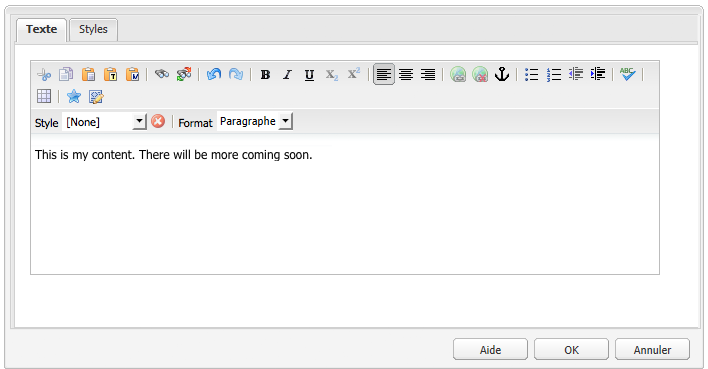

# Configuration de l’éditeur de texte enrichi {#configure-the-rich-text-editor}

L’éditeur de texte enrichi (RTE) met à la disposition des créateurs et créatrices de nombreuses fonctionnalités pour modifier leur contenu textuel. Les icônes, les boîtes de dialogue de sélection, la barre d’outils et les menus apportent une expérience WYSIWYG de la modification des textes.

Pour savoir comment utiliser les fonctions de l’éditeur de texte enrichi pour la création, consultez la section [Utilisation de l’éditeur de texte enrichi pour la création](/help/sites-authoring/rich-text-editor.md). L’éditeur de texte enrichi peut être configuré pour activer, désactiver et étendre les fonctions disponibles dans les composants de création. Le workflow suivant illustre l’ordre dans lequel les tâches de configuration de l’éditeur de texte enrichi doivent être exécutées dans Experience Manager.


*Image : séquence des étapes pour savoir comment configurer l’éditeur de texte enrichi*

## Présentation des IU tactile et classique {#understand-touch-enabled-ui-and-classic-ui}

L’interface utilisateur tactile est l’interface utilisateur standard d’Experience Manager. Adobe a introduit l’IU tactile doté d’un [responsive design](/help/sites-authoring/responsive-layout.md) pour l’environnement de création. L’interface utilisateur tactile est conçue pour les appareils tactiles et de bureau. L’IU diffère considérablement de l’IU classique original.


* : barre d’outils d’éditeur de texte enrichi dans l’IU tactile*


* : barre d’outils d’éditeur de texte enrichi dans l’IU classique*

>[!MORELIKETHIS]
>
>* [Recommandations relatives aux IU](/help/sites-deploying/ui-recommendations.md)
>* Concernant l’obsolescence de l’IU classique, consultez les [Notes de mise à jour d’Experience Manager 6.5](/help/release-notes/deprecated-removed-features.md).
>* Pour connaître les différences entre les IU, consultez la section [IU tactile et classique](https://aemcq5pedia.wordpress.com/2018/01/05/touch-enabled-ui-aem6-3/).
>* Pour comprendre l’IU tactile dans le détail, consultez la section [Concepts de l’IU tactile d’Experience Manager.](/help/sites-developing/touch-ui-concepts.md)

## Différents modes de modification {#editingmodes}

Les auteurs peuvent créer et modifier du contenu textuel dans Experience Manager en utilisant les différents modes des composants. Les options de la barre d’outils dédiées à la création et la mise en forme de contenu, ainsi que l’expérience utilisateur des composants compatibles avec l’éditeur de texte enrichi dans les différents modes de modification, varient selon les configurations de l’éditeur de texte enrichi.

| Mode de modification | Zone de modification | Fonctions dont l’activation est recommandée | IU tactile | Interface utilisateur classique |
|--- |--- |--- |--- |--- |
| En ligne | Modification en ligne pour des modifications rapides et mineures ; mettez en forme sans ouvrir une boîte de dialogue. | Fonctions minimales d’éditeur de texte enrichi | Y | Y |
| Éditeur de texte enrichi en mode plein écran | Couvre la page entière | Toutes les fonctions requises d’éditeur de texte enrichi | Y | N |
| Boîte de dialogue | Boîte de dialogue située en haut du contenu de page sans couvrir la page entière | Toutes les fonctions requises d’éditeur de texte enrichi dans l’IU classique ; activez les fonctions judicieusement dans l’IU tactile. | Y | Y |
| Boîte de dialogue plein écran | Identique au mode plein écran ; contient des champs de la boîte de dialogue à côté de l’éditeur de texte enrichi. | Toutes les fonctions requises d’éditeur de texte enrichi | Y | N |

>[!NOTE]
>
>La fonction de modification de source n’est pas disponible dans le mode de modification en ligne dans l’IU tactile. Vous ne pouvez pas faire glisser les images en mode plein écran. Toutes les autres fonctions sont utilisables dans tous les modes.

### Modification en ligne {#inline-editing}

Une fois ouvert (à l’aide d’un double appui/clic lent), le contenu peut être modifié dans la page. Une barre d’outils compacte avec des options très basiques est présentée.


* : modification en ligne avec une barre d’outils basiques dans l’IU tactile*

Dans l’UI classique, un double-clic lent sur le composant permet la modification en ligne et un contour orange met le contenu en surbrillance. Si l’outil de recherche de contenu est ouvert, une barre d’outils contenant les différentes options de mise en forme d’éditeur de texte enrichi s’affiche en haut de la fenêtre. Si l’outil de recherche n’est pas ouvert, les options de mise en forme n’apparaissent pas et vous pouvez uniquement effectuer des modifications de base sur le texte.

### Modification en plein écran {#full-screen-editing}

Les composants d’Experience Manager peuvent être ouverts dans une vue plein écran qui masque le contenu de la page et occupe l’écran disponible. Considérez la modification en plein écran comme une version détaillée de la modification en ligne, car elle offre le plus grand nombre d’options de modification. Vous pouvez l’ouvrir en cliquant sur , dans la barre d’outils compacte lorsque vous utilisez le mode de modification en ligne.

Dans le mode plein écran de la boîte de dialogue, outre une barre d’outils détaillée d’éditeur de texte enrichi, les options et les composants disponibles dans une boîte de dialogue sont également disponibles. Cela ne s’applique qu’aux boîtes de dialogue qui contiennent l’éditeur de texte enrichi à côté d’autres composants.


* : barre d’outils détaillée d’éditeur de texte enrichi lors de la modification en plein écran dans l’IU tactile*

### Modification dans une boîte de dialogue {#dialog-editing}

Lorsqu’un composant fait l’objet d’un double clic, une boîte de dialogue s’ouvre permettant de modifier le contenu. La boîte de dialogue s’affiche en haut de la page existante. Dans certains scénarios spécifiques, la boîte de dialogue s’affiche sous la forme d’une fenêtre contextuelle. Par exemple, quand un composant Texte fait partie d’une colonne dans une mise en page à plusieurs colonnes et que la zone disponible pour la boîte de dialogue est moindre.


* : mode de modification dans une boîte de dialogue dans l’IU tactile*



* : boîte de dialogue dans l’IU classique qui contient la barre d’outils détaillée pour la modification*

## À propos des modules externes de l’éditeur de texte enrichi et des fonctions associées {#aboutplugins}

Cette fonctionnalité est mise à disposition par le biais d’une série de modules externes, comportant chacun :

* Propriété `features` :

   * utilisée afin d’activer ou désactiver une fonctionnalité de base pour ce module externe ;
   * configurable selon une procédure normalisée.

* Le cas échéant, des propriétés et options supplémentaires nécessitant une configuration spécialisée.

Les fonctions de base d’éditeur de texte enrichi sont activées, ou désactivées, par la valeur de la propriété `features` sur un nœud spécifique au module externe approprié.

Le tableau suivant répertorie les plug-ins actuels et présente les informations suivantes :

* Les ID de plug-in avec un lien vers la documentation de l’API. L’ID est utilisé comme nom de nœud lors de l’[activation d’un plug-in](/help/sites-administering/configure-rich-text-editor-plug-ins.md#activateplugin).
* Les valeurs admises pour la propriété `features`.
* Une description de la fonctionnalité fournie par le module externe.

| ID du module externe | features | Description |
|--- |--- |--- |
| edit | cut copy paste-default paste-plaintext paste-wordhtml | [Couper, copier et les trois modes de collage](/help/sites-administering/configure-rich-text-editor-plug-ins.md#textstyles). |
| findreplace | find replace | Rechercher et remplacer. |
| format | bold italic underline | [Mise en forme de texte de base](/help/sites-administering/configure-rich-text-editor-plug-ins.md#textstyles). |
| image | image | Prise en charge de base des images (faire glisser à partir du contenu ou de l’outil de recherche de contenu). Selon le navigateur, la prise en charge présente différents comportements pour les auteurs |
| keys |  | Pour définir cette valeur, consultez la [taille des onglets](/help/sites-administering/configure-rich-text-editor-plug-ins.md#tabsize). |
| justify | justifyleft justifycenter justifyright | Alignement des paragraphes. |
| links | modifylink unlink anchor | [Hyperliens et ancres de lien](/help/sites-administering/configure-rich-text-editor-plug-ins.md#linkstyles). |
| lists | ordered unordered indent outdent | Ce plug-in contrôle à la fois la [mise en retrait et les listes](/help/sites-administering/configure-rich-text-editor-plug-ins.md#indentmargin), y compris les listes imbriquées. |
| misctools | specialchars sourceedit | Divers outils permettent aux auteurs de saisir des [caractères spéciaux](/help/sites-administering/configure-rich-text-editor-plug-ins.md#spchar) ou de modifier la source HTML. En outre, vous pouvez ajouter toute une gamme de [caractères spéciaux](/help/sites-administering/configure-rich-text-editor-plug-ins.md#definerangechar) si vous voulez définir votre propre liste. |
| Paraformat | paraformat | Les formats de paragraphe par défaut sont : Paragraphe, En-tête 1, En-tête 2 et En-tête 3 (`<p>`, `<h1>`, `<h2>` et `<h3>`). Vous pouvez [ajouter d’autres formats de paragraphe](/help/sites-administering/configure-rich-text-editor-plug-ins.md#paraformats) ou allonger la liste. |
| spellcheck | checktext | [Vérificateur orthographique tenant compte de la langue](/help/sites-administering/configure-rich-text-editor-plug-ins.md#adddict). |
| styles | styles | Prise en charge de l’application d’un style en utilisant une classe CSS. [Ajoutez de nouveaux styles de texte](/help/sites-administering/configure-rich-text-editor-plug-ins.md#textstyles) si vous voulez ajouter (ou étendre) votre propre gamme de styles utilisables avec du texte. |
| subsuperscript | subscript superscript | Extensions des formats de base, en ajoutant l’indice et l’exposant. |
| table | table removetable insertrow removerow insertcolumn removecolumn cellprops mergecells splitcell selectrow selectcolumns | Voir [Configuration des styles de tableau](/help/sites-administering/configure-rich-text-editor-plug-ins.md#tablestyles) si vous voulez ajouter vos propres styles pour des tableaux entiers ou des cellules individuelles. |
| undo | undo redo | Taille de l’historique des opérations [d’annulation et de rétablissement](/help/sites-administering/configure-rich-text-editor-plug-ins.md#undohistory). |

>[!NOTE]
>
>Le module externe Plein écran n’est pas pris en charge en mode de boîte de dialogue. Utilisation du paramètre `dialogFullScreen` pour configurer la barre d’outils en mode plein écran.

## Présentation des chemins et des emplacements de configuration {#understand-the-configuration-paths-and-locations}

[Mode de modification d’éditeur de texte enrichi (et de l’IU)](#editingmodes) que vous fournissez pour que les auteurs déterminent l’emplacement des informations de configuration lorsque vous [activez les modules externes d’éditeur de texte enrichi](/help/sites-administering/configure-rich-text-editor-plug-ins.md#activateplugin) :

| Mode de modification | Emplacement de l’interface utilisateur tactile | Emplacement de l’interface utilisateur classique |
|---|---|---|
| En ligne | `cq:editConfig/cq:inplaceEditing` | `cq:editConfig/cq:inplaceEditing` |
| Plein écran | `cq:editConfig/cq:inplaceEditing` | Non applicable |
| Boîte de dialogue | `cq:dialog` | `dialog` |
| Boîte de dialogue plein écran | `cq:dialog` | Non applicable |

>[!NOTE]
>
>Ne donnez pas le nom `cq:inplaceEditing` au nœud sous `config`. Sur le nœud `cq:inplaceEditing`, définissez les propriétés suivantes :
>* **Nom** : `configPath`
>* **Type** : `String`
>* **Valeur** : chemin du nœud qui contient la configuration proprement dite.
>
>Ne donnez pas le nom `config` au nœud de configuration de l’éditeur de texte enrichi (RTE). Autrement, les configurations de l’éditeur de texte enrichi prennent effet seulement pour les administrateurs et non pour les utilisateurs du groupe `content-author`.

Configurez les propriétés suivantes qui s’appliquent uniquement au mode de modification dans la boîte de dialogue dans l’IU tactile :

* `useFixedInlineToolbar` : configurez cette propriété booléenne définie sur le nœud d’éditeur de texte enrichi (une avec sling:resourceType=`cq/gui/components/authoring/dialog/richtext`) sur `True` pour que la barre d’outils de l’éditeur de texte enrichi reste fixe au lieu d’être flottante.

   Lorsque cette propriété est définie sur true, la modification en texte démarre par défaut sur l’événement « foundation-contentloaded ».

  Pour éviter cette situation, définissez la propriété `customStart` sur `True` et déclenchez l’événement « rte-start » pour commencer la modification avec l’éditeur de texte enrichi. Lorsque cette propriété est définie sur true, le comportement par défaut (l’éditeur de texte enrichi démarre en cas de clic) ne fonctionne pas.

* `customStart` : configurez cette propriété booléenne définie sur le nœud de l’éditeur de texte enrichi sur `True` pour contrôler à quel moment démarrer l’éditeur de texte enrichi en déclenchant l’événement `rte-start`.

* `rte-start` : déclenchez cet événement sur l’élément `contenteditable-div` d’éditeur de texte enrichi lorsque vous commencez la modification avec l’éditeur de texte enrichi. Cette option ne fonctionne que si `customStart` a été défini sur true.

Lorsque l’éditeur de texte enrichi est utilisé dans la boîte de dialogue optimisée pour les écrans tactiles, la définition de la propriété `useFixedInlineToolbar` sur true est obligatoire pour éviter des problèmes.

## Personnalisation de l’édition statique {#customizing-in-place-editing}

Vous pouvez définir sur quel sélecteur HTML l’éditeur de texte se lance en configurant les propriétés suivantes :

* **`editElementQuery`** - Définie sur `cq:InplaceEditingConfig`, cette propriété est utilisée pour spécifier un sélecteur de l’élément de HTML sur lequel la modification en ligne pour le composant de texte sera lancée. Si elle n’est pas spécifiée, la modification en ligne est directement lancée en HTML de Composant Texte.
* **`textPropertyName`** - Définie sur `cq:InplaceEditingConfig`, cette propriété est utilisée pour spécifier le nom de la propriété qui sera enregistrée sur le nœud de contenu où la valeur HTML de composant de texte sera conservée après la modification en ligne.

La propriété correspondante pour le mode de boîte de dialogue est `name`.

## Activation des fonctionnalités d’éditeur de texte enrichi en activant des modules externes {#enable-rte-functionalities-by-activating-plug-ins}

Les fonctionnalités d’éditeur de texte enrichi sont rendues disponibles par l’intermédiaire d’une série de modules externes, chacun avec sa propriété features. Vous pouvez configurer la propriété features pour activer ou désactiver les différentes fonctionnalités de chaque plug-in.

Pour obtenir des configurations détaillées des plug-ins d’éditeur de texte enrichi, consultez la section [Activer et configurer les plug-ins d’éditeur de texte enrichi](/help/sites-administering/configure-rich-text-editor-plug-ins.md).

**Exemple** : téléchargez [cet exemple de configuration](/help/sites-administering/assets/rte-sample-all-features-enabled-10.zip) qui illustre comment configurer l’éditeur de texte enrichi. Dans ce package, toutes les fonctionnalités sont activées.

>[!NOTE]
>
>Le [composant textuel des composants principaux](https://experienceleague.adobe.com/docs/experience-manager-core-components/using/wcm-components/text.html?lang=fr#the-text-component-and-the-rich-text-editor) permet aux éditeurs de modèle de configurer de nombreux modules externes de l’éditeur de texte enrichi en tant que politiques de contenu dans une interface utilisateur graphique, rendant ainsi inutile toute configuration technique. Les politiques de contenu peuvent fonctionner avec les configurations d’interface utilisateur de l’éditeur de texte enrichi décrites dans ce document.
>
>Pour plus d’informations, consultez la section [Paramètres de l’interface utilisateur de l’éditeur de texte enrichi et politiques de contenu](/help/sites-administering/rich-text-editor.md) de ce document, ainsi que la rubrique [Créer des modèles de page](/help/sites-authoring/templates.md) et la [Documentation destinée aux développeurs et développeuses de composants principaux](https://experienceleague.adobe.com/docs/experience-manager-core-components/using/developing/developing.html?lang=fr).

>[!NOTE]
>
>À titre de référence, les composants Texte par défaut (fournis dans le cadre d’une installation standard) se trouvent sous :
>
>* `/libs/wcm/foundation/components/text`
>* `/libs/foundation/components/text`
>
>Pour créer votre propre composant textuel, copiez le composant ci-dessus au lieu de modifier ces composants.

## Configuration de la barre d’outils de l’éditeur de texte enrichi {#dialogfullscreen}

AEM permet de configurer différemment l’interface de l’éditeur de texte enrichi pour les différents modes de modification. Les paramètres par défaut sont fournis ci-dessous. Vous pouvez remplacer ces paramètres par défaut en fonction de vos besoins. Vous personnalisez uniquement les fonctionnalités de la barre d’outils que vous souhaitez fournir à vos auteurs. Vous n’avez pas besoin de définir toutes les configurations de barre d’outils.

Pour configurer la barre d’outils pour `dialogFullScreen`, utilisez l’exemple de configuration suivant.

```java
<uiSettings jcr:primaryType="nt:unstructured">
  <cui jcr:primaryType="nt:unstructured">
    <inline
      jcr:primaryType="nt:unstructured"
      toolbar="[format#bold,format#italic,format#underline,#justify,#lists,links#modifylink,links#unlink,#paraformat]">
      <popovers jcr:primaryType="nt:unstructured">
        <justify
          jcr:primaryType="nt:unstructured"
          items="[justify#justifyleft,justify#justifycenter,justify#justifyright,justify#justifyjustify]"
          ref="justify"/>
        <lists
          jcr:primaryType="nt:unstructured"
          items="[lists#unordered,lists#ordered,lists#outdent,lists#indent]"
          ref="lists"/>
        <paraformat
          jcr:primaryType="nt:unstructured"
          items="paraformat:getFormats:paraformat-pulldown"
          ref="paraformat"/>
      </popovers>
    </inline>
    <dialogFullScreen
      jcr:primaryType="nt:unstructured"
      toolbar="[format#bold,format#italic,format#underline,justify#justifyleft,justify#justifycenter,justify#justifyright,justify#justifyjustify,lists#unordered,lists#ordered,lists#outdent,lists#indent,links#modifylink,links#unlink,table#createoredit,#paraformat,image#imageProps]">
      <popovers jcr:primaryType="nt:unstructured">
        <paraformat
          jcr:primaryType="nt:unstructured"
          items="paraformat:getFormats:paraformat-pulldown"
          ref="paraformat"/>
      </popovers>
    </dialogFullScreen>
    <tableEditOptions
      jcr:primaryType="nt:unstructured"
      toolbar="[table#insertcolumn-before,table#insertcolumn-after,table#removecolumn,-,table#insertrow-before,table#insertrow-after,table#removerow,-,table#mergecells-right,table#mergecells-down,table#mergecells,table#splitcell-horizontal,table#splitcell-vertical,-,table#selectrow,table#selectcolumn,-,table#ensureparagraph,-,table#modifytableandcell,table#removetable,-,undo#undo,undo#redo,-,table#exitTableEditing,-]">
    </tableEditOptions>
  </cui>
</uiSettings>
```

Différents paramètres d’IU sont utilisés pour les modes en ligne et plein écran. La propriété de barre d’outils permet de spécifier les boutons de la barre d’outils.

Par exemple, si le bouton est lui-même une fonctionnalité (par exemple, `Bold`), il est spécifiée comme `PluginName#FeatureName` (par exemple, `links#modifylink`).

Si le bouton est un élément contextuel (contenant certaines fonctionnalités d’un module externe), il est spécifié sous la forme `#PluginName` (par exemple, `#format`).

Les séparateurs (`|`) dans un groupe de boutons peuvent être spécifiés par le signe `-`.

Le nœud pop-up sous le mode en ligne ou plein écran contient la liste des éléments contextuels utilisés. Chaque nœud enfant sous le nœud « popovers » (éléments contextuels) est nommé en fonction du module externe (format, par exemple). Il possède des « éléments » de propriété contenant la liste des fonctions du module externe (format#bold, par exemple).

## Paramètres de l’interface utilisateur de l’éditeur de texte enrichi et politiques de contenu {#rtecontentpolicies}

L’administration peut contrôler les options de l’éditeur de texte enrichi à l’aide de politiques de contenu, par exemple au lieu d’effectuer la configuration décrite ci-dessus. Les politiques de contenu définissent les propriétés de conception d’un composant lorsqu’il est utilisé dans le cadre d’un [modèle modifiable](/help/sites-authoring/templates.md). Par exemple, si un composant de texte qui utilise l’éditeur de texte enrichi est utilisé avec un modèle modifiable, la politique de contenu peut définir que l’option gras est disponible, à l’instar de quelques options de mise en forme de paragraphe. Les politiques de contenu sont réutilisables et peuvent être appliquées à plusieurs modèles.

Les options disponibles dans l’éditeur de texte enrichi sont transmises depuis les configurations de l’interface utilisateur en amont vers les politiques de contenu.

* Les paramètres de configuration de l’interface utilisateur définissent les options disponibles pour les politiques de contenu.
* Si un élément a été supprimé ou n’est pas activé par la configuration d’interface utilisateur de l’éditeur de texte enrichi, la politique de contenu ne peut pas le configurer.
* Un auteur n’a accès à une fonctionnalité de ce type que si elle est mise à sa disposition par les configurations de l’interface utilisateur et les politiques de contenu.

Pour consulter un exemple, reportez-vous à la [documentation du composant principal Texte](https://experienceleague.adobe.com/docs/experience-manager-core-components/using/wcm-components/text.html?lang=fr#the-text-component-and-the-rich-text-editor).

## Personnalisation de l’association entre les commandes et les icônes de la barre d’outils {#iconstoolbar}

Vous pouvez personnaliser l’association entre les icônes Coral affichées dans la barre d’outils de l’éditeur de texte enrichi et les commandes disponibles. Vous ne pouvez utiliser que les icônes Coral.

1. Créez un nœud intitulé `icons` sous `uiSettings/cui`.

1. Sous ce nœud, créez des nœuds pour les différentes icônes.
1. Sur chacun des nœuds d’icône, spécifiez une icône Coral et une commande à laquelle elle doit être associée.

Vous trouverez, ci-dessous, un exemple de fragment de code pour associer la commande Gras à l’icône Coral intitulée `textItalic`.

```java
<text jcr:primaryType="nt:unstructured" sling:resourceType="cq/gui/components/authoring/dialog/richtext" name="./text" useFixedInlineToolbar="{Boolean}true">
    <rtePlugins jcr:primaryType="nt:unstructured">
        <format jcr:primaryType="nt:unstructured" features="bold,italic"/>
    </rtePlugins>
    <uiSettings jcr:primaryType="nt:unstructured">
        <cui jcr:primaryType="nt:unstructured">
            <inline jcr:primaryType="nt:unstructured"
                toolbar="[format#bold,format#italic,format#underline,links#modifylink,links#unlink]">
            </inline>
            <icons jcr:primaryType="nt:unstructured">
                <bold jcr:primaryType="nt:unstructured"
                    command="format#bold"
                    icon="textItalic"/>
            </icons>
        </cui>
    </uiSettings>
</text>
```

## Passage à l’éditeur de texte enrichi CoralUI 2 {#switch-to-coralui-rich-text-editor}

Sur une page, vous pouvez inclure la bibliothèque client (clientlib) d’éditeur de texte enrichi CoralUI 2 ou CoralUI 3. Par défaut, l’éditeur de texte enrichi comprend la bibliothèque cliente d’éditeur de texte enrichi CoralUI 3. Pour passer à l’éditeur de texte enrichi CoralUI 2, procédez comme suit.

>[!NOTE]
>
>Adobe ne recommande pas cette pratique. Passez à l’éditeur de texte enrichi CoralUI 2 en dernier recours. Les modules externes personnalisés pour l’éditeur de texte enrichi CoralUI 2 fonctionnent avec l’éditeur de texte CoralUI 3 s’ils ne dépendent pas d’éléments internes à l’éditeur de texte, tels que des classes.
>
>Si vous employez des modules externes personnalisés pour l’éditeur de texte enrichi CoralUI3, utilisez la bibliothèque `rte.coralui3`.


1. Recouvrez le nœud `/libs/cq/gui/components/authoring/editors/clientlibs/core` sous `/apps` et procédez comme suit :

   * Remplacez `rte.coralui3` par `rte.coralui2` pour la propriété dependencies.
   * Remplacez `cq.authoring.editor.core.inlineediting.rte.coralui3` par `cq.authoring.editor.core.inlineediting.rte.coralui2` pour la propriété embed.
   * Remplacez `cq.authoring.rte.coralui3` par `cq.authoring.rte.coralui2` pour la propriété embed.

1. Recouvrez les nœuds `/libs/cq/gui/components/authoring/dialog/richtext/clientlibs/rte/coralui3` et `/libs/cq/gui/components/authoring/dialog/richtext/clientlibs/rte/coralui2` sous `/apps`.

   Supprimez une catégorie `cq.authoring.dialog` de `/apps/cq/gui/components/authoring/dialog/richtext/clientlibs/rte/coralui3` et ajoutez-la à `/apps/cq/gui/components/authoring/dialog/richtext/clientlibs/rte/coralui2`.

1. Changez n’importe quelle autre dépendance incluse à la page de `rte.coralui3` à `rte.coralui2`. Par exemple, après recouvrement du nœud `/libs/mcm/campaign/components/touch-ui/clientlibs/rte` sous `/apps`, remplacez toute dépendance `rte.coralui3` correspondante par `rte.coralui2`.

1. Recouvrez le nœud `cq/ui/widgets` sous `/apps`. Remplacez la dépendance `cq.rte` au niveau du nœud `/apps/cq/ui/widgets` par `cq.coralui2.rte`.

>[!NOTE]
>
>L’éditeur de texte enrichi CoralUI 2 utilise des modèles Handlebars pour les boîtes de dialogue des plug-ins. Par conséquent, la bibliothèque cliente d’éditeur de texte enrichi CoralUI 2 dépendait de la bibliothèque cliente Handlebars. L’éditeur de texte enrichi CoralUI 3 n’utilise pas de modèles Handlebars et n’a aucune dépendance associée. Si vos plug-ins personnalisés utilisent des modèles Handlebars, incluez la bibliothèque client Handlebars dans votre page web.

## Informations supplémentaires {#further-information}

Pour plus d’informations sur la configuration de l’éditeur de texte enrichi, consultez la référence de l’[API Widget d’AEM](https://developer.adobe.com/experience-manager/reference-materials/6-5/widgets-api/index.html?class=CQ.form.RichText).

En particulier, pour afficher les plug-ins et les options connexes disponibles :

* Le composant [CQ.form.RichText](https://developer.adobe.com/experience-manager/reference-materials/6-5/widgets-api/index.html?class=CQ.form.RichText) fournit un champ de formulaire pour la modification des informations de texte stylisé (texte enrichi). Pour connaître l’ensemble des paramètres disponibles pour le formulaire de texte enrichi, rendez-vous dans les options de configuration.
* Le composant RichText fournit un large éventail de fonctionnalités grâce aux modules externes répertoriés sous [CQ.form.rte.plugins.Plugin](https://developer.adobe.com/experience-manager/reference-materials/6-5/widgets-api/index.html?class=CQ.form.rte.plugins.Plugin). Pour chaque module externe :

   * consultez les fonctions pour plus d’informations sur les fonctionnalités qui peuvent être activées (ou désactivées) ;
   * consultez les options de configuration pour connaître tous les paramètres de configuration disponibles pour le plug-in approprié.

* Vous y retrouverez également plus d’informations sur les règles HTML pour les liens.

Ces informations peuvent être utilisées pour étendre et personnaliser votre propre éditeur de texte enrichi. Par exemple, pour répertorier les ancres disponibles dans la page en créant un lien, vous pouvez fournir votre propre mise en œuvre de `LinkPlugin`.

## Limites connues {#known-limitations}

La fonctionnalité AEM RTE présente les limites suivantes :

* Les fonctionnalités de l’éditeur de texte enrichi sont prises en charge uniquement dans les boîtes de dialogue des composants AEM. L’éditeur de texte enrichi n’est pas pris en charge sur les assistants ou les formulaires de base tels que les [Propriétés de la page](/help/sites-developing/page-properties-views.md) et la [Génération de modèles automatique](/help/sites-authoring/scaffolding.md) sur l’interface utilisateur tactile.

* AEM ne fonctionne pas sur les [appareils hybrides](/help/release-notes/release-notes.md).

* Ne donnez pas le nom `config` au nœud de configuration de l’éditeur de texte enrichi (RTE). Autrement, les configurations de l’éditeur de texte enrichi prennent effet seulement pour les administrateurs et non pour les utilisateurs du groupe `content-author`.

* L’éditeur de texte enrichi ne prend pas en charge les images intégrées ni les iframes pour incorporer un contenu.

## Bonnes pratiques et astuces {#best-practices-and-tips}

* Activation uniquement des modules externes sans déclenchement d’un pop-up pour une boîte de dialogue flottante. Les plug-ins sans pop-up sont plus petits et sont les mieux adaptés aux boîtes de dialogue flottantes.
* Activez les plug-ins avec un pop-up plus grand, comme le plug-in `Paste`, uniquement en mode Boîte de dialogue plein écran ou en mode Plein écran. Les plug-ins possédant un grand pop-up nécessitent davantage d’espace sur l’écran pour offrir une expérience de création optimale.
* Si vous employez des modules externes personnalisés pour l’éditeur de texte enrichi CoralUI3, utilisez la bibliothèque `rte.coralui3`.

## Résolution de problèmes fréquents avec l’éditeur de texte enrichi {#troubleshoot-issues-with-aem-rich-text-editor}

**Comment sélectionner plusieurs cellules d’un tableau ?**

Pour sélectionner plusieurs cellules dans un tableau, appuyez sur la touche `Ctrl` ou `Cmd`, puis cliquez sur les cellules du tableau une par une.

Vous pouvez maintenant faire votre manipulation sur la sélection, par exemple définir les propriétés des cellules sélectionnées.

**Les liens hypertexte sont perdus lors de la modification d’un composant à l’aide du bouton Configurer**.

Ajoutez un lien hypertexte dans un composant de texte en le modifiant à l’aide du bouton Configurer. Vous risquez de perdre l’hyperlien lorsque vous le modifiez à nouveau et que vous le validez pour la deuxième fois.

Une solution consiste à cliquer dans le composant de texte lorsque la boîte de dialogue de modification est affichée une seconde fois, puis à exécuter la validation du lien.

Ce problème est résolu dans AEM 6.3 et dans les versions ultérieures.

**Le contenu HTML ajouté en mode de modification de la source est perdu.**

N’ajoutez pas de code HTML allant à l’encontre de XSS. AEM, et non pas l’éditeur de texte enrichi, permet de supprimer du contenu HTML pour se conformer aux règles AntiSamy XSS.

Pour vérifier que le contenu HTML collé est enregistré, vérifiez le contenu enregistré dans CRXDE (dans le nœud de contenu).

S’il n’est pas enregistré, le contenu HTML a dû être supprimé par l’éditeur de texte enrichi, car il ne respectait pas les règles de l’éditeur de texte enrichi.

S’il est enregistré dans CRXDE mais qu’il n’apparaît pas sur la page (pour le vérifier, utilisez l’[aperçu](/help/sites-authoring/editing-content.md#preview-mode) de la page), c’est qu’il a été supprimé par les règles XSS d’AEM.

**Le composant multichamp ne fonctionne pas comme prévu**.

Pour créer un composant multichamp, utilisez uniquement CoralUI 3. N’utilisez pas les boîtes de dialogue de composant CoralUI 2.

Vérifiez également que le code de mise en œuvre multichamp et la structure de nœud sont corrects.

**La configuration disponible pour les administrateurs n’est pas accessible aux auteurs**.

Si les mises à jour de configuration de l’interface apparaissent pour les comptes des administrateurs mais pas pour les auteurs, vérifiez que le nœud de configuration n’est pas nommé `config`. Utilisez la [`configPath`propriété](/help/sites-developing/components-basics.md#cq-inplaceediting).

>[!MORELIKETHIS]
>
>* [Configuration des modules externes d’éditeur de texte enrichi](configure-rich-text-editor-plug-ins.md)
>* [Utilisation de l’éditeur de texte enrichi pour la création](../sites-authoring/rich-text-editor.md)
>* [Configuration de l’éditeur de texte enrichi pour les sites accessibles](rte-accessible-content.md)
>* [Parité des fonctions entre les IU tactile et classique](../release-notes/touch-ui-features-status.md)
>* [Extrait d’un tutoriel pour créer un composant multichamp composite](https://experience-aem.blogspot.com/2019/05/aem-65-touchui-composite-multifield-with-coral3-rte-rich-text.html)
