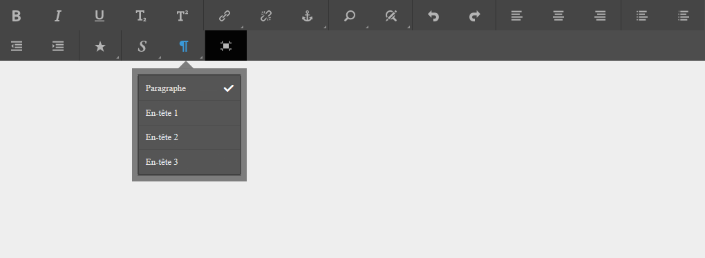
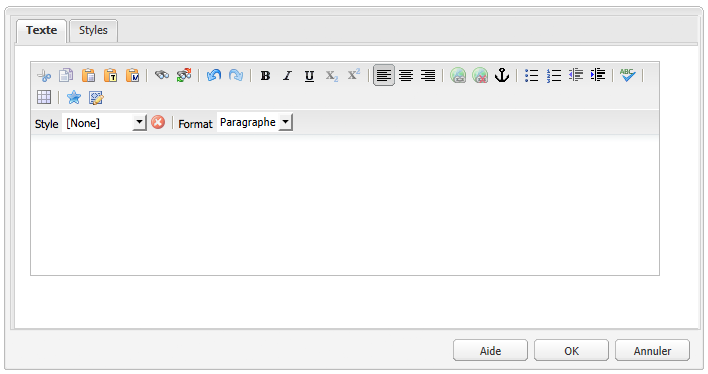
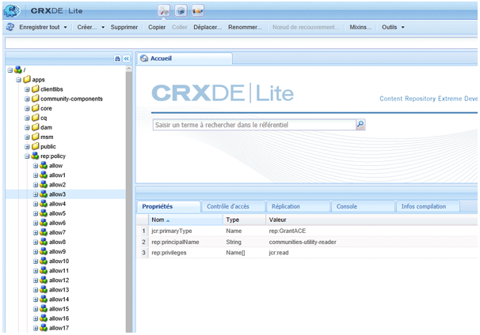

# Configuration de RTE pour la création de pages Web et de sites accessibles {#configure-rte-for-accessibility}

Adobe Experience Manager prend en charge de nombreuses fonctions d&#39;accessibilité standard, conformément à diverses normes d&#39;accessibilité. En outre, les développeurs peuvent personnaliser ou étendre les fonctionnalités afin de créer du contenu accessible à l’aide de composants Experience Manager qui utilisent l’éditeur de texte enrichi (RTE).

Lors de la conception de pages Web et de l’ajout de contenu aux pages, les développeurs et les auteurs de contenu peuvent utiliser les fonctionnalités du RTE pour fournir des informations relatives à l’accessibilité. Par exemple, ajoutez des informations structurelles au moyen d’en-têtes et d’éléments de paragraphe.

Pour configurer et personnaliser ces fonctionnalités, [configurez les modules externes](#configure-the-plugin-features) RTE pour le composant. For example, the `paraformat` plugin lets you add additional block level semantic elements, including extending the number of heading levels supported beyond the basic `H1`, `H2`, and `H3` provided by default.

Le RTE est disponible dans divers composants pour l’interface utilisateur tactile et l’interface utilisateur classique. Cependant, le composant principal à utiliser le RTE est le composant **Texte** disponible pour les deux interfaces. The following images show the RTE with a range of plugins enabled, including `paraformat`:



*Figure : Composant Texte de l’interface utilisateur tactile.*



*Figure : Composant Texte de l’interface utilisateur de Classic.*

Pour connaître les différences entre les fonctionnalités RTE disponibles dans les différentes interfaces, voir [Plugins et leurs fonctionnalités](/help/sites-administering/rich-text-editor.md#aboutplugins).

## Configuration des fonctionnalités du module externe {#configure-the-plugin-features}

Pour obtenir des instructions complètes sur la configuration du RTE, voir [Configuration de la page Editeur](/help/sites-administering/rich-text-editor.md) de texte enrichi. Ceci couvre tous les problèmes, y compris les étapes principales :

* [Modules externes et fonctionnalités](/help/sites-administering/rich-text-editor.md#aboutplugins).
* [Emplacements](/help/sites-administering/rich-text-editor.md#understand-the-configuration-paths-and-locations)de configuration.
* [Activez un module externe et configurez la propriété](/help/sites-administering/rich-text-editor.md#enable-rte-functionalities-by-activating-plug-ins)features.
* [Configurez d’autres fonctionnalités du RTE](/help/sites-administering/rich-text-editor.md#enable-rte-functionalities-by-activating-plug-ins).

By configuring a plugin within the appropriate `rtePlugins` sub-branch in CRXDE Lite, you can activate either all or specific features for that plugin.



### Example - specify paragraph formats available in RTE selection field {#example-specifying-paragraph-formats-available-in-rte-selection-field}

De nouveaux formats de bloc sémantique peuvent être rendus disponibles pour la sélection comme suit :

1. Selon votre éditeur de texte enrichi, déterminez l’[emplacement de configuration](/help/sites-administering/rich-text-editor.md#understand-the-configuration-paths-and-locations) et accédez-y.
1. [Activez le champ de sélection Paragraphe](/help/sites-administering/rich-text-editor.md). En [activant le module externe](/help/sites-administering/rich-text-editor.md#enable-rte-functionalities-by-activating-plug-ins).
1. [Spécifiez les formats qui doivent être disponibles dans le champ de sélection Paragraphes](/help/sites-administering/rich-text-editor.md).
1. Les formats de paragraphe sont ensuite à la disposition de l’auteur du contenu des champs de sélection dans l’éditeur de texte enrichi. Ils sont accessibles :

   * Utilisation de l’icône de sélection de paragraphe dans l’interface utilisateur tactile.
   * Using the **Format** field (pop-up selector) in the Classic UI.

Avec les éléments structurels disponibles dans l’éditeur de texte enrichi via les options de format de paragraphe, AEM constitue une bonne base pour le développement de contenu accessible. Les auteurs de contenu ne peuvent pas utiliser l’éditeur de texte enrichi pour formater la taille de la police ou les couleurs ou d’autres attributs associés, empêchant la création de formatage en ligne. À la place, ils doivent sélectionner les éléments structurels appropriés comme les en-têtes et utiliser des styles globaux choisis via l’option Styles. Ceci garantit une mise en forme nette, de meilleures options pour les utilisateurs qui naviguent avec leurs propres feuilles de style et un contenu correctement structuré.

## Use of the source edit feature {#use-of-the-source-edit-feature}

Dans certains cas, les auteurs de contenu constateront qu’il est nécessaire d’examiner et d’ajuster le code source HTML créé à l’aide de l’éditeur de texte enrichi. Par exemple, un élément de contenu créé dans l’éditeur de texte enrichi peut nécessiter une mise en forme supplémentaire pour être conforme à la norme WCAG 2.0. Ceci peut s’effectuer avec l’option [Modification de la source](/help/sites-administering/rich-text-editor.md#aboutplugins) de l’éditeur de texte enrichi. You can specify the [ `sourceedit` feature on the `misctools` plugin](/help/sites-administering/rich-text-editor.md#aboutplugins).

>[!CAUTION]
>
>Use the `sourceedit` feature carefully. Les fautes de frappe et/ou les fonctions non prises en charge peuvent entraîner d’autres problèmes.

## Ajouter la prise en charge d’un plus grand nombre d’éléments et d’attributs HTML {#add-support-for-more-html-elements-and-attributes}

Pour étendre davantage les fonctions d’accessibilité d’AEM, vous pouvez étendre les composants existants (par exemple, les composants **Text** et **Table**) en fonction de l’éditeur de texte enrichi avec des éléments et attributs supplémentaires.

The following procedure illustrates how to extend the **Table** component with a **Caption** element that provides information about a data table to assistive technology users:

### Example - add the caption to the Table Properties dialog {#example-adding-the-caption-to-the-table-properties-dialog}

Dans le constructeur de l’élément `TablePropertiesDialog`, ajoutez un champ de saisie de texte supplémentaire utilisé pour modifier la légende. Note that `itemId` must be set to `caption` (i.e. the DOM attribute’s name) to automatically handle its content.

In **Table**, set explicitly set or remove the attribute to/from the DOM element. La valeur est transmise par la boîte de dialogue dans l’objet `config`. Notez que les attributs DOM doivent être définis/supprimés à l’aide des méthodes `CQ.form.rte.Common` correspondantes (`com` est un raccourci de `CQ.form.rte.Common`) pour éviter les pièges courants des mises en œuvre de navigateur.

>[!NOTE]
>
>Cette procédure ne convient qu’à l’interface utilisateur de Classic.

### Exemple : créer du code HTML accessible lors de l’utilisation de l’accent dans le texte {#create-accessible-html-for-text}

RTE peut utiliser `strong` des balises et `em` à la place de `b` et `i`. Ajoutez le noeud suivant en tant que frère aux noeuds `uiSettings` et `rtePlugins` aux noeuds de la boîte de dialogue.

```HTML
<htmlRules jcr:primaryType="nt:unstructured">
    <docType jcr:primaryType="nt:unstructured">
        <typeConfig jcr:primaryType="nt:unstructured"
                useSemanticMarkup="{Boolean}true">
            <semanticMarkupMap
                    b="strong"
                    i="em"/>
        </typeConfig>
    </docType>
</htmlRules>
```

### Instructions pas à pas {#step-by-step-instructions}

1. Démarrez CRXDE Lite. Par exemple : [http://localhost:4502/crx/de/](http://localhost:4502/crx/de/)
1. Copier :

   `/libs/cq/ui/widgets/source/widgets/form/rte/commands/Table.js`

   vers :

   `/apps/cq/ui/widgets/source/widgets/form/rte/commands/Table.js`

   >[!NOTE]
   >
   >Vous devrez peut-être créer des dossiers intermédiaires si ceux-ci n’existent pas déjà.

1. Copier :

   `/libs/cq/ui/widgets/source/widgets/form/rte/plugins/TablePropertiesDialog.js`

   vers :

   `/apps/cq/ui/widgets/source/widgets/form/rte/plugins/TablePropertiesDialog.js`.

1. Ouvrez le fichier suivant pour le modifier (ouvrez-le en double-cliquant dessus) :

   `/apps/cq/ui/widgets/source/widgets/form/rte/plugins/TablePropertiesDialog.js`

1. Dans la méthode `constructor`, avant la lecture de ligne :

   ```
   var dialogRef = this;
   ```

   Ajoutez le code suivant :

   ```
   editItems.push({
       "itemId": "caption",
       "name": "caption",
       "xtype": "textfield",
       "fieldLabel": CQ.I18n.getMessage("Caption"),
       "value": (this.table && this.table.caption ? this.table.caption.textContent : "")
   });
   ```

1. Ouvrez le fichier suivant :

   `/apps/cq/ui/widgets/source/widgets/form/rte/commands/Table.js`.

1. Add the following code at the end of the `transferConfigToTable` method:

   ```
   /**
    * Adds Caption Element
   */
   var captionElement;
   if (dom.firstChild && dom.firstChild.tagName.toLowerCase() == "caption")
   {
      captionElement = dom.firstChild;
   }
   if (config.caption)
   {
       var captionTextNode = document.createTextNode(config.caption)
       if (captionElement)
       {
          dom.replaceNode(captionElement.firstChild,captionTextNode);
       } else
       {
           captionElement = document.createElement("caption");
           captionElement.appendChild(captionTextNode);
           if (dom.childNodes.length>0)
           {
              dom.insertBefore(captionElement, dom.firstChild);
           } else
           {
              dom.appendChild(captionElement);
           }
       }
   } else if (captionElement)
   {
     dom.removeChild(captionElement);
   }
   ```

1. Save your changes using **Save All…**

>[!NOTE]
>
>Le champ de texte brut n’est pas le seul type d’entrée autorisé pour la valeur de l’élément de légende. Vous pouvez utiliser n’importe quel widget ExtJS qui fournit la valeur de la légende par le biais de sa `getValue()` méthode.
>
>Pour ajouter des fonctionnalités de modification pour d’autres éléments et attributs, assurez-vous à la fois :
>
>* The `itemId` property for each corresponding field is set to the name of the appropriate DOM attribute (`TablePropertiesDialog`).
>* Que l’attribut est défini et/ou supprimé sur l’élément DOM de manière explicite (`Table`).


>[!MORELIKETHIS]
>
>* [Guide rapide relatif à WCAG 2.0](/help/managing/qg-wcag.md)
>* [Création de contenu accessible (conformité WCAG 2.0)](/help/sites-authoring/creating-accessible-content.md)

