# Intégration à Salesforce {#integrating-with-salesforce}

L’intégration de Salesforce à AEM fournit des fonctions de gestion de prospect et exploite les fonctions existantes que Salesforce met à disposition commercialement. Vous pouvez configurer AEM de manière à publier des prospects dans Salesforce et à créer des composants qui accèdent directement aux données à partir de Salesforce.

Une intégration bidirectionnelle et évolutive entre AEM et Salesforce permet :

* aux organisations d’utiliser et de mettre à jour pleinement les données afin d’améliorer l’expérience client ;
* au marketing de s’engager dans les activités commerciales ;
* aux organisations de transmettre et de recevoir automatiquement des données d’un entrepôt de données Salesforce.

Ce document répond aux questions suivantes :

* Comment configurer des services Cloud Salesforce (configuration d’AEM pour l’intégrer à Salesforce) ?
* Comment utiliser les informations de prospect/contact Salesforce dans le contexte du client et pour la personnalisation ?
* Comment utiliser le modèle de workflow Salesforce pour publier des utilisateurs AEM en tant que prospects dans Salesforce ?
* Comment créer un composant qui affiche les données de Salesforce ?

## Configuration d’AEM de manière à l’intégrer à Salesforce  {#configuring-aem-to-integrate-with-salesforce}

Pour configurer AEM de manière à l’intégrer à Salesforce, vous devez d’abord configurer une application d’accès à distance dans Salesforce. Ensuite, vous configurez le service de cloud Salesforce pour qu’il pointe vers cette application d’accès à distance.

>[!NOTE]
>
>Vous pouvez créer un compte de développeur dans Salesforce.

Pour configurer AEM de manière à l’intégrer à Salesforce :

>[!CAUTION]
>
>Vous devez installer le package d&#39;intégration [API Salesforce Force](https://www.adobeaemcloud.com/content/marketplace/marketplaceProxy.html?packagePath=/content/companies/public/adobe/packages/cq650/featurepack/com.adobe.cq.mcm.salesforce.content#) avant de poursuivre la procédure. Pour plus d&#39;informations sur la façon d&#39;utiliser les packages, consultez la [page Comment utiliser les packages](/help/sites-administering/package-manager.md#package-share).

1. Dans AEM, accédez à **Cloud Services**. Dans Services tiers, cliquez sur **Configurer maintenant** dans **Salesforce**.

   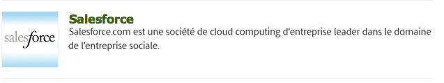

1. Créez une configuration, par exemple, **développeur**.

   >[!NOTE]
   >
   >La nouvelle configuration redirige vers une nouvelle page : **http://localhost:4502/etc/cloudservices/salesforce/developer.html**. Il s’agit de la même valeur que celle que vous devez spécifier dans l’URL de rappel lors de la création de l’application d’accès à distance dans Salesforce. Ces valeurs doivent correspondre.

1. Connectez-vous à votre compte Salesforce (ou si vous n’en avez pas, créez-en un à l’adresse [https://developer.force.com](https://developer.force.com).)
1. Dans Salesforce, accédez à **Créer** > **Applications** pour accéder à **Applications connectées** (dans les anciennes versions de salesforce, le flux de travail était **Déployer** > **Accès à distance**).
1. Cliquez sur **New** pour connecter AEM à Salesforce.

   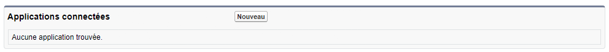

1. Saisissez le **nom de l’application connectée**, le **nom de l’API** et l’**adresse électronique de contact**. Cochez la case **Activer les paramètres OAuth**, saisissez l’**adresse URL de rappel** et ajoutez une portée OAuth (accès intégral, par exemple). L’URL de rappel ressemble à ceci : `http://localhost:4502/etc/cloudservices/salesforce/developer.html`

   Modifiez le nom/numéro de port du serveur et le nom de la page correspondant à votre configuration.

   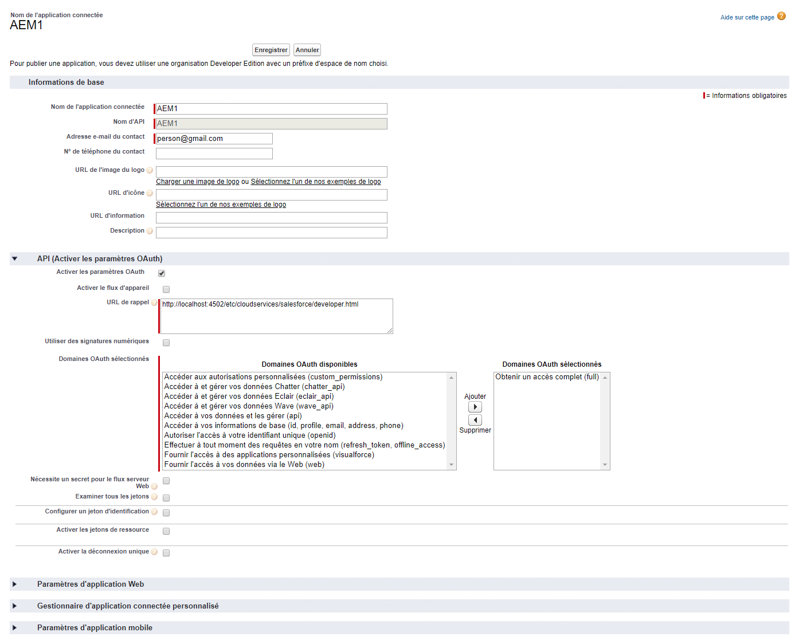

1. Cliquez sur **Enregistrer** pour enregistrer la configuration Salesforce. Salesforce crée une **clé du client** et un **secret du consommateur**, dont vous avez besoin pour la configuration d’AEM.

   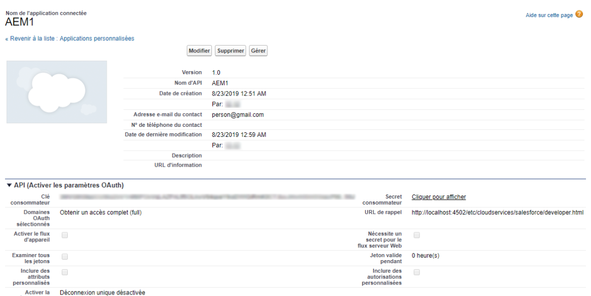

   >[!NOTE]
   >
   >Vous devrez peut-être patienter quelques minutes (jusqu’à 15 minutes) que l’application d’accès à distance soit activée dans Salesforce.

1. Dans AEM, accédez à **Services cloud** et à la configuration de Salesforce que vous avez créée précédemment (par exemple, **développeur**). Cliquez sur **Modifier**, puis saisissez la clé du client et le secret du client salesforce.com.

   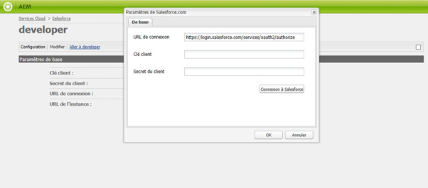

   | URL de connexion | Il s&#39;agit du point de terminaison de l&#39;autorisation Salesforce. Sa valeur est prérenseignée et convient dans la plupart des cas. |
   |---|---|
   | Clé client | Saisissez la valeur obtenue à partir de la page Enregistrement des demandes d&#39;accès à distance sur salesforce.com |
   | Secret client | Saisissez la valeur obtenue à partir de la page Enregistrement des demandes d&#39;accès à distance sur salesforce.com |

1. Cliquez sur **Connexion à Salesforce** pour vous connecter. Salesforce vous demande d’autoriser votre configuration à se connecter à Salesforce.

   

   Dans AEM, une boîte de dialogue de confirmation s’affiche pour confirmer que vous êtes bien connecté.

1. Accédez à la page principale de votre site web et cliquez sur **Propriétés de la page**. Sélectionnez ensuite **Cloud Services** et ajoutez **Salesforce** et sélectionnez la configuration appropriée (par exemple **développeur**).

   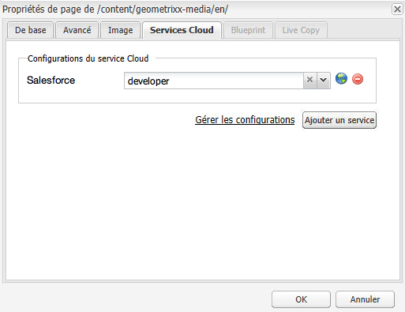

   Vous pouvez maintenant configurer le modèle de processus de manière à publier des prospects dans Salesforce et à créer des composants qui accèdent à des données à partir de Salesforce.

## Exportation des utilisateurs AEM en tant que prospects Salesforce  {#exporting-aem-users-as-salesforce-leads}

Si vous souhaitez exporter un utilisateur AEM en tant que prospect Salesforce, vous devez configurer le processus de manière à publier des prospects dans Salesforce.

Pour exporter des utilisateurs AEM en tant que prospects Salesforce :

1. Accédez au workflow Salesforce à l&#39;adresse `http://localhost:4502/workflow` en cliquant avec le bouton droit sur le workflow **Salesforce.com Export** et en cliquant sur **Début**.

   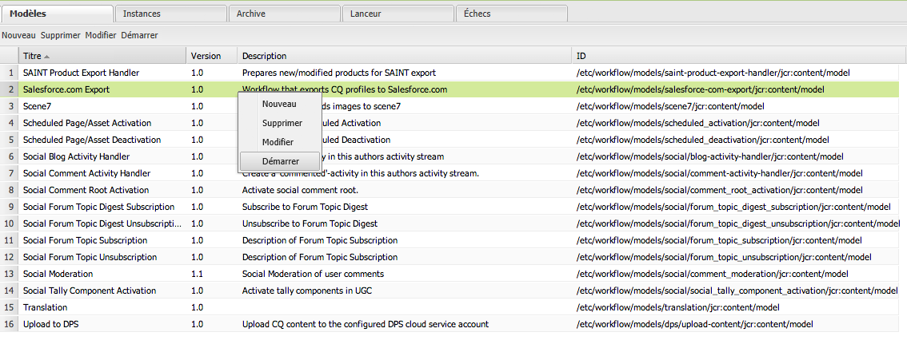

1. Sélectionnez l’utilisateur AEM à créer en tant que prospect de type **Contenu** pour ce processus (accueil –> utilisateurs). Veillez à sélectionner le nœud de profil de l’utilisateur, car il contient des informations, comme **givenName**, **familyName**, etc., qui sont mises en correspondance avec les champs **Prénom** et **Nom de famille** des prospects Salesforce.

   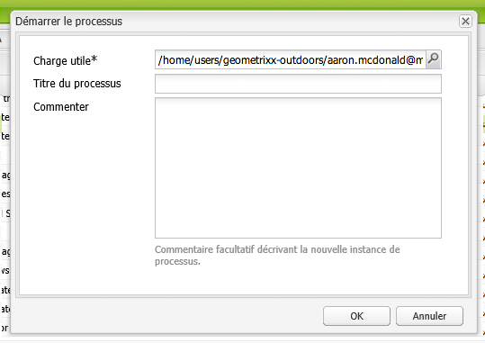

   >[!NOTE]
   >
   >Avant de commencer ce processus, le nœud de prospect dans AEM doit comporter certains champs obligatoires avant d’être publié dans Salesforce. Il s’agit de **nomDonnée**, **nomFamille**, **société** et **courriel**. Pour obtenir une liste complète de mappage entre l&#39;utilisateur AEM et le prospect Salesforce, voir [Configuration de mappage entre l&#39;utilisateur AEM et le prospect Slaesforce.](#mapping-configuration-between-aem-user-and-salesforce-lead)

1. Cliquez sur **OK**. Les informations de l’utilisateur sont exportées vers salesforce.com. Vous pouvez le vérifier sur salesforce.com.

   >[!NOTE]
   >
   >Les journaux d’erreurs indiquent si un prospect est importé. Pour plus d’informations, consultez le journal d’erreurs.

### Configuration du processus d’exportation salesforce.com  {#configuring-the-salesforce-com-export-workflow}

Vous devrez peut-être configurer le processus d’exportation salesforce.com pour le faire correspondre à la configuration salesforce.com appropriée ou apporter d’autres modifications.

Pour configurer le processus d’exportation Salesforce.com :

1. Accédez à `http://localhost:4502/cf#/etc/workflow/models/salesforce-com-export.html.`.

   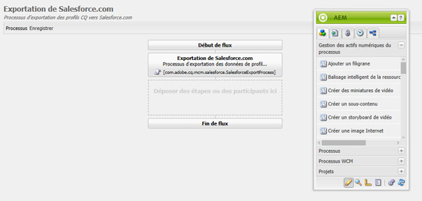

1. Ouvrez l’étape d’exportation Salesforce.com, sélectionnez l’onglet **Arguments**, sélectionnez la configuration appropriée et cliquez sur **OK**. De plus, si vous souhaitez que le processus recrée un prospect supprimé dans Salesforce, cochez la case.

   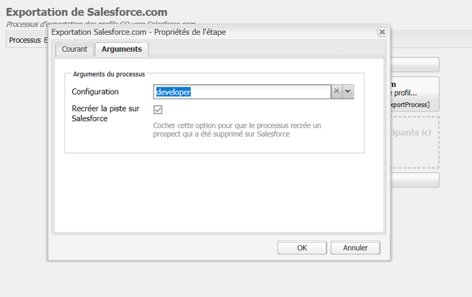

1. Cliquez sur **Enregistrer** pour enregistrer vos modifications.

   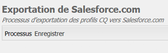

### Configuration des correspondances entre un utilisateur AEM et un prospect Salesforce {#mapping-configuration-between-aem-user-and-salesforce-lead}

Pour vue ou modifier la configuration de mappage actuelle entre un utilisateur AEM et un responsable Salesforce, ouvrez Configuration Manager : `https://<hostname>:<port>/system/console/configMgr` et recherchez **Salesforce Lead Mapping Configuration**.

1. Ouvrez Configuration Manager en cliquant sur **Console Web** ou en accédant directement à `https://<hostname>:<port>/system/console/configMgr.`.
1. Recherchez **Salesforce Lead Mapping Configuration**.

   

1. Modifiez les correspondances, au besoin. Le mappage par défaut suit le modèle **aemUserAttribute=sfLeadAttribute**. Cliquez sur **Enregistrer** pour enregistrer les modifications.

## Configuration de l’entrepôt de contexte client Salesforce  {#configuring-salesforce-client-context-store}

L’entrepôt de contexte client Salesforce affiche des informations sur l’utilisateur actuellement connecté, qui complètent les informations déjà disponibles dans AEM. Il extrait ces informations supplémentaires de Salesforce en fonction de la connexion de l’utilisateur à Salesforce.

À cet effet, vous devez configurer ce qui suit :

1. Liez un utilisateur AEM à un ID de Salesforce par le biais du composant Salesforce Connect.
1. Ajoutez les données de profil Salesforce dans la page de contexte client pour configurer les propriétés à afficher.
1. (Facultatif) Créez un segment qui utilise les données de l’entrepôt de contexte client Salesforce.

### Liaison d’un utilisateur AEM à un ID Salesforce  {#linking-an-aem-user-with-a-salesforce-id}

Vous devez associer un utilisateur AEM à un ID Salesforce afin de le charger dans le contexte client. Dans un scénario réel, vous effectueriez la liaison en fonction des données connues de l’utilisateur avec la validation. À des fins de démonstration, dans cette procédure, vous utilisez le composant **Salesforce Connect**.

1. Accédez à un site web dans AEM, connectez-vous, faites glisser et déposez le composant **Salesforce du Connect** à partir du Sidekick.

   >[!NOTE]
   >
   >Si le composant **Salesforce Connect** n’est pas disponible, accédez au mode **Conception** et sélectionnez-le pour le mettre à disposition en mode **Modification**.

   

   Lorsque vous faites glisser le composant vers la page, il affiche **Lien vers Salesforce=Désactivé**.

   

   >[!NOTE]
   >
   >Ce composant n’est fourni qu’à titre de démonstration. Pour les scénarios réels, le processus pour lier/associer des utilisateurs à des prospects est différent.

1. Après avoir fait glisser le composant dans la page, ouvrez-le pour le configurer. Sélectionnez la configuration, le type de contact et le prospect ou le contact Salesforce, puis cliquez sur **OK**.

   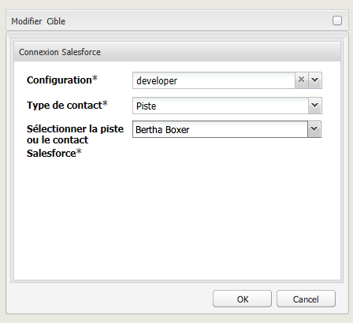

   AEM lie l’utilisateur au contact ou au prospect Salesforce.

   

### Ajout de données Salesforce au contexte client {#adding-salesforce-data-to-client-context}

Vous pouvez charger des données utilisateur de Salesforce dans le contexte client à utiliser pour la personnalisation :

1. Ouvrez le contexte client que vous souhaitez étendre en naviguant là, par exemple `http://localhost:4502/etc/clientcontext/default/content.html.`

   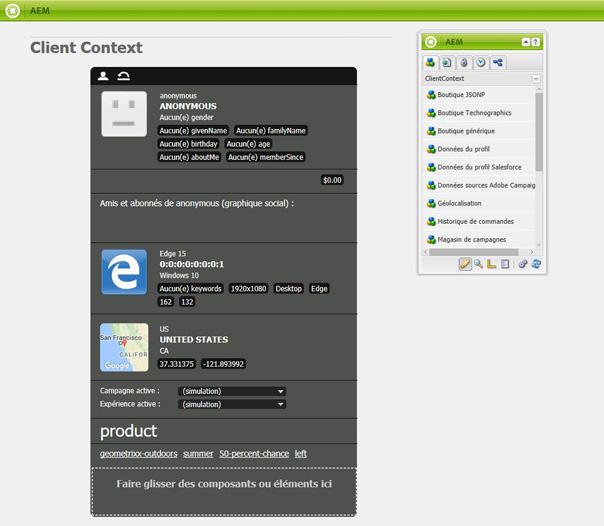

1. Faites glisser le composant **Données du profil Salesforce** vers le contexte du client.

   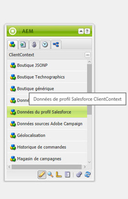

1. Double-cliquez sur le composant pour l’ouvrir. Sélectionnez **Ajouter un élément** et sélectionnez une propriété dans la liste déroulante. Ajoutez autant de propriétés que vous le souhaitez et sélectionnez **OK**.

   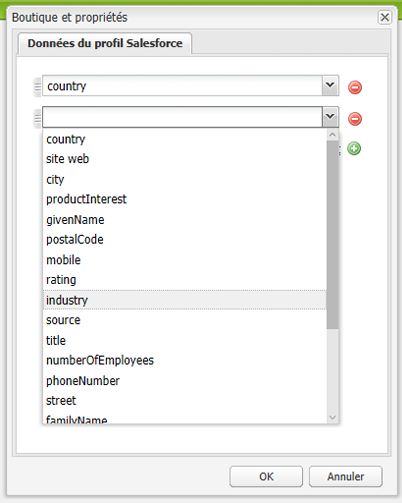

1. À présent, les propriétés spécifiques à Salesforce s’affichent dans le contexte client.

   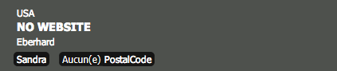

### Création d’un segment à l’aide de données de l’entrepôt de contexte client Salesforce {#building-a-segment-using-data-from-salesforce-client-context-store}

Vous pouvez créer un segment qui utilise les données de l’entrepôt de contexte client Salesforce. Pour ce faire :

1. Accédez à la segmentation dans AEM en accédant à **Outils** > **Segmentation** ou à [http://localhost:4502/miscadmin#/etc/segmentation](http://localhost:4502/miscadmin#/etc/segmentation).
1. Créez ou mettez à jour un segment pour inclure des données de Salesforce. Pour plus d’informations, voir [Segmentation](/help/sites-administering/campaign-segmentation.md).

## Recherche de prospects  {#searching-leads}

AEM est fourni avec un exemple de composant Recherche, qui cherche des prospects dans Salesforce en fonction des critères déterminés. Ce composant montre comment utiliser l’API REST Salesforce pour rechercher des objets Salesforce. Vous devez lier une page à une configuration Salesforce pour déclencher un appel de salesforce.com.

>[!NOTE]
>
>Voici un exemple de composant, qui montre comment utiliser l’API REST Salesforce pour créer une requête portant sur des objets Salesforce. Utilisez-le comme exemple pour créer des composants plus complexes en fonction de vos besoins.

Pour utiliser ce composant :

1. Accédez à la page dans laquelle vous souhaitez utiliser cette configuration. Ouvrez Propriétés de la page et sélectionnez **Services cloud.** Cliquez sur **Ajouter des services**, sélectionnez **Salesforce** et la configuration appropriée et cliquez sur **OK**.

   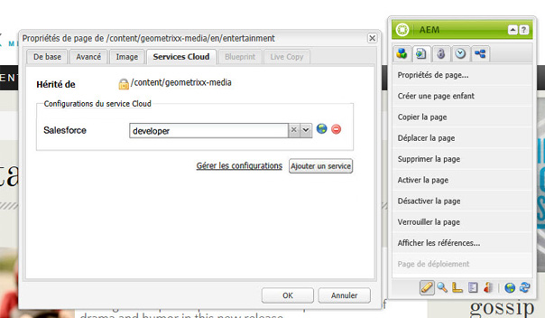

1. Faites glisser le composant Recherche de Salesforce vers la page (sous réserver qu’elle a été activée. Pour l’activer, accédez au mode Conception et ajoutez-le à la zone appropriée).

   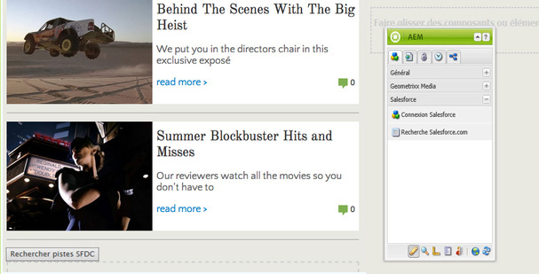

1. Ouvrez le composant Recherche, spécifiez les paramètres de recherche et cliquez sur **OK**.

   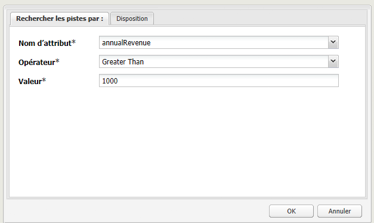

1. AEM affiche les prospects spécifiés dans votre composant Recherche correspondant aux critères spécifiés.

   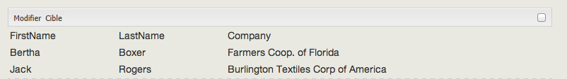

