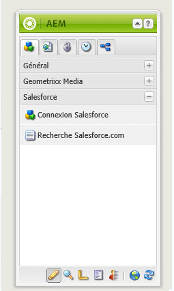

# Intégration à Salesforce {#integrating-with-salesforce}

L’intégration de Salesforce à Adobe Experience Manager (AEM) fournit des fonctionnalités de gestion des prospects et utilise les fonctionnalités existantes prêtes à l’emploi fournies par Salesforce. Vous pouvez configurer AEM pour publier des prospects sur Salesforce et créer des composants qui accèdent directement aux données à partir de Salesforce.

L’intégration bidirectionnelle et extensible entre AEM et Salesforce permet :

* Les entreprises doivent utiliser et modifier entièrement les données pour améliorer l’expérience client.
* Engagement du marketing aux activités de vente.
* Les organisations doivent transmettre et recevoir automatiquement des données d’une banque de données Salesforce.

Ce document répond aux questions suivantes :

* Configuration des Cloud Service Salesforce (configuration d’AEM à intégrer à Salesforce).
* utilisation des informations de prospect/contact Salesforce dans ClientContext et pour la personnalisation.
* Découvrez comment utiliser le modèle de workflow Salesforce pour publier AEM utilisateurs comme des prospects pour Salesforce.
* Découvrez comment créer un composant qui affiche les données de Salesforce.

## Configuration d’AEM à intégrer à Salesforce {#configuring-aem-to-integrate-with-salesforce}

Pour configurer AEM à intégrer avec Salesforce, vous devez d’abord configurer une application d’accès à distance dans Salesforce. Ensuite, vous configurez le service cloud Salesforce pour qu’il pointe vers cette application d’accès à distance.

>[!NOTE]
>
>Vous pouvez créer un compte développeur gratuit dans Salesforce.

Pour configurer AEM à intégrer à Salesforce :

>[!CAUTION]
>
>Installez le [API Salesforce](https://experience.adobe.com/#/downloads/content/software-distribution/en/aem.html?fulltext=salesforce*&amp;orderby=%40jcr%3Acontent%2Fjcr%3AlastModified&amp;orderby.sort=desc&amp;layout=list&amp;p.offset=0&amp;p.limit=2&amp;package=%2Fcontent%2Fsoftware-distribution%2Fen%2Fdetails.html%2Fcontent%2Fdam%2Faem%2Fpublic%2Fadobe%2Fpackages%2Fcq650%2Ffeaturepack%2Fcom.adobe.cq.mcm.salesforce.content-1.0.4.zip) module d’intégration avant de poursuivre la procédure. Pour plus d’informations sur l’utilisation des packages, consultez la page [Utilisation des packages](/help/sites-administering/package-manager.md#package-share)

1. Dans AEM, accédez à **Services cloud**. Dans Services tiers, cliquez sur **Configurer maintenant** dans **Salesforce**.

   

1. Créez une configuration, par exemple : **développeur**.

   >[!NOTE]
   >
   >La nouvelle configuration redirige vers une nouvelle page : **http://localhost:4502/etc/cloudservices/salesforce/developer.html**. Il s’agit de la même valeur que celle que vous devez spécifier dans l’ URL de rappel lors de la création de l’application d’accès à distance dans Salesforce. Ces valeurs doivent correspondre.

1. Connectez-vous à votre compte Salesforce (ou si vous n’en avez pas, créez-en un à l’adresse [https://developer.salesforce.com](https://developer.salesforce.com).)
1. Dans Salesforce, accédez à **Créer** > **Applications** pour accéder à **Applications connectées** (dans les anciennes versions de Salesforce, le processus était **Déployer** > **Accès distant**).
1. Cliquez sur **Nouveau** vous pouvez donc connecter AEM avec Salesforce.

   

1. Saisissez le **nom de l’application connectée**, le **nom de l’API** et l’**adresse électronique de contact**. Cochez la case **Activer les paramètres OAuth**, saisissez l’**adresse URL de rappel** et ajoutez une portée OAuth (accès intégral, par exemple). L’adresse URL de rappel se présente comme suit : `http://localhost:4502/etc/cloudservices/salesforce/developer.html`.

   Modifiez le nom et le numéro de port du serveur et le nom de la page correspondant à votre configuration.

   

1. Cliquez sur **Enregistrer** pour enregistrer la configuration Salesforce. Salesforce crée une **clé du client** et un **secret du client**, dont vous avez besoin pour la configuration d’AEM.

   

   >[!NOTE]
   >
   >Patientez plusieurs minutes (jusqu’à 15 minutes) pour que l’application d’accès à distance dans Salesforce soit activée.

1. Dans AEM, accédez à **Cloud Service** et accédez à la configuration Salesforce que vous avez créée précédemment (par exemple, **développeur**). Cliquez sur **Modifier** et saisissez la clé du client et le secret client à partir de salesforce.com.

   

   | URL de connexion | Il s’agit du point d’entrée d’autorisation Salesforce. Sa valeur est prérenseignée et convient dans la plupart des cas. |
   |---|---|
   | Clé du client | Saisissez la valeur obtenue à partir de la page Enregistrement de l’application d’accès à distance dans salesforce.com |
   | Secret du client | Saisissez la valeur obtenue à partir de la page Enregistrement de l’application d’accès à distance dans salesforce.com |

1. Cliquez sur **Connexion à Salesforce** pour vous connecter. Salesforce vous demande d’autoriser votre configuration à vous connecter à Salesforce.

   

   Dans AEM, une boîte de dialogue de confirmation s’affiche pour confirmer que vous êtes bien connecté.

1. Accédez à la page principale de votre site web et cliquez sur **Propriétés de la page**. Ensuite, sélectionnez **Services cloud**, ajoutez **Salesforce** et sélectionnez la configuration appropriée (par exemple, **développeur**).

   

   Vous pouvez maintenant utiliser le modèle de workflow pour publier des prospects sur Salesforce et créer des composants qui accèdent aux données de Salesforce.

## Exportation des utilisateurs AEM en tant que prospects Salesforce {#exporting-aem-users-as-salesforce-leads}

Si vous souhaitez exporter un utilisateur AEM en tant que prospect Salesforce, configurez le workflow pour publier des prospects vers Salesforce.

Pour exporter AEM utilisateurs en tant que prospects Salesforce, procédez comme suit :

1. Accédez au workflow Salesforce à l’adresse `http://localhost:4502/workflow` en cliquant avec le bouton droit sur le workflow **Exportation de Salesforce.com** et en cliquant sur **Démarrer**.

   

1. Sélectionnez l’utilisateur AEM que vous souhaitez créer en tant que prospect en tant que **Payload** pour ce workflow (accueil > utilisateurs). Veillez à sélectionner le noeud de profil de l’utilisateur, car il contient des informations telles que **givenName**, et  **familyName**, qui sont mappés aux pistes Salesforce **FirstName** et **LastName** des champs.

   

   >[!NOTE]
   >
   >Avant de lancer ce workflow, le nœud de prospect dans AEM doit comporter certains champs obligatoires avant d’être publié dans Salesforce. Voici les **givenName**, **familyName**, **société**, et **email**. Pour obtenir une liste complète des mappages entre l’utilisateur AEM et le prospect Salesforce, reportez-vous à la section [Mappage Configuration entre l’utilisateur AEM et le prospect Salesforce.](#mapping-configuration-between-aem-user-and-salesforce-lead)

1. Cliquez sur **OK**. Les informations de l’utilisateur sont exportées vers salesforce.com. Vous pouvez le vérifier à l’adresse salesforce.com.

   >[!NOTE]
   >
   >Les logs d&#39;erreur indiquent si un prospect est importé. Pour plus d’informations, consultez le journal des erreurs.

### Configuration du Salesforce.com workflow d’exportation {#configuring-the-salesforce-com-export-workflow}

Si nécessaire, configurez le workflow Salesforce.com Export pour qu&#39;il corresponde à la configuration Salesforce.com correcte, ou pour apporter d&#39;autres modifications.

Pour configurer le Salesforce.com workflow d&#39;export :

1. Accédez à `http://localhost:4502/cf#/etc/workflow/models/salesforce-com-export.html.`.

   

1. Ouvrez l’étape d’exportation de salesforce.com, sélectionnez l’onglet **Arguments**, sélectionnez la configuration appropriée et cliquez sur **OK**. De plus, si vous souhaitez que le workflow recrée un prospect supprimé dans Salesforce, cochez cette case.

   

1. Cliquez sur **Enregistrer** pour enregistrer vos modifications.

   

### Configuration du mappage entre un utilisateur AEM et un prospect Salesforce {#mapping-configuration-between-aem-user-and-salesforce-lead}

Pour afficher ou modifier la configuration des correspondances actuelle entre un utilisateur AEM et un prospect Salesforce, ouvrez le gestionnaire de configuration :`https://<hostname>:<port>/system/console/configMgr` et cherchez **Configuration des correspondances d’un prospect Salesforce**.

1. Ouvrez le gestionnaire de configuration en cliquant sur **Console web** ou en accédant directement à `https://<hostname>:<port>/system/console/configMgr.`.
1. Cherchez **Configuration du mappage d’un prospect Salesforce**.

   

1. Modifiez les correspondances, au besoin. La correspondance par défaut suit le modèle **aemUserAttribute=sfLeadAttribute**. Cliquez sur **Enregistrer** pour enregistrer vos modifications.

## Configuration du magasin de contexte client Salesforce {#configuring-salesforce-client-context-store}

Le magasin de contexte client Salesforce affiche des informations supplémentaires sur l’utilisateur actuellement connecté par rapport à ce qui est déjà disponible dans AEM. Il extrait ces informations supplémentaires de Salesforce en fonction de la connexion de l’utilisateur à Salesforce.

Pour ce faire, configurez les éléments suivants :

1. Associez un utilisateur AEM à un identifiant Salesforce via le composant Salesforce Connect.
1. Ajoutez les données de profil Salesforce dans la page contextuelle du client afin de configurer les propriétés que vous souhaitez afficher.
1. (Facultatif) Créez un segment qui utilise les données de l’entrepôt de contexte client Salesforce.

### Liaison d’un utilisateur AEM à un identifiant Salesforce {#linking-an-aem-user-with-a-salesforce-id}

Mappez un utilisateur AEM avec un identifiant Salesforce afin que vous puissiez le charger dans le contexte client. Dans un scénario réel, vous effectueriez la liaison en fonction des données connues de l’utilisateur avec la validation. À des fins de démonstration, dans cette procédure, vous utilisez la méthode **Salesforce Connect** composant.

1. Accédez à un site web dans AEM, connectez-vous, puis faites glisser et déposez le **Salesforce Connect** du sidekick.

   >[!NOTE]
   >
   >Si la variable **Salesforce Connect** n’est pas disponible, accédez à la **Conception** et sélectionnez-la pour la rendre disponible dans le **Modifier** vue.

   

   Lorsque vous faites glisser le composant vers la page, il affiche **Lien vers Salesforce=Désactivé**.

   

   >[!NOTE]
   >
   >Ce composant n’est fourni qu’à titre de démonstration. Dans le cas de scénarios réels, il existe un autre processus pour lier/associer les utilisateurs à des pistes.

1. Après avoir fait glisser le composant dans la page, ouvrez-le pour le configurer. Sélectionnez la configuration, le type de contact et le prospect ou le contact Salesforce, puis cliquez sur **OK**.

   

   AEM lie l’utilisateur au contact ou au prospect Salesforce.

   

### Ajout de données Salesforce à ClientContext {#adding-salesforce-data-to-client-context}

Vous pouvez charger des données utilisateur à partir de Salesforce dans ClientContext à utiliser pour la personnalisation :

1. Ouvrez le contexte client que vous souhaitez étendre en y accédant, par exemple : `http://localhost:4502/etc/clientcontext/default/content.html.`

   

1. Faites glisser le composant **Données du profil Salesforce** vers le contexte du client.

   

1. Ouvrez le composant en double-cliquant dessus. Sélectionnez **Ajouter un élément** et sélectionnez une propriété dans la liste déroulante. Ajoutez autant de propriétés que vous le souhaitez et sélectionnez **OK**.

   

1. À présent, les propriétés spécifiques à Salesforce s’affichent dans le contexte client.

   

### Création d’un segment à l’aide des données du magasin de contexte client Salesforce {#building-a-segment-using-data-from-salesforce-client-context-store}

Vous pouvez créer un segment qui utilise les données de l’entrepôt de contexte client Salesforce. Pour ce faire :

1. Accédez à la segmentation dans AEM en sélectionnant **Outils** > **Segmentation** ou en consultant [http://localhost:4502/miscadmin#/etc/segmentation](http://localhost:4502/miscadmin#/etc/segmentation).
1. Créez ou mettez à jour un segment pour inclure des données de Salesforce. Pour plus d’informations, voir [Segmentation](/help/sites-administering/campaign-segmentation.md).

## Recherche de pistes {#searching-leads}

AEM est fourni avec un exemple de composant Recherche, qui cherche des prospects dans Salesforce en fonction des critères déterminés. Ce composant vous explique comment utiliser l’API REST Salesforce pour rechercher des objets Salesforce. Pour déclencher un appel vers salesforce.com, liez une page avec une configuration Salesforce.

>[!NOTE]
>
>Voici un exemple de composant, qui montre comment utiliser l’API REST Salesforce pour créer une requête portant sur des objets Salesforce. Utilisez-le comme exemple pour créer des composants plus complexes en fonction de vos besoins.

Pour utiliser ce composant :

1. Accédez à la page dans laquelle vous souhaitez utiliser cette configuration. Ouvrez les propriétés de la page et sélectionnez **Cloud Service.** Cliquez sur **Ajout de services** et sélectionnez **Salesforce** et la configuration appropriée, puis cliquez sur **OK**.

   

1. Faites glisser le composant Recherche de Salesforce vers la page (sous réserver qu’elle a été activée. Pour l’activer, accédez au mode Conception et ajoutez-le à la zone appropriée).

   

1. Ouvrez le composant Recherche, spécifiez les paramètres de recherche et cliquez sur **OK**.

   

1. AEM affiche les prospects spécifiés dans votre composant Recherche correspondant aux critères spécifiés.

   
