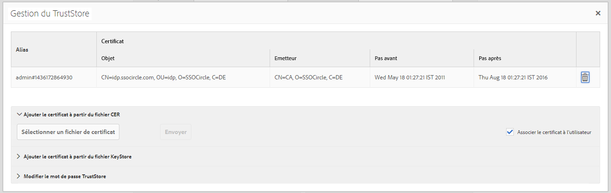
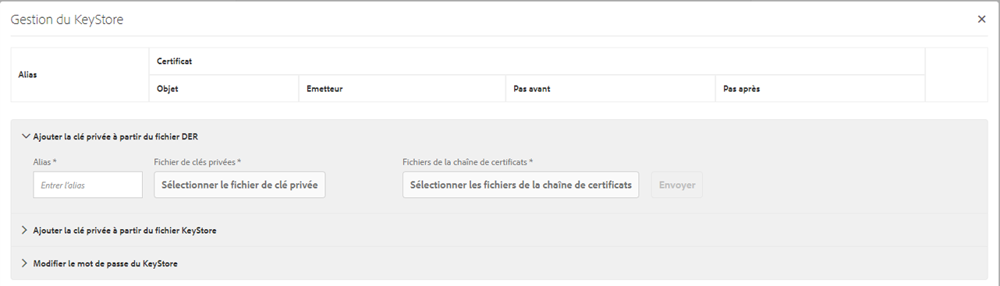

# Gestionnaire d’authentification SAML 2.0{#saml-authentication-handler}

AEM est livré avec un gestionnaire d’authentification [SAML](http://saml.xml.org/saml-specifications). Ce gestionnaire fournit la prise en charge du protocole de requête d’authentification [SAML](http://saml.xml.org/saml-specifications) 2.0 (profil web-SSO) à l’aide de la liaison `HTTP POST`.

Il prend en charge :

* la signature et le chiffrement des messages ;
* la création automatique d’utilisateurs ;
* la synchronisation des groupes avec les groupes existants dans AEM.
* Authentification initiée par le prestataire et le fournisseur d’identité

Ce gestionnaire stocke le message de réponse SAML chiffré dans le nœud utilisateur (`usernode/samlResponse`) pour faciliter la communication avec un fournisseur tiers.

>[!NOTE]
>
>Voir [une démonstration de l’intégration d’AEM et de SAML](https://helpx.adobe.com/experience-manager/kb/simple-saml-demo.html).
>
>Pour lire un article de la communauté de bout en bout, cliquez sur [Intégration de SAML avec Adobe Experience Manager](https://helpx.adobe.com/fr/experience-manager/using/aem63_saml.html).

## Configuration du gestionnaire d’authentification SAML 2.0 {#configuring-the-saml-authentication-handler}

La [console web](/help/sites-deploying/configuring-osgi.md) permet d’accéder à la configuration de gestionnaire d’authentification [SAML](http://saml.xml.org/saml-specifications) 2.0 appelée **Gestionnaire d’authentification SAML 2.0 Adobe Granite**. Les propriétés suivantes peuvent être définies.

>[!NOTE]
>
>Le gestionnaire d’authentification SAML 2.0 est désactivé par défaut. Vous devez définir au moins une des propriétés suivantes pour activer le gestionnaire :
>
>* L’URL de publication du fournisseur d’identité.
>* L’ID d’entité du fournisseur.

>

>[!NOTE]
>
>Les assertions SAML sont signées et peuvent éventuellement être chiffrées. Pour que cela fonctionne, vous devez fournir au moins le certificat public du fournisseur d’identité dans TrustStore. Voir [Ajout de certificat IdP à TrustStore](/help/sites-administering/saml-2-0-authenticationhandler.md#add-the-idp-certificate-to-the-aem-truststore) pour plus d’informations.

**Chemin** PathRepository pour lequel ce gestionnaire d&#39;authentification doit être utilisé par Sling. Si le champ est vide, le gestionnaire d’authentification est désactivé.

**Service** RankingOSGi Framework Service Ranking value pour indiquer l&#39;ordre dans lequel appeler ce service. Il s’agit d’un nombre entier, et les valeurs les plus élevées indiquent une priorité plus élevée.

**Alias du certificat IDP** Alias de l’alias du certificat IdP dans le Trust Store global. Si cette propriété n’est pas renseignée, le gestionnaire d’authentification est désactivé. Voir le chapitre Ajout du certificat IdP au TrustStore AEM ci-dessous sur la façon de le configurer.

**URL du fournisseur d’identité de l’** IDP à laquelle la demande d’authentification SAML doit être envoyée. Si cette propriété n’est pas renseignée, le gestionnaire d’authentification est désactivé.

>[!CAUTION]
>
>Le nom d’hôte du fournisseur d’identité doit être ajouté à la configuration OSGi **Filtre de référents Sling Apache**. Voir la section [Console web](/help/sites-deploying/configuring-osgi.md) pour plus d’informations.

**ID d&#39;entité de prestataire** qui identifie de manière unique ce prestataire auprès du fournisseur d&#39;identité. Si cette propriété n’est pas renseignée, le gestionnaire d’authentification est désactivé.

**Redirection** par défautEmplacement par défaut vers lequel rediriger après une authentification réussie.

>[!NOTE]
>
>Cet emplacement est utilisé uniquement si le cookie `request-path` n’est pas défini. Si vous demandez une page sous le chemin configuré sans jeton de connexion valide, le chemin demandé est stocké dans un cookie.
>et le navigateur sera de nouveau redirigé vers cet emplacement après une authentification réussie.

**User-ID** AttributeNom de l’attribut contenant l’ID utilisateur utilisé pour authentifier et créer l’utilisateur dans le référentiel CRX.

>[!NOTE]
>
>L’ID utilisateur n’est pas obtenu à partir du nœud `saml:Subject` de l’assertion SAML, mais à partir de ce `saml:Attribute`.

**Utiliser** EncryptionIndique si ce gestionnaire d&#39;authentification attend des assertions SAML chiffrées.

**Créer automatiquement des** utilisateurs CRX Indique s’il faut créer automatiquement des utilisateurs non existants dans le référentiel après une authentification réussie.

>[!CAUTION]
>
>Si la création automatique des utilisateurs CRX est désactivée, les utilisateurs doivent être créés manuellement.

**Ajouter aux** groupesIndique si un utilisateur doit être automatiquement ajouté aux groupes CRX après une authentification réussie.

**Appartenance au groupeNom de l&#39;attribut saml:Attribute contenant une liste de groupes CRX auquel cet utilisateur doit être ajouté.** 

## Ajout du certificat IdP au TrustStore AEM {#add-the-idp-certificate-to-the-aem-truststore}

Les assertions SAML sont signées et peuvent éventuellement être chiffrées. Pour que cela fonctionne, vous devez fournir au moins le certificat public de l’IdP dans le référentiel. Pour ce faire, vous devez :

1. Accédez à *http:/serveraddress:serverport/libs/granite/security/content/truststore.html*
1. Appuyez sur le lien **[!UICONTROL Créer TrustStore]**.
1. Saisissez le mot de passe du TrustStore et appuyez sur **[!UICONTROL Enregistrer]**.
1. Cliquez sur **[!UICONTROL Gérer TrustStore]**.
1. Téléchargez le certificat IdP.
1. Notez l’alias du certificat. L’alias est **[!UICONTROL admin#1436172864930]** dans l’exemple ci-dessous.

   

## Ajoutez la clé de fournisseur et la chaîne de certificats au KeyStore AEM.{#add-the-service-provider-key-and-certificate-chain-to-the-aem-keystore}

>[!NOTE]
>
>Les étapes ci-dessous sont obligatoires, sinon l’exception suivante sera levée : `com.adobe.granite.keystore.KeyStoreNotInitialisedException: Uninitialised system trust store`

1. Aller à : [http://localhost:4502/libs/granite/security/content/useradmin.html](http://localhost:4502/libs/granite/security/content/useradmin.html)
1. Modifiez l&#39;utilisateur `authentication-service`.
1. Créez un KeyStore en cliquant sur **Créer le KeyStore** sous **Paramètres du compte**.

>[!NOTE]
>
>Les étapes ci-dessous ne sont requises que si le gestionnaire doit être en mesure de signer ou de déchiffrer des messages.

1. Téléchargez le fichier de clé privée en cliquant sur **Sélectionner le fichier de clé privée**. Les clés doivent être au format PKCS#8 avec codage DER.
1. Téléchargez le fichier de certificat en cliquant sur **Sélectionner les fichiers de la chaîne de certificats**.
1. Attribuez un alias, comme illustré ci-dessous :

   

## Configuration d’un enregistreur pour SAML {#configure-a-logger-for-saml}

Vous pouvez configurer un enregistreur afin de déboguer tous les problèmes pouvant résulter d’une mauvaise configuration de SAML. Vous pouvez le faire en procédant comme suit :

1. Accédez à la console Web, *http://localhost:4502/system/console/configMgr*
1. Recherchez et cliquez sur l’entrée **Configuration du journal de journalisation Apache Sling**.
1. Créez un enregistreur avec la configuration suivante :

   * **Niveau de consignation :** débogage
   * **Fichier journal :** logs/saml.log
   * **Enregistreur :** com.adobe.granite.auth.saml

