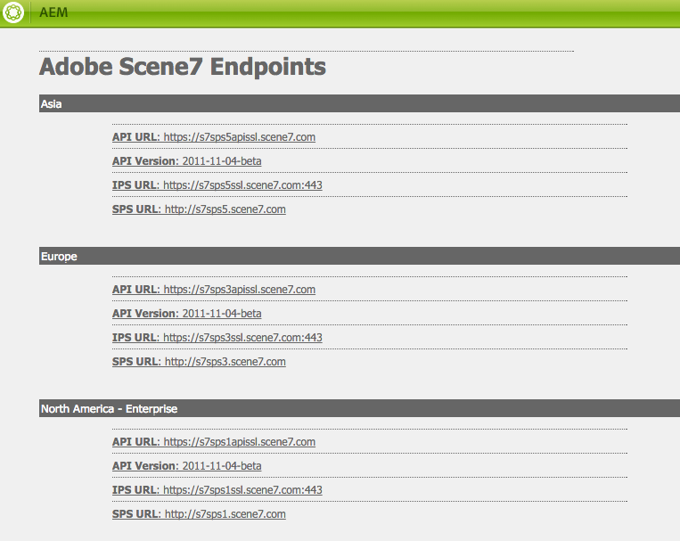
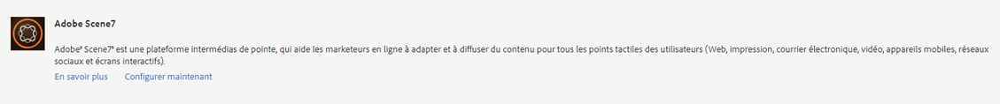
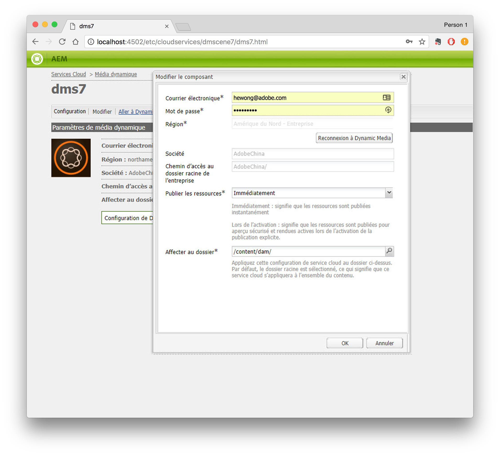
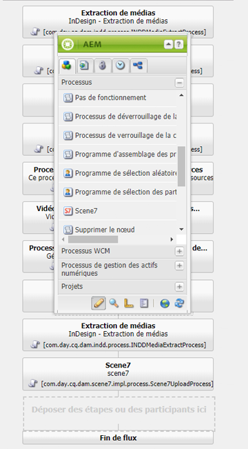
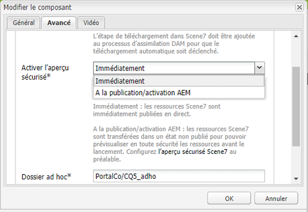
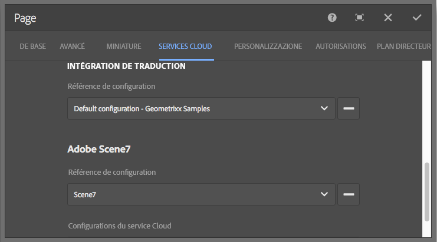
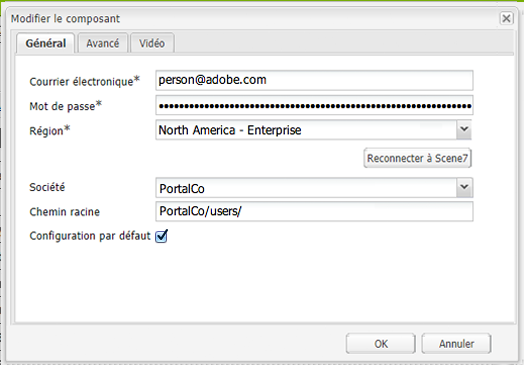
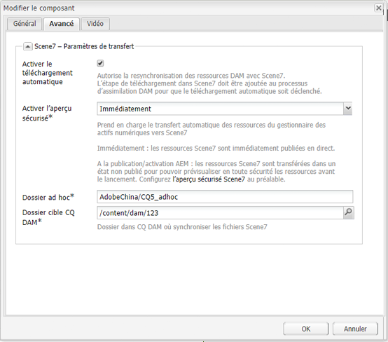

# Intégration à Dynamic Media Classic (Scene7){#integrating-with-dynamic-media-classic-scene}

[Adobe Dynamic Media Classic](https://help.adobe.com/en_US/scene7/using/WS26AB0D9A-F51C-464e-88C8-580A5A82F810.html) est une solution hébergée qui permet de gérer, d’améliorer, de publier et de diffuser des fichiers multimédias enrichis sur des écrans et des imprimantes Web, mobiles, électroniques et connectés à Internet.

Pour utiliser Dynamic Media Classic, vous devez configurer la configuration du cloud afin que Dynamic Media Classic et les AEM Assets puissent interagir les uns avec les autres. Ce document décrit comment configurer AEM et Dynamic Media Classic.

Pour plus d’informations sur l’utilisation de tous les composants Dynamic Media Classic sur une page et l’utilisation de la vidéo, voir [Utilisation de Dynamic Media Classic](../assets/scene7.md).

>[!NOTE]
>
>* La plate-forme du lecteur DHTML de Dynamic Media Classic a officiellement atteint la fin de vie le 31 janvier 2014. Pour plus d’informations, voir la [FAQ sur la fin de vie de la visionneuse DHTML](../sites-administering/dhtml-viewer-endoflifefaqs.md).
>* Avant de configurer Dynamic Media Classic pour une intégration avec AEM, voir [Bonnes pratiques](#best-practices-for-integrating-scene-with-aem) pour l’intégration de Dynamic Media Classic à AEM.
>* Si vous utilisez Dynamic Media Classic avec une configuration de proxy personnalisée, vous devez configurer les deux configurations de proxy du client HTTP car certaines fonctionnalités d’AEM utilisent les API 3.x et d’autres les API 4.x. 3.x is configured with [http://localhost:4502/system/console/configMgr/com.day.commons.httpclient](http://localhost:4502/system/console/configMgr/com.day.commons.httpclient) and 4.x is configured with [http://localhost:4502/system/console/configMgr/org.apache.http.proxyconfigurator](http://localhost:4502/system/console/configMgr/org.apache.http.proxyconfigurator).
>

## Intégration d’AEM/Dynamic Media Classic par rapport à Dynamic Media {#aem-scene-integration-versus-dynamic-media}

Les utilisateurs d’AEM ont le choix entre deux solutions pour utiliser le média dynamique : Intégration de leur instance d’AEM à Dynamic Media Classic ou utilisation de la solution Dynamic Media intégrée à AEM.

Utilisez les critères suivants pour déterminer la solution à sélectionner :

* If you are an **existing** Dynamic Media Classic customer whose rich media assets reside in Dynamic Media Classic for publishing and delivery, but you want to integrate those assets with Sites (WCM) authoring and/or AEM Assets for management, then use the [AEM/Dynamic Media Classic point-to-point integration](#aem-scene-point-to-point-integration) described in this document.

* Si vous êtes un **nouveau** client d’AEM ayant des besoins de diffusion de contenu multimédia enrichi, sélectionnez l’option [Dynamic Media](#aem-dynamic-media). Cette option a plus de sens si vous ne disposez pas d’un compte S7 et que vous avez de nombreuses ressources stockées dans ce système.

* Dans certains cas, vous pouvez utiliser les deux solutions. The [dual-use scenario](/help/sites-administering/scene7.md#dual-use-scenario) describes that scenario.

### Intégration point à point AEM/Dynamic Media Classic {#aem-scene-point-to-point-integration}

Lorsque vous utilisez des ressources dans cette solution, vous effectuez l’une des opérations suivantes :

* Téléchargez des ressources directement vers Dynamic Media Classic, puis accédez-y par le biais de l’explorateur de contenu **Dynamic Media Classic** pour la création de pages ou
* Upload to AEM Assets and then enable automatic publishing to Dynamic Media Classic; you access via **Assets** content browser for page authoring

The components you use for this integration are found in the **Dynamic Media Classic** component area in [Design mode.](/help/sites-authoring/author-environment-tools.md#page-modes)

### AEM Dynamic Media {#aem-dynamic-media}

AEM Dynamic Media est l’unification des fonctionnalités de Dynamic Media Classic directement dans la plate-forme AEM.

Lorsque vous travaillez avec des ressources dans cette solution, vous suivez ce workflow :

1. Télécharger une image unique et des contenus vidéo directement vers AEM.
1. Coder des vidéos directement dans AEM.
1. Créer des jeux basés sur des images directement dans AEM.
1. Le cas échéant, ajouter une certaine interactivité aux images ou aux vidéos.

Les composants que vous utilisez pour Dynamic Media se trouvent dans la zone du composant **[!UICONTROL Dynamic Media]** en [mode Conception](/help/sites-authoring/author-environment-tools.md#page-modes). Ils comprennent les éléments suivants :

* **[!UICONTROL Dynamic Media]** : le composant **[!UICONTROL Dynamic Media]** est dynamique ; il propose des options différentes selon que vous ajoutez une image ou une vidéo. Le composant prend en charge les paramètres d’image prédéfinis, ainsi que les visionneuses d’images telles que les visionneuses d’images, les visionneuses à 360°, les visionneuses de médias mixtes et le contenu vidéo. En outre, la visionneuse est réactive : la taille de l’écran change automatiquement en fonction de la taille d’écran. Toutes les visionneuses sont des visionneuses HTML5.

* **[!UICONTROL Interactive Media]** : le composant **[!UICONTROL Interactive Media]** est destiné aux ressources (par exemple, les bannières de carrousel, les images interactives et la vidéo interactive) offrant une interactivité (par exemple, des zones réactives ou des zones cliquables). Ce composant est dynamique : il propose des options différentes selon que vous ajoutez une image ou une vidéo. En outre, la visionneuse est réactive : la taille de l’écran change automatiquement en fonction de la taille d’écran. Toutes les visionneuses sont des visionneuses HTML5.

### Scénario à double utilisation {#dual-use-scenario}

Vous pouvez utiliser simultanément les fonctionnalités d’intégration Dynamic Media et Dynamic Media Classic d’AEM. Le tableau suivant décrit les cas d’utilisation lorsque vous activez ou désactivez certaines zones.

Pour utiliser simultanément Dynamic Media et Dynamic Media Classic :

1. Configurez [Dynamic Media Classic](#creating-a-cloud-configuration-for-scene) dans les services cloud.
1. Suivez les instructions spécifiques correspondant à votre cas d’utilisation :

   <table>
    <tbody>
    <tr>
    <td> </td>
    <td> </td>
    <td><strong>Dynamic Media</strong></td>
    <td> </td>
    <td><strong>Intégration Dynamic Media Classic</strong></td>
    <td> </td>
    </tr>
    <tr>
    <td><strong>Si vous êtes ...</strong></td>
    <td><strong>Processus de cas d’utilisation</strong></td>
    <td><strong>Imagerie/vidéo</strong></td>
    <td><strong>Composant Dynamic Media</strong></td>
    <td><strong>Explorateur de contenu et composants Scene7</strong></td>
    <td><strong>Téléchargement automatique des ressources vers S7</strong></td>
    </tr>
    <tr>
    <td>Nouveaux sites et Dynamic Media</td>
    <td>Téléchargez des ressources vers AEM et utilisez le composant Dynamic Media d’AEM pour créer des ressources sur les pages de sites.</td>
    <td>
Activé
 
(Voir étape 3)
 </td>
    <td><a href="/help/assets/adding-dynamic-media-assets-to-pages.md">Activé</a></td>
    <td>Désactivé</td>
    <td>Désactivé</td>
    </tr>
    <tr>
    <td>Dans la vente au détail et sont nouveaux sur les sites et Dynamic Media</td>
    <td>Téléchargez des ressources NON liées aux produits vers AEM pour la gestion et la diffusion. Téléchargez des fichiers PRODUCT vers Dynamic Media Classic et utilisez le navigateur de contenu Dynamic Media Classic dans AEM et le composant pour créer des pages de détails sur les produits sur les sites.</td>
    <td>
Activé
 
(Voir étape 3)
 </td>
    <td><a href="/help/assets/adding-dynamic-media-assets-to-pages.md">Activé</a></td>
    <td><a href="/help/assets/scene7.md#scene-content-browser">Activé</a></td>
    <td>Désactivé</td>
    </tr>
    <tr>
    <td>Nouveautés des ressources et de Dynamic Media</td>
    <td>Téléchargez des fichiers vers des AEM Assets et utilisez l’URL publiée/le code incorporé de Dynamic Media.</td>
    <td>
Activé
 
(Voir étape 3)
 </td>
    <td>Désactivé</td>
    <td>Désactivé</td>
    <td>Désactivé</td>
    </tr>
    <tr>
    <td>Nouveau sur Dynamic Media et les modèles</td>
    <td>Utilisez Dynamic Media pour la création d’images et la vidéo. Créez des modèles d’image dans Dynamic Media Classic et utilisez l’outil de recherche de contenu Dynamic Media Classic pour inclure des modèles dans les pages de sites.</td>
    <td>
Activé
 
(Voir étape 3)
 </td>
    <td><a href="/help/assets/adding-dynamic-media-assets-to-pages.md">Activé</a></td>
    <td><a href="/help/assets/scene7.md#scene-content-browser">Activé</a></td>
    <td>Désactivé</td>
    </tr>
    <tr>
    <td>Un client Dynamic Media Classic existant et les nouveaux sites</td>
    <td>Téléchargez des ressources vers Dynamic Media Classic et utilisez l’explorateur de contenu AEM Dynamic Media Classic pour rechercher et créer des ressources sur les pages de sites.</td>
    <td>Désactivé</td>
    <td>Désactivé</td>
    <td><a href="/help/assets/scene7.md#scene-content-browser">Activé</a></td>
    <td>Désactivé</td>
    </tr>
    <tr>
    <td>Un client Dynamic Media Classic existant et les nouveaux sites et ressources</td>
    <td>Téléchargez des ressources vers DAM et publiez automatiquement vers Dynamic Media Classic pour diffusion. Utilisez l’explorateur de contenu AEM Dynamic Media Classic pour rechercher et créer des ressources sur les pages de sites.</td>
    <td>Désactivé</td>
    <td>Désactivé</td>
    <td><a href="/help/assets/scene7.md#scene-content-browser">Activé</a></td>
    <td>
<a href="#configuringautouploadingfromaemassets">Activé</a>
 
(Voir étape 4)
 </td>
    </tr>
    <tr>
    <td>Client Dynamic Media Classic existant et nouveau dans Assets</td>
    <td>
Téléchargez des ressources vers AEM et utilisez Dynamic Media pour générer des rendus à télécharger/partager. Publiez automatiquement les ressources AEM dans Dynamic Media Classic pour diffusion.
 
<strong>Important :</strong> Le traitement du duplicata et les rendus générés dans AEM ne seront pas synchronisés avec Dynamic Media Classic.
 </td>
    <td>
Activé
 
(Voir étape 3)
 </td>
    <td>Désactivé</td>
    <td>Désactivé</td>
    <td>
<a href="#configuringautouploadingfromaemassets">Activé</a>
 
(Voir étape 4)
 </td>
    </tr>
    </tbody>
    </table>

1. (Optional; see use case table) - Set up the [Dynamic Media cloud configuration](/help/assets/config-dynamic.md) and [enable the Dynamic Media server](/help/assets/config-dynamic.md).
1. (Facultatif) voir le tableau de cas d’utilisation) - Si vous choisissez d’activer le téléchargement automatique à partir des ressources vers Dynamic Media Classic, vous devez ajouter les éléments suivants :

   1. Configurez le téléchargement automatique vers Dynamic Media Classic.
   1. Ajoutez l’étape de téléchargement **** Dynamic Media Classic après toutes les étapes du processus Dynamic Media *à la fin du processus de mise à jour des ressources* **** de barrage ( `https://<server>:<host>/cf#/etc/workflow/models/dam/update_asset.html)`
   1. (Optional) Restrict Dynamic Media Classic asset upload by MIME type in [https://&lt;server>:&lt;port>/system/console/configMgr/com.day.cq.dam.scene7.impl.Scene7AssetMimeTypeServiceImpl](http://localhost:4502/system/console/configMgr/com.day.cq.dam.scene7.impl.Scene7AssetMimeTypeServiceImpl). Les types MIME de ressources qui ne figurent pas dans cette liste ne seront pas téléchargés vers le serveur Dynamic Media Classic.
   1. (Facultatif) Configurez la vidéo dans la configuration Dynamic Media Classic. Vous pouvez activer simultanément le codage vidéo pour Dynamic Media et Dynamic Media Classic, ou pour les deux. Les rendus dynamiques sont utilisés pour la prévisualisation et la lecture localement dans l’instance AEM, tandis que les rendus vidéo Dynamic Media Classic sont générés et stockés sur les serveurs Dynamic Media Classic. When setting up video encoding services for both Dynamic Media and Dynamic Media Classic, apply a [video processing profile](/help/assets/video-profiles.md) to the Dynamic Media Classic asset folder.
   1. (Facultatif) [Configurez la prévisualisation sécurisée dans Dynamic Media Classic](/help/sites-administering/scene7.md#configuring-the-state-published-unpublished-of-assets-pushed-to-scene).

#### Restrictions {#limitations}

Lorsque Dynamic Media Classic et Dynamic Media sont activés, les restrictions suivantes s’appliquent :

* Le téléchargement manuel vers Dynamic Media Classic en sélectionnant un fichier et en le faisant glisser vers un composant Dynamic Media Classic sur une page AEM ne fonctionne pas.
* Bien que les ressources synchronisées AEM-Dynamic Media Classic soient automatiquement mises à jour vers Dynamic Media Classic lorsque la ressource est modifiée dans Assets, une action d’annulation ne déclenche pas un nouveau téléchargement, de sorte que Dynamic Media Classic n’obtient pas la dernière version immédiatement après une annulation. La solution consiste à procéder à une nouvelle modification une fois la restauration terminée.
* Si vous devez utiliser Dynamic Media pour un cas d’utilisation et l’intégration Dynamic Media Classic pour un autre cas d’utilisation, de sorte que les actifs Dynamic Media n’interagissent pas avec le système Dynamic Media Classic, n’appliquez pas la configuration Dynamic Media Classic au dossier Dynamic Media ou à la configuration Dynamic Media (profil de traitement) à un dossier Dynamic Media Classic.

## Recommandations relatives à l’intégration de Dynamic Media Classic avec AEM {#best-practices-for-integrating-scene-with-aem}

Lors de l’intégration de Dynamic Media Classic à AEM, certaines bonnes pratiques importantes doivent être observées dans les domaines suivants :

* Test de votre intégration
* Téléchargement direct de ressources à partir de Dynamic Media Classic recommandé pour certains scénarios

Voir limitations connues.

### Test de votre intégration {#test-driving-your-integration}

Adobe vous recommande de tester votre intégration en pointant votre dossier racine vers un sous-dossier uniquement plutôt que vers une société entière.

>[!CAUTION]
>
>L’importation d’actifs à partir d’un compte de société Dynamic Media Classic existant peut prendre du temps à s’afficher dans AEM. Assurez-vous de désigner un dossier dans Dynamic Media Classic qui ne comporte pas trop de ressources (par exemple, le dossier racine comporte souvent trop de ressources et risque de bloquer votre système).

### Téléchargement de fichiers à partir de AEM Assets ou de Dynamic Media Classic {#uploading-assets-from-aem-assets-versus-from-scene}

Vous pouvez télécharger des ressources à l’aide de la fonctionnalité Ressources (gestion des ressources numériques) ou en accédant directement à Dynamic Media Classic dans AEM via l’explorateur de contenu Dynamic Media Classic. Votre choix dépend des facteurs suivants :

* Les types de ressources Dynamic Media Classic que les AEM Assets ne prennent pas encore en charge doivent être ajoutés directement à un site Web AEM à partir de Dynamic Media Classic, via le navigateur de contenu Dynamic Media Classic, par exemple les modèles d’image.
* Pour les types de ressources pris en charge par les AEM Assets et Dynamic Media Classic, la décision de les télécharger dépend des éléments suivants :

   * L’emplacement actuel des ressources ET
   * Importance de leur gestion dans un référentiel commun

Si les ressources se trouvent déjà dans Dynamic Media Classic et que leur gestion dans un référentiel commun n’est pas aussi importante, l’exportation vers des AEM Assets uniquement pour les synchroniser à nouveau dans Dynamic Media Classic pour diffusion serait un aller-retour inutile. Sinon, il peut être préférable de conserver les ressources dans un référentiel unique et de synchroniser Dynamic Media Classic uniquement pour la diffusion.

## Configuring Dynamic Media Classic integration {#configuring-scene-integration}

Vous pouvez configurer AEM pour télécharger des ressources vers Dynamic Media Classic. Les ressources d’un dossier de cible CQ peuvent être téléchargées (automatiquement ou manuellement) depuis AEM vers un compte de société Dynamic Media Classic.

>[!NOTE]
>
>Adobe vous recommande d’utiliser uniquement le dossier de cible désigné pour importer les actifs Dynamic Media Classic. Les ressources numériques qui résident en dehors du dossier cible ne peuvent être utilisées que dans les composants Dynamic Media Classic sur les pages sur lesquelles la configuration Dynamic Media Classic a été activée. En outre, ils sont placés dans un dossier ad hoc dans Dynamic Media Classic. Le dossier ad hoc n’est pas synchronisé avec AEM (mais les ressources sont détectables dans le navigateur de contenu Dynamic Media Classic).

Pour configurer Dynamic Media Classic pour l’intégration à AEM, vous devez effectuer les étapes suivantes :

1. [Définir une configuration](#creating-a-cloud-configuration-for-scene) cloud : définit le mappage entre un dossier Dynamic Media Classic et un dossier Assets. Vous devez effectuer cette étape même si vous souhaitez uniquement une synchronisation unidirectionnelle (AEM Assets vers Dynamic Media Classic).
1. [Activez l’écouteur **de barrage **](#enabling-the-adobe-cq-scene-dam-listener)Adobe CQ s7dam - Terminé dans la console[!UICONTROL OSGi].
1. If you want AEM assets to automatically upload to Dynamic Media Classic, you need to turn that option on and add Dynamic Media Classic to the [!UICONTROL DAM Update Asset] workflow. Vous pouvez également télécharger les ressources manuellement.
1. Ajouter les composants Dynamic Media Classic au panneau latéral. Cela permet aux utilisateurs d’utiliser les composants Dynamic Media Classic sur leurs pages AEM.
1. [Faites correspondre la configuration à la page dans AEM](#enabling-scene-for-wcm) : cette étape est nécessaire pour vue des paramètres vidéo prédéfinis que vous avez créés dans Dynamic Media Classic. Elle est également requise si vous devez publier un fichier en dehors du dossier de cible CQ dans Dynamic Media Classic.

Cette section décrit comment effectuer toutes ces étapes et répertorie des restrictions importantes.

### Fonctionnement de la synchronisation entre Dynamic Media Classic et les AEM Assets {#how-synchronization-between-scene-and-aem-assets-works}

Lors de la configuration de la synchronisation AEM Assets et Dynamic Media Classic, il est important de comprendre les points suivants :

#### Téléchargement vers Dynamic Media Classic à partir de AEM Assets {#uploading-to-scene-from-aem-assets}

* Il existe un dossier de synchronisation désigné dans AEM pour les téléchargements Dynamic Media Classic.
* Les téléchargements vers Dynamic Media Classic peuvent être automatisés si les ressources numériques sont placées dans le dossier de synchronisation désigné.
* La structure de dossiers et de sous-dossiers dans AEM est répliquée dans Dynamic Media Classic.

>[!NOTE]
>
>AEM incorpore toutes les métadonnées au format XMP avant de les télécharger vers Dynamic Media Classic. Par conséquent, toutes les propriétés du noeud de métadonnées sont disponibles dans Dynamic Media Classic en tant que XMP.

#### Restrictions connues et implications en termes de conception {#known-limitations-and-design-implications}

Avec la synchronisation entre les AEM Assets et Dynamic Media Classic, il existe actuellement les limitations/implications de conception suivantes :

<table>
 <tbody>
  <tr>
   <td><strong>Limitation/implication de la conception</strong></td>
   <td><strong>Description</strong></td>
  </tr>
  <tr>
   <td>Un dossier de synchronisation désigné (cible)</td>
   <td>Vous ne pouvez avoir qu’un seul dossier désigné par société dans AEM pour les téléchargements Dynamic Media Classic. Vous pouvez créer plusieurs configurations si vous devez avoir accès à plusieurs comptes de société dans Dynamic Media Classic.</td>
  </tr>
  <tr>
   <td>Structure du dossier</td>
   <td>Si vous supprimez un dossier synchronisé avec des ressources, toutes les ressources distantes Dynamic Media Classic sont supprimées, mais le dossier reste.</td>
  </tr>
  <tr>
   <td>Dossier ad hoc</td>
   <td>Les ressources qui résident en dehors du dossier cible et qui sont téléchargées manuellement vers Dynamic Media Classic dans WCM sont automatiquement placées dans un dossier ad hoc distinct sur Dynamic Media Classic. Configurez ce paramètre dans la configuration du cloud dans AEM.</td>
  </tr>
  <tr>
   <td>Média mixte</td>
   <td>Les visionneuses de supports variés apparaissent dans AEM bien qu’elles ne soient pas prises en charge dans AEM.</td>
  </tr>
  <tr>
   <td>PDF</td>
   <td>Les fichiers PDF générés à partir de catalogues électroniques dans Dynamic Media Classic sont importés dans le dossier de cible CQ.</td>
  </tr>
  <tr>
   <td>Actualisation de l’interface utilisateur</td>
   <td>Lors de la synchronisation entre AEM et Dynamic Media Classic, veillez à actualiser l’interface utilisateur en fonction des modifications de vue. </td>
  </tr>
  <tr>
   <td>Miniatures vidéo</td>
   <td>Si vous téléchargez une vidéo en AEM Assets pour l’encodage via Dynamic Media Classic, les miniatures vidéo et les vidéos codées peuvent prendre un certain temps pour être disponibles en AEM Assets, selon le temps de traitement de la vidéo.</td>
  </tr>
  <tr>
   <td>Sous-dossiers de Cible</td>
   <td>
Si vous utilisez des sous-dossiers dans le dossier cible, veillez à utiliser des noms uniques pour chaque fichier (quel que soit l’emplacement) ou à configurer Dynamic Media Classic (dans la zone Configuration) pour qu’il ne remplace pas les fichiers quel que soit l’emplacement.
 
Sinon, les fichiers portant le même nom qui sont téléchargés vers un sous-dossier de cible Dynamic Media Classic sont téléchargés, mais le fichier portant le même nom dans le dossier de cible est supprimé. 
 </td>
  </tr>
 </tbody>
</table>

### Configuring Dynamic Media Classic servers {#configuring-scene-servers}

Si vous exécutez AEM derrière un proxy ou si vous disposez de paramètres de pare-feu spéciaux, vous devrez peut-être activer explicitement les hôtes des différentes régions. Servers are managed in content in `/etc/cloudservices/scene7/endpoints` and can be customized as required. Appuyez sur une URL, puis modifiez-la pour la modifier, si nécessaire. Dans les versions précédentes d’AEM, ces valeurs étaient codées en dur.

If you navigate to `/etc/cloudservices/scene7/endpoints.html`, you see the servers listed (and can edit them by clicking on the URL):

### Création d’une configuration de cloud pour Dynamic Media Classic {#creating-a-cloud-configuration-for-scene}

Une configuration de cloud définit le mappage entre un dossier Dynamic Media Classic et un dossier AEM Assets. Il doit être configuré pour synchroniser les AEM Assets avec Dynamic Media Classic. Voir Fonctionnement de la synchronisation pour en savoir plus.

>[!CAUTION]
>
>L’importation d’actifs à partir d’un compte de société Dynamic Media Classic existant peut prendre du temps à s’afficher dans AEM. Assurez-vous de désigner un dossier dans Dynamic Media Classic qui ne comporte pas trop de ressources (par exemple, le dossier racine comporte souvent trop de ressources).
>
>Si vous souhaitez tester l’intégration, vous pouvez faire pointer le dossier racine vers un sous-dossier uniquement, au lieu de l’entreprise entière.

>[!NOTE]
>
>Vous pouvez avoir plusieurs configurations : une configuration de cloud représente un utilisateur sur une société Dynamic Media Classic. Si vous souhaitez accéder à d’autres sociétés ou utilisateurs de Dynamic Media Classic, vous devez créer plusieurs configurations.

Pour configurer AEM de manière à pouvoir publier des ressources sur Dynamic Media Classic :

1. Appuyez sur l’icône AEM et accédez à **[!UICONTROL Déploiement > Cloud Service]** pour accéder à Dynamic Media Classic.

1. Appuyez sur **[!UICONTROL Configurer maintenant.]**

   

1. Dans le champ **[!UICONTROL Titre]** et éventuellement dans le champ **[!UICONTROL Nom]**, saisissez les informations appropriées. Appuyez sur **[!UICONTROL Créer.]**

   >[!NOTE]
   >
   >When creating additional configurations, the **[!UICONTROL parent configuration]** field displays.
   >
   >Ne modifiez **pas** la configuration du parent. La modification de la configuration du parent peut supprimer l’intégration.

1. Entrez l’adresse électronique, le mot de passe et la région de votre compte Dynamic Media Classic et appuyez sur **[!UICONTROL Se connecter à Dynamic Media Classic.]** Vous êtes connecté au serveur Dynamic Media Classic et la boîte de dialogue se développe avec plus d’options.

1. Enter the **[!UICONTROL Company]** name and **[!UICONTROL Root Path]** (this is the published server name together with any path you want to specify; if you do not know the published server name, in Dynamic Media Classic, go to **[!UICONTROL Setup > Application Setup.]**)

   >[!NOTE]
   >
   >Le chemin d’accès racine Dynamic Media Classic correspond au dossier Dynamic Media Classic auquel AEM se connecte. Il peut être réduit à un dossier spécifique.

   >[!CAUTION]
   >
   >Selon la taille du dossier Dynamic Media Classic, l’importation d’un dossier racine peut prendre du temps. En outre, les données Dynamic Media Classic peuvent dépasser l’enregistrement AEM. Vérifiez que vous importez le bon dossier. Importer trop de données peut arrêter votre système.

   

1. Cliquez sur **[!UICONTROL OK.]** AEM enregistre votre configuration.

>[!NOTE]
>
>Si vous vous reconnectez :
>
>* Lors de la reconnexion à Dynamic Media Classic lors de la publication, vous devrez peut-être réinitialiser le mot de passe lors de la publication ou la reconnexion ne fonctionnera pas. Il ne s’agit pas d’un problème lié à l’instance de création.
>* Si vous modifiez des valeurs telles que votre région, le nom de la société, vous devez vous reconnecter à Dynamic Media Classic. Si les options de configuration ont été modifiées, mais pas enregistrées, AEM continue à tor d’indiquer que la configuration est valide. N’oubliez pas de vous reconnecter.
>

### Activation de l’écouteur de barrage Dynamic Media Classic Adobe {#enabling-the-adobe-cq-scene-dam-listener}

Vous devez activer le module d’écoute Adobe CQ Dynamic Media Classic Dam Listener, qui est désactivé par défaut.

Pour l’activer :

1. Tap the [!UICONTROL Tools] icon, then navigate to **[!UICONTROL Operations > Web Console.]** La console Web s’ouvre.
1. Navigate to **[!UICONTROL Adobe CQ Dynamic Media Classic Dam Listener]** and select the **[!UICONTROL Enabled]** check box.

   

1. Appuyez sur **[!UICONTROL Enregistrer.]**

### Ajouter un délai d’attente configurable au flux de travail de téléchargement Dynamic Media Classic {#adding-configurable-timeout-to-scene-upload-workflow}

Lorsqu’une instance AEM est configurée pour traiter le codage vidéo via Dynamic Media Classic (Scene7), par défaut, les tâches de téléchargement sont soumises à un délai d’expiration de 35 minutes. Pour pouvoir effectuer les tâches de codage vidéo potentiellement plus longues, vous pouvez configurer ce paramètre :

1. Navigate to **http://localhost:4502/system/console/configMgr/com.day.cq.dam.scene7.impl.Scene7UploadServiceImpl**.

   

1. Dans le champ **[!UICONTROL Délai d’expiration de la tâche active]**, modifiez le nombre selon les besoins. Sont acceptés tous les nombres non négatifs,avec l’unité de mesure en secondes. Par défaut, ce champ est défini sur 2100.

   >[!NOTE]
   >
   >Bonne pratique : la plupart des ressources sont assimilées en quelques minutes au plus (par exemple, les images). Mais dans certains cas (par exemple, les vidéos volumineuses), la valeur du délai d’expiration doit être augmentée à 7200 secondes (2 heures) afin de prendre en compte les temps de traitement longs. Otherwise, this Dynamic Media Classic upload job is marked as **[!UICONTROL UploadFailed]** in the JCR metadata.

1. Appuyez sur **[!UICONTROL Enregistrer.]**

### Téléchargement automatique depuis AEM Assets {#autouploading-from-aem-assets}

À partir d’AEM 6.3.2, les AEM Assets sont désormais configurés pour vous de sorte que les ressources numériques que vous téléchargez dans le gestionnaire de ressources numériques soient automatiquement mises à jour vers Dynamic Media Classic si elles se trouvent dans un dossier de cible CQ.

Lorsqu’un fichier est ajouté en AEM Assets, il est automatiquement téléchargé et publié dans Dynamic Media Classic.

>[!NOTE]
>
>La taille de fichier maximale pour le transfert automatique du AEM Assets vers Dynamic Media Classic est de 500 Mo.

Pour configurer le téléchargement automatique à partir d’AEM Assets :

1. Tap the AEM icon and navigate to **[!UICONTROL Deployment > Cloud Services]** then, under the Dynamic Media heading, under Available Configurations, tap **[!UICONTROL dms7 (Dynamic Media]**)
1. Tap the **[!UICONTROL Advanced]** tab, select the **[!UICONTROL Enable Automatic Upload]** check box, then tap **[!UICONTROL OK.]** Vous devez maintenant configurer le processus de gestion des actifs numériques pour inclure le transfert vers Dynamic Media Classic.

   >[!NOTE]
   >
   >See [Configuring the state (published/unpublished) of assets pushed to Dynamic Media Classic](#configuring-the-state-published-unpublished-of-assets-pushed-to-scene) for information on pushing assets to Dynamic Media Classic in an unpublished state.

   

1. Navigate back to the AEM welcome page and tap **[!UICONTROL Workflows.]** Double-cliquez sur le workflow **Ressources de mise à jour de gestion des actifs numériques** pour l’ouvrir.
1. In the sidekick, navigate to the **[!UICONTROL Workflow]** components, and select **[!UICONTROL Dynamic Media Classic.]** Faites glisser **[!UICONTROL Dynamic Media Classic]** vers le processus et appuyez sur **[!UICONTROL Enregistrer.]** Les ressources ajoutées aux AEM Assets dans le dossier cible seront automatiquement téléchargées vers Dynamic Media Classic.

   

   >[!NOTE]
   >
   >* Lors de l’ajout de fichiers après l’automatisation, s’ils ne sont pas placés dans le dossier de cible CQ, ils ne sont pas téléchargés vers Dynamic Media Classic.
   >* AEM incorpore toutes les métadonnées au format XMP avant de les télécharger vers Dynamic Media Classic. Par conséquent, toutes les propriétés du noeud de métadonnées sont disponibles dans Dynamic Media Classic en tant que XMP.

### Configuration de l’état (publié/non publié) des ressources transférées vers Dynamic Media Classic {#configuring-the-state-published-unpublished-of-assets-pushed-to-scene}

Si vous poussez des fichiers du AEM Assets vers Dynamic Media Classic, vous pouvez soit les publier automatiquement (comportement par défaut), soit les placer vers Dynamic Media Classic dans un état non publié.

Vous ne souhaitez peut-être pas publier les fichiers immédiatement sur Dynamic Media Classic si vous souhaitez les tester dans un environnement d’évaluation avant de les publier. Vous pouvez utiliser AEM avec l’environnement de test sécurisé de Dynamic Media Classic pour envoyer directement des ressources de Assets vers Dynamic Media Classic dans un état non publié.

Les ressources Dynamic Media Classic restent disponibles via une prévisualisation sécurisée. Ce n’est que lorsque des ressources sont publiées dans AEM que les ressources Dynamic Media Classic sont également mises en production.

Si vous souhaitez publier immédiatement des fichiers lorsque vous les poussez dans Dynamic Media Classic, vous n’avez pas besoin de configurer d’options. Il s’agit du comportement par défaut.

Cependant, si vous ne souhaitez pas que les ressources transférées vers Dynamic Media Classic publient automatiquement, cette section décrit comment configurer AEM et Dynamic Media Classic pour ce faire.

#### Conditions préalables pour pousser les ressources vers Dynamic Media Classic non publiées {#prerequisites-to-push-assets-to-scene-unpublished}

Avant de pouvoir transmettre des fichiers à Dynamic Media Classic sans les publier, vous devez configurer les éléments suivants :

1. Contactez l’assistance clientèle de Dynamic Media Classic (s7support@adobe.com) pour activer la prévisualisation sécurisée de votre compte Dynamic Media Classic.
1. Follow directions to [setup secure preview for your Dynamic Media Classic account.](https://help.adobe.com/en_US/scene7/using/WSd968ca97bf00cf72-5eeee3a113268dc80f5-8000.html)

Il s’agit des mêmes étapes que celles que vous suivez pour créer une configuration de test sécurisée dans Dynamic Media Classic.

>[!NOTE]
>
>If your installation environment is a Unix 64-bit operating system, see [https://helpx.adobe.com/experience-manager/kb/enable-xmp-write-back-64-bit-redhat.html](https://helpx.adobe.com/experience-manager/kb/enable-xmp-write-back-64-bit-redhat.html) regarding additional configuration options you need to set.

#### Limites connues pour pousser des ressources dans l’état dépublié  {#known-limitations-for-pushing-assets-in-unpublished-state}

Si vous utilisez cette fonction, veuillez tenir compte des restrictions suivantes :

* Il n’existe aucune prise en charge du contrôle de version.
* Si une ressource est déjà publiée dans la AEM et qu’une nouvelle version est créée, cette nouvelle version est immédiatement publiée en production. La publication sur activation ne fonctionne qu’avec la publication initiale d’une ressource.

>[!NOTE]
>
>If you want to publish assets instantly, best practice is to keep **[!UICONTROL Enable Secure Preview]** set to **[!UICONTROL Immediately]** and use the **[!UICONTROL Enable Automatic Upload]** feature.

### Définition de l’état des ressources transférées à Dynamic Media Classic comme non publiées {#setting-the-state-of-assets-pushed-to-scene-as-unpublished}

>[!NOTE]
>
>Si un utilisateur publie la ressource dans AEM, ceci active automatiquement l’état de production/mise en ligne de la ressource S7 (l’état de la ressource n’est plus dépublié/aperçu sécurisé).

Pour définir l’état des ressources transférées vers Dynamic Media Classic comme non publiées :

1. Appuyez sur l’icône AEM et accédez à **[!UICONTROL Déploiement > Cloud Service]**, appuyez sur **[!UICONTROL Dynamic Media Classic]** et sélectionnez votre configuration dans Dynamic Media Classic.
1. Sélectionnez l&#39;onglet **[!UICONTROL Avancé.]** In the **[!UICONTROL Enable Secure View]** drop-down menu, select **[!UICONTROL Upon AEM Publish Activation]** to push assets to Dynamic Media Classic without publishing. (By default, this value is set to **[!UICONTROL Immediately]**, where Dynamic Media Classic assets are published immediately.)

   See [Dynamic Media Classic documentation](https://help.adobe.com/en_US/scene7/using/WSd968ca97bf00cf72-5eeee3a113268dc80f5-8000.html) for more information on testing assets before making them public.

   

1. Appuyez sur **[!UICONTROL OK.]**

Avec l’option Activer la vue sécurisée, vos ressources sont poussées vers le serveur d’aperçu sécurisé sans être publiées.

You can check this by navigating to a Dynamic Media Classic component on a page in AEM and tapping **[!UICONTROL Edit.]** Pour la ressource, le serveur d’aperçu sécurisé est indiqué dans l’URL. Après la publication dans AEM, le domaine de serveur dans la référence de fichier est mis à jour et passe de l’URL d’aperçu à l’URL de production.

### Activation de Dynamic Media Classic pour WCM {#enabling-scene-for-wcm}

L’activation de Dynamic Media Classic pour WCM est requise pour deux raisons :

* Pour activer la liste déroulante des profils vidéo universels en vue de la création de pages. Without this, the **[!UICONTROL Universal Video Preset]** drop-down is empty and cannot be set.
* Si une ressource numérique ne se trouve pas dans le dossier cible, vous pouvez télécharger la ressource vers Dynamic Media Classic si vous activez Dynamic Media Classic pour cette page dans les propriétés de la page et faites glisser et déposez la ressource sur un composant Dynamic Media Classic. Les règles d’héritage normales s’appliquent (en d’autres termes, les pages enfants héritent de la configuration de la page parente).

Lorsque vous activez Dynamic Media Classic pour la gestion de contenu Web, notez que, comme pour les autres configurations, les règles d’héritage s’appliquent. Vous pouvez activer Dynamic Media Classic pour WCM dans l’interface utilisateur optimisée pour les écrans tactiles ou classique.

#### Activation de Dynamic Media Classic pour WCM dans l’interface utilisateur optimisée pour les écrans tactiles {#enabling-scene-for-wcm-in-the-touch-optimized-user-interface}

Pour activer Dynamic Media Classic pour WCM dans l’interface utilisateur optimisée pour les écrans tactiles :

1. Tap the AEM icon and navigate to **[!UICONTROL Sites]** and then the root page of your web site (not language specific).

1. In the toolbar, select the [!UICONTROL settings] icon and tap **[!UICONTROL Open Properties.]**

1. Appuyez sur **[!UICONTROL Cloud Service]** et sur **[!UICONTROL Ajouter la configuration]** et sélectionnez **[!UICONTROL Dynamic Media Classic.]**
1. Dans la liste déroulante **[!UICONTROL Adobe Classic]** , sélectionnez la configuration souhaitée et appuyez sur **[!UICONTROL OK.]**

   

   Les paramètres vidéo prédéfinis de cette configuration de Dynamic Media Classic peuvent être utilisés dans AEM avec le composant vidéo Dynamic Media Classic sur cette page et les pages enfants.

#### Activation de Dynamic Media Classic pour WCM dans l’interface utilisateur classique {#enabling-scene-for-wcm-in-the-classic-user-interface}

Pour activer Dynamic Media Classic pour WCM dans l’interface utilisateur classique :

1. In AEM, tap **[!UICONTROL Websites]** and navigate to the root page of your web site (not language specific).

1. In the sidekick, tap the **[!UICONTROL Page]** icon and tap **[!UICONTROL Page Properties.]**

1. Appuyez sur **[!UICONTROL Cloud Service > Ajouter services > Dynamic Media Classic.]**
1. Dans la liste déroulante **[!UICONTROL Adobe Classic]** , sélectionnez la configuration souhaitée et appuyez sur **[!UICONTROL OK.]**

   Les paramètres vidéo prédéfinis de cette configuration de Dynamic Media Classic peuvent être utilisés dans AEM avec le composant vidéo Dynamic Media Classic sur cette page et les pages enfants.

### Configuration d’une configuration par défaut {#configuring-a-default-configuration}

Si vous disposez de plusieurs configurations Dynamic Media Classic, vous pouvez en définir une par défaut pour le navigateur de contenu Dynamic Media Classic.

Une seule configuration Dynamic Media Classic peut être marquée comme configuration par défaut à un moment donné. La configuration par défaut est les actifs de société qui s’affichent par défaut dans l’explorateur de contenu Dynamic Media Classic.

Pour configurer la configuration par défaut :

1. Appuyez sur l’icône AEM et accédez à **[!UICONTROL Déploiement > Cloud Service]**, appuyez sur **[!UICONTROL Dynamic Media Classic]** et sélectionnez votre configuration dans Dynamic Media Classic.
1. Tap **[!UICONTROL Edit]** to open the configuration.

1. In the **[!UICONTROL General]** tab, select the **[!UICONTROL Default Configuration]** check box to make this the default company and root path that appears in the Dynamic Media Classic content browser.

   

   >[!NOTE]
   >
   >S’il n’existe qu’une seule configuration, le fait de cocher la case **[!UICONTROL Configuration par défaut]** est sans effet.

### Configuration du dossier ad hoc {#configuring-the-ad-hoc-folder}

Vous pouvez configurer le dossier dans lequel les fichiers sont téléchargés dans Dynamic Media Classic lorsque ceux-ci ne se trouvent pas dans le dossier de cible CQ. Voir Publication de fichiers en dehors du dossier de cible CQ.

Pour configurer le dossier ad hoc :

1. Appuyez sur l’icône AEM et accédez à **[!UICONTROL Déploiement > Cloud Service]**, appuyez sur **[!UICONTROL Dynamic Media Classic]** et sélectionnez votre configuration dans Dynamic Media Classic.
1. Tap **[!UICONTROL Edit]** to open the configuration.

1. Sélectionnez l&#39;onglet **[!UICONTROL Avancé.]** Dans le champ **[!UICONTROL Dossier ad hoc]**, vous pouvez modifier le dossier **ad hoc**. Par défaut, il s’agit de **nom_de_l’entreprise/CQ5_adhoc**.

   

### Configuration de paramètres prédéfinis universels {#configuring-universal-presets}

Pour configurer les paramètres prédéfinis universels du composant vidéo, voir [Vidéo](/help/assets/s7-video.md).

## Activation de la prise en charge des paramètres de tâche de téléchargement de fichiers/Dynamic Media Classic basés sur le type MIME {#enabling-mime-type-based-assets-scene-upload-job-parameter-support}

Vous pouvez activer les paramètres configurables des tâches de transfert Dynamic Media Classic qui sont déclenchés par la synchronisation des ressources Digital Asset Manager/Dynamic Media Classic.

Plus précisément, vous configurez le format de fichier accepté par le type MIME dans la section OSGi (Open Service Gateway initiative) du panneau Configuration de la console Web AEM. Vous pouvez ensuite personnaliser les paramètres de tâche de téléchargement individuels utilisés pour chaque type MIME dans le JCR (Java Content Repository).

**Pour activer les ressources basées sur le type MIME :**

1. Tap the AEM icon and navigate to **[!UICONTROL Tools > Operations > Web Console.]**
1. In the Adobe Experience Manager Web Console Configuration panel, on the **[!UICONTROL OSGi]** menu, tap **[!UICONTROL Configuration.]**
1. Under the Name column, find and tap **[!UICONTROL Adobe CQ Dynamic Media Classic Asset MIME type Service]** to edit the configuration.
1. Dans la zone Mappage de type MIME, appuyez sur le signe plus (+) pour ajouter un type MIME.

   See [Supported MIME types](/help/assets/assets-formats.md#supported-mime-types).

1. Dans le champ de texte, tapez le nouveau nom de type MIME.

   Par exemple, vous devez taper un `<file_extension>=<mime_type>` comme dans `EPS=application/postscript` OU `PSD=image/vnd.adobe.photoshop`.

1. In the lower-right corner of the configuration window, tap **[!UICONTROL Save.]**
1. Revenez dans AEM et, dans le rail de gauche, appuyez sur CRXDE Lite.
1. On the CRXDE Lite page, in the left rail, navigate to `/etc/cloudservices/scene7/<environment>` (substitute `<environment>` for the actual name).
1. Expand `<environment>` (substitute `<environment>` for the actual name) to reveal the `mimeTypes` node.
1. Appuyez sur le mimeType que vous venez d’ajouter.

   For example, `mimeTypes > application_postscript` OR `mimeTypes > image_vnd.adobe.photoshop`.

1. On the right side of the CRXDE Lite page, tap the **[!UICONTROL Properties]** tab.
1. Specify a Dynamic Media Classic upload job parameter in the **[!UICONTROL jobParam]** value field.

   Par exemple, `psprocess="rasterize"&psresolution=120` .

   See the [Adobe Dynamic Media Classic Image Production System API](https://docs.adobe.com/content/help/en/dynamic-media-developer-resources/image-production-api/c-overview.html) for additional upload job parameters you can use.

   >[!NOTE]
   >
   >Si vous téléchargez des fichiers PSD et souhaitez les traiter en tant que modèles avec des extractions de calque, saisissez ce qui suit dans le champ de valeur **[!UICONTROL jobParam]** :
   >
   >`process=MaintainLayers&createTemplate=true`
   >
   >Assurez-vous que votre fichier PSD comporte des &quot;calques&quot;. S’il s’agit strictement d’une image ou d’une image avec masque, elle est traitée comme une image car il n’y a aucun calque à traiter.

1. In the upper-left corner of the CRXDE Lite page, tap **[!UICONTROL Save All.]**

## Dépannage de l’intégration Dynamic Media Classic et AEM {#troubleshooting-scene-and-aem-integration}

Si vous rencontrez des problèmes pour intégrer AEM à Dynamic Media Classic, consultez les scénarios suivants pour les solutions.

**Si votre publication d’actifs numériques sur Dynamic Media Classic échoue :**

* Vérifiez que la ressource que vous tentez de télécharger se trouve dans le dossier cible **** CQ (vous indiquez ce dossier dans la configuration de cloud Dynamic Media Classic).
* Si ce n’est pas le cas, vous devez configurer la configuration cloud dans la section **[!UICONTROL Propriétés de la page]** de cette page pour autoriser le téléchargement vers le dossier **[!UICONTROL ad hoc CQ]**.

* Vérifiez les informations figurant dans les journaux.

**Si vos paramètres vidéo prédéfinis n’apparaissent pas :**

* Assurez-vous que vous avez configuré la configuration cloud de cette page dans la section **[!UICONTROL Propriétés de la page.]** Les paramètres vidéo prédéfinis sont disponibles dans le composant vidéo Dynamic Media Classic.

**Si votre contenu vidéo n’est pas lu dans AEM :**

* Vérifiez que vous avez utilisé le bon composant vidéo. Le composant vidéo Dynamic Media Classic est différent du composant vidéo de base. Voir Composant vidéo [Foundation et Composant](/help/assets/s7-video.md)vidéo Dynamic Media Classic.

**Si des ressources nouvelles ou modifiées dans AEM ne sont pas automatiquement transférées vers Dynamic Media Classic :**

* Assurez-vous que les ressources se trouvent dans le dossier cible CQ. Seules les ressources qui se trouvent dans le dossier cible CQ sont automatiquement téléchargées (si vous avez configuré AEM Assets pour télécharger automatiquement les ressources).
* Vérifiez que vous avez configuré la configuration Cloud Service sur Activer le téléchargement automatique et que vous avez mis à jour et enregistré le flux de travaux des actifs DAM pour inclure le téléchargement Dynamic Media Classic.
* Lorsque vous téléchargez une image dans un sous-dossier du dossier Dynamic Media Classic cible, veillez à effectuer l’une des opérations suivantes :

   * Assurez-vous que chaque ressource porte un nom unique, indépendamment de son emplacement. Dans le cas contraire, la ressource figurant dans le dossier cible principal est supprimée et seule subsiste la ressource qui se trouve dans le sous-dossier.
   * Modifiez la manière dont Dynamic Media Classic remplace les ressources dans la zone Configuration du compte Dynamic Media Classic. Ne définissez pas Dynamic Media Classic pour remplacer les fichiers, quel que soit l’emplacement, si vous utilisez des fichiers portant le même nom dans des sous-dossiers.

**Si vos fichiers ou dossiers supprimés ne sont pas synchronisés entre Dynamic Media Classic et AEM :**

* Les fichiers et dossiers supprimés en AEM Assets s’affichent toujours dans le dossier synchronisé de Dynamic Media Classic. Vous devez les supprimer manuellement.

**Si le téléchargement vidéo échoue**

* If your video upload fails and you are using AEM to encode video through the Dynamic Media Classic integration, see [Adding configurable timeout to Dynamic Media Classic Upload workflow](#adding-configurable-timeout-to-scene-upload-workflow).

>[!CAUTION]
>
>L’importation d’actifs à partir d’un compte de société Dynamic Media Classic existant peut prendre du temps à s’afficher dans AEM. Assurez-vous de désigner un dossier dans Dynamic Media Classic qui ne comporte pas trop de ressources (par exemple, le dossier racine comporte souvent trop de ressources).
>
>Si vous souhaitez tester l’intégration, vous pouvez faire pointer le dossier racine vers un sous-dossier uniquement, au lieu de l’entreprise entière.

