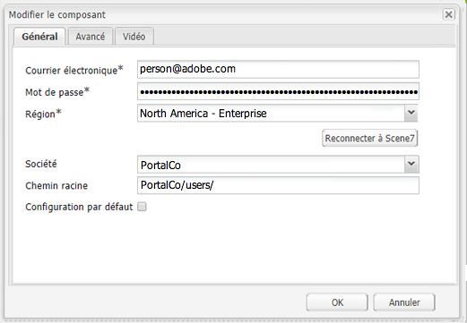

# Intégration d’Adobe Experience Manager à Dynamic Media Classic {#integrating-with-dynamic-media-classic-scene}

Adobe Dynamic Media Classic est une solution hébergée pour la gestion, l’amélioration, la publication et la diffusion de contenus multimédias enrichis sur le web, sur les appareils mobiles, par e-mail, sur les appareils connectés à Internet et par impression.

Pour utiliser Dynamic Media Classic, vous devez paramétrer la configuration cloud afin que Dynamic Media Classic et Adobe Experience Manager Assets puissent interagir entre eux. Ce document décrit comment configurer Experience Manager et Dynamic Media Classic.

Pour plus d’informations sur l’utilisation de tous les composants Dynamic Media Classic sur une page et l’utilisation de vidéos, consultez la section [Utilisation de Dynamic Media Classic](../assets/scene7.md).

>[!NOTE]
>
>* La plateforme de la visionneuse DHTML de Dynamic Media Classic a officiellement atteint sa fin de vie le 31 janvier 2014. Pour plus d’informations, consultez la [FAQ sur la fin de vie de la visionneuse DHTML](../sites-administering/dhtml-viewer-endoflifefaqs.md).
>* Avant de configurer Dynamic Media Classic pour qu’il fonctionne avec Experience Manager, consultez les [Bonnes pratiques](#best-practices-for-integrating-scene-with-aem) pour intégrer Dynamic Media Classic à Experience Manager.
>* Si vous utilisez Dynamic Media Classic avec une configuration de proxy personnalisée, vous devez paramétrer les deux configurations de proxy client HTTP, car certaines fonctionnalités d’Experience Manager utilisent les API 3.x et d’autres les API 4.x. La version 3.x est configurée avec [http://localhost:4502/system/console/configMgr/com.day.commons.httpclient](http://localhost:4502/system/console/configMgr/com.day.commons.httpclient) et la version 4.x avec [http://localhost:4502/system/console/configMgr/org.apache.http.proxyconfigurator](http://localhost:4502/system/console/configMgr/org.apache.http.proxyconfigurator).
>

## Intégration d’Experience Manager à Dynamic Media Classic par rapport à Dynamic Media {#aem-scene-integration-versus-dynamic-media}

Les utilisateurs d’Experience Manager ont le choix entre deux solutions pour travailler avec Dynamic Media. Vous pouvez effectuer l’une des opérations suivantes :

* Intégrer votre instance d’Experience Manager à Dynamic Media Classic
* Utiliser Dynamic Media intégré à Experience Manager

Utilisez les critères suivants pour déterminer la solution à sélectionner :

* Vous êtes un client **existant** de Dynamic Media Classic avec des ressources résidant dans Dynamic Media Classic à des fins de publication et de diffusion, mais vous souhaitez intégrer ces ressources à la création de sites (WCM) ou à Experience Manager Assets, ou les deux ? Si tel est le cas, utilisez l’[Intégration point à point d’Experience Manager à Dynamic Media Classic](#aem-scene-point-to-point-integration) décrite dans ce document.

* Si vous êtes un **nouveau** client d’Experience Manager avec des besoins de diffusion de contenu multimédia enrichi, sélectionnez l’option [Dynamic Media](#aem-dynamic-media). Cette option a plus de sens si vous ne disposez pas d’un compte S7 et que vous avez de nombreuses ressources stockées dans ce système.

* Dans certains cas, utilisez les deux solutions. Le [scénario d’utilisation double](/help/sites-administering/scene7.md#dual-use-scenario) correspond à ce scénario.

### Intégration point à point d’Experience Manager à Dynamic Media Classic {#aem-scene-point-to-point-integration}

Lorsque vous utilisez des ressources dans cette solution, vous effectuez l’une des opérations suivantes :

* Vous chargez des ressources directement dans Dynamic Media Classic, puis accédez à la création de pages par le biais du navigateur de contenu **Dynamic Media Classic** ou
* vous chargez des ressources vers Experience Manager et activez la publication automatique sur dans Dynamic Media Classic. L’accès se fait via le navigateur de contenu d’**Assets** pour la création de page.

Les composants que vous utilisez cette intégration se trouvent dans la zone du composant **Dynamic Media** en [mode Conception](/help/sites-authoring/author-environment-tools.md#page-modes).

### Dynamic Media d’Experience Manager {#aem-dynamic-media}

Dynamic Media d’Experience Manager réunit les fonctionnalités Dynamic Media Classic directement dans la plateforme d’Experience Manager.

Lorsque vous travaillez avec des ressources dans cette solution, vous suivez ce workflow :

1. Charger une image unique et des contenus vidéo directement vers Experience Manager
1. Coder des vidéos directement dans Experience Manager
1. Créer des visionneuses d’images directement dans Experience Manager
1. Le cas échéant, ajoutez de l’interactivité aux images ou aux vidéos.

Les composants que vous utilisez pour Dynamic Media se trouvent dans la zone du composant **[!UICONTROL Dynamic Media]** en [mode Conception](/help/sites-authoring/author-environment-tools.md#page-modes). Il s’agit des éléments suivants :

* **[!UICONTROL Dynamic Media]** : le composant **[!UICONTROL Dynamic Media]** est dynamique ; il propose des options différentes selon que vous ajoutez une image ou une vidéo. Le composant prend en charge les paramètres prédéfinis d’image, ainsi que les visionneuses d’images telles que les visionneuses d’images, les visionneuses à 360°, les visionneuses de médias mixtes et le contenu vidéo. En outre, la visionneuse est réactive : la taille de l’écran change automatiquement en fonction de la taille d’écran. Toutes les visionneuses sont des visionneuses HTML5.

* **[!UICONTROL Média interactif]** - Le **[!UICONTROL Média interactif]** est destiné aux ressources telles que les bannières de carrousel, les images interactives et la vidéo interactive. Ces ressources sont interactives, telles que les zones réactives ou les zones cliquables. Ce composant est dynamique. Cela signifie qu’il propose des options différentes selon que vous ajoutez une image ou une vidéo. En outre, la visionneuse est réactive : la taille de l’écran change automatiquement en fonction de la taille d’écran. Toutes les visionneuses sont des visionneuses HTML5.

### Scénario à double usage {#dual-use-scenario}

Clé en main, vous pouvez utiliser simultanément les fonctionnalités d’intégration de Dynamic Media Dynamic Media Classic et d’Experience Manager. Le tableau des cas d’utilisation suivant décrit ce qui se passe lorsque vous activez ou désactivez certaines zones.

Pour utiliser Dynamic Media et Dynamic Media Classic simultanément :

1. Configurez [Dynamic Media Classic](#creating-a-cloud-configuration-for-scene) dans les services cloud.
1. Suivez les instructions spécifiques correspondant à votre cas d’utilisation :

   <table>
    <tbody>
    <tr>
    <td> </td>
    <td> </td>
    <td><strong>Dynamic Media</strong></td>
    <td> </td>
    <td><strong>Intégration de Dynamic Media Classic</strong></td>
    <td> </td>
    </tr>
    <tr>
    <td><strong>Si vous êtes...</strong></td>
    <td><strong>Workflow de cas d’utilisation</strong></td>
    <td><strong>Imagerie/Vidéo</strong></td>
    <td><strong>Composant Dynamic Media</strong></td>
    <td><strong>Navigateur de contenu et composants S7</strong></td>
    <td><strong>Chargement automatique d’Assets vers S7</strong></td>
    </tr>
    <tr>
    <td>Débutant avec Sites et Dynamic Media</td>
    <td>Chargez des ressources dans Experience Manager et utilisez le composant Dynamic Media Experience Manager pour créer des ressources sur les pages Sites.</td>
    <td>
Activé
 
(Voir l’étape 3)
 </td>
    <td><a href="/help/assets/adding-dynamic-media-assets-to-pages.md">Activé</a></td>
    <td>Désactivé</td>
    <td>Désactivé</td>
    </tr>
    <tr>
    <td>Dans la vente au détail et débutant avec Sites et Dynamic Media</td>
    <td>Chargement de ressources non liées aux produits dans Experience Manager à des fins de gestion et de diffusion Chargez des ressources PRODUIT dans Dynamic Media Classic et utilisez le navigateur de contenu Dynamic Media Classic dans Experience Manager et le composant pour créer des pages Détails du produit sur Sites.</td>
    <td>
Activé
 
(Voir l’étape 3)
 </td>
    <td><a href="/help/assets/adding-dynamic-media-assets-to-pages.md">Activé</a></td>
    <td><a href="/help/assets/scene7.md#scene-content-browser">Activé</a></td>
    <td>Désactivé</td>
    </tr>
    <tr>
    <td>Débutant avec Assets et Dynamic Media</td>
    <td>Chargez des ressources dans Experience Manager Assets et utilisez l’URL publiée et le code intégré de Dynamic Media.</td>
    <td>
Activé
 
(Voir l’étape 3)
 </td>
    <td>Désactivé</td>
    <td>Désactivé</td>
    <td>Désactivé</td>
    </tr>
    <tr>
    <td>Débutant avec Dynamic Media et les modèles</td>
    <td>Utilisez Dynamic Media pour les images et la vidéo. Créez des modèles d’image dans Dynamic Media Classic et utilisez l’outil de recherche de contenu Dynamic Media Classic pour inclure des modèles dans les pages Sites.</td>
    <td>
Activé
 
(Voir l’étape 3)
 </td>
    <td><a href="/help/assets/adding-dynamic-media-assets-to-pages.md">Activé</a></td>
    <td><a href="/help/assets/scene7.md#scene-content-browser">Activé</a></td>
    <td>Désactivé</td>
    </tr>
    <tr>
    <td>Un client Dynamic Media Classic existant et débutant avec Sites</td>
    <td>Chargez des ressources dans Dynamic Media Classic et utilisez le navigateur de contenu Dynamic Media Classic d’Experience Manager pour rechercher et créer des ressources sur les pages Sites.</td>
    <td>Désactivé</td>
    <td>Désactivé</td>
    <td><a href="/help/assets/scene7.md#scene-content-browser">Activé</a></td>
    <td>Désactivé</td>
    </tr>
    <tr>
    <td>Un client Dynamic Media Classic existant et débutant avec Sites et Assets</td>
    <td>Chargez des ressources dans la gestion des ressources numériques et publiez automatiquement sur Dynamic Media Classic pour la diffusion. Utilisez le navigateur de contenu Dynamic Media Classic Experience Manager pour rechercher et créer des ressources sur les pages Sites.</td>
    <td>Désactivé</td>
    <td>Désactivé</td>
    <td><a href="/help/assets/scene7.md#scene-content-browser">Activé</a></td>
    <td>
<a href="#configuringautouploadingfromaemassets">Activé</a>
 
(Voir l’étape 4)
 </td>
    </tr>
    <tr>
    <td>Client Dynamic Media Classic existant et débutant avec Assets</td>
    <td>
Chargez des ressources vers Experience Manager et utilisez Dynamic Media pour générer des rendus à télécharger/partager. Publiez automatiquement des ressources Experience Manager dans Dynamic Media Classic pour la diffusion.
 
<strong>Important :</strong> le traitement en double et les rendus générés dans Experience Manager ne sont pas synchronisés dans Dynamic Media Classic.
 </td>
    <td>
Activé
 
(Voir l’étape 3)
 </td>
    <td>Désactivé</td>
    <td>Désactivé</td>
    <td>
<a href="#configuringautouploadingfromaemassets">Activé</a>
 
(Voir l’étape 4)
 </td>
    </tr>
    </tbody>
    </table>

1. (Facultatif ; voir le tableau des cas d’utilisation) - Paramétrez la [configuration cloud Dynamic Media](/help/assets/config-dynamic.md) et [activez le serveur Dynamic Media](/help/assets/config-dynamic.md).
1. (Facultatif ; voir le tableau des cas d’utilisation) Si vous choisissez d’activer le chargement automatique d’Assets vers Dynamic Media Classic, vous devez ajouter les éléments suivants :

   1. Configurez le chargement automatique vers Dynamic Media Classic.
   1. Ajoutez l’étape **Chargement de Dynamic Media Classic** après toutes les étapes du workflow Dynamic Media *à la fin du* workflow **Ressource de mise à jour de gestion des actifs numériques** ( `https://<server>:<host>/cf#/etc/workflow/models/dam/update_asset.html)`.
   1. (Facultatif) Restreignez le chargement de ressources Dynamic Media Classic par type MIME dans [https://&lt;server>:&lt;port>/system/console/configMgr/com.day.cq.dam.scene7.impl.Scene7AssetMimeTypeServiceImpl](http://localhost:4502/system/console/configMgr/com.day.cq.dam.scene7.impl.Scene7AssetMimeTypeServiceImpl). Les types MIME de ressources qui ne figurent pas dans cette liste ne sont pas chargés sur le serveur Dynamic Media Classic.
   1. (Facultatif) Paramétrez la vidéo dans la configuration Dynamic Media Classic. Vous pouvez activer le codage vidéo pour Dynamic Media, dans Dynamic Media Classic ou les deux simultanément. Les rendus dynamiques sont utilisés pour l’aperçu et la lecture localement dans l’instance d’Experience Manager, tandis que les rendus vidéo Dynamic Media Classic sont générés et stockés sur les serveurs Dynamic Media Classic. Lors de la configuration de services de codage vidéo pour Dynamic Media et Dynamic Media Classic, appliquez un [profil de traitement vidéo](/help/assets/video-profiles.md) au dossier de ressources de Dynamic Media Classic.
   1. (Facultatif) [Configurez l’aperçu sécurisé dans Dynamic Media Classic](/help/sites-administering/scene7.md#configuring-the-state-published-unpublished-of-assets-pushed-to-scene).

#### Limites {#limitations}

Lorsque Dynamic Media Classic et Dynamic Media sont tous deux activés, les restrictions suivantes s’appliquent :

* Le chargement manuel vers Dynamic Media Classic en sélectionnant une ressource et en la faisant glisser vers un composant Dynamic Media Classic sur une page d’Experience Manager ne fonctionne pas.
* Même si les ressources synchronisées Experience Manager-Dynamic Media Classic sont automatiquement mises à jour vers Dynamic Media Classic lorsque la ressource est modifiée dans Assets, une action de restauration ne déclenche pas de nouveau chargement. Par conséquent, Dynamic Media Classic n’obtient pas la dernière version immédiatement après une restauration. La solution consiste à procéder à une nouvelle modification une fois la restauration terminée.
* Est-ce nécessaire dans votre cas d’utiliser Dynamic Media pour un cas d’utilisation et l’intégration de Dynamic Media Classic pour un autre, afin que les ressources Dynamic Media n’interagissent pas avec le système Dynamic Media Classic ? Si tel est le cas, n’appliquez pas la configuration Dynamic Media Classic au dossier Dynamic Media. De plus, n’appliquez pas la configuration Dynamic Media (profil de traitement) à un dossier Dynamic Media Classic.

## Bonnes pratiques d’intégration de Dynamic Media Classic à Experience Manager {#best-practices-for-integrating-scene-with-aem}

Lors de l’intégration de Dynamic Media Classic à Experience Manager, certaines bonnes pratiques importantes doivent être observées dans les domaines suivants :

* Le test de votre intégration
* Le chargement direct de ressources à partir de Dynamic Media Classic est recommandé pour certains scénarios.

Consultez les [limites connues](#known-limitations-and-design-implications).

### Test de votre intégration {#test-driving-your-integration}

Adobe vous recommande de tester votre intégration en faisant pointer votre dossier racine vers un sous-dossier uniquement plutôt que sur une entreprise entière.

>[!CAUTION]
>
>L’importation de ressources à partir d’un compte d’entreprise Dynamic Media Classic existant peut prendre un certain temps pour s’afficher dans Experience Manager. Assurez-vous de désigner un dossier ne contenant pas trop de ressources (par exemple, le dossier racine contient souvent trop de ressources et peut bloquer votre système).

### Chargement de ressources à partir d’Experience Manager Assets ou à partir de Dynamic Media Classic {#uploading-assets-from-aem-assets-versus-from-scene}

Vous pouvez charger des ressources à l’aide de la fonctionnalité Assets (gestion des ressources numériques) ou en accédant directement à Dynamic Media Classic dans Experience Manager à l’aide du navigateur de contenu de Dynamic Media Classic. Votre choix dépend des facteurs suivants :

* Les types de ressources Dynamic Media Classic qu’Experience Manager Assets ne prend pas encore en charge doivent être ajoutés directement à un site web d’Experience Manager à partir de Dynamic Media Classic, par le biais du navigateur de contenu Dynamic Media Classic. Par exemple, les modèles d’image.
* Pour les types de ressources pris en charge par Experience Manager Assets et Dynamic Media Classic, le choix de leur mode de chargement dépend des éléments suivants :

   * L’emplacement actuel des ressources ET
   * Le degré d’importance de leur gestion dans un référentiel commun

Supposons que les ressources se trouvent déjà dans Dynamic Media Classic et que leur gestion dans un référentiel commun ne soit pas importante. Si c’est le cas, il est superflu d’exporter les ressources vers Experience Manager Assets pour avoir à les synchroniser à nouveau avec Dynamic Media Classic en vue de leur diffusion. Adobe vous recommande de conserver les ressources dans un seul référentiel et de les synchroniser avec Dynamic Media Classic pour diffusion uniquement.

## Configuration de l’intégration Dynamic Media Classic {#configuring-scene-integration}

Vous pouvez configurer Experience Manager pour charger des ressources dans Dynamic Media Classic. Les ressources d’un dossier cible CQ peuvent être téléchargées (automatiquement ou manuellement) d’Experience Manager vers un compte d’entreprise

>[!NOTE]
>
>Adobe vous recommande de n’utiliser que le dossier cible désigné pour importer des ressources Dynamic Media Classic. Les ressources numériques qui se trouvent en dehors du dossier cible peuvent uniquement être utilisées dans les composants sur les pages où la configuration de Dynamic Media Classic a été activée. En outre, ils sont placés dans un dossier à la demande dans Dynamic Media Classic. Le dossier à la demande n’est pas synchronisé avec Experience Manager (mais les ressources peuvent être découvertes dans le navigateur de contenu Dynamic Media Classic).

**Pour configurer Dynamic Media Classic afin de l’intégrer à Experience Manager, procédez comme suit :**

1. [Définissez une configuration cloud](#creating-a-cloud-configuration-for-scene) - Définit le mappage entre un dossier Dynamic Media Classic et un dossier Assets. Effectuez cette étape même si vous souhaitez uniquement une synchronisation unidirectionnelle (Experience Manager Assets vers Dynamic Media Classic).
1. [Activation du **listener de gestion des ressources numériques s7dam Adobe CQ**](#enabling-the-adobe-cq-scene-dam-listener) - Activé dans la [!UICONTROL console OSGi].
1. Si vous souhaitez qu’Experience Manager Assets charge automatiquement vers Dynamic Media Classic, vous devez activer cette option et ajouter Dynamic Media Classic au workflow [!UICONTROL Ressource de mise à jour de gestion des ressources numériques]. Vous pouvez également charger les ressources manuellement.
1. Ajoutez des composants Dynamic Media Classic au sidekick. Cette fonctionnalité permet aux utilisateurs d’utiliser les composants Dynamic Media Classic sur leurs pages Experience Manager.
1. [Mappez la configuration à la page dans Experience Manager](#enabling-scene-for-wcm) - Cette étape est nécessaire pour afficher les paramètres vidéo prédéfinis que vous avez créés dans Dynamic Media Classic. Elle est également nécessaire si vous devez publier une ressource venant de l’extérieur du dossier cible CQ vers Dynamic Media Classic.

Cette section décrit comment effectuer toutes ces étapes et répertorie des restrictions importantes.

### Fonctionnement de la synchronisation entre Dynamic Media Classic et Experience Manager Assets {#how-synchronization-between-scene-and-aem-assets-works}

Lors de la configuration de la synchronisation d’Experience Manager Assets et Dynamic Media Classic, il est important de comprendre les éléments suivants :

#### Chargement vers Dynamic Media Classic à partir d’Experience Manager Assets {#uploading-to-scene-from-aem-assets}

* Il existe un dossier de synchronisation désigné dans Experience Manager pour les chargements Dynamic Media Classic.
* Les chargements vers Dynamic Media Classic peuvent être automatisés si les ressources numériques sont placées dans le dossier de synchronisation désigné.
* La structure de dossiers et de sous-dossiers dans Experience Manager est répliquée dans Dynamic Media Classic.

>[!NOTE]
>
>Experience Manager incorpore toutes les métadonnées comme XMP avant de les charger vers Dynamic Media Classic, de sorte que toutes les propriétés du nœud de métadonnées soient disponibles dans Dynamic Media Classic sous la forme d’un XMP.

#### Restrictions connues et implications en termes de conception {#known-limitations-and-design-implications}

Avec la synchronisation entre Experience Manager Assets et Dynamic Media Classic, il existe actuellement les limitations et implications de conception suivantes :

<table>
 <tbody>
  <tr>
   <td><strong>Limitation/implication dans la conception</strong></td>
   <td><strong>Description</strong></td>
  </tr>
  <tr>
   <td>Un seul dossier de synchronisation désigné (cible)</td>
   <td>Vous ne pouvez avoir qu’un seul dossier désigné par société dans Experience Manager pour les chargements Dynamic Media Classic. Vous pouvez créer plusieurs configurations si vous devez avoir accès à plusieurs comptes de société dans Dynamic Media Classic.</td>
  </tr>
  <tr>
   <td>Structure des dossiers</td>
   <td>Si vous supprimez un dossier synchronisé comportant des ressources, toutes les ressources distantes de Dynamic Media Classic sont supprimées, mais le dossier reste.</td>
  </tr>
  <tr>
   <td>Dossier à la demande</td>
   <td>Les ressources qui se trouvent en dehors du dossier cible et qui sont chargées manuellement vers Dynamic Media Classic dans la gestion de contenu web sont automatiquement placées dans un dossier distinct à la demande dans Dynamic Media Classic. Configurez ce dossier dans la configuration cloud d’Experience Manager.</td>
  </tr>
  <tr>
   <td>Médias mixtes</td>
   <td>Les visionneuses de médias mixtes apparaissent dans Experience Manager bien qu’elles ne soient pas prises en charge dans Experience Manager.</td>
  </tr>
  <tr>
   <td>PDF</td>
   <td>Les PDF générés à partir des catalogues électroniques dans Dynamic Media Classic sont importés dans le dossier cible CQ.</td>
  </tr>
  <tr>
   <td>Actualisation de l’interface utilisateur</td>
   <td>Lors de la synchronisation entre Experience Manager et Dynamic Media Classic, veillez à actualiser l’interface utilisateur pour afficher les modifications. </td>
  </tr>
  <tr>
   <td>Miniatures vidéo</td>
   <td>Si vous téléchargez une vidéo vers Experience Manager Assets à des fins de codage via Dynamic Media Classic, les miniatures vidéo et les vidéos codées peuvent prendre un certain temps pour être disponibles dans Experience Manager Assets, en fonction du temps de traitement vidéo.</td>
  </tr>
  <tr>
   <td>Sous-dossiers cible</td>
   <td>
Si vous utilisez des sous-dossiers dans le dossier cible, veillez à utiliser des noms uniques pour chaque ressource (quel que soit l’emplacement). Veillez également à configurer Dynamic Media Classic (dans la zone Configuration) pour qu’il ne remplace pas les ressources, quel que soit leur emplacement.
 
Dans le cas contraire, les ressources portant le même nom téléchargées vers un sous-dossier cible Dynamic Media Classic sont téléchargées, mais les ressources du même nom figurant déjà dans le dossier cible sont supprimées. 
 </td>
  </tr>
 </tbody>
</table>

### Configuration des serveurs Dynamic Media Classic {#configuring-scene-servers}

Si vous exécutez Experience Manager derrière un proxy ou que avez des paramètres de pare-feu spécifiques, vous aurez peut-être besoin d’activer explicitement les hôtes des différentes régions. Les serveurs sont gérés dans le contenu dans `/etc/cloudservices/scene7/endpoints` et peuvent être personnalisés en fonction des besoins. Sélectionnez une URL puis modifiez-la si nécessaire. Dans les versions précédentes d’Experience Manager, ces valeurs étaient codées en dur.

Si vous accédez à `/etc/cloudservices/scene7/endpoints.html`, les serveurs répertoriés apparaissent (et vous pouvez les modifier en cliquant sur l’URL) :

### Création d’une configuration cloud pour Dynamic Media Classic {#creating-a-cloud-configuration-for-scene}

Une configuration cloud définit le mappage entre un dossier Dynamic Media Classic et un dossier Experience Manager Assets. Elle doit être configurée pour pouvoir synchroniser Experience Manager Assets avec Dynamic Media Classic. Consultez la section Fonctionnement de la synchronisation pour en savoir plus.

>[!CAUTION]
>
>L’importation de ressources à partir d’un compte d’entreprise Dynamic Media Classic existant peut prendre un certain temps pour s’afficher dans Experience Manager. Veillez à désigner dans Dynamic Media Classic un dossier qui ne comporte pas trop de ressources. Par exemple, le dossier racine comporte souvent trop de ressources.
>
>Si vous souhaitez tester l’intégration, faites pointer le dossier racine vers un sous-dossier uniquement, au lieu de la société entière.

>[!NOTE]
>
>Vous pouvez disposer de plusieurs configurations : une configuration cloud correspond à un utilisateur dans une entreprise dans Dynamic Media Classic. Si vous souhaitez accéder à d’autres sociétés ou utilisateurs Dynamic Media Classic, vous devez créer plusieurs configurations.

**Pour créer une configuration cloud pour Dynamic Media Classic :**

1. Sélectionnez l’icône d’Experience Manager et accédez à **[!UICONTROL Déploiement]** > **[!UICONTROL Services cloud]** afin de pouvoir accéder à Adobe Dynamic Media Classic.

1. Sélectionnez **[!UICONTROL Configurer maintenant]**.

   

1. Dans le champ **[!UICONTROL Titre]** et éventuellement dans le champ **[!UICONTROL Nom]**, saisissez les informations appropriées. Sélectionnez **[!UICONTROL Créer]**.

   >[!NOTE]
   >
   >Lors de la création de configurations supplémentaires, le champ **[!UICONTROL Configuration du parent]** s’affiche.
   >
   >Ne modifiez **pas** la configuration du parent. La modification de la configuration parent peut interrompre l’intégration.

1. Saisissez l’adresse électronique, le mot de passe et la région de votre compte Dynamic Media Classic, puis sélectionnez **[!UICONTROL Connexion à Dynamic Media Classic]**. Vous êtes connecté au serveur Dynamic Media Classic et la boîte de dialogue s’agrandit pour afficher plus d’options.

1. Saisissez le nom de la **[!UICONTROL Société]** et le **[!UICONTROL Chemin racine]**. Ces informations correspondent au nom du serveur publié, ainsi qu’à tout chemin d’accès que vous souhaitez spécifier. Si vous ne connaissez pas le nom du serveur publié, dans Dynamic Media Classic, accédez à **[!UICONTROL Configuration > Configuration de l’application]**.

   >[!NOTE]
   >
   >Le chemin d’accès racine Dynamic Media Classic est le dossier Dynamic Media Classic auquel se connecte Experience Manager. Il peut être réduit à un dossier spécifique.

   >[!CAUTION]
   >
   >En fonction de la taille du dossier de Dynamic Media Classic, l’importation d’un dossier racine peut prendre beaucoup de temps. En outre, les données Dynamic Media Classic peuvent dépasser les capacités de stockage d’Experience Manager. Vérifiez que vous importez le bon dossier. L’importation de trop de données peut arrêter votre système.

   

1. Sélectionnez **[!UICONTROL OK]**. Experience Manager enregistre votre configuration.

>[!NOTE]
>
>Si vous vous reconnectez :
>
>* Lorsque vous vous reconnectez à Dynamic Media Classic en mode de publication, réinitialisez le mot de passe de publication ou la reconnexion ne fonctionnera pas (ce problème n’apparaît pas pour l’instance d’auteur).
>* Si vous modifiez des valeurs telles que votre région ou le nom de la société, vous devez vous reconnecter à Dynamic Media Classic. Si les options de configuration ont été modifiées, mais pas enregistrées, Experience Manager continue à tord d’indiquer que la configuration est valide. N’oubliez pas de vous reconnecter.
>

### Activation du listener de gestion des ressources numériques Dynamic Media Classic Adobe CQ {#enabling-the-adobe-cq-scene-dam-listener}

Activation du listener de gestion des ressources numériques Dynamic Media Classic Adobe CQ, qui est désactivé par défaut

**Pour activer le listener de gestion des ressources numériques Dynamic Media Classic Adobe CQ, procédez comme suit :**

1. Sélectionnez l’icône [!UICONTROL Outils], puis accédez à **[!UICONTROL Opérations]** > **[!UICONTROL Console web]**.
1. Dans la console web, accédez à **[!UICONTROL Listener de gestion des ressources numériques Dynamic Media Classic Adobe CQ]** et sélectionnez la case à cocher **[!UICONTROL Activé]**.

   

1. Sélectionnez **[!UICONTROL Enregistrer]**.

### Ajout d’un délai d’expiration configurable au workflow de chargement Dynamic Media Classic {#adding-configurable-timeout-to-scene-upload-workflow}

Lorsqu’une instance Experience Manager est configurée pour traiter le codage vidéo via Dynamic Media Classic, par défaut, les tâches de chargement sont soumises à un délai d’expiration de 35 minutes. Pour pouvoir effectuer les tâches de codage vidéo potentiellement plus longues, vous pouvez configurer ce paramètre.

1. Accédez à **http://localhost:4502/system/console/configMgr/com.day.cq.dam.scene7.impl.Scene7UploadServiceImpl**.

   

1. Dans le champ **[!UICONTROL Délai d’expiration de la tâche active]**, modifiez le nombre selon les besoins. Sont acceptés tous les nombres non négatifs, avec l’unité de mesure en secondes. Par défaut, ce champ est défini sur 2100.

   >[!NOTE]
   >
   >Bonne pratique : la plupart des ressources sont assimilées en quelques minutes au plus (par exemple, les images). Cependant, dans certains cas (par exemple, les vidéos plus volumineuses), augmentez la valeur du délai d’expiration à 7 200 secondes (deux heures) pour tenir compte du temps de traitement long. Sans cela, cette tâche de chargement Dynamic Media Classic indique **[!UICONTROL UploadFailed]** dans les métadonnées JCR (Java™ Content Repository).

1. Sélectionnez **[!UICONTROL Enregistrer]**.

### Chargement automatique à partir d’Experience Manager Assets {#autouploading-from-aem-assets}

À partir d’Experience Manager 6.3.2, Experience Manager Assets est configuré de sorte que toutes les ressources numériques téléchargées soient mises à jour vers Dynamic Media Classic, si les ressources se trouvent dans un dossier cible CQ.

Lorsqu’une ressource est ajoutée à Experience Manager Assets, elle est automatiquement chargée et publiée dans Dynamic Media Classic.

>[!NOTE]
>
>La taille de fichier maximale pour le chargement automatique d’Experience Manager Assets vers Dynamic Media Classic est de 500 Mo.

**Pour effectuer un chargement automatique à partir d’Experience Manager Assets :**

1. Sélectionnez l’icône d’Experience Manager et accédez à **[!UICONTROL Déploiement]** > **[!UICONTROL Services cloud]**.
1. Sous l’en-tête Dynamic Media, sous Configurations disponibles, sélectionnez **[!UICONTROL dms7 (Dynamic Media)]**.
1. Sélectionnez l’onglet **[!UICONTROL Avancé]** et sélectionnez la case à cocher **[!UICONTROL Activer le chargement automatique]**, puis sélectionnez **[!UICONTROL OK]**. Vous devez configurer le workflow Ressources de gestion des actifs numériques pour inclure le téléchargement vers Dynamic Media Classic.

   >[!NOTE]
   >
   >Consultez la section [Configuration du statut (publié/dépublié) des ressources transférées vers Dynamic Media Classic](#configuring-the-state-published-unpublished-of-assets-pushed-to-scene) pour obtenir des informations sur comment définir des ressources au statut dépublié.

   

1. Revenez à la page d’accueil d’Experience Manager et sélectionnez **[!UICONTROL Workflows]**. Double-cliquez sur le workflow **Ressource de mise à jour de gestion des ressources numériques** pour qu’il s’ouvre.
1. Dans le sidekick, accédez aux composants **[!UICONTROL Workflows]**, puis sélectionnez **[!UICONTROL Dynamic Media Classic]**. Faites glisser **[!UICONTROL Dynamic Media Classic]** dans le workflow et sélectionnez **[!UICONTROL Enregistrer]**. Les ressources ajoutées à Experience Manager Assets dans le dossier cible sont automatiquement chargées vers Dynamic Media Classic.

   

   >[!NOTE]
   >
   >* Lors de l’ajout de ressources après l’automatisation, si elles ne sont pas placées dans le dossier cible CQ, elles ne sont pas téléchargées vers Dynamic Media Classic.
   >* Experience Manager incorpore toutes les métadonnées comme XMP avant de les charger vers Dynamic Media Classic, de sorte que toutes les propriétés du nœud de métadonnées soient disponibles dans Dynamic Media Classic sous la forme d’un XMP.

### Configuration du statut (publié/dépublié) des ressources poussées vers Dynamic Media Classic {#configuring-the-state-published-unpublished-of-assets-pushed-to-scene}

Si vous poussez des ressources d’Experience Manager Assets vers Dynamic Media Classic, vous pouvez les publier automatiquement (comportement par défaut) ou les pousser vers Dynamic Media Classic dans un statut dépublié.

Il est possible que vous ne souhaitiez pas publier immédiatement les ressources sur Dynamic Media Classic si vous souhaitez les tester dans un environnement d’évaluation avant de les publier. Vous pouvez utiliser Experience Manager avec l’environnement de test sécurisé de Dynamic Media Classic pour envoyer directement des ressources d’Assets vers Dynamic Media Classic dans un statut dépublié.

Les ressources Dynamic Media Classic restent disponibles via l’aperçu sécurisé. Ce n’est que lorsque les ressources sont publiées dans Experience Manager que les ressources Dynamic Media Classic sont également mises en exploitation.

Si vous souhaitez publier les ressources immédiatement lorsque vous les poussez vers Dynamic Media Classic, vous ne devez configurer aucune option. Il s’agit du comportement par défaut.

Toutefois, si vous ne souhaitez pas que les ressources poussées vers Dynamic Media Classic soient publiées automatiquement, cette section décrit comment configurer Experience Manager et Dynamic Media Classic pour exécuter cette fonctionnalité.

#### Conditions préalables pour pousser les ressources vers Dynamic Media Classic en conservant un statut dépublié {#prerequisites-to-push-assets-to-scene-unpublished}

Pour pouvoir pousser des ressources vers Dynamic Media Classic sans les publier, vous devez configurer les éléments suivants :

1. [Utilisez l’Admin Console pour créer un dossier de support](https://helpx.adobe.com/fr/enterprise/admin-guide.html/enterprise/using/support-for-experience-cloud.ug.html). Dans votre dossier de support, demandez l’activation d’un aperçu sécurisé pour votre compte Dynamic Media Classic.
1. [Configurez un aperçu sécurisé pour votre compte Dynamic Media Classic](https://experienceleague.adobe.com/docs/dynamic-media-classic/using/upload-publish/testing-assets-making-them-public.html?lang=fr).

Ces étapes sont les mêmes que pour créer une configuration de test sécurisée dans Dynamic Media Classic.

>[!NOTE]
>
>Si votre environnement d’installation est un système d’exploitation Unix 64 bits, rendez-vous sur [https://helpx.adobe.com/fr/experience-manager/kb/enable-xmp-write-back-64-bit-redhat.html](https://helpx.adobe.com/fr/experience-manager/kb/enable-xmp-write-back-64-bit-redhat.html) pour connaître les autres options de configuration à définir.

#### Limites connues pour pousser des ressources en conservant un statut dépublié  {#known-limitations-for-pushing-assets-in-unpublished-state}

Si vous utilisez cette fonction, tenez compte des restrictions suivantes :

* Il n’existe aucune prise en charge du contrôle de version.
* Si une ressource est déjà publiée dans Experience Manager et qu’une nouvelle version est créée, cette nouvelle version est immédiatement publiée en exploitation. La publication sur activation ne fonctionne qu’avec la publication initiale d’une ressource.

>[!NOTE]
>
>Si vous souhaitez publier les ressources immédiatement, nous recommandons de conserver l’option **[!UICONTROL Activer l’aperçu sécurisé]** définie sur **[!UICONTROL Immédiatement]** et d’utiliser la fonction **[!UICONTROL Activer le chargement automatique.]**

### Définition du statut des ressources poussées vers Dynamic Media Classic comme dépubliées {#setting-the-state-of-assets-pushed-to-scene-as-unpublished}

>[!NOTE]
>
>Si vous publiez une ressource dans Experience Manager, vous activez automatiquement le statut d’exploitation et de mise en ligne de la ressource de S7 (le statut de la ressource n’est plus Dépublié et ne bénéficie plus d’un aperçu sécurisé).

**Pour définir des ressources poussées vers Dynamic Media Classic sur le statut Dépublié, procédez comme suit :**

1. Sélectionnez l’icône d’Experience Manager et accédez à **[!UICONTROL Déploiement]** > **[!UICONTROL Services cloud]**.
1. Sélectionnez **[!UICONTROL Dynamic Media Classic]**.
1. Sélectionnez votre configuration dans Dynamic Media Classic.
1. Sélectionnez l’onglet **[!UICONTROL Avancé]**.
1. Dans le menu déroulant **[!UICONTROL Activer la vue sécurisée]**, sélectionnez **[!UICONTROL Lors de l’activation de la publication sur AEM]** pour pousser les ressources vers Dynamic Media Classic sans les publier. (Par défaut, cette valeur est définie sur **[!UICONTROL Immédiatement]** et les ressources Dynamic Media Classic sont publiées immédiatement.)

   Consultez la [documentation Dynamic Media Classic](https://experienceleague.adobe.com/docs/dynamic-media-classic/using/upload-publish/testing-assets-making-them-public.html?lang=fr) pour plus d’informations sur le test des ressources avant leur publication.

   

1. Sélectionnez **[!UICONTROL OK]**.

Avec l’option Activer l’aperçu sécurisé, vos ressources sont poussées vers le serveur d’aperçu sécurisé en étant dépubliées.

Pour voir si l’**[!UICONTROL Aperçu sécurisé]** est activé, accédez à un composant Dynamic Media Classic sur une page dans Experience Manager. Sélectionnez **[!UICONTROL Modifier]**. La ressource présente le serveur d’aperçu sécurisé dans son URL. Après la publication dans Experience Manager, le domaine de serveur dans la référence de fichier est mis à jour et passe de l’URL d’aperçu à l’URL d’exploitation.

### Activation de Dynamic Media Classic pour la gestion de contenu web {#enabling-scene-for-wcm}

L’activation de Dynamic Media Classic pour la gestion de contenu web est requise pour deux raisons :

* Elle permet d’activer la liste déroulante des profils vidéo universels en vue de la création de pages. Sans cela, la liste déroulante **[!UICONTROL Paramètres vidéo prédéfinis universels]** est vide et ne peut pas être définie.
* Si une ressource numérique ne se trouve pas dans le dossier cible, vous pouvez la charger dans Dynamic Media Classic si vous activez Dynamic Media Classic pour cette page dans les propriétés de la page. Faites ensuite glisser la ressource sur un composant Dynamic Media Classic. Les règles d’héritage normales s’appliquent (en d’autres termes, les pages enfants héritent de la configuration de la page parente).

Lors de l’activation de Dynamic Media Classic pour la gestion de contenu web, comme pour d’autres configurations, les règles d’héritage s’appliquent. Vous pouvez activer Dynamic Media Classic pour WCM dans l’interface utilisateur classique ou dans l’IU optimisée pour les écrans tactiles.

#### Activation de Dynamic Media Classic pour la gestion de contenu web dans l’interface utilisateur optimisée pour les écrans tactiles {#enabling-scene-for-wcm-in-the-touch-optimized-user-interface}

1. Sélectionnez l’icône d’Experience Manager et accédez à **[!UICONTROL Sites]**, puis à la page racine de votre site web (non spécifique à la langue).

1. Dans la barre d’outils, sélectionnez l’icône [!UICONTROL Paramètres] et **[!UICONTROL Ouvrir les propriétés]**.

1. Sélectionnez **[!UICONTROL Services cloud]** et sélectionnez **[!UICONTROL Ajouter une configuration]** puis **[!UICONTROL Dynamic Media Classic]**.
1. Dans la liste déroulante **[!UICONTROL Adobe Dynamic Media Classic]**, sélectionnez la configuration souhaitée, puis **[!UICONTROL OK]**.

   

   Les paramètres vidéo prédéfinis de cette configuration de Dynamic Media Classic peuvent être utilisés dans Experience Manager avec le composant vidéo Dynamic Media Classic, sur cette page et les pages enfants.

#### Activation de Dynamic Media Classic pour la gestion de contenu web dans l’interface utilisateur classique {#enabling-scene-for-wcm-in-the-classic-user-interface}

1. Dans Experience Manager, sélectionnez **[!UICONTROL Sites web]** et accédez à la page racine de votre site web (non spécifique à une langue).

1. Dans le sidekick, sélectionnez l’icône **[!UICONTROL Page]**, puis **[!UICONTROL Propriétés de la page]**.

1. Sélectionnez **[!UICONTROL Services cloud]** > **[!UICONTROL Ajout de services]** > **[!UICONTROL Dynamic Media Classic]**.
1. Dans la liste déroulante **[!UICONTROL Adobe Dynamic Media Classic]**, sélectionnez la configuration souhaitée, puis **[!UICONTROL OK]**.

   Les paramètres vidéo prédéfinis de cette configuration de Dynamic Media Classic peuvent être utilisés dans Experience Manager avec le composant vidéo Dynamic Media Classic, sur cette page et les pages enfants.

### Paramétrage d’une configuration par défaut {#configuring-a-default-configuration}

Si vous disposez de plusieurs configurations Dynamic Media Classic, vous pouvez en spécifier une par défaut pour le navigateur de contenu Dynamic Media Classic.

Une seule configuration Dynamic Media Classic à la fois peut être marquée comme configuration par défaut. La configuration par défaut reprend les ressources d’entreprise qui s’affichent par défaut dans le navigateur de contenu Dynamic Media Classic.

**Pour configurer une configuration par défaut, procédez comme suit :**

1. Sélectionnez l’icône d’Experience Manager et accédez à **[!UICONTROL Déploiement]** > **[!UICONTROL Services cloud]**.
1. Sélectionnez **[!UICONTROL Dynamic Media Classic]**.
1. Sélectionnez votre configuration dans Dynamic Media Classic.
1. Pour ouvrir la configuration, sélectionnez **[!UICONTROL Modifier]**.

1. Dans l’onglet **[!UICONTROL Général]**, cochez la case **[!UICONTROL Configuration par défaut]** pour en faire la configuration par défaut de l’entreprise et le chemin d’accès racine qui s’affiche par défaut dans le navigateur de contenu Dynamic Media Classic.

   

   >[!NOTE]
   >
   >S’il n’existe qu’une seule configuration, le fait de cocher la case **[!UICONTROL Configuration par défaut]** est sans effet.

### Configuration du dossier ad hoc {#configuring-the-ad-hoc-folder}

Vous pouvez configurer le dossier à la demande vers lequel les ressources sont chargées dans Dynamic Media Classic lorsque ces ressources ne se trouvent pas dans le dossier cible de CQ. Consultez la section Publication d’éléments depuis un dossier autre que le dossier cible CQ.

**Pour configurer le dossier ad hoc, procédez comme suit** :

1. Sélectionnez l’icône d’Experience Manager et accédez à **[!UICONTROL Déploiement]** > **[!UICONTROL Services cloud]**.
1. Sélectionnez **[!UICONTROL Dynamic Media Classic]**.
1. Sélectionnez votre configuration dans Dynamic Media Classic.
1. Pour ouvrir la configuration, sélectionnez **[!UICONTROL Modifier]**.

1. Sélectionnez l’onglet **[!UICONTROL Avancé]**. Dans le champ **[!UICONTROL Dossier ad hoc]**, vous pouvez modifier le dossier **ad hoc**. Par défaut, il s’agit de **nom_de_l’entreprise/CQ5_adhoc**.

   

### Configuration de paramètres prédéfinis de vidéo universels {#configuring-universal-presets}

Pour configurer les paramètres prédéfinis universels du composant vidéo, consultez la section [Vidéo](/help/assets/s7-video.md).

## Activation de la prise en charge des paramètres de tâche de chargement d’Assets vers Dynamic Media Classic basés sur le type MIME {#enabling-mime-type-based-assets-scene-upload-job-parameter-support}

Vous pouvez activer les paramètres de tâche de chargement Dynamic Media Classic configurables qui sont déclenchés par la synchronisation des ressources de la gestion des ressources numériques vers Dynamic Media Classic.

Plus précisément, vous configurez le format de fichier accepté par le type MIME dans la section OSGi (Open Service Gateway initiative) du panneau Configuration de la console web Experience Manager. Vous pouvez ensuite personnaliser les paramètres de tâche de chargement spécifiques qui sont utilisés pour chaque type MIME dans le JCR (Java Content Repository).

**Pour activer les ressources basées sur le type MIME, procédez comme suit :**

1. Sélectionnez l’icône d’Experience Manager et accédez à **[!UICONTROL Outils]** > **[!UICONTROL Opérations]** > **[!UICONTROL Console web]**.
1. Dans le panneau Configuration de la console web d’Adobe Experience Manager, dans le menu **[!UICONTROL OSGi]**, sélectionnez **[!UICONTROL Configuration]**.
1. Dans la colonne Nom, recherchez et sélectionnez **[!UICONTROL Service de type MIME de ressource Dynamic Media Classic Adobe CQ]** pour modifier la configuration.
1. Dans la zone Mappage de type MIME, appuyez sur un signe plus (+) pour ajouter un type MIME.

   Consultez la section [Types MIME pris en charge](/help/assets/assets-formats.md#supported-mime-types).

1. Dans le champ de texte, tapez le nom du nouveau type MIME.

   Par exemple, vous devez saisir un `<file_extension>=<mime_type>` comme dans `EPS=application/postscript` OU `PSD=image/vnd.adobe.photoshop`.

1. Dans le coin inférieur droit de la fenêtre de configuration, sélectionnez **[!UICONTROL Enregistrer]**.
1. Revenez à Experience Manager et, dans le rail de gauche, sélectionnez **[!UICONTROL CRXDE Lite]**.
1. Sur la page CRXDE Lite, dans le rail de gauche, accédez à `/etc/cloudservices/scene7/<environment>` (remplacez `<environment>` par le nom réel).
1. Développez `<environment>` (remplacez `<environment>` par le nom réel) pour afficher le nœud `mimeTypes`.
1. Sélectionnez le type de MIME que vous venez d’ajouter.

   Par exemple, `mimeTypes > application_postscript` OU `mimeTypes > image_vnd.adobe.photoshop`. 

1. Sur le côté droit de la page CRXDE Lite, sélectionnez l’onglet **[!UICONTROL Propriétés]**.
1. Spécifiez un paramètre de tâche de chargement Dynamic Media Classic dans le champ de valeur **[!UICONTROL jobParam]**.

   Par exemple, `psprocess="rasterize"&psresolution=120`.

   Consultez la section [API de système d’exploitation d’image Dynamic Media Classic Adobe](https://experienceleague.adobe.com/docs/dynamic-media-developer-resources/image-production-api/c-overview.html?lang=fr) pour connaître les autres paramètres de tâche de chargement utilisables.

   >[!NOTE]
   >
   >Si vous téléchargez des fichiers PSD et que vous souhaitez les traiter en tant que modèles avec des extractions de calque, saisissez ce qui suit dans le champ de valeur **[!UICONTROL jobParam]** :
   >
   >`process=MaintainLayers&layerNaming=AppendName&createTemplate=true`
   >
   >Assurez-vous que votre fichier PSD contient des calques. S’il s’agit strictement d’une image ou d’une image avec un masque, elle est traitée en tant qu’image uniquement, car il n’y a aucun calque à traiter.

1. Dans le coin supérieur gauche de la page CRXDE Lite, sélectionnez **[!UICONTROL Tout enregistrer]**.

## Résolution des problèmes d’intégration de Dynamic Media Classic et d’Experience Manager {#troubleshooting-scene-and-aem-integration}

Si vous rencontrez des problèmes pour intégrer Experience Manager à Dynamic Media Classic, reportez-vous aux scénarios suivants pour les solutions.

**Si la publication de ressources numériques sur Dynamic Media Classic échoue :**

* Vérifiez que la ressource que vous téléchargez se trouve dans le dossier **[!UICONTROL Cible CQ]** (vous spécifiez ce dossier dans la configuration cloud de Dynamic Media Classic).
* Si ce n’est pas le cas, vous devez configurer la configuration cloud dans la section **[!UICONTROL Propriétés de la page]** de cette page pour autoriser le chargement vers le dossier **[!UICONTROL ad hoc CQ]**.

* Pour plus d’informations, consultez les journaux .

**Si vos paramètres vidéo prédéfinis n’apparaissent pas :**

* Assurez-vous que vous avez configuré la configuration cloud de cette page dans la section **[!UICONTROL Propriétés de la page]**. Les paramètres vidéo prédéfinis sont disponibles dans le composant vidéo Dynamic Media Classic.

**Si votre contenu vidéo n’est pas lu dans Experience Manager, procédez comme suit :**

* Vérifiez que vous avez utilisé le bon composant vidéo. Le composant vidéo Dynamic Media Classic est différent du composant vidéo de base. Consultez la section [Composant vidéo de base et composant vidéo Dynamic Media Classic](/help/assets/s7-video.md).

**Si des ressources nouvelles ou modifiées dans Experience Manager ne sont pas automatiquement chargées vers Dynamic Media Classic :**

* Assurez-vous que les ressources se trouvent dans le dossier cible CQ. Seules les ressources qui se trouvent dans le dossier cible CQ sont automatiquement téléchargées (si vous avez configuré Experience Manager Assets pour charger automatiquement les ressources).
* Assurez-vous que vous avez configuré la configuration des services cloud de manière à activer le chargement automatique et que vous avez mis à jour et enregistré le workflow de ressources de gestion des ressources numériques pour inclure le téléchargement de Dynamic Media Classic.
* Lorsque vous téléchargez une image dans un sous-dossier du dossier cible de Dynamic Media Classic, assurez-vous d’effectuer l’une des opérations suivantes :

   * Assurez-vous que chaque ressource porte un nom unique, indépendamment de son emplacement. Sinon, la ressource du dossier cible principal est supprimée et seule la ressource du sous-dossier est conservée.
   * Modifiez la manière dont Dynamic Media Classic remplace les ressources dans la zone Configuration du compte Dynamic Media Classic. Ne configurez pas Dynamic Media Classic pour remplacer les ressources, quel que soit l’emplacement, si vous utilisez des ressources portant le même nom que les sous-dossiers.

**Si les ressources ou dossiers supprimés ne sont pas synchronisés entre Dynamic Media Classic et Experience Manager :**

* Les ressources et les dossiers supprimés dans Experience Manager Assets apparaissent toujours dans le dossier synchronisé dans Dynamic Media Classic. Supprimez-les manuellement.

**Si le chargement vidéo échoue, procédez comme suit :**

* Si le chargement de votre vidéo échoue et que vous utilisez Experience Manager pour coder la vidéo via l’intégration de Dynamic Media Classic, reportez-vous à la section [Ajout d’un délai d’expiration configurable au workflow de chargement Dynamic Media Classic](#adding-configurable-timeout-to-scene-upload-workflow).

>[!CAUTION]
>
>L’importation de ressources à partir d’un compte d’entreprise Dynamic Media Classic existant peut prendre un certain temps pour s’afficher dans Experience Manager. Veillez à désigner dans Dynamic Media Classic un dossier qui ne comporte pas trop de ressources. Par exemple, le dossier racine comporte souvent trop de ressources.
>
>Si vous souhaitez tester l’intégration, vous pouvez faire pointer le dossier racine vers un sous-dossier uniquement, au lieu de la société entière.
