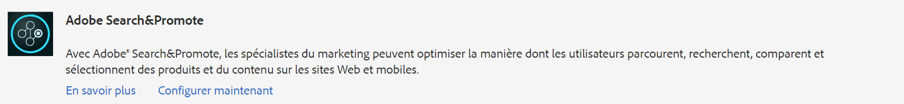
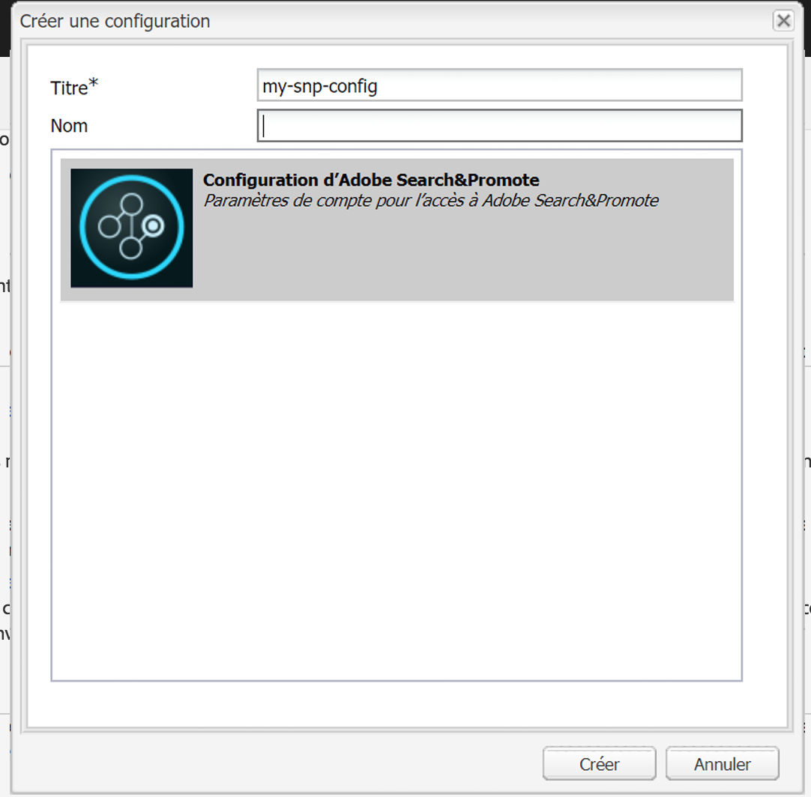
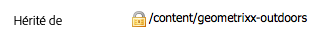

# Intégration à Adobe Search&amp;Promote{#integrating-with-adobe-search-promote}

Pour appeler le service Adobe Search&amp;Promote depuis votre site web, effectuez les opérations suivantes :

1. Indiquez l’URL du cloud.
1. Configurez la connexion au service Search&amp;Promote.
1. Ajouter les composants Search&amp;Promote au sidekick.
1. Utilisez les composants pour créer le contenu. (Voir [Ajout de fonctionnalités Search&amp;Promote à une page web](/help/sites-authoring/search-and-promote.md).)
1. Ajout de bannières à vos pages. Les images de bannière sont sensibles aux données Search&amp;Promote.
1. Générez un plan du site pour l’utilisation du service Search&amp;Promote.

>[!NOTE]
>
>Si vous utilisez Search&amp;Promote avec une configuration de proxy personnalisée, vous devez configurer les deux configurations de proxy client HTTP, car certaines fonctionnalités d’AEM utilisent les API 3.x et d’autres les API 4.x :
>
>* La version 3.x est configurée avec [https://localhost:4502/system/console/configMgr/com.day.commons.httpclient](https://localhost:4502/system/console/configMgr/com.day.commons.httpclient)
>* La version 4.x est configurée avec [https://localhost:4502/system/console/configMgr/org.apache.http.proxyconfigurator](https://localhost:4502/system/console/configMgr/org.apache.http.proxyconfigurator)

>

## Modification de l’URL du service Search&amp;Promote {#changing-the-search-promote-service-url}

L’URL par défaut configurée pour le service Search &amp; Promote est `https://searchandpromote.omniture.com/px/`. Pour utiliser un autre service, utilisez la console OSGi afin de spécifier une autre URL.

1. Ouvrez la console OSGi et cliquez sur l’onglet Configuration. ([https://localhost:4502/system/console/configMgr.](https://localhost:4502/system/console/configMgr))
1. Cliquez sur l’élément Configuration de Day CQ Search&amp;Promote.
1. Saisissez l’URL dans le champ URI de serveur distant, puis cliquez sur Enregistrer.

## Configuration de la connexion à Search&amp;Promote {#configuring-the-connection-to-search-promote}

Configurez une ou plusieurs connexions à Search&amp;Promote afin que vos pages web puissent interagir avec le service. Pour vous connecter, vous avez besoin du numéro d’identification et de compte du membre de votre compte Search&amp;Promote.

1. Dans l’icône **Outils** > **Déploiement**, sélectionnez **Cloud Services**.

   Ceci vous amène au tableau de bord Services Cloud. Si vous utilisez un ordinateur local, l’URL du tableau de bord se présente comme suit :

   [https://localhost:4502/libs/cq/core/content/tools/cloudservices.html](https://localhost:4502/libs/cq/core/content/tools/cloudservices.html)

1. Dans la page Services Cloud, cliquez sur le lien Adobe Search&amp;Promote ou sur l’icône Search&amp;Promote.

1. Si c’est la première fois que vous configurez Adobe Search &amp; Promote, cliquez sur **Configurer maintenant** pour ouvrir le panneau Créer une configuration .

   Si vous souhaitez en savoir plus sur Search &amp; Promote, cliquez sur **En savoir plus**&#x200B;à la place.

   

1. Saisissez un **Titre** reconnaissable pour les auteurs de pages, puis saisissez un **Nom** unique et cliquez sur **Créer**.

   La fenêtre **Modifier le composant** s’ouvre.

   De plus, la configuration nouvellement créée apparaît sous **Configurations disponibles** dans l’élément de liste Adobe Search&amp;Promote **Tableau de bord Services cloud**.

   

1. Ajoutez les informations suivantes aux champs de la boîte de dialogue **Modifier le composant**.

   * **ID de membre**
   * **Numéro de compte**

   >[!NOTE]
   >
   >Pour obtenir ces informations **vous-même,** vous devez d’abord vous connecter.
   >
   >[https://searchandpromote.omniture.com/center/](https://searchandpromote.omniture.com/center/)
   >
   >
   >à l’aide de vos identifiants Search&amp;Promote (adresse électronique/mot de passe) valides.
   > Ensuite, vous devez examiner votre URL dans la barre d’adresse de votre navigateur. Elle doit ressembler à ce qui suit :
   >
   >
   >[https://searchandpromote.omniture.com/px/home/?sp_id=XXXXXXXX-spYYYYYYYY](https://searchandpromote.omniture.com/px/home/?sp_id=XXXXXXXX-spYYYYYYYY)
   >
   >**Où :**
   >
   >    * **** XXXXXXXXcorrespond à votre** ID de membre**
   >    * **** spYYYYYYYcorrespond à votre numéro de  **compte**

1. Cliquez sur **Connexion à Search&amp;Promote**.

   Lorsque le message de réussite de la connexion apparaît, cliquez sur **OK**.

   (Après la connexion, le texte du bouton passe à** Reconnecter à Search &amp; Promote**.)

1. Cliquez sur **OK**. La page Paramètres Search&amp;Promote s’affiche pour la configuration que vous venez de créer.

## Configuration du centre de données {#configuring-the-data-center}

Si votre compte Search&amp;Promote se trouve en Asie ou en Europe, vous devez modifier le centre de données par défaut afin qu’il désigne le bon centre (le centre de données par défaut est destiné aux comptes d’Amérique du Nord).

Pour configurer le centre de données :

1. Accédez à la console web à l’adresse `https://localhost:4502/system/console/configMgr/com.day.cq.searchpromote.impl.SearchPromoteServiceImpl`

   

1. En fonction de l’emplacement du serveur, redéfinissez l’URI sur l’une des URI suivantes :

   * Amérique du Nord : [https://center.atomz.com/px/](https://center.atomz.com/px/)
   * EMEA : [https://center.lon5.atomz.com/px/](https://center.lon5.atomz.com/px/)
   * APAC : [https://center.sin2.atomz.com/px/](https://center.sin2.atomz.com/px/)

1. Cliquez sur **Enregistrer**.

## Ajout de composants Search&amp;Promote au sidekick {#adding-search-promote-components-to-sidekick}

En mode création, modifiez un composant **par** pour autoriser les composants Search&amp;Promote dans le sidekick. (Voir la documentation [Composants](/help/sites-developing/components.md#addinganewcomponenttotheparagraphsystemdesignmode) pour en savoir plus.)

Pour plus d’informations sur l’utilisation des composants, voir [Ajout de fonctionnalités de Search &amp; Promote à une page web](/help/sites-authoring/search-and-promote.md).

## Spécification du service Search&amp;Promote utilisé par vos pages {#specifying-the-search-promote-service-that-your-pages-use}

Configurez les pages web afin qu’elles utilisent un service Search&amp;Promote spécifique. Les composants Search&amp;Promote utilisent automatiquement le service de leur page hôte.

Lorsque vous configurez les propriétés Search&amp;Promote d’une page, toutes les pages enfants héritent des paramètres. Si nécessaire, vous pouvez configurer les pages enfants pour remplacer les paramètres hérités.

>[!NOTE]
>
>La connexion au service doit déjà être configurée. (Voir [Configuration de la connexion à Search&amp;Promote](#connection).)

1. Ouvrez la boîte de dialogue **Propriétés de la page**. Par exemple, sur la page** Sites Web**, cliquez avec le bouton droit de la souris sur la page et cliquez sur **Propriétés**.
1. Cliquez sur l’onglet **Services Cloud**.
1. Pour désactiver l’héritage des configurations des services cloud d’une page parent, cliquez sur l’icône en forme de cadenas en regard du chemin d’héritage.

   

1. Cliquez sur **Ajouter un service**, sélectionnez **Adobe Search&amp;Promote**, puis cliquez sur **OK**.
1. Sélectionnez la configuration de connexion de votre compte Search&amp;Promote, puis cliquez sur **OK**.

## Flux de produit {#product-feed}

L’intégration de Search &amp; Promote vous permet d’effectuer les opérations suivantes :

* d’utiliser l’API eCommerce, indépendamment de la structure de référentiel et de la plateforme de commerce sous-jacentes ;
* de tirer parti de la fonction de connecteur d’index de Search&amp;Promote pour constituer un flux de produit au format XML ;
* de tirer parti de la fonction de contrôle à distance de Search&amp;Promote pour effectuer des requêtes à la demande ou planifiées du flux de produit ;
* de générer des flux pour différents comptes Search&amp;Promote, configurés comme configurations de services cloud.

Pour plus d’informations, consulter [Flux de produit](/help/sites-administering/product-feed.md).
