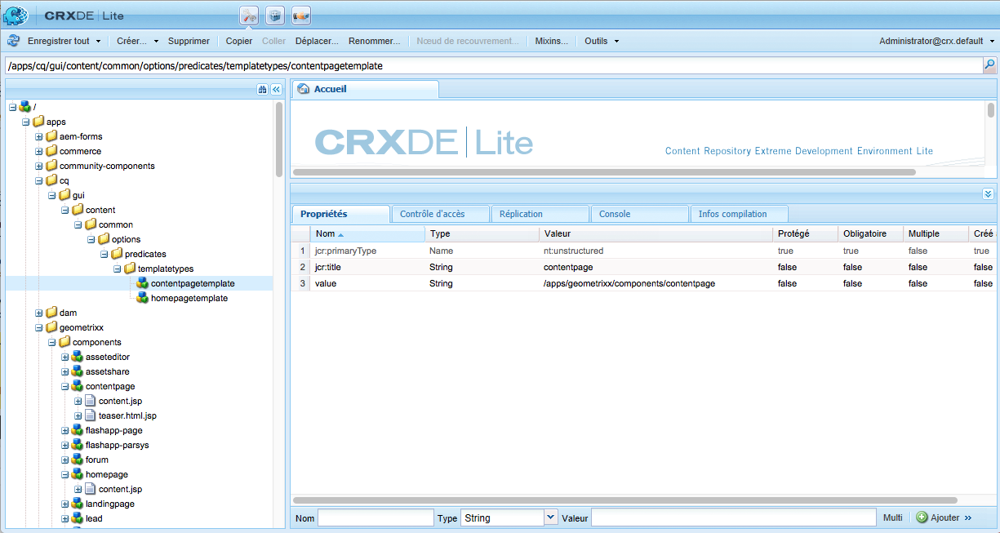
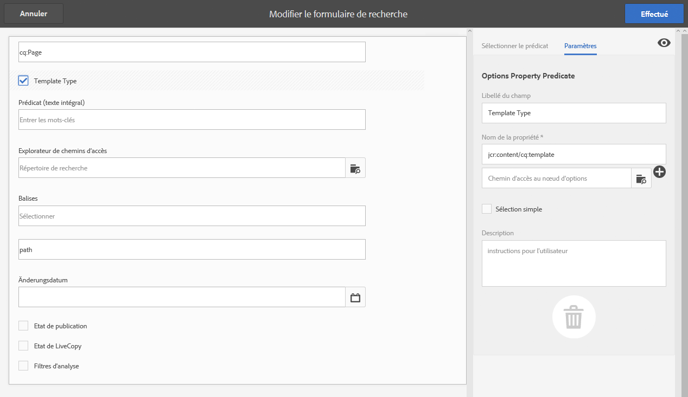

# Configuration des formulaires de recherche{#configuring-search-forms}

Utilisez des **formulaires de recherche** pour personnaliser la sélection des prédicats de recherche utilisés dans les panneaux de recherche disponibles dans différents panneaux ou consoles AEM de l’environnement de création. La personnalisation de ces panneaux permet d’adapter la fonctionnalité de recherche à vos besoins.

Une [plage de prédicats](#predicates-and-their-settings) prête à l’emploi est disponible. Vous pouvez ajouter plusieurs prédicats, dont (entre autres) le prédicat Texte intégral pour les recherches en texte intégral, le prédicat Propriété pour rechercher des ressources correspondant à une propriété unique que vous avez spécifiée ou le prédicat Options pour rechercher des ressources correspondant à une ou plusieurs valeurs que vous spécifiez pour une propriété donnée.

Vous pouvez [configurer les formulaires de recherche](#configuring-your-search-forms) utilisés dans différentes consoles et l’explorateur des ressources (lors de la modification des pages). Les [boîtes de dialogue de configuration de ces formulaires](#configuring-your-search-forms) sont accessibles en sélectionnant :

* **Outils**

   * **Général**

      * **Formulaires de recherche**

Lorsque vous accédez à cette console pour la première fois, vous pouvez constater que toutes les configurations comportent un symbole de cadenas. Cela signifie que la configuration appropriée est la configuration par défaut (prête à l’emploi) et qu’elle ne peut pas être supprimée. Une fois que vous avez personnalisé la configuration, le cadenas disparaît sauf si vous [supprimez la configuration personnalisée](#deleting-a-configuration-to-reinstate-the-default), auquel cas la valeur par défaut (et le symbole de cadenas) est rétablie.

## Configurations {#configurations}

Les configurations par défaut disponibles sont les suivantes :

* **Éditeur de page (recherche de documents) :**

   Cette configuration définit les options disponibles lors de la recherche de document dans l’explorateur d’actifs (lors de la modification d’une page).

* **Éditeur de page (recherche d’images) :**

   Cette configuration définit les options disponibles lors de la recherche d’images dans le navigateur de ressources (lors de la modification d’une page).

* **Éditeur de page (recherche de manuscrits) :**

   Cette configuration définit les options disponibles lors de la recherche de manuscrits dans le navigateur de ressources (lors de la modification d’une page).

* **Éditeur de page (recherche de pages) :**

   Cette configuration définit les options disponibles lors de la recherche de pages dans l’explorateur d’actifs (lors de la modification d’une page).

* **Éditeur de page (recherche de paragraphes) :**

   Cette configuration définit les options disponibles lors de la recherche de paragraphes dans l’explorateur d’actifs (lors de la modification d’une page).

* **Éditeur de page (recherche de produits) :**

   Cette configuration définit les options disponibles lors de la recherche de produits dans l’explorateur d’actifs (lors de la modification d’une page).

* **Éditeur de page (Dynamic Media Classic  [anciennement Scene7] search)** :

   Cette configuration définit les options disponibles lors de la recherche de ressources Scene7 dans le navigateur de ressources (lors de la modification d’une page).

* **Rail de recherche d’administrateurs de sites** :

   Cette configuration définit les options de recherche disponibles pour l&#39;utilisateur lors de l&#39;utilisation du rail de recherche de la console Sites.

* **Éditeur de page (recherche de vidéos):**

   Cette configuration définit les options disponibles lors de la recherche de vidéos dans le navigateur de ressources (lors de la modification d’une page).

* **Rail de recherche d’administrateurs de ressources :**

   Cette configuration définit les options de recherche disponibles pour l’utilisateur lors de l’utilisation de la console Ressources.

* **Rail de recherche d’administrateurs de catalogues:**

   Cette configuration définit les options de recherche disponibles pour l’utilisateur lors de la recherche dans un catalogue de commerce.

* **Rail de recherche d’administrateurs de commandes:**

   Cette configuration définit les options de recherche disponibles pour l&#39;utilisateur lors de la recherche de commandes commerciales.

* **Rail de recherche d’administrateurs de collections de produits:**

   Cette configuration définit les options de recherche disponibles pour l’utilisateur lors de la recherche de collections de produits commerciaux.

* **Rail de recherche d’administrateurs de produits:**

   Cette configuration définit les options de recherche disponibles pour l&#39;utilisateur lors de la recherche de produits commerciaux.

* **Rail de recherche d’administrateurs de projets :**

   Cette configuration définit les options de recherche disponibles pour l’utilisateur lors de la recherche de projets.

## Prédicats et paramètres associés {#predicates-and-their-settings}

### Prédicats {#predicates}

En fonction de la configuration, les prédicats disponibles sont les suivants :

<table>
 <tbody>
  <tr>
   <th>Prédicat</th>
   <th>Objectif</th>
   <th>Paramètres</th>
  </tr>
  <tr>
   <td>Analyses </td>
   <td>Fonctionnalités de recherche/filtrage dans le navigateur Sites lors de l’affichage de données optimisées par l’analyse. Les filtres de recherche Analyses sont chargés de façon à correspondre aux colonnes Analyses personnalisées mappées.</td>
   <td>
    <ul>
     <li>Libellé du champ</li>
     <li>Description</li>
    </ul> </td>
  </tr>
  <tr>
   <td>Dernière modification de la ressource </td>
   <td>Date de la dernière modification de l'actif.  </td>
   <td>Prédicat personnalisé, basé sur l’attribut de date.</td>
  </tr>
  <tr>
   <td>Composants </td>
   <td>Permet à un auteur de rechercher/filtrer des pages comportant un composant spécifique. Par exemple, une galerie d’images.  </td>
   <td>
    <ul>
     <li>Libellé du champ</li>
     <li>Espace réservé</li>
     <li>Nom de la propriété*</li>
     <li>Détails de propriété</li>
     <li>Description</li>
    </ul> </td>
  </tr>
  <tr>
   <td>Date    </td>
   <td>Recherche de fichiers à l’aide de curseurs basée sur une propriété de date.</td>
   <td>
    <ul>
     <li>Libellé du champ</li>
     <li>Nom de la propriété*</li>
     <li>Description</li>
    </ul> </td>
  </tr>
  <tr>
   <td>Date    Plage </td>
   <td>Rechercher des ressources créées dans une plage spécifiée pour une propriété de date. Dans le panneau Rechercher, vous pouvez spécifier des dates de début et de fin.</td>
   <td>
    <ul>
     <li>Libellé du champ</li>
     <li>Espace réservé</li>
     <li>Nom de la propriété*</li>
     <li>Texte de la plage (De)*</li>
     <li>Texte de la plage (À)*</li>
     <li>Description</li>
    </ul> </td>
  </tr>
  <tr>
   <td>État d’expiration </td>
   <td>Recherche de ressources en fonction de l’état d’expiration.</td>
   <td>
    <ul>
     <li>Libellé du champ</li>
     <li>Nom de la propriété*</li>
     <li>Description</li>
    </ul> </td>
  </tr>
  <tr>
   <td>Taille de fichier </td>
   <td>Recherche de fichiers en fonction de leur taille.</td>
   <td>
    <ul>
     <li>Libellé du champ</li>
     <li>Nom de la propriété*</li>
     <li>Chemin d’accès aux options</li>
     <li>Description</li>
    </ul> </td>
  </tr>
  <tr>
   <td>Texte intégral </td>
   <td>Prédicat de recherche pour les recherches en texte intégral..</td>
   <td>
    <ul>
     <li>Libellé du champ</li>
     <li>Espace réservé</li>
     <li>Nom de la propriété</li>
     <li>Description</li>
    </ul> </td>
  </tr>
  <tr>
   <td>Masqué   Filtrer</td>
   <td>Filtrez selon la propriété et la valeur, invisible pour l’utilisateur.</td>
   <td>
    <ul>
     <li>Nom de la propriété</li>
     <li>Valeur de la propriété</li>
     <li>Description</li>
    </ul> </td>
  </tr>
  <tr>
   <td>Options  </td>
   <td>
Les options sont des nœuds de contenu créés par l’utilisateur.
 
Pour plus d’informations, voir <a href="#addinganoptionspredicate">Ajout d’un prédicat Options</a>.
 </td>
   <td>
    <ul>
     <li>Libellé du champ</li>
     <li>Chemin d'accès JSON</li>
     <li>Nom de la propriété*</li>
     <li>Sélection simple</li>
     <li>Chemin d’accès aux options</li>
     <li>Description</li>
    </ul> </td>
  </tr>
  <tr>
   <td>Options, propriété </td>
   <td>Recherchez une propriété de l’option.</td>
   <td>
    <ul>
     <li>Libellé du champ</li>
     <li>Nom de la propriété*</li>
     <li>Chemin d’accès au nœud d’options  </li>
     <li>Sélection simple</li>
     <li>Description</li>
    </ul> </td>
  </tr>
  <tr>
   <td>Page   État </td>
   <td>Rechercher des pages en fonction de leur état.</td>
   <td>
    <ul>
     <li>Libellé du champ</li>
     <li>Nom de la propriété de publication</li>
     <li>Nom de propriété LiveCopy</li>
     <li>Description</li>
    </ul> </td>
  </tr>
  <tr>
   <td>Chemin    </td>
   <td>Recherche de fichiers situés sous un chemin d’accès spécifique.</td>
   <td>
    <ul>
     <li>Libellé du champ</li>
     <li>Ajouter le chemin de recherche</li>
     <li>Description</li>
    </ul> </td>
  </tr>
  <tr>
   <td>Propriété </td>
   <td>Effectuez une recherche sur une propriété spécifiée.</td>
   <td>aucune</td>
  </tr>
  <tr>
   <td>État de publication </td>
   <td>Recherche de ressources en fonction de leur état de publication</td>
   <td>
    <ul>
     <li>Libellé du champ</li>
     <li>Nom de la propriété*</li>
     <li>Description</li>
    </ul> </td>
  </tr>
  <tr>
   <td>Plage </td>
   <td>Recherchez des ressources figurant dans une plage spécifiée. Vous pouvez spécifier, dans le panneau Rechercher, les valeurs minimale et maximale de la plage concernée.</td>
   <td>
    <ul>
     <li>Libellé du champ</li>
     <li>Nom de la propriété</li>
     <li>Description</li>
    </ul> </td>
  </tr>
  <tr>
   <td>Plage Options  </td>
   <td>Prédicat de recherche spécifique pour les ressources et identique à Prédicat de curseur commun. Il reste disponible en raison de problèmes de rétrocompatibilité.</td>
   <td>
    <ul>
     <li>Libellé du champ</li>
     <li>Nom de la propriété*</li>
     <li>Chemin d’accès aux options</li>
     <li>Description</li>
    </ul> </td>
  </tr>
  <tr>
   <td>Évaluation </td>
   <td>Rechercher des ressources en fonction de leur évaluation.  </td>
   <td>
    <ul>
     <li>Libellé du champ</li>
     <li>Nom de la propriété*</li>
     <li>Chemin d’accès aux options</li>
     <li>Description</li>
    </ul> </td>
  </tr>
  <tr>
   <td>Date relative </td>
   <td>Rechercher des ressources en fonction de la date relative de leur création  </td>
   <td>
    <ul>
     <li>Libellé du champ</li>
     <li>Nom de la propriété*</li>
     <li>Date relative</li>
     <li>Description</li>
    </ul> </td>
  </tr>
  <tr>
   <td>Plage du curseur </td>
   <td>Prédicat de recherche courant étendant le prédicat de plage avec la fonctionnalité de curseur. La valeur de la propriété recherchée doit être comprise entre les limites du curseur.</td>
   <td>
    <ul>
     <li>Libellé du champ</li>
     <li>Nom de la propriété*</li>
     <li>Description</li>
    </ul> </td>
  </tr>
  <tr>
   <td>Balise </td>
   <td>Recherche de ressources en fonction de balises. Vous pouvez configurer la propriété de chemin d’accès pour renseigner les différentes balises dans la liste de balises.</td>
   <td>
    <ul>
     <li>Libellé du champ</li>
     <li>Nom de la propriété*</li>
     <li>Chemin d’accès aux options</li>
     <li>Description</li>
    </ul> </td>
  </tr>
  <tr>
   <td>Balises </td>
   <td>Effectuez une recherche en fonction de balises.</td>
   <td>
    <ul>
     <li>Espace réservé</li>
     <li>Nom de la propriété*</li>
     <li>Description</li>
    </ul> </td>
  </tr>
 </tbody>
</table>

>[!NOTE]
>
>* Les prédicats de recherche courants sont définis dans :
   >  `/libs/cq/gui/components/common/admin/customsearch/searchpredicates`
   >
   >
   >

* Les prédicats de recherche liés uniquement à siteadmin (interface utilisateur classique) se trouvent sous :
   > `/libs/cq/gui/components/siteadmin/admin/searchpanel/searchpredicates`
   >   * Elles sont obsolètes et disponibles uniquement pour une compatibilité ascendante.

>
>
Ces informations sont proposées à des fins de référence seulement. Vous ne devez pas apporter de modifications au répertoire `/libs`.

### Paramètres de prédicat {#predicate-settings}

En fonction du prédicat, une sélection de paramètres est disponible pour la configuration :

* **Libellé du champ**

   Libellé qui s’affiche sous forme d’en-tête réductible ou de libellé de champ du prédicat.

* **Description**

   Informations descriptives à l’intention de l’utilisateur.

* **Espace réservé**

   Texte non renseigné ou espace réservé du prédicat au cas où aucun texte de filtrage ne serait saisi.

* **Nom de la propriété**

   Propriété selon laquelle effectuer la recherche. Elle utilise un chemin relatif et les caractères génériques `*/*/*` pour spécifier la profondeur de la propriété par rapport au nœud `jcr:content` (chaque astérisque représente un niveau de nœud).

   Si vous souhaitez effectuer une recherche uniquement sur le nœud enfant de premier niveau de la ressource, dont la propriété `x` est égale au nœud `jcr:content`, utilisez `*/jcr:content/x`.

* **Détails de propriété**

   Détails maximum selon lesquels rechercher cette propriété dans les ressources. Une recherche sur cette propriété peut donc être exécutée sur une ressource et des enfants récursifs jusqu’au niveau auquel les enfants sont égaux à la profondeur spécifiée.

* **Valeur de la propriété**

   Valeur de la propriété sous forme de chaîne absolue ou de langage utilisant des expressions ; par exemple, `cq:Page` ou

   `${empty requestPathInfo.suffix ? "/content" : requestPathInfo.suffix}`.

* **Texte de la plage**

   Libellé du champ de plage dans le prédicat **Plage de dates**.

* **Chemin d’accès aux options**

   L’utilisateur peut sélectionner le chemin d’accès à l’aide de l’Explorateur de chemins d’accès dans l’onglet Paramètres de prédicat, puis cliquer sur l’icône « **+** » pour ajouter la sélection à la liste des options valides (puis sur l’icône « **-** » pour la supprimer, si nécessaire).

   Les options sont des nœuds de contenu créés par l’utilisateur, qui possèdent la structure suivante :

   `(jcr:primaryType = nt:unstructured, value (String), jcr:title (String))`

* **Chemin d’accès au nœud d’options**
Dans la pratique, il est identique au 
**Chemin d’accès aux options**, à la différence qu’il s’agit du champ de prédicat commun, l’autre étant spécifique aux ressources.

* **Sélection simple**
Si cette case est cochée, les options sont présentées sous forme de cases à cocher qui ne permettent qu’une sélection simple. Si cette option est sélectionnée par erreur, vous pouvez désélectionner la case à cocher correspondante.

* **Nom des propriétés de publication et Live Copy**
Libellés des cases à cocher Publication et Live Copy pour le prédicat spécifique aux sites.

* &amp;ast; sur les libellés de champ de l&#39;onglet **Paramètres** signifie que les champs sont obligatoires et qu&#39;un message d&#39;erreur s&#39;affiche si rien n&#39;est.

## Configuration des formulaires de recherche {#configuring-your-search-forms}

### Création/ouverture d’une configuration personnalisée {#creating-opening-a-customized-configuration}

1. Sélectionnez **Outils** > **Opérations** > **Formulaires de recherche**.

1. Sélectionnez la configuration que vous souhaitez personnaliser.
1. Utilisez l’icône **Modifier** pour ouvrir la configuration pour la mise à jour.
1. S’il s’agit d’une nouvelle personnalisation, vous allez probablement [ajouter de nouveaux champs de prédicat et définir les paramètres](#add-edit-a-predicate-field-and-define-field-settings) requis. S’il s’agit d’une personnalisation existante, vous pouvez sélectionner un champ existant et [mettre à jour les paramètres](#add-edit-a-predicate-field-and-define-field-settings).
1. Sélectionnez **Terminé** pour enregistrer la configuration.

   >[!NOTE]
   >
   >Les configurations personnalisées sont enregistrées (de façon appropriée) sous :
   >
   >* `/apps/cq/gui/content/facets/<option>`
   >* `/apps/commerce/gui/content/facets/<option>`

### Ajout/modification d’un champ de prédicat et définition des paramètres de champ {#add-edit-a-predicate-field-and-define-field-settings}

Vous pouvez ajouter ou modifier des champs et définir/mettre à jour leurs paramètres :

1. [Ouvrez la configuration personnalisée](#creating-opening-a-customized-configuration) pour la mise à jour.
1. Si vous souhaitez ajouter un nouveau champ, ouvrez l’onglet **Sélectionner le prédicat** et faites glisser le prédicat souhaité vers l’emplacement souhaité. Par exemple, le **prédicat de plage de dates** :

   

1. Selon que :

   * Vous ajoutiez ou non un nouveau champ :

      Après l’ajout du prédicat, l’onglet **Paramètres** s’ouvre et affiche les propriétés qui peuvent être définies.

   * Vous souhaitiez ou non mettre à jour un prédicat existant :

      Sélectionnez le champ de prédicat (à droite), puis ouvrez l’onglet **Paramètres**.
   Par exemple, les paramètres du **prédicat de plage de dates** :

   

1. Apportez les modifications nécessaires et confirmez-les en cliquant sur **Terminé**.

### Aperçu de la configuration de recherche {#previewing-the-search-configuration}

1. Sélectionnez l’icône Aperçu :

   

1. Les formulaires de recherche s’affichent tels qu’ils apparaissent (totalement développés) dans la colonne Rechercher de la console appropriée.

   

1. **Fermez** l’aperçu pour terminer la configuration.

### Suppression d’un champ de prédicat    {#deleting-a-predicate-field}

1. [Ouvrez la configuration personnalisée](#creating-opening-a-customized-configuration) pour la mise à jour.
1. Sélectionnez le champ de prédicat (à droite), ouvrez l’onglet **Paramètres**, puis sélectionnez l’icône **Supprimer** (dans le coin inférieur gauche).

   

1. Une boîte de dialogue vous invite à confirmer la suppression.

1. Confirmez la suppression et les autres modifications en cliquant sur **Terminé**.

### Suppression d’une configuration (pour rétablir la valeur par défaut) {#deleting-a-configuration-to-reinstate-the-default}

Une fois que vous avez personnalisé une configuration, cette option remplace les valeurs par défaut. Vous pouvez rétablir la configuration par défaut en supprimant la configuration personnalisée.

>[!NOTE]
>
>Vous ne pouvez pas supprimer les configurations par défaut.

Les configurations personnalisées doivent être supprimées à partir de la console :

1. Sélectionnez une configuration (par exemple, **Éditeur de page (Recherche sur des paragraphes)**), puis cliquez sur l’icône **Supprimer** de la barre d’outils :

   

1. La configuration personnalisée est supprimée et la valeur par défaut est rétablie (le symbole de cadenas réapparaît dans la console).

### Ajout de prédicats d’options    {#adding-options-predicates}

Les prédicats d’options (options, propriété d’options) permettent de configurer un élément à rechercher. Ils servent généralement à rechercher un élément directement sous la page, par exemple, une propriété sur le nœud de page.

L’exemple ci-dessous (pour effectuer une recherche en fonction du modèle utilisé pour créer une page) illustre la procédure :

1. Créez le nœud définissant la propriété à rechercher.

   Vous avez besoin d’un nœud racine contenant les définitions des différentes options disponibles pour l’utilisateur.

   Les nœuds pour les différentes options ont besoin de propriétés :

   * `jcr:title` : libellé de champ à afficher dans le champ de recherche
   * `value` : valeur de la propriété à rechercher

   

   >[!NOTE]
   >
   >Vous ne devez ***rien*** modifier dans le chemin `/libs`.
   >
   >En effet, le contenu de `/libs` est remplacé dès que vous mettez à niveau votre instance (et risque de l’être si vous appliquez un correctif ou un Feature Pack).
   >
   >La méthode recommandée pour la configuration et d’autres modifications est la suivante :
   >
   >1. Recréez l’élément nécessaire, tel qu’il existe dans `/libs`, sous `/apps`. Dans ce cas dans :
   >1. `/libs/cq/gui/content/common/options/predicates`
   >1. Apportez les modifications désirées dans `/apps.`

1. Ouvrez la console **Formulaires de recherche** et sélectionnez la configuration à mettre à jour. Par exemple, le **rail de recherche d’administrateurs de sites**.

   Ensuite, cliquez/appuyez sur l’icône **Modifier des formulaires de recherche**.

1. En fonction de la configuration, ajoutez des **options** ou une **propriété d’options** à la configuration.
1. Mettez à jour les champs, en particulier :

   * **Nom de la propriété**

      Spécifique à la propriété du nœud à rechercher sur les nœuds cibles. Par exemple :

      `jcr:content/cq:template`

   * **Chemin d’accès du nœud d’option**

      Sélectionnez le chemin d’accès vers lequel vos options sont conservées. Par exemple :

      `/apps/cq/gui/content/common/options/predicates/templatetype`
   

1. Sélectionnez **Terminé** pour enregistrer la configuration.
1. Accédez à la console appropriée (dans cet exemple, **Sites**) et ouvrez le rail **Rechercher**. Les formulaires de recherche qui viennent d’être définis, ainsi que les différentes options, sont visibles. Sélectionnez l’option nécessaire pour afficher les résultats de la recherche:

   

## Autorisations d’utilisateur {#user-permissions}

Le tableau ci-dessous répertorie les autorisations nécessaires à la modification, à la suppression et à l’aperçu dans des formulaires de recherche.

<table>
 <tbody>
  <tr>
   <td><strong>Action</strong></td>
   <td><strong>Autorisations</strong></td>
  </tr>
  <tr>
   <td>Modifier </td>
   <td>Autorisations de lecture et d’écriture sur le nœud <code>/apps </code>.</td>
  </tr>
  <tr>
   <td>Supprimer</td>
   <td>Autorisations de lecture, d’écriture et de suppression sur le nœud <code>/apps</code>.</td>
  </tr>
  <tr>
   <td>Aperçu</td>
   <td>Autorisations de lecture, d’écriture et de suppression sur le nœud <code>/var/dam/content</code>.  Autorisations de lecture et d’écriture sur le nœud <code>/apps</code>.</td>
  </tr>
 </tbody>
</table>

