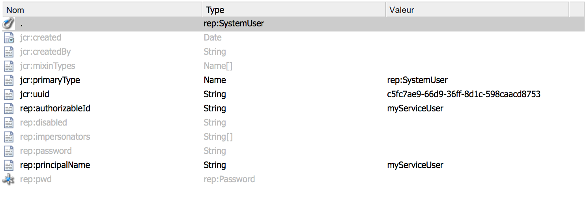

# Utilisateurs et utilisatrices de service dans Adobe Experience Manager (AEM) {#service-users-in-aem}

## Présentation {#overview}

La principale façon d’obtenir un résolveur de session d’administration ou de ressource dans AEM consistait à utiliser les méthodes `SlingRepository.loginAdministrative()` et `ResourceResolverFactory.getAdministrativeResourceResolver()` fournies par Sling.

Toutefois, aucune de ces méthodes n&#39;a été conçue autour de la méthode [principe du moindre privilège](https://fr.wikipedia.org/wiki/Principe_de_moindre_privil%C3%A8ge). Il est ainsi trop facile pour un développeur de ne pas planifier de structure appropriée et de niveaux de contrôle d’accès correspondants (ACL) pour son contenu dès le départ. Si une vulnérabilité est présente dans un tel service, elle conduit souvent à des réaffectations de privilèges `admin`, même si le code n’a pas besoin de privilèges d’administration pour fonctionner.

## Comment supprimer les sessions d’administration {#how-to-phase-out-admin-sessions}

### Priorité 0 : la fonctionnalité est-elle active/nécessaire/abandonnée ? {#priority-is-the-feature-active-needed-derelict}

Il peut y avoir des cas où la session d’administration n’est pas utilisée, ou la fonction est complètement désactivée. Si tel est le cas avec votre mise en oeuvre, assurez-vous de supprimer complètement la fonctionnalité ou de l’adapter à [Code NOP](https://fr.wikipedia.org/wiki/Instruction_nulle).

### Priorité 1 : utiliser la session de requête {#priority-use-the-request-session}

Lorsque cela est possible, refactorisez votre fonction de sorte que la session de requête authentifiée donnée puisse être utilisée pour écrire ou lire du contenu. Si cela n’est pas possible, vous pouvez y parvenir en appliquant les priorités suivantes.

### Priorité 2 : restructurer le contenu {#priority-restructure-content}

De nombreux problèmes peuvent être résolus en restructurant le contenu. Gardez ces règles simples à l’esprit lorsque vous effectuez la restructuration :

* **Modifier le contrôle d’accès**

   * Assurez-vous que les utilisateurs, les utilisatrices ou les groupes qui ont réellement besoin d’un accès ne rencontrent aucun souci d’accès.

* **Affiner la structure du contenu**

   * Déplacez-le vers d’autres emplacements, par exemple, où le contrôle d’accès correspond aux sessions de requête disponibles ;
   * Modifiez la granularité du contenu.

* **Refactorisation du code afin qu’il corresponde à un service approprié**

   * Redéfinissez la logique métier du code JSP en service. Cela permet une modélisation du contenu différente.

Veillez également à ce que toutes les nouvelles fonctionnalités que vous développez respectent les principes suivants :

* **Les exigences de sécurité doivent déterminer la structure du contenu**

   * La gestion du contrôle d’accès doit être naturelle.
   * Le contrôle d’accès doit être appliqué par le référentiel, et non par l’application.

* **Utilisation des types de noeuds**

   * Limitez l’ensemble des propriétés qui peuvent être définies.

* **Respectez les paramètres de confidentialité**

   * Dans le cas de profils privés, par exemple, n’exposez pas la photo de profil, l’adresse e-mail ni le nom complet figurant sur le nœud `/profile` privé.

## Contrôle d’accès strict {#strict-access-control}

Si vous appliquez le contrôle d’accès lors de la restructuration du contenu ou lorsque vous le faites pour un nouvel utilisateur, vous devez appliquer les ACL les plus strictes possibles. Utilisez tous les moyens de contrôle d’accès possibles :

* Par exemple, plutôt que d’appliquer `jcr:read` sur `/apps`, appliquez-le uniquement sur `/apps/*/components/*/analytics`.

* Utilisez des [restrictions](https://jackrabbit.apache.org/oak/docs/security/authorization/restriction.html).

* Appliquez des listes de contrôle d’accès pour les types de noeuds.
* Limitez les autorisations.

   * Par exemple, si vous avez besoin de l’autorisation d’écriture uniquement pour les propriétés, ne donnez pas l’autorisation `jcr:write`, utilisez plutôt `jcr:modifyProperties`.

## Utilisateurs de services et mises en correspondance {#service-users-and-mappings}

En cas d’échec ci-dessus, Sling 7 propose un service de mappage des utilisateurs de service, qui vous permet de configurer un mappage de lot à utilisateur et deux méthodes d’API correspondantes :

* [`SlingRepository.loginService()`](https://sling.apache.org/apidocs/sling7/org/apache/sling/jcr/api/SlingRepository.html#loginService-java.lang.String-java.lang.String-)
* [`ResourceResolverFactory.getServiceResourceResolver()`](https://sling.apache.org/apidocs/sling7/org/apache/sling/api/resource/ResourceResolverFactory.html#getServiceResourceResolver-java.util.Map-)

Les méthodes renvoient un résolveur de session/ressource avec les privilèges d’un utilisateur ou d’une utilisatrice configurée uniquement. Ces méthodes présentent les caractéristiques suivantes :

* Elles permettent de mettre en correspondance les services avec les utilisateurs.
* Elles permettent de définir des utilisateurs ou utilisatrices de sous-services.
* Le point central de configuration est le suivant : `org.apache.sling.serviceusermapping.impl.ServiceUserMapperImpl`.
* `service-id` = `service-name` [&quot;:&quot; subservice-name]

* `service-id` est mis en correspondance avec un résolveur de ressource et/ou un ID d’utilisateur de référentiel JCR pour l’authentification.
* `service-name` est le nom symbolique du lot qui fournit le service.

## Autres recommandations {#other-recommendations}

### Remplacer la session d’administration par un utilisateur ou une utilisatrice de service {#replacing-the-admin-session-with-a-service-user}

Un utilisateur de service est un utilisateur JCR sans mot de passe défini et avec un jeu minimal d’autorisations nécessaires pour effectuer une tâche spécifique. Si aucun mot de passe n’est défini, il n’est pas possible de se connecter avec un utilisateur du service.

Une façon de rendre une session d’administration obsolète consiste à la remplacer par des sessions d’utilisateur ou d’utilisatrice de service. Elle peut également être remplacée par plusieurs utilisateurs ou utilisatrices de sous-service si nécessaire.

Pour remplacer la session d’administration par un utilisateur ou une utilisatrice de service, procédez comme suit :

1. Identifiez les autorisations nécessaires à votre service, en gardant à l’esprit le principe de la moindre autorisation.
1. Vérifiez s’il existe déjà un utilisateur disponible ayant exactement la configuration de permissions dont vous avez besoin. Créez un utilisateur ou une utilisatrice de service système si aucun utilisateur ou aucune utilisatrice existante ne correspond à vos besoins. RTC est nécessaire pour créer un utilisateur ou une utilisatrice de service. Parfois, il est logique de créer plusieurs utilisateurs ou utilisatrices de sous-services (par exemple, un pour l’écriture et un autre pour la lecture) pour compartimenter encore plus l’accès.
1. Configurez et testez des ACE pour votre utilisateur ou utilisatrice.
1. Ajoutez une mise en correspondance `service-user` pour votre service et pour les `user/sub-users`

1. Rendez la fonction Sling d’utilisateur de service disponible pour votre lot : mettez à jour vers la version la plus récente de `org.apache.sling.api`.

1. Remplacez `admin-session` dans votre code par les API `loginService` ou `getServiceResourceResolver`.

## Créer un utilisateur ou une utilisatrice de service {#creating-a-new-service-user}

Une fois que vous avez vérifié qu’aucun utilisateur de la liste des utilisateurs du service AEM n’est applicable pour votre cas d’utilisation et que les problèmes RTC correspondants ont été approuvés, ajoutez le nouvel utilisateur au contenu par défaut.

Il est recommandé de créer un utilisateur de service pour utiliser l’explorateur de référentiel à l’adresse *https://&lt;server>:&lt;port>/crx/explorer/index.jsp*.

Le but est d’obtenir une propriété `jcr:uuid` valide qui est obligatoire pour créer l’utilisateur ou l’utilisatrice par l’intermédiaire d’une installation de package de contenu.

Vous pouvez créer des utilisateurs de services de la façon suivante :

1. En vous rendant dans l’explorateur de référentiel sur *https://&lt;server>:&lt;port>/crx/explorer/index.jsp*.
1. Connectez-vous en tant qu’administrateur ou administratrice en appuyant sur le lien **Connexion** en haut à gauche de l’écran.
1. Ensuite, créez et nommez votre utilisateur ou utilisatrice système. Pour créer l’utilisateur ou l’utilisatrice en tant qu’utilisateur ou utilisatrice système, définissez le chemin intermédiaire comme `system` et ajoutez des sous-dossiers facultatifs en fonction de vos besoins :

   

1. Vérifiez que le nœud d’utilisateur système se présente comme suit :

   

   >[!NOTE]
   >
   >Notez qu’il n’existe aucun type de mixin associé aux utilisateurs ou utilisatrices de services. Cela signifie qu’il n’existe aucune stratégie de contrôle d’accès pour les utilisateurs système.

En ajoutant le fichier content.xml correspondant au contenu du lot, assurez-vous que vous avez défini le `rep:authorizableId` et que le type principal est `rep:SystemUser`. Il doit ressembler à ceci :

```xml
<?xml version="1.0" encoding="UTF-8"?>
<jcr:root xmlns:jcr="https://www.jcp.org/jcr/1.0" xmlns:rep="internal"
    jcr:primaryType="rep:SystemUser"
    jcr:uuid="4917dd68-a0c1-3021-b5b7-435d0044b0dd"
    rep:principalName="authentication-service"
    rep:authorizableId="authentication-service"/>
```

## Ajouter une modification de configuration à la configuration ServiceUserMapper {#adding-a-configuration-amendment-to-the-serviceusermapper-configuration}

Pour ajouter un mappage de votre service avec les utilisateurs ou utilisatrices système correspondants, créez une configuration d’usine pour le service [`ServiceUserMapper`](https://sling.apache.org/apidocs/sling7/org/apache/sling/serviceusermapping/ServiceUserMapper.html). Pour conserver la modularité, une configuration de ce type peut être fournie par le [mécanisme d’amendement de Sling](https://issues.apache.org/jira/browse/SLING-3578). La méthode recommandée pour installer de telles configurations avec votre bundle consiste à utiliser le [Chargement initial du contenu Sling](https://sling.apache.org/documentation/bundles/content-loading-jcr-contentloader.html) :

1. Créez un sous-dossier SLING-INF/content sous le dossier src/main/resources de votre lot.
1. Dans ce dossier, créez un fichier appelé org.apache.sling.serviceusermapping.impl.ServiceUserMapperImpl.amended-&lt;nom unique de votre configuration d’usine>.xml avec le contenu de votre configuration d’usine (incluant tous les mappages d’utilisateurs ou utilisatrices de sous-services). Exemple :

1. Créez un sous-dossier `SLING-INF/content` sous le dossier `src/main/resources` de votre lot.
1. Dans ce dossier, créez un fichier `named org.apache.sling.serviceusermapping.impl.ServiceUserMapperImpl.amended-<a unique name for your factory configuration>.xml` avec le contenu de votre configuration d’usine, y compris tous les mappages utilisateur de sous-service.

   À des fins d’illustration, prenez le fichier nommé `org.apache.sling.serviceusermapping.impl.ServiceUserMapperImpl.amended-com.adobe.granite.auth.saml.xml` :

   ```xml
   <?xml version="1.0" encoding="UTF-8"?>
   <node>
       <primaryNodeType>sling:OsgiConfig</primaryNodeType>
       <property>
           <name>user.default</name>
           <value></value>
       </property>
       <property>
           <name>user.mapping</name>
           <values>
               <value>com.adobe.granite.auth.saml=authentication-service</value>
           </values>
       </property>
   </node>
   ```

1. Référencez le contenu initial Sling dans la configuration de `maven-bundle-plugin` dans le fichier `pom.xml` du lot. Exemple :

   ```xml
   <Sling-Initial-Content>
      SLING-INF/content;path:=/libs/system/config;overwrite:=true;
   </Sling-Initial-Content>
   ```

1. Installez le bundle et assurez-vous que la configuration d’usine a été installée. Vous pouvez le faire en procédant comme suit :

   * Accédez à la console web à l’adresse *https://serverhost:serveraddress/system/console/configMgr*.
   * Recherchez **Amendement du service de mappage des utilisateurs de service Apache Sling**.
   * Cliquez sur le lien pour voir si la configuration appropriée est en place.

## Traitement des sessions partagées dans les services {#dealing-with-shared-sessions-in-services}

Les appels à `loginAdministrative()` apparaissent souvent avec les sessions partagées. Ces sessions sont acquises lors de l’activation du service et ne sont déconnectées qu’après l’arrêt du service. Bien qu’il s’agisse d’une pratique courante, cela débouche sur deux problèmes :

* **Sécurité** : ces sessions d’administrateur sont utilisées pour mettre en cache et renvoyer les ressources ou d’autres objets qui sont liés à la session partagée. Plus loin dans la pile d’appels, ces objets peuvent être adaptés aux sessions ou aux résolveurs de ressources avec des privilèges élevés. Souvent, il n’est pas clair pour l’appelant qu’il s’agit d’une session d’administration avec laquelle il fonctionne.
* **Performances :** dans Oak, les sessions partagées peuvent entraîner des problèmes de performances et il n’est pas recommandé de les utiliser.

La solution la plus évidente au risque de sécurité est de remplacer simplement l’appel `loginAdministrative()` par un appel `loginService()` à un utilisateur disposant d’autorisations limitées. Toutefois, cela n’a aucune incidence sur une dégradation potentielle des performances. Vous pouvez limiter ces éventuelles dégradations en incluant toutes les informations requises dans un objet qui n’est plus associé à la session. Ensuite, créez (ou détruisez) la session à la demande.

L’approche recommandée consiste à refactoriser l’API du service afin que l’appelant ou l’appelante puisse contrôler la création/destruction de la session.

## Sessions d’administration dans les JSP {#administrative-sessions-in-jsps}

Les JSP ne peuvent pas utiliser `loginService()` car il n’y a aucun service associé. Toutefois, les sessions administratives dans les JSP indiquent généralement une violation du paradigme MVC.

Ce problème peut être résolu de deux façons :

1. En restructurant le contenu de manière à pouvoir le manipuler avec la session utilisateur.
1. En extrayant la logique vers un service qui fournit une API qui peut ensuite être utilisée par le JSP.

La première méthode est préférable.

## Traitement des événements, préprocesseurs de réplication et des tâches {#processing-events-replication-preprocessors-and-jobs}

Lors du traitement d’événements, de tâches, et dans certains cas, de workflows, la session correspondante qui a déclenché l’événement est perdue. Il en résulte que les gestionnaires d’événements et les processeurs de tâches utilisent souvent des sessions administratives pour effectuer leurs tâches. Il existe différentes approches concevables pour résoudre ce problème, chacune présentant ses avantages et ses inconvénients :

1. Transmettez l’`user-id` dans le payload de l’événement et utilisez l’emprunt d’identité.

   **Avantages :** facilité d’utilisation.

   **Inconvénients :** continue d’utiliser `loginAdministrative()`. Cela réauthentifie une requête qui a déjà été authentifiée.

1. Créez ou réutilisez un utilisateur ou une utilisatrice de services ayant accès aux données.

   **Avantages :** cohérent par rapport à la conception actuelle. Nécessite peu de modifications.

   **Inconvénients** : nécessite que les utilisateurs et utilisatrices de services performants soient flexibles, ce qui peut facilement conduire à une réaffectation des privilèges. Évite le modèle de sécurité.

1. Transmettez une sérialisation du `Subject` dans le payload d’événement et créez un `ResourceResolver` basé sur cet objet. Un exemple serait d’utiliser le JAAS `doAsPrivileged` dans le `ResourceResolverFactory`.

   **Avantages :** mise en œuvre propre du point de vue de la sécurité. Cela évite la réauthentification et utilise les privilèges d’origine. Le code pertinent pour la sécurité est transparent pour le consommateur ou la consommatrice de l’événement.

   **Inconvénients :** nécessité de refactoriser. Le fait que le code approprié pour la sécurité soit transparent pour le consommateur ou la consommatrice de l’événement peut également entraîner des problèmes.

La troisième approche s’avère la technique de traitement à privilégier.

## Processus de workflow {#workflow-processes}

Dans les mises en œuvre de processus de workflow, la session utilisateur correspondante ayant déclenché le workflow est perdue. Cela entraîne des processus de workflow qui utilisent souvent des sessions administratives pour effectuer leur travail.

Pour résoudre ces problèmes, il est recommandé d’utiliser les mêmes approches que celles mentionnées dans la section [Traitement des événements, des préprocesseurs de réplication et des tâches](/help/sites-administering/security-service-users.md#processing-events-replication-preprocessors-and-jobs).

## Processeurs POST Sling et pages supprimées {#sling-post-processors-and-deleted-pages}

Plusieurs sessions administratives sont utilisées dans les mises en œuvre de processeur POST Sling. En règle générale, les sessions administratives sont utilisées pour accéder aux nœuds qui sont en attente de suppression dans le POST en cours de traitement. Par conséquent, ils ne sont plus disponibles via la session de requête. Un nœud en attente de suppression peut être accessible pour révéler des métadonnées qui ne devraient pas être accessibles dans le cas contraire.
