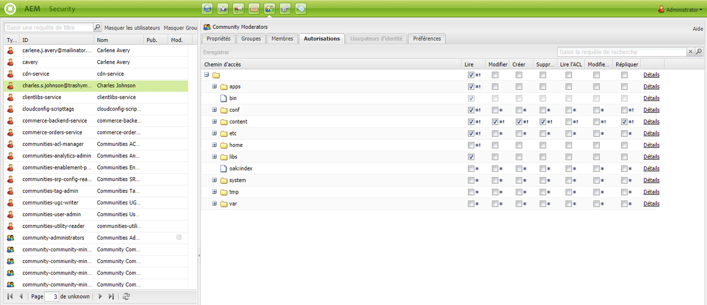

# Administration et sécurité des utilisateurs{#user-administration-and-security}

Ce chapitre décrit comment configurer et gérer l’autorisation de l’utilisateur et décrit également la théorie sous-jacente au fonctionnement de l’authentification et des autorisations dans AEM.

## Utilisateurs et groupes dans AEM {#users-and-groups-in-aem}

Cette section traite des différentes entités et des concepts associés plus en détail pour vous aider à définir un concept de gestion des utilisateurs simple.

### Utilisateurs {#users}

Les utilisateurs se connectent à AEM avec leur compte. Chaque compte utilisateur est unique et contient les détails de base du compte, ainsi que les autorisations affectées.

Les utilisateurs sont souvent membres de groupes, ce qui simplifie l’affectation de ces autorisations et/ou privilèges.

### Groupes {#groups}

Les groupes sont des ensembles d’utilisateurs et/ou d’autres groupes ; tous sont membres d’un groupe.

Le principal objectif des groupes est de simplifier le processus de maintenance en réduisant le nombre d’entités à mettre à jour : une modification apportée à un groupe est appliquée à tous les membres du groupe. Les groupes reflètent souvent :

* Un rôle dans l’application : par exemple, un utilisateur autorisé à naviguer dans le contenu ou autorisé à contribuer au contenu.
* Votre propre entreprise : vous pouvez étendre les rôles pour différencier les contributeurs de différents services lorsqu’ils sont limités à des branches différentes de l’arborescence de contenu.

Par conséquent, les groupes ont tendance à demeurer stables, tandis que les utilisateurs vont et viennent plus fréquemment.

Avec une planification et une structure saine, l’utilisation des groupes peut refléter votre structure, ce qui vous apporte une vue d’ensemble claire et un mécanisme efficace pour les mises à jour.

### Utilisateurs et groupes intégrés {#built-in-users-and-groups}

AEM WCM installe un certain nombre d’utilisateurs et de groupes. Ces informations sont visibles lorsque vous accédez pour la première fois à la console de sécurité après l’installation.

Les tableaux suivants répertorient chaque élément avec :

* Une brève description
* Des recommandations quant aux modifications nécessaires

*Modifiez tous les mots de passe par défaut* (si vous ne supprimez pas le compte lui-même dans certains cas).

<table>
 <tbody>
  <tr>
   <td>ID utilisateur</td>
   <td>Type</td>
   <td>Description</td>
   <td>Recommandation</td>
  </tr>
  <tr>
   <td>
admin
 
Mot de passe par défaut : admin
 </td>
   <td>User</td>
   <td>
Compte d’administration système avec droits d’accès complets.
 
Ce compte est utilisé pour la connexion entre AEM WCM et CRX.
 
Si vous supprimez ce compte par erreur, il sera recréé au redémarrage du référentiel (dans la configuration par défaut).
 
Le compte administrateur est une exigence de la plateforme AEM. Par conséquent, ce compte ne peut pas être supprimé.
 </td>
   <td>
Adobe recommande vivement que le mot de passe de ce compte utilisateur soit différent de la valeur par défaut.
 
De préférence à l’issue de l’installation, bien que ceci puisse s’effectuer par la suite.
 
Remarque : ce compte ne doit pas être confondu avec le compte d’administrateur du moteur de servlet CQ.
 </td>
  </tr>
  <tr>
   <td>
anonymous
 
 
 </td>
   <td>User</td>
   <td>
Détient les droits par défaut pour l’accès non authentifié à une instance. Par défaut, il s’agit des droits d’accès minimum.
 
Si vous supprimez ce compte par erreur, il sera recréé au redémarrage. Il ne peut pas être supprimé définitivement, mais peut être désactivé.
 </td>
   <td>Évitez de supprimer ou de désactiver ce compte, car cela aura une incidence négative sur le fonctionnement des instances d’auteur. S’il existe des exigences de sécurité qui vous obligent à le supprimer, assurez-vous d’abord de tester correctement les effets qu’il a sur vos systèmes.</td>
  </tr>
  <tr>
   <td>
Auteur 
 
Mot de passe par défaut : author
 </td>
   <td>User</td>
   <td>
Un compte d’auteur autorisé à écrire dans /content. Comprend les autorisations de contributeur et de surfeur.
 
Peut être utilisé comme webmaster, car il dispose de l’accès à toute l’arborescence /content.
 
Ce n’est pas un utilisateur intégré, mais un autre utilisateur de démonstration Geometrixx
 </td>
   <td>
Adobe vous recommande de supprimer complètement le compte ou de modifier le mot de passe par défaut.
 
De préférence à l’issue de l’installation, bien que ceci puisse s’effectuer par la suite.
 </td>
  </tr>
  <tr>
   <td>administrators</td>
   <td>Groupe</td>
   <td>
Groupe donnant des droits d’administrateur à tous ses membres. Seul l’administrateur est autorisé à modifier ce groupe.
 
Dispose des droits d’accès complets.
 </td>
   <td>Si vous définissez une clause « deny-everyone » sur un nœud, les administrateurs auront uniquement accès si cette clause est de nouveau activée pour ce groupe.</td>
  </tr>
  <tr>
   <td>content-authors</td>
   <td>Groupe</td>
   <td>
Groupe responsable de la modification du contenu. Nécessite des autorisations de lecture, de modification, de création et de suppression.
 </td>
   <td>Vous pouvez créer vos propres groupes d’auteurs de contenu avec des droits d’accès spécifiques au projet, à condition d’ajouter des autorisations de lecture, de modification, de création et de suppression.</td>
  </tr>
  <tr>
   <td>contributor</td>
   <td>Groupe</td>
   <td>
Droits de base qui permettent à l’utilisateur d’écrire du contenu (comme dans la fonctionnalité uniquement).
 
N’alloue aucune autorisation sur l’arborescence /content. Ces autorisations doivent être spécifiquement allouées pour les groupes ou utilisateurs individuels.
 </td>
   <td> </td>
  </tr>
  <tr>
   <td>dam-users</td>
   <td>Groupe</td>
   <td>Groupe de référence prêt à l’emploi pour un utilisateur AEM Assets standard. Les membres de ce groupe possèdent les autorisations appropriées pour activer le chargement/partage des ressources et des collections.</td>
   <td> </td>
  </tr>
  <tr>
   <td>everyone</td>
   <td>Groupe</td>
   <td>
Chaque utilisateur d’AEM est membre de ce groupe, même si vous ne voyez peut-être pas le groupe ou la relation d’adhésion dans tous les outils.
 
Ce groupe peut s’apparenter aux droits par défaut, car il peut être utilisé pour accorder des autorisations à tout le monde, même aux utilisateurs qui seront créés à l’avenir.
 </td>
   <td>
Ne modifiez ou ne supprimez pas ce groupe.
 
La modification de ce compte a des répercussions supplémentaires sur la sécurité.
 </td>
  </tr>
  <tr>
   <td>tag-administrators</td>
   <td>Groupe</td>
   <td>Groupe autorisé à modifier des balises.</td>
   <td> </td>
  </tr>
  <tr>
   <td>user-administrators</td>
   <td>Groupe</td>
   <td>Autorise l’administration des utilisateurs, c’est-à-dire le droit de créer des utilisateurs et des groupes.</td>
   <td> </td>
  </tr>
  <tr>
   <td>workflow-editors</td>
   <td>Groupe</td>
   <td>Groupe autorisé à créer et à modifier des modèles de workflow.</td>
   <td> </td>
  </tr>
  <tr>
   <td>workflow-users</td>
   <td>Groupe</td>
   <td>
Un utilisateur participant à un workflow doit être membre du groupe workflow-users. Ceci lui donne un accès total à /etc/workflow/instances afin de pouvoir mettre à jour l’instance de workflow.
 
Le groupe est inclus dans l’installation standard, mais vous devez ajouter manuellement vos utilisateurs au groupe.
 </td>
  </tr>
 </tbody>
</table>

## Autorisations dans AEM {#permissions-in-aem}

AEM utilise des listes de contrôle d’accès pour déterminer quelles sont les actions qu’un utilisateur ou un groupe peut effectuer et où.

### Autorisations et listes de contrôle d’accès {#permissions-and-acls}

Les autorisations définissent les personnes autorisées à effectuer des actions sur une ressource. Les autorisations sont le résultat d’évaluations de [contrôle d’accès](#access-control-lists-and-how-they-are-evaluated).

You can change the permissions granted/denied to a given user by selecting or clearing the checkboxes for the individual AEM [actions](security.md#actions). Une coche indique que l’action est autorisée. L’absence de coche indique que l’action est refusée.

L’emplacement de la coche sur la grille indique également de quelles autorisations les utilisateurs disposent et à quels endroits dans AEM (c’est-à-dire, les chemins d’accès).

### Actions  {#actions}

Les actions peuvent être effectuées sur une page (ressource). Pour chaque page dans la hiérarchie, vous pouvez spécifier quelle action l’utilisateur est autorisé à effectuer sur cette page. [Les autorisations](#permissions-and-acls) vous permettent d’autoriser ou de refuser une action.

<table>
 <tbody>
  <tr>
   <td><strong>Action </strong></td>
   <td><strong>Description </strong></td>
  </tr>
  <tr>
   <td>Lire</td>
   <td>L’utilisateur est autorisé à lire la page et les pages enfants.</td>
  </tr>
  <tr>
   <td>Modifier</td>
   <td>
L’utilisateur peut :

    <ul>
     <li>modifiez le contenu existant sur la page et sur les pages enfants.</li>
     <li>Créer de nouveaux paragraphes sur la page ou une page enfant.</li>
    </ul> 
Au niveau du JCR, les utilisateurs peuvent modifier une ressource en modifiant ses propriétés, en verrouillant, en versionnant, sans modification et ils disposent d’une autorisation d’écriture complète sur les noeuds définissant un noeud enfant jcr:content, par exemple cq:Page, nt:file, cq:Asset.
 </td>
  </tr>
  <tr>
   <td>Créer</td>
   <td>
L’utilisateur peut :

    <ul>
     <li>créez une page ou une page enfant.</li>
    </ul> 
If <strong>modify</strong> is denied the subtrees below jcr:content are specifically excluded because the creation of jcr:content and its child nodes are considered a page modification. Ceci s’applique uniquement aux nœuds définissant un nœud enfant jcr:content.
 </td>
  </tr>
  <tr>
   <td>Supprimer</td>
   <td>
L’utilisateur peut :

    <ul>
     <li>supprimer des paragraphes existants de la page ou de toute page enfant.</li>
     <li>supprimer une page ou une page enfant.</li>
    </ul> 
If <strong>modify</strong> is denied any subtrees below jcr:content are specifically excluded as removing jcr:content and its child nodes is considered a page modification. Ceci s’applique uniquement aux nœuds définissant un nœud enfant jcr:content.
 </td>
  </tr>
  <tr>
   <td>Lire l’ACL</td>
   <td>L’utilisateur peut lire la liste de contrôle d'accès de la page ou des pages enfants.</td>
  </tr>
  <tr>
   <td>Modifier l’ACL</td>
   <td>L’utilisateur peut modifier la liste de contrôle d'accès de la page ou de toute page enfant.</td>
  </tr>
  <tr>
   <td>Répliquer</td>
   <td>L’utilisateur peut répliquer du contenu sur un autre environnement (par exemple, l’environnement de publication). L’autorisation est également appliquée à toutes les pages enfants.</td>
  </tr>
 </tbody>
</table>

>[!NOTE]
>
>AEM automatically generates user groups for role-assignment (Owner, Editor, Viewer) in [Collections](/help/assets/manage-collections.md). Cependant, ajouter manuellement des listes de contrôle d’accès pour ces groupes peut introduire des vulnérabilités en matière de sécurité dans AEM. Adobe recommande d’éviter d’ajouter des listes de contrôle d’accès manuellement.

### Listes de contrôle d’accès et leur méthode d’évaluation {#access-control-lists-and-how-they-are-evaluated}

AEM WCM utilise des listes de contrôle d’accès (ACL, ou Access Control List) pour organiser les autorisations appliquées aux différentes pages.

Les listes de contrôle d’accès sont composées d’autorisations spécifiques et sont utilisées pour déterminer l’ordre dans lequel ces autorisations sont appliquées. La liste est établie selon la hiérarchie des pages concernées. Cette liste est ensuite parcourue de bas en haut jusqu’à ce que la première autorisation appropriée à appliquer à une page soit trouvée.

>[!NOTE]
>
>Des listes de contrôle d’accès sont fournies avec les échantillons. Il est recommandé d’examiner et de déterminer ce qui convient à vos applications. To review the ACLs that are included, go to **CRXDE **and select the **Access Control** tab for the following nodes:
>
>`/etc/cloudservices/facebookconnect/geometrixx-outdoorsfacebookapp`: Permet à tout le monde de lire l&#39;accès.
>`/etc/cloudservices/twitterconnect/geometrixx-outdoors-twitter-app`: Permet à tout le monde de lire l&#39;accès.
>`/home/users/geometrixx-outdoors`: Permet à tout le monde d’accéder en lecture pour `*/profile*` et
>`*/social/relationships/following/*`.
>
>Your custom application may set access for other relationships, such as `*/social/relationships/friend/*` or `*/social/relationships/pending-following/*`.
>
>  Lorsque vous créez des listes de contrôle d’accès spécifiques aux communautés, les membres rejoignant ces communautés peuvent se voir accorder des autorisations supplémentaires. For example, this could be the case when users join the communities at `/content/geometrixx-outdoors/en/community/hiking` or `/content/geometrixx-outdoors/en/community/winter-sports`.

### États d’autorisation {#permission-states}

>[!NOTE]
>
>Pour les utilisateurs de CQ 5.3 :
>
>Contrairement aux versions précédentes de CQ, les autorisations **créer** et **supprimer** ne doivent plus être accordées si l’utilisateur doit uniquement modifier les pages. À la place, accordez uniquement l’action **modifier** si vous souhaitez que les utilisateurs puissent créer, modifier ou supprimer des composants sur les pages existantes.
>
>Pour des raisons de rétrocompatibilité, les tests des actions ne prennent pas en compte le traitement spécial des nœuds définissant **jcr:content**.

| **Action** | **Description** |
|---|---|
| Autoriser (coche) | aem WCM permet à l’utilisateur d’effectuer l’action sur cette page ou sur n’importe quelle page enfant. |
| Refuser (aucune coche) | aem WCM ne permet pas à l’utilisateur d’effectuer l’action sur cette page ni sur aucune page enfant. |

Les autorisations sont également appliquées à toutes les pages enfants.

Si une autorisation n’est pas héritée du nœud parent, mais dispose d’au moins une entrée locale pour lui, les symboles suivants sont ajoutés à la case à cocher. Une entrée locale est une entrée créée dans l’interface CRX 2.2 (les listes de contrôle d’accès avec caractères génériques ne peuvent actuellement être créées que dans CRX).

Pour une action sur un chemin d’accès donné :

<table>
 <tbody>
  <tr>
   <td>* (astérisque)</td>
   <td>Il y a au moins une entrée locale (effective ou inefficace). Ces listes de contrôle d’accès avec caractères génériques sont définies dans CRX.</td>
  </tr>
  <tr>
   <td>! (point d’exclamation)</td>
   <td>Il y a au moins une entrée qui n'a actuellement aucun effet.</td>
  </tr>
 </tbody>
</table>

Lorsque vous placez le pointeur de la souris sur l’astérisque ou le point d’exclamation, une info-bulle affiche plus de détails à propos des entrées déclarées. L’info-bulle est divisée en deux parties :

<table>
 <tbody>
  <tr>
   <td>Partie supérieure</td>
   <td>
Liste les entrées effectives.
 </td>
  </tr>
  <tr>
   <td>Partie inférieure</td>
   <td>Liste les entrées non efficaces qui peuvent avoir un effet ailleurs dans l'arborescence (comme indiqué par un attribut spécial présent avec l'ACE correspondant limitant la portée de l'entrée). Sinon, il s’agit d’une entrée dont l’effet a été révoqué par une autre entrée définie dans le chemin d’accès donné ou au niveau d’un nœud ancêtre.</td>
  </tr>
 </tbody>
</table>

>[!NOTE]
>
>Si aucune autorisation n’est définie pour une page, toutes les actions sont refusées.

Voici quelques recommandations sur la gestion des listes de contrôle d’accès :

* N’affectez pas d’autorisations directement aux utilisateurs. Affectez-les uniquement aux groupes.

   Cela simplifiera la maintenance, le nombre de groupes étant bien inférieur au nombre d’utilisateurs, et aussi moins volatile.

* Si vous souhaitez qu’un groupe/utilisateur puisse uniquement modifier les pages, ne lui affectez pas de droits de création ou de refus. Accordez-lui uniquement des droits de modification et de lecture.
* Utilisez l’autorisation Refuser avec modération. Autant que possible, n’utilisez que l’autorisation Autoriser.

   L’utilisation de l’autorisation Autoriser peut avoir des effets inattendus si les autorisations sont appliquées dans un ordre différent de l’ordre prévu. Si un utilisateur est membre de plusieurs groupes, les instructions Refuser d’un groupe peuvent annuler l’instruction Autoriser d’un autre groupe ou vice versa. Il est difficile de conserver une vue d’ensemble lorsque ceci se produit, et cela peut facilement produire des résultats imprévus, tandis que les affectations Autoriser ne provoquent pas de tels conflits.

   Adobe vous recommande d’utiliser Autoriser plutôt que Refuser. Voir [Meilleures pratiques](#best-practices).

Avant de modifier l’une des autorisations, assurez-vous de comprendre son fonctionnement et ses interactions. Voir la documentation de CRX pour voir comment AEM WCM [évalue les droits d’accès](/help/sites-administering/user-group-ac-admin.md#how-access-rights-are-evaluated) et découvrir des exemples sur la configuration des listes de contrôle d’accès.

### Autorisations {#permissions}

Les autorisations permettent aux utilisateurs et aux groupes d’accéder aux fonctionnalités AEM sur les pages AEM.

Vous passez en revue les autorisations par chemin d’accès en développant/réduisant les nœuds et vous pouvez suivre l’héritage des autorisations jusqu’au nœud racine.

Vous autorisez ou refusez les autorisations en cochant ou en décochant les cases appropriées.

### Affichage d’informations détaillées sur les autorisations {#viewing-detailed-permission-information}

Outre le mode Grille, AEM fournit une vue détaillée des autorisations pour un utilisateur/groupe sélectionné dans un chemin d’accès donné. L’affichage des détails fournit des informations supplémentaires.

Outre l’affichage des informations, vous pouvez également inclure ou exclure l’utilisateur ou le groupe actuel d’un groupe. See [Adding Users or Groups while Adding Permissions](#adding-users-or-groups-while-adding-permissions). Les modifications apportées ici sont immédiatement répercutées dans la portion supérieure de la vue détaillée.

Pour accéder à la vue détaillée, dans l’onglet **Autorisations**, cliquez sur **Détails** pour le groupe/l’utilisateur et le chemin d’accès.

Les détails sont scindés en deux parties :

<table>
 <tbody>
  <tr>
   <td>Partie supérieure</td>
   <td>
Répète les informations affichées dans la grille de l'arborescence. Pour chaque action, une icône indique si l’action est autorisée ou refusée :

    <ul>
     <li>aucune icône = aucune entrée déclarée</li>
     <li>(tick) = action déclarée (allow)</li>
     <li>(-) = action déclarée (refus)</li>
    </ul> </td>
  </tr>
  <tr>
   <td>Partie inférieure</td>
   <td>
Affiche la grille des utilisateurs et des groupes qui effectuent les opérations suivantes :

    <ul>
     <li>Déclare une entrée pour le chemin donné ET</li>
     <li>L'OU autorisé donné est-il un groupe ?</li>
    </ul> </td>
  </tr>
 </tbody>
</table>

### Emprunt de l’identité d’un utilisateur {#impersonating-another-user}

La fonction [Emprunter l’identité permet](/help/sites-authoring/user-properties.md#user-settings) à un utilisateur de travailler sous le nom d’un autre.

Cela signifie qu’un compte d’utilisateur peut spécifier d’autres comptes pouvant fonctionner avec son compte. En d’autres termes, si l’utilisateur B est autorisé à emprunter l’identité de l’utilisateur A, il peut effectuer des actions en utilisant tous les détails de compte de l’utilisateur A.

Cela permet aux comptes d’emprunteurs d’identité d’exécuter des tâches comme s’ils utilisaient le compte dont ils empruntent l’identité. Par exemple, lors d’une absence ou pour partager une charge excessive à court terme.

>[!NOTE]
>
>In order for impersonating to work for non-admin users, the impersonator (in the above case user-B) is required to have READ permissions in the `/home/users` path.
>
>Pour plus d’informations sur la marche à suivre, voir [Autorisations dans AEM](/help/sites-administering/security.md#permissions-in-aem).

>[!CAUTION]
>
>Si un compte emprunte l’identité d’un autre compte, il est très difficile de s’en rendre compte. Une entrée est créée dans le journal d’audit lorsque l’emprunt commence et se termine, mais les autres fichiers journaux (par exemple, le journal des accès) ne détiennent aucune information sur l’emprunt au niveau des événements. Par conséquent, si l’utilisateur B emprunte l’identité de l’utilisateur A, tous les événements semblent avoir été exécutés personnellement par l’utilisateur A.

>[!CAUTION]
>
>Le verrouillage d’une page peut être réalisé lorsque vous empruntez l’identité d’un utilisateur. Toutefois, une page verrouillée de cette manière peut uniquement être déverrouillée par l’utilisateur dont l’identité a été empruntée ou un utilisateur disposant des droits d’administrateur.
>
>Les pages ne peuvent pas être déverrouillées en empruntant l’identité de l’utilisateur qui les a verrouillées.

### Bonnes pratiques {#best-practices}

La section suivante décrit les meilleures pratiques lorsque vous travaillez avec des autorisations et droits d’accès :

| Règle | Raison |
|--- |--- |
| *Utiliser des groupes* | Evitez d’attribuer des droits d’accès utilisateur par utilisateur. Il y a plusieurs raisons à cela :<ul><li>Vous avez beaucoup plus d’utilisateurs que de groupes, de sorte que les groupes simplifient la structure.</li><li>Les groupes vous aident à fournir un aperçu de tous les comptes.</li> <li>L&#39;héritage est plus simple avec les groupes.</li><li>Les utilisateurs vont et viennent. Les groupes sont créés à long terme.</li></ul> |
| *Être positif* | Utilisez toujours les instructions Allow pour spécifier les droits du groupe (dans la mesure du possible). Évitez d’utiliser une instruction Deny. Les groupes sont évalués dans l’ordre, et l’ordre peut être défini différemment par utilisateur. En d&#39;autres termes : Vous pouvez avoir peu de contrôle sur l’ordre dans lequel les instructions sont implémentées et évaluées. Si vous utilisez uniquement des instructions Autoriser, l’ordre n’a pas d’importance. |
| *Conserver simple* | Investir du temps et réfléchir lors de la configuration d&#39;une nouvelle installation sera bien payé. L’application d’une structure claire simplifie la maintenance et l’administration au jour le jour, ce qui garantit que vos collègues actuels et/ou leurs successeurs peuvent comprendre facilement ce qui est mis en œuvre. |
| *Test* | Utilisez une installation de test pour vous exercer et vous assurer que vous comprenez les relations entre les différents utilisateurs et groupes. |
| *Utilisateurs/groupes par défaut* | Mettez toujours à jour les utilisateurs et les groupes par défaut immédiatement après l’installation afin d’éviter tout problème de sécurité. |

## Gestion des utilisateurs et des groupes {#managing-users-and-groups}

Les utilisateurs incluent les personnes utilisant le système et les systèmes étrangers envoyant des requêtes au système.

Un groupe est un ensemble d’utilisateurs.

Les utilisateurs et les groupes peuvent être configurés à l’aide de la fonctionnalité Administration utilisateur de la console de sécurité.

### Accès à la fonctionnalité d’administration des utilisateurs avec la console de sécurité {#accessing-user-administration-with-the-security-console}

Vous pouvez accéder à tous les utilisateurs, groupes et autorisations associées à l’aide de la console de sécurité. Toutes les procédures décrites dans cette section sont exécutées dans cette fenêtre.

Pour accéder à la sécurité AEM WCM, effectuez l’une des opérations suivantes :

* Dans l’écran de bienvenue ou à différents emplacements d’AEM, cliquez sur l’icône de sécurité :

* Accédez directement à `https://<server>:<port>/useradmin`. Assurez-vous de vous connecter à AEM en tant qu’administrateur.

La fenêtre suivante s’affiche :

L’arborescence de gauche répertorie tous les utilisateurs et groupes actuellement dans le système. Vous pouvez sélectionner les colonnes que vous souhaitez afficher, trier le contenu des colonnes et même modifier l’ordre dans lequel les colonnes sont affichées en faisant glisser l’en-tête de colonne vers la nouvelle position souhaitée.

Les onglets permettent d’accéder à diverses configurations :

<!-- ??? in table below. -->

| Tab | Description |
|--- |--- |
| Zone de filtre | Mécanisme de filtrage des utilisateurs et/ou groupes répertoriés. See [Filtering Users and Groups](#filtering-users-and-groups). |
| Masquer les utilisateurs | Bascule qui masquera tous les utilisateurs répertoriés, en ne laissant que les groupes. See [Hiding Users and Groups](#hiding-users-and-groups). |
| Masquer Groupes | Bascule qui masquera tous les groupes répertoriés, laissant uniquement les utilisateurs. See [Hiding Users and Groups](#hiding-users-and-groups). |
| Modifier | Un menu vous permettant de créer et de supprimer, d’activer et de désactiver des utilisateurs ou des groupes. Voir [Création d’utilisateurs et de groupes](#creating-users-and-groups) et [Suppression d’utilisateurs et de groupes](#deleting-users-and-groups). |
| Propriétés | Liste des informations sur l’utilisateur ou le groupe qui peuvent inclure des informations par courrier électronique, une description et des informations de nom. Vous permet également de modifier le mot de passe d’un utilisateur. Voir [Création d’utilisateurs et de groupes](#creating-users-and-groups), [Modification des propriétés](#modifying-user-and-group-properties) d’utilisateur et de groupe et [Modification du mot de passe](#changing-a-user-password)d’utilisateur. |
| Groupes | Liste tous les groupes auxquels appartient l’utilisateur ou le groupe sélectionné. Vous pouvez affecter l’utilisateur ou le groupe sélectionné à d’autres groupes ou les supprimer des groupes. Voir [Groupes](#adding-users-or-groups-to-a-group). |
| Membres | Disponible uniquement pour les groupes. Répertorie les membres d’un groupe spécifique. Voir [Membres](#members-adding-users-or-groups-to-a-group). |
| Autorisations | Vous pouvez attribuer des autorisations à un utilisateur ou à un groupe. Permet de contrôler les éléments suivants :<ul><li>Autorisations liées à des pages/noeuds spécifiques. See [Setting Permissions](#setting-permissions). </li><li>Autorisations liées à la création et la suppression de pages et à la modification de la hiérarchie. ? ? ? vous permet d&#39; [allouer des privilèges](#settingprivileges), tels que la modification de hiérarchie, ce qui vous permet de créer et de supprimer des pages,</li><li>Autorisations liées aux privilèges [de](#setting-replication-privileges) réplication (généralement de l’auteur à la publication) selon un chemin d’accès.</li></ul> |
| Emprunteurs d’identité | Permet à un autre utilisateur d’emprunter l’identité du compte. Utile lorsque vous avez besoin qu’un utilisateur agisse au nom d’un autre utilisateur. Voir [Personnalisation des utilisateurs](#impersonating-another-user). |
| Preferences | Définit les [préférences du groupe ou de l’utilisateur](#setting-user-and-group-preferences). Par exemple, les préférences de langue. |

### Filtrage des utilisateurs et des groupes {#filtering-users-and-groups}

Vous pouvez filtrer la liste en entrant une expression de filtre, qui masque tous les utilisateurs et les groupes qui ne correspondent pas à l’expression. You can also hide users and groups by using the [Hide User and Hide Group](#hiding-users-and-groups) buttons.

Pour filtrer les utilisateurs ou les groupes :

1. Dans l’arborescence de gauche, tapez votre expression de filtre dans l’espace fourni. Par exemple, **admin** affiche tous les utilisateurs et groupes contenant cette chaîne.
1. Cliquez sur la loupe pour filtrer la liste.

   

1. Cliquez sur le **x** lorsque vous souhaitez supprimer tous les filtres.

### Masquer les utilisateurs et les groupes {#hiding-users-and-groups}

Le masquage des utilisateurs ou des groupes est une autre façon de filtrer la liste de tous les utilisateurs et groupes à l’intérieur d’un système. Il existe deux mécanismes. Cliquer sur Masquer les utilisateurs masque tous les utilisateurs de la vue et cliquer sur Masquer Groupes masque tous les groupes de la vue (vous ne pouvez pas masquer des utilisateurs et des groupes en même temps). Pour filtrer la liste en utilisant une expression de filtre, voir [Filtrage des utilisateurs et des groupes](#filtering-users-and-groups).

Pour masquer les utilisateurs et les groupes :

1. Dans la console **Sécurité**, cliquez sur **Masquer les utilisateurs** ou **Masquer Groupes**. Le bouton sélectionné est mis en surbrillance.

   

1. Pour que les utilisateurs ou les groupes réapparaissent, cliquez de nouveau sur le bouton correspondant.

### Création d’utilisateurs et de groupes {#creating-users-and-groups}

Pour créer un groupe ou un utilisateur :

1. Dans l’arborescence de la console **Sécurité**, cliquez sur **Modifier**, puis sur **Créer un utilisateur** ou **Créer un groupe**.

   

1. Saisissez les détails requis, selon que vous créez un utilisateur ou un groupe.

   * Si vous sélectionnez **Créer un utilisateur**, entrez l’ID de connexion, le prénom et le nom, l’adresse électronique et un mot de passe. Par défaut, AEM crée un chemin d’accès en fonction de la première lettre du nom de famille, mais vous pouvez choisir un autre chemin d’accès.

   

   * Si vous sélectionnez **Créer un groupe**, entrez un ID de groupe et une description facultative.

   

1. Cliquez sur **Créer**. L’utilisateur ou le groupe que vous avez créé apparaît dans l’arborescence.

### Suppression d’utilisateurs et de groupes {#deleting-users-and-groups}

Pour supprimer un utilisateur ou un groupe :

1. Dans la console **Sécurité**, sélectionnez l’utilisateur ou le groupe que vous souhaitez supprimer. Pour supprimer plusieurs éléments, utilisez la combinaison Maj+clic ou Ctrl+clic pour les sélectionner.
1. Cliquez sur **Modifier**, puis sélectionnez Supprimer. AEM WCM vous demande si vous souhaitez supprimer l’utilisateur ou le groupe.
1. Cliquez sur **OK** pour confirmer ou sur Annuler pour annuler l’opération.

### Modification des propriétés d’utilisateur et de groupe {#modifying-user-and-group-properties}

Pour modifier les propriétés d’utilisateur et de groupe :

1. Dans la console **Sécurité**, double-cliquez sur le nom de l’utilisateur ou du groupe que vous souhaitez modifier.

1. Cliquez sur l’onglet **Propriétés**, effectuez les modifications requises, puis cliquez sur **Enregistrer**.

   

>[!NOTE]
>
>Le chemin d’accès de l’utilisateur s’affiche au bas des propriétés d’utilisateur. Il ne peut pas être modifié.

### Modification d’un mot de passe d’utilisateur {#changing-a-user-password}

Utilisez la procédure suivante pour modifier le mot de passe d’un utilisateur.

>[!NOTE]
>
>Vous ne pouvez pas utiliser la console de sécurité pour modifier le mot de passe d’administrateur. To change the password for the admin account, use the [Users console](/help/sites-administering/granite-user-group-admin.md#changing-the-password-for-an-existing-user) that Granite Operations provides.
>
>Si vous utilisez AEM Forms on JEE, n’utilisez pas les instructions ci-dessous pour modifier le mot de passe, mais utilisez la console d’administration AEM Forms on JEE (/adminui) pour modifier le mot de passe.

1. Dans la console **Sécurité**, double-cliquez sur le nom de l’utilisateur dont vous souhaitez modifier le mot de passe.
1. Cliquez sur l’onglet **Propriétés** (s’il n’est pas déjà actif).
1. Cliquez sur **Définir le mot de passe**. La fenêtre Définir le mot de passe s’ouvre et vous pouvez y modifier votre mot de passe.

   

1. Saisissez le nouveau mot de passe deux fois. En effet, comme il ne s’affiche pas en texte clair, il vous est demandé de le confirmer. Si les deux mots de passe entrés ne correspondent pas, le système affiche un message d’erreur.
1. Cliquez sur **Définir** afin d’activer le nouveau mot de passe du compte.

### Ajout d’utilisateurs ou de groupes à un groupe {#adding-users-or-groups-to-a-group}

AEM propose trois manières différentes d’ajouter des utilisateurs ou des groupes à un groupe existant :

* Lorsque vous vous trouvez dans le groupe, vous pouvez ajouter des membres (des utilisateurs ou des groupes).
* Lorsque vous vous trouvez dans le membre, vous pouvez ajouter des membres à des groupes.
* Lorsque vous travaillez sur les autorisations, vous pouvez ajouter des membres à des groupes.

### Groupes - Ajout d’utilisateurs ou de groupes à un groupe {#groups-adding-users-or-groups-to-a-group}

L’onglet **Groupes** indique à quels groupes le compte actuel appartient. Vous pouvez l’utiliser pour ajouter le compte sélectionné à un groupe :

1. Double-cliquez sur le nom du compte (utilisateur ou groupe) que vous souhaitez affecter à un groupe.
1. Cliquez sur l’onglet **Groupes**. Une liste des groupes auxquels le compte appartient déjà s’affiche.
1. Dans l’arborescence, cliquez sur le nom du groupe que vous souhaitez ajouter au compte et faites-le glisser vers le volet **Groupes**. (Si vous souhaitez ajouter plusieurs utilisateurs, utilisez la combinaison Maj+clic ou Ctrl+clic sur ces noms et faites-les glisser.)

   

1. Cliquez sur **Enregistrer** pour enregistrer vos modifications.

### Membres - Ajouts d’utilisateurs ou de groupes à un groupe {#members-adding-users-or-groups-to-a-group}

L’onglet **Membres** fonctionne uniquement pour les groupes et indique quels utilisateurs et groupes appartiennent au groupe actuel. Vous pouvez l’utiliser pour ajouter des comptes à un groupe :

1. Double-cliquez sur le nom du groupe auquel vous souhaitez ajouter des membres.
1. Cliquez sur l’onglet **Membres**. Une liste des membres appartenant déjà à ce groupe s’affiche.
1. Dans l’arborescence, cliquez sur le nom du membre que vous souhaitez ajouter au groupe et faites-le glisser vers le volet **Membres**. (Si vous souhaitez ajouter plusieurs utilisateurs, utilisez la combinaison Maj+clic ou Ctrl+clic sur ces noms et faites-les glisser.)

   

1. Cliquez sur **Enregistrer** pour enregistrer vos modifications.

### Ajout d’utilisateurs ou de groupes lors de l’ajout d’autorisations {#adding-users-or-groups-while-adding-permissions}

Pour ajouter des membres à un groupe dans un chemin d’accès spécifique :

1. Double-cliquez sur le nom du groupe ou de l’utilisateur auquel vous souhaitez ajouter des utilisateurs.

1. Cliquez sur l’onglet **Autorisations**.

1. Accédez au chemin d’accès auquel vous souhaitez ajouter des autorisations et cliquez sur **Détails**. La partie inférieure de la fenêtre des détails indique qui dispose d’autorisations pour cette page.

   

1. Dans la colonne **Membre**, cochez la case correspondant aux membres qui doivent disposer d’autorisations au niveau de ce chemin d’accès. Décochez la case correspondant aux membres dont vous souhaitez supprimer les autorisations. Un triangle rouge apparaît dans la cellule à laquelle vous avez apporté des modifications.
1. Cliquez sur **OK** pour enregistrer vos modifications.

### Suppression d’utilisateurs ou de groupes dans des groupes {#removing-users-or-groups-from-groups}

AEM propose trois manières différentes de supprimer des utilisateurs ou des groupes d’un groupe :

* Lorsque vous vous trouvez dans le profil de groupe, vous pouvez supprimer des membres (des utilisateurs ou des groupes).
* Lorsque vous êtes dans le profil de membre, vous pouvez supprimer des membres dans des groupes.
* Lorsque vous travaillez sur des autorisations, vous pouvez supprimer des membres de groupes.

### Groupes - Suppression d’utilisateurs ou de groupes dans des groupes {#groups-removing-users-or-groups-from-groups}

Pour supprimer un compte d’utilisateur ou de groupe d’un groupe :

1. Double-cliquez sur le nom du compte d’utilisateur ou de groupe à supprimer d’un groupe.
1. Cliquez sur l’onglet **Groupes**. Vous voyez à quels groupes le compte sélectionné appartient.
1. Dans le volet **Groupes**, cliquez sur le nom de l’utilisateur ou du groupe que vous souhaitez supprimer du groupe et cliquez sur **Supprimer**. (Si vous souhaitez supprimer plusieurs comptes, utilisez la combinaison Maj+clic ou Ctrl+clic sur ces noms et cliquez sur **Supprimer**.)

   

1. Cliquez sur **Enregistrer** pour enregistrer vos modifications.

### Membres - Suppression d’utilisateurs ou de groupes dans des groupes {#members-removing-users-or-groups-from-groups}

Pour supprimer des comptes d’un groupe :

1. Double-cliquez sur le nom du groupe dont vous souhaitez supprimer des membres.
1. Cliquez sur l’onglet **Membres**. Une liste des membres appartenant déjà à ce groupe s’affiche.
1. Dans le volet **Membres**, cliquez sur le nom du membre que vous souhaitez supprimer du groupe et cliquez sur **Supprimer**. (Si vous souhaitez supprimer plusieurs utilisateurs, utilisez la combinaison Maj+clic ou Ctrl+clic sur ces noms et cliquez sur **Supprimer**.)

   

1. Cliquez sur **Enregistrer** pour enregistrer vos modifications.

### Suppression d’utilisateurs ou de groupes lors de l’ajout d’autorisations {#removing-users-or-groups-while-adding-permissions}

Pour supprimer des membres d’un groupe dans un chemin d’accès spécifique :

1. Double-cliquez sur le nom du groupe ou de l’utilisateur dont vous souhaitez supprimer des utilisateurs.

1. Cliquez sur l’onglet **Autorisations**.

1. Accédez au chemin d’accès dont vous souhaitez supprimer des autorisations et cliquez sur **Détails**. La partie inférieure de la fenêtre des détails indique qui dispose d’autorisations pour cette page.

   

1. Dans la colonne **Membre**, cochez la case correspondant aux membres qui doivent disposer d’autorisations au niveau de ce chemin d’accès. Décochez la case correspondant aux membres dont vous souhaitez supprimer les autorisations. Un triangle rouge apparaît dans la cellule à laquelle vous avez apporté des modifications.
1. Cliquez sur **OK** pour enregistrer vos modifications.

### Synchronisation des utilisateurs {#user-synchronization}

When the deployment is a [publish farm](/help/sites-deploying/recommended-deploys.md#tarmk-farm), users and groups need to be synchronized among all publish nodes.

Pour en savoir plus sur la synchronisation des utilisateurs et son activation, voir [Synchronisation des utilisateurs](/help/sites-administering/sync.md).

## Gestion des autorisations {#managing-permissions}

>[!NOTE]
>
>Adobe a introduit une nouvelle vue principale basée sur l’interface utilisateur tactile pour la gestion des autorisations. Pour plus d’informations sur son utilisation, consultez [cette page](/help/sites-administering/touch-ui-principal-view.md).

Cette section décrit comment définir des autorisations, y compris des autorisations de réplication.

### Définitions d’autorisation {#setting-permissions}

Les autorisations permettent aux utilisateurs d’effectuer certaines opérations sur les ressources dans certains chemins d’accès. Elle offre également la possibilité de créer ou de supprimer des pages.

Pour ajouter, modifier ou supprimer des autorisations :

1. Dans la console **Sécurité**, double-cliquez sur le nom de l’utilisateur ou du groupe pour lequel vous souhaitez définir des autorisations ou [rechercher des nœuds](#searching-for-nodes).

1. Cliquez sur l’onglet **Autorisations**.

   

1. Dans la grille d’arborescence, cochez une case pour autoriser l’utilisateur ou le groupe sélectionné à effectuer une action ou décochez une case pour interdire à l’utilisateur ou au groupe sélectionné d’effectuer une action. Pour plus d’informations, cliquez sur **Détails**.

1. Lorsque vous avez terminé, cliquez sur **Enregistrer**.

### Définition d’autorisations de réplication {#setting-replication-privileges}

L’autorisation de réplication est le droit de publier du contenu, et elle peut être définie pour des groupes et des utilisateurs.

>[!NOTE]
>
>* Un droit de réplication appliqué à un groupe s’applique à tous les utilisateurs figurant dans ce groupe.
>* Les autorisations de réplication de l’utilisateur remplacent les autorisations de réplication du groupe.
>* Les droits de réplication Autoriser ont une priorité supérieure aux droits de réplication Refuser. See [Permissions in AEM](#permissions-in-aem) for more information.

>

Pour définir des autorisations de réplication :

1. Sélectionnez l’utilisateur ou le groupe dans la liste, double-cliquez pour l’ouvrir, puis cliquez sur **Autorisations**.
1. Dans la grille, accédez au chemin d’accès où vous souhaitez que l’utilisateur possède des autorisations de réplication ou [recherchez des nœuds](#searching-for-nodes).

1. Dans la colonne **Répliquer** du chemin d’accès sélectionné, cochez une case pour ajouter l’autorisation de réplication à cet utilisateur ou ce groupe ou décochez la case pour supprimer l’autorisation de réplication. AEM affiche un triangle rouge aux emplacements où vous avez apporté des modifications qui n’ont pas encore été enregistrées.

   

1. Cliquez sur **Enregistrer** pour enregistrer les modifications.

### Recherche de nœuds {#searching-for-nodes}

Lors de l’ajout ou de la suppression d’autorisations, vous pouvez parcourir le nœud ou le rechercher.

Il existe deux types différents de recherche de chemin d’accès :

* Recherche de chemin d’accès - Si la chaîne de recherche commence par le caractère « / », la fonction de recherche cherche les sous-nœuds directs du chemin d’accès donné :

Dans la zone de recherche, vous pouvez effectuer les opérations suivantes :

| Action | Effets |
|--- |--- |
| Touche fléchée droite | Sélectionne un sous-noeud dans le résultat de la recherche |
| Touche fléchée Bas | Début à nouveau la recherche. |
| Touche Entrée (retour) | Sélectionne un sous-noeud et le charge dans la grille |

* Recherche en texte intégral - Si la chaîne de recherche ne commence pas par le caractère « / », une recherche en texte intégral est effectuée sur tous les nœuds du chemin d’accès « /content ».

Pour effectuer une recherche sur les chemins d’accès ou le texte intégral :

1. Dans la console Sécurité, sélectionnez un utilisateur ou un groupe, puis cliquez sur l’onglet **Autorisations**.

1. Dans la zone de recherche, saisissez le terme à rechercher.

### Emprunt de l’identité d’utilisateurs {#impersonating-users}

Vous pouvez spécifier un ou plusieurs utilisateurs autorisés à emprunter l’identité de l’utilisateur actuel. Cela signifie que ces utilisateurs peuvent basculer leurs paramètres de compte vers ceux de l’utilisateur actuel et agir au nom de cet utilisateur.

Utilisez cette fonction avec précaution, car elle peut autoriser des utilisateurs à exécuter des actions que leur propre compte d’utilisateur ne leur autorise pas. Lorsqu’ils empruntent l’identité d’un utilisateur, les utilisateurs sont informés qu’ils ne sont pas connectés sous leur propre compte.

Il existe différentes manières d’utiliser cette fonction, notamment :

* Si vous êtes absent du bureau, vous pouvez laisser une autre personne emprunter votre identité en votre absence. À l’aide de cette fonction, vous pouvez vous assurer que quelqu’un dispose de vos droits d’accès et que vous n’avez pas besoin de modifier un profil utilisateur ou de communiquer votre mot de passe.
* Vous pouvez utiliser cette fonction à des fins de débogage. Par exemple, pour voir à quoi ressemble le site web pour un utilisateur disposant de droits d’accès restreints. En outre, si un utilisateur se plaint de problèmes techniques, vous pouvez emprunter son identité pour diagnostiquer et corriger le problème.

Pour emprunter l’identité d’un utilisateur existant :

1. Dans l’arborescence, sélectionnez le nom de la personne à laquelle vous souhaitez affecter d’autres utilisateurs dont emprunter l’identité. Double-cliquez pour ouvrir.
1. Cliquez sur l’onglet **Emprunteur d’identité**.
1. Cliquez sur l’utilisateur devant pouvoir emprunter l’identité de l’utilisateur sélectionné. Faites glisser l’utilisateur (allant emprunter l’identité) de la liste vers le volet Emprunteurs d’identité. Le nom s’affiche dans la liste.

   

1. Cliquez sur **Save**.

### Définition de préférences d’utilisateur et de groupe {#setting-user-and-group-preferences}

Pour définir des préférences d’utilisateur et de groupe, y compris la langue, la gestion des fenêtres et les préférences de barre d’outils :

1. Sélectionnez l’utilisateur ou le groupe dont vous souhaitez modifier les préférences dans l’arborescence de gauche. Pour sélectionner plusieurs utilisateurs ou groupes, utilisez la combinaison Ctrl+clic ou Maj+clic sur vos sélections.
1. Cliquez sur l’onglet **Préférences**.

   

1. Apportez les modifications nécessaires aux préférences d’utilisateur ou de groupe et cliquez sur **Enregistrer** lorsque vous avez terminé.

### Attribution de l’autorisation de gérer d’autres utilisateurs à des utilisateurs ou administrateurs {#setting-users-or-administrators-to-have-the-privilege-to-manage-other-users}

Pour attribuer à des utilisateurs ou administrateurs l’autorisation de supprimer/activer/désactiver d’autres utilisateurs :

1. Ajoutez au groupe d’administrateurs l’utilisateur devant recevoir l’autorisation de gérer d’autres utilisateurs et enregistrez vos modifications.

   

1. Dans l’onglet **Autorisations** de l’utilisateur, accédez au caractère « / » et, dans la colonne Répliquer, cochez la case pour autoriser la réplication au niveau de « / » et cliquez sur **Enregistrer**.

   

   L’utilisateur sélectionné a désormais la possibilité de désactiver, d’activer, de supprimer et de créer des utilisateurs.

### Extension d’autorisations au niveau du projet {#extending-privileges-on-a-project-level}

Si vous envisagez d’implémenter des autorisations spécifiques à l’application, voici ce qu’il faut savoir pour implémenter une application personnalisée, ainsi que la méthode à suivre pour appliquer cette autorisation dans CQ :

Le privilège hierarchy-modification est couvert par une combinaison de privilèges jcr. The replication privilege is named **crx:replicate** that is stored/evaluated along with other privileges on the jcr repository. Il n’est toutefois pas appliqué au niveau jcr.

The definition and registration of custom privileges is officially part of the [Jackrabbit API](https://jackrabbit.apache.org/api/2.8/org/apache/jackrabbit/api/security/authorization/PrivilegeManager.html) as of version 2.4 (see also [JCR-2887](https://issues.apache.org/jira/browse/JCR-2887)). Further usage is covered by JCR Access Control Management such as definedby [JSR 283](https://jcp.org/en/jsr/detail?id=283) (section 16). En outre, l’API Jackrabbit définit quelques extensions.

The privilege registration mechanism is reflected in the UI under **Repository Configuration**.

L’enregistrement de nouveaux privilèges (personnalisés) est lui-même protégé par un privilège intégré qui doit être accordé au niveau du référentiel (dans JCR : transmission de &quot;null&quot; en tant que paramètre &quot;absPath&quot; dans l’api mgt ac, voir jsr 333 pour plus d’informations). By default, **admin** and all members of administrators have that privilege granted.

>[!NOTE]
>
>Bien que l’implémentation se charge de valider et d’évaluer les autorisations personnalisées, elle ne peut les appliquer que si ces autorisations sont des agrégats d’autorisations intégrées.
