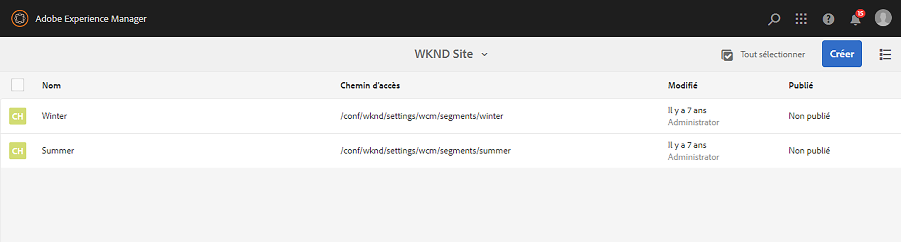

# Configuration de la segmentation avec ContextHub{#configuring-segmentation-with-contexthub}

>[!NOTE]
>
>Cette section décrit la configuration de la segmentation lors de l’utilisation du ContextHub. Si vous utilisez la fonctionnalité ClientContext, reportez-vous à la documentation appropriée pour la [configuration de la segmentation pour ClientContext](/help/sites-administering/campaign-segmentation.md).
>

La segmentation est un élément clé de la création d’une campagne. Voir [Gestion des audiences](/help/sites-authoring/managing-audiences.md) pour plus d’informations sur le fonctionnement de la segmentation et en connaître les termes clés.

En fonction des informations que vous avez déjà collectées sur les visiteurs et visiteuses de votre site et des objectifs que vous souhaitez atteindre, vous devez définir les segments et les stratégies requis pour votre contenu ciblé.

Ces segments sont ensuite utilisés pour fournir aux visiteurs et aux visiteuses du contenu spécifiquement ciblé. Ce contenu est conservé dans la section [Personnalisation](/help/sites-authoring/personalization.md) du site web. Les [activités](/help/sites-authoring/activitylib.md) définies ici peuvent être ajoutées à n’importe quelle page et définissent à quel segment de visiteurs le contenu spécialisé s’applique.

AEM vous permet de personnaliser facilement l’expérience de vos utilisateurs et utilisatrices. Il vous permet également de vérifier les résultats de vos définitions de segment.

## Accès aux segments {#accessing-segments}

La console [Audiences](/help/sites-authoring/managing-audiences.md) permet de gérer les segments pour ContextHub ou ClientContext, ainsi que les audiences de votre compte Adobe Target. Cette documentation couvre la gestion des segments pour ContextHub. Pour les [segments ClientContext](/help/sites-administering/campaign-segmentation.md) et les segments Adobe Target, consultez la documentation appropriée.

Pour accéder à vos segments, vous devez sélectionner votre configuration. Dans la navigation globale, sélectionnez **Navigation > Personnalisation > Audiences**. Les configurations disponibles s’affichent :


Sélectionnez votre configuration pour afficher les segments, par exemple le site WKND :



## Éditeur de segment {#segment-editor}

L&#39;**Éditeur de segment** vous permet de modifier facilement un segment : Pour modifier un segment, sélectionnez un segment dans la [liste de segments](/help/sites-administering/segmentation.md#accessing-segments) et cliquez sur le bouton **Modifier**.


Avec l’explorateur de composants, vous pouvez ajouter des conteneurs **ET** et **OU** pour définir la logique de segment, puis ajouter des composants supplémentaires pour comparer les propriétés et les valeurs ou référencer des scripts et d’autres segments afin de définir les critères de sélection (voir la rubrique [Création d’un nouveau segment](#creating-a-new-segment)) pour définir le scénario exact de sélection du segment.

Lorsque l’intégralité de l’instruction est vraie, alors le segment a été résolu. S’il existe plusieurs segments applicables, le facteur **Boost** est également utilisé. Consultez la section [Création d’un segment](#creating-a-new-segment) pour plus d’informations sur le [facteur Amplifier](/help/sites-administering/campaign-segmentation.md#boost-factor).

>[!CAUTION]
>
>L’éditeur de segment ne vérifie aucune référence circulaire. Par exemple, le segment A fait référence à un autre segment B, qui à son tour fait référence au segment A. Vous devez vous assurer que vos segments ne contiennent aucune référence circulaire.

### Conteneurs {#containers}

Les conteneurs suivants sont disponibles clé en main et vous permettent de regrouper des comparaisons et des références en vue de l’évaluation booléenne. Ils peuvent être déplacés de l’explorateur de composants vers l’éditeur. Voir la section suivante, [Utilisation de conteneurs ET et OU](/help/sites-administering/segmentation.md#using-and-and-or-containers) pour plus d’informations.

<table>
 <tbody>
  <tr>
   <td>Conteneur AND<br /> </td>
   <td>Opérateur ET booléen<br /> </td>
  </tr>
  <tr>
   <td>Conteneur OU<br /> </td>
   <td>Opérateur OU booléen</td>
  </tr>
 </tbody>
</table>

### Comparaisons {#comparisons}

Les comparaisons de segments suivantes sont disponibles par défaut pour évaluer les propriétés des segments. Ils peuvent être déplacés de l’explorateur de composants vers l’éditeur.

<table>
 <tbody>
  <tr>
   <td>Propriété-Valeur<br /> </td>
   <td>Compare une propriété d’une boutique à une valeur définie.<br /> </td>
  </tr>
  <tr>
   <td>Propriété-Propriété</td>
   <td>Compare une propriété d’une boutique à une autre propriété.<br /> </td>
  </tr>
  <tr>
   <td>Propriété-Référence de segment</td>
   <td>Compare une propriété d’une boutique à un autre segment référencé.<br /> </td>
  </tr>
  <tr>
   <td>Propriété-Référence de script</td>
   <td>Compare une propriété d’une boutique aux résultats d’un script<br /> </td>
  </tr>
  <tr>
   <td>Référence de segment-Référence de script</td>
   <td>Compare un segment référencé aux résultats d’un script<br /> </td>
  </tr>
 </tbody>
</table>

>[!NOTE]
>
>Lors de la comparaison des valeurs, si le type de données de la comparaison n’est pas défini (c’est-à-dire défini sur la détection automatique), le moteur de segmentation de ContextHub compare simplement les valeurs comme le ferait JavaScript. Il ne projette pas de valeurs sur leurs types inattendus, ce qui peut donner des résultats trompeurs. Par exemple :
>
>`null < 30 // will return true`
>
>Par conséquent, lors de la [création d’un segment](/help/sites-administering/segmentation.md#creating-a-new-segment), vous devez sélectionner un **type de données** chaque fois que les types de valeurs comparées sont connus. Par exemple :
>
>Lorsque vous comparez la propriété `profile/age`, vous savez déjà que le type comparé sera un **nombre**. Donc, même si la propriété `profile/age` n’est pas définie, une comparaison `profile/age` inférieure à 30 retournera **faux**, comme prévu.

### Références {#references}

Les références suivantes sont disponibles clé en main pour établir un lien direct à un script ou un segment différent. Ils peuvent être déplacés de l’explorateur de composants vers l’éditeur.

<table>
 <tbody>
  <tr>
   <td>Référence de segment<br /> </td>
   <td>Évalue le segment référencé.</td>
  </tr>
  <tr>
   <td>Référence de script</td>
   <td>Évalue le script référencé. Pour plus d’informations, voir la section suivante <a href="/help/sites-administering/segmentation.md#using-script-references">Utilisation de références de script</a>.</td>
  </tr>
 </tbody>
</table>

## Création d’un segment {#creating-a-new-segment}

Pour définir votre nouveau segment, procédez comme suit :

1. Après avoir [accédé aux segments](/help/sites-administering/segmentation.md#accessing-segments), [naviguez jusqu’au dossier](#organizing-segments) dans lequel vous souhaitez créer le segment.

1. Cliquez sur le bouton Créer et sélectionnez **Créer un segment ContextHub**.

   

1. Dans la section **Nouveau segment ContextHub**, saisissez un titre pour le segment et une valeur de boost si nécessaire, puis cliquez sur **Créer**.

   

   Chaque segment comporte un paramètre d’amplification utilisé comme facteur de pondération. Une valeur plus élevée indique que le segment sera sélectionné de préférence à un segment ayant une valeur plus basse dans les cas où plusieurs segments sont valides.

   * Valeur minimale : `0`
   * Valeur maximale : `1000000`

1. Faites glisser une comparaison ou une référence vers l’Éditeur de segments qui apparaîtra dans le conteneur ET par défaut.
1. Double-cliquez sur l’option de configuration de la nouvelle référence ou du nouveau segment pour modifier les paramètres spécifiques. Dans cet exemple, des personnes situées à San Jose font l’objet d’un test.

   

   Si possible, veillez à toujours définir un **type de données** pour vous assurer que vos comparaisons sont évaluées correctement. Voir [Comparaisons](/help/sites-administering/segmentation.md#comparisons) pour plus d’informations.

1. Cliquez sur **OK** pour enregistrer votre définition :
1. Ajoutez d’autres composants, en fonction de vos besoins. Vous pouvez formuler des expressions booléennes à l’aide des composants de conteneur pour des comparaisons ET et OU (voir la rubrique [Utilisation des conteneurs ET et OU](/help/sites-administering/segmentation.md#using-and-and-or-containers) ci-dessous). Avec l’Éditeur de segment, vous pouvez supprimer les composants qui ne sont plus nécessaires ou les faire glisser vers de nouveaux emplacements dans l’instruction.

### Utilisation des conteneurs ET et OU {#using-and-and-or-containers}

Avec les composants de conteneur ET et OU, vous pouvez créer des segments complexes dans AEM. Pour ce faire, il est utile de tenir compte de quelques points de base :

* Le niveau supérieur de la définition est toujours le conteneur AND initialement créé. Cela ne peut pas être modifié, mais n’a aucun effet sur le reste de la définition de votre segment.
* Assurez-vous que l’imbrication de votre conteneur a un sens. Les conteneurs peuvent être considérés comme des crochets de votre expression booléenne.

L’exemple suivant permet de sélectionner les visiteurs et les visiteuses qui sont considérés comme appartenant à notre groupe cible d’âge :

Des hommes et qui ont entre 30 et 59 ans

OU

Des femmes et qui ont entre 30 et 59 ans

Commencez par placer un composant de conteneur OU dans le conteneur ET par défaut. Dans le conteneur OU, ajoutez deux conteneurs ET puis, dans ces deux conteneurs, vous pouvez ajouter les composants de propriété ou de référence.


### Utilisation de références de script {#using-script-references}

À l’aide du composant Référence de script, l’évaluation d’une propriété de segment peut être déléguée à un script externe. Une fois le script correctement configuré, il peut être utilisé comme tout autre composant d’une condition de segment.

#### Définition d’une référence de script {#defining-a-script-to-reference}

1. Ajoutez le fichier `contexthub.segment-engine.scripts` à la propriété clientlib.
1. Implémentez une fonction qui renvoie une valeur. Par exemple :

   ```
   ContextHub.console.log(ContextHub.Shared.timestamp(), '[loading] contexthub.segment-engine.scripts - script.profile-info.js');
   
   (function() {
       'use strict';
   
       /**
        * Sample script returning profile information. Returns user info if data is available, false otherwise.
        *
        * @returns {Boolean}
        */
       var getProfileInfo = function() {
           /* let the SegmentEngine know when script should be re-run */
           this.dependOn(ContextHub.SegmentEngine.Property('profile/age'));
           this.dependOn(ContextHub.SegmentEngine.Property('profile/givenName'));
   
           /* variables */
           var name = ContextHub.get('profile/givenName');
           var age = ContextHub.get('profile/age');
   
           return name === 'Joe' && age === 123;
       };
   
       /* register function */
       ContextHub.SegmentEngine.ScriptManager.register('getProfileInfo', getProfileInfo);
   
   })();
   ```

1. Enregistrez le script avec `ContextHub.SegmentEngine.ScriptManager.register`.

Si le script dépend de propriétés supplémentaires, il doit appeler `this.dependOn()`. Par exemple, si le script dépend de `profile/age` :

```
this.dependOn(ContextHub.SegmentEngine.Property('profile/age'));
```

#### Référencement d’un script {#referencing-a-script}

1. Créer un segment ContextHub.
1. Ajouter le composant **Référence de script** à l’emplacement souhaité du segment.
1. Ouvrez la boîte de dialogue de modification du composant **Référence de script**. S’il est [correctement configuré](/help/sites-administering/segmentation.md#defining-a-script-to-reference), le script doit être disponible dans le menu déroulant **Nom du script**.

## Organisation des segments {#organizing-segments}

Si vous disposez de plusieurs segments, ils peuvent devenir difficiles à gérer sous la forme d’une liste brute. Dans ce cas, il peut s’avérer utile de créer des dossiers pour gérer ces segments.

### Créer un dossier {#create-folder}

1. Après [avoir accédé aux segments](#accessing-segments), cliquez sur le bouton **Créer** et sélectionnez **Dossier**.

   

1. Indiquez un **titre** et un **nom** pour votre dossier.
   * Le **titre** doit être descriptif.
   * Le **Nom** devient le nom du nœud dans le référentiel.
      * Il sera généré automatiquement en fonction du titre et adapté selon les [conventions d’appellation AEM.](/help/sites-developing/naming-conventions.md)
      * Il peut être adapté si nécessaire.

   

1. Cliquez sur **Créer**.

   

1. Le dossier s’affiche dans la liste des segments.
   * La manière dont vous triez vos colonnes aura une incidence sur l’emplacement d’affichage du nouveau dossier dans la liste.
   * Vous pouvez cliquer sur les en-têtes de colonne pour ajuster votre tri.
     

### Modifier les dossiers existants {#modify-folders}

1. Après [avoir accédé aux segments](#accessing-segments), cliquez sur le dossier à modifier pour le sélectionner.

   

1. Cliquez sur **Renommer** dans la barre d’outils pour renommer le dossier.

1. Saisissez un nouveau **Titre du dossier** et cliquez sur **Enregistrer**.

   

>[!NOTE]
>
>Lorsque vous renommez des dossiers, seul le titre peut être modifié. Le nom ne peut pas être modifié.

### Supprimer un dossier

1. Après [avoir accédé aux segments](#accessing-segments), cliquez sur le dossier à modifier pour le sélectionner.

   

1. Cliquez sur **Supprimer** dans la barre d’outils pour supprimer le dossier.

1. Une boîte de dialogue présente une liste de dossiers sélectionnés pour suppression.

   

   * Cliquez sur **Supprimer** pour confirmer.
   * Cliquez sur **Annuler** pour abandonner.

1. Si l’un des dossiers sélectionnés contient des sous-dossiers ou des segments, leur suppression doit être confirmée.

   

   * Cliquez sur **Forcer la suppression** pour confirmer.
   * Cliquez sur **Annuler** pour abandonner.

>[!NOTE]
>
>Il est impossible de déplacer un segment d’un dossier à un autre.

## Test de l’application d’un segment {#testing-the-application-of-a-segment}

Une fois le segment défini, les résultats potentiels peuvent être testés avec **[ContextHub](/help/sites-authoring/ch-previewing.md).**

1. Affichez l’aperçu d’une page.
1. Cliquez sur l’icône ContextHub pour afficher la barre d’outils ContextHub.
1. Sélectionnez une personne qui correspond au segment que vous avez créé.
1. ContextHub résout les segments applicables pour la persona sélectionnée.

Par exemple, notre définition de segment simple pour identifier les utilisateurs dans notre classe d’âges principale est une définition de segment simple basée sur l’âge et le sexe de l’utilisateur. Le chargement d’une personne spécifique correspondant à ces critères indique si ce segment a été résolu avec succès :


Ou s’il n’est pas résolu :


>[!NOTE]
>
>Toutes les caractéristiques sont résolues immédiatement, bien que la plupart ne soient modifiées qu’au rechargement de la page.

Des tests comme celui-ci peuvent également être effectués sur les pages de contenu et en combinaison avec du contenu ciblé et des **Activités** et **Expériences** connexes.

Si vous avez configuré une activité et une expérience à l’aide du segment de classe d’âges principale ci-dessus, vous pouvez facilement tester votre segment avec l’activité. Pour plus d’informations sur la configuration d’une activité, consultez la [documentation sur la création de contenu ciblé](/help/sites-authoring/content-targeting-touch.md).

1. En mode de modification d’une page sur laquelle vous avez configuré du contenu ciblé, vous pouvez constater que le contenu est ciblé par le biais d’une icône de flèche sur le contenu.

   

1. Basculez vers le mode Aperçu et, avec ContextHub, passez à une personne qui ne correspond pas à la segmentation configurée pour l’expérience.

   

1. Passez à une personne qui correspond à la segmentation configurée pour l’expérience et constatez que l’expérience change en conséquence.

   

## Utilisation de votre segment {#using-your-segment}

Les segments sont utilisés afin d’orienter le contenu réel affiché pour une audience cible spécifique. Consultez la section [Gestion des audiences](/help/sites-authoring/managing-audiences.md) pour plus d’informations sur les audiences et les segments et [Création de contenu ciblé](/help/sites-authoring/content-targeting-touch.md) pour plus d’informations sur l’utilisation des audiences et des segments afin de cibler du contenu.
