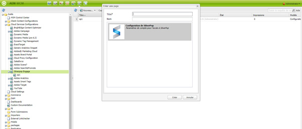
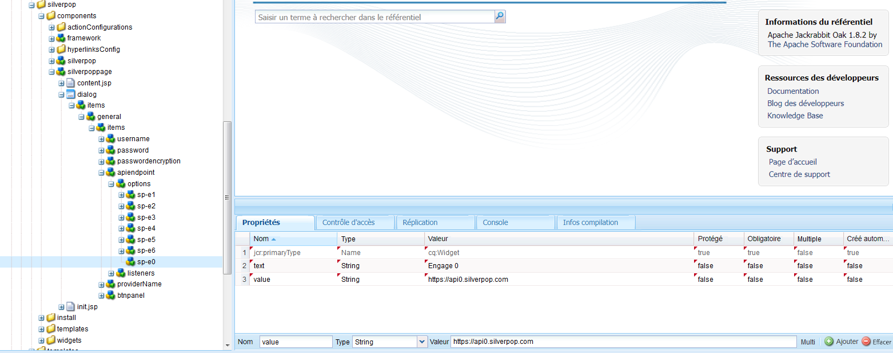
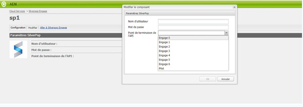

# Intégrer à Silverpop Engage{#integrating-with-silverpop-engage}

<!-- THIS ENTIRE TOPIC APPEARS OBSOLETE BECAUSE SILVERPOP NO LONGER EXISTS AND THERE ARE NO REDIRECTS FOR THE DOWNLOAD URL BELOW THAT IS 404.
>[!NOTE]
>
>Silverpop integration is **not** available out of the box. You must download the Silverpop integration package `https://www.adobeaemcloud.com/content/marketplace/marketplaceProxy.html?packagePath=/content/companies/public/adobe/packages/aem620/product/cq-mcm-integrations-silverpop-content` from Package Share and install it on your instance. After you have installed the package, you can configure it as described in this document. -->

L’intégration d’AEM à Silverpop Engage permet de gérer et d’envoyer des e-mails créés dans AEM via Silverpop. Elle vous permet également d’utiliser les fonctions de gestion de pistes de Silverpop via des formulaires AEM sur les pages AEM.

L’intégration offre les fonctionnalités suivantes :

* La possibilité de créer des e-mails dans AEM et de les publier dans Silverpop pour distribution.
* La possibilité de définir l’action d’un formulaire d’AEM pour créer un abonné ou une abonnée Silverpop.

Une fois Silverpop Engage configuré, vous pouvez publier des newsletters ou des e-mails sur Silverpop Engage.

## Création d’une configuration Silverpop {#creating-a-silverpop-configuration}

Les configurations Silverpop peuvent être ajoutées au moyen de **Cloud Services**, des **Outils** ou des **points d’entrée d’API**. Toutes les méthodes sont décrites dans cette section.

### Configuration de Silverpop au moyen de Cloud Services {#configuring-silverpop-via-cloudservices}

Pour créer une configuration Dynamic Media dans Cloud Services :

1. Dans AEM, appuyez ou cliquez sur **Outils** > **Déploiement** > **Services cloud**. (Ou accédez directement à `https://<hostname>:<port>/etc/cloudservices.html`).
1. Sous les services tiers, cliquez sur **Silverpop Engage** et ensuite sur **Configurer**. La fenêtre de configuration Silverpop s’ouvre.

   >[!NOTE]
   >
   >Silverpop Engage n’est pas disponible en tant qu’option sous les services tiers, sauf si vous téléchargez le package à partir du partage de packages.

1. Ajoutez un titre et, éventuellement, un nom, puis cliquez sur **Créer**. La fenêtre de configuration des **Paramètres de Silverpop** s’ouvre.
1. Saisissez le nom d’utilisateur et le mot de passe, puis sélectionnez un point d’entrée d’API dans la liste déroulante.
1. Cliquez sur **Connecter à Silverpop.** Une fois la connexion établie, vous voyez une boîte de dialogue de confirmation. Cliquez sur **OK** pour fermer la fenêtre. Vous pouvez accéder à Silverpop en cliquant sur **Accéder à Silverpop Engage**.
1. Silverpop a été configuré. Si vous souhaitez modifier la configuration, cliquez sur **Modifier**.
1. En outre, le framework de Silverpop Engage peut être configuré pour les actions personnalisées lorsque vous fournissez un titre et un nom (facultatif). Cliquez sur Créer pour créer le framework de la connexion Silverpop déjà configurée.

   Les colonnes d’extension de données importées peuvent être utilisées ultérieurement par le composant d’AEM **Texte et personnalisation**.

### Configuration de Silverpop via Outils {#configuring-silverpop-via-tools}

Pour créer une configuration Silverpop dans Outils :

1. Dans AEM, appuyez ou cliquez sur **Outils** > **Déploiement** > **Services cloud**. Ou accédez-y directement sur `https://<hostname>:<port>/misadmin#/etc`.
1. Sélectionnez **Outils**, puis **Configuration des services cloud** et ensuite **Silverpop Engage**.
1. Cliquez sur **Nouveau**.

   

1. Dans la fenêtre **Créer une page**, saisissez le **titre** et éventuellement le **nom**, puis cliquez sur **Créer**.
1. Saisissez les informations de configuration conformément à l’étape 4 de la procédure précédente. Suivez cette procédure pour terminer la configuration de Silverpop.

### Ajouter plusieurs configurations {#adding-multiple-configurations}

Pour ajouter plusieurs configurations :

1. Sur la page de bienvenue, cliquez sur **Services cloud** et cliquez sur **Silverpop Engage**. Cliquez sur le bouton **Afficher les configurations** qui s’affiche si une ou plusieurs configurations de Silverpop sont disponibles. Toutes les configurations disponibles sont répertoriées.
1. Cliquez sur le lien **+** en regard de Configurations disponibles. Cette action ouvre la fenêtre **Créer des configurations**. Suivez la procédure de configuration précédente pour créer une configuration.

### Configurer les points d’entrée d’API pour la connexion à Silverpop {#configuring-api-end-points-for-connecting-to-silverpop}

Actuellement, AEM comporte six points d’entrée non sécurisés (Engage 1 à 6). Silverpop fournit désormais deux nouveaux points d’entrée et des points d’entrée de connexion modifiés pour les points existants.

Pour configurer les points d’entrée d’API :

1. Accédez à `/libs/mcm/silverpop/components/silverpoppage/dialog/items/general/items/apiendpoint/options node` sur `https://<hostname>:<port>/crxde.`.
1. Cliquez avec le bouton droit et sélectionnez **Créer**, puis **Créer un nœud**.
1. Pour le **Nom**, saisissez `sp-e0`, et pour le **Type**, choisissez `cq:Widget`.
1. Ajoutez deux propriétés au nœud que vous venez de créer :

   1. **Nom** : `text`, **Type** : `String`, **Valeur** : `Engage 0`
   1. **Nom** : `value`, **Type** : `String`, **Valeur** : `https://api0.silverpop.com`

   

   Cliquez sur « Enregistrer tout ».

1. Créez un autre nœud en saisissant pour le **nom** : `sp-e7`, et pour le **type** : `cq:Widget`.

   Ajoutez deux propriétés au nœud que vous venez de créer :

   1. **Nom** : `text`, **Type** : `String`, **Valeur** : `Pilot`
   1. **Nom** : `value`, **Type** : `String`, **Valeur** : `https://apipilot.silverpop.com/XMLAPI`

1. Pour modifier les points d’entrée d’API existants (Engage 1 à 6), cliquez sur chacun d’entre eux un par un et remplacez les valeurs comme suit :

   | **Nom du nœud** | **Valeur du point d’entrée existant** | **Nouvelle valeur de point d’entrée** |
   |---|---|---|
   | sp-e1 | `https://api.engage1.silverpop.com/XMLAPI` | `https://api1.silverpop.com` |
   | sp-e2 | `https://api.engage2.silverpop.com/XMLAPI` | `https://api2.silverpop.com` |
   | sp-e3 | `https://api.engage3.silverpop.com/XMLAPI` | `https://api3.silverpop.com` |
   | sp-e4 | `https://api.engage4.silverpop.com/XMLAPI` | `https://api4.silverpop.com` |
   | sp-e5 | `https://api.engage5.silverpop.com/XMLAPI` | `https://api5.silverpop.com` |
   | sp-e6 | `https://api.pilot.silverpop.com/XMLAPI` | `https://api6.silverpop.com` |

1. Cliquez sur **Enregistrer tout**. AEM est maintenant prêt à se connecter à Silverpop via des points d’entrée sécurisés.

   
