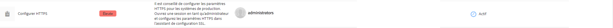
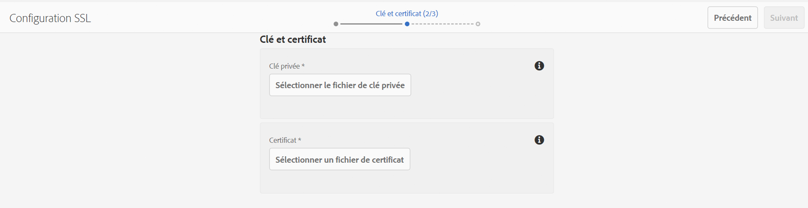
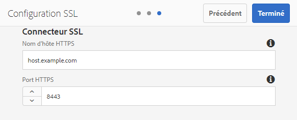

# SSL par défaut{#ssl-by-default}

Afin d&#39;améliorer en permanence la sécurité de l&#39;AEM, l&#39;Adobe a introduit une fonctionnalité appelée SSL By Default (SSL par défaut). L’objectif est d’inciter à utiliser le protocole HTTPS pour se connecter aux instances AEM.

## Activation de SSL par défaut {#enabling-ssl-by-default}

Vous pouvez commencer à configurer la fonctionnalité SSL par défaut en cliquant sur le message correspondant dans la boîte de réception de l’écran d’accueil d’AEM. Pour accéder à la boîte de réception, appuyez sur l’icône de cloche dans le coin supérieur droit de l’écran. Ensuite, cliquez sur **Afficher tout**. Une liste ordonnée de toutes les alertes s’affiche.

Dans la liste, sélectionnez et ouvrez l’alerte **Configurer HTTPS** :



>[!NOTE]
>
>If the **Configure HTTPS** alert is not present in the Inbox, you can navigate directly to the HTTPS Wizard by going to *<http://serveraddress:serverport/libs/granite/security/content/sslConfig.html?item=configuration%2fconfiguressl&_charset_=utf-8>*

Un utilisateur du service appelé « **ssl-service** » a été créé pour cette fonctionnalité. Une fois que vous avez ouvert l&#39;alerte, vous serez guidé dans l&#39;assistant de configuration suivant :

1. Tout d’abord, configurez les informations d’identification du magasin. These are the credentials for the **ssl-service** system user&#39;s key store that will contain the private key and trust store for the HTTPS listener.

   

1. Une fois que vous avez saisi les informations d’identification, cliquez sur **Suivant** dans le coin supérieur droit de la page. Ensuite, chargez la clé privée et le certificat associés pour la connexion SSL.

   

   >[!NOTE]
   >
   >Pour plus d’informations sur la génération d’une clé privée et d’un certificat à utiliser avec l’assistant, voir [la procédure](/help/sites-administering/ssl-by-default.md#generating-a-private-key-certificate-pair-to-use-with-the-wizard) ci-dessous.

1. Enfin, indiquez le nom d’hôte HTTPS et le port TCP pour le programme d’écoute HTTPS.

   

## Automatisation de la fonctionnalité SSL par défaut {#automating-ssl-by-default}

La fonctionnalité SSL par défaut peut être automatisée de trois façons.

### Méthode HTTP POST {#via-http-post}

La première méthode implique d’utiliser la méthode POST sur le serveur SSLSetup utilisé par l’assistant de configuration :

```shell
POST /libs/granite/security/post/sslSetup.html
```

Vous pouvez utiliser le contenu ci-dessous dans la méthode POST pour automatiser la configuration :

```xml
------WebKitFormBoundaryyBO4ArmGlcfdGDbs
Content-Disposition: form-data; name="keystorePassword"

test
------WebKitFormBoundaryyBO4ArmGlcfdGDbs
Content-Disposition: form-data; name="keystorePasswordConfirm"
test
------WebKitFormBoundaryyBO4ArmGlcfdGDbs
Content-Disposition: form-data; name="truststorePassword"
test
------WebKitFormBoundaryyBO4ArmGlcfdGDbs
Content-Disposition: form-data; name="truststorePasswordConfirm"
test
------WebKitFormBoundaryyBO4ArmGlcfdGDbs
Content-Disposition: form-data; name="privatekeyFile"; filename="server.der"
Content-Type: application/x-x509-ca-cert

------WebKitFormBoundaryyBO4ArmGlcfdGDbs
Content-Disposition: form-data; name="certificateFile"; filename="server.crt"
Content-Type: application/x-x509-ca-cert

------WebKitFormBoundaryyBO4ArmGlcfdGDbs
Content-Disposition: form-data; name="httpsPort"
8443
```

Le servlet, comme tout servlet POST Sling, répond avec un code de statut 200 OK ou Erreur HTTP. Vous trouverez plus d’informations sur le statut dans le corps HTML de la réponse.

Voici des exemples de réponse en cas d’opération réussie et en cas d’erreur.

**EXEMPLE** DE RÉUSSITE (état = 200) :

```xml
<!DOCTYPE html>
<html lang='en'>
<head>
<title>OK</title>
</head>
<body>
<h1>OK</h1>
<dl>
<dt class='foundation-form-response-status-code'>Status</dt>
<dd>200</dd>
<dt class='foundation-form-response-status-message'>Message</dt>
<dd>SSL successfully configured</dd>
<dt class='foundation-form-response-title'>Title</dt>
<dd>OK</dd>
<dt class='foundation-form-response-description'>Description</dt>
<dd>HTTPS has been configured on port 8443. The private key and
certificate were stored in the key store of the user ssl-service.
Please take note of the key store password you provided. You will need
it for any subsequent updating of the private key or certificate.</dd>
</dl>
<h2>Links</h2>
<ul class='foundation-form-response-links'>
<li><a class='foundation-form-response-redirect' href='/'>Done</a></li>
</ul>
</body>
</html>
```

**EXEMPLE** D’ERREUR (état = 500) :

```xml
<!DOCTYPE html>
<html lang='en'>
<head>
<title>Error</title>
</head>
<body>
<h1>Error</h1>
<dl>
<dt class='foundation-form-response-status-code'>Status</dt>
<dd>500</dd>
<dt class='foundation-form-response-status-message'>Message</dt>
<dd>The provided file is not a valid key, DER format expected</dd>
<dt class='foundation-form-response-title'>Title</dt>
<dd>Error</dd>
</dl>
</body>
</html>
```

### Méthode du module {#via-package}

Vous pouvez également automatiser la configuration SSL en chargeant un module contenant déjà ces éléments obligatoires :

* KeyStore de l’utilisateur ssl-service. Ce fichier se trouve sous */home/users/system/security/ssl-service/keystore* dans le référentiel.
* La `GraniteSslConnectorFactory` configuration

### Génération d’une paire clé privée/certificat à utiliser avec l’assistant {#generating-a-private-key-certificate-pair-to-use-with-the-wizard}

Vous trouverez ci-dessous un exemple de création de certificat autosigné au format DER utilisé par l’assistant SSL.

>[!NOTE]
>
>L’utilisation d’un certificat autosigné est mentionnée à titre d’exemple uniquement et ne doit pas être utilisée en production.

1. Tout d’abord, créez la clé privée :

   ```shell
   openssl genrsa -aes256 -out localhostprivate.key 4096
   openssl rsa -in localhostprivate.key -out localhostprivate.key
   ```

1. Ensuite, générez une demande de signature de certificat (CSR) à l’aide d’une clé privée :

   ```shell
   openssl req -sha256 -new -key localhostprivate.key -out localhost.csr -subj '/CN=localhost'
   ```

1. Générez le certificat SSL et signez-le avec la clé privée. Dans cet exemple, le certificat expire dans un délai d’un an :

   ```shell
   openssl x509 -req -days 365 -in localhost.csr -signkey localhostprivate.key -out localhost.crt
   ```

Convertissez la clé privée au format DER. La clé doit être au format DER pour l’assistant SSL :

```shell
openssl pkcs8 -topk8 -inform PEM -outform DER -in localhostprivate.key -out localhostprivate.der -nocrypt
```

Enfin, chargez la clé privée **localhostprivate.der** et le certificat SSL **localhost.crt** lors de l’étape 2 de l’assistant graphique SSL décrite au début de cette page.

### Mise à jour de la configuration SSL à l’aide de cURL {#updating-the-ssl-configuration-via-curl}

>[!NOTE]
>
>See [Using cURL with AEM](https://helpx.adobe.com/experience-manager/6-4/sites/administering/using/curl.html) for a centralized list of useful cURL commands in AEM.

Vous pouvez également automatiser la configuration SSL à l’aide de l’outil cURL. À cet effet, publiez les paramètres de configuration à cette adresse URL :

*https://&lt;adresse du serveur>:&lt;port du serveur>/libs/granite/security/post/sslSetup.html*

Voici les paramètres que vous pouvez utiliser pour modifier les différents paramètres de l’assistant de configuration :

* `-F "keystorePassword=password"` - le mot de passe du fichier de stockage des clés ;

* `-F "keystorePasswordConfirm=password"` - confirmer le mot de passe du fichier de stockage des clés ;

* `-F "truststorePassword=password"` - le mot de passe Trust Store ;

* `-F "truststorePasswordConfirm=password"` - confirmer le mot de passe truststore ;

* `-F "privatekeyFile=@localhostprivate.der"` - spécifier la clé privée ;

* `-F "certificateFile=@localhost.crt"` - préciser le certificat ;

* `-F "httpsHostname=host.example.com"`- indiquer le nom d&#39;hôte ;
* `-F "httpsPort=8443"` - port sur lequel l&#39;écouteur HTTPS fonctionne.

>[!NOTE]
>
>Pour exécuter cURL afin d’automatiser la configuration SSL, le plus rapide est de partir du dossier dans lequel se trouvent les fichiers DER et CRT. Vous pouvez également spécifier le chemin d’accès dans les arguments `privatekeyFile` et certificatFile.
>
>You also need to be authenticated in order to perform the update, so make sure you append the cURL command with the `-u user:passeword` parameter.
>
>Une commande POST cURL appropriée doit se présenter comme suit :

```shell
curl -u user:password -F "keystorePassword=password" -F "keystorePasswordConfirm=password" -F "truststorePassword=password" -F "truststorePasswordConfirm=password" -F "privatekeyFile=@localhostprivate.der" -F "certificateFile=@localhost.crt" -F "httpsHostname=host.example.com" -F "httpsPort=8443" https://host:port/libs/granite/security/post/sslSetup.html
```

#### Certificats multiples à l’aide de cURL {#multiple-certificates-using-curl}

Vous pouvez envoyer au servlet une série de certificats en répétant le paramètre certificateFile comme suit :

`-F "certificateFile=@root.crt" -F "certificateFile=@localhost.crt"..`

Une fois la commande exécutée, vérifiez que tous les certificats ont été ajoutés au KeyStore. Vérifiez le KeyStore sur :[ http://localhost:4502/libs/granite/security/content/userEditor.html/home/users/system/security/ssl-service](http://localhost:4502/libs/granite/security/content/userEditor.html/home/users/system/security/ssl-service)
