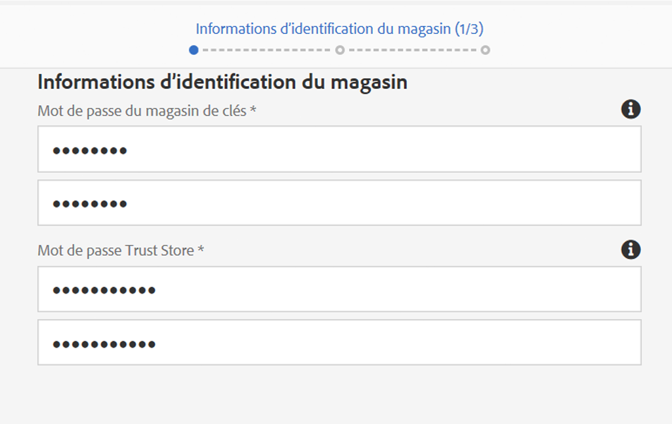

# SSL/TLS par défaut{#ssl-tls-by-default}

Dans un effort d’améliorer continuellement la sécurité d’AEM, Adobe a introduit la fonctionnalité SSL par défaut. L’objectif est d’encourager l’utilisation de HTTPS pour se connecter aux instances AEM.

## Activation de SSL/TLS par défaut {#enabling-ssl-tls-by-default}

Vous pouvez commencer à configurer SSL/TLS par défaut en cliquant sur le message de boîte de réception approprié depuis votre écran d’accueil AEM. Pour accéder à la boîte de réception, appuyez sur l’icône de cloche dans le coin supérieur droit de l’écran. Ensuite, cliquez sur **Afficher tout**. Cette action affiche la liste de toutes les alertes classées en mode Liste.

Dans la liste, sélectionnez et ouvrez le **Configurer HTTPS** alert:


>[!NOTE]
>
>Si l’alerte **Configurer le HTTPS** ne s’affiche pas dans la boîte de réception, vous pouvez accéder directement à l’assistant HTTPS en suivant ce lien : *<http://serveraddress:serverport/libs/granite/security/content/sslConfig.html?item=configuration%2fconfiguressl&_charset_=utf-8>*

Un utilisateur du service appelé « **ssl-service** » a été créé pour cette fonctionnalité. Une fois que vous avez ouvert l’alerte, vous êtes guidé dans les étapes de l’assistant de configuration suivantes :

1. Tout d’abord, configurez les informations d’identification de la boutique. Ce sont les informations d’identification pour le KeyStore de l’utilisateur système **ssl-service**, qui contient le Keystore privé et le TrustStore du listener HTTPS.

   

1. Une fois que vous avez saisi les informations d’identification, cliquez sur **Suivant** dans le coin supérieur droit de la page. Ensuite, chargez la clé privée et le certificat associés pour la connexion SSL.

   

   >[!NOTE]
   >
   >Pour plus d’informations sur la génération d’une clé privée et d’un certificat à utiliser avec l’assistant, consultez [la procédure](/help/sites-administering/ssl-by-default.md#generating-a-private-key-certificate-pair-to-use-with-the-wizard) ci-dessous.

1. Enfin, indiquez le nom d’hôte HTTPS et le port TCP pour le programme d’écoute HTTPS.

   

## Automatisation SSL/TLS par défaut {#automating-ssl-tls-by-default}

Il existe trois manières d’automatiser SSL/TLS par défaut.

### Via le POST HTTP {#via-http-post}

La première méthode consiste à publier sur le serveur SSLSetup utilisé par l’assistant de configuration :

```shell
POST /libs/granite/security/post/sslSetup.html
```

Vous pouvez utiliser la payload suivante dans votre POST pour automatiser la configuration :

```xml
------WebKitFormBoundaryyBO4ArmGlcfdGDbs
Content-Disposition: form-data; name="keystorePassword"

test
------WebKitFormBoundaryyBO4ArmGlcfdGDbs
Content-Disposition: form-data; name="keystorePasswordConfirm"
test
------WebKitFormBoundaryyBO4ArmGlcfdGDbs
Content-Disposition: form-data; name="truststorePassword"
test
------WebKitFormBoundaryyBO4ArmGlcfdGDbs
Content-Disposition: form-data; name="truststorePasswordConfirm"
test
------WebKitFormBoundaryyBO4ArmGlcfdGDbs
Content-Disposition: form-data; name="privatekeyFile"; filename="server.der"
Content-Type: application/x-x509-ca-cert

------WebKitFormBoundaryyBO4ArmGlcfdGDbs
Content-Disposition: form-data; name="certificateFile"; filename="server.crt"
Content-Type: application/x-x509-ca-cert

------WebKitFormBoundaryyBO4ArmGlcfdGDbs
Content-Disposition: form-data; name="httpsPort"
8443
```

Le servlet, comme tout servlet POST Sling, répond avec un code de statut 200 OK ou Erreur HTTP. Vous trouverez des détails sur l’état dans le corps du HTML de la réponse.

Vous trouverez ci-dessous des exemples de réponse réussie et d’erreur.

**EXEMPLE D’OPÉRATION RÉUSSIE** (statut = 200) :

```xml
<!DOCTYPE html>
<html lang='en'>
<head>
<title>OK</title>
</head>
<body>
<h1>OK</h1>
<dl>
<dt class='foundation-form-response-status-code'>Status</dt>
<dd>200</dd>
<dt class='foundation-form-response-status-message'>Message</dt>
<dd>SSL successfully configured</dd>
<dt class='foundation-form-response-title'>Title</dt>
<dd>OK</dd>
<dt class='foundation-form-response-description'>Description</dt>
<dd>HTTPS has been configured on port 8443. The private key and
certificate were stored in the key store of the user ssl-service.
Please take note of the key store password you provided. You will need
it for any subsequent updating of the private key or certificate.</dd>
</dl>
<h2>Links</h2>
<ul class='foundation-form-response-links'>
<li><a class='foundation-form-response-redirect' href='/'>Done</a></li>
</ul>
</body>
</html>
```

**EXEMPLE D’ERREUR** (statut = 500) :

```xml
<!DOCTYPE html>
<html lang='en'>
<head>
<title>Error</title>
</head>
<body>
<h1>Error</h1>
<dl>
<dt class='foundation-form-response-status-code'>Status</dt>
<dd>500</dd>
<dt class='foundation-form-response-status-message'>Message</dt>
<dd>The provided file is not a valid key, DER format expected</dd>
<dt class='foundation-form-response-title'>Title</dt>
<dd>Error</dd>
</dl>
</body>
</html>
```

### Via un module {#via-package}

Vous pouvez également automatiser la configuration SSL en chargeant un package qui contient déjà les éléments requis suivants :

* KeyStore de l’utilisateur ssl-service. Celui-ci se trouve sous */home/users/system/security/ssl-service/keystore* dans le référentiel.
* La configuration `GraniteSslConnectorFactory`

### Génération d’une paire clé privée/certificat à utiliser avec l’assistant {#generating-a-private-key-certificate-pair-to-use-with-the-wizard}

Vous trouverez ci-dessous un exemple de création d’un certificat auto-signé au format DER que l’assistant SSL/TLS peut utiliser. Installez OpenSSL en fonction de votre système d’exploitation, ouvrez l’invite de commande OpenSSL et remplacez le répertoire par le dossier dans lequel vous souhaitez générer la clé privée et le certificat.

>[!NOTE]
>
>L’utilisation d’un certificat autosigné est mentionnée à titre d’exemple uniquement et ne doit pas être utilisée en exploitation.

1. Créez tout d’abord la clé privée :

   ```shell
   openssl genrsa -aes256 -out localhostprivate.key 4096
   openssl rsa -in localhostprivate.key -out localhostprivate.key
   ```

1. Ensuite, générez une demande de signature de certificat à l’aide d’une clé privée :

   ```shell
   openssl req -sha256 -new -key localhostprivate.key -out localhost.csr -subj "/CN=localhost"
   ```

1. Générez le certificat SSL et signez-le avec la clé privée. Dans cet exemple, expire dans un an :

   ```shell
   openssl x509 -req -days 365 -in localhost.csr -signkey localhostprivate.key -out localhost.crt
   ```

Convertissez la clé privée au format DER. En effet, l’assistant SSL requiert que la clé soit au format DER :

```shell
openssl pkcs8 -topk8 -inform PEM -outform DER -in localhostprivate.key -out localhostprivate.der -nocrypt
```

Enfin, téléchargez le fichier **localhostprivate.der** comme clé privée et **localhost.crt** comme certificat SSL/TLS à l’étape 2 de l’assistant graphique SSL/TLS décrit au début de cette page.

### Mise à jour de la configuration SSL/TLS via cURL {#updating-the-ssl-tls-configuration-via-curl}

>[!NOTE]
>
>Consultez la section [Utilisation de cURL avec AEM](https://helpx.adobe.com/fr/experience-manager/6-4/sites/administering/using/curl.html) pour obtenir une liste centralisée des commandes cURL utiles dans AEM.

Vous pouvez également automatiser la configuration SSL/TLS à l’aide de l’outil cURL. Pour ce faire, publiez les paramètres de configuration sur cette URL :

*https://&lt;serveraddress>:&lt;serverport>/libs/granite/security/post/sslSetup.html*

Voici les paramètres que vous pouvez utiliser pour modifier les différents paramètres de l’assistant de configuration :

* `-F "keystorePassword=password"` - Le mot de passe du KeyStore ;

* `-F "keystorePasswordConfirm=password"` - Confirmez le mot de passe du KeyStore :

* `-F "truststorePassword=password"` - Le mot de passe du TrustStore ;

* `-F "truststorePasswordConfirm=password"` - Confirmez le mot de passe du TrustStore ;

* `-F "privatekeyFile=@localhostprivate.der"` - Spécifiez la clé privée ;

* `-F "certificateFile=@localhost.crt"` - Spécifiez le certificat ;

* `-F "httpsHostname=host.example.com"` - Indiquez le nom d’hôte ;
* `-F "httpsPort=8443"` : port utilisé par le programme d’écoute HTTPS.

>[!NOTE]
>
>Le moyen le plus rapide d’exécuter cURL pour automatiser la configuration SSL/TLS est d’utiliser le dossier où se trouvent les fichiers DER et CRT. Vous pouvez également spécifier le chemin d’accès dans les arguments `privatekeyFile` et certificateFile.
>
>Vous devez également être authentifié pour effectuer la mise à jour. Veillez donc à ajouter la commande cURL avec le paramètre `-u user:passeword`
>
>Une commande POST cURL appropriée doit se présenter comme suit :

```shell
curl -u user:password -F "keystorePassword=password" -F "keystorePasswordConfirm=password" -F "truststorePassword=password" -F "truststorePasswordConfirm=password" -F "privatekeyFile=@localhostprivate.der" -F "certificateFile=@localhost.crt" -F "httpsHostname=host.example.com" -F "httpsPort=8443" https://host:port/libs/granite/security/post/sslSetup.html
```

#### Plusieurs certificats utilisant cURL {#multiple-certificates-using-curl}

Vous pouvez envoyer au servlet une chaîne de certificats en répétant le paramètre certificateFile comme suit :

`-F "certificateFile=@root.crt" -F "certificateFile=@localhost.crt"..`

Une fois la commande exécutée, vérifiez que tous les certificats ont été ajoutés au KeyStore. Vérifiez le KeyStore sur :
[http://localhost:4502/libs/granite/security/content/userEditor.html/home/users/system/security/ssl-service](http://localhost:4502/libs/granite/security/content/userEditor.html/home/users/system/security/ssl-service).

### Activation d’une connexion TLS 1.3 {#enabling-tls-connection}

1. Accédez à la console web
1. Ensuite, accédez à **OSGi** - **Configuration** - **Adobe Granite SSL Connector Factory**
1. Accédez au **Suites de chiffrement incluses** et ajoutez les entrées suivantes. Vous pouvez confirmer chaque ajout en appuyant sur le bouton &quot;**+**&quot; à gauche du champ, après les avoir ajoutés :

   * `TLS_AES_256_GCM_SHA384`
   * `TLS_AES_128_GCM_SHA256`
   * `TLS_CHACHA20_POLY1305_SHA256`
   * `TLS_AES_128_CCM_SHA256`
   * `TLS_AES_128_CCM_8_SHA256`