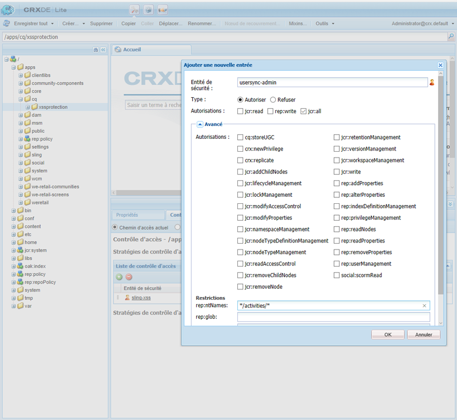
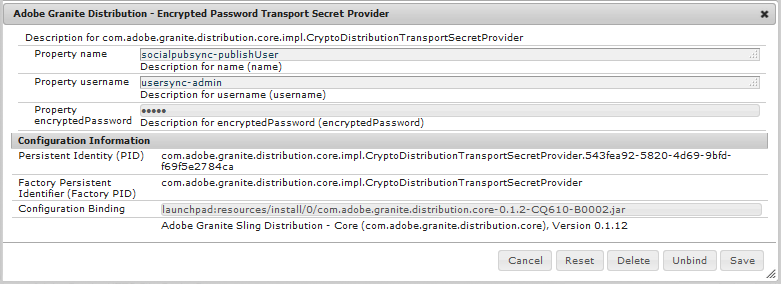
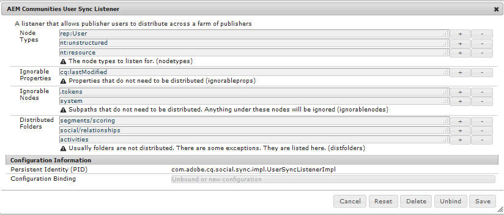
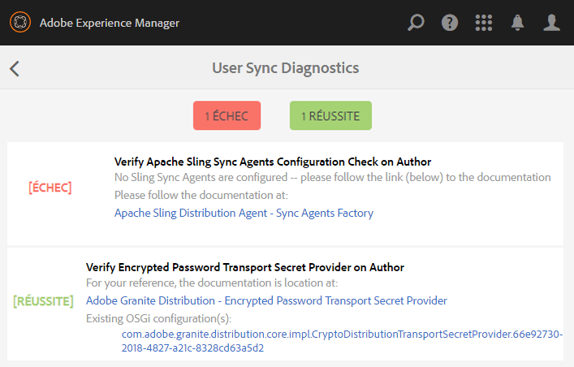
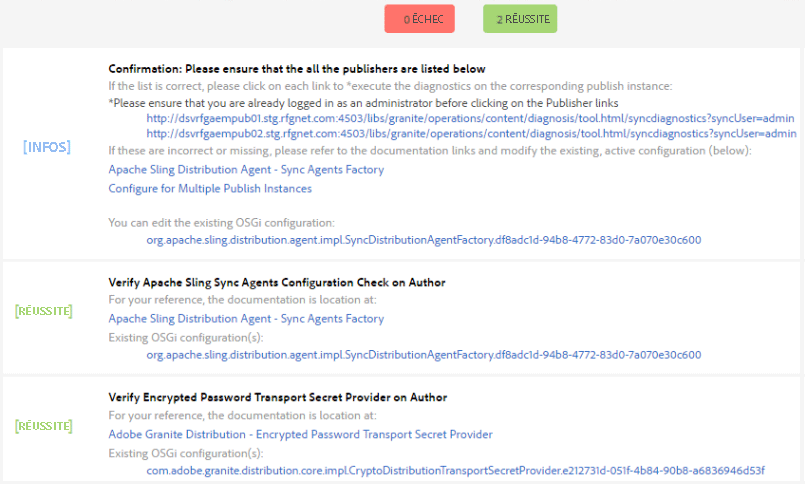

# Synchronisation des utilisateurs{#user-synchronization}

## Présentation {#introduction}

Lorsque le déploiement est une [ferme de publication](/help/sites-deploying/recommended-deploys.md#tarmk-farm), les membres doivent pouvoir se connecter et voir leurs données sur n’importe quel nœud de publication.

Les utilisateurs et utilisatrices, et les groupes d’utilisateurs et d’utilisatrices (données utilisateur) créés dans l’environnement de publication ne sont pas nécessaires dans l’environnement de création.

La plupart des données utilisateur créées dans l’environnement de création sont destinées à y rester et à ne pas être copiées vers les instances de publication.

L’enregistrement et les modifications effectués sur une instance de publication doivent être synchronisés avec d’autres instances de publication afin qu’elles aient accès aux mêmes données utilisateur.

Depuis AEM 6.1, lorsque la synchronisation des utilisateurs et des utilisatrices est activée, les données utilisateur sont automatiquement synchronisées sur les instances de publication dans la ferme et ne sont pas créées en mode de création.

## Distribution Sling {#sling-distribution}

Les données utilisateur, avec leurs [ACL](/help/sites-administering/security.md), sont stockées dans le [cœur Oak](/help/sites-deploying/platform.md), la couche située en dessous du JCR Oak, et sont accessibles via l’[API Oak](https://developer.adobe.com/experience-manager/reference-materials/6-5/javadoc/org/apache/jackrabbit/oak/api/package-tree.html). Du fait de mises à jour peu fréquentes, il est judicieux que les données utilisateur soient synchronisées avec d’autres instances de publication à l’aide de la [Distribution de contenu Sling](https://github.com/apache/sling-old-svn-mirror/blob/trunk/contrib/extensions/distribution/README.md).

Les avantages de la synchronisation des utilisateurs à l’aide de la distribution Sling par rapport à la réplication traditionnelle sont les suivants :

* Les *utilisateurs et utilisatrices*, *profils utilisateur* et *groupes d’utilisateurs et d’utilisatrices* créés lors de la publication ne sont pas créés sur l’instance de création.

* La distribution Sling définit les propriétés dans les événements jcr, ce qui permet d’agir dans les écouteurs d’événements côté publication sans se soucier des boucles de réplication infinies.
* La distribution Sling envoie uniquement les données utilisateur aux instances de publication non originaires, éliminant ainsi le trafic inutile.
* Les [ACL](/help/sites-administering/security.md) définies dans le nœud d’utilisateur sont incluses dans la synchronisation.

>[!NOTE]
>
>Si des sessions sont requises, il est conseillé d’utiliser une solution SSO ou une session persistante et de demander aux client(e)s de se connecter s’ils ou elles basculent vers une autre instance de publication.

>[!CAUTION]
>
>La synchronisation du groupe d’**administration** n’est pas prise en charge, même si la synchronisation des utilisateurs et des utilisatrices est activée. À la place, un échec de l’import de la comparaison est consigné dans le journal des erreurs.
>
>Par conséquent, lorsque le déploiement est une ferme de publication, si un utilisateur ou une utilisatrice est ajouté(e) ou supprimé(e) dans le groupe d’**administration**, la modification doit être effectuée manuellement sur chaque instance de publication.

## Activation de la synchronisation des utilisateurs {#enable-user-sync}

>[!NOTE]
>
>Par défaut, la synchronisation des utilisateurs est `disabled`.
>
>L’activation de la synchronisation des utilisateurs et utilisatrices implique de modifier les configurations OSGi *existantes*.
>
>Aucune nouvelle configuration ne doit être ajoutée suite à l’activation de la synchronisation des utilisateurs et utilisatrices.

La synchronisation des utilisateurs et des utilisatrices repose sur l’environnement de création pour gérer les distributions de données utilisateur, même si les données utilisateur ne sont pas créées en mode de création. Une grande partie, mais pas l’intégralité, de la configuration a lieu dans l’environnement de création et chaque étape identifie clairement si elle doit être effectuée en mode de création ou en mode de publication.

Vous trouverez ci-dessous les étapes nécessaires pour activer la synchronisation des utilisateurs, suivies d’une section [Résolution des incidents](#troubleshooting) :

### Prérequis {#prerequisites}

1. Si les utilisateurs et utilisatrices et les groupes d’utilisateurs ont déjà été créés sur une instance de publication, il est recommandé de [synchroniser manuellement](#manually-syncing-users-and-user-groups) les données utilisateur sur toutes les instances de publication avant de configurer et d’activer la synchronisation des utilisateurs et des utilisatrices.

Une fois la synchronisation des utilisateurs et des utilisatrices activée, seuls les utilisateurs et utilisatrices et les groupes nouvellement créés sont synchronisés.

1. Assurez-vous que le code le plus récent est installé :

* [Mises à jour de la plateforme AEM](https://experienceleague.adobe.com/docs/experience-manager-release-information/aem-release-updates/aem-releases-updates.html?lang=fr)
* [Mises à jour d’AEM Communities](/help/communities/deploy-communities.md#latestfeaturepack)

### 1. Agent de distribution Apache Sling - Fabrique d’agents de synchronisation {#apache-sling-distribution-agent-sync-agents-factory}

**Activer la synchronisation des utilisateurs et utilisatrices**

* **en mode de création**

   * connexion avec droits d’administrateur
   * accédez à la [console web](/help/sites-deploying/configuring-osgi.md)

      * par exemple, [https://localhost:4502/system/console/configMgr](https://localhost:4502/system/console/configMgr)

   * localisez `Apache Sling Distribution Agent - Sync Agents Factory`

      * sélectionnez la configuration existante afin de pouvoir l’ouvrir pour modification (icône de crayon)
Vérifiez `name` : **`socialpubsync`**

      * sélectionnez la case à cocher `Enabled`
      * sélectionnez `Save`


### 2. Créez l’utilisateur ou l’utilisatrice autorisé(e) {#createauthuser}

**Configurer les autorisations**

L’utilisateur ou l’utilisatrice autorisé(e) intervient à l’étape 3 pour configurer la distribution Sling sur l’instance de création.

* **sur chaque instance de publication**

   * connexion avec droits d’administrateur
   * accédez à la [console de sécurité](/help/sites-administering/security.md)

      * Par exemple, [https://localhost:4503/useradmin](https://localhost:4503/useradmin)

   * créer un utilisateur ou une utilisatrice

      * par exemple, `usersync-admin`

   * ajoutez cet utilisateur au groupe d’utilisateurs **`administrators`**
   * [ajoutez l’ACL de cet utilisateur à /home](#howtoaddacl)

      * `Allow jcr:all` avec restriction `rep:glob=*/activities/*`

>[!CAUTION]
>
>Un nouvel utilisateur doit être créé.
>
>* L’utilisateur affecté par défaut est l’utilisateur **`admin`**.
>* Ne pas utiliser `communities-user-admin user.`
>

#### Comment ajouter une ACL {#addacls}

* accédez à CRXDE Lite

   * Par exemple, [https://localhost:4503/crx/de](https://localhost:4503/crx/de)

* sélectionnez le nœud `/home`
* dans le volet de droite, sélectionnez l’onglet `Access Control`
* pour ajouter une entrée ACL, sélectionnez le bouton `+`

   * **Principal** : *recherchez l’utilisateur créé pour la synchronisation des utilisateurs*
   * **Type** : `Allow`
   * **Autorisations** : `jcr:all`
   * **Restrictions** `rep:glob`: `*/activities/*`
   * sélectionnez **OK**

* sélectionnez **Enregistrer tout**



Voir également

* [Gestion des droits d’accès](/help/sites-administering/user-group-ac-admin.md#access-right-management)
* Section de résolution des incidents [Modification de l’exception d’opération pendant le traitement de la réponse](#modify-operation-exception-during-response-processing)

### 3. Distribution Granite d’Adobe - Prestataire secret de transport de mot de passe chiffré {#adobegraniteencpasswrd}

**Configurer les autorisations**

Une fois qu’un utilisateur ou une utilisatrice autorisé(e), membre du groupe d’utilisateurs ou d’utilisatrices **`administrators`**, a été créé(e) sur toutes les instances de publication, cet utilisateur ou cette utilisatrice autorisé(e) doit être identifié(e) en mode de création comme étant autorisé(e) à synchroniser les données utilisateur de la création à la publication.

* **en mode de création**

   * connexion avec droits d’administrateur
   * accédez à la [console web](/help/sites-deploying/configuring-osgi.md)

      * par exemple, [https://localhost:4502/system/console/configMgr](https://localhost:4502/system/console/configMgr)

   * localisez `com.adobe.granite.distribution.core.impl.CryptoDistributionTransportSecretProvider.name`
   * pour ouvrir une configuration pour modification, sélectionnez la configuration existante (icône crayon)
Vérifiez `property name` : **`socialpubsync-publishUser`**

   * définissez le nom d’utilisateur et le mot de passe de l’[utilisateur autorisé](#createauthuser) créé en mode de publication à l’étape 2

      * par exemple, `usersync-admin`



### 4. Agent de distribution Apache Sling - Fabrique d’agents de file d’attente {#apache-sling-distribution-agent-queue-agents-factory}

**Activer la synchronisation des utilisateurs et utilisatrices**

* **sur chaque instance de publication** :

   * connexion avec droits d’administrateur
   * accédez à la [console web](/help/sites-deploying/configuring-osgi.md)

      * par exemple, [https://localhost:4503/system/console/configMgr](https://localhost:4503/system/console/configMgr)

   * localisez `Apache Sling Distribution Agent - Queue Agents Factory`

      * pour ouvrir une configuration pour modification, sélectionnez la configuration existante (icône crayon)
Vérifiez `Name` : `socialpubsync-reverse`

      * sélectionnez la case à cocher `Enabled`
      * sélectionnez `Save`

   * **répétez** pour chaque instance de publication


### 5. Synchronisation Adobe Social - Fabrique d’observateurs diff. {#diffobserver}

**Activez la synchronisation des groupes**

* **sur chaque instance de publication** :

   * connexion avec droits d’administrateur
   * accédez à la [console web](/help/sites-deploying/configuring-osgi.md)

      * par exemple, [https://localhost:4503/system/console/configMgr](https://localhost:4503/system/console/configMgr)

   * localisez **`Adobe Social Sync - Diff Observer Factory`**

      * pour ouvrir une configuration pour modification, sélectionnez la configuration existante (icône de crayon).

        Vérifier `agent name` : `socialpubsync-reverse`

      * sélectionnez la case à cocher `Enabled`
      * sélectionnez `Save`


### 6. Déclencheur de distribution Apache Sling - Fabrique de déclencheurs planifiés {#apache-sling-distribution-trigger-scheduled-triggers-factory}

**(Optionnel) modifiez l’intervalle d’interrogation**

Par défaut, l’instance de création interroge les modifications toutes les 30 secondes. Pour modifier cet intervalle :

* **en mode de création**

   * connexion avec droits d’administrateur
   * accédez à la [console web](/help/sites-deploying/configuring-osgi.md)

      * par exemple, [https://localhost:4502/system/console/configMgr](https://localhost:4502/system/console/configMgr)

   * localisez `Apache Sling Distribution Trigger - Scheduled Triggers Factory`

      * pour ouvrir une configuration pour modification, sélectionnez la configuration existante (icône de crayon).

         * Vérifier `Name` : `socialpubsync-scheduled-trigger`

      * définissez l’`Interval in Seconds` à l’intervalle souhaité.
      * sélectionnez `Save`


## Configurer plusieurs instances de publication {#configure-for-multiple-publish-instances}

La configuration par défaut couvre une instance de publication unique. Puisque l’objectif de l’activation de la synchronisation des utilisateurs et des utilisatrices est de synchroniser plusieurs instances de publication (par exemple, pour une ferme de publication), les instances de publication supplémentaires doivent être ajoutées à la fabrique d’agents de synchronisation.

### 7. Agent de distribution Apache Sling - Fabrique d’agents de synchronisation {#apache-sling-distribution-agent-sync-agents-factory-1}

**Ajoutez des instances de publication :**

* **en mode de création**

   * connexion avec droits d’administrateur
   * accédez à la [console web](/help/sites-deploying/configuring-osgi.md)

      * par exemple, [https://localhost:4502/system/console/configMgr](https://localhost:4502/system/console/configMgr)

   * localisez `Apache Sling Distribution Agent - Sync Agents Factory`

      * pour ouvrir une configuration pour modification, sélectionnez la configuration existante (icône de crayon)
Vérifiez `Name` : `socialpubsync`


* **Points d’entrée de l’exportateur**
Il doit exister un point d’entrée de l’exportateur pour chaque instance de publication. Par exemple, s’il existe 2 instances de publication, localhost:4503 et 4504, il doit y avoir deux entrées :

   * `https://localhost:4503/libs/sling/distribution/services/exporters/socialpubsync-reverse`
   * `https://localhost:4504/libs/sling/distribution/services/exporters/socialpubsync-reverse`

* **Points d’entrée de l’importateur**
Il doit exister un point d’entrée de l’importateur pour chaque instance de publication. Par exemple, s’il existe 2 instances de publication, localhost:4503 et 4504, il doit y avoir deux entrées :

   * `https://localhost:4503/libs/sling/distribution/services/importers/socialpubsync`
   * `https://localhost:4504/libs/sling/distribution/services/importers/socialpubsync`

* sélectionnez `Save`

### 8. Écouteur de synchronisation des utilisateurs et utilisatrices d’AEM Communities {#aem-communities-user-sync-listener}

**(Facultatif) Synchroniser des nœuds JCR supplémentaires**

S’il existe des données personnalisées à synchroniser sur plusieurs instances de publication, alors :

* **Sur chaque instance de publication** :

   * connexion avec droits d’administrateur
   * accédez à la [console web](/help/sites-deploying/configuring-osgi.md)

      * par exemple, `https://localhost:4503/system/console/configMgr`

   * localisez `AEM Communities User Sync Listener`
   * pour ouvrir une configuration pour modification, sélectionnez la configuration existante (icône de crayon)
Vérifiez `Name` : `socialpubsync-scheduled-trigger`



* **Types de nœuds**
Il s’agit de la liste des types de nœuds qui vont être synchronisés. Tout type de nœud autre que sling:Folder doit être répertorié ici (sling:folder est traité séparément).
 Liste par défaut des types de nœuds à synchroniser :

   * rep:User
   * nt:unstructured
   * nt:resource

* **Propriétés à ignorer**
Il s’agit de la liste des propriétés qui seront ignorées si une modification est détectée. Les modifications apportées à ces propriétés peuvent être synchronisées comme effet secondaire d’autres modifications (la synchronisation ayant toujours lieu au niveau du nœud), mais les modifications apportées à ces propriétés ne déclenchent pas en elles-mêmes de synchronisation.
Propriété par défaut à ignorer :

   * cq:lastModified

* **Nœuds à ignorer**
Sous-chemins ignorés lors de la synchronisation. Aucun élément figurant dans ces sous-chemins d’accès n’est synchronisé à un moment donné.
 Nœuds par défaut à ignorer :

   * .tokens
   * system

* **Dossiers distribués**
La plupart des nœuds sling:Folders sont ignorés, car la synchronisation n’est pas nécessaire. Les quelques exceptions sont répertoriées ici.
Dossiers par défaut à synchroniser

   * segments/notation
   * social/relations
   * activities

### 9. Identifiant Sling unique {#unique-sling-id}

>[!CAUTION]
>
>Si l’identifiant Sling correspond à deux instances de publication ou plus, la synchronisation de groupe d’utilisateurs ou d’utilisatrices échoue.

Si l’identifiant Sling est identique pour plusieurs instances de publication dans une ferme de publication, les groupes d’utilisateurs et d’utilisatrices ne sont pas synchronisés.

Pour vérifier que toutes les valeurs d’identifiant Sling diffèrent, sur chaque instance de publication :

1. accédez à `http://<host>:<port>/system/console/status-slingsettings`
1. vérifiez la valeur de l’**identifiant Sling**


Si l’identifiant Sling d’une instance de publication correspond à l’identifiant Sling d’une autre instance de publication, alors :

1. arrêtez l’une des instances de publication ayant un identifiant Sling correspondant
1. dans le répertoire crx-quickstart/launchpad/felix

   * recherchez et supprimez le fichier nommé *sling.id.file*

      * par exemple, sur un système Linux® :
        `rm -i $(find . -type f -name sling.id.file)`

      * par exemple, sur un système Windows :
        `use windows explorer and search for *sling.id.file*`

1. démarrez l’instance de publication

   * au démarrage, un nouvel identifiant Sling lui sera attribué

1. confirmez que l’**identifiant Sling** est désormais unique

Répétez ces étapes jusqu’à ce que toutes les instances de publication aient un identifiant Sling unique.

## Fabrique de générateur de package vault {#vault-package-builder-factory}

Pour que les mises à jour soient correctement synchronisées, il est nécessaire de modifier le générateur de package vault en vue de la synchronisation des utilisateurs et des utilisatrices :

* sur chaque instance de publication AEM
* accédez à la [console web](/help/sites-deploying/configuring-osgi.md)

   * par exemple, [https://localhost:4503/system/console/configMgr](https://localhost:4503/system/console/configMgr)

* localisez `Apache Sling Distribution Packaging - Vault Package Builder Factory`

   * `Builder name: socialpubsync-vlt`

* sélectionnez l’icône de modification
* ajouter deux `Package Node Filters` :

   * `/home/users|-.*/.tokens`
   * `/home/users|-.*/rep:cache`

* gestion des politiques :

   * pour remplacer les nœuds rep:policy existants par de nouveaux nœuds, ajoutez un troisième filtre de package :

      * `/home/users|+.*/rep:policy`

   * pour empêcher la distribution des politiques, définissez

      * `Acl Handling:` `IGNORE`


## Que se passe-t-il lorsque... {#what-happens-when}

### Un utilisateur ou une utilisatrice s’enregistre automatiquement ou modifie son profil dans Publication. {#user-self-registers-or-edits-profile-on-publish}

Par défaut, les utilisateurs et les profils créés dans l’environnement de publication (inscription automatique) n’apparaissent pas dans l’environnement de création.

Lorsque la topologie consiste en une [batterie de publication](/help/sites-deploying/recommended-deploys.md#tarmk-farm) et que la synchronisation des utilisateurs a été correctement configurée, l’*utilisateur* et le *profil utilisateur* sont synchronisés dans la batterie de publication à l’aide de la distribution Sling.

### La création d’utilisateurs et d’utilisatrices ou de groupes d’utilisateurs et d’utilisatrices s’effectue dans la console de sécurité. {#users-or-user-groups-are-created-using-security-console}

Par défaut, les données utilisateur créées dans l’environnement de publication n’apparaissent pas dans l’environnement de création, et inversement.

Lorsque la console [Administration et sécurité des utilisateurs](/help/sites-administering/security.md) est utilisée pour ajouter de nouveaux utilisateurs et de nouvelles utilisatrices dans l’environnement de publication, la synchronisation des utilisateurs et des utilisatrices synchronise les nouveaux utilisateurs et les nouvelles utilisatrices et leur appartenance à un groupe sur d’autres instances de publication, si nécessaire. La synchronisation des utilisateurs et des utilisatrices synchronise également les groupes d’utilisateurs et d’utilisatrices créés via la console de sécurité.

## Résolution des problèmes {#troubleshooting}

### Comment mettre la synchronisation des utilisateurs et utilisatrices hors ligne {#how-to-take-user-sync-offline}

Pour que la synchronisation des utilisateurs et des utilisatrices puisse être mise hors ligne, afin de [supprimer une instance de publication](#how-to-remove-a-publish-instance) ou de [synchroniser manuellement les données](#manually-syncing-users-and-user-groups), la file d’attente de distribution doit être vide et inactive.

Pour vérifier le statut de la file d’attente de distribution :

* En mode de création :

   * utilisation de [CRXDE Lite](/help/sites-developing/developing-with-crxde-lite.md)

      * recherchez des entrées dans `/var/sling/distribution/packages`

         * nœuds de dossier nommés selon le motif `distrpackage_*`

   * à l’aide du [gestionnaire de modules](/help/sites-administering/package-manager.md)

      * recherchez les packages en attente (pas encore installés)

         * nommés selon le motif `socialpubsync-vlt*`
         * créés par `communities-user-admin`

Lorsque la file d’attente de distribution est vide, désactivez la synchronisation des utilisateurs :

* En mode de création

   * *décochez* la case `Enabled` de l’[Agent de distribution Apache Sling - Fabrique d’agents de synchronisation](#apache-sling-distribution-agent-sync-agents-factory)

Une fois les tâches accomplies, pour réactiver la synchronisation des utilisateurs et des utilisatrices :

* En mode de création

   * cochez la case `Enabled` de l’[Agent de distribution Apache Sling - Fabrique d’agents de synchronisation](#apache-sling-distribution-agent-sync-agents-factory)

### Diagnostics de synchronisation des utilisateurs et utilisatrices {#user-sync-diagnostics}

L’outil Diagnostics de synchronisation des utilisateurs et utilisatrices vérifie la configuration et tente d’identifier les éventuels problèmes.

En mode de création, de la console principale accédez simplement à **Outils, Opérations, Diagnostics, Diagnostics de synchronisation des utilisateurs et des utilisatrices.**

Entrer simplement dans la console Diagnostics de synchronisation des utilisateurs et des utilisatrices a pour effet d’afficher les résultats.

Voici ce qui s’affiche lorsque la synchronisation des utilisateurs et des utilisatrices n’a pas été activée :



#### Comment exécuter des diagnostics pour les instances de publication {#how-to-run-diagnostics-for-publish-instances}

Lorsque le diagnostic est exécuté à partir de l’environnement de création, les résultats de réussite/échec incluent une section [INFO] affichant la liste des instances de publication configurées pour confirmation.

La liste comprend une URL de chaque instance de publication qui exécute les diagnostics de cette instance. Le paramètre d’URL `syncUser` est ajouté à l’URL de diagnostic avec sa valeur définie sur l’*utilisateur de synchronisation autorisé* créé à l’[Étape 2](#createauthuser).

**Remarque** : avant le lancement de l’URL, l’*utilisateur de synchronisation autorisé* doit déjà être connecté à cette instance de publication.



### Configuration incorrectement ajoutée {#configuration-improperly-added}

Lorsque la synchronisation des utilisateurs ne fonctionne pas, le problème le plus courant est que des configurations supplémentaires ont été *ajoutées*. À la place, la configuration par défaut existante aurait dû être *modifiée*.

Voici comment les configurations par défaut modifiées doivent apparaître dans la console web. Si plusieurs instances apparaissent, la configuration supplémentaire doit être supprimée.

#### (Création) Un agent de distribution Apache Sling - Fabrique d’agents de synchronisation {#author-one-apache-sling-distribution-agent-sync-agents-factory}


#### (Création) Une information d’identification de transport de distribution Apache Sling - Prestataire secret de transport de distribution basé sur les informations d’identification d’un utilisateur ou d’une utilisatrice {#author-one-apache-sling-distribution-transport-credentials-user-credentials-based-distributiontransportsecretprovider}


#### (Publication) Un agent de distribution Apache Sling - Fabrique d’agents de file d’attente {#publish-one-apache-sling-distribution-agent-queue-agents-factory}


#### (Publication) Une synchronisation Adobe Social - Fabrique d’observateurs diff. {#publish-one-adobe-social-sync-diff-observer-factory}


#### (Création) Un déclencheur de distribution Apache Sling - Fabrique de déclencheurs planifiés {#author-one-apache-sling-distribution-trigger-scheduled-triggers-factory}


### Modifier l’exception d’opération lors du traitement de la réponse {#modify-operation-exception-during-response-processing}

Si les éléments suivants sont visibles dans le journal :

`org.apache.sling.servlets.post.impl.operations.ModifyOperation Exception during response processing.`

`java.lang.IllegalStateException: This tree does not exist`

Vérifiez alors que la section [2. Création d’un utilisateur autorisé](#createauthuser) a été correctement suivie.

Cette section décrit la création d’une personne utilisatrice autorisée, qui existe sur toutes les instances de publication, et son identification dans la configuration OSGi « Fournisseur secret » en mode de création. Par défaut, l’utilisateur est `admin`.

L’utilisateur autorisé doit être fait membre du groupe utilisateurs **`administrators`** et les autorisations de ce groupe ne doivent pas être modifiées.

La personne utilisatrice autorisée doit avoir explicitement les autorisations et la restriction suivantes sur les instances de publication :

| **path** | **jcr:all** | **rep:glob** |
|---|---|---|
| /home | X | &#42;/activities/&#42; |
| /home/users | X | &#42;/activities/&#42; |
| /home/groups | X | &#42;/activities/&#42; |

En tant que membre du groupe d’`administrators`, la personne utilisatrice autorisée doit disposer des autorisations suivantes sur toutes les instances de publication :

| **path** | **jcr:all** | **jcr:read** | **rep:write** |
|---|---|---|---|
| /etc/packages/sling/distribution |  |  | X |
| /libs/sling/distribution |  | X |  |
| /var |  |  | X |
| /var/eventing |  | X | X |
| /var/sling/distribution |  | X | X |

### Échec de la synchronisation du groupe d’utilisateurs et d’utilisatrices {#user-group-sync-failed}

Si l’identifiant Sling correspond à deux instances de publication ou plus, la synchronisation de groupe d’utilisateurs ou d’utilisatrices échoue.

Voir la section [9. Identifiant Sling unique](#unique-sling-id)

### Synchronisation manuelle des utilisateurs et utilisatrices et des groupes d’utilisateurs et d’utilisatrices {#manually-syncing-users-and-user-groups}

* sur les instances de publication sur lesquelles les utilisateurs, utilisatrices, groupes d’utilisateurs et d’utilisatrices existent :

   * [si elle est activée, désactivez la synchronisation des utilisateurs](#how-to-take-user-sync-offline)
   * [créez un package](/help/sites-administering/package-manager.md#creating-a-new-package) de `/home`

      * lors de la modification du package

         * Onglet Filtres : Ajouter un filtre : Chemin racine : `/home`
         * Onglet Avancé : Traitement AC : `Overwrite`

   * [exportez le package](/help/sites-administering/package-manager.md#downloading-packages-to-your-file-system)

* sur d’autres instances de publication :

   * [importez le package](/help/sites-administering/package-manager.md#installing-packages)

Pour configurer ou activer la synchronisation des groupes, allez à l’étape 1 : [Agent de distribution Apache Sling - Fabrique d’agents de synchronisation](#apache-sling-distribution-agent-sync-agents-factory).

### Lorsqu’une instance de publication n’est plus disponible. {#when-a-publish-instance-becomes-unavailable}

Lorsqu’une instance de publication n’est plus disponible, elle ne doit pas être supprimée si elle doit être de nouveau en ligne à l’avenir. Les modifications sont mises en file d’attente pour l’instance de publication et, une fois l’instance de nouveau en ligne, elles sont traitées.

Si l’instance de publication ne doit pas être remise en ligne, si elle est définitivement hors ligne, elle doit être supprimée, car l’accumulation dans la file d’attente entraînera une utilisation notable de l’espace disque dans l’environnement de création.

Lorsqu’une instance de publication est hors service, le journal de création comporte des exceptions similaires aux cas suivants :

```
28.01.2016 15:57:48.475 ERROR
 [pool-12-thread-34-org_apache_sling_distribution_queue_socialpubsync_endpoint1
 (org/apache/sling/distribution/queue/socialpubsync/endpoint1)]
 org.apache.sling.distribution.agent.impl.SimpleDistributionAgent [agent][socialpubsync] could not deliver package distrpackage_1454014575838_a2b45ec8-0400-42f3-bed8-ae09b66381cb
 org.apache.sling.distribution.packaging.DistributionPackageImportException: failed in importing package ...
```

### Comment supprimer une instance de publication {#how-to-remove-a-publish-instance}

Pour supprimer une instance de publication de l’[Agent de distribution Apache Sling - Fabrique d’agents de synchronisation](#apache-sling-distribution-agent-sync-agents-factory), la file d’attente de distribution doit être vide et inactive.

* En mode de création :

   * [Mettre la synchronisation des utilisateurs et utilisatrices hors ligne](#how-to-take-user-sync-offline)
   * suivez l’[étape 7](#apache-sling-distribution-agent-sync-agents-factory) pour supprimer l’instance de publication des deux listes de serveurs :

      * `Exporter Endpoints`
      * `Importer Endpoints`

   * réactivez la synchronisation des utilisateurs

      * cochez la case `Enabled` de l’[Agent de distribution Apache Sling - Fabrique d’agents de synchronisation](#apache-sling-distribution-agent-sync-agents-factory)
