# Administration des balises {#administering-tags}

Les balises constituent un moyen simple et rapide de classer le contenu de votre site web. Elles peuvent être considérées comme des mots-clés ou des étiquettes (métadonnées) qui permettent de trouver plus rapidement du contenu dans le résultat d’une recherche.

Dans Adobe Experience Manager (AEM), une balise peut être une propriété de

* Nœud de contenu d’une page (voir [Utilisation des balises](/help/sites-authoring/tags.md))

* Nœud de métadonnées pour une ressource (voir [Gestions des métadonnées des ressources numériques](/help/assets/metadata.md))

Outre les pages et les ressources, les balises sont utilisées pour les fonctionnalités d’AEM Communities :

* Contenu créé par l’utilisateur (voir [Balisage du contenu créé par l’utilisateur)](/help/communities/tag-ugc.md)

* Ressources d’activation (voir [Balisage des ressources d’activation](/help/communities/functions.md#catalog-function))

## Fonctionnalités des balises {#tag-features}

Voici quelques-unes des fonctionnalités des balises dans AEM :

* Les balises peuvent être regroupées dans différents espaces de noms. De telles hiérarchies autorisent la création de taxonomies. Ces taxonomies sont générales dans AEM.
* Pour les balises nouvellement créées, la principale restriction réside dans le fait qu’elles doivent être uniques dans un espace de noms spécifié.
* Le titre d’une balise ne doit pas comporter de caractères de séparation de chemin d’accès aux balises (s’il y en a, ils ne s’afficheront pas).

   * deux-points `:` : délimite la balise d’espace de nommage
   * Barre oblique `/` - délimite les sous-balises

* Des balises peuvent être appliquées par les créateurs et les visiteurs du site. Indépendamment de leur auteur, toutes les formes de balises peuvent être sélectionnées, tant lors de l’affectation d’une page que lors d’une recherche.
* Les balises peuvent être créées et leur taxonomie modifiée par les membres du groupe &quot;tag-administrateurs&quot; et les membres disposant de droits de modification sur `/content/cq:tags`.

   * Une balise qui contient des balises enfants est appelée « balise conteneur ».
   * Une balise qui n’est pas une balise conteneur est appelée « balise terminale ».
   * Un espace de noms de balises est une balise terminale ou conteneur.

* Les balises sont utilisées par le [composant de recherche](https://helpx.adobe.com/experience-manager/core-components/using/quick-search.html) pour faciliter la recherche de contenu.
* Les balises sont utilisées par le [composant Teaser](https://helpx.adobe.com/experience-manager/core-components/using/teaser.html), qui contrôle le nuage de balises d’un utilisateur afin de fournir du contenu ciblé.
* Si les balises constituent un aspect important de votre contenu :

   * Veillez à les regrouper avec les pages qui les utilisent.
   * Assurez-vous que les [autorisations des balises](#setting-tag-permissions) permettent l’accès en lecture.

## Console Balisage {#tagging-console}

La console Balisage permet de créer et de gérer des balises et leur taxonomie. Elle vise entre autres à éviter d’avoir de nombreuses balises similaires, qui renvoient essentiellement aux mêmes aspects : par exemple, page et pages ou chaussures et souliers.

Les balises sont gérées en les regroupant dans des espaces de noms, en vérifiant l’utilisation des balises existantes avant d’en créer d’autres et en les réorganisant sans déconnecter la balise du contenu actuellement référencé.

Pour accéder à la console Balisage, procédez comme suit :

* Sur l’instance de création.
* Connectez-vous avec des droits d’administrateur.
* Dans la navigation générale

   * select **`Tools`**
   * sélectionner **`General`**
   * sélectionner **`Tagging`**

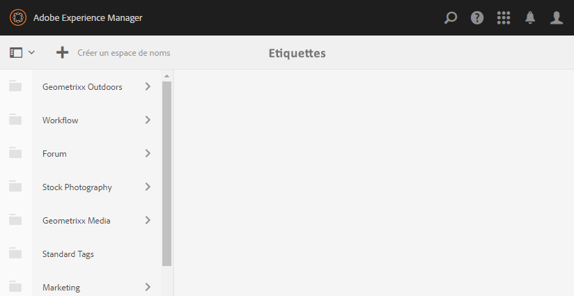

### Création d’un espace de noms {#creating-a-namespace}

Pour créer un espace de nommage, sélectionnez l&#39;icône **`Create Namespace`**.

L’espace de noms est lui-même une balise et ne comporte pas forcément de balise secondaire. Cependant, pour poursuivre la création d’une taxonomie, [créez des balises secondaires](#creating-tags), qui peuvent être des balises terminales ou conteneurs.

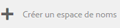 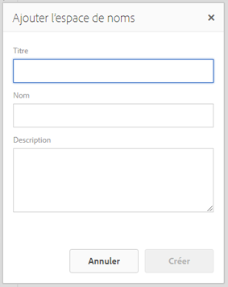

* **Titre**

   *(obligatoire)* Titre d’affichage de l’espace de nommage.

* **Name** (Nom)
   *(facultatif)* Nom de l’espace de nommage. Si aucun nom n’est spécifié, un nom de nœud valide est créé à partir du titre. Voir [TagID](/help/sites-developing/framework.md#tagid).

* **Description**

   *(facultatif)* Description de l’espace de nommage.

Une fois que les informations nécessaires ont été saisies :

* Sélectionnez **Créer**.

### Opérations sur les balises  {#operations-on-tags}

La sélection d’un espace de noms ou d’une autre balise rend les opérations ci-dessous disponibles :

* [Afficher les propriétés](#viewing-tag-properties)
* [Références](#showing-tag-references)
* [Créer une balise](#creating-tags)
* [Modifier](#editing-tags)
* [Déplacer](#moving-tags)
* [Fusionner](#merging-tags)
* [Publication](#publishing-tags)
* [Annuler la publication](#unpublishing-tags)
* [Supprimer](#deleting-tags)

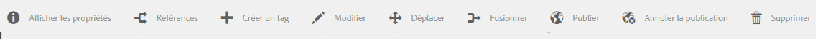

Lorsque la fenêtre du navigateur n&#39;est pas assez large pour afficher toutes les icônes, les icônes les plus à droite sont regroupées sous une icône **`... More`**, qui affiche une liste déroulante des icônes d&#39;opération masquées lorsqu&#39;elles sont sélectionnées.

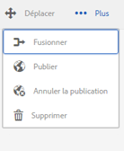

### Sélection d’une balise d’espace de noms {#selecting-a-namespace-tag}

Lorsqu’un espace de noms est sélectionné pour la première fois, s’il ne contient aucune balise, les propriétés sont affichées à droite. Sinon, ce sont les balises enfants qui s’affichent. Chaque balise sélectionnée affiche les balises qu’elle contient ou ses propriétés si elle ne comporte pas de balises enfants.

Pour sélectionner une ou plusieurs balises pour des opérations, cliquez une seule fois sur l’icône en regard du titre. Cela a pour effet d’afficher les propriétés ou d’ouvrir la balise pour en afficher le contenu.

 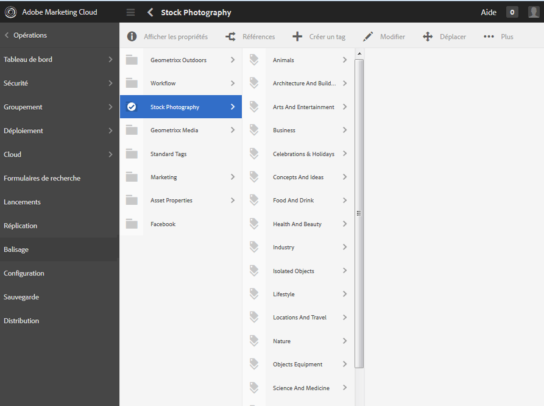

### Affichage des propriétés de balise {#viewing-tag-properties}

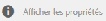

Lorsqu’un espace de nommage ou une autre balise est sélectionné, la sélection de l’icône **`View Properties`** entraîne l’affichage d’informations sur `name`, l’heure de la dernière modification et le nombre de références. En cas de publication, l’heure de dernière publication et l’identifiant de la personne à l’origine de la publication s’affichent. Ces informations s’affichent dans une colonne à gauche des colonnes de balises.

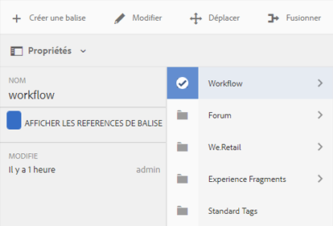

### Affichage des références des balises {#showing-tag-references}

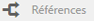

Lorsqu’un espace de noms ou une autre balise est sélectionné, si vous cliquez sur l’icône **Références**, le contenu auquel la balise fait référence est identifié.

L’affichage initial correspond au nombre de balises appliquées.

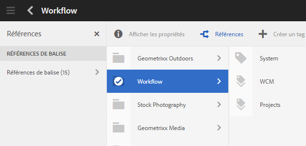

Sélectionnez la flèche à droite du nombre pour connaître le nom des références.

Le chemin d’accès à la référence s’affiche sous la forme d’infobulle lorsque vous passez le curseur de la souris sur une référence.

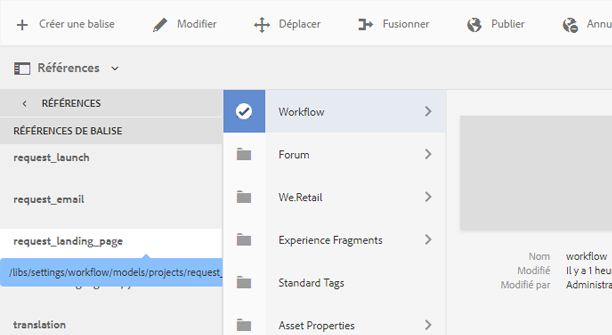

### Création de balises {#creating-tags}

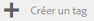

Lorsqu’un espace de nommage ou une autre balise est sélectionné (en sélectionnant l’icône en regard du titre), une balise enfant peut être créée pour la balise active en sélectionnant l’icône **`Create Tag`**.

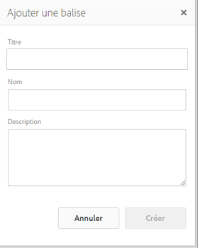

* **Titre**
* (obligatoire) *Titre d’affichage de la balise.

* **Nom**
*(facultatif) *Nom de la balise. Si aucun nom n’est spécifié, un nom de nœud valide est créé à partir du titre. Voir [TagID](/help/sites-developing/framework.md#tagid).

* **Description**
*(facultatif) *Description de la balise.

Une fois que les informations nécessaires ont été saisies :

* Sélectionnez **Créer**.

### Modification de balises  {#editing-tags}

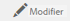

Lorsqu’un espace de nommage ou une autre balise est sélectionné, il est possible de modifier le titre, la description et de fournir les localisations du titre en sélectionnant l’icône **`Edit`**.

Une fois les modifications apportées, sélectionnez **Enregistrer**.

Pour plus d&#39;informations sur l&#39;ajout de traductions de langue, consultez la section [Gestion des balises dans différentes langues](#managing-tags-in-different-languages).

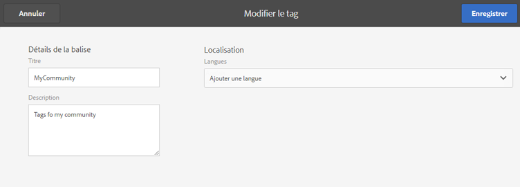

### Déplacement des balises {#moving-tags}

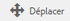

Lorsqu’un espace de nommage ou une autre balise est sélectionné, la sélection de l’icône **`Move`** permet aux administrateurs et aux développeurs de balises de nettoyer la taxonomie en déplaçant la balise vers un nouvel emplacement ou en la renommant. Si la balise sélectionnée est une balise conteneur, le fait de la déplacer déplace également toutes les balises enfants.

>[!NOTE]
>
>Il est recommandé que les auteurs ne soient autorisés à [modifier](#editing-tags) la balise `title` que pour ne pas déplacer ou renommer les balises.

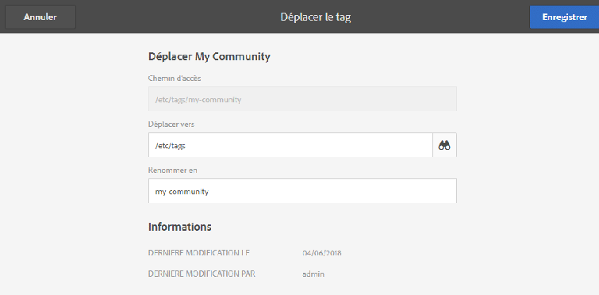

* **Chemin**

   *(lecture seule)* Chemin d’accès actuel à la balise sélectionnée.

* **Déplacer vers** Accédez au nouveau chemin d’accès où déplacer la balise.

* **Renommer**
àInitialement affiche le 
`name`de la balise . Un nouveau `name`peut être entré.

* Sélectionnez **Enregistrer**.

### Fusion des balises  {#merging-tags}

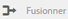

Il est également possible de recourir à la fusion de balises lorsqu’une taxonomie comporte des doublons. Si la balise A est fusionnée dans la balise B, toutes les pages balisées avec la balise A sont balisées avec la balise B, et la balise A n’est plus disponible pour les auteurs.

Lorsqu’un espace de nommage ou une autre balise est sélectionné, la sélection de l’icône **Fusionner** ouvre un panneau dans lequel le chemin de fusion peut être sélectionné.

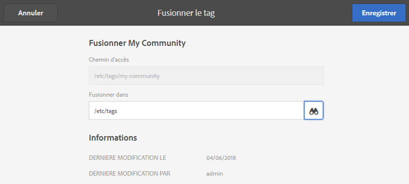

* **Chemin**

   *(lecture seule)* Chemin de la balise sélectionnée pour être fusionnée dans une autre balise.

* **Fusionner dans** Accédez au chemin d’accès de la balise où effectuer la fusion.

>[!NOTE]
>
>Après la fusion, le **Chemin d’accès** qui avait été initialement sélectionné n’existe (pratiquement) plus.
>
>Si une balise référencée est déplacée ou fusionnée, elle n’est pas physiquement supprimée, de sorte qu’il est possible de conserver les références.

### Publication de balises {#publishing-tags}

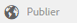

Lorsqu’un espace de nommage ou une autre balise est sélectionné, sélectionnez l’icône **Publier** pour activer la balise dans l’environnement de publication. De même que pour le contenu d’une page, seule la balise sélectionnée est publiée, qu’il s’agisse d’une balise conteneur ou non.

Pour publier une taxonomie (un espace de noms et des balises secondaires), il est recommandé de créer un [module](/help/sites-administering/package-manager.md) de l’espace de noms (voir [Nœud racine de taxonomie](/help/sites-developing/framework.md#taxonomy-root-node)). Veillez à [appliquer des autorisations](#setting-tag-permissions) à l&#39;espace de nommage avant de créer le package.

### Annulation de la publication de balises {#unpublishing-tags}

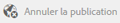

Lorsqu’un espace de nommage ou une autre balise est sélectionné, la sélection de l’icône **Annuler la publication** désactive la balise dans l’environnement d’auteur et la supprime de l’environnement de publication. Tout comme l’opération `Delete`si la balise sélectionnée est une balise de conteneur, toutes ses balises enfants seront désactivées dans l’environnement d’auteur et supprimées de l’environnement de publication.

### Suppression des balises {#deleting-tags}

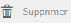

Lorsqu’un espace de nommage ou une autre balise est sélectionné, la sélection de l’icône **Supprimer** supprime définitivement la balise de l’environnement d’auteur. Si la balise a été publiée, elle est également supprimée de l’environnement de publication. Si la balise sélectionnée est une balise conteneur, toutes ses balises enfants sont elles aussi supprimées.

## Définition des autorisations de balises {#setting-tag-permissions}

Les autorisations de balise sont [&#39;secure (par défaut)&#39;](/help/sites-administering/production-ready.md); une bonne pratique pour l’environnement de publication qui requiert l’autorisation de lecture pour être explicitement autorisée pour les balises. Pour ce faire, il suffit grosso modo de créer un module d’espace de noms de balises une fois que les autorisations ont été définies dans l’instance de création, puis d’installer le module sur toutes les instances de publication.

* Sur l’instance de création

   * Connectez-vous avec des droits d’administrateur.
   * Accédez à la [console Sécurité](/help/sites-administering/security.md#accessing-user-administration-with-the-security-console).

      * Par exemple, http://localhost:4502/useradmin.
   * Dans le volet de gauche, sélectionnez le groupe (ou l’utilisateur) auquel accorder une [autorisation de lecture](/help/sites-administering/security.md#permissions).
   * dans le volet de droite, recherchez le **Path **to the Tag Espace de nommage.

      * par exemple, `/content/cq:tags/mycommunity`
   * sélectionnez `checkbox`dans la colonne **Lire**.
   * sélectionnez **Enregistrer**

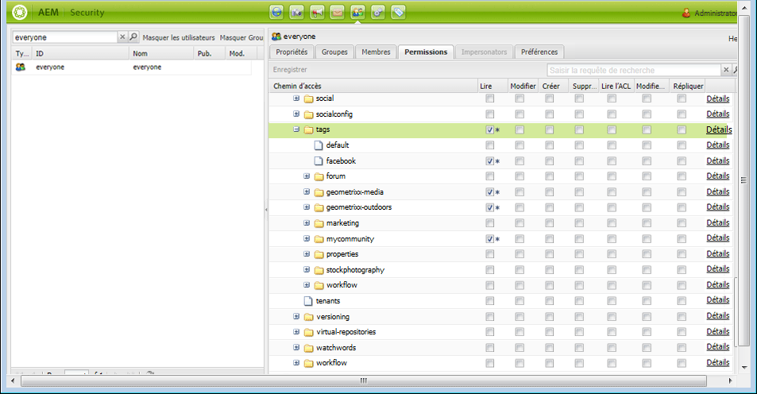

* Assurez-vous que toutes les instances de publication disposent des mêmes autorisations.

   * Une méthode consiste à [créer un module](/help/sites-administering/package-manager.md#package-manager) de l’espace de noms sur l’instance de création.

      * sur l&#39;onglet `Advanced`, pour `AC Handling` sélectionnez `Overwrite`
   * Répliquez le module.

      * choisir `Replicate` dans le gestionnaire de packages

## Gestion des balises dans différentes langues {#managing-tags-in-different-languages}

La propriété `title`d&#39;une balise peut être traduite en plusieurs langues. Une fois traduite, la balise `title`appropriée peut s’afficher en fonction de la langue de l’utilisateur ou de la langue de la page.

### Définition de titres de balises dans plusieurs langues {#defining-tag-titles-in-multiple-languages}

Ce qui suit décrit comment traduire l&#39;`title`de la balise **Animals** de l&#39;anglais en allemand et en français.

Début en sélectionnant la balise sous l&#39;espace de nommage **Images photographiques** et en sélectionnant l&#39;icône **`Edit`**(voir la section [Modification des balises](#editing-tags)).

Dans le panneau Modifier la balise, choisissez les langues dans lesquelles localiser le titre de la balise.

À mesure que chaque langue est sélectionnée, une zone de saisie de texte s’affiche, dans laquelle vous pouvez saisir le titre traduit.

Une fois toutes les traductions saisies, sélectionnez **Enregistrer** pour quitter le mode de modification.

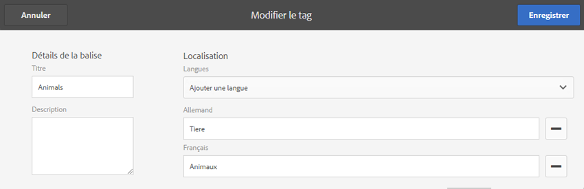

En général, la langue sélectionnée pour la balise dépend de la langue de la page, le cas échéant. Si le widget [`tag` est utilisé dans d’autres cas (dans des formulaires ou des boîtes de dialogue, par exemple), la langue du tag dépend du contexte.](/help/sites-developing/building.md#tagging-on-the-client-side)

Plutôt que d’utiliser le paramètre de langue de la page, la console Balisage utilise le paramètre de langue de l’utilisateur. Dans la console Balisage, pour la balise « Animals », « Animaux » s’affiche pour un utilisateur qui a défini la langue française dans ses propriétés d’utilisateur.

Pour ajouter une nouvelle langue à la boîte de dialogue, voir [Ajouter une nouvelle langue à la boîte de dialogue Modifier la balise](/help/sites-developing/building.md#adding-a-new-language-to-the-edit-tag-dialog).

>[!NOTE]
>
>Le nuage de balises et les mots-clés de métadonnées dans le composant de page standard utilisent la balise localisée `titles`en fonction de la langue de page, le cas échéant.

## Ressources {#resources}

* [Balisage pour les développeurs](/help/sites-developing/tags.md)

   Informations sur la structure de balisage, ainsi que sur l’extension et l’inclusion de balises dans les applications personnalisées.

* [Console Balisage de l’interface utilisateur classique](/help/sites-administering/classic-console.md)

