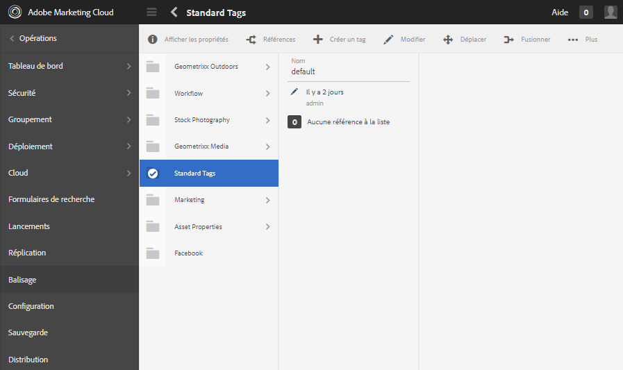

# Administration des balises {#administering-tags}

Les balises sont une méthode rapide et facile pour classer le contenu dans un site web. Elles peuvent être considérées comme des mots-clés ou des étiquettes (métadonnées) qui permettent de trouver plus rapidement le contenu suite à une recherche.

Dans Adobe Experience Manager (AEM), une balise peut être une propriété de l’un des éléments suivants :

* Nœud de contenu d’une page (voir [Utilisation des balises](/help/sites-authoring/tags.md))

* Nœud de métadonnées pour une ressource (voir [Gestions des métadonnées des ressources numériques](/help/assets/metadata.md))

Outre les pages et les ressources, les balises sont utilisées pour les fonctionnalités d’AEM Communities :

* Contenu créé par l’utilisateur (voir [Balisage du contenu créé par l’utilisateur)](/help/communities/tag-ugc.md)

* Ressources d’activation (voir [Balisage des ressources d’activation](/help/communities/functions.md#catalog-function))

## Fonctionnalités de balise {#tag-features}

Voici quelques-unes des fonctionnalités des balises dans AEM :

* Les balises peuvent être regroupées dans différents espaces de noms. De telles hiérarchies permettent de créer des taxonomies. Ces taxonomies sont globales dans toute l&#39;AEM.
* La principale restriction pour les balises nouvellement créées est qu’elles doivent être uniques dans un espace de noms spécifique.
* Le titre d’une balise ne doit pas inclure de caractères de séparation de chemin de balise (ils ne s’afficheront pas s’ils sont présents).

   * Deux-points `:` : délimite la balise de l’espace de noms.
   * Barre oblique `/` : délimite les balises secondaires.

* Des balises peuvent être appliquées par les créateurs et les visiteurs du site. Quel que soit leur créateur, toutes les formes de balises peuvent être sélectionnées, lors de l’affectation d’une page ou lors d’une recherche.
* Les membres du groupe « tags-administrators » et les membres disposant de droits d’accès en modification à `/content/cq:tags` peuvent créer des balises et modifier leur taxonomie.

   * Une balise contenant des balises enfants est appelée balise conteneur.
   * Une balise qui n’est pas une balise conteneur est appelée balise terminale.
   * Un espace de noms de balise est une balise terminale ou conteneur.

* Les balises sont utilisées par le [composant Rechercher](https://helpx.adobe.com/fr/experience-manager/core-components/using/quick-search.html) pour faciliter la recherche de contenu.
* Les balises sont également utilisées par le [composant Teaser](https://helpx.adobe.com/fr/experience-manager/core-components/using/teaser.html), qui surveille le nuage de balises d’un utilisateur pour fournir du contenu ciblé.
* Si le balisage est un aspect important de votre contenu

   * Veillez à regrouper les balises avec les pages qui les utilisent.
   * assurez-vous de [autorisations de balise](#setting-tag-permissions) activer l’accès en lecture

## Console Balisage {#tagging-console}

La console Balisage permet de créer et de gérer des balises et leurs taxonomies. Elle vise entre autres à éviter d’avoir de nombreuses balises similaires, qui renvoient essentiellement aux mêmes aspects : par exemple, page et pages ou chaussures et souliers.

Les balises sont gérées en les regroupant dans des espaces de noms, en examinant l’utilisation des balises existantes avant d’en créer de nouvelles et en les réorganisant sans déconnecter la balise du contenu actuellement référencé.

Pour accéder à la console Balisage :

* En mode de création
* connexion avec droits d’administrateur
* de navigation globale

   * sélectionnez **`Tools`**
   * sélectionnez **`General`**
   * sélectionnez **`Tagging`**

### Création d’un espace de noms {#creating-a-namespace}

Pour créer un espace de noms, sélectionnez l’icône **`Create Namespace`**.

L’espace de noms est lui-même une balise et ne comporte pas forcément de balise secondaire. Cependant, pour poursuivre la création d’une taxonomie, [créez des balises secondaires](#creating-tags), qui peuvent être des balises terminales ou conteneurs.

 

* **Titre**
  *(Obligatoire)* Titre affiché pour la l’espace de noms.

* **Nom**
  *(facultatif)* Nom de l’espace de noms. Si aucun nom n’est spécifié, un nom de nœud valide est créé à partir du titre. Voir [ID de balise](/help/sites-developing/framework.md#tagid).

* **Description**
  *(facultatif)* Description de l’espace de noms.

Une fois les informations requises renseignées

* select **Créer**

### Opérations sur les balises {#operations-on-tags}

La sélection d’un espace de noms ou d’une autre balise rend les opérations ci-dessous disponibles :

* [Afficher les propriétés](#viewing-tag-properties)
* [Références](#showing-tag-references)
* [Créer une balise](#creating-tags)
* [Modifier](#editing-tags)
* [Déplacer](#moving-tags)
* [Fusionner](#merging-tags)
* [Publication](#publishing-tags)
* [Dépublier](#unpublishing-tags)
* [Supprimer](#deleting-tags)

Si la fenêtre du navigateur n’est pas suffisamment large pour afficher toutes les icônes, les icônes situées le plus à droite sont regroupées sous une icône **`... More`**, qui propose une liste déroulante de toutes les icônes d’opération masquées lorsque vous la sélectionnez.

### Sélection d’une balise d’espace de noms {#selecting-a-namespace-tag}

Lors de la première sélection, si l’espace de noms ne contient aucune balise, les propriétés s’affichent à droite, sinon les balises enfants s’affichent. Chaque balise sélectionnée affiche les balises qu’elle contient ou ses propriétés si elle ne comporte pas de balises enfants.

Pour sélectionner une ou plusieurs balises pour des opérations, sélectionnez uniquement l’icône en regard du titre. Cela a pour effet d’afficher les propriétés ou d’ouvrir la balise pour en afficher le contenu.

 

### Affichage des propriétés de balise {#viewing-tag-properties}

Lorsqu’un espace de noms ou une autre balise est sélectionné, si vous sélectionnez l’icône **`View Properties`**, des informations comme le `name`, l’heure de la dernière modification et le nombre de références s’affichent. En cas de publication, l’heure de dernière publication et l’identifiant de la personne à l’origine de la publication s’affichent. Ces informations s’affichent dans une colonne à gauche des colonnes de balises.

### Affichage des références des balises {#showing-tag-references}

Lorsqu’un espace de noms ou une autre balise est sélectionné, si vous sélectionnez l’icône **Références**, le contenu auquel la balise fait référence est identifié.

L’affichage initial correspond au nombre de balises appliquées.

En sélectionnant la flèche située à droite du décompte, les noms des références sont répertoriés.

Le chemin d’accès à la référence s’affiche sous forme d’info-bulle lorsque vous pointez sur une référence.

### Création de balises {#creating-tags}

Lorsqu’un espace de noms ou une autre balise est sélectionné (en sélectionnant l’icône en regard du titre), il est possible de créer une balise enfant pour la balise active en sélectionnant l’icône **`Create Tag`**.

* **Titre**
*(obligatoire)* Titre affiché pour la balise.

* **Nom**
*(facultatif)* Nom de la balise. Si aucun nom n’est spécifié, un nom de nœud valide est créé à partir du titre. Voir [ID de balise](/help/sites-developing/framework.md#tagid).

* **Description**
*(facultatif)* Description de la balise.

Une fois les informations requises renseignées

* select **Créer**

### Modification des balises {#editing-tags}

Lorsqu’un espace de noms ou une autre balise est sélectionné, il est possible de modifier le titre et la description et de traduire le titre en sélectionnant l’icône **`Edit`**.

Une fois les modifications apportées, sélectionnez **Enregistrer**.

Pour plus d’informations sur l’ajout de traductions, consultez la section [Gestion de balises dans différentes langues](#managing-tags-in-different-languages).

### Déplacement des balises {#moving-tags}

Lorsqu’un espace de noms ou une autre balise est sélectionné, le fait de sélectionner l’icône **`Move`** permet aux équipes d’administration et de développement des balises de nettoyer la taxonomie en déplaçant la balise vers un nouvel emplacement ou en la renommant. Si la balise sélectionnée est une balise conteneur, le fait de la déplacer déplace également toutes les balises enfants.

>[!NOTE]
>
>Il est préférable que les auteurs puissent seulement [modifier](#editing-tags) le `title` d’une balise, et non la déplacer ou la renommer.

* **Chemin**
  *(lecture seule)* Chemin d’accès actuel à la balise sélectionnée.

* **Déplacer vers**
Accédez au nouveau chemin d’accès où déplacer la balise.

* **Renommer**
Affiche d’abord le `name` actuel de la balise. Vous pouvez saisir un nouveau `name`.

* Sélectionnez **Enregistrer**.

### Fusion de balises {#merging-tags}

Il est également possible de recourir à la fusion de balises lorsqu’une taxonomie comporte des doublons. Lorsque la balise A est fusionnée dans la balise B, toutes les pages balisées avec la balise A sont balisées avec la balise B et la balise A n’est plus disponible pour les auteurs.

Lorsqu’un espace de noms ou une autre balise est sélectionné, si vous sélectionnez l’icône **Fusionner**, un panneau s’ouvre dans lequel vous pouvez sélectionner le chemin d’accès à fusionner.

* **Chemin**
  *(lecture seule)* Chemin d’accès à la balise sélectionnée à fusionner dans une autre balise.

* **Fusionner dans**
Accédez au chemin d’accès de la balise où effectuer la fusion.

>[!NOTE]
>
>Après la fusion, le **Chemin d’accès** qui avait été initialement sélectionné n’existe (pratiquement) plus.
>
>Lorsqu’une balise référencée est déplacée ou fusionnée, elle n’est pas physiquement supprimée, de sorte qu’il soit possible de conserver les références.

### Publication de balises {#publishing-tags}

Lorsqu’un espace de noms ou une autre balise est sélectionné, si vous sélectionnez l’icône **Publier**, la balise est activée dans l’environnement de publication. De même que pour le contenu d’une page, seule la balise sélectionnée est publiée, qu’il s’agisse d’une balise conteneur ou non.

Pour publier une taxonomie (un espace de noms et des balises secondaires), il est recommandé de créer un [package](/help/sites-administering/package-manager.md) de l’espace de noms (voir [Nœud racine de taxonomie](/help/sites-developing/framework.md#taxonomy-root-node)). Avant de créer le package, veillez à [appliquer des autorisations](#setting-tag-permissions) à l’espace de noms.

### Dépublication de balises {#unpublishing-tags}

Lorsqu’un espace de noms ou une autre balise est sélectionné, si vous sélectionnez l’icône **Dépublier**, la balise est désactivée dans l’environnement de création et supprimée de l’environnement de publication. De même qu’avec l’opération `Delete`, si la balise sélectionnée est une balise conteneur, toutes les balises enfants sont désactivées dans l’environnement de création et supprimées dans l’environnement de publication.

### Suppression des balises {#deleting-tags}

Lorsqu’un espace de noms ou une autre balise est sélectionné, si vous sélectionnez l’icône **Supprimer**, la balise est définitivement supprimée dans l’environnement de création. Si la balise a été publiée, elle est également supprimée de l’environnement de publication. Si la balise sélectionnée est une balise conteneur, toutes ses balises enfants sont elles aussi supprimées.

## Définition des autorisations de balises {#setting-tag-permissions}

Les autorisations de balises sont [« sécurisées (par défaut) »](/help/sites-administering/production-ready.md) ; cette pratique est recommandée pour l’environnement de publication, qui nécessite des autorisations de lecture pour être utilisé explicitement avec des balises. Pour ce faire, il suffit grosso modo de créer un package d’espace de noms de balises une fois que les autorisations ont été définies dans l’instance de création, puis d’installer le package sur toutes les instances de publication.

* sur l’instance d’auteur

   * connexion avec droits d’administrateur
   * accédez à la [console de sécurité](/help/sites-administering/security.md#accessing-user-administration-with-the-security-console),

      * par exemple, accédez à http://localhost:4502/useradmin

   * dans le volet de gauche, sélectionnez le groupe (ou l’utilisateur) pour lequel [autorisation de lecture](/help/sites-administering/security.md#permissions) est accordé
   * Dans le volet de droite, localisez le **chemin d’accès** à l’espace de noms de balises,

      * par exemple, `/content/cq:tags/mycommunity`

   * Activez la `checkbox` dans la colonne **Lecture**.
   * Sélectionnez **Enregistrer**

* s’assurer que toutes les instances de publication disposent des mêmes autorisations ;

   * une approche consiste à [créer un package ;](/help/sites-administering/package-manager.md#package-manager) de l’espace de noms sur l’auteur

      * Dans l’onglet `Advanced`, pour `AC Handling` sélectionnez `Overwrite`.

   * Répliquez le package.

      * Sélectionnez `Replicate` dans le gestionnaire de packages.

## Gestion des balises dans différentes langues {#managing-tags-in-different-languages}

La propriété `title` d’une balise peut être traduite en plusieurs langues. Une fois traduit, le `title` de la balise approprié peut être affiché selon la langue de l’utilisateur ou la page.

### Définition de titres de balises dans plusieurs langues {#defining-tag-titles-in-multiple-languages}

La procédure ci-dessous explique comment traduire le `title` de la balise **Animals** de l’anglais vers l’allemand et le français.

Sélectionnez tout d’abord la balise sous l’espace de noms **Images de photothèque**, puis sélectionnez l’icône **`Edit`** (voir la section [Modification de balises](#editing-tags)).

Le panneau Modifier la balise permet de choisir les langues dans lesquelles le titre de la balise doit être localisé.

Lorsque chaque langue est sélectionnée, une zone de saisie de texte s’affiche dans laquelle le titre traduit peut être saisi.

Une fois toutes les traductions saisies, sélectionnez **Enregistrer** pour quitter le mode de modification.

En général, la langue sélectionnée pour la balise dépend de la langue de la page, le cas échéant. Si le [`tag`widget ](/help/sites-developing/building.md#tagging-on-the-client-side) est utilisé dans d’autres cas (dans des formulaires ou des boîtes de dialogue, par exemple), la langue de la balise dépend du contexte.

Plutôt que d’utiliser le paramètre de langue de la page, la console Balisage utilise le paramètre de langue de l’utilisateur. Dans la console Balisage, pour la balise « Animals », « Animaux » s’affiche pour un utilisateur qui a défini la langue française dans ses propriétés d’utilisateur.

Pour ajouter une nouvelle langue dans la boîte de dialogue, consultez la section [Ajout d’une nouvelle langue à la boîte de dialogue Modifier la balise](/help/sites-developing/building.md#adding-a-new-language-to-the-edit-tag-dialog).

>[!NOTE]
>
>Le nuage de balises et les éléments « meta keyword » du composant Page standard utilisent les `titles` des balises localisées en fonction de la langue de la page (si elle est disponible).

## Ressources {#resources}

* [Balisage pour l’équipe de développement](/help/sites-developing/tags.md)

  Informations sur le framework de balisage et sur l’extension et l’inclusion de balises dans des applications personnalisées.

* [Console Balisage de l’interface utilisateur (IU) classique](/help/sites-administering/classic-console.md)
